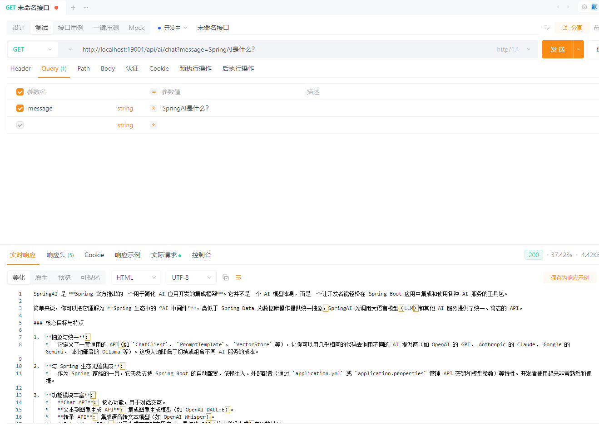
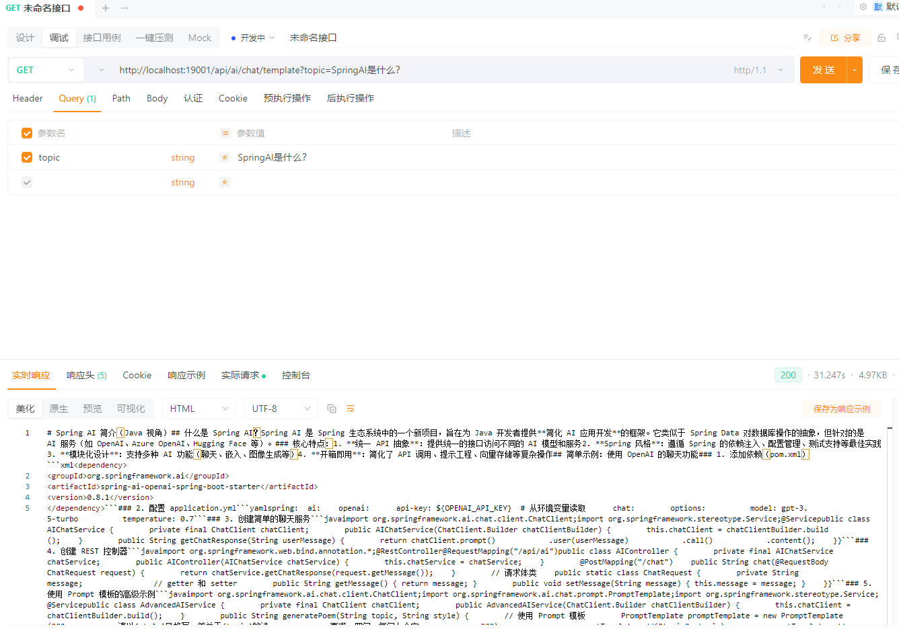

# Spring AI Alibaba

## 版本信息

| 组件             | 版本                                                         |
| ---------------- | ------------------------------------------------------------ |
| JDK              | 21                                                           |
| Maven            | 3.9.12                                                       |
| SpringBoot       | 3.5.10                                                       |
| SpringAI         | 1.1.2                                                        |
| SpringAI Alibaba | 1.1.2.1                                                      |
| Model            | [阿里云百炼](https://bailian.console.aliyun.com/cn-beijing/?tab=home#/home) |


------

## 基础配置

**添加依赖**

```xml
<properties>
    <spring-ai.version>1.1.2</spring-ai.version>
    <spring-ai-alibaba.version>1.1.2.0</spring-ai-alibaba.version>
</properties>
<dependencies>
    <!-- Spring AI Alibaba 依赖 -->
    <dependency>
        <groupId>com.alibaba.cloud.ai</groupId>
        <artifactId>spring-ai-alibaba-starter-dashscope</artifactId>
    </dependency>
</dependencies>
<dependencyManagement>
    <dependencies>
        <dependency>
            <groupId>org.springframework.ai</groupId>
            <artifactId>spring-ai-bom</artifactId>
            <version>${spring-ai.version}</version>
            <type>pom</type>
            <scope>import</scope>
        </dependency>
        <dependency>
            <groupId>com.alibaba.cloud.ai</groupId>
            <artifactId>spring-ai-alibaba-bom</artifactId>
            <version>${spring-ai-alibaba.version}</version>
            <type>pom</type>
            <scope>import</scope>
        </dependency>
        <dependency>
            <groupId>com.alibaba.cloud.ai</groupId>
            <artifactId>spring-ai-alibaba-extensions-bom</artifactId>
            <version>${spring-ai-alibaba.version}</version>
            <type>pom</type>
            <scope>import</scope>
        </dependency>
    </dependencies>
</dependencyManagement>
```

**编辑配置**

如果需要使用 OpenAI 的 API 来调用 DashScope，base-url 修改为：https://dashscope.aliyuncs.com/compatible-mode/v1

```yaml
---
# Spring AI 配置
spring:
  ai:
    dashscope:
      base-url: https://dashscope.aliyuncs.com
      api-key: ${DASHSCOPE_API_KEY}
      chat:
        options:
          model: deepseek-v3.2
```

**创建配置类**

```java
package io.github.atengk.ai.config;

import com.alibaba.cloud.ai.dashscope.chat.DashScopeChatModel;
import org.springframework.ai.chat.client.ChatClient;
import org.springframework.context.annotation.Bean;
import org.springframework.context.annotation.Configuration;
import org.springframework.context.annotation.Primary;

@Configuration
public class ChatClientConfig {

    @Bean("dashScopeChatClient")
    @Primary
    public ChatClient dashScopeChatClient(DashScopeChatModel dashScopeChatModel) {
        return ChatClient.create(dashScopeChatModel);
    }

}
```


## 基础使用

**controller创建**

```java
package io.github.atengk.ai.controller;

import lombok.RequiredArgsConstructor;
import org.springframework.ai.chat.client.ChatClient;
import org.springframework.web.bind.annotation.GetMapping;
import org.springframework.web.bind.annotation.RequestMapping;
import org.springframework.web.bind.annotation.RequestParam;
import org.springframework.web.bind.annotation.RestController;
import reactor.core.publisher.Flux;

@RestController
@RequestMapping("/api/ai")
@RequiredArgsConstructor
public class BaseChatController {

    private final ChatClient chatClient;

}
```

### 最基础的同步对话

```java
/**
 * 最基础的同步对话
 */
@GetMapping("/chat")
public String chat(@RequestParam String message) {
    return chatClient
            .prompt()
            .user(message)
            .call()
            .content();
}
```

GET /api/ai/chat?message=SpringAI是什么？



### 流式对话（SSE / WebFlux 场景）

```java
/**
 * 流式对话（SSE / WebFlux 场景）
 */
@GetMapping("/chat/stream")
public Flux<String> stream(@RequestParam String message) {
    return chatClient
            .prompt()
            .user(message)
            .stream()
            .content();
}
```

GET /api/ai/chat/stream?message=SpringAI是什么？


### 带 System Prompt 的基础用法

```java
/**
 * 带 System Prompt 的基础用法
 */
@GetMapping("/chat/system")
public String chatWithSystem(
        @RequestParam String system,
        @RequestParam String message) {

    return chatClient
            .prompt()
            .system(system)
            .user(message)
            .call()
            .content();
}
```

GET /api/ai/chat/system?system=你是一个Java专家&message=什么是SpringAI


### 使用 Prompt Template 的基础示例

```java
/**
 * 使用 Prompt Template 的基础示例
 */
@GetMapping("/chat/template")
public String chatWithTemplate(
        @RequestParam String topic,
        @RequestParam(defaultValue = "Java") String language) {

    return chatClient
            .prompt()
            .user(u -> u.text("""
                    请用 {language} 的视角，
                    解释一下 {topic}，
                    并给出一个简单示例
                    """)
                    .param("topic", topic)
                    .param("language", language)
            )
            .call()
            .content();
}
```

GET /api/ai/chat/template?topic=SpringAI是什么？




## Agent 使用

使用 Agent Framework 内置的 `ReactAgent` 抽象快速构建 Agent 应用。

### 基础配置

**添加依赖**

```xml
<!-- Spring AI Alibaba 依赖 -->
<dependency>
    <groupId>com.alibaba.cloud.ai</groupId>
    <artifactId>spring-ai-alibaba-starter-dashscope</artifactId>
</dependency>

<!-- Spring AI Alibaba Agent Framework -->
<dependency>
    <groupId>com.alibaba.cloud.ai</groupId>
    <artifactId>spring-ai-alibaba-agent-framework</artifactId>
</dependency>
```

### 基础使用

#### 创建 ReactAgent 配置类

**基础 ReactAgent**

```java
package io.github.atengk.ai.config;

import com.alibaba.cloud.ai.dashscope.chat.DashScopeChatModel;
import com.alibaba.cloud.ai.graph.agent.ReactAgent;
import com.alibaba.cloud.ai.graph.checkpoint.savers.MemorySaver;
import org.springframework.context.annotation.Bean;
import org.springframework.context.annotation.Configuration;

@Configuration
public class ReactAgentConfig {

    @Bean
    public ReactAgent reactAgent(DashScopeChatModel dashScopeChatModel) {
        return ReactAgent.builder()
                .name("default_agent")
                .model(dashScopeChatModel)
                .saver(new MemorySaver())
                .build();
    }

}

```

#### 使用 ReactAgent

**基础使用**

```java
package io.github.atengk.ai.controller;

import com.alibaba.cloud.ai.graph.agent.ReactAgent;
import com.alibaba.cloud.ai.graph.exception.GraphRunnerException;
import lombok.RequiredArgsConstructor;
import org.springframework.ai.chat.messages.AssistantMessage;
import org.springframework.web.bind.annotation.GetMapping;
import org.springframework.web.bind.annotation.RequestMapping;
import org.springframework.web.bind.annotation.RestController;

@RestController
@RequestMapping("/api/agent")
@RequiredArgsConstructor
public class ReactAgentController {

    private final ReactAgent reactAgent;

    @GetMapping("/simple")
    public String simple(String message) throws GraphRunnerException {
        AssistantMessage call = reactAgent.call(message);
        return call.getText();
    }

}

```

调用接口

```
GET /api/agent/simple?message=SpringAIAlibaba是什么？
```

### 使用 Tool

#### 创建 Tool 类

**天气查询工具**

```java
package io.github.atengk.ai.tool;

import com.fasterxml.jackson.annotation.JsonClassDescription;
import com.fasterxml.jackson.annotation.JsonInclude;
import com.fasterxml.jackson.annotation.JsonProperty;
import com.fasterxml.jackson.annotation.JsonPropertyDescription;

import java.util.function.Function;

/**
 * 根据城市名称获取天气信息工具
 *
 * @author 孔余
 * @since 2026-02-11
 */
public class WeatherTool
        implements Function<WeatherTool.Request, WeatherTool.Response> {

    @Override
    public WeatherTool.Response apply(WeatherTool.Request request) {

        String city = request.city;

        // 这里是模拟天气数据，实际项目可以改成调用第三方天气 API
        String weather = "晴";
        String temperature = "25°";

        return new Response(
                String.format("%s的天气是%s，温度%s",
                        city,
                        weather,
                        temperature));
    }

    @JsonInclude(JsonInclude.Include.NON_NULL)
    @JsonClassDescription("根据城市名称获取天气信息")
    public record Request(
            @JsonProperty(required = true, value = "city")
            @JsonPropertyDescription("城市名称，例如 重庆、北京")
            String city) {
    }

    @JsonClassDescription("天气查询结果")
    public record Response(String description) {
    }

}

```

**时区查询工具**

```java
package io.github.atengk.ai.tool;

import com.fasterxml.jackson.annotation.JsonClassDescription;
import com.fasterxml.jackson.annotation.JsonInclude;
import com.fasterxml.jackson.annotation.JsonProperty;
import com.fasterxml.jackson.annotation.JsonPropertyDescription;

import java.time.ZoneId;
import java.time.ZonedDateTime;
import java.time.format.DateTimeFormatter;
import java.util.function.Function;

/**
 * 根据时区获取当前时间工具
 *
 * @author 孔余
 * @since 2026-02-11
 */
public class TimeByZoneIdTool
        implements Function<TimeByZoneIdTool.Request, TimeByZoneIdTool.Response> {

    @Override
    public TimeByZoneIdTool.Response apply(TimeByZoneIdTool.Request request) {
        String timeZoneId = request.timeZoneId;
        ZonedDateTime zonedDateTime = ZonedDateTime.now(ZoneId.of(timeZoneId));
        DateTimeFormatter formatter = DateTimeFormatter.ofPattern("yyyy-MM-dd HH:mm:ss");
        String currentTime = zonedDateTime.format(formatter);
        return new Response(String.format("当前时区为 %s，当前时间为 %s",
                timeZoneId,
                currentTime));
    }

    @JsonInclude(JsonInclude.Include.NON_NULL)
    @JsonClassDescription("根据时区ID获取当前时间")
    public record Request(
            @JsonProperty(required = true, value = "timeZoneId")
            @JsonPropertyDescription("时区ID，例如 Asia/Shanghai")
            String timeZoneId) {
    }

    @JsonClassDescription("根据时区ID获取时间的响应结果")
    public record Response(String description) {
    }

}


```


#### 创建 ToolConfig 配置类

**创建 ToolCallback**

```java
package io.github.atengk.ai.config;

import io.github.atengk.ai.tool.TimeByZoneIdTool;
import io.github.atengk.ai.tool.WeatherTool;
import org.springframework.ai.tool.ToolCallback;
import org.springframework.ai.tool.function.FunctionToolCallback;
import org.springframework.context.annotation.Bean;
import org.springframework.context.annotation.Configuration;

@Configuration
public class ToolConfig {

    @Bean
    public ToolCallback weatherTool() {
        return FunctionToolCallback.builder("getWeather", new WeatherTool())
                .description("根据城市名称获取天气信息工具")
                .inputType(WeatherTool.Request.class)
                .build();
    }

    @Bean
    public ToolCallback timeByZoneIdTool() {
        return FunctionToolCallback.builder("getTimeByZoneId", new TimeByZoneIdTool())
                .description("根据时区获取当前时间工具")
                .inputType(TimeByZoneIdTool.Request.class)
                .build();
    }

}

```

#### 创建 ReactAgent 配置类

**带有 Tool 的 ReactAgent**

```java
package io.github.atengk.ai.config;

import com.alibaba.cloud.ai.dashscope.chat.DashScopeChatModel;
import com.alibaba.cloud.ai.graph.agent.ReactAgent;
import com.alibaba.cloud.ai.graph.checkpoint.savers.MemorySaver;
import org.springframework.ai.tool.ToolCallback;
import org.springframework.context.annotation.Bean;
import org.springframework.context.annotation.Configuration;

import java.util.List;

@Configuration
public class ReactAgentConfig {

    @Bean
    public ReactAgent toolReactAgent(
            DashScopeChatModel dashScopeChatModel,
            List<ToolCallback> toolCallbacks
    ) {
        return ReactAgent.builder()
                .name("tool_agent")
                .tools(toolCallbacks)
                .model(dashScopeChatModel)
                .saver(new MemorySaver())
                .build();
    }

}

```

#### 使用 ReactAgent

```java
package io.github.atengk.ai.controller;

import com.alibaba.cloud.ai.graph.agent.ReactAgent;
import com.alibaba.cloud.ai.graph.exception.GraphRunnerException;
import lombok.RequiredArgsConstructor;
import org.springframework.ai.chat.messages.AssistantMessage;
import org.springframework.web.bind.annotation.GetMapping;
import org.springframework.web.bind.annotation.RequestMapping;
import org.springframework.web.bind.annotation.RestController;

@RestController
@RequestMapping("/api/agent")
@RequiredArgsConstructor
public class ReactAgentController {

    private final ReactAgent toolReactAgent;

    @GetMapping("/tool")
    public String tool(String message) throws GraphRunnerException {
        AssistantMessage call = toolReactAgent.call(message);
        return call.getText();
    }

}

```

调用接口

```
GET /api/agent/tool?message=重庆的天气怎么样？
GET /api/agent/tool?message=中国的时间是多少？
```


## 多模型使用

### 基础配置

**添加依赖**

```xml
<!-- Spring AI Alibaba 依赖 -->
<dependency>
    <groupId>com.alibaba.cloud.ai</groupId>
    <artifactId>spring-ai-alibaba-starter-dashscope</artifactId>
</dependency>

<!-- Spring AI - OpenAI 依赖 -->
<dependency>
    <groupId>org.springframework.ai</groupId>
    <artifactId>spring-ai-starter-model-openai</artifactId>
</dependency>
```

**编辑配置**

```yaml
---
# Spring AI 配置
spring:
  ai:
    dashscope:
      base-url: https://dashscope.aliyuncs.com
      api-key: ${DASHSCOPE_API_KEY}
      chat:
        options:
          model: deepseek-v3.2
    openai:
      base-url: https://api.chatanywhere.tech
      api-key: ${OPENAI_API_KEY}
      chat:
        options:
          model: gpt-4o-mini
```

**创建配置类**

```java
package io.github.atengk.ai.config;

import com.alibaba.cloud.ai.dashscope.chat.DashScopeChatModel;
import org.springframework.ai.chat.client.ChatClient;
import org.springframework.ai.openai.OpenAiChatModel;
import org.springframework.context.annotation.Bean;
import org.springframework.context.annotation.Configuration;
import org.springframework.context.annotation.Primary;

@Configuration
public class ChatClientConfig {

    @Bean("dashScopeChatClient")
    @Primary
    public ChatClient dashScopeChatClient(DashScopeChatModel dashScopeChatModel) {
        return ChatClient.create(dashScopeChatModel);
    }

    @Bean("openAiChatClient")
    public ChatClient openAiChatClient(OpenAiChatModel openAiChatModel) {
        return ChatClient.create(openAiChatModel);
    }

}
```

### 创建策略和工厂

#### 创建枚举

```java
package io.github.atengk.ai.enums;

public enum AiModelType {

    OPENAI("openAiChatClient"),
    DASHSCOPE("dashScopeChatClient");

    private final String chatClientBeanName;

    AiModelType(String chatClientBeanName) {
        this.chatClientBeanName = chatClientBeanName;
    }

    public String getBeanName() {
        return chatClientBeanName;
    }
}

```

#### 创建策略

```java
package io.github.atengk.ai.service;

import io.github.atengk.ai.enums.AiModelType;
import org.springframework.ai.chat.client.ChatClient;

public interface ChatClientStrategy {

    /**
     * 当前策略支持的模型类型
     *
     * @return AiModelType
     */
    AiModelType getModelType();

    /**
     * 返回对应的 ChatClient
     *
     * @return ChatClient
     */
    ChatClient getChatClient();
}

```

#### 策略实现 DashScope

```java
package io.github.atengk.ai.service.strategy;

import io.github.atengk.ai.enums.AiModelType;
import io.github.atengk.ai.service.ChatClientStrategy;
import org.springframework.ai.chat.client.ChatClient;
import org.springframework.beans.factory.annotation.Qualifier;
import org.springframework.stereotype.Component;

@Component
public class DashScopeChatClientStrategy implements ChatClientStrategy {

    private final ChatClient chatClient;

    public DashScopeChatClientStrategy(
            @Qualifier("dashScopeChatClient") ChatClient chatClient) {
        this.chatClient = chatClient;
    }

    @Override
    public AiModelType getModelType() {
        return AiModelType.DASHSCOPE;
    }

    @Override
    public ChatClient getChatClient() {
        return chatClient;
    }
}


```

#### 策略实现 OpenAi

```java
package io.github.atengk.ai.service.strategy;

import io.github.atengk.ai.enums.AiModelType;
import io.github.atengk.ai.service.ChatClientStrategy;
import org.springframework.ai.chat.client.ChatClient;
import org.springframework.beans.factory.annotation.Qualifier;
import org.springframework.stereotype.Component;

@Component
public class OpenAiChatClientStrategy implements ChatClientStrategy {

    private final ChatClient chatClient;

    public OpenAiChatClientStrategy(
            @Qualifier("openAiChatClient") ChatClient chatClient) {
        this.chatClient = chatClient;
    }

    @Override
    public AiModelType getModelType() {
        return AiModelType.OPENAI;
    }

    @Override
    public ChatClient getChatClient() {
        return chatClient;
    }
}


```

#### 创建工厂

```java
package io.github.atengk.ai.service;

import io.github.atengk.ai.enums.AiModelType;
import org.springframework.ai.chat.client.ChatClient;
import org.springframework.stereotype.Component;

import java.util.Map;

@Component
public class ChatClientFactory {

    private final Map<String, ChatClient> chatClientMap;

    public ChatClientFactory(Map<String, ChatClient> chatClientMap) {
        this.chatClientMap = chatClientMap;
    }

    public ChatClient getClient(AiModelType modelType) {
        ChatClient client = chatClientMap.get(modelType.getBeanName());
        if (client == null) {
            throw new IllegalArgumentException(
                    "No ChatClient bean named: " + modelType.getBeanName());
        }
        return client;
    }

}

```

### 使用多模型

#### 创建服务

```java
package io.github.atengk.ai.service;

import io.github.atengk.ai.enums.AiModelType;
import org.springframework.stereotype.Service;

@Service
public class ChatClientService {

    private final ChatClientFactory factory;

    public ChatClientService(ChatClientFactory factory) {
        this.factory = factory;
    }

    public String chat(AiModelType modelType, String prompt) {
        return factory.getClient(modelType)
                .prompt(prompt)
                .call()
                .content();
    }
}

```

#### 创建接口

```java
package io.github.atengk.ai.controller;

import io.github.atengk.ai.enums.AiModelType;
import io.github.atengk.ai.service.ChatClientService;
import org.springframework.web.bind.annotation.GetMapping;
import org.springframework.web.bind.annotation.RequestMapping;
import org.springframework.web.bind.annotation.RequestParam;
import org.springframework.web.bind.annotation.RestController;

@RestController
@RequestMapping("/api/ai")
public class ChatClientController {

    private final ChatClientService chatClientService;

    public ChatClientController(ChatClientService chatClientService) {
        this.chatClientService = chatClientService;
    }

    @GetMapping("/chat")
    public String chat(
            @RequestParam(defaultValue = "DASHSCOPE") AiModelType model,
            @RequestParam String prompt) {

        return chatClientService.chat(model, prompt);
    }
}

```

#### 使用接口

```java
GET /api/ai/chat?model=DASHSCOPE&prompt=SpringAI是什么？
GET /api/ai/chat?model=OPENAI&prompt=SpringAI是什么？
```

