# Spring AI

## 版本信息

| 组件       | 版本                                     |
| ---------- | ---------------------------------------- |
| JDK        | 21                                       |
| Maven      | 3.9.12                                   |
| SpringBoot | 3.5.10                                   |
| SpringAI   | 1.1.2                                    |
| Model      | OpenAI（DeepSeek、Qwen 兼容 OpenAI API） |


------

## 基础配置

**添加依赖**

```xml
<properties>
    <spring-ai.version>1.1.2</spring-ai.version>
</properties>
<dependencies>
    <!-- Spring AI - OpenAI 依赖 -->
    <dependency>
        <groupId>org.springframework.ai</groupId>
        <artifactId>spring-ai-starter-model-openai</artifactId>
    </dependency>
</dependencies>
<dependencyManagement>
    <dependencies>
        <dependency>
            <groupId>org.springframework.ai</groupId>
            <artifactId>spring-ai-bom</artifactId>
            <version>${spring-ai.version}</version>
            <type>pom</type>
            <scope>import</scope>
        </dependency>
    </dependencies>
</dependencyManagement>
```

**编辑配置**

免费使用 API Key：[GPT_API_free](https://github.com/chatanywhere/GPT_API_free)

```yaml
---
# Spring AI 配置
spring:
  ai:
    openai:
      base-url: https://api.chatanywhere.tech
      api-key: ${OPENAI_API_KEY}
      chat:
        options:
          model: gpt-4o-mini
```

## 基础使用

**controller创建**

```java
package io.github.atengk.ai.controller;

import org.springframework.ai.chat.client.ChatClient;
import org.springframework.web.bind.annotation.GetMapping;
import org.springframework.web.bind.annotation.RequestMapping;
import org.springframework.web.bind.annotation.RequestParam;
import org.springframework.web.bind.annotation.RestController;
import reactor.core.publisher.Flux;

@RestController
@RequestMapping("/api/ai")
public class BaseChatController {

    private final ChatClient chatClient;

    public BaseChatController(ChatClient.Builder chatClientBuilder) {
        this.chatClient = chatClientBuilder.build();
    }

}
```

### 最基础的同步对话

```java
/**
 * 最基础的同步对话
 */
@GetMapping("/chat")
public String chat(@RequestParam String message) {
    return chatClient
            .prompt()
            .user(message)
            .call()
            .content();
}
```

GET /api/ai/chat?message=SpringAI是什么？


### 流式对话（SSE / WebFlux 场景）

```java
/**
 * 流式对话（SSE / WebFlux 场景）
 */
@GetMapping("/chat/stream")
public Flux<String> stream(@RequestParam String message) {
    return chatClient
            .prompt()
            .user(message)
            .stream()
            .content();
}
```

GET /api/ai/chat/stream?message=SpringAI是什么？


### 带 System Prompt 的基础用法

```java
/**
 * 带 System Prompt 的基础用法
 */
@GetMapping("/chat/system")
public String chatWithSystem(
        @RequestParam String system,
        @RequestParam String message) {

    return chatClient
            .prompt()
            .system(system)
            .user(message)
            .call()
            .content();
}
```

GET /api/ai/chat/system?system=你是一个Java专家&message=什么是SpringAI


### 使用 Prompt Template 的基础示例

```java
/**
 * 使用 Prompt Template 的基础示例
 */
@GetMapping("/chat/template")
public String chatWithTemplate(
        @RequestParam String topic,
        @RequestParam(defaultValue = "Java") String language) {

    return chatClient
            .prompt()
            .user(u -> u.text("""
                    请用 {language} 的视角，
                    解释一下 {topic}，
                    并给出一个简单示例
                    """)
                    .param("topic", topic)
                    .param("language", language)
            )
            .call()
            .content();
}
```

GET /api/ai/chat/template?topic=SpringAI是什么？


## Prompt 与模型参数管理

在实际项目中，Prompt 和模型参数如果缺乏统一管理，往往会出现**难以维护、行为不可控、无法复用**等问题。本章节从工程实践角度，介绍如何对 Prompt 与模型参数进行系统化管理。

---

### 为什么需要 Prompt 管理

在简单示例中，将 Prompt 直接写在 Controller 或 Service 中是可以接受的，但在真实项目中会逐渐暴露问题：

* Prompt 分散在各个类中，难以统一修改
* 相同的 System Prompt 被多次复制
* Prompt 的职责与业务逻辑耦合，降低可读性
* Prompt 无法版本化，模型行为不可追溯

因此，在工程实践中应当将 Prompt 视为**一种配置资源**，而不是普通字符串。

**核心目标：**

* Prompt 可集中定义
* Prompt 可复用、可演进
* Prompt 与业务逻辑解耦

---

### System Prompt 的集中定义

System Prompt 用于定义模型的角色、边界和回答风格，通常在多个接口或业务场景中复用。

推荐将 System Prompt 统一集中管理，例如：

```java
package io.github.atengk.ai.prompt;

/**
 * 系统级 Prompt 定义
 */
public final class SystemPrompts {

    private SystemPrompts() {
    }

    /**
     * Java 专家角色
     */
    public static final String JAVA_EXPERT = """
            你是一名资深 Java 架构师，
            回答应遵循最佳实践，
            代码示例需清晰、简洁、易于理解。
            """;

    /**
     * 技术文档编写专家
     */
    public static final String TECH_WRITER = """
            你是一名技术文档专家，
            请用清晰、严谨且通俗的语言解释概念，
            避免不必要的营销化表达。
            """;
}
```

在使用时，仅引用对应的 Prompt，而不是直接编写字符串：

```java
chatClient
        .prompt()
        .system(SystemPrompts.JAVA_EXPERT)
        .user(message)
        .call()
        .content();
```

这样可以保证 System Prompt 的**一致性和可维护性**。

---

### Prompt Template 的工程化使用

当 Prompt 中包含动态变量时，推荐使用 Prompt Template，并将其进行统一管理。

示例：定义 Prompt 模板枚举

```java
package io.github.atengk.ai.prompt;

/**
 * Prompt 模板定义
 */
public enum PromptTemplates {

    EXPLAIN_TOPIC("""
            请用 {language} 的视角，
            解释 {topic}，
            并给出一个简单示例。
            """),

    CODE_REVIEW("""
            请对以下代码进行审查，
            指出潜在问题并给出改进建议：
            {code}
            """);

    private final String template;

    PromptTemplates(String template) {
        this.template = template;
    }

    public String template() {
        return template;
    }
}
```

使用时只需关注参数填充，而无需关心 Prompt 的具体内容：

```java
chatClient
        .prompt()
        .user(u -> u.text(PromptTemplates.EXPLAIN_TOPIC.template())
                .param("topic", topic)
                .param("language", language)
        )
        .call()
        .content();
```

这种方式可以显著提升 Prompt 的**复用性和可读性**。

---

### 模型参数（temperature / top_p）的场景化配置

模型参数直接影响 AI 的回答风格，例如：

* `temperature`：控制随机性
* `top_p`：控制输出多样性
* `max_tokens`：限制响应长度

不建议在代码中随意硬编码这些参数，而应根据**业务场景**进行抽象。

示例：定义模型参数配置

```java
package io.github.atengk.ai.model;

import org.springframework.ai.chat.ChatOptions;
import org.springframework.ai.openai.OpenAiChatOptions;

/**
 * 模型参数配置
 */
public enum ModelProfiles {

    DEFAULT(OpenAiChatOptions.builder().build()),

    PRECISE(OpenAiChatOptions.builder()
            .temperature(0.1)
            .build()),

    CREATIVE(OpenAiChatOptions.builder()
            .temperature(0.9)
            .topP(0.95)
            .build());

    private final ChatOptions options;

    ModelProfiles(ChatOptions options) {
        this.options = options;
    }

    public ChatOptions options() {
        return options;
    }
}
```

在调用时根据业务需求选择合适的参数配置：

```java
chatClient
        .prompt()
        .options(ModelProfiles.PRECISE.options())
        .user(message)
        .call()
        .content();
```

这样可以避免“凭感觉调参数”的问题，使模型行为更加稳定可控。

---

### Prompt、模型参数与对话记忆的关系

在 Spring AI 中，这三者的职责应当明确区分：

* **System Prompt**：定义模型角色和行为边界
* **Prompt Template**：定义一次请求的输入结构
* **模型参数**：控制模型输出风格与稳定性
* **对话记忆（Chat Memory）**：维持上下文连续性

需要注意的是：

> **对话记忆不应承担规则或角色定义，规则应由 System Prompt 负责。**

一个推荐的组合方式是：

* System Prompt：固定角色
* Prompt Template：当前问题结构
* Model Profile：场景化参数
* Chat Memory：上下文连续对话

这一设计为下一章节的**对话记忆机制**提供了清晰的职责边界。

---


## 对话记忆

**添加依赖**

```xml
<!-- Spring AI JDBC Chat Memory -->
<dependency>
    <groupId>org.springframework.ai</groupId>
    <artifactId>spring-ai-starter-model-chat-memory-repository-jdbc</artifactId>
</dependency>

<!-- HikariCP 数据源 依赖 -->
<dependency>
    <groupId>com.zaxxer</groupId>
    <artifactId>HikariCP</artifactId>
</dependency>

<!-- MySQL数据库驱动 -->
<dependency>
    <groupId>com.mysql</groupId>
    <artifactId>mysql-connector-j</artifactId>
</dependency>
```

**编辑配置**

初始化表结构

```java
spring:
  ai:
    chat:
      memory:
        repository:
          jdbc:
            initialize-schema: always
```

**配置 ChatClientConfig**

```java
package io.github.atengk.ai.config;

import org.springframework.ai.chat.client.ChatClient;
import org.springframework.ai.chat.client.advisor.MessageChatMemoryAdvisor;
import org.springframework.ai.chat.memory.ChatMemory;
import org.springframework.context.annotation.Bean;
import org.springframework.context.annotation.Configuration;

@Configuration
public class ChatClientConfig {

    @Bean
    public ChatClient chatClient(
            ChatClient.Builder builder,
            ChatMemory chatMemory) {

        return builder
                .defaultAdvisors(
                        MessageChatMemoryAdvisor
                                .builder(chatMemory)
                                .build()
                )
                .build();
    }

}
```

**创建接口**

```java
package io.github.atengk.ai.controller;

import lombok.RequiredArgsConstructor;
import org.springframework.ai.chat.client.ChatClient;
import org.springframework.ai.chat.memory.ChatMemory;
import org.springframework.web.bind.annotation.GetMapping;
import org.springframework.web.bind.annotation.RequestMapping;
import org.springframework.web.bind.annotation.RequestParam;
import org.springframework.web.bind.annotation.RestController;

@RestController
@RequestMapping("/api/ai/memory")
@RequiredArgsConstructor
public class MemoryChatController {

    private final ChatClient chatClient;

    @GetMapping("/chat")
    public String chat(
            @RequestParam String conversationId,
            @RequestParam String message) {

        return chatClient
                .prompt()
                .user(message)
                .advisors(a ->
                        a.param(ChatMemory.CONVERSATION_ID, conversationId)
                )
                .call()
                .content();
    }

}
```

**使用接口**

```
GET /api/ai/memory/chat?conversationId=001&message=我叫阿腾
GET /api/ai/memory/chat?conversationId=001&message=我叫什么？
```

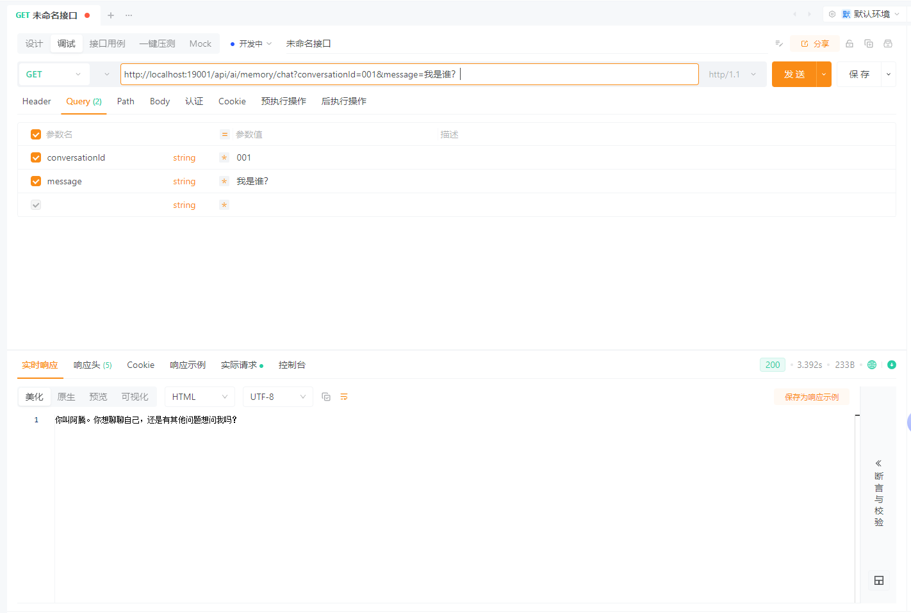

查看MySQL数据

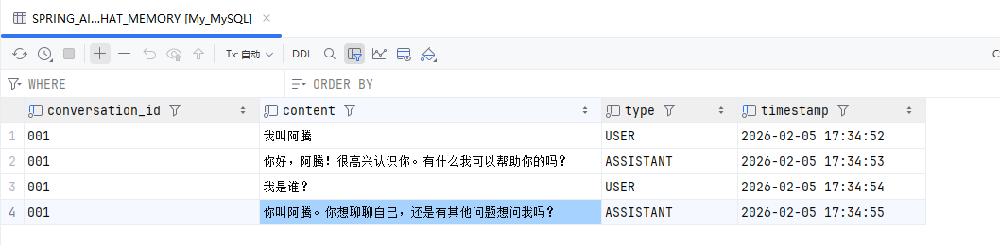


## Tool Calling：让 AI 调用代码

Tool Calling（工具调用）允许 AI 在对话过程中，根据上下文**主动调用后端方法**，从而将自然语言请求转化为真实的业务操作。这一机制非常适合用于查询、计算、规则判断等场景。

------

**为什么需要 Tool Calling**

在没有 Tool Calling 的情况下，AI 只能“回答问题”，却无法参与真实业务流程，例如：

- 查询数据库中的用户信息
- 计算订单金额
- 获取当前时间或系统状态
- 执行业务规则校验

Tool Calling 的目标是：

> **让 AI 决定“要不要调用代码”，而不是“直接生成结果”。**

### 创建 Tools 

```java
package io.github.atengk.ai.tool;

import lombok.extern.slf4j.Slf4j;
import org.springframework.ai.tool.annotation.Tool;
import org.springframework.stereotype.Component;

import java.time.LocalDateTime;

/**
 * 通用工具
 */
@Component
@Slf4j
public class CommonTools {

    @Tool(description = "获取当前系统时间")
    public String currentTime() {
        log.info("调用了 [{}] 的方法", "获取当前系统时间");
        return LocalDateTime.now().toString();
    }

    @Tool(description = "计算两个整数的和")
    public int sum(int a, int b) {
        log.info("调用了 [{}] 的方法", "计算两个整数的和");
        return a + b;
    }

    @Tool(description = "根据用户ID查询用户名称")
    public String findUserName(Long userId) {
        log.info("调用了 [{}] 的方法", "根据用户ID查询用户名称");
        return "ateng";
    }

    @Tool(description = "判断用户是否成年")
    public boolean isAdult(int age) {
        log.info("调用了 [{}] 的方法", "判断用户是否成年");
        return age >= 18;
    }

}
```

### 注册 Tools

#### 全局注册

```java
package io.github.atengk.ai.config;

import io.github.atengk.ai.tool.CommonTools;
import lombok.RequiredArgsConstructor;
import org.springframework.ai.chat.client.ChatClient;
import org.springframework.ai.chat.client.advisor.MessageChatMemoryAdvisor;
import org.springframework.ai.chat.memory.ChatMemory;
import org.springframework.context.annotation.Bean;
import org.springframework.context.annotation.Configuration;

@Configuration
@RequiredArgsConstructor
public class ChatClientConfig {

    private final CommonTools commonTools;

    @Bean
    public ChatClient chatClient(
            ChatClient.Builder builder,
            ChatMemory chatMemory) {

        return builder
                .defaultTools(commonTools)
                .defaultAdvisors(
                        MessageChatMemoryAdvisor
                                .builder(chatMemory)
                                .build()
                )
                .build();
    }

}
```

#### 局部注册

```java
package io.github.atengk.ai.controller;

import io.github.atengk.ai.tool.CommonTools;
import lombok.RequiredArgsConstructor;
import org.springframework.ai.chat.client.ChatClient;
import org.springframework.web.bind.annotation.GetMapping;
import org.springframework.web.bind.annotation.RequestMapping;
import org.springframework.web.bind.annotation.RequestParam;
import org.springframework.web.bind.annotation.RestController;

@RestController
@RequiredArgsConstructor
@RequestMapping("/api/ai/tool")
public class ToolChatController {

    private final ChatClient chatClient;
    private final CommonTools commonTools;

    /**
     * 最基础的同步对话
     */
    @GetMapping("/chat")
    public String chat(@RequestParam String message) {
        return chatClient
                .prompt()
                .tools(commonTools)
                .system("""
                        你可以在必要时调用系统提供的工具，
                        工具的返回结果是可信的，
                        不要自行编造结果。
                        """)
                .user(message)
                .call()
                .content();
    }

}
```

### 使用 Tool

```
GET /api/ai/tool/chat?message=现在的时间是？
```

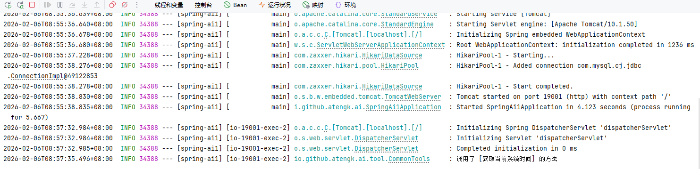

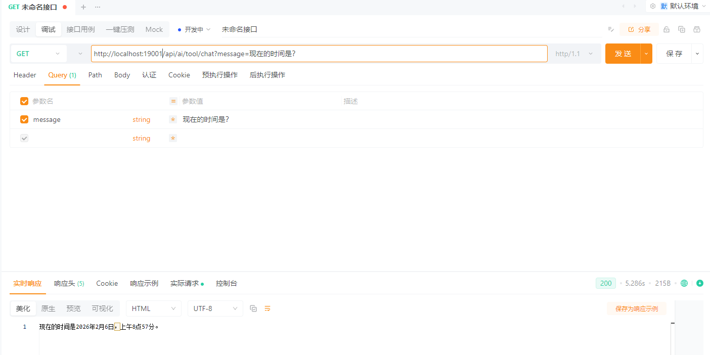

```
GET /api/ai/tool/chat?message=1加1等于几？
```

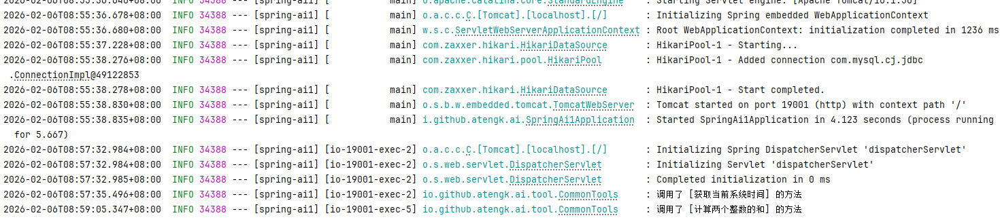

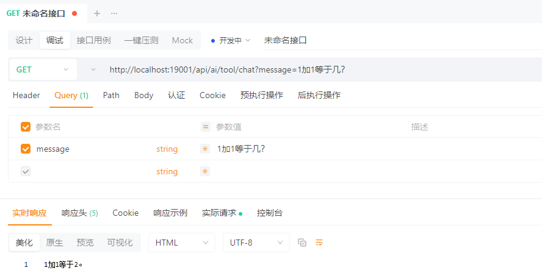

```
GET /api/ai/tool/chat?message=我的ID是10010，我的用户名称是什么？
```

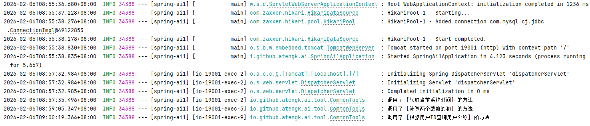

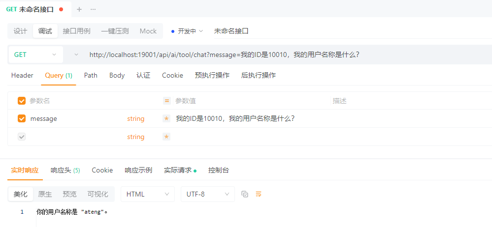

```
GET /api/ai/tool/chat?message=我的年龄是25岁，请问是是否成年了？
```

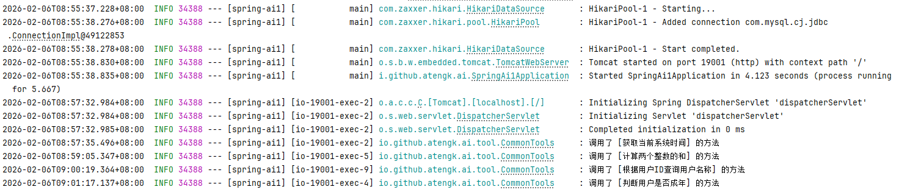

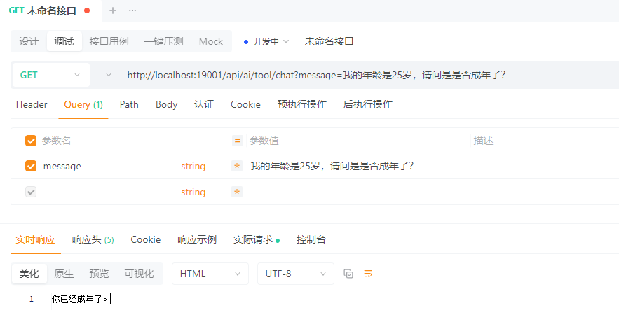

---


## RAG：接入企业知识库

RAG（Retrieval-Augmented Generation，检索增强生成）用于在模型回答问题前，引入**外部知识内容**，从而避免模型“凭空回答”或依赖过期知识。

在 Spring AI 中，RAG 的核心思想是：

> **先检索，再生成，而不是直接让模型回答。**

------

**RAG 的基本组成**

一个最小可用的 RAG 流程包含三个部分：

- **文档（Document）**：知识的基本载体
- **向量存储（VectorStore）**：用于相似度检索
- **检索增强 Advisor**：将检索结果注入 Prompt

### 基础配置

**添加依赖**

```xml
<!-- Spring AI Milvus Vector Store -->
<dependency>
    <groupId>org.springframework.ai</groupId>
    <artifactId>spring-ai-starter-vector-store-milvus</artifactId>
</dependency>
```

**编辑配置**

```yaml
spring:
  ai:
    vectorstore:
      milvus:
        initialize-schema: true
        database-name: default
        collection-name: spring_ai_knowledge_ateng
        embedding-dimension: 1536
        metric-type: COSINE
        index-type: IVF_FLAT
        index-parameters: '{"nlist":1024}'

        id-field-name: id
        content-field-name: content
        metadata-field-name: metadata
        embedding-field-name: embedding

        auto-id: false

        client:
          host: 175.178.193.128
          port: 20016
          username: root
          password: Milvus
          secure: false

```

### 知识库初始化

知识库初始化、手工知识录入

#### 创建实体类

```java
package io.github.atengk.ai.entity;

import lombok.Data;

import java.util.List;
import java.util.Map;

@Data
public class RagIngestRequest {

    private List<String> texts;

    private Map<String, Object> metadata;

}
```

#### 创建Service

```java
package io.github.atengk.ai.service;

import io.github.atengk.ai.entity.RagIngestRequest;
import lombok.RequiredArgsConstructor;
import org.springframework.ai.document.Document;
import org.springframework.ai.vectorstore.SearchRequest;
import org.springframework.ai.vectorstore.VectorStore;
import org.springframework.ai.vectorstore.filter.Filter;
import org.springframework.stereotype.Service;

import java.util.List;
import java.util.Map;
import java.util.stream.Collectors;

@Service
@RequiredArgsConstructor
public class RagIngestService {

    private final VectorStore vectorStore;

    /**
     * 批量写入知识
     */
    public int ingest(RagIngestRequest request) {
        List<Document> documents = request.getTexts()
                .stream()
                .map(text -> new Document(text, buildMetadata(request.getMetadata())))
                .collect(Collectors.toList());

        vectorStore.add(documents);
        return documents.size();
    }

    /**
     * 单条写入，方便测试
     */
    public void ingestSingle(String text, Map<String, Object> metadata) {
        vectorStore.add(List.of(new Document(text, buildMetadata(metadata))));
    }

    /**
     * 简单相似度查询，用于验证 RAG 是否生效
     */
    public List<Document> search(String query, int topK) {
        SearchRequest request = SearchRequest.builder()
                .query(query)
                .topK(topK)
                .build();

        return vectorStore.similaritySearch(request);
    }

    /**
     * 清空知识库（危险操作，慎用）
     */
    public void clearAll() {
        Filter.Expression expression =
                new Filter.Expression(
                        Filter.ExpressionType.EQ,
                        new Filter.Key("category"),
                        new Filter.Value("spring-ai")
                );

        vectorStore.delete(expression);
    }

    private Map<String, Object> buildMetadata(Map<String, Object> metadata) {
        return metadata == null ? Map.of() : metadata;
    }
}
```

#### 创建Controller

```java
package io.github.atengk.ai.controller;

import io.github.atengk.ai.entity.RagIngestRequest;
import io.github.atengk.ai.service.RagIngestService;
import lombok.RequiredArgsConstructor;
import org.springframework.ai.document.Document;
import org.springframework.web.bind.annotation.*;

import java.util.List;
import java.util.Map;

@RestController
@RequestMapping("/rag")
@RequiredArgsConstructor
public class RagIngestController {

    private final RagIngestService ragIngestService;

    /**
     * 批量写入
     */
    @PostMapping("/ingest")
    public Map<String, Object> ingest(@RequestBody RagIngestRequest request) {
        int count = ragIngestService.ingest(request);
        return Map.of(
                "status", "OK",
                "count", count
        );
    }

    /**
     * 单条写入
     */
    @PostMapping("/ingest/single")
    public String ingestSingle(@RequestParam String text) {
        ragIngestService.ingestSingle(text, null);
        return "OK";
    }

    /**
     * 简单查询，验证 RAG
     */
    @GetMapping("/search")
    public List<Document> search(
            @RequestParam String query,
            @RequestParam(defaultValue = "3") int topK
    ) {
        return ragIngestService.search(query, topK);
    }

    /**
     * 清空知识库
     */
    @DeleteMapping("/clear")
    public String clear() {
        ragIngestService.clearAll();
        return "CLEARED";
    }
}
```

#### 录入知识

```
POST /rag/ingest
Content-Type: application/json

{
  "texts": [
    "Spring AI 是 Spring 官方推出的 AI 应用开发框架",
    "Spring AI 支持 RAG、Tool Calling、Chat Memory"
  ],
  "metadata": {
    "source": "manual",
    "category": "spring-ai"
  }
}
```

#### 查询验证

```
GET /rag/search?query=Spring AI 支持什么能力
```

#### 清空数据

```
DELETE /rag/clear
```


### RAG 对话接口

**创建接口**

```java
package io.github.atengk.ai.controller;

import io.github.atengk.ai.service.RagIngestService;
import lombok.RequiredArgsConstructor;
import lombok.extern.slf4j.Slf4j;
import org.springframework.ai.chat.client.ChatClient;
import org.springframework.ai.document.Document;
import org.springframework.web.bind.annotation.*;

import java.util.List;

/**
 * RAG 对话接口
 */
@RestController
@RequiredArgsConstructor
@RequestMapping("/api/ai/rag")
@Slf4j
public class RagChatController {

    private final ChatClient chatClient;
    private final RagIngestService ragIngestService;

    @GetMapping("/chat")
    public String chat(@RequestParam String question) {

        // 从 Milvus 检索
        List<Document> documents = ragIngestService.search(question, 5);

        // 拼上下文
        String context = buildContext(documents);


        // 构建 Prompt
        String prompt = """
                你是一个专业助手，请基于以下已知内容回答问题。
                如果无法从内容中得到答案，请明确说明不知道。

                【已知内容】
                %s

                【用户问题】
                %s
                """.formatted(context, question);

        // 调用模型
        log.info(prompt);
        return chatClient.prompt(prompt).call().content();
    }

    private String buildContext(List<Document> documents) {
        StringBuilder builder = new StringBuilder();
        for (int i = 0; i < documents.size(); i++) {
            builder.append("[").append(i + 1).append("] ")
                    .append(documents.get(i).getText())
                    .append("\n");
        }
        return builder.toString();
    }

}
```

**调用接口**

```
POST /api/ai/rag/chat?question=Spring AI 支持哪些核心能力？
```


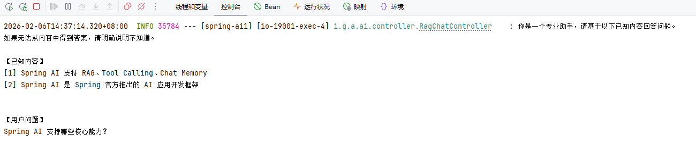


## 接入 MCP Server

MCP Server 开发参考：[链接](/work/Ateng-Java/ai/spring-ai1-mcp-server/)

### 基础配置

**添加依赖**

```xml
<!-- Spring AI MCP Client 依赖 -->
<dependency>
    <groupId>org.springframework.ai</groupId>
    <artifactId>spring-ai-starter-mcp-client</artifactId>
</dependency>
```

**添加配置**

```yaml
spring:
  ai:
    mcp:
      client:
        sse:
          connections:
            local-mcp:
              url: http://localhost:19002
              sse-endpoint: /sse
        name: ateng-mcp-client
        version: 1.0.0
```

**注册 ToolCallbackProvider**

让 Client 能发现 MCP Server + 拿到 Tool 元数据

```java
@Configuration
@RequiredArgsConstructor
public class ChatClientConfig {

    @Bean
    public ChatClient mcpServerChatClient(
            ChatClient.Builder builder,
            ToolCallbackProvider mcpToolCallbackProvider) {

        return builder
                .defaultToolCallbacks(mcpToolCallbackProvider)
                .build();
    }

}
```

### 创建接口

```java
package io.github.atengk.ai.controller;

import io.github.atengk.ai.tool.CommonTools;
import lombok.RequiredArgsConstructor;
import org.springframework.ai.chat.client.ChatClient;
import org.springframework.web.bind.annotation.GetMapping;
import org.springframework.web.bind.annotation.RequestMapping;
import org.springframework.web.bind.annotation.RequestParam;
import org.springframework.web.bind.annotation.RestController;

@RestController
@RequiredArgsConstructor
@RequestMapping("/api/ai/mcp-server")
public class McpServerChatController {

    private final ChatClient mcpServerChatClient;

    /**
     * 最基础的同步对话
     */
    @GetMapping("/chat")
    public String chat(@RequestParam String message) {
        return mcpServerChatClient
                .prompt()
                .system("""
                        你可以在必要时调用系统提供的工具，
                        工具的返回结果是可信的，
                        不要自行编造结果。
                        """)
                .user(message)
                .call()
                .content();
    }

}
```

```
GET /api/ai/mcp-server/chat?message=计算1 和 99 的和是多少？ 
```

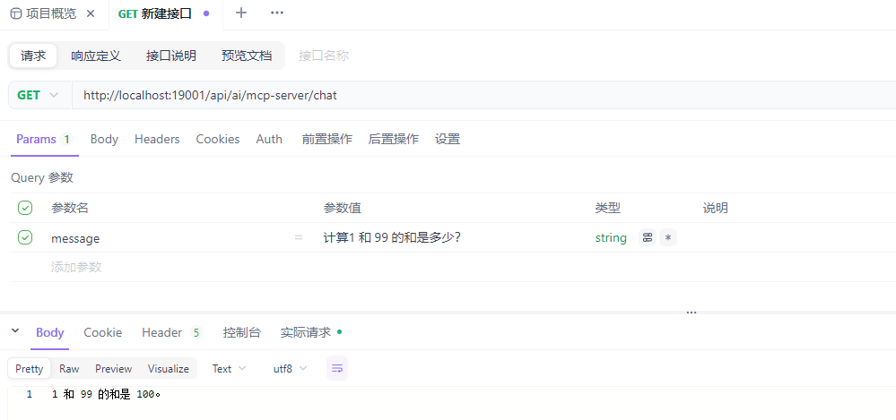

MCP Server 被调用 Tool 的日志

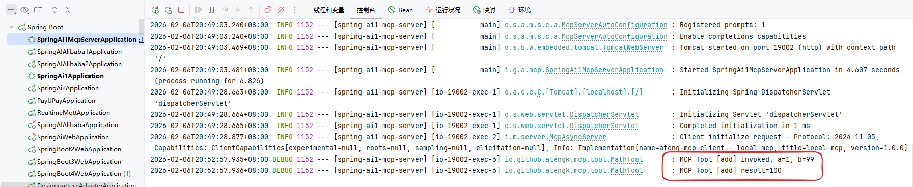


```
GET /api/ai/mcp-server/chat?message=请告诉我重庆的气温
```


## 结构化输出


### 1️⃣ Spring AI 核心概念

- 模型抽象（Chat / Embedding / Image / Audio）
- Prompt 与 Message 体系
- Token 与上下文窗口
- 结构化输出的意义

------

### 2️⃣ ChatClient 深入使用

- System / User / Assistant Message
- Prompt Template
- 多轮对话
- 上下文管理与 Memory

------

### 3️⃣ 结构化输出

- JSON 输出约束
- 映射为 Java DTO
- 错误处理与校验策略

------

### 4️⃣ Embedding 与向量化

- 什么是 Embedding
- 向量相似度搜索
- 向量数据库选型

------

### 5️⃣ RAG（检索增强生成）

- RAG 架构原理
- 文档切分与索引
- 检索策略
- Prompt 组合方式

------

### 6️⃣ Tool Calling（工具调用）

- 工具定义
- 参数 Schema
- 模型调用流程
- 与业务系统集成模式

------

### 7️⃣ AI 评估与调优

- Evaluator 使用
- 相关性评估
- Prompt 与 RAG 优化思路

------

### 8️⃣ Spring AI 与 Spring 生态集成

- Spring Boot 自动配置
- 配置管理与多环境
- 测试策略
- 可观测性（日志 / 指标）

------

### 9️⃣ 典型应用场景

- 企业知识库
- 智能客服
- AI Copilot
- AI + 微服务架构

------

### 🔟 升级与演进

- 1.x → 2.0 迁移要点
- 模型切换策略
- 架构演进建议

------

