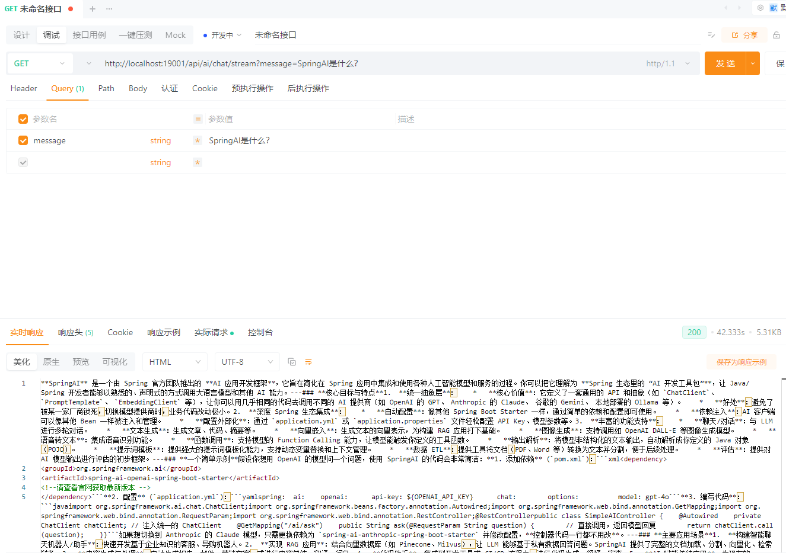
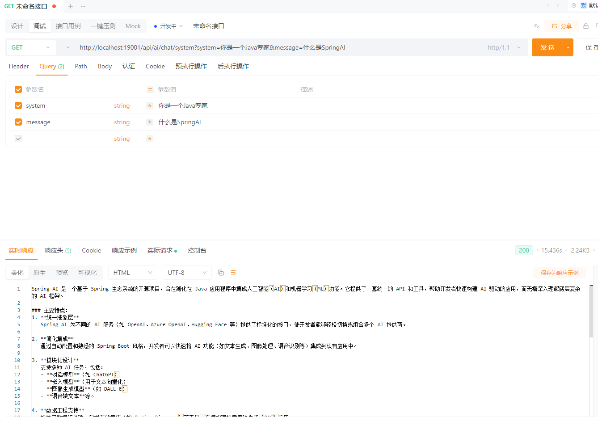
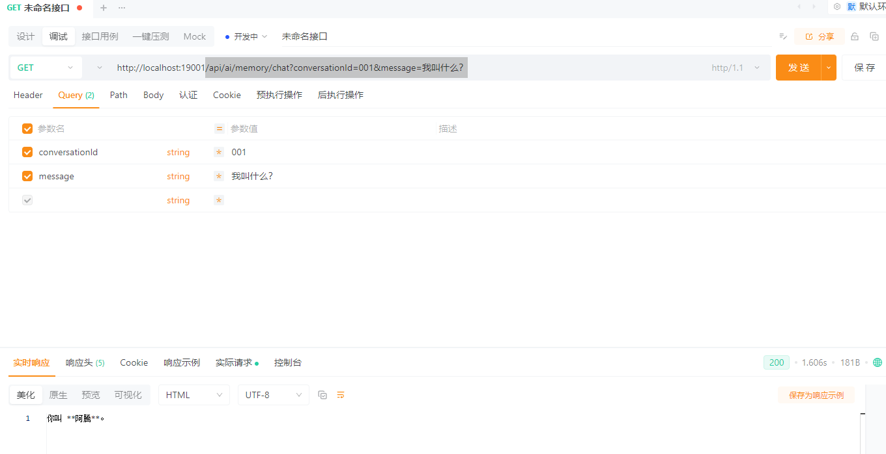
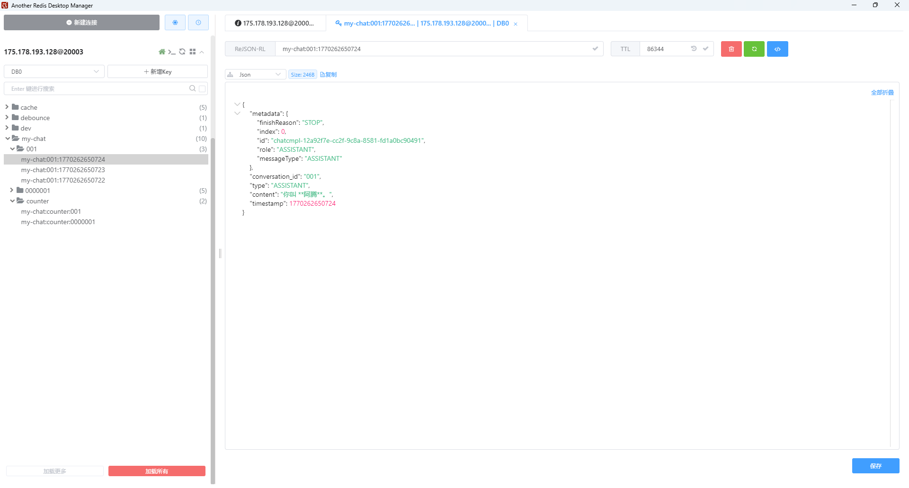

# Spring AI

## 版本信息

| 组件       | 版本                  |
| ---------- | --------------------- |
| JDK        | 25                    |
| Maven      | 3.9.12                |
| SpringBoot | 4.0.2                 |
| SpringAI   | 2.0.0-M2 （等后续GA） |


------

## 概览

Spring AI 是 Spring 官方推出的 **面向企业级 Java 应用的 AI 开发框架**，用于在 Spring Boot 应用中以一致、类型安全、可组合的方式集成和使用大模型（LLM）能力。
Spring AI 的目标不是封装某一家 AI SDK，而是提供一套 **稳定的抽象层与编程模型**，屏蔽底层模型与厂商差异，使 AI 能够像数据库、消息队列一样成为 Spring 应用中的基础能力。

------

### Spring AI 解决的核心问题

在没有 Spring AI 的情况下，直接使用大模型通常会遇到以下问题：

- 不同模型厂商（OpenAI、Anthropic、Ollama、Bedrock 等）API 风格完全不同
- Prompt 拼字符串、JSON 解析脆弱，缺乏类型安全
- RAG、向量检索、工具调用需要自行拼装，工程复杂
- AI 与 Spring 的配置、测试、可观测性体系割裂
- 业务系统很难长期维护 AI 相关代码

Spring AI 通过 **统一抽象 + Spring 风格集成**，系统性解决这些问题。

------

### 核心设计思想

Spring AI 的整体设计遵循几个明确原则：

- **模型不可知（Model-Agnostic）**
  应用代码面向 Chat、Embedding、Image 等抽象接口编程，而不是绑定某个具体模型实现。
- **Prompt 是一等公民**
  Prompt 不再只是字符串，而是结构化的消息集合（System / User / Assistant），并支持模板化与变量注入。
- **AI 与业务解耦**
  AI 模型只负责“推理”，业务数据通过 RAG、工具调用等机制安全引入。
- **企业级默认值**
  内建对类型安全、配置管理、测试、可观测性和可扩展性的支持。

------

### 核心能力全景

Spring AI 2.0 提供的能力可以分为几个层次：

#### 1. 模型抽象（Models）

Spring AI 将 AI 能力按类型抽象为模型接口：

- Chat Model（对话 / 文本生成）
- Embedding Model（向量化）
- Image Model（图像生成 / 理解）
- Audio / TTS Model（语音）
- Moderation Model（内容审核）

应用通过统一的 API 使用模型，而不直接依赖具体厂商。

------

#### 2. Chat Client 与 Prompt

**ChatClient** 是最常用的入口，用于与对话模型交互。

Prompt 在 Spring AI 中具有明确结构：

- System Message：定义角色、规则、约束
- User Message：用户输入
- Assistant Message：模型历史输出

并支持：

- 模板化 Prompt
- 多轮对话
- 上下文组合

这使 Prompt 从“字符串技巧”升级为**可维护的工程资产**。

------

#### 3. Token 与上下文管理

Spring AI 明确暴露 Token 与上下文窗口的概念，用于：

- 控制成本
- 管理对话历史
- 处理长文本与大上下文模型

这是构建真实 AI 系统而非 Demo 的关键基础。

------

#### 4. 结构化输出（Structured Output）

Spring AI 支持将模型输出直接映射为：

- JSON 结构
- Java 对象（DTO / Record）

而不是依赖脆弱的字符串解析，使 AI 结果可以 **安全地进入业务流程**。

------

#### 5. Embedding 与向量存储

Spring AI 提供标准的 Embedding API，并集成多种向量数据库：

- Redis
- PGVector
- Milvus
- Chroma
- Weaviate
- 云厂商向量服务

Embedding 是 RAG、语义搜索和知识检索的基础。

------

#### 6. RAG（检索增强生成）

Spring AI 原生支持 RAG 模式：

- 文档加载与切分
- 向量化与存储
- 相似度检索
- 自动将检索结果注入 Prompt

RAG 是 Spring AI 中**将企业私有数据安全引入模型的核心方式**。

------

#### 7. Tool Calling（工具调用）

通过 Tool Calling，模型可以：

- 在对话中“决定”调用某个工具
- 传入结构化参数
- 由应用执行真实业务逻辑
- 再将结果返回模型继续生成

这使 AI 能够安全地与：

- 数据库
- 微服务
- 外部 API
- 业务规则

进行交互，而不直接暴露系统。

------

#### 8. 评估与可观测性

Spring AI 提供 Evaluator 机制，用于：

- 评估模型回答质量
- 判断相关性与准确性
- 辅助 Prompt 与 RAG 调优

并可与 Spring 现有的监控、日志、Tracing 体系集成。

------

### 与 Spring 生态的关系

Spring AI 并不是独立工具，而是：

- 使用 Spring Boot 自动配置
- 通过 BOM 管理版本
- 使用 `application.yml` 进行配置
- 可进行 Spring 风格的测试
- 易于集成进现有微服务架构

这意味着 AI 能力可以像数据库、MQ 一样自然融入现有系统。

------

### Spring AI 2.0 的定位总结

Spring AI 2.0 不是一个 Prompt 工具库，而是：

> **一个用于构建可维护、可扩展、可上线的 AI 应用的 Spring 框架层**

它适合用于：

- 企业知识库与智能问答
- AI 助手 / Copilot
- AI + 业务系统自动化
- AI 能力平台化建设

后续章节将围绕模型接入、Prompt 设计、RAG、工具调用与实战模式逐步展开。

------

## 基础配置

**添加依赖**

```xml
    <properties>
        <spring-ai.version>2.0.0-M2</spring-ai.version>
    </properties>
    <dependencies>
        <!-- Spring AI - DeepSeek 依赖 -->
        <dependency>
            <groupId>org.springframework.ai</groupId>
            <artifactId>spring-ai-starter-model-deepseek</artifactId>
        </dependency>
    </dependencies>
    <dependencyManagement>
        <dependencies>
            <dependency>
                <groupId>org.springframework.ai</groupId>
                <artifactId>spring-ai-bom</artifactId>
                <version>${spring-ai.version}</version>
                <type>pom</type>
                <scope>import</scope>
            </dependency>
        </dependencies>
    </dependencyManagement>
```

**编辑配置**

```yaml
---
# Spring AI 配置
spring:
  ai:
    deepseek:
      base-url: https://dashscope.aliyuncs.com/compatible-mode/v1
      api-key: ${DEEPSEEK_API_KEY}
      chat:
        options:
          model: deepseek-v3.2
          temperature: 0.7
```

## 基础使用

**controller创建**

```java
package io.github.atengk.ai.controller;

import org.springframework.ai.chat.client.ChatClient;
import org.springframework.web.bind.annotation.GetMapping;
import org.springframework.web.bind.annotation.RequestMapping;
import org.springframework.web.bind.annotation.RequestParam;
import org.springframework.web.bind.annotation.RestController;
import reactor.core.publisher.Flux;

@RestController
@RequestMapping("/api/ai")
public class BaseChatController {

    private final ChatClient chatClient;

    public BaseChatController(ChatClient.Builder chatClientBuilder) {
        this.chatClient = chatClientBuilder.build();
    }

}
```

### 最基础的同步对话

```java
/**
 * 最基础的同步对话
 */
@GetMapping("/chat")
public String chat(@RequestParam String message) {
    return chatClient
            .prompt()
            .user(message)
            .call()
            .content();
}
```

GET /api/ai/chat?message=SpringAI是什么？


### 流式对话（SSE / WebFlux 场景）

```java
/**
 * 流式对话（SSE / WebFlux 场景）
 */
@GetMapping("/chat/stream")
public Flux<String> stream(@RequestParam String message) {
    return chatClient
            .prompt()
            .user(message)
            .stream()
            .content();
}
```

GET /api/ai/chat/stream?message=SpringAI是什么？



### 带 System Prompt 的基础用法

```java
/**
 * 带 System Prompt 的基础用法
 */
@GetMapping("/chat/system")
public String chatWithSystem(
        @RequestParam String system,
        @RequestParam String message) {

    return chatClient
            .prompt()
            .system(system)
            .user(message)
            .call()
            .content();
}
```

GET /api/ai/chat/system?system=你是一个Java专家&message=什么是SpringAI



### 使用 Prompt Template 的基础示例

```java
/**
 * 使用 Prompt Template 的基础示例
 */
@GetMapping("/chat/template")
public String chatWithTemplate(
        @RequestParam String topic,
        @RequestParam(defaultValue = "Java") String language) {

    return chatClient
            .prompt()
            .user(u -> u.text("""
                    请用 {language} 的视角，
                    解释一下 {topic}，
                    并给出一个简单示例
                    """)
                    .param("topic", topic)
                    .param("language", language)
            )
            .call()
            .content();
}
```

GET /api/ai/chat/template?topic=SpringAI是什么？


## Prompt 与模型参数管理

## 多轮对话与上下文管理

**添加依赖**

```xml
<!-- Spring AI Redis Chat Memory -->
<dependency>
    <groupId>org.springframework.ai</groupId>
    <artifactId>spring-ai-starter-model-chat-memory-repository-redis</artifactId>
</dependency>

<!-- Spring Boot Redis 数据库集成 -->
<dependency>
    <groupId>org.springframework.boot</groupId>
    <artifactId>spring-boot-starter-data-redis</artifactId>
</dependency>

<!-- Jedis 客户端 -->
<dependency>
    <groupId>redis.clients</groupId>
    <artifactId>jedis</artifactId>
</dependency>
```

**配置 ChatMemoryConfig**

```java
package io.github.atengk.ai.config;

import org.springframework.ai.chat.memory.ChatMemory;
import org.springframework.ai.chat.memory.ChatMemoryRepository;
import org.springframework.ai.chat.memory.MessageWindowChatMemory;
import org.springframework.ai.chat.memory.repository.redis.RedisChatMemoryRepository;
import org.springframework.context.annotation.Bean;
import org.springframework.context.annotation.Configuration;
import redis.clients.jedis.JedisPooled;

import java.time.Duration;

@Configuration
public class ChatMemoryConfig {

    @Bean
    public JedisPooled jedisPooled() {
        return new JedisPooled("175.178.193.128", 20003, null, "Admin@123");
    }

    @Bean
    public ChatMemory chatMemory(JedisPooled jedisPooled) {
        ChatMemoryRepository chatMemoryRepository = RedisChatMemoryRepository.builder()
                .jedisClient(jedisPooled)
                .indexName("my-chat-index")
                .keyPrefix("my-chat:")
                .timeToLive(Duration.ofHours(24))
                .build();

        ChatMemory chatMemory = MessageWindowChatMemory.builder()
                .chatMemoryRepository(chatMemoryRepository)
                .maxMessages(10)
                .build();

        return chatMemory;
    }

}
```

也可以直接在配置文件配置，但现在这个版本还不支持

```java
spring:
  ai:
    chat:
      memory:
        redis:
          host: 175.178.193.128
          port: 20003
          index-name: chat-memory-idx
          key-prefix: "chat-memory:"
          time-to-live: 24h
          initialize-schema: true
          max-conversation-ids: 1000
          max-messages-per-conversation: 1000
```

**配置 ChatClientConfig**

```java
package io.github.atengk.ai.config;

import org.springframework.ai.chat.client.ChatClient;
import org.springframework.ai.chat.client.advisor.MessageChatMemoryAdvisor;
import org.springframework.ai.chat.memory.ChatMemory;
import org.springframework.context.annotation.Bean;
import org.springframework.context.annotation.Configuration;

@Configuration
public class ChatClientConfig {

    @Bean
    public ChatClient chatClient(
            ChatClient.Builder builder,
            ChatMemory chatMemory) {

        return builder
                .defaultAdvisors(
                        MessageChatMemoryAdvisor
                                .builder(chatMemory)
                                .build()
                )
                .build();
    }

}
```

**创建接口**

```java
package io.github.atengk.ai.controller;

import lombok.RequiredArgsConstructor;
import org.springframework.ai.chat.client.ChatClient;
import org.springframework.ai.chat.memory.ChatMemory;
import org.springframework.web.bind.annotation.GetMapping;
import org.springframework.web.bind.annotation.RequestMapping;
import org.springframework.web.bind.annotation.RequestParam;
import org.springframework.web.bind.annotation.RestController;

@RestController
@RequestMapping("/api/ai/memory")
@RequiredArgsConstructor
public class MemoryChatController {

    private final ChatClient chatClient;

    @GetMapping("/chat")
    public String chat(
            @RequestParam String conversationId,
            @RequestParam String message) {

        return chatClient
                .prompt()
                .user(message)
                .advisors(a ->
                        a.param(ChatMemory.CONVERSATION_ID, conversationId)
                )
                .call()
                .content();
    }

}
```

**使用接口**

```
GET /api/ai/memory/chat?conversationId=001&message=我叫阿腾
```


```
GET /api/ai/memory/chat?conversationId=001&message=我叫什么？
```



查看Redis数据




## Tool Calling：让 AI 调用代码

## RAG：接入企业知识库

## 结构化输出与业务集成

## 架构建议与 Controller 分层

### 1️⃣ Spring AI 核心概念

- 模型抽象（Chat / Embedding / Image / Audio）
- Prompt 与 Message 体系
- Token 与上下文窗口
- 结构化输出的意义

------

### 2️⃣ ChatClient 深入使用

- System / User / Assistant Message
- Prompt Template
- 多轮对话
- 上下文管理与 Memory

------

### 3️⃣ 结构化输出

- JSON 输出约束
- 映射为 Java DTO
- 错误处理与校验策略

------

### 4️⃣ Embedding 与向量化

- 什么是 Embedding
- 向量相似度搜索
- 向量数据库选型

------

### 5️⃣ RAG（检索增强生成）

- RAG 架构原理
- 文档切分与索引
- 检索策略
- Prompt 组合方式

------

### 6️⃣ Tool Calling（工具调用）

- 工具定义
- 参数 Schema
- 模型调用流程
- 与业务系统集成模式

------

### 7️⃣ AI 评估与调优

- Evaluator 使用
- 相关性评估
- Prompt 与 RAG 优化思路

------

### 8️⃣ Spring AI 与 Spring 生态集成

- Spring Boot 自动配置
- 配置管理与多环境
- 测试策略
- 可观测性（日志 / 指标）

------

### 9️⃣ 典型应用场景

- 企业知识库
- 智能客服
- AI Copilot
- AI + 微服务架构

------

### 🔟 升级与演进

- 1.x → 2.0 迁移要点
- 模型切换策略
- 架构演进建议

------

