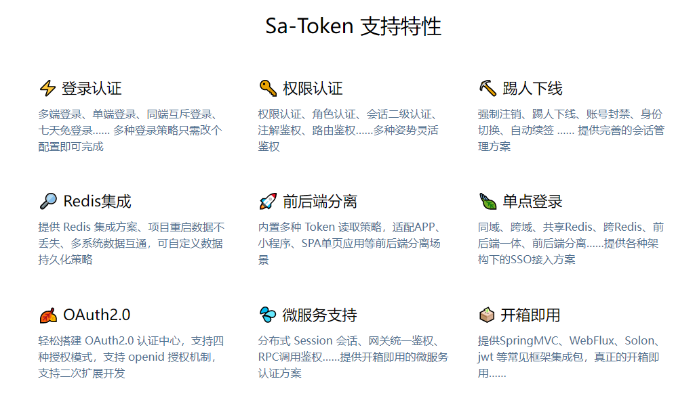
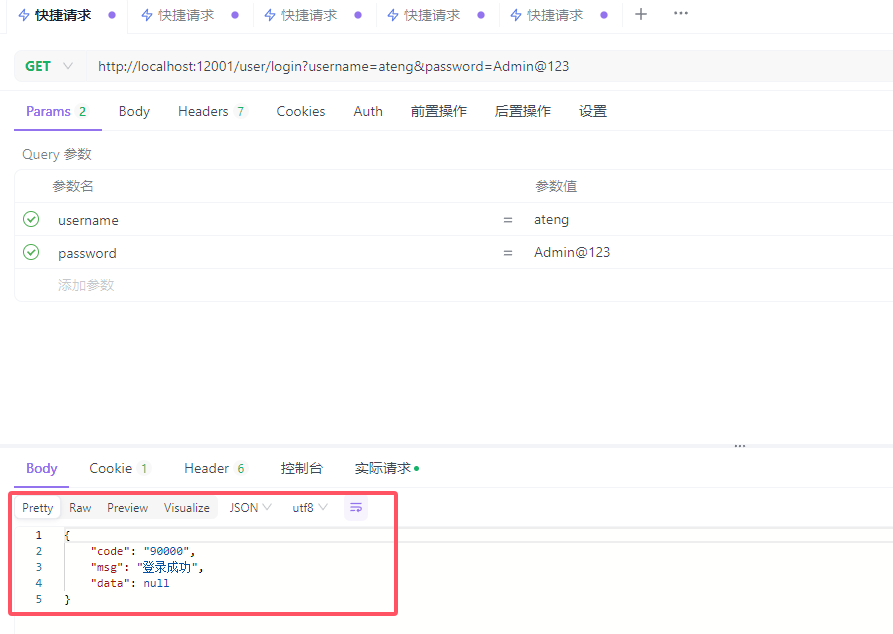
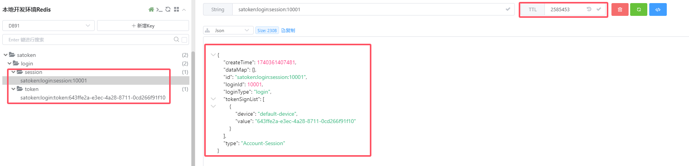
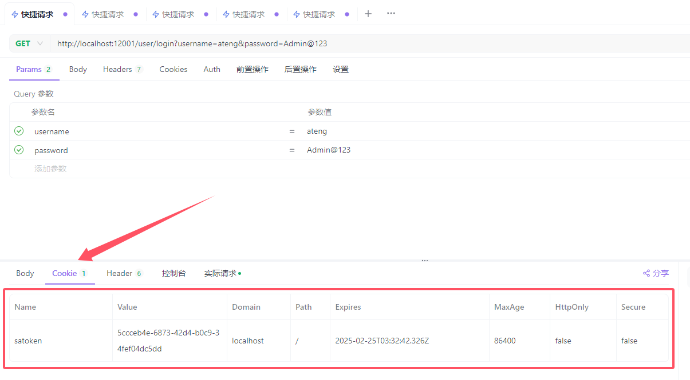
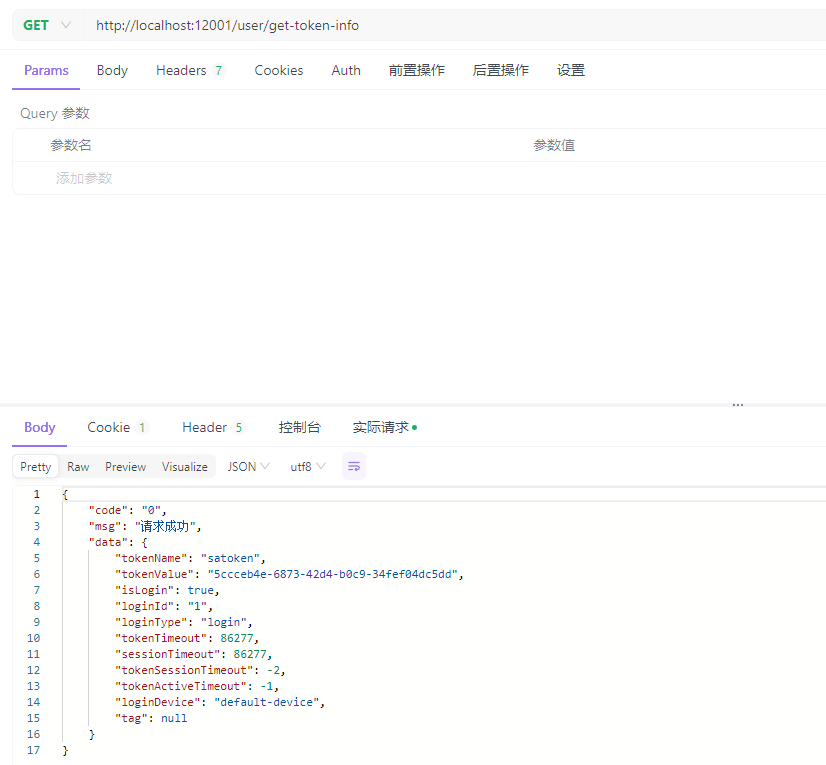
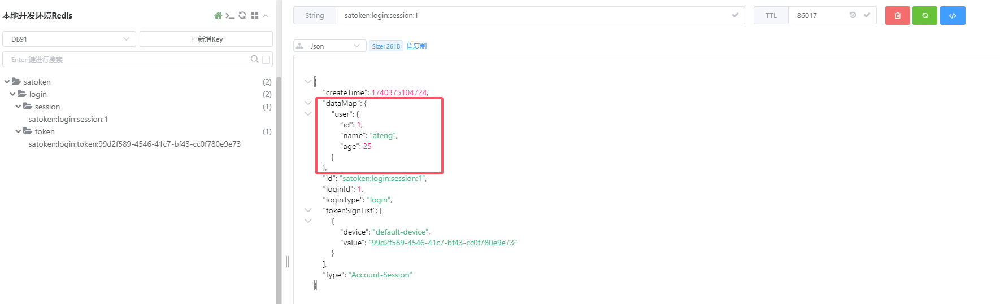
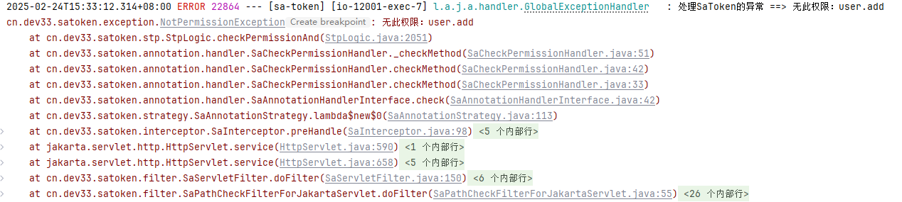
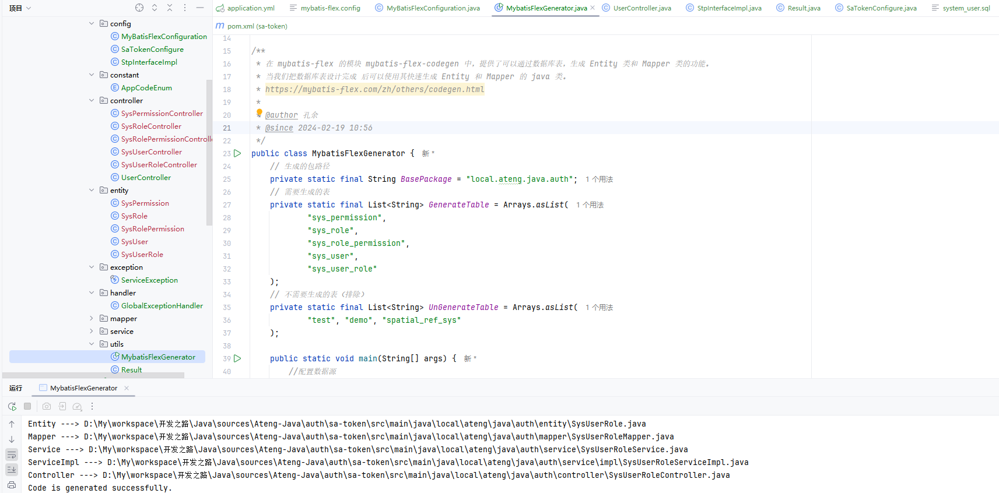
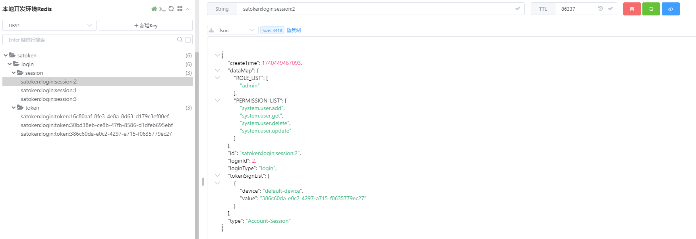

# Sa-Token

一个轻量级 java 权限认证框架，让鉴权变得简单、优雅！  




## 基础配置

基于 [异常处理](/work/Ateng-Java/springboot3/exception/) 模块做开发演示

### 添加依赖

**添加Sa-Token相关依赖**

其中 `sa-token-alone-redis` alone-redis是专门存放Sa-Token权限数据的插件，如果不需要单独使用Redis的，直接和 `spring-boot-starter-data-redis` 使用也可以。

```xml
<!-- Sa-Token 权限认证，在线文档：https://sa-token.cc -->
<dependency>
    <groupId>cn.dev33</groupId>
    <artifactId>sa-token-spring-boot3-starter</artifactId>
    <version>${sa-token.version}</version>
</dependency>
<!-- Sa-Token 整合 Redis （使用 fastjson2 序列化方式） -->
<dependency>
    <groupId>cn.dev33</groupId>
    <artifactId>sa-token-redis-fastjson2</artifactId>
    <version>${sa-token.version}</version>
</dependency>
<!-- Sa-Token插件：权限缓存与业务缓存分离 -->
<dependency>
    <groupId>cn.dev33</groupId>
    <artifactId>sa-token-alone-redis</artifactId>
    <version>${sa-token.version}</version>
</dependency>
<!-- 提供Redis连接池 -->
<dependency>
    <groupId>org.apache.commons</groupId>
    <artifactId>commons-pool2</artifactId>
</dependency>
```

**完整的pom.xml如下**

```xml
<?xml version="1.0" encoding="UTF-8"?>
<project xmlns:xsi="http://www.w3.org/2001/XMLSchema-instance" xmlns="http://maven.apache.org/POM/4.0.0"
         xsi:schemaLocation="http://maven.apache.org/POM/4.0.0 https://maven.apache.org/xsd/maven-4.0.0.xsd">
    <!-- 项目模型版本 -->
    <modelVersion>4.0.0</modelVersion>

    <!-- 项目坐标 -->
    <groupId>local.ateng.java</groupId>
    <artifactId>sa-token</artifactId>
    <version>v1.0</version>
    <name>sa-token</name>
    <description>sa-token</description>
    <url>https://sa-token.cc/</url>

    <!-- 项目属性 -->
    <properties>
        <java.version>21</java.version>
        <project.build.sourceEncoding>UTF-8</project.build.sourceEncoding>
        <project.reporting.outputEncoding>UTF-8</project.reporting.outputEncoding>
        <spring-boot.version>3.4.1</spring-boot.version>
        <maven-compiler.version>3.12.1</maven-compiler.version>
        <lombok.version>1.18.36</lombok.version>
        <hutool.version>5.8.35</hutool.version>
        <fastjson2.version>2.0.53</fastjson2.version>
        <sa-token.version>1.40.0</sa-token.version>
    </properties>

    <!-- 项目依赖 -->
    <dependencies>
        <!-- Spring Boot Web Starter: 包含用于构建Web应用程序的Spring Boot依赖项 -->
        <dependency>
            <groupId>org.springframework.boot</groupId>
            <artifactId>spring-boot-starter-web</artifactId>
        </dependency>

        <!-- Spring Boot Starter Test: 包含用于测试Spring Boot应用程序的依赖项 -->
        <dependency>
            <groupId>org.springframework.boot</groupId>
            <artifactId>spring-boot-starter-test</artifactId>
            <scope>test</scope>
        </dependency>

        <!-- Lombok: 简化Java代码编写的依赖项 -->
        <!-- https://mvnrepository.com/artifact/org.projectlombok/lombok -->
        <dependency>
            <groupId>org.projectlombok</groupId>
            <artifactId>lombok</artifactId>
            <version>${lombok.version}</version>
            <scope>provided</scope>
        </dependency>

        <!-- Hutool: Java工具库，提供了许多实用的工具方法 -->
        <dependency>
            <groupId>cn.hutool</groupId>
            <artifactId>hutool-all</artifactId>
            <version>${hutool.version}</version>
        </dependency>

        <!-- 高性能的JSON库 -->
        <!-- https://github.com/alibaba/fastjson2/wiki/fastjson2_intro_cn#0-fastjson-20%E4%BB%8B%E7%BB%8D -->
        <dependency>
            <groupId>com.alibaba.fastjson2</groupId>
            <artifactId>fastjson2</artifactId>
            <version>${fastjson2.version}</version>
        </dependency>

        <!-- Spring Boot Validation 数据校验框架 -->
        <dependency>
            <groupId>org.springframework.boot</groupId>
            <artifactId>spring-boot-starter-validation</artifactId>
        </dependency>

        <!-- Sa-Token 权限认证，在线文档：https://sa-token.cc -->
        <dependency>
            <groupId>cn.dev33</groupId>
            <artifactId>sa-token-spring-boot3-starter</artifactId>
            <version>${sa-token.version}</version>
        </dependency>
        <!-- Sa-Token 整合 Redis （使用 fastjson2 序列化方式） -->
        <dependency>
            <groupId>cn.dev33</groupId>
            <artifactId>sa-token-redis-fastjson2</artifactId>
            <version>${sa-token.version}</version>
        </dependency>
        <!-- Sa-Token插件：权限缓存与业务缓存分离 -->
        <dependency>
            <groupId>cn.dev33</groupId>
            <artifactId>sa-token-alone-redis</artifactId>
            <version>${sa-token.version}</version>
        </dependency>
        <!-- 提供Redis连接池 -->
        <dependency>
            <groupId>org.apache.commons</groupId>
            <artifactId>commons-pool2</artifactId>
        </dependency>

    </dependencies>

    <!-- Spring Boot 依赖管理 -->
    <dependencyManagement>
        <dependencies>
            <dependency>
                <groupId>org.springframework.boot</groupId>
                <artifactId>spring-boot-dependencies</artifactId>
                <version>${spring-boot.version}</version>
                <type>pom</type>
                <scope>import</scope>
            </dependency>
        </dependencies>
    </dependencyManagement>

    <!-- 插件仓库配置 -->
    <repositories>
        <!-- Central Repository -->
        <repository>
            <id>central</id>
            <name>阿里云中央仓库</name>
            <url>https://maven.aliyun.com/repository/central</url>
            <!--<name>Maven官方中央仓库</name>
            <url>https://repo.maven.apache.org/maven2/</url>-->
        </repository>
    </repositories>

    <!-- 构建配置 -->
    <build>
        <finalName>${project.name}-${project.version}</finalName>
        <plugins>
            <!-- Maven 编译插件 -->
            <plugin>
                <groupId>org.apache.maven.plugins</groupId>
                <artifactId>maven-compiler-plugin</artifactId>
                <version>${maven-compiler.version}</version>
                <configuration>
                    <source>${java.version}</source>
                    <target>${java.version}</target>
                    <encoding>${project.build.sourceEncoding}</encoding>
                    <!-- 编译参数 -->
                    <compilerArgs>
                        <!-- 启用Java 8参数名称保留功能 -->
                        <arg>-parameters</arg>
                    </compilerArgs>
                </configuration>
            </plugin>

            <!-- Spring Boot Maven 插件 -->
            <plugin>
                <groupId>org.springframework.boot</groupId>
                <artifactId>spring-boot-maven-plugin</artifactId>
                <version>${spring-boot.version}</version>
                <executions>
                    <execution>
                        <id>repackage</id>
                        <goals>
                            <goal>repackage</goal>
                        </goals>
                    </execution>
                </executions>
            </plugin>
        </plugins>
        <resources>
            <!-- 第一个资源配置块 -->
            <resource>
                <directory>src/main/resources</directory>
                <filtering>false</filtering>
            </resource>
            <!-- 第二个资源配置块 -->
            <resource>
                <directory>src/main/resources</directory>
                <includes>
                    <include>application*</include>
                    <include>bootstrap*.yml</include>
                    <include>common*</include>
                    <include>banner*</include>
                </includes>
                <filtering>true</filtering>
            </resource>
        </resources>
    </build>

</project>
```

### 编辑配置文件

alone-redis是专门存放Sa-Token权限数据的插件，如果不需要单独存放，就可以删除该 sa-token.alone-redis 的配置，直接使用Spring Data Redis的配置。

```yaml
---
# Sa-Token 配置
sa-token:
  token-name: satoken # token 名称（同时也是 cookie 名称）
  timeout: 86400 # token 有效期（单位：秒），默认30天，-1 代表永久有效
  active-timeout: -1 # token 最低活跃频率（单位：秒），超时未访问会被冻结，-1代表永不冻结
  is-concurrent: true # 是否允许同一账号多地同时登录，true 为允许，false 为新登录挤掉旧登录
  is-share: true # 是否共用一个 token，true 为共享，false 为每次登录新建 token
  token-style: uuid # token 风格（可选：uuid、simple-uuid、random-32、random-64、random-128、tik）
  is-log: false # 是否输出操作日志
  is-print: false # 是否打印logo
  alone-redis:
    database: 91 # Redis 数据库索引（默认为0）
    host: 192.168.1.10 # Redis 服务器地址
    port: 42784 # Redis 服务器连接端口
    password: Admin@123 # Redis 服务器连接密码（默认为空）
    timeout: 10s # 连接超时时间
    lettuce:
      pool:
        max-active: 100 # 连接池最大连接数（负值表示无连接数限制）
        max-wait: -1s # 连接池最大阻塞等待时间（负值表示无限制）
        max-idle: 100 # 连接池最大空闲连接数
        min-idle: 0 # 连接池最小空闲连接数
        time-between-eviction-runs: 1s # 空闲对象逐出器线程的运行间隔时间
```

### 创建拦截器和过滤器配置

```java
package local.ateng.java.auth.config;

import cn.dev33.satoken.filter.SaServletFilter;
import cn.dev33.satoken.httpauth.basic.SaHttpBasicUtil;
import cn.dev33.satoken.interceptor.SaInterceptor;
import cn.dev33.satoken.router.SaRouter;
import cn.dev33.satoken.stp.StpUtil;
import local.ateng.java.auth.constant.AppCodeEnum;
import local.ateng.java.auth.utils.Result;
import org.slf4j.Logger;
import org.slf4j.LoggerFactory;
import org.springframework.context.annotation.Bean;
import org.springframework.context.annotation.Configuration;
import org.springframework.web.servlet.config.annotation.InterceptorRegistry;
import org.springframework.web.servlet.config.annotation.WebMvcConfigurer;

/**
 * Sa-Token 权限认证 配置类
 * https://sa-token.cc/doc.html#/use/at-check
 *
 * @author 孔余
 * @email 2385569970@qq.com
 * @since 2025-02-24
 */
@Configuration
public class SaTokenConfigure implements WebMvcConfigurer {
    private static final Logger log = LoggerFactory.getLogger(SaTokenConfigure.class);

    /**
     * 注册 Sa-Token 拦截器，打开注解式鉴权功能
     * https://sa-token.cc/doc.html#/use/route-check
     */
    @Override
    public void addInterceptors(InterceptorRegistry registry) {
        // 注册 Sa-Token 拦截器，打开注解式鉴权功能
        registry
                .addInterceptor(
                        new SaInterceptor(
                                // 登录校验
                                handle -> StpUtil.checkLogin()
                        ).isAnnotation(true) // 注解鉴权
                )
                .addPathPatterns("/**")
                .excludePathPatterns("/actuator/**", "/demo/**");
    }

    /**
     * 注册 Sa-Token 全局过滤器
     * https://sa-token.cc/doc.html#/up/global-filter
     */
    @Bean
    public SaServletFilter getSaServletFilter() {
        return new SaServletFilter()
                .addInclude("/**")
                .setAuth(obj ->
                        SaRouter
                                .match("/actuator/shutdown")
                                .check(() -> SaHttpBasicUtil.check("admin:Admin@123"))
                )
                .setError(e -> {
                    log.error(e.getMessage());
                    return Result.error(AppCodeEnum.OPERATION_CANCELED.getCode(), AppCodeEnum.OPERATION_CANCELED.getDescription());
                });
    }
}
```


## 基本使用

### 创建接口类

```java
@RestController
@RequestMapping("/user")
public class UserController {
}
```

### 用户登录

`@SaIgnore` 将接口标记为不做任何校验

参考：[登录认证](https://sa-token.cc/doc.html#/use/login-auth)

```java
    // 测试登录
    @SaIgnore
    @GetMapping("/login")
    public Result login(String username, String password) {
        // 此处仅作模拟示例，真实项目需要从数据库中查询数据进行比对
        if ("ateng".equals(username) && "Admin@123".equals(password)) {
            StpUtil.login(1);
            return Result.success(AppCodeEnum.AUTH_USER_LOGIN_SUCCESS.getCode(), AppCodeEnum.AUTH_USER_LOGIN_SUCCESS.getDescription());
        }
        return Result.error(AppCodeEnum.AUTH_USER_NOT_FOUND.getCode(), AppCodeEnum.AUTH_USER_NOT_FOUND.getDescription());
    }
```

调用接口后，可以看到登录成功



在Redis中缓存的数据



可以看到自动将Token注入到Cookie中，后续可以直接访问其他接口。

```bash
# 使用Cookie方式，在浏览器获取API工具访问
http://192.168.100.2:12001/user/list
# 使用Cookie方式
curl --location --request GET 'http://192.168.100.2:12001/user/list' \
--header 'Cookie: satoken=5ccceb4e-6873-42d4-b0c9-34fef04dc5dd'
# 使用Header方式
curl --location --request GET 'http://192.168.100.2:12001/user/list' \
--header 'satoken: 5ccceb4e-6873-42d4-b0c9-34fef04dc5dd'
# 使用Param方式
curl --location --request GET 'http://192.168.100.2:12001/user/list?satoken=5ccceb4e-6873-42d4-b0c9-34fef04dc5dd'
```




### 查询登录状态

获取当前会话是否已经登录，返回true=已登录，false=未登录

```java
    // 查询登录状态
    @GetMapping("/is-login")
    public Result isLogin() {
        boolean result = StpUtil.isLogin();
        if (result) {
            return Result.success();
        }
        return Result.error();
    }
```

### 检验是否登录

检验当前会话是否已经登录, 如果未登录，则抛出异常：`NotLoginException`

```java
    // 检验当前会话是否已经登录, 如果未登录，则抛出异常：`NotLoginException`
    @GetMapping("/check-login")
    public void checkLogin() {
        StpUtil.checkLogin();
    }
```

### 获取Token信息

```java
    // 检验当前会话是否已经登录, 如果未登录，则抛出异常：`NotLoginException`
    @GetMapping("/get-token-info")
    public Result getTokenInfo() {
        SaTokenInfo tokenInfo = StpUtil.getTokenInfo();
        return Result.success(tokenInfo);
    }
```



### Session

Session 是会话中专业的数据缓存组件，通过 Session 我们可以很方便的缓存一些高频读写数据，提高程序性能

#### 缓存数据

```java
    // 在 Sa-Token的 Session(Account-Session) 中缓存数据
    @PostMapping("/set-session")
    public Result setSession(@RequestBody JSONObject json) {
        SaSession session = StpUtil.getSession();
        session.set("user", json);
        return Result.success();
    }
```

缓存数据后在Redis中查看，数据存放在Account-Session中的dataMap中



#### 获取数据

```java
    // 在 Sa-Token的 Session(Account-Session) 中获取缓存数据
    @GetMapping("/get-session")
    public Result getSession() {
        SaSession session = StpUtil.getSession();
        JSONObject json = (JSONObject) session.get("user");
        return Result.success(json);
    }
```


### 退出登录

当前会话注销登录

```java
    // 当前会话注销登录
    @GetMapping("/logout")
    public Result logout() {
        StpUtil.logout();
        return Result.success();
    }
```


## 权限认证

参考

- [权限认证](https://sa-token.cc/doc.html#/use/jur-auth)
- [动态鉴权](https://sa-token.cc/doc.html#/fun/dynamic-router-check)

### 实现权限接口

在实际环境中通过用户id查找实际的权限和角色

```java
package local.ateng.java.auth.config;


import cn.dev33.satoken.session.SaSession;
import cn.dev33.satoken.stp.StpInterface;
import cn.dev33.satoken.stp.StpUtil;
import lombok.RequiredArgsConstructor;
import org.springframework.beans.factory.annotation.Autowired;
import org.springframework.stereotype.Component;

import java.util.Arrays;
import java.util.List;

/**
 * 自定义权限加载接口实现类
 *   - 在每次调用鉴权代码时，才会执行相应的方法
 *   - 如果权限有了变更，重新登录用户就可以刷新（刷新缓存），也可以将session里面的ROLE_LIST和PERMISSION_LIST删除
 * https://sa-token.cc/doc.html#/use/jur-auth
 *
 * @author 孔余
 * @email 2385569970@qq.com
 * @since 2025-02-24
 */
@Component    // 保证此类被 SpringBoot 扫描，完成 Sa-Token 的自定义权限验证扩展
@RequiredArgsConstructor(onConstructor = @__(@Autowired))
public class StpInterfaceImpl implements StpInterface {

    /**
     * 返回一个账号所拥有的权限码集合
     */
    @Override
    public List<String> getPermissionList(Object loginId, String loginType) {
        // 缓存到session中 获取数据取值 (如果值为 null，则执行 fun 函数获取值，并把函数返回值写入缓存)
        SaSession session = StpUtil.getSessionByLoginId(loginId);
        // 获取权限
        return session.get(SaSession.PERMISSION_LIST, () -> {
            // 从数据库查询这个角色所拥有的权限列表
            //List<String> list = sysUserService.getUserPermissionList(Integer.valueOf(loginId.toString()));
            List<String> list = Arrays.asList(
                    "user.get",
                    "demo.*", "demo.add", "demo.delete", "demo.get"
            );
            return list;
        });
    }

    /**
     * 返回一个账号所拥有的角色标识集合 (权限与角色可分开校验)
     */
    @Override
    public List<String> getRoleList(Object loginId, String loginType) {
        // 缓存到session中
        SaSession session = StpUtil.getSessionByLoginId(loginId);
        return session.get(SaSession.ROLE_LIST, () -> {
            // 从数据库查询这个账号id拥有的角色列表
            //List<String> list = sysUserService.getUserRoleList(Integer.valueOf(loginId.toString()));
            List<String> list = Arrays.asList("super-admin", "demo-admin", "user");
            return list;
        });
    }

}
```

### 修改拦截器权限认证配置

```java
package local.ateng.java.auth.config;

import cn.dev33.satoken.filter.SaServletFilter;
import cn.dev33.satoken.httpauth.basic.SaHttpBasicUtil;
import cn.dev33.satoken.interceptor.SaInterceptor;
import cn.dev33.satoken.router.SaRouter;
import cn.dev33.satoken.stp.StpUtil;
import local.ateng.java.auth.constant.AppCodeEnum;
import local.ateng.java.auth.utils.Result;
import org.slf4j.Logger;
import org.slf4j.LoggerFactory;
import org.springframework.context.annotation.Bean;
import org.springframework.context.annotation.Configuration;
import org.springframework.web.servlet.config.annotation.InterceptorRegistry;
import org.springframework.web.servlet.config.annotation.WebMvcConfigurer;

/**
 * Sa-Token 权限认证 配置类
 * https://sa-token.cc/doc.html#/use/at-check
 *
 * @author 孔余
 * @email 2385569970@qq.com
 * @since 2025-02-24
 */
@Configuration
public class SaTokenConfigure implements WebMvcConfigurer {
    private static final Logger log = LoggerFactory.getLogger(SaTokenConfigure.class);

    /**
     * 注册 Sa-Token 拦截器，打开注解式鉴权功能
     * https://sa-token.cc/doc.html#/use/route-check
     */
    @Override
    public void addInterceptors(InterceptorRegistry registry) {
        // 注册 Sa-Token 拦截器，打开注解式鉴权功能
        registry
                .addInterceptor(
                        new SaInterceptor(handle -> {
                            // 登录校验
                            SaRouter
                                    .match("/**")
                                    .check(r -> StpUtil.checkLogin());
                            // 角色验证
                            SaRouter.match("/user/**", r -> StpUtil.checkRole("user"));
                            SaRouter.match("/admin/**", r -> StpUtil.checkRole("admin"));
                            SaRouter.match("/goods/**", r -> StpUtil.checkRole("goods"));
                            // 权限验证（更细粒度的权限需要使用注解实现）
                            SaRouter.match("/user/**", r -> StpUtil.checkPermission("user.get"));
                            SaRouter.match("/admin/**", r -> StpUtil.checkPermission("admin.*"));
                            SaRouter.match("/goods/**", r -> StpUtil.checkPermission("goods.*"));
                        }).isAnnotation(true) // 注解鉴权（在Token正常的情况下，注解鉴权优先级高于路由拦截鉴权）
                )
                .addPathPatterns("/**")
                .excludePathPatterns("/actuator/**", "/demo/**");
    }

    /**
     * 注册 Sa-Token 全局过滤器
     * https://sa-token.cc/doc.html#/up/global-filter
     */
    @Bean
    public SaServletFilter getSaServletFilter() {
        return new SaServletFilter()
                .addInclude("/**")
                .setAuth(obj ->
                        SaRouter
                                .match("/actuator/shutdown")
                                .check(() -> SaHttpBasicUtil.check("admin:Admin@123"))
                )
                .setError(e -> {
                    log.error(e.getMessage());
                    return Result.error(AppCodeEnum.OPERATION_CANCELED.getCode(), AppCodeEnum.OPERATION_CANCELED.getDescription());
                });
    }
}
```

### 使用权限认证

先调用退出登录接口再重新登录刷新权限，再访问其他接口就需要权限认证了。

注意以下事项：

- 在Token正常的情况下，注解鉴权优先级高于路由拦截鉴权
- 在每次调用鉴权代码时，才会执行以下方法
- 如果权限有了变更，重新登录用户就可以刷新（刷新缓存），也可以将session里面的ROLE_LIST和PERMISSION_LIST删除

添加一个没有该权限的接口

```java
    // 新增用户
    @PostMapping("/add")
    @SaCheckPermission("user.add")
    public Result add(@RequestBody JSONObject json) {
        // 模拟新增用户
        System.out.println(json);
        return Result.success();
    }
```

访问该接口报错




## 接口参数签名

参考：

- [API接口参数签名](https://sa-token.cc/doc.html#/plugin/api-sign)

### 添加配置

```yaml
sa-token:
  # ...
  sign:
    secret-key: yN7IRdIJm84mOMiJ65KX372fbDl9cRJN # API 接口签名秘钥 （随便乱摁几个字母即可）
    timestamp-disparity: 900000 # 接口调用时的时间戳允许的差距（单位：ms），-1 代表不校验差距，默认15分钟
```

### 使用签名

#### 获取签名参数

调用接口获取到签名参数，如下

userId=10001&money=1000&timestamp=1740385175094&nonce=Nelz05HNnlHLidxwl0Q59G8d1PUSQYkH&sign=46bf1595d376b178bc9a69476adfcf04

```java
    // 获取签名参数，默认15分钟过期
    @GetMapping("/get-sign")
    public String getSign() {
        // 请求参数
        Map<String, Object> paramMap = new LinkedHashMap<>();
        paramMap.put("userId", 10001);
        paramMap.put("money", 1000);
        // 添加签名参数
        String string = SaSignUtil.addSignParamsAndJoin(paramMap);
        return string;
    }
```

#### 使用签名调用接口

注意同一个签名只能使用一次，不然就会报错：`此 nonce 已被使用过，不可重复使用：Nelz05HNnlHLidxwl0Q59G8d1PUSQYkH`

```java
    // 需要验证签名
    @GetMapping("/sign")
    public String sign() {
        // 1、校验请求中的签名
        SaSignUtil.checkRequest(SaHolder.getRequest());
        // 2、校验通过，处理业务
        // ...
        // 3、返回
        return "ok";
    }
```

#### 手动获取签名参数

需要以下问题

- 需要用TreeMap进行排序，将原有参数和timestamp、nonce这些字段传入TreeMap，最后获取到sign签名
- 得到原有参数和timestamp、nonce和sign，这几个参数无须排序

```java
    @GetMapping("/get-sign-custom")
    public String getSignCustom(Long userId, Long money) {
        // 系统当前时间戳
        long timestamp = System.currentTimeMillis();
        // nonce, 随机32位字符串
        String nonce = RandomUtil.randomString(32);
        // 将请求参数放入Map
        Map<String, Object> paramMap = MapUtil.newHashMap();
        paramMap.put("userId", userId);
        paramMap.put("money", money);
        paramMap.put("timestamp", timestamp);
        paramMap.put("nonce", nonce);
        // 使用 TreeMap 对参数进行排序
        Map<String, Object> paramTreeMap = new TreeMap<>(paramMap);
        StringBuilder sb = new StringBuilder();
        paramTreeMap.forEach((key, value) -> sb.append(key).append("=").append(value).append("&"));
        String queryString = sb + "key=" + SpringUtil.getProperty("sa-token.sign.secret-key");
        // 计算 sign 参数
        String sign = SecureUtil.md5(queryString);
        return "userId=" + userId + "&money=" + money + "&timestamp=" + timestamp + "&nonce=" + nonce + "&sign=" + sign;
    }
```


## 结合数据库使用

### 执行SQL

执行SQL（/data/sql/system_user.sql）创建用户权限表

### 集成Mybati-Flex

参考文档集成Mybati-Flex数据库框架：[Mybati-Flex使用文档](/work/Ateng-Java/database/mybatis-flex/)

最终使用代码生成器将相关表生成代码




### 创建用户服务

#### 创建SysUserVo

```java
package local.ateng.java.auth.vo;

import lombok.AllArgsConstructor;
import lombok.Builder;
import lombok.Data;
import lombok.NoArgsConstructor;

import java.io.Serial;
import java.io.Serializable;
import java.sql.Timestamp;
import java.util.List;

/**
 * 存储用户的基本信息 实体类。
 *
 * @author 孔余
 * @since 1.0.0
 */
@Data
@Builder
@NoArgsConstructor
@AllArgsConstructor
public class SysUserVo implements Serializable {

    @Serial
    private static final long serialVersionUID = 1L;

    private Integer userId;
    private String userName;
    private String nickName;
    private String sex;
    private String email;
    private String phoneNumber;
    private Timestamp createTime;
    private Timestamp updateTime;
    /**
     * token
     */
    private String token;
    /**
     * 菜单权限
     */
    private List<String> permissionList;

    /**
     * 角色权限
     */
    private List<String> roleList;

}
```

#### 创建SysUserLoginBo

```java
package local.ateng.java.auth.bo;

import jakarta.validation.constraints.NotBlank;
import jakarta.validation.constraints.Size;
import lombok.AllArgsConstructor;
import lombok.Builder;
import lombok.Data;
import lombok.NoArgsConstructor;

import java.io.Serializable;

/**
 * 存储用户的基本信息 实体类。
 *
 * @author 孔余
 * @since 1.0.0
 */
@Data
@Builder
@NoArgsConstructor
@AllArgsConstructor
public class SysUserLoginBo implements Serializable {
    @NotBlank(message = "用户账号不能为空")
    @Size(min = 0, max = 30, message = "用户账号长度不能超过{max}个字符")
    private String userName;
    @NotBlank(message = "用户密码不能为空")
    private String password;
}
```

#### 创建SysUserPageBo

```java
package local.ateng.java.auth.bo;

import jakarta.validation.constraints.Min;
import jakarta.validation.constraints.NotNull;
import lombok.AllArgsConstructor;
import lombok.Builder;
import lombok.Data;
import lombok.NoArgsConstructor;

import java.io.Serializable;

/**
 * 存储用户的基本信息 实体类。
 *
 * @author 孔余
 * @since 1.0.0
 */
@Data
@Builder
@NoArgsConstructor
@AllArgsConstructor
public class SysUserPageBo implements Serializable {
    @NotNull(message = "分页号不能为空")
    @Min(value = 1, message = "分页号不正确")
    private Long pageNumber;
    @NotNull(message = "分页大小不能为空")
    @Min(value = 1, message = "分页大小不正确")
    private Long pageSize;
    private String nickName;
}
```

#### 创建服务接口

```java
public interface SysUserService extends IService<SysUser> {

    // 登录
    SysUserVo loginUser(SysUserLoginBo bo);

    // 新增用户
    void addUser(SysUser entity);

    // 分页查询
    Page<SysUser> pageUser(SysUserPageBo bo);

    // 批量删除用户
    void deleteBatchUser(List<Long> ids);

    // 修改用户
    void updateUser(SysUser entity);

    // 根据用户id查询角色列表
    List<String> getUserRoleList(Integer id);

    // 根据用户id查询权限列表
    List<String> getUserPermissionList(Integer id);

}
```

#### 创建服务接口实现

```java
package local.ateng.java.auth.service.impl;

import cn.dev33.satoken.stp.StpUtil;
import cn.hutool.core.convert.Convert;
import cn.hutool.core.date.DateUtil;
import cn.hutool.crypto.digest.BCrypt;
import com.mybatisflex.core.paginate.Page;
import com.mybatisflex.spring.service.impl.ServiceImpl;
import local.ateng.java.auth.bo.SysUserLoginBo;
import local.ateng.java.auth.bo.SysUserPageBo;
import local.ateng.java.auth.constant.AppCodeEnum;
import local.ateng.java.auth.entity.SysUser;
import local.ateng.java.auth.entity.SysUserRole;
import local.ateng.java.auth.exception.ServiceException;
import local.ateng.java.auth.mapper.SysUserMapper;
import local.ateng.java.auth.service.SysRoleService;
import local.ateng.java.auth.service.SysUserRoleService;
import local.ateng.java.auth.service.SysUserService;
import local.ateng.java.auth.vo.SysUserVo;
import lombok.RequiredArgsConstructor;
import lombok.extern.slf4j.Slf4j;
import org.springframework.beans.factory.annotation.Autowired;
import org.springframework.stereotype.Service;
import org.springframework.transaction.annotation.Transactional;
import org.springframework.util.ObjectUtils;

import java.util.List;

import static local.ateng.java.auth.entity.table.SysPermissionTableDef.SYS_PERMISSION;
import static local.ateng.java.auth.entity.table.SysRolePermissionTableDef.SYS_ROLE_PERMISSION;
import static local.ateng.java.auth.entity.table.SysRoleTableDef.SYS_ROLE;
import static local.ateng.java.auth.entity.table.SysUserRoleTableDef.SYS_USER_ROLE;
import static local.ateng.java.auth.entity.table.SysUserTableDef.SYS_USER;

/**
 * 存储用户的基本信息 服务层实现。
 *
 * @author 孔余
 * @since 1.0.0
 */
@Service
@RequiredArgsConstructor(onConstructor = @__(@Autowired))
@Slf4j
public class SysUserServiceImpl extends ServiceImpl<SysUserMapper, SysUser> implements SysUserService {
    private final SysUserRoleService sysUserRoleService;
    private final SysRoleService sysRoleService;

    @Override
    public SysUserVo loginUser(SysUserLoginBo bo) {
        String userName = bo.getUserName();
        String password = bo.getPassword();
        SysUser user = this.queryChain()
                .select(SYS_USER.ALL_COLUMNS)
                .from(SYS_USER)
                .where(SYS_USER.USER_NAME.eq(userName))
                .one();
        // 判断用户是否存在
        cn.hutool.core.lang.Assert.isTrue(!ObjectUtils.isEmpty(user), () -> new ServiceException(AppCodeEnum.AUTH_USER_NOT_FOUND.getCode(), AppCodeEnum.AUTH_USER_NOT_FOUND.getDescription()));
        // 校验密码
        boolean checkpw = BCrypt.checkpw(password, user.getPassword());
        cn.hutool.core.lang.Assert.isTrue(checkpw, () -> new ServiceException(AppCodeEnum.AUTH_PASSWORD_INCORRECT.getCode(), AppCodeEnum.AUTH_PASSWORD_INCORRECT.getDescription()));
        // 登录用户
        StpUtil.login(user.getUserId());
        SysUserVo sysUserVo = Convert.convert(SysUserVo.class, user);
        sysUserVo.setToken(StpUtil.getTokenValue());
        sysUserVo.setRoleList(this.getUserRoleList(user.getUserId()));
        sysUserVo.setPermissionList(this.getUserPermissionList(user.getUserId()));
        // 返回用户信息
        return sysUserVo;
    }

    @Override
    @Transactional
    public void addUser(SysUser entity) {
        String userName = entity.getUserName();
        String password = entity.getPassword();
        SysUser user = this.queryChain()
                .select()
                .from(SYS_USER)
                .where(SYS_USER.USER_NAME.eq(userName))
                .one();
        // 判断用户是否存在
        cn.hutool.core.lang.Assert.isTrue(ObjectUtils.isEmpty(user), () -> new ServiceException(AppCodeEnum.AUTH_USER_ALREADY_EXISTS.getCode(), AppCodeEnum.AUTH_USER_ALREADY_EXISTS.getDescription()));
        // 新增用户
        String passwordEncrypt = BCrypt.hashpw(password);
        entity.setPassword(passwordEncrypt);
        this.save(entity);
        // 关联角色
        Integer userRoleId = sysRoleService
                .queryChain()
                .select(SYS_ROLE.ROLE_ID)
                .from(SYS_ROLE)
                .where(SYS_ROLE.ROLE_NAME.eq("user"))
                .one()
                .getRoleId();
        sysUserRoleService.save(new SysUserRole(entity.getUserId(), userRoleId));
    }

    @Override
    public Page<SysUser> pageUser(SysUserPageBo bo) {
        String nickName = bo.getNickName();
        Page<SysUser> page = this.queryChain()
                .select()
                .from(SYS_USER)
                .where(SYS_USER.NICK_NAME.like(nickName, !ObjectUtils.isEmpty(nickName)))
                .page(new Page<>(bo.getPageNumber(), bo.getPageSize()));
        return page;
    }

    @Override
    public void deleteBatchUser(List<Long> ids) {
        this.removeByIds(ids);
    }

    @Override
    public void updateUser(SysUser entity) {
        String userName = entity.getUserName();
        String password = entity.getPassword();
        SysUser user = this.getById(entity.getUserId());
        // 判断用户是否存在
        cn.hutool.core.lang.Assert.isTrue(!ObjectUtils.isEmpty(user), () -> new ServiceException(AppCodeEnum.AUTH_USER_NOT_FOUND.getCode(), AppCodeEnum.AUTH_USER_NOT_FOUND.getDescription()));
        cn.hutool.core.lang.Assert.isTrue(user.getUserName().equals(userName), () -> new ServiceException(AppCodeEnum.AUTH_USER_NOT_INCONSISTENT.getCode(), AppCodeEnum.AUTH_USER_NOT_INCONSISTENT.getDescription()));
        // 更新用户
        String passwordEncrypt = BCrypt.hashpw(password);
        entity.setPassword(passwordEncrypt);
        entity.setUpdateTime(DateUtil.date().toTimestamp());
        this.updateById(entity, true);
    }

    @Override
    public List<String> getUserRoleList(Integer id) {
        // 根据用户id查询角色列表
        List<String> list = this
                .queryChain()
                .select(SYS_ROLE.ROLE_NAME)
                .from(SYS_USER)
                .where(SYS_USER.USER_ID.eq(id))
                .leftJoin(SYS_USER_ROLE)
                .on(SYS_USER.USER_ID.eq(SYS_USER_ROLE.USER_ID))
                .leftJoin(SYS_ROLE)
                .on(SYS_USER_ROLE.ROLE_ID.eq(SYS_ROLE.ROLE_ID))
                .listAs(String.class);
        return list;
    }

    @Override
    public List<String> getUserPermissionList(Integer id) {
        // 根据用户id查询权限列表
        List<String> list = this
                .queryChain()
                .select(SYS_PERMISSION.PERMISSION_NAME)
                .from(SYS_USER)
                .where(SYS_USER.USER_ID.eq(id))
                .leftJoin(SYS_USER_ROLE)
                .on(SYS_USER.USER_ID.eq(SYS_USER_ROLE.USER_ID))
                .leftJoin(SYS_ROLE)
                .on(SYS_USER_ROLE.ROLE_ID.eq(SYS_ROLE.ROLE_ID))
                .leftJoin(SYS_ROLE_PERMISSION)
                .on(SYS_ROLE_PERMISSION.ROLE_ID.eq(SYS_ROLE.ROLE_ID))
                .leftJoin(SYS_PERMISSION)
                .on(SYS_PERMISSION.PERMISSION_ID.eq(SYS_ROLE_PERMISSION.PERMISSION_ID))
                .listAs(String.class);
        return list;
    }

}
```

#### 创建API接口

```java
package local.ateng.java.auth.controller;

import cn.dev33.satoken.annotation.SaCheckPermission;
import cn.dev33.satoken.annotation.SaCheckRole;
import cn.dev33.satoken.annotation.SaIgnore;
import cn.dev33.satoken.stp.StpUtil;
import com.mybatisflex.core.paginate.Page;
import local.ateng.java.auth.bo.SysUserLoginBo;
import local.ateng.java.auth.bo.SysUserPageBo;
import local.ateng.java.auth.entity.SysUser;
import local.ateng.java.auth.service.SysUserService;
import local.ateng.java.auth.utils.Result;
import local.ateng.java.auth.vo.SysUserVo;
import lombok.RequiredArgsConstructor;
import lombok.extern.slf4j.Slf4j;
import org.springframework.beans.factory.annotation.Autowired;
import org.springframework.web.bind.annotation.*;

import java.util.List;

/**
 * 系统设置/用户设置
 *
 * @author 孔余
 * @since 1.0.0
 */
@RestController
@RequestMapping("/auth/user")
@RequiredArgsConstructor(onConstructor = @__(@Autowired))
@Slf4j
public class SysUserController {

    private final SysUserService sysUserService;

    /**
     * 登录
     */
    @SaIgnore
    @PostMapping("/login")
    public Result login(@RequestBody SysUserLoginBo bo) {
        SysUserVo sysUserVo = sysUserService.loginUser(bo);
        return Result.success(sysUserVo);
    }

    /**
     * 退出登录
     */
    @GetMapping("/logout")
    public Result logout() {
        StpUtil.logout();
        return Result.success();
    }

    /**
     * 新增
     */
    @SaCheckRole("admin")
    @SaCheckPermission("ateng.user.add")
    @PostMapping("/add")
    public Result add(@RequestBody SysUser entity) {
        sysUserService.addUser(entity);
        return Result.success();
    }

    /**
     * 查询所有
     */
    @SaCheckPermission(value = "ateng.user.get", orRole = "admin")
    @GetMapping("/list")
    public Result list() {
        List<SysUser> list = sysUserService.list();
        return Result.success(list);
    }

    /**
     * 分页查询
     */
    @SaCheckPermission(value = "ateng.user.get", orRole = "admin")
    @PostMapping("/page")
    public Result page(@RequestBody SysUserPageBo bo) {
        Page<SysUser> sysUserPage = sysUserService.pageUser(bo);
        return Result.success(sysUserPage);
    }

    /**
     * 批量删除
     */
    @SaCheckRole("admin")
    @SaCheckPermission("ateng.user.delete")
    @PostMapping("/delete-batch")
    public Result deleteBatch(List<Long> ids) {
        sysUserService.deleteBatchUser(ids);
        return Result.success();
    }

    /**
     * 更新
     */
    @SaCheckRole("admin")
    @SaCheckPermission("ateng.user.update")
    @PostMapping("/update")
    public Result update(@RequestBody SysUser entity) {
        sysUserService.updateUser(entity);
        return Result.success();
    }

    /**
     * 获取详细信息
     */
    @SaCheckPermission(value = "ateng.user.get", orRole = "admin")
    @GetMapping("/get")
    public Result get(Integer id) {
        SysUser sysUser = sysUserService.getById(id);
        return Result.success(sysUser);
    }

    /**
     * 获取账号权限
     */
    @GetMapping("/get-permission-list")
    public Result getPermissionList() {
        List<String> permissionList = StpUtil.getPermissionList();
        return Result.success(permissionList);
    }

    /**
     * 获取账号角色
     */
    @GetMapping("/get-role-list")
    public Result getRoleList() {
        List<String> roleList = StpUtil.getRoleList();
        return Result.success(roleList);
    }

}
```


### 修改权限接口

使权限和角色从数据库中加载

```java
package local.ateng.java.auth.config;


import cn.dev33.satoken.session.SaSession;
import cn.dev33.satoken.stp.StpInterface;
import cn.dev33.satoken.stp.StpUtil;
import local.ateng.java.auth.service.SysUserService;
import lombok.RequiredArgsConstructor;
import org.springframework.beans.factory.annotation.Autowired;
import org.springframework.stereotype.Component;

import java.util.List;

/**
 * 自定义权限加载接口实现类
 * - 在每次调用鉴权代码时，才会执行相应的方法
 * - 如果权限有了变更，重新登录用户就可以刷新（刷新缓存），也可以将session里面的ROLE_LIST和PERMISSION_LIST删除
 * https://sa-token.cc/doc.html#/use/jur-auth
 *
 * @author 孔余
 * @email 2385569970@qq.com
 * @since 2025-02-24
 */
@Component    // 保证此类被 SpringBoot 扫描，完成 Sa-Token 的自定义权限验证扩展
@RequiredArgsConstructor(onConstructor = @__(@Autowired))
public class StpInterfaceImpl implements StpInterface {
    private final SysUserService sysUserService;

    /**
     * 返回一个账号所拥有的权限码集合
     */
    @Override
    public List<String> getPermissionList(Object loginId, String loginType) {
        // 缓存到session中 获取数据取值 (如果值为 null，则执行 fun 函数获取值，并把函数返回值写入缓存)
        SaSession session = StpUtil.getSessionByLoginId(loginId);
        // 获取权限
        return session.get(SaSession.PERMISSION_LIST, () -> {
            // 从数据库查询这个角色所拥有的权限列表
            List<String> list = sysUserService.getUserPermissionList(Integer.valueOf(loginId.toString()));
            return list;
        });
    }

    /**
     * 返回一个账号所拥有的角色标识集合 (权限与角色可分开校验)
     */
    @Override
    public List<String> getRoleList(Object loginId, String loginType) {
        // 缓存到session中
        SaSession session = StpUtil.getSessionByLoginId(loginId);
        return session.get(SaSession.ROLE_LIST, () -> {
            // 从数据库查询这个账号id拥有的角色列表
            List<String> list = sysUserService.getUserRoleList(Integer.valueOf(loginId.toString()));
            return list;
        });
    }

}
```

### 结合使用

#### 登录接口

账号密码列表

| 账号   | 密码        | 描述           |
| ------ | ----------- | -------------- |
| ateng  | Admin@12345 | 拥有所有权限   |
| admin  | Admin@123   | 拥有大部分权限 |
| kongyu | Admin@123   | 拥有查询权限   |

**kongyu**

```json
{
    "code": "0",
    "msg": "请求成功",
    "data": {
        "userId": 3,
        "userName": "kongyu",
        "nickName": "孔余",
        "sex": "男",
        "email": "",
        "phoneNumber": "",
        "createTime": "2025-02-24T13:15:12.071+00:00",
        "updateTime": "2025-02-24T13:15:12.071+00:00",
        "token": "30bd38eb-ce8b-47fb-8586-d1dfeb695ebf",
        "permissionList": [
            "system.user.get"
        ],
        "roleList": [
            "user"
        ]
    }
}
```

**admin**

```json
{
    "code": "0",
    "msg": "请求成功",
    "data": {
        "userId": 2,
        "userName": "admin",
        "nickName": "管理员",
        "sex": "男",
        "email": "",
        "phoneNumber": "",
        "createTime": "2025-02-24T13:15:12.071+00:00",
        "updateTime": "2025-02-24T13:15:12.071+00:00",
        "token": "386c60da-e0c2-4297-a715-f0635779ec27",
        "permissionList": [
            "system.user.add",
            "system.user.get",
            "system.user.delete",
            "system.user.update"
        ],
        "roleList": [
            "admin"
        ]
    }
}
```

**ateng**

```json
{
    "code": "0",
    "msg": "请求成功",
    "data": {
        "userId": 1,
        "userName": "ateng",
        "nickName": "阿腾",
        "sex": "男",
        "email": "2385569970@qq.com",
        "phoneNumber": "17623062936",
        "createTime": "2025-02-24T13:15:12.071+00:00",
        "updateTime": "2025-02-24T13:15:12.071+00:00",
        "token": "16c80aaf-8fe3-4e8a-8d63-d179c3ef00ef",
        "permissionList": [
            "*"
        ],
        "roleList": [
            "super-admin"
        ]
    }
}
```

#### 调用其他接口

调用其他接口后Redis中就会缓存该账号的涉及到的角色和权限




## 微服务

参考文档：

- [微服务 - 网关统一鉴权](https://sa-token.cc/doc.html#/micro/gateway-auth?id=微服务-网关统一鉴权)
- [微服务 - 内部服务外网隔离](https://sa-token.cc/doc.html#/micro/same-token?id=微服务-内部服务外网隔离)
- [和 Dubbo 集成](https://sa-token.cc/doc.html#/plugin/dubbo-extend?id=和-dubbo-集成)
