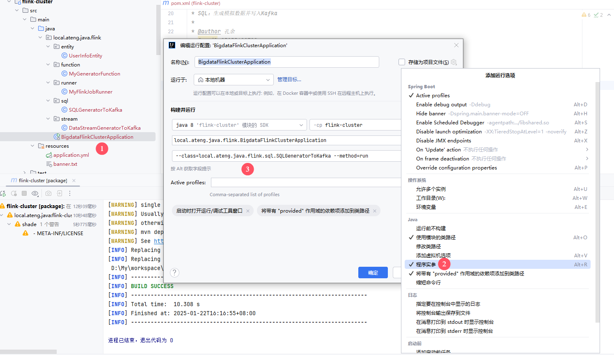
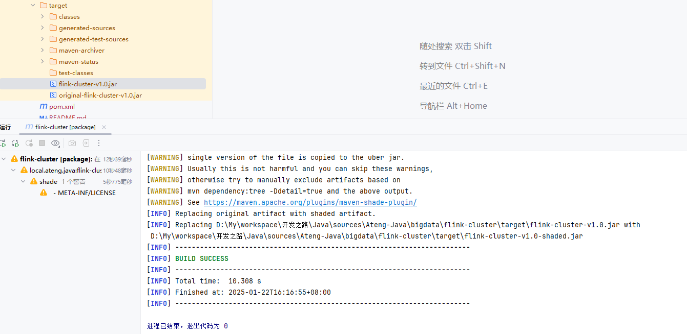
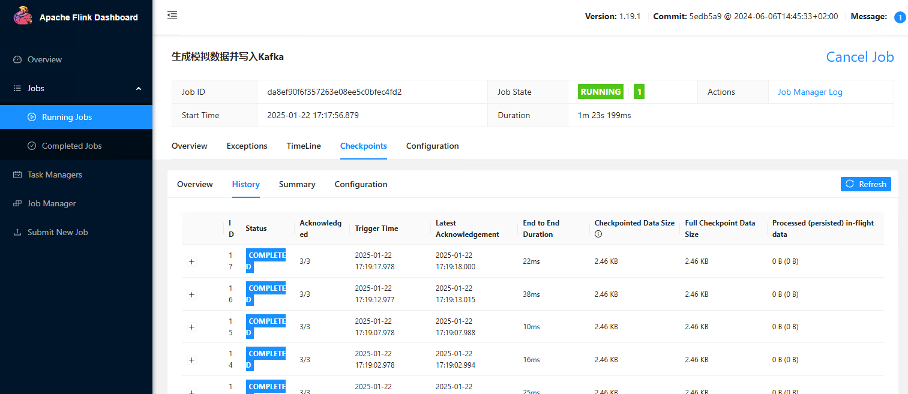
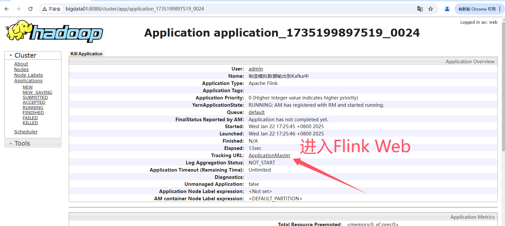
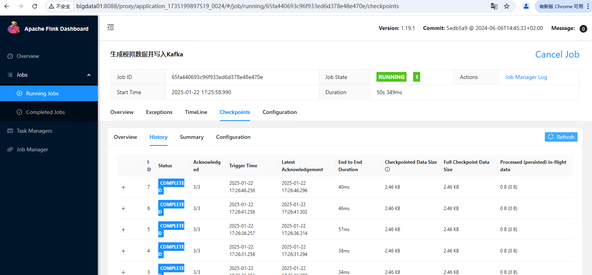
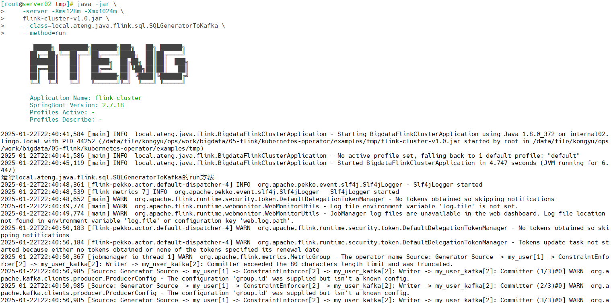
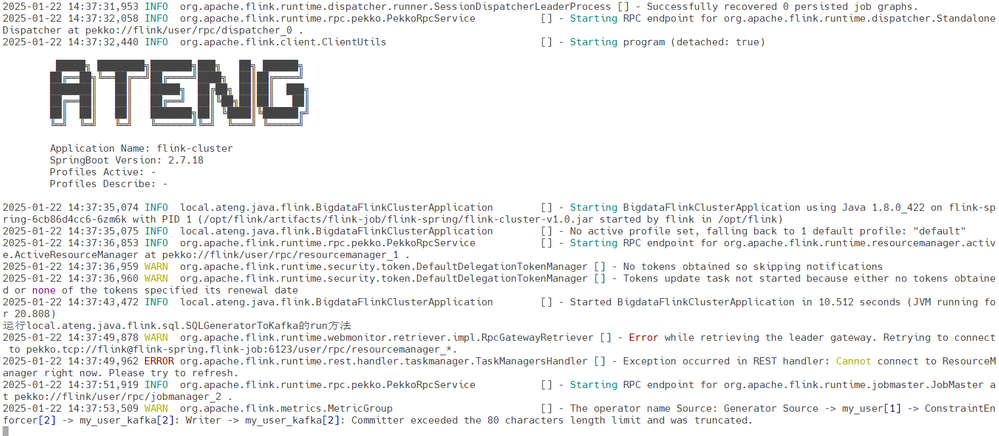

## Flink on SpringBoot

集成SpringBoot框架的Flink程序，运行在集群上


## 基础配置

首先创建一个SpringBoot项目，以下配置基于该项目做更改。

### 服务版本

- JDK：8
- SpringBoot：2.7.18
- Flink：1.19.1

### 配置pom.xml

```xml
<?xml version="1.0" encoding="UTF-8"?>
<project xmlns:xsi="http://www.w3.org/2001/XMLSchema-instance" xmlns="http://maven.apache.org/POM/4.0.0"
         xsi:schemaLocation="http://maven.apache.org/POM/4.0.0 https://maven.apache.org/xsd/maven-4.0.0.xsd">
    <!-- 项目模型版本 -->
    <modelVersion>4.0.0</modelVersion>

    <!-- 项目坐标 -->
    <groupId>local.ateng.java</groupId>
    <artifactId>flink-cluster</artifactId>
    <version>v1.0</version>
    <name>flink-cluster</name>
    <description>
        集成SpringBoot框架的Flink程序，运行在集群上
    </description>

    <!-- 项目属性 -->
    <properties>
        <!-- 默认主程序 -->
        <start-class>local.ateng.java.flink.BigdataFlinkClusterApplication</start-class>
        <java.version>8</java.version>
        <project.build.sourceEncoding>UTF-8</project.build.sourceEncoding>
        <project.reporting.outputEncoding>UTF-8</project.reporting.outputEncoding>
        <spring-boot.version>2.7.18</spring-boot.version>
        <maven-compiler.version>3.12.1</maven-compiler.version>
        <maven-shade.version>3.5.1</maven-shade.version>
        <lombok.version>1.18.36</lombok.version>
        <fastjson2.version>2.0.53</fastjson2.version>
        <hutool.version>5.8.35</hutool.version>
        <hadoop.version>3.3.6</hadoop.version>
        <flink.version>1.19.1</flink.version>
        <kafka.version>3.8.1</kafka.version>
        <flink-kafka.version>3.3.0-1.19</flink-kafka.version>
        <mysql.version>8.0.33</mysql.version>
        <postgresql.version>42.7.1</postgresql.version>
    </properties>

    <!-- 项目依赖 -->
    <dependencies>
        <!-- Spring Boot Web Starter: 包含用于构建Web应用程序的Spring Boot依赖项 -->
        <dependency>
            <groupId>org.springframework.boot</groupId>
            <artifactId>spring-boot-starter-web</artifactId>
            <exclusions>
                <exclusion>
                    <groupId>org.springframework.boot</groupId>
                    <artifactId>spring-boot-starter-tomcat</artifactId>
                </exclusion>
                <exclusion>
                    <groupId>org.springframework.boot</groupId>
                    <artifactId>spring-boot-starter-logging</artifactId>
                </exclusion>
            </exclusions>
        </dependency>
        <!-- 使用log4j2作为日志实现 -->
        <dependency>
            <groupId>org.springframework.boot</groupId>
            <artifactId>spring-boot-starter-log4j2</artifactId>
        </dependency>

        <!-- Spring Boot Starter Test: 包含用于测试Spring Boot应用程序的依赖项 -->
        <dependency>
            <groupId>org.springframework.boot</groupId>
            <artifactId>spring-boot-starter-test</artifactId>
            <scope>test</scope>
        </dependency>

        <!-- Lombok: 简化Java代码编写的依赖项 -->
        <!-- https://mvnrepository.com/artifact/org.projectlombok/lombok -->
        <dependency>
            <groupId>org.projectlombok</groupId>
            <artifactId>lombok</artifactId>
            <version>${lombok.version}</version>
            <scope>provided</scope>
        </dependency>

        <!-- 高性能的JSON库 -->
        <!-- https://github.com/alibaba/fastjson2/wiki/fastjson2_intro_cn#0-fastjson-20%E4%BB%8B%E7%BB%8D -->
        <dependency>
            <groupId>com.alibaba.fastjson2</groupId>
            <artifactId>fastjson2</artifactId>
            <version>${fastjson2.version}</version>
        </dependency>
        <!-- 在 Spring 中集成 Fastjson2 -->
        <!-- https://github.com/alibaba/fastjson2/blob/main/docs/spring_support_cn.md -->
        <dependency>
            <groupId>com.alibaba.fastjson2</groupId>
            <artifactId>fastjson2-extension-spring6</artifactId>
            <version>${fastjson2.version}</version>
        </dependency>

        <!-- Hutool: Java工具库，提供了许多实用的工具方法 -->
        <dependency>
            <groupId>cn.hutool</groupId>
            <artifactId>hutool-all</artifactId>
            <version>${hutool.version}</version>
        </dependency>

        <!-- JavaFaker: 用于生成虚假数据的Java库 -->
        <dependency>
            <groupId>com.github.javafaker</groupId>
            <artifactId>javafaker</artifactId>
            <version>1.0.2</version>
        </dependency>

        <!-- Apache Flink 客户端库 -->
        <dependency>
            <groupId>org.apache.flink</groupId>
            <artifactId>flink-clients</artifactId>
            <version>${flink.version}</version>
            <scope>provided</scope>
        </dependency>

        <!-- Apache Flink 连接器基础库库 -->
        <dependency>
            <groupId>org.apache.flink</groupId>
            <artifactId>flink-connector-base</artifactId>
            <version>${flink.version}</version>
            <scope>provided</scope>
        </dependency>
        <!-- Apache Flink Kafka 连接器库 -->
        <dependency>
            <groupId>org.apache.flink</groupId>
            <artifactId>flink-connector-kafka</artifactId>
            <version>${flink-kafka.version}</version>
            <scope>provided</scope>
        </dependency>

        <!-- Apache Flink Table API & SQL -->
        <dependency>
            <groupId>org.apache.flink</groupId>
            <artifactId>flink-table-api-java-bridge</artifactId>
            <version>${flink.version}</version>
            <scope>provided</scope>
        </dependency>
        <dependency>
            <groupId>org.apache.flink</groupId>
            <artifactId>flink-table-planner-loader</artifactId>
            <version>${flink.version}</version>
            <scope>provided</scope>
        </dependency>
        <dependency>
            <groupId>org.apache.flink</groupId>
            <artifactId>flink-table-runtime</artifactId>
            <version>${flink.version}</version>
            <scope>provided</scope>
        </dependency>

        <!-- Flink SQL parquet 格式 -->
        <dependency>
            <groupId>org.apache.flink</groupId>
            <artifactId>flink-sql-parquet</artifactId>
            <version>${flink.version}</version>
            <scope>provided</scope>
        </dependency>
        <!-- Flink SQL csv 格式 -->
        <dependency>
            <groupId>org.apache.flink</groupId>
            <artifactId>flink-sql-csv</artifactId>
            <version>${flink.version}</version>
            <scope>provided</scope>
        </dependency>
        <!-- Flink SQL json 格式 -->
        <dependency>
            <groupId>org.apache.flink</groupId>
            <artifactId>flink-sql-json</artifactId>
            <version>${flink.version}</version>
            <scope>provided</scope>
        </dependency>

    </dependencies>

    <!-- Spring Boot 依赖管理 -->
    <dependencyManagement>
        <dependencies>
            <!-- SpringBoot 依赖管理 -->
            <dependency>
                <groupId>org.springframework.boot</groupId>
                <artifactId>spring-boot-dependencies</artifactId>
                <version>${spring-boot.version}</version>
                <type>pom</type>
                <scope>import</scope>
            </dependency>
        </dependencies>
    </dependencyManagement>

    <!-- 插件仓库配置 -->
    <repositories>
        <!-- Central Repository -->
        <repository>
            <id>central</id>
            <name>阿里云中央仓库</name>
            <url>https://maven.aliyun.com/repository/central</url>
            <!--<name>Maven官方中央仓库</name>
            <url>https://repo.maven.apache.org/maven2/</url>-->
        </repository>
    </repositories>

    <!-- 构建配置 -->
    <build>
        <finalName>${project.name}-${project.version}</finalName>
        <plugins>
            <!-- Maven 编译插件 -->
            <plugin>
                <groupId>org.apache.maven.plugins</groupId>
                <artifactId>maven-compiler-plugin</artifactId>
                <version>${maven-compiler.version}</version>
                <configuration>
                    <source>${java.version}</source>
                    <target>${java.version}</target>
                    <encoding>${project.build.sourceEncoding}</encoding>
                </configuration>
            </plugin>

            <!-- Maven Shade 打包插件 -->
            <!-- https://maven.apache.org/plugins/maven-shade-plugin/shade-mojo.html -->
            <plugin>
                <groupId>org.apache.maven.plugins</groupId>
                <artifactId>maven-shade-plugin</artifactId>
                <version>${maven-shade.version}</version>
                <configuration>
                    <!-- 禁用生成 dependency-reduced-pom.xml 文件 -->
                    <createDependencyReducedPom>false</createDependencyReducedPom>
                    <!-- 附加shaded工件时使用的分类器的名称 -->
                    <shadedClassifierName>shaded</shadedClassifierName>
                    <filters>
                        <!-- 不复制 META-INF 下的签名文件 -->
                        <filter>
                            <artifact>*:*</artifact>
                            <excludes>
                                <exclude>module-info.class</exclude>
                                <exclude>META-INF/*.SF</exclude>
                                <exclude>META-INF/*.MF</exclude>
                                <exclude>META-INF/*.DSA</exclude>
                                <exclude>META-INF/*.RSA</exclude>
                                <exclude>**/Log4j2Plugins.dat</exclude>
                                <!--<exclude>META-INF/*.txt</exclude>
                                <exclude>META-INF/NOTICE</exclude>
                                <exclude>META-INF/LICENSE</exclude>
                                <exclude>META-INF/services/java.sql.Driver</exclude>
                                -->
                                <!-- 排除resources下的xml配置文件 -->
                                <!--<exclude>log*.xml</exclude>-->
                            </excludes>
                        </filter>
                    </filters>
                    <artifactSet>
                        <!-- 排除依赖项 -->
                        <!--<excludes>
                            <exclude>org.apache.logging.log4j:*</exclude>
                            <exclude>org.slf4j:*</exclude>
                        </excludes>-->
                    </artifactSet>
                </configuration>
                <dependencies>
                    <dependency>
                        <groupId>org.springframework.boot</groupId>
                        <artifactId>spring-boot-maven-plugin</artifactId>
                        <version>${spring-boot.version}</version>
                    </dependency>
                </dependencies>
                <executions>
                    <execution>
                        <phase>package</phase>
                        <goals>
                            <goal>shade</goal>
                        </goals>
                        <configuration>
                            <transformers>
                                <!-- 合并 Log4j2Plugins.dat 文件 -->
                                <transformer implementation="org.apache.maven.plugins.shade.resource.AppendingTransformer">
                                    <resource>Log4j2Plugins.dat</resource>
                                </transformer>
                                <transformer implementation="org.apache.maven.plugins.shade.resource.AppendingTransformer">
                                    <resource>META-INF/additional-spring-configuration-metadata.json</resource>
                                </transformer>
                                <transformer implementation="org.apache.maven.plugins.shade.resource.AppendingTransformer">
                                    <resource>META-INF/spring-configuration-metadata.json</resource>
                                </transformer>
                                <transformer implementation="org.apache.maven.plugins.shade.resource.AppendingTransformer">
                                    <resource>META-INF/spring.handlers</resource>
                                </transformer>
                                <transformer implementation="org.apache.maven.plugins.shade.resource.AppendingTransformer">
                                    <resource>META-INF/spring.schemas</resource>
                                </transformer>
                                <transformer implementation="org.apache.maven.plugins.shade.resource.AppendingTransformer">
                                    <resource>META-INF/spring.tooling</resource>
                                </transformer>
                                <transformer implementation="org.apache.maven.plugins.shade.resource.AppendingTransformer">
                                    <resource>META-INF/spring/org.springframework.boot.autoconfigure.AutoConfiguration.imports</resource>
                                </transformer>
                                <transformer implementation="org.apache.maven.plugins.shade.resource.AppendingTransformer">
                                    <resource>
                                        META-INF/spring/org.springframework.boot.actuate.autoconfigure.web.ManagementContextConfiguration.imports
                                    </resource>
                                </transformer>
                                <transformer implementation="org.springframework.boot.maven.PropertiesMergingResourceTransformer">
                                    <resource>META-INF/spring.factories</resource>
                                </transformer>
                                <transformer implementation="org.apache.maven.plugins.shade.resource.ServicesResourceTransformer"/>
                                <transformer implementation="org.apache.maven.plugins.shade.resource.ManifestResourceTransformer">
                                    <!-- 指定默认主程序 -->
                                    <mainClass>${start-class}</mainClass>
                                </transformer>
                            </transformers>
                        </configuration>
                    </execution>
                </executions>
            </plugin>
        </plugins>
        <resources>
            <!-- 第一个资源配置块 -->
            <resource>
                <directory>src/main/resources</directory>
                <filtering>false</filtering>
            </resource>
            <!-- 第二个资源配置块 -->
            <resource>
                <directory>src/main/resources</directory>
                <includes>
                    <include>application*</include>
                    <include>bootstrap*.yml</include>
                    <include>common*</include>
                    <include>banner*</include>
                </includes>
                <filtering>true</filtering>
            </resource>
        </resources>
    </build>

</project>
```

### 编辑应用配置文件

编辑 `application.yml` 配置文件

```yaml
server:
  port: 16002
  servlet:
    context-path: /
spring:
  main:
    web-application-type: none
  application:
    name: ${project.artifactId}
```

### 创建日志配置文件

在 `resources` 目录下创建 `log4j2.xml ` 日志配置文件

```xml
<?xml version="1.0" encoding="UTF-8"?>
<Configuration status="WARN">
    <Appenders>
        <Console name="Console" target="SYSTEM_OUT">
            <PatternLayout pattern="%d{ISO8601} [%t] %-5level %logger{36} - %msg%n" />
        </Console>
    </Appenders>
    <Loggers>
        <!-- 设置 org.apache.kafka 包日志级别为 WARN -->
        <Logger name="org.apache.kafka" level="warn" additivity="false">
            <AppenderRef ref="Console" />
        </Logger>
        <!-- 设置 org.apache.flink 包日志级别为 WARN -->
        <Logger name="org.apache.flink" level="warn" additivity="false">
            <AppenderRef ref="Console" />
        </Logger>
        <!-- 根日志级别设置为 INFO -->
        <Root level="info">
            <AppenderRef ref="Console" />
        </Root>
    </Loggers>
</Configuration>
```


## 创建Runner

通过该Runner运行指定的类和方法

```java
package local.ateng.java.flink.runner;

import cn.hutool.extra.spring.SpringUtil;
import lombok.RequiredArgsConstructor;
import org.springframework.beans.factory.annotation.Autowired;
import org.springframework.boot.ApplicationArguments;
import org.springframework.boot.ApplicationRunner;
import org.springframework.boot.SpringApplication;
import org.springframework.context.ApplicationContext;
import org.springframework.stereotype.Component;
import org.springframework.util.ObjectUtils;

import java.lang.reflect.Method;
import java.util.List;

/**
 * 运行Flink任务
 *
 * @author 孔余
 * @email 2385569970@qq.com
 * @since 2025-01-22
 */
@Component
@RequiredArgsConstructor(onConstructor = @__(@Autowired))
public class MyFlinkJobRunner implements ApplicationRunner {
    private final ApplicationContext applicationContext;

    @Override
    public void run(ApplicationArguments args) throws Exception {
        // 获取需要运行的任务名称
        List<String> classArgs = args.getOptionValues("class");
        List<String> methodArgs = args.getOptionValues("method");
        List<String> nonOptionArgs = args.getNonOptionArgs();
        if (ObjectUtils.isEmpty(classArgs) || ObjectUtils.isEmpty(methodArgs)) {
            System.out.println("请提供参数：--class=xxx --method=xxx");
            System.out.println("例如：--class=local.ateng.java.flink.stream.DataStreamGeneratorToKafka --method=run");
            int exitCode = SpringApplication.exit(SpringUtil.getApplicationContext(), () -> 1);
            System.exit(exitCode);
        }
        String className = classArgs.get(0);
        String methodName = methodArgs.get(0);
        System.out.println("运行" + className + "的" + methodName + "方法");
        // 使用反射机制调用指定的类和方法
        Class<?> clazz = Class.forName(className);
        Object instance = applicationContext.getBean(clazz);
        Method method = clazz.getMethod(methodName);
        method.invoke(instance);
    }
}
```


## 编辑Flink代码

### 创建实体类

```java
package local.ateng.java.flink.entity;

import lombok.AllArgsConstructor;
import lombok.Builder;
import lombok.Data;
import lombok.NoArgsConstructor;

import java.io.Serializable;
import java.time.LocalDateTime;

/**
 * 用户信息实体类
 * 用于表示系统中的用户信息。
 *
 * @author 孔余
 * @since 2024-01-10 15:51
 */
@Data
@NoArgsConstructor
@AllArgsConstructor
@Builder
public class UserInfoEntity implements Serializable {
    private static final long serialVersionUID = 1L;

    /**
     * 用户ID
     */
    private Long id;

    /**
     * 用户姓名
     */
    private String name;

    /**
     * 用户年龄
     * 注意：这里使用Integer类型，表示年龄是一个整数值。
     */
    private Integer age;

    /**
     * 分数
     */
    private Double score;

    /**
     * 用户生日
     */
    private LocalDateTime birthday;

    /**
     * 用户所在省份
     */
    private String province;

    /**
     * 用户所在城市
     */
    private String city;

    /**
     * 创建时间
     */
    private LocalDateTime createTime;
}
```

### 创建生成器函数

创建生成模拟数据的函数

```java
package local.ateng.java.flink.function;

import com.github.javafaker.Faker;
import local.ateng.java.flink.entity.UserInfoEntity;
import org.apache.flink.api.connector.source.SourceReaderContext;
import org.apache.flink.connector.datagen.source.GeneratorFunction;

import java.time.LocalDateTime;
import java.time.ZoneId;
import java.util.Locale;

/**
 * 生成器函数
 *
 * @author 孔余
 * @since 2024-02-29 17:07
 */
public class MyGeneratorFunction implements GeneratorFunction {
    // 创建一个Java Faker实例，指定Locale为中文
    private Faker faker;

    // 初始化随机数数据生成器
    @Override
    public void open(SourceReaderContext readerContext) throws Exception {
        faker = new Faker(new Locale("zh-CN"));
    }

    @Override
    public UserInfoEntity map(Object value) throws Exception {
        // 使用 随机数数据生成器 来创建实例
        UserInfoEntity user = UserInfoEntity.builder()
                .id(System.currentTimeMillis())
                .name(faker.name().fullName())
                .birthday(faker.date().birthday().toInstant().atZone(ZoneId.systemDefault()).toLocalDateTime())
                .age(faker.number().numberBetween(0, 100))
                .province(faker.address().state())
                .city(faker.address().cityName())
                .score(faker.number().randomDouble(3, 1, 100))
                .createTime(LocalDateTime.now())
                .build();
        return user;
    }

}
```

### 创建环境

```java
package local.ateng.java.flink.config;

import org.apache.flink.streaming.api.environment.StreamExecutionEnvironment;
import org.apache.flink.table.api.bridge.java.StreamTableEnvironment;
import org.springframework.context.annotation.Bean;
import org.springframework.context.annotation.Configuration;

/**
 * Flink Env
 *
 * @author 孔余
 * @email 2385569970@qq.com
 * @since 2025-01-22
 */
@Configuration
public class MyFlinkConfig {
    /**
     * 执行环境
     *
     * @return flinkEnv
     */
    @Bean
    public StreamExecutionEnvironment flinkEnv() {
        return StreamExecutionEnvironment.getExecutionEnvironment();
    }

    /**
     * 流式表环境
     *
     * @param env
     * @return flinkTableEnv
     */
    @Bean
    public StreamTableEnvironment flinkTableEnv(StreamExecutionEnvironment env) {
        return StreamTableEnvironment.create(env);
    }

}
```

### 创建DataStream任务

```java
package local.ateng.java.flink.stream;

import cn.hutool.extra.spring.SpringUtil;
import com.alibaba.fastjson2.JSONObject;
import local.ateng.java.flink.entity.UserInfoEntity;
import local.ateng.java.flink.function.MyGeneratorFunction;
import org.apache.flink.api.common.eventtime.WatermarkStrategy;
import org.apache.flink.api.common.serialization.SimpleStringSchema;
import org.apache.flink.api.common.typeinfo.TypeInformation;
import org.apache.flink.api.connector.source.util.ratelimit.RateLimiterStrategy;
import org.apache.flink.connector.base.DeliveryGuarantee;
import org.apache.flink.connector.datagen.source.DataGeneratorSource;
import org.apache.flink.connector.kafka.sink.KafkaRecordSerializationSchema;
import org.apache.flink.connector.kafka.sink.KafkaSink;
import org.apache.flink.streaming.api.CheckpointingMode;
import org.apache.flink.streaming.api.datastream.SingleOutputStreamOperator;
import org.apache.flink.streaming.api.environment.StreamExecutionEnvironment;
import org.apache.flink.table.api.bridge.java.StreamTableEnvironment;
import org.springframework.stereotype.Component;

/**
 * DataStream：生成模拟数据并写入Kafka
 *
 * @author 孔余
 * @email 2385569970@qq.com
 * @since 2025-01-22
 */
@Component
public class DataStreamGeneratorToKafka {

    public void run() throws Exception {
        // 获取执行环境
        StreamExecutionEnvironment env = SpringUtil.getBean("flinkEnv", StreamExecutionEnvironment.class);
        // 启用检查点，设置检查点间隔为 5 秒，检查点模式为 精准一次
        env.enableCheckpointing(5 * 1000, CheckpointingMode.EXACTLY_ONCE);
        // 设置并行度为 3
        env.setParallelism(3);

        // 创建 DataGeneratorSource 生成模拟数据
        DataGeneratorSource<UserInfoEntity> source = new DataGeneratorSource<>(
                new MyGeneratorFunction(), // 自定义的生成器函数
                Long.MAX_VALUE, // 生成数据的数量
                RateLimiterStrategy.perSecond(10), // 生成数据的速率限制
                TypeInformation.of(UserInfoEntity.class) // 数据类型信息
        );

        // 将生成的 UserInfoEntity 对象转换为 JSON 字符串
        SingleOutputStreamOperator<String> stream = env
                .fromSource(source, WatermarkStrategy.noWatermarks(), "Generator Source")
                .map(user -> JSONObject.toJSONString(user));

        // 配置 KafkaSink 将数据发送到 Kafka 中
        KafkaSink<String> sink = KafkaSink.<String>builder()
                .setBootstrapServers("192.168.1.10:9094") // Kafka 服务器地址和端口
                .setRecordSerializer(KafkaRecordSerializationSchema.builder()
                        .setTopic("ateng_flink_json") // Kafka 主题
                        .setValueSerializationSchema(new SimpleStringSchema()) // 数据序列化方式
                        .build()
                )
                .setDeliveryGuarantee(DeliveryGuarantee.AT_LEAST_ONCE) // 传输保障级别
                .build();

        // 将数据发送到 Kafka
        stream.sinkTo(sink);

        // 执行程序
        env.execute("生成模拟数据并写入Kafka");
    }

}
```

### 创建SQL任务

```
package local.ateng.java.flink.sql;

import cn.hutool.extra.spring.SpringUtil;
import local.ateng.java.flink.entity.UserInfoEntity;
import local.ateng.java.flink.function.MyGeneratorFunction;
import org.apache.flink.api.common.eventtime.WatermarkStrategy;
import org.apache.flink.api.common.typeinfo.TypeInformation;
import org.apache.flink.api.connector.source.util.ratelimit.RateLimiterStrategy;
import org.apache.flink.connector.datagen.source.DataGeneratorSource;
import org.apache.flink.streaming.api.CheckpointingMode;
import org.apache.flink.streaming.api.datastream.DataStreamSource;
import org.apache.flink.streaming.api.environment.StreamExecutionEnvironment;
import org.apache.flink.table.api.DataTypes;
import org.apache.flink.table.api.Schema;
import org.apache.flink.table.api.Table;
import org.apache.flink.table.api.TableResult;
import org.apache.flink.table.api.bridge.java.StreamTableEnvironment;
import org.springframework.stereotype.Component;

/**
 * SQL：生成模拟数据并写入Kafka
 *
 * @author 孔余
 * @email 2385569970@qq.com
 * @since 2025-01-22
 */
@Component
public class SQLGeneratorToKafka {

    public void run() throws Exception {
        // 获取执行环境
        StreamExecutionEnvironment env = SpringUtil.getBean("flinkEnv", StreamExecutionEnvironment.class);
        StreamTableEnvironment tableEnv = SpringUtil.getBean("flinkTableEnv", StreamTableEnvironment.class);
        // 启用检查点，设置检查点间隔为 5 秒，检查点模式为 精准一次
        env.enableCheckpointing(5 * 1000, CheckpointingMode.EXACTLY_ONCE);
        // 设置并行度为 3
        env.setParallelism(3);
        // 设置 JobName
        tableEnv.getConfig().set("pipeline.name", "生成模拟数据并写入Kafka");

        // 创建数据生成器源，生成器函数为 MyGeneratorFunction，生成 Long.MAX_VALUE 条数据，速率限制为 3 条/秒
        DataGeneratorSource<UserInfoEntity> source = new DataGeneratorSource<>(
                new MyGeneratorFunction(),
                Long.MAX_VALUE,
                RateLimiterStrategy.perSecond(3),
                TypeInformation.of(UserInfoEntity.class)
        );
        // 将数据生成器源添加到流中
        DataStreamSource<UserInfoEntity> stream =
                env.fromSource(source,
                        WatermarkStrategy.noWatermarks(),
                        "Generator Source");

        // 将 DataStream 注册为动态表
        tableEnv.createTemporaryView("my_user", stream,
                Schema.newBuilder()
                        .column("id", DataTypes.BIGINT())
                        .column("name", DataTypes.STRING())
                        .column("age", DataTypes.INT())
                        .column("score", DataTypes.DOUBLE())
                        .column("birthday", DataTypes.TIMESTAMP(3))
                        .column("province", DataTypes.STRING())
                        .column("city", DataTypes.STRING())
                        .column("createTime", DataTypes.TIMESTAMP(3))
                        .build());

        // 创建表
        String createSql = "CREATE TABLE my_user_kafka( \n" +
                "  my_event_time TIMESTAMP(3) METADATA FROM 'timestamp' VIRTUAL,\n" +
                "  my_partition BIGINT METADATA FROM 'partition' VIRTUAL,\n" +
                "  my_offset BIGINT METADATA FROM 'offset' VIRTUAL,\n" +
                "  id BIGINT NOT NULL,\n" +
                "  name STRING,\n" +
                "  age INT,\n" +
                "  score DOUBLE,\n" +
                "  birthday TIMESTAMP(3),\n" +
                "  province STRING,\n" +
                "  city STRING,\n" +
                "  createTime TIMESTAMP(3)\n" +
                ")\n" +
                "WITH (\n" +
                "  'connector' = 'kafka',\n" +
                "  'properties.bootstrap.servers' = '192.168.1.10:9094',\n" +
                "  'properties.group.id' = 'ateng_sql',\n" +
                "  -- 'earliest-offset', 'latest-offset', 'group-offsets', 'timestamp' and 'specific-offsets'\n" +
                "  'scan.startup.mode' = 'latest-offset',\n" +
                "  'topic' = 'ateng_flink_json_2',\n" +
                "  'format' = 'json'\n" +
                ");";
        tableEnv.executeSql(createSql);

        // 写入数据到目标表
        String insertSql = "insert into my_user_kafka select * from my_user;";
        tableEnv.executeSql(insertSql);

    }
}
```


## 运行任务

### IDEA运行

配置参数，运行指定的类和方法

```java
--class=local.ateng.java.flink.sql.SQLGeneratorToKafka --method=run
```




### 打包Jar

通过Maven将代码打包成Jar，如下图所示



### Flink Standalone

部署集群参考：[安装Flink集群](https://kongyu666.github.io/ops/#/work/bigdata/05-flink/cluster/)

将Jar包运行在Flink Standalone集群上，这里以运行Sink数据到Kafka为示例。

**提交任务到集群**

不填写其他参数默认就是使用 `$FLINK_HOME/conf/config.yaml` 配置文件中的参数。

```
flink run -d \
    flink-cluster-v1.0.jar \
    --class=local.ateng.java.flink.sql.SQLGeneratorToKafka \
    --method=run
```

自定义参数

> 如果代码内部设置了parallelism，以代码内部的为准。

```
flink run -d \
    -m bigdata01:8082 \
    -p 3 \
    flink-cluster-v1.0.jar \
    --class=local.ateng.java.flink.sql.SQLGeneratorToKafka \
    --method=run
```



**参数配置**

- `-m <jobmanager>`：指定 JobManager 的地址，通常以 `host:port` 形式给出。例如：`-m localhost:8081`。
- `-p <parallelism>`：设置全局并行度。例如：`-p 4` 表示每个操作符并行度为 4。
- `-s <savepointPath>`：从某个 savepoint 恢复程序的状态。用于恢复上次程序执行时的状态。
- `-d`：后台运行 Flink 作业。
- `-c`: 指定主类。

### YARN

部署集群参考：[安装配置Flink On YARN](https://kongyu666.github.io/ops/#/work/bigdata/05-flink/yarn/)

将Jar包运行在YARN集群上，这里以运行Sink数据到Kafka为示例。

**提交任务到集群**

不填写其他参数默认就是使用 `$FLINK_HOME/conf/config.yaml` 配置文件中的参数。

```
flink run-application -t yarn-application \
    flink-cluster-v1.0.jar \
    --class=local.ateng.java.flink.sql.SQLGeneratorToKafka \
    --method=run
```

自定义参数

> 如果代码内部设置了parallelism，以代码内部的为准。

```
flink run-application -t yarn-application \
    -Dparallelism.default=3 \
    -Dtaskmanager.numberOfTaskSlots=3 \
    -Djobmanager.memory.process.size=1GB \
    -Dtaskmanager.memory.process.size=2GB \
    -Dyarn.application.name="制造模拟数据输出到Kafka中" \
    flink-cluster-v1.0.jar \
    --class=local.ateng.java.flink.sql.SQLGeneratorToKafka \
    --method=run
```





**参数配置**

- `-t yarn-application`：指定 Flink 作业运行在 **YARN Application** 模式下
- `-Dparallelism.default`：设置作业的默认并行度
- `-Dtaskmanager.numberOfTaskSlots`：设置每个 TaskManager 的 slot 数量
- `-Djobmanager.memory.process.size`：为 JobManager 设置内存大小
- `-Dtaskmanager.memory.process.size`：为 TaskManager 设置内存大小
- `-Dyarn.application.name`：设置 Flink 作业在 YARN 上的应用程序名称
- `-c `：指定作业的主类

### Java

将Flink相关的依赖的作用域都设置为compile（默认），最后打包

```bash
java -jar \
    -server -Xms128m -Xmx1024m \
    flink-cluster-v1.0.jar \
    --class=local.ateng.java.flink.sql.SQLGeneratorToKafka \
    --method=run
```



### Kubernetes

使用 `flink-kubernetes-operator` 运行任务，详情参考：[Flink Operator](https://kongyu666.github.io/ops/#/work/bigdata/05-flink/kubernetes-operator/)

将任务需要的依赖作用域设置为compile，例如我这里是需要用到Kafka Connector，pom.xml的依赖配置如下

```xml
<!-- Apache Flink 连接器基础库库 -->
<dependency>
    <groupId>org.apache.flink</groupId>
    <artifactId>flink-connector-base</artifactId>
    <version>${flink.version}</version>
    <scope>compile</scope>
</dependency>
<!-- Apache Flink Kafka 连接器库 -->
<dependency>
    <groupId>org.apache.flink</groupId>
    <artifactId>flink-connector-kafka</artifactId>
    <version>${flink-kafka.version}</version>
    <scope>compile</scope>
</dependency>
```

**最小化的yaml**

```yaml
apiVersion: flink.apache.org/v1beta1
kind: FlinkDeployment
metadata:
  name: flink-spring
  namespace: ateng-flink
spec:
  image: registry.lingo.local/service/flink:1.19-java8
  flinkVersion: v1_19
  flinkConfiguration:
    taskmanager.numberOfTaskSlots: "3"
    user.artifacts.raw-http-enabled: "true"
  serviceAccount: flink
  jobManager:
    replicas: 1
    resource:
      memory: "1g"
      cpu: 1
  taskManager:
    resource:
      memory: "2g"
      cpu: 1
  job:
    jarURI: http://192.168.1.12:9000/test/flink/flink-cluster-v1.0.jar
    args:
      - --class=local.ateng.java.flink.sql.SQLGeneratorToKafka
      - --method=run
    parallelism: 3
```


