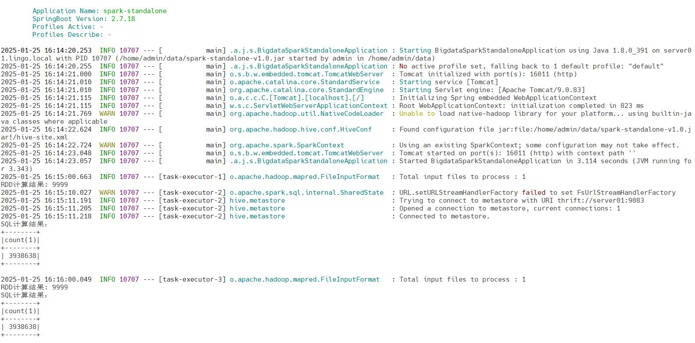

## Spark on SpringBoot

由SpringBoot框架来运行Spark任务。

一个简化的 Spark 程序运行框架，支持通过 `java -jar` 命令独立运行 Spark 作业。
该项目提供了最小化配置和轻量级启动方式，便于开发者快速部署和测试 Spark 应用程序。
适用于需要快速集成和本地测试的场景。


## 基础配置

首先创建一个SpringBoot项目，以下配置基于该项目做更改。

### 服务版本

- JDK：8
- SpringBoot：2.7.18
- Spark：3.5.4

### 配置pom.xml

```xml
<?xml version="1.0" encoding="UTF-8"?>
<project xmlns:xsi="http://www.w3.org/2001/XMLSchema-instance" xmlns="http://maven.apache.org/POM/4.0.0"
         xsi:schemaLocation="http://maven.apache.org/POM/4.0.0 https://maven.apache.org/xsd/maven-4.0.0.xsd">
    <!-- 项目模型版本 -->
    <modelVersion>4.0.0</modelVersion>

    <!-- 项目坐标 -->
    <groupId>local.ateng.java.spark</groupId>
    <artifactId>spark-standalone</artifactId>
    <version>v1.0</version>
    <name>spark-standalone</name>
    <description>
        一个简化的 Spark 程序运行框架，支持通过 `java -jar` 命令独立运行 Spark 作业。
        该项目提供了最小化配置和轻量级启动方式，便于开发者快速部署和测试 Spark 应用程序。
        适用于需要快速集成和本地测试的场景。
    </description>

    <!-- 项目属性 -->
    <properties>
        <!-- 默认主程序 -->
        <start-class>local.ateng.java.spark.BigdataSparkStandaloneApplication</start-class>
        <java.version>8</java.version>
        <project.build.sourceEncoding>UTF-8</project.build.sourceEncoding>
        <project.reporting.outputEncoding>UTF-8</project.reporting.outputEncoding>
        <spring-boot.version>2.7.18</spring-boot.version>
        <maven-compiler.version>3.12.1</maven-compiler.version>
        <maven-shade.version>3.5.1</maven-shade.version>
        <lombok.version>1.18.36</lombok.version>
        <fastjson2.version>2.0.53</fastjson2.version>
        <hutool.version>5.8.35</hutool.version>
        <spark.version>3.5.4</spark.version>
        <hadoop.version>3.3.6</hadoop.version>
        <mysql.version>8.0.33</mysql.version>
        <postgresql.version>42.7.1</postgresql.version>
    </properties>

    <!-- 项目依赖 -->
    <dependencies>
        <!-- Spring Boot Web Starter: 包含用于构建Web应用程序的Spring Boot依赖项 -->
        <dependency>
            <groupId>org.springframework.boot</groupId>
            <artifactId>spring-boot-starter-web</artifactId>
        </dependency>

        <!-- Spring Boot Starter Test: 包含用于测试Spring Boot应用程序的依赖项 -->
        <dependency>
            <groupId>org.springframework.boot</groupId>
            <artifactId>spring-boot-starter-test</artifactId>
            <scope>test</scope>
        </dependency>

        <!-- Hutool: Java工具库，提供了许多实用的工具方法 -->
        <dependency>
            <groupId>cn.hutool</groupId>
            <artifactId>hutool-all</artifactId>
            <version>${hutool.version}</version>
        </dependency>

        <!-- Lombok: 简化Java代码编写的依赖项 -->
        <!-- https://mvnrepository.com/artifact/org.projectlombok/lombok -->
        <dependency>
            <groupId>org.projectlombok</groupId>
            <artifactId>lombok</artifactId>
            <version>${lombok.version}</version>
            <scope>provided</scope>
        </dependency>

        <!-- 高性能的JSON库 -->
        <!-- https://github.com/alibaba/fastjson2/wiki/fastjson2_intro_cn#0-fastjson-20%E4%BB%8B%E7%BB%8D -->
        <dependency>
            <groupId>com.alibaba.fastjson2</groupId>
            <artifactId>fastjson2</artifactId>
            <version>${fastjson2.version}</version>
        </dependency>

        <!-- Spark Core -->
        <dependency>
            <groupId>org.apache.spark</groupId>
            <artifactId>spark-core_2.12</artifactId>
            <version>${spark.version}</version>
        </dependency>
        <!-- Spark SQL -->
        <dependency>
            <groupId>org.apache.spark</groupId>
            <artifactId>spark-sql_2.12</artifactId>
            <version>${spark.version}</version>
        </dependency>
        <!-- Spark Hive -->
        <dependency>
            <groupId>org.apache.spark</groupId>
            <artifactId>spark-hive_2.12</artifactId>
            <version>${spark.version}</version>
        </dependency>

        <!-- Hadoop HDFS客户端 -->
        <dependency>
            <groupId>org.apache.hadoop</groupId>
            <artifactId>hadoop-client</artifactId>
            <version>${hadoop.version}</version>
            <exclusions>
                <exclusion>
                    <groupId>org.slf4j</groupId>
                    <artifactId>slf4j-reload4j</artifactId>
                </exclusion>
                <exclusion>
                    <groupId>ch.qos.logback</groupId>
                    <artifactId>logback-classic</artifactId>
                </exclusion>
                <exclusion>
                    <artifactId>gson</artifactId>
                    <groupId>com.google.code.gson</groupId>
                </exclusion>
            </exclusions>
        </dependency>
    </dependencies>

    <!-- Spring Boot 依赖管理 -->
    <dependencyManagement>
        <dependencies>
            <!-- SpringBoot 依赖管理 -->
            <dependency>
                <groupId>org.springframework.boot</groupId>
                <artifactId>spring-boot-dependencies</artifactId>
                <version>${spring-boot.version}</version>
                <type>pom</type>
                <scope>import</scope>
            </dependency>
        </dependencies>
    </dependencyManagement>

    <!-- 插件仓库配置 -->
    <repositories>
        <!-- Central Repository -->
        <repository>
            <id>central</id>
            <name>阿里云中央仓库</name>
            <url>https://maven.aliyun.com/repository/central</url>
            <!--<name>Maven官方中央仓库</name>
            <url>https://repo.maven.apache.org/maven2/</url>-->
        </repository>
    </repositories>

    <!-- 构建配置 -->
    <build>
        <finalName>${project.name}-${project.version}</finalName>
        <plugins>
            <!-- Maven 编译插件 -->
            <plugin>
                <groupId>org.apache.maven.plugins</groupId>
                <artifactId>maven-compiler-plugin</artifactId>
                <version>${maven-compiler.version}</version>
                <configuration>
                    <source>${java.version}</source>
                    <target>${java.version}</target>
                    <encoding>${project.build.sourceEncoding}</encoding>
                </configuration>
            </plugin>

            <!-- Spring Boot Maven 插件 -->
            <!--<plugin>
                <groupId>org.springframework.boot</groupId>
                <artifactId>spring-boot-maven-plugin</artifactId>
                <version>${spring-boot.version}</version>
                <executions>
                    <execution>
                        <id>repackage</id>
                        <goals>
                            <goal>repackage</goal>
                        </goals>
                    </execution>
                </executions>
            </plugin>-->

            <!-- Maven Shade 打包插件 -->
            <!-- https://maven.apache.org/plugins/maven-shade-plugin/shade-mojo.html -->
            <plugin>
                <groupId>org.apache.maven.plugins</groupId>
                <artifactId>maven-shade-plugin</artifactId>
                <version>${maven-shade.version}</version>
                <configuration>
                    <!-- 禁用生成 dependency-reduced-pom.xml 文件 -->
                    <createDependencyReducedPom>false</createDependencyReducedPom>
                    <!-- 附加shaded工件时使用的分类器的名称 -->
                    <shadedClassifierName>shaded</shadedClassifierName>
                    <filters>
                        <!-- 不复制 META-INF 下的签名文件 -->
                        <filter>
                            <artifact>*:*</artifact>
                            <excludes>
                                <exclude>module-info.class</exclude>
                                <exclude>META-INF/*.SF</exclude>
                                <exclude>META-INF/*.MF</exclude>
                                <exclude>META-INF/*.DSA</exclude>
                                <exclude>META-INF/*.RSA</exclude>
                                <!--<exclude>META-INF/*.txt</exclude>
                                <exclude>META-INF/NOTICE</exclude>
                                <exclude>META-INF/LICENSE</exclude>
                                <exclude>META-INF/services/java.sql.Driver</exclude>
                                <exclude>**/Log4j2Plugins.dat</exclude>-->
                                <!-- 排除resources下的xml配置文件 -->
                                <!--<exclude>*.xml</exclude>-->
                            </excludes>
                        </filter>
                    </filters>
                    <artifactSet>
                        <!-- 排除依赖项 -->
                        <excludes>
                            <!--<exclude>org.apache.logging.log4j:*</exclude>
                            <exclude>org.slf4j:*</exclude>-->
                        </excludes>
                    </artifactSet>
                </configuration>
                <dependencies>
                    <dependency>
                        <groupId>org.springframework.boot</groupId>
                        <artifactId>spring-boot-maven-plugin</artifactId>
                        <version>${spring-boot.version}</version>
                    </dependency>
                </dependencies>
                <executions>
                    <execution>
                        <phase>package</phase>
                        <goals>
                            <goal>shade</goal>
                        </goals>
                        <configuration>
                            <transformers>
                                <transformer implementation="org.apache.maven.plugins.shade.resource.AppendingTransformer">
                                    <resource>META-INF/additional-spring-configuration-metadata.json</resource>
                                </transformer>
                                <transformer implementation="org.apache.maven.plugins.shade.resource.AppendingTransformer">
                                    <resource>META-INF/spring-configuration-metadata.json</resource>
                                </transformer>
                                <transformer implementation="org.apache.maven.plugins.shade.resource.AppendingTransformer">
                                    <resource>META-INF/spring.handlers</resource>
                                </transformer>
                                <transformer implementation="org.apache.maven.plugins.shade.resource.AppendingTransformer">
                                    <resource>META-INF/spring.schemas</resource>
                                </transformer>
                                <transformer implementation="org.apache.maven.plugins.shade.resource.AppendingTransformer">
                                    <resource>META-INF/spring.tooling</resource>
                                </transformer>
                                <transformer implementation="org.apache.maven.plugins.shade.resource.AppendingTransformer">
                                    <resource>META-INF/spring/org.springframework.boot.autoconfigure.AutoConfiguration.imports</resource>
                                </transformer>
                                <transformer implementation="org.apache.maven.plugins.shade.resource.AppendingTransformer">
                                    <resource>
                                        META-INF/spring/org.springframework.boot.actuate.autoconfigure.web.ManagementContextConfiguration.imports
                                    </resource>
                                </transformer>
                                <transformer implementation="org.springframework.boot.maven.PropertiesMergingResourceTransformer">
                                    <resource>META-INF/spring.factories</resource>
                                </transformer>
                                <transformer implementation="org.apache.maven.plugins.shade.resource.ServicesResourceTransformer"/>
                                <transformer implementation="org.apache.maven.plugins.shade.resource.ManifestResourceTransformer">
                                    <!-- 指定默认主程序 -->
                                    <mainClass>${start-class}</mainClass>
                                </transformer>
                            </transformers>
                        </configuration>
                    </execution>
                </executions>
            </plugin>
        </plugins>
        <resources>
            <!-- 第一个资源配置块 -->
            <resource>
                <directory>src/main/resources</directory>
                <filtering>false</filtering>
            </resource>
            <!-- 第二个资源配置块 -->
            <resource>
                <directory>src/main/resources</directory>
                <includes>
                    <include>application*</include>
                    <include>bootstrap*.yml</include>
                    <include>common*</include>
                    <include>banner*</include>
                </includes>
                <filtering>true</filtering>
            </resource>
        </resources>
    </build>

</project>
```

### 编辑应用配置文件

编辑 `application.yml` 配置文件

```yaml
server:
  port: 16011
  servlet:
    context-path: /
spring:
  main:
    web-application-type: servlet
  application:
    name: ${project.artifactId}
---
# 日志配置
logging:
  level:
    root: info
    org.apache.spark: warn
    org.sparkproject: warn
    org.apache.kafka: warn
```

### 拷贝Hive配置文件

将Hive的配置文件 `hive-site.xml` 拷贝到 `resources` 目录下。

### 配置异步任务

#### 开启异步和调度

```java
package local.ateng.java.spark;

import org.springframework.boot.SpringApplication;
import org.springframework.boot.autoconfigure.SpringBootApplication;
import org.springframework.scheduling.annotation.EnableAsync;
import org.springframework.scheduling.annotation.EnableScheduling;

@SpringBootApplication
@EnableAsync
@EnableScheduling
public class BigdataSparkStandaloneApplication {

    public static void main(String[] args) {
        SpringApplication.run(BigdataSparkStandaloneApplication.class, args);
    }

}
```

#### 配置线程池

```java
package local.ateng.java.spark.config;

import lombok.extern.slf4j.Slf4j;
import org.springframework.context.annotation.Bean;
import org.springframework.context.annotation.Configuration;
import org.springframework.scheduling.concurrent.ThreadPoolTaskExecutor;


/**
 * 线程池配置
 *
 * @author 孔余
 * @email 2385569970@qq.com
 * @since 2025-01-25
 */
@Slf4j
@Configuration
public class ThreadPoolConfig {

    /**
     * 核心线程数 = cpu 核心数 + 1
     */
    private final int core = Runtime.getRuntime().availableProcessors() + 1;

    @Bean
    public ThreadPoolTaskExecutor taskExecutor() {
        ThreadPoolTaskExecutor executor = new ThreadPoolTaskExecutor();
        // 核心线程数
        executor.setCorePoolSize(core);
        // 最大线程数
        executor.setMaxPoolSize(core);
        // 队列容量
        executor.setQueueCapacity(25);
        // 线程名称前缀
        executor.setThreadNamePrefix("task-executor-");
        // 线程池的等待策略
        executor.setWaitForTasksToCompleteOnShutdown(true);
        // 等待所有任务执行完再关闭
        executor.setAwaitTerminationSeconds(60);
        // 初始化线程池
        executor.initialize();
        return executor;
    }

}
```


## 运行Spark任务

### 创建实体类

```java
package local.ateng.java.spark.entity;

import lombok.AllArgsConstructor;
import lombok.Builder;
import lombok.Data;
import lombok.NoArgsConstructor;

import java.io.Serializable;
import java.math.BigDecimal;
import java.time.LocalDate;
import java.time.LocalDateTime;

/**
 * 用户实体类
 *
 * @author 孔余
 * @email 2385569970@qq.com
 * @since 2025-01-24
 */
@Data
@NoArgsConstructor
@AllArgsConstructor
@Builder
public class MyUser implements Serializable {
    private static final long serialVersionUID = 1L;

    /**
     * 用户ID
     */
    private Long id;

    /**
     * 用户姓名
     */
    private String name;

    /**
     * 用户年龄
     * 注意：这里使用Integer类型，表示年龄是一个整数值。
     */
    private Integer age;

    /**
     * 分数
     */
    private BigDecimal score;

    /**
     * 用户生日
     * 注意：这里使用Date类型，表示用户的生日。
     */
    private LocalDate birthday;

    /**
     * 用户所在省份
     */
    private String province;

    /**
     * 用户所在城市
     */
    private String city;

    /**
     * 创建时间
     */
    private LocalDateTime createTime;
}
```

### 创建Spark环境配置

```java
package local.ateng.java.spark.config;

import lombok.extern.slf4j.Slf4j;
import org.apache.spark.SparkConf;
import org.apache.spark.api.java.JavaSparkContext;
import org.apache.spark.sql.SparkSession;
import org.springframework.context.annotation.Bean;
import org.springframework.context.annotation.Configuration;

/**
 * Spark Config
 *
 * @author 孔余
 * @email 2385569970@qq.com
 * @since 2025-01-25
 */
@Configuration
@Slf4j
public class MySparkConfig {

    /**
     * 创建Spark配置
     *
     * @return Spark上下文
     */
    @Bean
    public SparkConf sparkConf() {
        // 创建Spark配置
        SparkConf conf = new SparkConf();
        // 设置应用名称
        conf.setAppName("SparkOnSpring");
        // 关闭 Web UI
        conf.set("spark.ui.enabled", "false");
        // 指定hive仓库中的默认位置
        //conf.set("spark.sql.warehouse.dir", "hdfs://server01:8020/hive/warehouse");
        // 设置运行环境
        String masterValue = conf.get("spark.master", "local[*]");
        conf.setMaster(masterValue);
        return conf;
    }

    /**
     * 创建Spark上下文
     *
     * @param conf
     * @return JavaSparkContext
     */
    @Bean(destroyMethod = "stop")
    public JavaSparkContext sparkContext(SparkConf conf) {
        return new JavaSparkContext(conf);
    }

    /**
     * 创建Spark Session
     *
     * @param conf
     * @return SparkSession
     */
    @Bean(destroyMethod = "stop")
    public SparkSession sparkSession(SparkConf conf) {
        return SparkSession
                .builder()
                .config(conf)
                .enableHiveSupport()
                .getOrCreate();
    }

}
```


### 创建RDD任务

```java
package local.ateng.java.spark.task;

import cn.hutool.extra.spring.SpringUtil;
import lombok.extern.slf4j.Slf4j;
import org.apache.spark.SparkConf;
import org.apache.spark.api.java.JavaRDD;
import org.apache.spark.api.java.JavaSparkContext;
import org.springframework.boot.context.event.ApplicationReadyEvent;
import org.springframework.context.event.EventListener;
import org.springframework.scheduling.annotation.Async;
import org.springframework.scheduling.annotation.Scheduled;
import org.springframework.stereotype.Component;

/**
 * 读取HDFS文件并计算行数
 *
 * @author 孔余
 * @email 2385569970@qq.com
 * @since 2025-01-24
 */
@Component
@Slf4j
public class RDDCount {

    @Scheduled(cron = "0 * * * * ?")
    @Async
    public void run() {
        // 获取环境
        JavaSparkContext sc = SpringUtil.getBean("sparkContext", JavaSparkContext.class);

        // 将数据并行化为RDD
        JavaRDD<String> textFileRDD = sc.textFile("hdfs://server01:8020/data/my_user.csv");

        // 使用count操作，获取RDD中行数。
        long count = textFileRDD.count();

        // 打印结果
        System.out.println("RDD计算结果: " + count);

    }
}
```


### 创建SQL任务

```java
package local.ateng.java.spark.task;

import cn.hutool.extra.spring.SpringUtil;
import lombok.extern.slf4j.Slf4j;
import org.apache.spark.SparkConf;
import org.apache.spark.api.java.JavaSparkContext;
import org.apache.spark.sql.Dataset;
import org.apache.spark.sql.Row;
import org.apache.spark.sql.SparkSession;
import org.springframework.boot.context.event.ApplicationReadyEvent;
import org.springframework.context.event.EventListener;
import org.springframework.scheduling.annotation.Async;
import org.springframework.scheduling.annotation.Scheduled;
import org.springframework.stereotype.Component;

/**
 * 查询数据数量
 *
 * @author 孔余
 * @email 2385569970@qq.com
 * @since 2025-01-24
 */
@Component
@Slf4j
public class SQLCount {

    @Scheduled(cron = "10 * * * * ?")
    @Async
    public void run() {
        // 获取环境
        SparkSession spark = SpringUtil.getBean("sparkSession", SparkSession.class);

        // 执行SQL查询
        Dataset<Row> ds = spark.sql("SELECT COUNT(*) FROM my_user");

        // 显示查询结果
        System.out.println("SQL计算结果：");
        ds.show();

    }
}
```


## 打包运行

pom.xml中通过**maven-shade-plugin**插件将SpringBoot和Spark相关的依赖包打包在一起，然后通过java -jar的方式运行。

### 运行应用

```bash
java -jar \
    -server -Xms128m -Xmx1024m \
    spark-standalone-v1.0.jar
```


