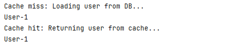

# Caffeine

Caffeine 是一个高性能的 Java 缓存库，设计目标是提供快速、低延迟的缓存操作。它支持自动过期、基于容量的限制、异步加载等功能，能够有效提升应用性能。与其他缓存解决方案相比，Caffeine 在性能和内存占用上表现优异，广泛用于需要高频次缓存访问的场景。

- [官网地址](https://github.com/ben-manes/caffeine)

## 基础配置

### 添加依赖

```xml
<!-- Caffeine 依赖 -->
<dependency>
    <groupId>com.github.ben-manes.caffeine</groupId>
    <artifactId>caffeine</artifactId>
</dependency>
```

### 配置Caffeine缓存

```java
package local.ateng.java.caffeine.config;

import com.github.benmanes.caffeine.cache.Cache;
import com.github.benmanes.caffeine.cache.Caffeine;
import org.springframework.context.annotation.Bean;
import org.springframework.context.annotation.Configuration;

import java.util.concurrent.TimeUnit;

@Configuration
public class CacheConfig {

    @Bean
    public Cache<Long, String> caffeineCache() {
        return Caffeine.newBuilder()
                .maximumSize(10_000)                      // 设置缓存的最大数量
                .expireAfterWrite(10, TimeUnit.MINUTES) // 设置写入后 10 分钟过期
                .build(); // 构建 Cache
    }

}
```


## 使用Caffeine缓存

### 创建服务

```java
package local.ateng.java.caffeine.service;

import com.github.benmanes.caffeine.cache.Cache;
import org.springframework.beans.factory.annotation.Autowired;
import org.springframework.stereotype.Service;

@Service
public class UserService {

    private final Cache<Long, String> cache;

    @Autowired
    public UserService(Cache<Long, String> cache) {
        this.cache = cache;
    }

    public String getUserById(Long userId) {
        // 尝试从缓存中获取数据
        String user = cache.getIfPresent(userId);

        if (user == null) {
            // 缓存未命中，模拟从数据库获取数据
            System.out.println("Cache miss: Loading user from DB...");
            user = "User-" + userId;  // 这里模拟从数据库获取
            // 将数据放入缓存
            cache.put(userId, user);
        } else {
            System.out.println("Cache hit: Returning user from cache...");
        }

        return user;
    }

    // 清空缓存
    public void clearCache(Long userId) {
        cache.invalidate(userId);
    }

    // 清空所有缓存
    public void clearAllCache() {
        cache.invalidateAll();
    }
}
```

### 测试缓存

```java
package local.ateng.java.caffeine;

import local.ateng.java.caffeine.service.UserService;
import org.junit.jupiter.api.Test;
import org.springframework.beans.factory.annotation.Autowired;
import org.springframework.boot.test.context.SpringBootTest;

@SpringBootTest
public class UserServiceTest {

    @Autowired
    private UserService userService;

    @Test
    void testCaching() {
        // 第一次调用，会从“数据库”加载
        String user1 = userService.getUserById(1L);
        System.out.println(user1);  // 输出 Cache miss

        // 第二次调用，会从缓存获取
        String user2 = userService.getUserById(1L);
        System.out.println(user2);  // 输出 Cache hit
    }
}
```



## 集成SpringCache

### 添加依赖

```xml
<!-- SpringBoot缓存 依赖 -->
<dependency>
    <groupId>org.springframework.boot</groupId>
    <artifactId>spring-boot-starter-cache</artifactId>
</dependency>
```

### 配置缓存管理器

添加以下代码，配置 Caffeine 缓存管理器

```java
@Configuration
@EnableCaching  // 启用缓存
public class CacheConfig {

    /**
     * 配置 Caffeine 缓存管理器
     * @return CacheManager
     */
    @Bean
    public CacheManager caffeineCacheManager() {
        CaffeineCacheManager cacheManager = new CaffeineCacheManager();
        // 配置Caffeine缓存
        cacheManager.setCaffeine(Caffeine.newBuilder()
                .expireAfterWrite(5, TimeUnit.MINUTES)  // 5分钟后缓存失效
                .maximumSize(10_000)  // 最大缓存条目数
                .recordStats());    // 记录缓存统计信息
        return cacheManager;
    }

}
```

### 使用方法注解缓存

#### 创建服务

```java
package local.ateng.java.caffeine.service;

import lombok.extern.slf4j.Slf4j;
import org.springframework.cache.annotation.CacheEvict;
import org.springframework.cache.annotation.CachePut;
import org.springframework.cache.annotation.Cacheable;
import org.springframework.stereotype.Service;

@Service
@Slf4j
public class RemoteService {

    @Cacheable(value = "my:cache", key = "#id")
    public String getDataById(int id) {
        // 模拟从数据库或其他数据源获取数据
        String data = "Data for id " + id;
        log.info(data);
        return data;
    }

    @CachePut(value = "my:cache", key = "#id")
    public String updateData(int id, String newData) {
        // 模拟更新数据源
        String data = "newData " + newData + " for id " + id;
        log.info(data);
        return data;
    }

    @CacheEvict(value = "my:cache", key = "#id")
    public void deleteData(int id) {
        // 模拟删除数据源
        String data = "Data for id " + id;
        log.info(data);
    }

}
```

#### 创建接口

```java
package local.ateng.java.caffeine.controller;

import local.ateng.java.caffeine.service.RemoteService;
import lombok.RequiredArgsConstructor;
import org.springframework.beans.factory.annotation.Autowired;
import org.springframework.web.bind.annotation.GetMapping;
import org.springframework.web.bind.annotation.PathVariable;
import org.springframework.web.bind.annotation.RequestMapping;
import org.springframework.web.bind.annotation.RestController;

@RestController
@RequestMapping("/remote")
@RequiredArgsConstructor(onConstructor = @__(@Autowired))
public class RemoteController {

    private final RemoteService remoteService;

    @GetMapping("/data/{id}")
    public String getData(@PathVariable int id) {
        return remoteService.getDataById(id);
    }

    @GetMapping("/update/{id}/{newData}")
    public String updateData(@PathVariable int id, @PathVariable String newData) {
        return remoteService.updateData(id, newData);
    }

    @GetMapping("/delete/{id}")
    public void deleteData(@PathVariable int id) {
        remoteService.deleteData(id);
    }

}
```

#### 使用缓存

1. 先调用 get 获取数据并写入缓存：
2. 调用 update 更新缓存数据和重置过期时间
3. 调用 delete 删除缓存


## SpEL

在 `@Cacheable` 注解中的 `key` 属性，可以使用 **SpEL (Spring Expression Language)** 表达式来定义缓存的键。`key` 表达式允许你根据方法的输入参数、方法返回值或其他上下文动态生成缓存的键。下面是一些常见的写法，涵盖了如何利用 SpEL 在 `key` 属性中动态计算缓存键。

### 1. **使用方法参数作为缓存键**

最常见的写法是直接使用方法参数作为缓存的键。可以通过 `#paramName` 来引用方法参数：

```java
@Cacheable(value = "my:cache", key = "#id")
public String getDataById(String id) {
    return "Some data for " + id;
}
```

- `#id` 表示缓存的键是方法参数 `id` 的值。

如果方法参数是一个对象，你也可以通过 `#param.field` 来引用对象的字段：

```java
@Cacheable(value = "my:cache", key = "#user.id")
public User getUser(User user) {
    return user;
}
```

- `#user.id` 表示缓存的键是 `user` 对象的 `id` 字段。

### 2. **使用多个参数组合缓存键**

你可以使用多个方法参数作为缓存键的组成部分，通过 `#param1`, `#param2` 等组合起来。例如：

```java
@Cacheable(value = "my:cache", key = "#firstName + '-' + #lastName")
public String getFullName(String firstName, String lastName) {
    return firstName + " " + lastName;
}
```

- `#firstName + '-' + #lastName` 组合了 `firstName` 和 `lastName` 两个方法参数的值，用 `-` 连接作为缓存的键。

### 3. **使用方法参数的集合或数组**

如果你有一个集合或数组作为方法参数，并希望将其内容作为缓存键，可以使用 SpEL 表达式对集合进行操作：

```java
@Cacheable(value = "my:cache", key = "#ids.toString()")
public List<User> getUsersByIds(List<String> ids) {
    return userService.getUsersByIds(ids);
}
```

- `#ids.toString()` 将 `ids` 列表的内容转换为字符串并作为缓存的键。

### 4. **引用方法的返回值**

你可以引用方法的返回值作为缓存的键，但这种做法不常见，且需要注意缓存时的性能开销，因为计算方法的返回值可能比较复杂。

```java
@Cacheable(value = "my:cache", key = "#result.id")
public User getUser(String id) {
    return userService.getUserById(id);
}
```

- `#result.id` 引用了方法返回值 `User` 对象的 `id` 字段。

### 5. **使用常量作为缓存键的一部分**

你可以使用常量来作为缓存键的一部分，甚至与方法参数结合。

```java
@Cacheable(value = "my:cache", key = "'user:' + #id")
public User getUserById(String id) {
    return userService.getUserById(id);
}
```

- `'user:' + #id` 将字符串 `"user:"` 和方法参数 `id` 结合起来作为缓存键。

### 6. **使用拼接多个参数与常量**

通过拼接多个方法参数和常量，你可以生成一个复杂的缓存键：

```java
@Cacheable(value = "my:cache", key = "#type + ':' + #category + ':' + #id")
public Product getProduct(String type, String category, String id) {
    return productService.getProduct(type, category, id);
}
```

- `#type + ':' + #category + ':' + #id` 将多个参数拼接为一个缓存键。

### 7. **使用 Map 或其他对象的属性**

如果方法参数是一个 `Map` 或其他对象，你可以通过 `#paramName.key` 来引用其特定的属性或值：

```java
@Cacheable(value = "my:cache", key = "#map['id']")
public User getUserByMap(Map<String, String> map) {
    return userService.getUserById(map.get("id"));
}
```

- `#map['id']` 获取 `map` 对象中 `id` 键的值作为缓存的键。

### 8. **使用数组索引**

如果方法参数是一个数组，你可以通过索引来指定某个元素作为缓存键：

```java
@Cacheable(value = "my:cache", key = "#array[0]")
public String getFirstElement(String[] array) {
    return array[0];
}
```

- `#array[0]` 表示取数组 `array` 中的第一个元素作为缓存键。

### 9. **组合复杂的对象属性**

你可以组合多个复杂对象的多个字段来生成缓存键。例如，假设方法参数是一个复合对象，包含多个字段，你可以使用 `#object.field1 + #object.field2` 等来构造缓存键。

```java
@Cacheable(value = "my:cache", key = "#user.name + '-' + #user.age")
public String getUserInfo(User user) {
    return user.getName() + " " + user.getAge();
}
```

- `#user.name + '-' + #user.age` 将 `user` 对象的 `name` 和 `age` 字段作为缓存的键。

### 10. **使用运算符和条件**

你可以在 `key` 中使用基本的运算符或者条件逻辑：

```java
@Cacheable(value = "my:cache", key = "#id % 2 == 0 ? 'even:' + #id : 'odd:' + #id")
public String getUserById(String id) {
    return "User " + id;
}
```

- `#id % 2 == 0 ? 'even:' + #id : 'odd:' + #id` 根据 `id` 的偶数或奇数来决定缓存键。

### 11. **使用 `T` 引用类**

你还可以通过 `T` 关键字引用类，并访问类的静态方法或常量：

```java
@Cacheable(value = "my:cache", key = "T(com.example.MyClass).getStaticKey()")
public String getData() {
    return "Some data";
}
```

- `T(com.example.MyClass).getStaticKey()` 调用 `MyClass` 类的静态方法 `getStaticKey()` 获取缓存键。

### 小结

在 `@Cacheable` 注解中的 `key` 属性可以通过 **SpEL** 来灵活地定义缓存的键，以下是一些常见的使用场景：

1. 使用方法参数作为缓存键：`#id`, `#user.name`
2. 组合多个参数：`#firstName + '-' + #lastName`
3. 处理集合或数组：`#ids.toString()`, `#array[0]`
4. 使用常量和拼接：`'user:' + #id`
5. 引用对象属性：`#map['id']`, `#user.age`
6. 进行条件判断和运算：`#id % 2 == 0 ? 'even:' + #id : 'odd:' + #id`
7. 引用静态方法：`T(com.example.MyClass).getStaticKey()`

这些方式让你可以根据实际业务需求灵活地生成缓存的键，从而提高缓存的命中率和管理的灵活性。
