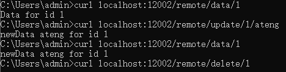

# Caffeine

Caffeine 是一个高性能的 Java 缓存库，设计目标是提供快速、低延迟的缓存操作。它支持自动过期、基于容量的限制、异步加载等功能，能够有效提升应用性能。与其他缓存解决方案相比，Caffeine 在性能和内存占用上表现优异，广泛用于需要高频次缓存访问的场景。

- [官网地址](https://github.com/ben-manes/caffeine)

## 基础配置

### 添加依赖

```xml
<!-- Caffeine 依赖 -->
<dependency>
    <groupId>com.github.ben-manes.caffeine</groupId>
    <artifactId>caffeine</artifactId>
</dependency>
```

### 配置Caffeine缓存

```java
package local.ateng.java.caffeine.config;

import com.github.benmanes.caffeine.cache.Cache;
import com.github.benmanes.caffeine.cache.Caffeine;
import org.springframework.context.annotation.Bean;
import org.springframework.context.annotation.Configuration;

import java.util.concurrent.TimeUnit;

@Configuration
public class CacheConfig {

    @Bean
    public Cache<Long, String> caffeineCache() {
        return Caffeine.newBuilder()
                .maximumSize(10_000)                      // 设置缓存的最大数量
                .expireAfterWrite(10, TimeUnit.MINUTES) // 设置写入后 10 分钟过期
                .build(); // 构建 Cache
    }

}
```


## 使用Caffeine缓存

### 创建服务

```java
package local.ateng.java.caffeine.service;

import com.github.benmanes.caffeine.cache.Cache;
import org.springframework.beans.factory.annotation.Autowired;
import org.springframework.stereotype.Service;

@Service
public class UserService {

    private final Cache<Long, String> cache;

    @Autowired
    public UserService(Cache<Long, String> cache) {
        this.cache = cache;
    }

    public String getUserById(Long userId) {
        // 尝试从缓存中获取数据
        String user = cache.getIfPresent(userId);

        if (user == null) {
            // 缓存未命中，模拟从数据库获取数据
            System.out.println("Cache miss: Loading user from DB...");
            user = "User-" + userId;  // 这里模拟从数据库获取
            // 将数据放入缓存
            cache.put(userId, user);
        } else {
            System.out.println("Cache hit: Returning user from cache...");
        }

        return user;
    }

    // 清空缓存
    public void clearCache(Long userId) {
        cache.invalidate(userId);
    }

    // 清空所有缓存
    public void clearAllCache() {
        cache.invalidateAll();
    }
}
```

### 测试缓存

```java
package local.ateng.java.caffeine;

import local.ateng.java.caffeine.service.UserService;
import org.junit.jupiter.api.Test;
import org.springframework.beans.factory.annotation.Autowired;
import org.springframework.boot.test.context.SpringBootTest;

@SpringBootTest
public class UserServiceTest {

    @Autowired
    private UserService userService;

    @Test
    void testCaching() {
        // 第一次调用，会从“数据库”加载
        String user1 = userService.getUserById(1L);
        System.out.println(user1);  // 输出 Cache miss

        // 第二次调用，会从缓存获取
        String user2 = userService.getUserById(1L);
        System.out.println(user2);  // 输出 Cache hit
    }
}
```


## 集成SpringCache

### 添加依赖

```xml
<!-- SpringBoot缓存 依赖 -->
<dependency>
    <groupId>org.springframework.boot</groupId>
    <artifactId>spring-boot-starter-cache</artifactId>
</dependency>
```

### 配置缓存管理器

添加以下代码，配置 Caffeine 缓存管理器

```java
@Configuration
@EnableCaching  // 启用缓存
public class CacheConfig {

    /**
     * 配置 Caffeine 缓存管理器
     * @return CacheManager
     */
    @Bean
    public CacheManager caffeineCacheManager() {
        CaffeineCacheManager cacheManager = new CaffeineCacheManager();
        // 配置Caffeine缓存
        cacheManager.setCaffeine(Caffeine.newBuilder()
                .expireAfterWrite(5, TimeUnit.MINUTES)  // 5分钟后缓存失效
                .maximumSize(10_000)  // 最大缓存条目数
                .recordStats());    // 记录缓存统计信息
        return cacheManager;
    }

}
```

### 使用方法注解缓存

#### 创建服务

```java
package local.ateng.java.caffeine.service;

import lombok.extern.slf4j.Slf4j;
import org.springframework.cache.annotation.CacheEvict;
import org.springframework.cache.annotation.CachePut;
import org.springframework.cache.annotation.Cacheable;
import org.springframework.stereotype.Service;

@Service
@Slf4j
public class RemoteService {

    @Cacheable(value = "my:cache", key = "#id")
    public String getDataById(int id) {
        // 模拟从数据库或其他数据源获取数据
        String data = "Data for id " + id;
        log.info(data);
        return data;
    }

    @CachePut(value = "my:cache", key = "#id")
    public String updateData(int id, String newData) {
        // 模拟更新数据源
        String data = "newData " + newData + " for id " + id;
        log.info(data);
        return data;
    }

    @CacheEvict(value = "my:cache", key = "#id")
    public void deleteData(int id) {
        // 模拟删除数据源
        String data = "Data for id " + id;
        log.info(data);
    }

}
```

#### 创建接口

```java
package local.ateng.java.caffeine.controller;

import local.ateng.java.caffeine.service.RemoteService;
import lombok.RequiredArgsConstructor;
import org.springframework.beans.factory.annotation.Autowired;
import org.springframework.web.bind.annotation.GetMapping;
import org.springframework.web.bind.annotation.PathVariable;
import org.springframework.web.bind.annotation.RequestMapping;
import org.springframework.web.bind.annotation.RestController;

@RestController
@RequestMapping("/remote")
@RequiredArgsConstructor(onConstructor = @__(@Autowired))
public class RemoteController {

    private final RemoteService remoteService;

    @GetMapping("/data/{id}")
    public String getData(@PathVariable int id) {
        return remoteService.getDataById(id);
    }

    @GetMapping("/update/{id}/{newData}")
    public String updateData(@PathVariable int id, @PathVariable String newData) {
        return remoteService.updateData(id, newData);
    }

    @GetMapping("/delete/{id}")
    public void deleteData(@PathVariable int id) {
        remoteService.deleteData(id);
    }

}
```

#### 使用缓存

1. 先调用 get 获取数据并写入缓存：
2. 调用 update 更新缓存数据和重置过期时间
3. 调用 delete 删除缓存


