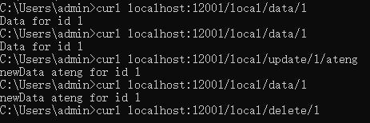
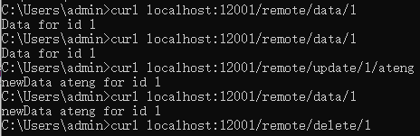

# JetCache

JetCache是一个基于Java的缓存系统封装，提供统一的API和注解来简化缓存的使用。 JetCache提供了比SpringCache更加强大的注解，可以原生的支持TTL、两级缓存、分布式自动刷新，还提供了`Cache`接口用于手工缓存操作。 当前有四个实现，`RedisCache`、`TairCache`（此部分未在github开源）、`CaffeineCache`(in memory)和一个简易的`LinkedHashMapCache`(in memory)，要添加新的实现也是非常简单的。

全部特性:

- 通过统一的API访问Cache系统
- 通过注解实现声明式的方法缓存，支持TTL和两级缓存
- 通过注解创建并配置`Cache`实例
- 针对所有`Cache`实例和方法缓存的自动统计
- Key的生成策略和Value的序列化策略是可以配置的
- 分布式缓存自动刷新，分布式锁 (2.2+)
- 异步Cache API (2.2+，使用Redis的lettuce客户端时)
- Spring Boot支持

参考：[官网文档](https://github.com/alibaba/jetcache/blob/master/docs/CN/Readme.md)


## 本地缓存

### 添加依赖

```xml
<jetcache.version>2.7.7</jetcache.version>
<!-- JetCache 依赖 -->
<dependency>
    <groupId>com.alicp.jetcache</groupId>
    <artifactId>jetcache-autoconfigure</artifactId>
    <version>${jetcache.version}</version>
</dependency>
```

### 编辑配置文件

配置文件参考：[官网链接](https://github.com/alibaba/jetcache/blob/master/docs/CN/Config.md)

```yaml
# JetCache 配置
jetcache:
  # 本地缓存配置
  local:
    default:
      type: caffeine  # 缓存类型：linkedhashmap 或 caffeine
      limit: 100       # 缓存实例的最大元素数
      keyConvertor: fastjson2 # key 序列化方式，支持：fastjson2/jackson
      expireAfterWriteInMillis: 100000  # 缓存过期时间（毫秒）
```

### 启动缓存

```java
package local.ateng.java.jetcache;

import com.alicp.jetcache.anno.config.EnableMethodCache;
import org.springframework.boot.SpringApplication;
import org.springframework.boot.autoconfigure.SpringBootApplication;

@SpringBootApplication
@EnableMethodCache(basePackages = {"local.ateng.java"})
public class DBJetCacheApplication {

    public static void main(String[] args) {
        SpringApplication.run(DBJetCacheApplication.class, args);
    }

}
```

### 使用方法注解缓存

#### 创建服务

```java
package local.ateng.java.jetcache.local;

import com.alicp.jetcache.anno.CacheInvalidate;
import com.alicp.jetcache.anno.CacheType;
import com.alicp.jetcache.anno.CacheUpdate;
import com.alicp.jetcache.anno.Cached;
import lombok.extern.slf4j.Slf4j;
import org.springframework.stereotype.Service;

import java.util.concurrent.TimeUnit;

@Service
@Slf4j
public class LocalService {

    // 使用 @Cached 注解缓存方法的返回值
    @Cached(cacheType = CacheType.LOCAL, name = "myCache", key = "#id", expire = 2, timeUnit = TimeUnit.MINUTES)
    public String getDataById(int id) {
        // 模拟从数据库或其他数据源获取数据
        String data = "Data for id " + id;
        log.info(data);
        return data;
    }

    // 使用 @CacheUpdate 注解更新缓存
    @CacheUpdate(name = "myCache", key = "#id", value = "#result")
    public String updateData(int id, String newData) {
        // 模拟更新数据源
        String data = "newData " + newData + " for id " + id;
        log.info(data);
        return data;
    }

    // 使用 @CacheInvalidate 注解删除缓存
    @CacheInvalidate(name = "myCache", key = "#id")
    public void deleteData(int id) {
        // 模拟删除数据源
        String data = "Data for id " + id;
        log.info(data);
    }

}
```

#### 创建接口

```java
package local.ateng.java.jetcache.local;

import lombok.RequiredArgsConstructor;
import org.springframework.beans.factory.annotation.Autowired;
import org.springframework.web.bind.annotation.GetMapping;
import org.springframework.web.bind.annotation.PathVariable;
import org.springframework.web.bind.annotation.RequestMapping;
import org.springframework.web.bind.annotation.RestController;

@RestController
@RequestMapping("/local")
@RequiredArgsConstructor(onConstructor = @__(@Autowired))
public class LocalController {

    private final LocalService localService;

    @GetMapping("/data/{id}")
    public String getData(@PathVariable int id) {
        return localService.getDataById(id);
    }

    @GetMapping("/update/{id}/{newData}")
    public String updateData(@PathVariable int id, @PathVariable String newData) {
        return localService.updateData(id, newData);
    }

    @GetMapping("/delete/{id}")
    public void deleteData(@PathVariable int id) {
        localService.deleteData(id);
    }

}
```

#### 使用缓存

1. 先调用 get 获取数据并写入缓存：
2. 调用 update 更新缓存数据和重置过期时间
3. 调用 delete 删除缓存



### 使用手动缓存

#### 使用CacheManager创建Cache实例

```java
package local.ateng.java.jetcache.local;

import com.alicp.jetcache.Cache;
import com.alicp.jetcache.CacheManager;
import com.alicp.jetcache.anno.CacheType;
import com.alicp.jetcache.template.QuickConfig;
import jakarta.annotation.PostConstruct;
import lombok.RequiredArgsConstructor;
import org.springframework.beans.factory.annotation.Autowired;
import org.springframework.context.annotation.Bean;
import org.springframework.context.annotation.Configuration;

import java.time.Duration;

@Configuration
@RequiredArgsConstructor(onConstructor = @__(@Autowired))
public class JetcacheLocalConfig {
    private final CacheManager cacheManager;
    private Cache<Integer, Object> localCache;

    @PostConstruct
    public void init() {
        QuickConfig qc = QuickConfig.newBuilder("localCache:")
                .expire(Duration.ofSeconds(3600))
                .cacheType(CacheType.LOCAL)
                .build();
        localCache = cacheManager.getOrCreateCache(qc);
    }

    @Bean
    public Cache<Integer, Object> localCache() {
        return localCache;
    }

}
```

#### 使用缓存

```java
@RestController
@RequestMapping("/local")
@RequiredArgsConstructor(onConstructor = @__(@Autowired))
public class LocalController {

    private final Cache<Integer, String> manualCache;

    @GetMapping("/manual/put/{id}")
    public void manualPut(@PathVariable int id) {
        manualCache.put(id, "Hello World");
    }

    @GetMapping("/manual/get/{id}")
    public String manualGet(@PathVariable int id) {
        return manualCache.get(id);
    }

    @GetMapping("/manual/list")
    public Map<Integer, String> manualList() {
        return manualCache.getAll(Set.of(1, 2, 3, 4, 5, 6, 7, 8, 9));
    }

}
```


## 远程缓存

### 基础配置

#### Jedis

参考：[官网链接](https://github.com/alibaba/jetcache/blob/master/docs/CN/RedisWithJedis.md)

**添加依赖**

```xml
<jetcache.version>2.7.7</jetcache.version>
<!-- JetCache 依赖 -->
<dependency>
    <groupId>com.alicp.jetcache</groupId>
    <artifactId>jetcache-starter-redis</artifactId>
    <version>${jetcache.version}</version>
</dependency>
```

**编辑配置文件**

配置文件参考：[官网链接](https://github.com/alibaba/jetcache/blob/master/docs/CN/Config.md)

```yaml
---
# JetCache 配置
jetcache:
  statIntervalMinutes: 15
  areaInCacheName: false
  # 本地缓存配置
  local:
    default:
      type: caffeine  # 缓存类型：linkedhashmap 或 caffeine
      limit: 100       # 缓存实例的最大元素数
      keyConvertor: fastjson2 # key 序列化方式，支持：fastjson2/jackson
      expireAfterWriteInMillis: 100000  # 缓存过期时间（毫秒）
  # 远程缓存配置
  remote:
    default:
      type: redis      # 缓存类型
      keyConvertor: fastjson2  # key 序列化方式
      broadcastChannel: ${spring.application.name}  # 缓存广播频道
      valueEncoder: java  # 值序列化方式
      valueDecoder: java  # 值反序列化方式
      poolConfig:
        minIdle: 5       # 连接池最小空闲连接数
        maxIdle: 20      # 连接池最大空闲连接数
        maxTotal: 50     # 连接池最大连接数
      host: 192.168.1.10  # Redis 主机地址
      port: 42784         # Redis 端口
      password: Admin@123 # Redis 密码
      database: 41
      # 通用配置
      timeout: 2000
      connectionTimeout: 2000
      soTimeout: 2000
      maxAttempt: 5
      defaultExpireInMillis: 60000
      keyPrefix: "ateng:jetcache:"
```

#### Lettuce

参考：[官网链接](https://github.com/alibaba/jetcache/blob/master/docs/CN/RedisWithLettuce.md)

**添加依赖**

```xml
<jetcache.version>2.7.7</jetcache.version>
<!-- JetCache 依赖 -->
<dependency>
    <groupId>com.alicp.jetcache</groupId>
    <artifactId>jetcache-starter-redis-lettuce</artifactId>
    <version>${jetcache.version}</version>
</dependency>
```

**编辑配置文件**

lettuce 使用 Netty 建立并复用单个连接实现 redis 的通信，因此无须配置连接池。

配置文件参考：[官网链接](https://github.com/alibaba/jetcache/blob/master/docs/CN/Config.md)

```yaml
---
# JetCache 配置
jetcache:
  statIntervalMinutes: 15
  areaInCacheName: false
  # 本地缓存配置
  local:
    default:
      type: caffeine  # 缓存类型：linkedhashmap 或 caffeine
      limit: 100       # 缓存实例的最大元素数
      keyConvertor: fastjson2 # key 序列化方式，支持：fastjson2/jackson
      expireAfterWriteInMillis: 100000  # 缓存过期时间（毫秒）
  # 远程缓存配置
  remote:
    default:
      type: redis.lettuce      # 缓存类型
      keyConvertor: fastjson2  # key 序列化方式
      broadcastChannel: ${spring.application.name}  # 缓存广播频道
      valueEncoder: java  # 值序列化方式
      valueDecoder: java  # 值反序列化方式
      uri: redis://:Admin%40123@192.168.1.10:42784/41 # Redis URI，格式：redis://[username:password@]host:port[/database]，特殊密码需要encode转码
      # 通用配置
      timeout: 2000
      connectionTimeout: 2000
      soTimeout: 2000
      maxAttempt: 5
      defaultExpireInMillis: 60000
      keyPrefix: "ateng:jetcache:"
```

#### Redisson

参考：[官网链接](https://github.com/alibaba/jetcache/blob/master/docs/CN/RedisWithRedisson.md)

**添加依赖**

```xml
<jetcache.version>2.7.7</jetcache.version>
<redisson.version>3.44.0</redisson.version>
<!-- JetCache 依赖 -->
<dependency>
    <groupId>com.alicp.jetcache</groupId>
    <artifactId>jetcache-starter-redisson</artifactId>
    <version>${jetcache.version}</version>
    <exclusions>
        <exclusion>
            <groupId>org.redisson</groupId>
            <artifactId>redisson-spring-boot-starter</artifactId>
        </exclusion>
    </exclusions>
</dependency>
<!-- Redisson 依赖 -->
<dependency>
    <groupId>org.redisson</groupId>
    <artifactId>redisson-spring-boot-starter</artifactId>
    <version>${redisson.version}</version>
</dependency>
```

**编辑配置文件**

redisson 不支持通过配置连接，而是通过获取 Spring bean 拿到 Client 实例，因此在 Spring Boot 环境下使用 redisson 支持时，客户端特定的参数只需要配置一个 `redissonClient` 即可。

配置文件参考：[官网链接](https://github.com/alibaba/jetcache/blob/master/docs/CN/Config.md)

```yaml
---
# JetCache 配置
jetcache:
  statIntervalMinutes: 15
  areaInCacheName: false
  # 本地缓存配置
  local:
    default:
      type: caffeine  # 缓存类型：linkedhashmap 或 caffeine
      limit: 100       # 缓存实例的最大元素数
      keyConvertor: fastjson2 # key 序列化方式，支持：fastjson2/jackson
      expireAfterWriteInMillis: 100000  # 缓存过期时间（毫秒）
  # 远程缓存配置
  remote:
    default:
      type: redisson      # 缓存类型
      redissonClient: redissonClient
      keyConvertor: fastjson2  # key 序列化方式
      broadcastChannel: ${spring.application.name}  # 缓存广播频道
      valueEncoder: java  # 值序列化方式
      valueDecoder: java  # 值反序列化方式
      defaultExpireInMillis: 60000
      keyPrefix: "ateng:jetcache:"
---
# Redisson 的相关配置
redisson:
  config: |
    singleServerConfig:
      address: redis://192.168.1.10:42784
      password: Admin@123
      database: 41
      clientName: redisson-client
      connectionPoolSize: 64      # 最大连接数
      connectionMinimumIdleSize: 24 # 最小空闲连接
      idleConnectionTimeout: 10000 # 空闲连接超时时间（ms）
      connectTimeout: 5000        # 连接超时时间
      timeout: 3000               # 命令等待超时
      retryAttempts: 3            # 命令重试次数
      retryInterval: 1500         # 命令重试间隔（ms）
    threads: 16                   # 处理Redis事件的线程数
    nettyThreads: 32              # Netty线程数
    codec: !<org.redisson.codec.JsonJacksonCodec> {} # 推荐JSON序列化
```

**创建配置属性**

```java
package local.ateng.java.jetcache.config;

import lombok.Data;
import org.springframework.boot.context.properties.ConfigurationProperties;
import org.springframework.context.annotation.Configuration;

@ConfigurationProperties(prefix = "redisson")
@Configuration
@Data
public class RedissonProperties {
    private String config;
}
```

**创建客户端Bean**

```java
package local.ateng.java.jetcache.config;

import lombok.RequiredArgsConstructor;
import org.redisson.Redisson;
import org.redisson.api.RedissonClient;
import org.redisson.config.Config;
import org.springframework.beans.factory.annotation.Autowired;
import org.springframework.context.annotation.Bean;
import org.springframework.context.annotation.Configuration;

import java.io.IOException;

@Configuration
@RequiredArgsConstructor(onConstructor = @__(@Autowired))
public class RedissonConfig {
    private final RedissonProperties redissonProperties;

    @Bean
    public RedissonClient redissonClient() throws IOException {
        Config config = Config.fromYAML(redissonProperties.getConfig());
        return Redisson.create(config);
    }

}
```

### 启动缓存

```java
package local.ateng.java.jetcache;

import com.alicp.jetcache.anno.config.EnableMethodCache;
import org.springframework.boot.SpringApplication;
import org.springframework.boot.autoconfigure.SpringBootApplication;

@SpringBootApplication
@EnableMethodCache(basePackages = {"local.ateng.java"})
public class DBJetCacheApplication {

    public static void main(String[] args) {
        SpringApplication.run(DBJetCacheApplication.class, args);
    }

}
```

### 使用方法注解缓存

#### 创建服务

```java
package local.ateng.java.jetcache.remote;

import com.alicp.jetcache.anno.CacheInvalidate;
import com.alicp.jetcache.anno.CacheType;
import com.alicp.jetcache.anno.CacheUpdate;
import com.alicp.jetcache.anno.Cached;
import lombok.extern.slf4j.Slf4j;
import org.springframework.stereotype.Service;

import java.util.concurrent.TimeUnit;

@Service
@Slf4j
public class RemoteService {

    // 使用 @Cached 注解缓存方法的返回值
    @Cached(cacheType = CacheType.REMOTE, name = "my:cache", key = "#id", expire = 2, timeUnit = TimeUnit.MINUTES)
    public String getDataById(int id) {
        // 模拟从数据库或其他数据源获取数据
        String data = "Data for id " + id;
        log.info(data);
        return data;
    }

    // 使用 @CacheUpdate 注解更新缓存
    @CacheUpdate(name = "my:cache", key = "#id", value = "#result")
    public String updateData(int id, String newData) {
        // 模拟更新数据源
        String data = "newData " + newData + " for id " + id;
        log.info(data);
        return data;
    }

    // 使用 @CacheInvalidate 注解删除缓存
    @CacheInvalidate(name = "my:cache", key = "#id")
    public void deleteData(int id) {
        // 模拟删除数据源
        String data = "Data for id " + id;
        log.info(data);
    }

}
```

#### 创建接口

```java
package local.ateng.java.jetcache.remote;

import lombok.RequiredArgsConstructor;
import org.springframework.beans.factory.annotation.Autowired;
import org.springframework.web.bind.annotation.GetMapping;
import org.springframework.web.bind.annotation.PathVariable;
import org.springframework.web.bind.annotation.RequestMapping;
import org.springframework.web.bind.annotation.RestController;

@RestController
@RequestMapping("/remote")
@RequiredArgsConstructor(onConstructor = @__(@Autowired))
public class RemoteController {

    private final RemoteService remoteService;

    @GetMapping("/data/{id}")
    public String getData(@PathVariable int id) {
        return remoteService.getDataById(id);
    }

    @GetMapping("/update/{id}/{newData}")
    public String updateData(@PathVariable int id, @PathVariable String newData) {
        return remoteService.updateData(id, newData);
    }

    @GetMapping("/delete/{id}")
    public void deleteData(@PathVariable int id) {
        remoteService.deleteData(id);
    }

}
```

#### 使用缓存

1. 先调用 get 获取数据并写入缓存：
2. 调用 update 更新缓存数据和重置过期时间
3. 调用 delete 删除缓存



### 使用手动缓存

#### 使用CacheManager创建Cache实例

```java
package local.ateng.java.jetcache.remote;

import com.alicp.jetcache.Cache;
import com.alicp.jetcache.CacheManager;
import com.alicp.jetcache.anno.CacheType;
import com.alicp.jetcache.template.QuickConfig;
import jakarta.annotation.PostConstruct;
import lombok.RequiredArgsConstructor;
import org.springframework.beans.factory.annotation.Autowired;
import org.springframework.context.annotation.Bean;
import org.springframework.context.annotation.Configuration;

import java.time.Duration;

@Configuration
@RequiredArgsConstructor(onConstructor = @__(@Autowired))
public class JetcacheRemoteConfig {
    private final CacheManager cacheManager;
    private Cache<Integer, String> manualRemoteCache;

    @PostConstruct
    public void init() {
        QuickConfig qc = QuickConfig.newBuilder("manualRemoteCache:")
                .expire(Duration.ofSeconds(3600))
                .cacheType(CacheType.REMOTE)
                .build();
        manualRemoteCache = cacheManager.getOrCreateCache(qc);
    }

    @Bean
    public Cache<Integer, String> manualRemoteCache() {
        return manualRemoteCache;
    }

}
```

#### 使用缓存

```java
@RestController
@RequestMapping("/remote")
@RequiredArgsConstructor(onConstructor = @__(@Autowired))
public class RemoteController {

    private final Cache<Integer, String> manualRemoteCache;

    @GetMapping("/manual/put/{id}")
    public void manualPut(@PathVariable int id) {
        manualRemoteCache.put(id, "Hello World");
    }

    @GetMapping("/manual/get/{id}")
    public String manualGet(@PathVariable int id) {
        return manualRemoteCache.get(id);
    }

    @GetMapping("/manual/list")
    public Map<Integer, String> manualList() {
        return manualRemoteCache.getAll(Set.of(1, 2, 3, 4, 5, 6, 7, 8, 9));
    }

}
```


## 二级缓存

### 注解

```java
@Cached(cacheType = CacheType.BOTH, name = "my:cache", key = "#id", expire = 2, timeUnit = TimeUnit.MINUTES, syncLocal = true)
public String getDataById(int id) {
    // 模拟从数据库或其他数据源获取数据
    String data = "Data for id " + id;
    log.info(data);
    return data;
}
```

### 实例

```java
@PostConstruct
public void init() {
    QuickConfig qc = QuickConfig.newBuilder("manualRemoteCache:")
            .expire(Duration.ofSeconds(3600))
            .cacheType(CacheType.BOTH)
            .syncLocal(true)
            .build();
    manualRemoteCache = cacheManager.getOrCreateCache(qc);
}
```


## SpEL

在 `@Cacheable` 注解中的 `key` 属性，可以使用 **SpEL (Spring Expression Language)** 表达式来定义缓存的键。`key` 表达式允许你根据方法的输入参数、方法返回值或其他上下文动态生成缓存的键。下面是一些常见的写法，涵盖了如何利用 SpEL 在 `key` 属性中动态计算缓存键。

### 1. **使用方法参数作为缓存键**

最常见的写法是直接使用方法参数作为缓存的键。可以通过 `#paramName` 来引用方法参数：

```java
@Cacheable(value = "my:cache", key = "#id")
public String getDataById(String id) {
    return "Some data for " + id;
}
```

- `#id` 表示缓存的键是方法参数 `id` 的值。

如果方法参数是一个对象，你也可以通过 `#param.field` 来引用对象的字段：

```java
@Cacheable(value = "my:cache", key = "#user.id")
public User getUser(User user) {
    return user;
}
```

- `#user.id` 表示缓存的键是 `user` 对象的 `id` 字段。

### 2. **使用多个参数组合缓存键**

你可以使用多个方法参数作为缓存键的组成部分，通过 `#param1`, `#param2` 等组合起来。例如：

```java
@Cacheable(value = "my:cache", key = "#firstName + '-' + #lastName")
public String getFullName(String firstName, String lastName) {
    return firstName + " " + lastName;
}
```

- `#firstName + '-' + #lastName` 组合了 `firstName` 和 `lastName` 两个方法参数的值，用 `-` 连接作为缓存的键。

### 3. **使用方法参数的集合或数组**

如果你有一个集合或数组作为方法参数，并希望将其内容作为缓存键，可以使用 SpEL 表达式对集合进行操作：

```java
@Cacheable(value = "my:cache", key = "#ids.toString()")
public List<User> getUsersByIds(List<String> ids) {
    return userService.getUsersByIds(ids);
}
```

- `#ids.toString()` 将 `ids` 列表的内容转换为字符串并作为缓存的键。

### 4. **引用方法的返回值**

你可以引用方法的返回值作为缓存的键，但这种做法不常见，且需要注意缓存时的性能开销，因为计算方法的返回值可能比较复杂。

```java
@Cacheable(value = "my:cache", key = "#result.id")
public User getUser(String id) {
    return userService.getUserById(id);
}
```

- `#result.id` 引用了方法返回值 `User` 对象的 `id` 字段。

### 5. **使用常量作为缓存键的一部分**

你可以使用常量来作为缓存键的一部分，甚至与方法参数结合。

```java
@Cacheable(value = "my:cache", key = "'user:' + #id")
public User getUserById(String id) {
    return userService.getUserById(id);
}
```

- `'user:' + #id` 将字符串 `"user:"` 和方法参数 `id` 结合起来作为缓存键。

### 6. **使用拼接多个参数与常量**

通过拼接多个方法参数和常量，你可以生成一个复杂的缓存键：

```java
@Cacheable(value = "my:cache", key = "#type + ':' + #category + ':' + #id")
public Product getProduct(String type, String category, String id) {
    return productService.getProduct(type, category, id);
}
```

- `#type + ':' + #category + ':' + #id` 将多个参数拼接为一个缓存键。

### 7. **使用 Map 或其他对象的属性**

如果方法参数是一个 `Map` 或其他对象，你可以通过 `#paramName.key` 来引用其特定的属性或值：

```java
@Cacheable(value = "my:cache", key = "#map['id']")
public User getUserByMap(Map<String, String> map) {
    return userService.getUserById(map.get("id"));
}
```

- `#map['id']` 获取 `map` 对象中 `id` 键的值作为缓存的键。

### 8. **使用数组索引**

如果方法参数是一个数组，你可以通过索引来指定某个元素作为缓存键：

```java
@Cacheable(value = "my:cache", key = "#array[0]")
public String getFirstElement(String[] array) {
    return array[0];
}
```

- `#array[0]` 表示取数组 `array` 中的第一个元素作为缓存键。

### 9. **组合复杂的对象属性**

你可以组合多个复杂对象的多个字段来生成缓存键。例如，假设方法参数是一个复合对象，包含多个字段，你可以使用 `#object.field1 + #object.field2` 等来构造缓存键。

```java
@Cacheable(value = "my:cache", key = "#user.name + '-' + #user.age")
public String getUserInfo(User user) {
    return user.getName() + " " + user.getAge();
}
```

- `#user.name + '-' + #user.age` 将 `user` 对象的 `name` 和 `age` 字段作为缓存的键。

### 10. **使用运算符和条件**

你可以在 `key` 中使用基本的运算符或者条件逻辑：

```java
@Cacheable(value = "my:cache", key = "#id % 2 == 0 ? 'even:' + #id : 'odd:' + #id")
public String getUserById(String id) {
    return "User " + id;
}
```

- `#id % 2 == 0 ? 'even:' + #id : 'odd:' + #id` 根据 `id` 的偶数或奇数来决定缓存键。

### 11. **使用 `T` 引用类**

你还可以通过 `T` 关键字引用类，并访问类的静态方法或常量：

```java
@Cacheable(value = "my:cache", key = "T(com.example.MyClass).getStaticKey()")
public String getData() {
    return "Some data";
}
```

- `T(com.example.MyClass).getStaticKey()` 调用 `MyClass` 类的静态方法 `getStaticKey()` 获取缓存键。

### 小结

在 `@Cacheable` 注解中的 `key` 属性可以通过 **SpEL** 来灵活地定义缓存的键，以下是一些常见的使用场景：

1. 使用方法参数作为缓存键：`#id`, `#user.name`
2. 组合多个参数：`#firstName + '-' + #lastName`
3. 处理集合或数组：`#ids.toString()`, `#array[0]`
4. 使用常量和拼接：`'user:' + #id`
5. 引用对象属性：`#map['id']`, `#user.age`
6. 进行条件判断和运算：`#id % 2 == 0 ? 'even:' + #id : 'odd:' + #id`
7. 引用静态方法：`T(com.example.MyClass).getStaticKey()`

这些方式让你可以根据实际业务需求灵活地生成缓存的键，从而提高缓存的命中率和管理的灵活性。
