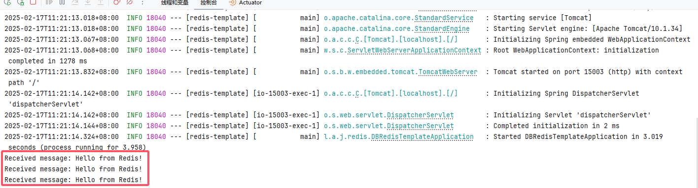

# Spring Data Redis

RedisTemplate 是 Spring Data Redis 提供的一个核心类，用于操作 Redis 数据库，支持对 Redis 各种数据结构的访问，例如字符串（String）、哈希（Hash）、列表（List）、集合（Set）、有序集合（Sorted Set）等。

**主要特点**
通用性强：支持 Redis 的所有数据结构和命令。
扩展性好：可以通过自定义序列化器来适配不同的数据格式。
线程安全：可以在多个线程中安全使用。


## 基础配置

### 添加依赖

添加Spring Boot Redis和Lettuce

```xml
<!-- Spring Boot Redis 数据库集成，支持多种 Redis 数据结构和操作 -->
<dependency>
    <groupId>org.springframework.boot</groupId>
    <artifactId>spring-boot-starter-data-redis</artifactId>
</dependency>

<!-- Lettuce 客户端连接池实现，基于 Apache Commons Pool2 -->
<dependency>
    <groupId>org.apache.commons</groupId>
    <artifactId>commons-pool2</artifactId>
</dependency>
```

### 编辑配置

编辑配置文件 `application.yml`

```yaml
---
# Redis的相关配置
spring:
  data:
    redis:
      host: 192.168.1.10 # Redis服务器地址
      database: 102 # Redis数据库索引（默认为0）
      port: 42784 # Redis服务器连接端口
      password: Admin@123 # Redis服务器连接密码（默认为空）
      client-type: lettuce  # 默认使用Lettuce作为Redis客户端
      lettuce:
        pool:
          max-active: 100 # 连接池最大连接数（使用负值表示没有限制）
          max-wait: -1s # 连接池最大阻塞等待时间（使用负值表示没有限制）
          max-idle: 100 # 连接池中的最大空闲连接
          min-idle: 0 # 连接池最小空闲连接数
          time-between-eviction-runs: 1s # 空闲对象逐出器线程的运行间隔时间.空闲连接线程释放周期时间
      timeout: 5000ms # 连接超时时间（毫秒）
```


## 序列化（可选）

如果不配置序列化在使用 `RedisTemplate` 时记得指定泛型，例如：RedisTemplate<String, MyUser>，不然使用的是Java序列化（二进制）。

如果需要配置序列化，以下方式任选一种，实现序列化后就可以直接使用RedisTemplate redisTemplate

### 使用 Jackson 序列化

Spring Boot 默认集成的 Jackson 序列化库也可以用来做 Redis 序列化。具体来说，就是可以通过 `Jackson2JsonRedisSerializer` 来进行对象的 JSON 序列化和反序列化。

#### 配置序列化和反序列化

```java
package local.ateng.java.redis.config;

import com.fasterxml.jackson.annotation.JsonInclude;
import com.fasterxml.jackson.annotation.JsonTypeInfo;
import com.fasterxml.jackson.core.JsonParser;
import com.fasterxml.jackson.databind.DeserializationFeature;
import com.fasterxml.jackson.databind.ObjectMapper;
import com.fasterxml.jackson.databind.SerializationFeature;
import com.fasterxml.jackson.databind.jsontype.impl.LaissezFaireSubTypeValidator;
import com.fasterxml.jackson.databind.module.SimpleModule;
import com.fasterxml.jackson.databind.ser.std.ToStringSerializer;
import com.fasterxml.jackson.datatype.jsr310.JavaTimeModule;
import com.fasterxml.jackson.datatype.jsr310.deser.LocalDateDeserializer;
import com.fasterxml.jackson.datatype.jsr310.deser.LocalDateTimeDeserializer;
import com.fasterxml.jackson.datatype.jsr310.ser.LocalDateSerializer;
import com.fasterxml.jackson.datatype.jsr310.ser.LocalDateTimeSerializer;
import org.springframework.context.annotation.Bean;
import org.springframework.context.annotation.Configuration;
import org.springframework.data.redis.connection.RedisConnectionFactory;
import org.springframework.data.redis.core.RedisTemplate;
import org.springframework.data.redis.serializer.Jackson2JsonRedisSerializer;
import org.springframework.data.redis.serializer.StringRedisSerializer;

import java.math.BigDecimal;
import java.math.BigInteger;
import java.text.SimpleDateFormat;
import java.time.LocalDate;
import java.time.LocalDateTime;
import java.time.format.DateTimeFormatter;
import java.util.TimeZone;

/**
 * RedisTemplate 配置类
 * <p>
 * 该类负责配置 RedisTemplate，允许对象进行序列化和反序列化。
 * 在这里，我们使用了 StringRedisSerializer 来序列化和反序列化 Redis 键，
 * 使用 Jackson2JsonRedisSerializer 来序列化和反序列化 Redis 值，确保 Redis 能够存储 Java 对象。
 * 另外，ObjectMapper 的配置确保 JSON 的格式和解析行为符合预期。
 * </p>
 *
 * @author 孔余
 * @email 2385569970@qq.com
 * @since 2025-03-06
 */
@Configuration
public class RedisTemplateConfig {
    
    // 日期与时间格式化
    public static String DEFAULT_TIME_ZONE = "Asia/Shanghai";
    public static String DEFAULT_DATE_FORMAT = "yyyy-MM-dd";
    public static String DEFAULT_DATE_TIME_FORMAT = "yyyy-MM-dd HH:mm:ss.SSSSSS";

    /**
     * 自定义 Jackson 时间日期的序列化和反序列化规则
     *
     * @param objectMapper Jackson 的 ObjectMapper 实例
     */
    public static void customizeJsonDateTime(ObjectMapper objectMapper, String timeZone, String dateFormat, String dateTimeFormat) {
        // 设置全局时区，确保 Date 类型数据使用此时区
        objectMapper.setTimeZone(TimeZone.getTimeZone(timeZone));

        // 关闭默认时间戳序列化，改为标准格式
        objectMapper.disable(SerializationFeature.WRITE_DATES_AS_TIMESTAMPS);

        // 避免与 JavaTimeModule 冲突
        objectMapper.setDateFormat(new SimpleDateFormat(dateTimeFormat));

        // Java 8 时间模块
        JavaTimeModule javaTimeModule = new JavaTimeModule();

        // LocalDateTime 序列化 & 反序列化
        javaTimeModule.addSerializer(LocalDateTime.class,
                new LocalDateTimeSerializer(DateTimeFormatter.ofPattern(dateTimeFormat)));
        javaTimeModule.addDeserializer(LocalDateTime.class,
                new LocalDateTimeDeserializer(DateTimeFormatter.ofPattern(dateTimeFormat)));

        // LocalDate 序列化 & 反序列化
        javaTimeModule.addSerializer(LocalDate.class,
                new LocalDateSerializer(DateTimeFormatter.ofPattern(dateFormat)));
        javaTimeModule.addDeserializer(LocalDate.class,
                new LocalDateDeserializer(DateTimeFormatter.ofPattern(dateFormat)));

        // 注册 JavaTimeModule
        objectMapper.registerModule(javaTimeModule);
    }

    /**
     * 自定义 Jackson 序列化规则
     *
     * @param objectMapper Jackson 的 ObjectMapper 实例
     */
    public static void customizeJsonSerialization(ObjectMapper objectMapper) {
        // 关闭 JSON 美化输出（生产环境建议关闭，提高性能）
        objectMapper.disable(SerializationFeature.INDENT_OUTPUT);

        // 避免 "No serializer found for class" 异常
        objectMapper.disable(SerializationFeature.FAIL_ON_EMPTY_BEANS);

        // 过滤 null 值，减少 JSON 体积
        //objectMapper.setSerializationInclusion(JsonInclude.Include.NON_NULL);

        // 过滤空集合、空字符串等无效数据，进一步精简 JSON
        //objectMapper.setSerializationInclusion(JsonInclude.Include.NON_EMPTY);

        // 不过滤 null、空集合、空字符串等无效数据值，保持数据的原始状态
        objectMapper.setSerializationInclusion(JsonInclude.Include.ALWAYS);

        // 枚举类型：使用 `toString()` 方式序列化，而不是默认的 `name()`
        objectMapper.enable(SerializationFeature.WRITE_ENUMS_USING_TO_STRING);

        // BigDecimal 序列化时不使用科学计数法，确保数据精确
        objectMapper.enable(SerializationFeature.WRITE_BIGDECIMAL_AS_PLAIN);

        // 排序字段名，保证 JSON 输出的键顺序固定（有助于缓存和数据比对）
        objectMapper.enable(SerializationFeature.ORDER_MAP_ENTRIES_BY_KEYS);

        // 将 Long 和 BigInteger 序列化为字符串，防止 JavaScript 丢失精度
        SimpleModule simpleModule = new SimpleModule();
        ToStringSerializer stringSerializer = ToStringSerializer.instance;
        simpleModule.addSerializer(BigDecimal.class, stringSerializer);
        simpleModule.addSerializer(BigInteger.class, stringSerializer);
        simpleModule.addSerializer(Long.class, stringSerializer);
        simpleModule.addSerializer(Long.TYPE, stringSerializer);
        objectMapper.registerModule(simpleModule);
    }

    /**
     * 自定义 Jackson 反序列化规则
     *
     * @param objectMapper Jackson 的 ObjectMapper 实例
     */
    public static void customizeJsonDeserialization(ObjectMapper objectMapper) {
        // 允许单个值转数组（例如 1 -> [1]）
        objectMapper.enable(DeserializationFeature.ACCEPT_SINGLE_VALUE_AS_ARRAY);

        // 忽略未知字段（避免因缺少字段报错，提升兼容性）
        objectMapper.disable(DeserializationFeature.FAIL_ON_UNKNOWN_PROPERTIES);

        // 处理 原始类型（如 int, long, boolean 等）在反序列化时如果遇到 null 值将其替换为默认值，而不是抛出异常
        objectMapper.configure(DeserializationFeature.FAIL_ON_NULL_FOR_PRIMITIVES, false);

        // 使用 BigDecimal 反序列化浮点数，避免精度丢失
        objectMapper.enable(DeserializationFeature.USE_BIG_DECIMAL_FOR_FLOATS);

        // 使用枚举的 `toString()` 方法进行反序列化，而不是默认的 `name()`
        objectMapper.enable(DeserializationFeature.READ_ENUMS_USING_TO_STRING);

        // 允许特殊字符转义
        objectMapper.enable(JsonParser.Feature.ALLOW_UNQUOTED_CONTROL_CHARS);
        objectMapper.enable(JsonParser.Feature.ALLOW_BACKSLASH_ESCAPING_ANY_CHARACTER);

        // 错误时提供类型检查，增强反序列化稳定性
        objectMapper.enable(DeserializationFeature.FAIL_ON_INVALID_SUBTYPE);
    }

    /**
     * 自定义 Jackson JSON 解析设置
     *
     * @param objectMapper Jackson 的 ObjectMapper 实例
     */
    public static void customizeJsonParsing(ObjectMapper objectMapper) {
        // 允许 JSON 中带注释，方便开发阶段使用
        objectMapper.configure(JsonParser.Feature.ALLOW_COMMENTS, true);

        // 允许字段名不带引号（可处理某些特殊格式的 JSON）
        objectMapper.configure(JsonParser.Feature.ALLOW_UNQUOTED_FIELD_NAMES, true);

        // 允许单引号作为 JSON 字符串的定界符（适用于某些特殊格式）
        objectMapper.configure(JsonParser.Feature.ALLOW_SINGLE_QUOTES, true);

        // 允许控制字符的转义（例如，`\n` 或 `\t`）
        objectMapper.configure(JsonParser.Feature.ALLOW_UNQUOTED_CONTROL_CHARS, true);

        // 允许反斜杠转义任何字符（如：`\\`）
        objectMapper.configure(JsonParser.Feature.ALLOW_BACKSLASH_ESCAPING_ANY_CHARACTER, true);

        // 允许无效的 UTF-8 字符（如果 JSON 编码不完全符合标准）
        objectMapper.configure(JsonParser.Feature.IGNORE_UNDEFINED, true);

        // 允许 JSON 中无序字段（通常是为了性能优化）
        objectMapper.configure(JsonParser.Feature.ALLOW_NON_NUMERIC_NUMBERS, true);
    }

    /**
     * 自定义 ObjectMapper 配置以启用默认类型标记。
     * 该方法的作用是在 JSON 序列化和反序列化时包含类类型信息，
     * 以便在反序列化时能够正确地识别对象的具体类型。
     *
     * @param objectMapper 要配置的 ObjectMapper 实例
     */
    public static void customizeJsonClassType(ObjectMapper objectMapper) {
        // 启用默认类型标记，使 JSON 中包含对象的类信息
        objectMapper.activateDefaultTyping(
                LaissezFaireSubTypeValidator.instance, // 允许所有子类型的验证器（最宽松）
                ObjectMapper.DefaultTyping.NON_FINAL,  // 仅对非 final 类启用类型信息
                JsonTypeInfo.As.PROPERTY                // 以 JSON 属性的形式存储类型信息
        );
    }

    @Bean
    public RedisTemplate<String, Object> redisTemplate(RedisConnectionFactory redisConnectionFactory) {
        RedisTemplate redisTemplate = new RedisTemplate();
        redisTemplate.setConnectionFactory(redisConnectionFactory);

        /**
         * 使用StringRedisSerializer来序列化和反序列化redis的key值
         */
        StringRedisSerializer stringRedisSerializer = new StringRedisSerializer();
        redisTemplate.setKeySerializer(stringRedisSerializer);
        redisTemplate.setHashKeySerializer(stringRedisSerializer);

        /**
         * 创建 ObjectMapper 实例，用于配置 Jackson 的序列化和反序列化行为
         */
        ObjectMapper objectMapper = new ObjectMapper();
        customizeJsonDateTime(objectMapper, DEFAULT_TIME_ZONE, DEFAULT_DATE_FORMAT, DEFAULT_DATE_TIME_FORMAT);
        customizeJsonSerialization(objectMapper);
        customizeJsonDeserialization(objectMapper);
        customizeJsonParsing(objectMapper);
        customizeJsonClassType(objectMapper);

        // 创建 Jackson2JsonRedisSerializer，用于序列化和反序列化值
        // 该序列化器使用配置好的 ObjectMapper
        Jackson2JsonRedisSerializer<Object> jackson2JsonRedisSerializer =
                new Jackson2JsonRedisSerializer<>(objectMapper, Object.class);

        // 设置 RedisTemplate 的值的序列化器
        redisTemplate.setValueSerializer(jackson2JsonRedisSerializer);
        redisTemplate.setHashValueSerializer(jackson2JsonRedisSerializer);  // 设置哈希值的序列化器

        // 返回redisTemplate
        redisTemplate.afterPropertiesSet();
        return redisTemplate;
    }

}
```


### 使用 Fastjson2 序列化

参考官方文档：[地址](https://github.com/alibaba/fastjson2/blob/main/docs/spring_support_cn.md#4-%E5%9C%A8-spring-data-redis-%E4%B8%AD%E9%9B%86%E6%88%90-fastjson2)

#### 添加依赖

```xml
<!-- 高性能的JSON库 -->
<!-- https://github.com/alibaba/fastjson2/wiki/fastjson2_intro_cn#0-fastjson-20%E4%BB%8B%E7%BB%8D -->
<dependency>
    <groupId>com.alibaba.fastjson2</groupId>
    <artifactId>fastjson2</artifactId>
    <version>${fastjson2.version}</version>
</dependency>
<!-- Spring 中集成 Fastjson2 -->
<dependency>
    <groupId>com.alibaba.fastjson2</groupId>
    <artifactId>fastjson2-extension-spring6</artifactId>
    <version>${fastjson2.version}</version>
</dependency>
```

#### 配置序列化器

注意修改为自己的包名：`config.setReaderFilters(JSONReader.autoTypeFilter("local.ateng.java."));`

```java
package local.ateng.java.redis.config;

import com.alibaba.fastjson2.JSON;
import com.alibaba.fastjson2.JSONB;
import com.alibaba.fastjson2.JSONReader;
import com.alibaba.fastjson2.JSONWriter;
import com.alibaba.fastjson2.support.config.FastJsonConfig;
import org.springframework.data.redis.serializer.RedisSerializer;
import org.springframework.data.redis.serializer.SerializationException;

import java.nio.charset.Charset;

public class FastJson2RedisSerializer<T> implements RedisSerializer<T> {
    private final Class<T> type;
    private FastJsonConfig config = new FastJsonConfig();

    public FastJson2RedisSerializer(Class<T> type) {
        config.setCharset(Charset.forName("UTF-8"));
        config.setDateFormat("yyyy-MM-dd HH:mm:ss.SSS");
        // 配置 JSONWriter 的特性
        config.setWriterFeatures(
                // 序列化时输出类型信息
                JSONWriter.Feature.WriteClassName,
                // 不输出数字类型的类名
                JSONWriter.Feature.NotWriteNumberClassName,
                // 不输出 Set 类型的类名
                JSONWriter.Feature.NotWriteSetClassName,
                // 序列化输出空值字段
                JSONWriter.Feature.WriteNulls,
                // 在大范围超过JavaScript支持的整数，输出为字符串格式
                JSONWriter.Feature.BrowserCompatible,
                // 序列化BigDecimal使用toPlainString，避免科学计数法
                JSONWriter.Feature.WriteBigDecimalAsPlain
        );

        // 配置 JSONReader 的特性
        config.setReaderFeatures(
                // 默认下是camel case精确匹配，打开这个后，能够智能识别camel/upper/pascal/snake/Kebab五中case
                JSONReader.Feature.SupportSmartMatch
        );

        // 支持自动类型，要读取带"@type"类型信息的JSON数据，需要显式打开SupportAutoType
        config.setReaderFilters(
                JSONReader.autoTypeFilter(
                        // 按需加上需要支持自动类型的类名前缀，范围越小越安全
                        "local.ateng.java."
                )
        );
        this.type = type;
    }

    public FastJsonConfig getFastJsonConfig() {
        return config;
    }

    public void setFastJsonConfig(FastJsonConfig fastJsonConfig) {
        this.config = fastJsonConfig;
    }

    @Override
    public byte[] serialize(T t) throws SerializationException {
        if (t == null) {
            return new byte[0];
        }
        try {
            if (config.isJSONB()) {
                return JSONB.toBytes(t, config.getSymbolTable(), config.getWriterFilters(), config.getWriterFeatures());
            } else {
                return JSON.toJSONBytes(t, config.getDateFormat(), config.getWriterFilters(), config.getWriterFeatures());
            }
        } catch (Exception ex) {
            throw new SerializationException("Could not serialize: " + ex.getMessage(), ex);
        }
    }

    @Override
    public T deserialize(byte[] bytes) throws SerializationException {
        if (bytes == null || bytes.length == 0) {
            return null;
        }
        try {
            if (config.isJSONB()) {
                return JSONB.parseObject(bytes, type, config.getSymbolTable(), config.getReaderFilters(), config.getReaderFeatures());
            } else {
                return JSON.parseObject(bytes, type, config.getDateFormat(), config.getReaderFilters(), config.getReaderFeatures());
            }
        } catch (Exception ex) {
            throw new SerializationException("Could not deserialize: " + ex.getMessage(), ex);
        }
    }
}
```

#### 配置序列化和反序列化

```java
package local.ateng.java.redis.config;

import org.springframework.context.annotation.Bean;
import org.springframework.context.annotation.Configuration;
import org.springframework.data.redis.connection.RedisConnectionFactory;
import org.springframework.data.redis.core.RedisTemplate;
import org.springframework.data.redis.serializer.StringRedisSerializer;

/**
 * RedisTemplate 配置类
 *
 * <p>
 * 该类负责配置 RedisTemplate，允许对象进行序列化和反序列化。
 * 在这里，我们使用了 StringRedisSerializer 来序列化和反序列化 Redis 键，
 * 使用 FastJsonRedisSerializer 来序列化和反序列化 Redis 值，确保 Redis 能够存储 Java 对象。
 * </p>
 *
 * @author 孔余
 * @email 2385569970@qq.com
 * @since 2025-03-06
 */
@Configuration
public class RedisTemplateConfig {

    @Bean
    public RedisTemplate<String, Object> redisTemplate(RedisConnectionFactory redisConnectionFactory) {
        RedisTemplate redisTemplate = new RedisTemplate();
        redisTemplate.setConnectionFactory(redisConnectionFactory);

        /**
         * 使用StringRedisSerializer来序列化和反序列化redis的key值
         */
        StringRedisSerializer stringRedisSerializer = new StringRedisSerializer();
        redisTemplate.setKeySerializer(stringRedisSerializer);
        redisTemplate.setHashKeySerializer(stringRedisSerializer);

        /**
         * 使用自定义的Fastjson2的Serializer来序列化和反序列化redis的value值
         */
        FastJson2RedisSerializer fastJson2RedisSerializer = new FastJson2RedisSerializer(Object.class);
        redisTemplate.setValueSerializer(fastJson2RedisSerializer);
        redisTemplate.setHashValueSerializer(fastJson2RedisSerializer);

        // 返回redisTemplate
        redisTemplate.afterPropertiesSet();
        return redisTemplate;
    }

}
```


## 添加多个Redis（可选）

### 添加配置文件

```yaml
---
# Redis的相关配置
spring:
  data:
    # ...
    redis-dev:
      host: 192.168.1.10 # Redis服务器地址
      database: 101 # Redis数据库索引（默认为0）
      port: 42784 # Redis服务器连接端口
      password: Admin@123 # Redis服务器连接密码（默认为空）
      client-type: lettuce  # 默认使用Lettuce作为Redis客户端
      lettuce:
        pool:
          max-active: 100 # 连接池最大连接数（使用负值表示没有限制）
          max-wait: -1s # 连接池最大阻塞等待时间（使用负值表示没有限制）
          max-idle: 100 # 连接池中的最大空闲连接
          min-idle: 0 # 连接池最小空闲连接数
          time-between-eviction-runs: 1s # 空闲对象逐出器线程的运行间隔时间.空闲连接线程释放周期时间
      timeout: 10000ms # 连接超时时间（毫秒）
```

### 添加配置属性

```java
/**
 * 自定义Redis配置文件
 *
 * @author 孔余
 * @since 2024-01-18 11:02
 */
@ConfigurationProperties(prefix = "spring.data")
@Configuration
@Data
public class MyRedisProperties {
    private RedisProperties redisDev;
    // private RedisProperties redisTest;
}
```

### 添加连接工厂

在 RedisTemplateConfig 文件中添加连接工厂信息

```java
    /**
     * Lettuce的Redis连接工厂
     *
     * @param redisProperties Redis服务的参数
     * @return Lettuce连接工厂
     */
    private LettuceConnectionFactory createLettuceConnectionFactory(RedisProperties redisProperties) {
        RedisProperties.Pool pool = redisProperties.getLettuce().getPool();
        // 设置Redis的服务参数
        RedisStandaloneConfiguration redisConfig = new RedisStandaloneConfiguration();
        redisConfig.setHostName(redisProperties.getHost());
        redisConfig.setDatabase(redisProperties.getDatabase());
        redisConfig.setPort(redisProperties.getPort());
        redisConfig.setPassword(redisProperties.getPassword());
        // 设置连接池属性
        GenericObjectPoolConfig<Object> poolConfig = new GenericObjectPoolConfig();
        poolConfig.setMaxTotal(pool.getMaxActive());
        poolConfig.setMaxIdle(pool.getMaxIdle());
        poolConfig.setMinIdle(pool.getMinIdle());
        poolConfig.setMaxWait(pool.getMaxWait());
        poolConfig.setTimeBetweenEvictionRuns(pool.getTimeBetweenEvictionRuns());
        LettucePoolingClientConfiguration clientConfig = LettucePoolingClientConfiguration
                .builder()
                .commandTimeout(redisProperties.getTimeout())
                .poolConfig(poolConfig)
                .build();
        // 返回Lettuce的Redis连接工厂
        LettuceConnectionFactory factory = new LettuceConnectionFactory(redisConfig, clientConfig);
        factory.afterPropertiesSet();
        return factory;
    }
```

### 创建Bean

在 RedisTemplateConfig 文件中添加连接工厂信息

#### 注入Properties

```java
private final MyRedisProperties myRedisProperties;

public RedisTemplateConfig(MyRedisProperties myRedisProperties) {
    this.myRedisProperties = myRedisProperties;
}
```

#### 创建Bean

```java
/**
 * 自定义Redis配置，从MyRedisProperties获取redis-dev的配置，redisTemplateDev
 * 使用：
 *
 * @return
 * @Qualifier("redisTemplateDev") private final RedisTemplate redisTemplateDev;
 */
@Bean
public RedisTemplate<String, Object> redisTemplateDev() {
    // 连接Redis
    LettuceConnectionFactory factory = this.createLettuceConnectionFactory(myRedisProperties.getRedisDev());
    RedisTemplate redisTemplate = new RedisTemplate();
    redisTemplate.setConnectionFactory(factory);

    /**
     * 使用StringRedisSerializer来序列化和反序列化redis的key值
     */
    StringRedisSerializer stringRedisSerializer = new StringRedisSerializer();
    redisTemplate.setKeySerializer(stringRedisSerializer);
    redisTemplate.setHashKeySerializer(stringRedisSerializer);
    
    // 值序列化，使用Jackson或者Fastjson2...

    // 返回redisTemplate
    redisTemplate.afterPropertiesSet();
    return redisTemplate;
}
```

### 使用新Redis

```java
    @Qualifier("redisTemplateDev") 
    private final RedisTemplate redisTemplateDev;

    @Test
    void test05() {
        UserInfoEntity user = UserInfoEntity.builder()
                .id(100L)
                .name("John Doe")
                .age(25)
                .score(85.5)
                .birthday(new Date())
                .province("")
                .city("Example City")
                .build();
        redisTemplateDev.opsForValue().set("test:user", user);
    }

    @Test
    void test05_1() {
        UserInfoEntity user = (UserInfoEntity) redisTemplateDev.opsForValue().get("test:user");
        System.out.println(user);
        System.out.println(user.getName());
    }
```


## 注入使用

### 不写泛型

注入RedisTemplate

```
private final RedisTemplate redisTemplate;
```

写入数据

```
redisTemplate.opsForValue().set("myUser", myUser);
```

读取数据

```
MyUser myUser = (MyUser) redisTemplate.opsForValue().get("myUser");
```


### 写入泛型

注入RedisTemplate

```
private final RedisTemplate<String, Object> redisTemplate;
```

写入数据

```
redisTemplate.opsForValue().set("myUser", myUser);
```

读取数据

```
MyUser myUser = (MyUser) redisTemplate.opsForValue().get("myUser");
```


## 数据准备

### 添加依赖

```xml
        <!-- Hutool: Java工具库，提供了许多实用的工具方法 -->
        <dependency>
            <groupId>cn.hutool</groupId>
            <artifactId>hutool-all</artifactId>
            <version>${hutool.version}</version>
        </dependency>

        <!-- JavaFaker: 用于生成虚假数据的Java库 -->
        <dependency>
            <groupId>com.github.javafaker</groupId>
            <artifactId>javafaker</artifactId>
            <version>1.0.2</version>
        </dependency>
```

### 创建实体类

```java
package local.kongyu.redisTemplate.entity;

import lombok.AllArgsConstructor;
import lombok.Builder;
import lombok.Data;
import lombok.NoArgsConstructor;

import java.io.Serializable;
import java.time.LocalDateTime;
import java.util.Date;

/**
 * 用户信息实体类
 * 用于表示系统中的用户信息。
 *
 * @author 孔余
 * @since 2024-01-10 15:51
 */
@Data
@Builder
@AllArgsConstructor
@NoArgsConstructor
public class UserInfoEntity implements Serializable {
    private static final long serialVersionUID = 1L;

    /**
     * 用户ID
     */
    private Long id;

    /**
     * 用户姓名
     */
    private String name;

    /**
     * 用户年龄
     * 注意：这里使用Integer类型，表示年龄是一个整数值。
     */
    private Integer age;

    /**
     * 分数
     */
    private Double score;

    /**
     * 用户生日
     * 注意：这里使用Date类型，表示用户的生日。
     */
    private Date birthday;

    /**
     * 用户所在省份
     */
    private String province;

    /**
     * 用户所在城市
     */
    private String city;

    /**
     * 创建时间
     */
    private LocalDateTime createTime;
}
```

### 创建初始数据

```java
package local.kongyu.redisTemplate.init;

import com.github.javafaker.Faker;
import local.kongyu.redisTemplate.entity.UserInfoEntity;
import lombok.Getter;

import java.time.LocalDateTime;
import java.util.ArrayList;
import java.util.List;
import java.util.Locale;

/**
 * 初始化数据
 *
 * @author 孔余
 * @since 2024-01-18 14:17
 */
@Getter
public class InitData {
    List<UserInfoEntity> list;
    List<UserInfoEntity> list2;

    public InitData() {
        //生成测试数据
        // 创建一个Java Faker实例，指定Locale为中文
        Faker faker = new Faker(new Locale("zh-CN"));
        // 创建一个包含不少于100条JSON数据的列表
        List<UserInfoEntity> userList = new ArrayList();
        for (int i = 1; i <= 10; i++) {
            UserInfoEntity user = new UserInfoEntity();
            user.setId((long) i);
            user.setName(faker.name().fullName());
            user.setBirthday(faker.date().birthday());
            user.setAge(faker.number().numberBetween(0, 100));
            user.setProvince(faker.address().state());
            user.setCity(faker.address().cityName());
            user.setScore(faker.number().randomDouble(3, 1, 100));
            user.setCreateTime(LocalDateTime.now());
            userList.add(user);
        }
        list = userList;
        for (int i = 1; i <= 20; i++) {
            UserInfoEntity user = new UserInfoEntity();
            user.setId((long) i);
            user.setName(faker.name().fullName());
            user.setBirthday(faker.date().birthday());
            user.setAge(faker.number().numberBetween(0, 100));
            user.setProvince(faker.address().state());
            user.setCity(faker.address().cityName());
            user.setScore(faker.number().randomDouble(3, 1, 100));
            user.setCreateTime(LocalDateTime.now());
            userList.add(user);
        }
        list2 = userList;
    }

}
```


## 使用String

### 创建测试类

```java
/**
 * Redis String相关的操作
 *
 * @author 孔余
 * @since 2024-02-22 14:40
 */
@SpringBootTest
@RequiredArgsConstructor(onConstructor = @__(@Autowired))
public class RedisStringTests {
    private final RedisTemplate redisTemplate;
    
}
```

### 写入对象

```java
    //设置key对应的值
    @Test
    void set() {
        String key = "my:user";
        UserInfoEntity user = new InitData().getList().get(0);
        redisTemplate.opsForValue().set(key, user);
        // 并设置过期时间
        redisTemplate.opsForValue().set(key + ":expire", user, Duration.ofHours(1));
    }

    @Test
    void setMany() {
        String key = "my:user:data";
        List<UserInfoEntity> list = new InitData().getList();
        list.forEach(user -> redisTemplate.opsForValue().set(key + ":" + user.getId(), user));
    }

    @Test
    void setList() {
        String key = "my:userList";
        List<UserInfoEntity> list = new InitData().getList();
        redisTemplate.opsForValue().set(key, list);
    }
```

### 读取对象

```java
    //取出key值所对应的值
    @Test
    void get() {
        UserInfoEntity user = (UserInfoEntity) redisTemplate.opsForValue().get("my:user");
        System.out.println(user);
        System.out.println(user.getName());
    }

    @Test
    void getList() {
        List<UserInfoEntity> userList = (List<UserInfoEntity>) redisTemplate.opsForValue().get("my:userList");
        System.out.println(userList);
        System.out.println(userList.get(0).getName());
    }
```

### 判断key是否存在

```java
    //判断是否有key所对应的值，有则返回true，没有则返回false
    @Test
    void hashKey() {
        String key = "my:user";
        Boolean result = redisTemplate.hasKey(key);
        System.out.println(result);
    }
```

### 删除key

```java
    //删除单个key值
    @Test
    void delete() {
        String key = "my:user";
        Boolean result = redisTemplate.delete(key);
        System.out.println(result);
    }

    //删除多个key值
    @Test
    void deletes() {
        List<String> keys = new ArrayList<>();
        keys.add("my:user");
        keys.add("my:userList");
        Long result = redisTemplate.delete(keys);
        System.out.println(result);
    }
```

### 设置过期时间

```java
    //设置过期时间
    @Test
    void expire() {
        String key = "my:user";
        long timeout = 1;
        Boolean result = redisTemplate.expire(key, timeout, TimeUnit.HOURS);
        System.out.println(result);
    }

    // 设置指定时间过期
    // 如果超过当前时间则key会被清除
    @Test
    void expireAt() {
        String key = "my:user";
        String dateTime = "2025-12-12 22:22:22";
        Boolean result = redisTemplate.expireAt(key, DateUtil.parse(dateTime));
        System.out.println(result);
    }

    //返回剩余过期时间并且指定时间单位
    @Test
    void getExpire() {
        String key = "my:user";
        Long expire = redisTemplate.getExpire(key, TimeUnit.SECONDS);
        System.out.println(expire);
    }
```

### 查找匹配的key值

```java
    // 查找匹配的key值，返回一个Set集合类型
    @Test
    void keysAndValues() {
        // 返回所有key，保证这些key的值的数据类型一致
        String pattern = "my:user:data:*";
        Set<String> keys = redisTemplate.keys(pattern);
        keys.forEach(System.out::println);
        System.out.println(keys.size());
        // 返回所有value
        List<UserInfoEntity> values = (List<UserInfoEntity>) redisTemplate.opsForValue().multiGet(keys);
        values.forEach(value-> System.out.println(value.getName()));
    }
```

### 自增值increment

```java
    //以增量的方式将double值存储在变量中
    @Test
    void incrementDouble() {
        String key = "my:double";
        double delta = 0.1;
        Double result = redisTemplate.opsForValue().increment(key, delta);
        System.out.println(result);
    }
    //通过increment(K key, long delta)方法以增量方式存储long值（正值则自增，负值则自减）
    @Test
    void incrementLong() {
        String key = "my:long";
        long delta = 1;
        Long result = redisTemplate.opsForValue().increment(key, delta);
        System.out.println(result);
    }
```


## 使用List

### 创建测试类

```java
/**
 * Redis List相关的操作
 *
 * @author 孔余
 * @since 2024-02-22 14:40
 */
@SpringBootTest
@RequiredArgsConstructor(onConstructor = @__(@Autowired))
public class RedisListTests {
    private final RedisTemplate redisTemplate;
    
}
```

### rightPush 队列 先进先出

```java
    /**
     * 功能: 将指定的值 value 添加到列表 key 的 右端（尾部）。
     * 使用场景: 通常用于像队列一样的操作，先进先出（FIFO）。例如，添加数据到消息队列的末尾，等待后续的消费
     */
    @Test
    void rightPush() {
        String key = "my:list:user";
        UserInfoEntity user = new InitData().getList().get(0);
        redisTemplate.opsForList().rightPush(key, user);
    }

    @Test
    void rightPushAll() {
        String key = "my:list:userList";
        List<UserInfoEntity> list = new InitData().getList();
        redisTemplate.opsForList().rightPushAll(key, list);
    }

    /**
     * 用于从Redis的列表中 弹出并移除 右端（尾部）的元素。这个操作类似于从队列的尾部取出元素。
     */
    @Test
    void rightPop() {
        String key = "my:list:userList";
        UserInfoEntity userInfoEntity = (UserInfoEntity) redisTemplate.opsForList().rightPop(key);
        System.out.println(userInfoEntity.getId());
    }
```

### leftPush 栈 先进后出

```java
    /**
     * 功能: 将指定的值 value 添加到列表 key 的 左端（头部）。
     * 使用场景: 通常用于像栈一样的操作，后进先出（LIFO）。例如，添加数据到列表的开头。
     */
    @Test
    void leftPush() {
        String key = "my:list:user";
        UserInfoEntity user = new InitData().getList().get(0);
        redisTemplate.opsForList().leftPush(key, user);
    }

    @Test
    void leftPushAll() {
        String key = "my:list:userList";
        List<UserInfoEntity> list = new InitData().getList();
        redisTemplate.opsForList().leftPushAll(key, list);
    }

    /**
     * 用于从 Redis 列表中 弹出并移除 左端（头部）元素的方法。这个操作类似于从队列的头部取出元素。
     */
    @Test
    void leftPop() {
        String key = "my:list:userList";
        UserInfoEntity userInfoEntity = (UserInfoEntity) redisTemplate.opsForList().leftPop(key);
        System.out.println(userInfoEntity.getId());
    }
```

### 获取列表元素

```java
    // 获取列表指定范围内的元素(start开始位置, 0是开始位置，end 结束位置, -1返回所有)
    @Test
    void range() {
        String key = "my:list:userList";
        long start = 0;
        long end = -1;
        List<UserInfoEntity> result = redisTemplate.opsForList().range(key, start, end);
        System.out.println(result);
    }
```


## 使用Hash

### 创建测试类

```java
/**
 * Redis HashMap相关的操作
 *
 * @author 孔余
 * @since 2024-02-22 14:40
 */
@SpringBootTest
@RequiredArgsConstructor(onConstructor = @__(@Autowired))
public class RedisHashMapTests {
    private final RedisTemplate redisTemplate;
    
}
```

### 新增数据

```java
    // 新增hashMap值
    @Test
    void put() {
        String key = "my:hashmap:user";
        String hashKey = "user1";
        UserInfoEntity user = new InitData().getList().get(0);
        redisTemplate.opsForHash().put(key, hashKey, user);
    }

    @Test
    void putAll() {
        Map<String, Object> map = new HashMap<>();
        List<UserInfoEntity> list = new InitData().getList();
        list.forEach(user -> map.put("user" + user.getId(), user));
        redisTemplate.opsForHash().putAll("my:hashmap:userList", map);
    }
```

### 获取数据

```java
    // 获取hashMap值，不存在为null
    @Test
    void get() {
        String key = "my:hashmap:user";
        String hashKey = "user1";
        UserInfoEntity result = (UserInfoEntity) redisTemplate.opsForHash().get(key, hashKey);
        System.out.println(result);
        System.out.println(result.getName());
    }

    // 获取Key
    @Test
    void getKey() {
        String key = "my:hashmap:user";
        Set keys = redisTemplate.opsForHash().keys(key);
        String next = (String) keys.iterator().next();
        System.out.println(next);
    }

    // 获取多个hashMap的值
    @Test
    void multiGet() {
        String key = "my:hashmap:userList";
        List<UserInfoEntity> list = (List<UserInfoEntity>) redisTemplate.opsForHash().multiGet(key, Arrays.asList("user1", "user2"));
        System.out.println(list);
        list.forEach(user -> System.out.println(user.getName()));
    }

    // 获取所有hashMap的值
    @Test
    void getAll() {
        String key = "my:hashmap:userList";
        Map<String, UserInfoEntity> entries = (Map<String, UserInfoEntity>) redisTemplate.opsForHash().entries(key);
        System.out.println(entries);
        entries.values().forEach(value-> System.out.println(value.getName()));
    }

    // 获取所有hashMap的key值
    @Test
    void keys() {
        String key = "my:hashmap:userList";
        Set<String> keys = (Set<String>) redisTemplate.opsForHash().keys(key);
        System.out.println(keys);
    }

    // 获取所有hashMap的key值
    @Test
    void values() {
        String key = "my:hashmap:userList";
        List<UserInfoEntity> values = (List<UserInfoEntity>) redisTemplate.opsForHash().values(key);
        System.out.println(values);
        values.forEach(user -> System.out.println(user.getName()));
    }
```

### 删除数据

```java
    // 删除一个或者多个hash表字段
    @Test
    void delete() {
        String key = "my:hashmap:userList";
        String hashKey1 = "user1";
        String hashKey2 = "user2";
        Long result = redisTemplate.opsForHash().delete(key, hashKey1, hashKey2);
        System.out.println(result);
    }
```

### 匹配获取键值对

```java
    // 匹配获取键值对
    @Test
    void scan() {
        String key = "my:hashmap:userList";
        // 模糊匹配
        ScanOptions scanOptions = ScanOptions.scanOptions()
                .match("user1*")
                .build();
        Cursor<Map.Entry<Object, Object>> result = redisTemplate.opsForHash().scan(key, scanOptions);
        while (result.hasNext()) {
            Map.Entry<Object, Object> entry = result.next();
            System.out.println(entry.getKey() + "：" + entry.getValue());
        }
    }
```

## 使用Set

### 创建测试类

```java
/**
 * Redis Set集合相关的操作
 *
 * @author 孔余
 * @since 2024-02-22 14:40
 */
@SpringBootTest
@RequiredArgsConstructor(onConstructor = @__(@Autowired))
public class RedisSetTests {
    private final RedisTemplate redisTemplate;
    
}
```

### 新增数据

```java
    // 添加数据
    @Test
    void add() {
        String key = "my:set:number";
        List<Integer> list = new ArrayList<>();
        for (int i = 0; i < 100; i++) {
            list.add(RandomUtil.randomInt(1, 100));
        }
        redisTemplate.opsForSet().add(key, list.toArray(new Integer[0]));
    }
```

### 获取数据

```java
    // 获取集合中的所有数据
    @Test
    void members() {
        String key = "my:set:number";
        Set<Integer> members = (LinkedHashSet<Integer>) redisTemplate.opsForSet().members(key);
        System.out.println(members);
    }
```

### 删除数据

```java
    // 删除数据
    @Test
    void remove() {
        String key = "my:set:number";
        List<Integer> list = new ArrayList<>();
        for (int i = 0; i < 100; i++) {
            list.add(RandomUtil.randomInt(1, 1000));
        }
        redisTemplate.opsForSet().remove(key, list.toArray(new Integer[0]));
    }

    // 删除并且返回一个随机的元素
    @Test
    void pop() {
        String key = "my:set:number";
        Integer result1 = (Integer) redisTemplate.opsForSet().pop(key);
        List<Integer> result2 = (ArrayList<Integer>) redisTemplate.opsForSet().pop(key, 2); // pop多个
        System.out.println(result1);
        System.out.println(result2);
    }
```

### 查询数据

```java
    // 判断集合是否包含value
    @Test
    void isMember() {
        String key = "my:set:number";
        String value = "60";
        Boolean result = redisTemplate.opsForSet().isMember(key, value);
        System.out.println(result);
    }

    // 获取两个集合的交集
    @Test
    void intersect() {
        String key1 = "my:set:number1";
        String key2 = "my:set:number2";
        Set<Integer> result = (LinkedHashSet<Integer>) redisTemplate.opsForSet().intersect(key1, key2);
        System.out.println(result);
    }

    // 获取两个集合的交集，并将结果存储到新的key
    @Test
    void intersectAndStore() {
        String key1 = "my:set:number1";
        String key2 = "my:set:number2";
        String destKey = "my:set:intersect";
        redisTemplate.opsForSet().intersectAndStore(key1, key2, destKey);
    }

    // 获取两个集合的并集
    @Test
    void union() {
        String key1 = "my:set:number1";
        String key2 = "my:set:number2";
        Set<Integer> result = (LinkedHashSet<Integer>) redisTemplate.opsForSet().union(key1, key2);
        System.out.println(result);
    }

    // 获取两个集合的并集，并将结果存储到新的key
    @Test
    void unionAndStore() {
        String key1 = "my:set:number1";
        String key2 = "my:set:number2";
        String destKey = "my:set:union";
        redisTemplate.opsForSet().unionAndStore(key1, key2, destKey);
    }

    // 获取两个集合的差集
    @Test
    void difference() {
        String key1 = "my:set:number1";
        String key2 = "my:set:number2";
        Set<Integer> result = (LinkedHashSet<Integer>) redisTemplate.opsForSet().difference(key1, key2);
        System.out.println(result);
    }

    // 获取两个集合的并集，并将结果存储到新的key
    @Test
    void differenceAndStore() {
        String key1 = "my:set:number1";
        String key2 = "my:set:number2";
        String destKey = "my:set:difference";
        redisTemplate.opsForSet().differenceAndStore(key1, key2, destKey);
    }

    // 随机获取集合中的一个元素
    @Test
    void randomMember() {
        String key = "my:set:number";
        Integer result = (Integer) redisTemplate.opsForSet().randomMember(key);
        System.out.println(result);
    }

    // 随机获取集合中count个元素
    @Test
    void randomMembers() {
        String key = "my:set:number";
        List<Integer> strings = (ArrayList<Integer>) redisTemplate.opsForSet().randomMembers(key, 2);
        System.out.println(strings);
    }

    // 模糊匹配数据
    @Test
    void scan() {
        String key = "my:set:number";
        // 模糊匹配
        ScanOptions scanOptions = ScanOptions.scanOptions()
                .match("2*")
                .build();
        Cursor result1 = redisTemplate.opsForSet().scan(key, scanOptions);
        while (result1.hasNext()) {
            Object next = result1.next();
            System.out.println(next);
        }
    }
```

## 使用ZSet

### 创建测试类

```java
/**
 * Redis ZSet集合相关的操作
 *
 * @author 孔余
 * @since 2024-02-22 14:40
 */
@SpringBootTest
@RequiredArgsConstructor(onConstructor = @__(@Autowired))
public class RedisZSetTests {
    private final RedisTemplate redisTemplate;
    
}
```

### 新增数据

```java
    // 添加元素(有序集合是按照元素的score值由小到大进行排列)
    @Test
    void add() {
        String key = "my:zset:number";
        String value = "value";
        double score = 1.1;
        Boolean result = redisTemplate.opsForZSet().add(key, value, score);
        System.out.println(result);
    }
    @Test
    void addMany() {
        String key = "my:zset:number";
        for (int i = 0; i < 30; i++) {
            String value = "value" + i;
            double score = RandomUtil.randomDouble(0,1,2, RoundingMode.UP);
            Boolean result = redisTemplate.opsForZSet().add(key, value, score);
            System.out.println(result);
        }
    }
```

### 删除数据

```java
    // 删除元素
    @Test
    void remove() {
        String key = "my:zset:number";
        String value1 = "value1";
        String value2 = "value2";
        Long result = redisTemplate.opsForZSet().remove(key, value1, value2);
        System.out.println(result);
    }

    // 移除指定索引位置处的成员
    @Test
    void removeRange() {
        String key = "my:zset:number";
        long start = 1;
        long end = 3;
        Long result = redisTemplate.opsForZSet().removeRange(key, start, end);
        System.out.println(result);
    }

    // 移除指定score范围的集合成员
    @Test
    void removeRangeByScore() {
        String key = "my:zset:number";
        double min = 0.8;
        double max = 3.0;
        Long result = redisTemplate.opsForZSet().removeRangeByScore(key, min, max);
        System.out.println(result);
    }
```

### 查询数据

```java
    // 返回元素在集合的排名,有序集合是按照元素的score值由小到大排列
    @Test
    void rank() {
        String key = "my:zset:number";
        String value = "value10";
        Long result = redisTemplate.opsForZSet().rank(key, value);
        System.out.println(result);
    }

    // 返回元素在集合的排名,按元素的score值由大到小排列
    @Test
    void reverseRank() {
        String key = "my:zset:number";
        String value = "value10";
        Long result = redisTemplate.opsForZSet().reverseRank(key, value);
        System.out.println(result);
    }

    // 获取集合中给定区间的元素(start 开始位置，end 结束位置, -1查询所有)
    @Test
    void reverseRangeWithScores() {
        String key = "my:zset:number";
        long start = 1;
        long end = 4;
        Set<ZSetOperations.TypedTuple<String>> typedTuples = redisTemplate.opsForZSet().reverseRangeWithScores(key, start, end);
        List<ZSetOperations.TypedTuple<String>> list = new ArrayList<>(typedTuples);
        list.forEach(data -> System.out.println("value=" + data.getValue() + ", score=" + data.getScore()));
    }

    // 按照Score值查询集合中的元素，结果从小到大排序
    @Test
    void reverseRangeByScore() {
        String key = "my:zset:number";
        double min = 0.8;
        double max = 3.0;
        Set<String> result = redisTemplate.opsForZSet().reverseRangeByScore(key, min, max);
        System.out.println(result);
    }

    // 按照Score值查询集合中的元素，结果从小到大排序
    @Test
    void reverseRangeByScoreWithScores() {
        String key = "my:zset:number";
        double min = 0.8;
        double max = 3.0;
        Set<ZSetOperations.TypedTuple<String>> typedTuples = redisTemplate.opsForZSet().reverseRangeByScoreWithScores(key, min, max);
        List<ZSetOperations.TypedTuple<String>> list = new ArrayList<>(typedTuples);
        list.forEach(data -> System.out.println("value=" + data.getValue() + ", score=" + data.getScore()));
    }

    // 从高到低的排序集中获取分数在最小和最大值之间的元素
    @Test
    void reverseRangeByScoreOffset() {
        String key = "my:zset:number";
        double min = 0.8;
        double max = 3.0;
        long offset = 1;
        long count = 3;
        Set<String> result = redisTemplate.opsForZSet().reverseRangeByScore(key, min, max, offset, count);
        System.out.println(result);
    }

    // 根据score值获取集合元素数量
    @Test
    void count() {
        String key = "my:zset:number";
        double min = 0.8;
        double max = 3.0;
        Long count = redisTemplate.opsForZSet().count(key, min, max);
        System.out.println(count);
    }

    // 获取集合的大小
    @Test
    void size() {
        String key = "my:zset:number";
        Long size = redisTemplate.opsForZSet().size(key);
        Long zCard = redisTemplate.opsForZSet().zCard(key);
        System.out.println(size);
        System.out.println(zCard);
    }

    // 获取集合中key、value元素对应的score值
    @Test
    void score() {
        String key = "my:zset:number";
        String value = "value";
        Double score = redisTemplate.opsForZSet().score(key, value);
        System.out.println(score);
    }

    // 获取所有元素
    @Test
    void scan() {
        String key = "my:zset:number";
        Cursor<ZSetOperations.TypedTuple<String>> scan = redisTemplate.opsForZSet().scan(key, ScanOptions.NONE);
        while (scan.hasNext()) {
            ZSetOperations.TypedTuple<String> item = scan.next();
            System.out.println(item.getValue() + ":" + item.getScore());
        }
    }
```

### 查询并存储数据

```java
    // 获取key和otherKey的并集并存储在destKey中（其中otherKeys可以为单个字符串或者字符串集合）
    @Test
    void unionAndStore() {
        String key = "my:zset:number";
        String otherKey = "my:zset:number2";
        String destKey = "my:zset:number3";
        Long result = redisTemplate.opsForZSet().unionAndStore(key, otherKey, destKey);
        System.out.println(result);
    }

    // 获取key和otherKey的交集并存储在destKey中（其中otherKeys可以为单个字符串或者字符串集合）
    @Test
    void intersectAndStore() {
        String key = "my:zset:number";
        String otherKey = "my:zset:number2";
        String destKey = "my:zset:number4";
        Long result = redisTemplate.opsForZSet().intersectAndStore(key, otherKey, destKey);
        System.out.println(result);
    }
```

## 发布与订阅

### 创建Listener

```java
package local.ateng.java.redis.listener;

import org.springframework.data.redis.connection.Message;
import org.springframework.data.redis.connection.MessageListener;
import org.springframework.stereotype.Component;

/**
 * RedisMessageListener 类用于监听来自 Redis 频道的消息。
 * 它实现了 Spring Data Redis 提供的 MessageListener 接口，
 * 并且作为一个 Spring Bean 被自动注册，可以用于接收发布/订阅（Pub/Sub）模式下的消息。
 * <p>
 * 该类将会监听一个指定的 Redis 频道，并处理接收到的消息。
 */
@Component  // 注解表明这是一个 Spring 管理的组件，将自动被注册为 Bean
public class RedisMessageListener implements MessageListener {

    /**
     * 当 Redis 频道接收到消息时，调用此方法。
     * 该方法由 Spring Data Redis 自动触发，当 Redis 发布消息到指定频道时会被调用。
     *
     * @param message Redis 消息对象，包含了消息的具体内容
     * @param pattern 可选的消息模式，通常为空，但如果使用了模式匹配订阅（如 PSUBSCRIBE），此参数表示匹配的模式
     */
    @Override
    public void onMessage(Message message, byte[] pattern) {
        // 获取消息的内容，将其从字节数组转换为字符串
        String msg = new String(message.getBody());

        // 打印接收到的消息内容
        // 这里可以根据需求做进一步的消息处理，如日志记录、存储等
        System.out.println("Received message: " + msg);
    }
}
```

### 创建Config

```java
package local.ateng.java.redis.config;

import local.ateng.java.redis.listener.RedisMessageListener;
import org.springframework.context.annotation.Bean;
import org.springframework.context.annotation.Configuration;
import org.springframework.data.redis.connection.MessageListener;
import org.springframework.data.redis.connection.RedisConnectionFactory;
import org.springframework.data.redis.listener.RedisMessageListenerContainer;
import org.springframework.data.redis.listener.Topic;
import org.springframework.data.redis.listener.adapter.MessageListenerAdapter;

/**
 * RedisConfig 类是一个 Spring 配置类，用于配置 Redis 的消息监听器容器。
 * 该配置类定义了 Redis 消息的订阅和处理机制，允许应用监听指定的 Redis 频道，接收并处理消息。
 */
@Configuration  // 注解标识此类是一个配置类，Spring 将在启动时加载该配置
public class RedisConfig {

    /**
     * 创建一个 RedisMessageListenerContainer，用于监听 Redis 频道中的消息。
     * 它会管理消息监听器的生命周期，确保可以接收来自 Redis 发布/订阅模式的消息。
     *
     * @param factory         Redis 连接工厂，用于创建 Redis 连接
     * @param messageListener 消息监听器，接收到消息时会执行处理逻辑
     * @param topic           订阅的 Redis 频道
     * @return RedisMessageListenerContainer 实例
     */
    @Bean
    public RedisMessageListenerContainer redisMessageListenerContainer(RedisConnectionFactory factory,
                                                                       MessageListener messageListener,
                                                                       Topic topic) {
        // 创建一个 Redis 消息监听容器
        RedisMessageListenerContainer container = new RedisMessageListenerContainer();

        // 设置 Redis 连接工厂，确保 Redis 连接的正确配置
        container.setConnectionFactory(factory);

        // 添加消息监听器和订阅的 Redis 频道
        container.addMessageListener(messageListener, topic);

        // 返回 Redis 消息监听容器
        return container;
    }

    /**
     * 创建一个 Topic 对象，用于指定订阅的 Redis 频道。
     * 此处使用的是 PatternTopic，表示订阅一个具体的频道名称。
     *
     * @return Topic 对象，表示一个 Redis 频道
     */
    @Bean
    public Topic topic() {
        // 返回一个新的 PatternTopic，表示订阅名为 "myChannel" 的 Redis 频道
        return new org.springframework.data.redis.listener.PatternTopic("myChannel");
    }

    /**
     * 创建一个消息监听器，用于接收来自 Redis 频道的消息。
     * 该监听器将处理接收到的消息，并触发相应的回调方法。
     *
     * @return MessageListener 实例，处理来自 Redis 的消息
     */
    @Bean
    public MessageListener messageListener() {
        // 使用 MessageListenerAdapter 封装 RedisMessageListener，确保消息传递和处理逻辑的适配
        return new MessageListenerAdapter(new RedisMessageListener());
    }

}
```

### 发送消息

创建接口发送消息测试。

这里使用了StringRedisTemplate而不是RedisTemplate，是因为做了Fastjson2序列化会导致序列化机制不一致，消息会变得不可读。

```java
package local.ateng.java.redis.controller;

import lombok.RequiredArgsConstructor;
import org.springframework.beans.factory.annotation.Autowired;
import org.springframework.data.redis.core.StringRedisTemplate;
import org.springframework.web.bind.annotation.GetMapping;
import org.springframework.web.bind.annotation.RequestMapping;
import org.springframework.web.bind.annotation.RestController;

@RestController
@RequestMapping("/redis")
@RequiredArgsConstructor(onConstructor = @__(@Autowired))
public class RedisController {
    private final StringRedisTemplate stringRedisTemplate;

    @GetMapping("/send")
    public String sendMessage() {
        stringRedisTemplate.convertAndSend("myChannel", "Hello from Redis!");
        return "Message Sent!";
    }
}
```


