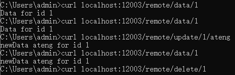

# Spring Cache

`Spring Cache` 是 Spring 提供的一个抽象缓存框架，旨在简化缓存管理，支持多种缓存存储（如 Redis、Ehcache、Caffeine 等）。它通过注解（如 `@Cacheable`）和配置管理缓存操作，帮助开发者方便地实现缓存机制，提高应用性能。

- [官网地址](https://spring.io/projects/spring-cache)


## 基础配置

### 添加依赖

使用Redis作为缓存提供者，若要使用本地缓存参考[文档](/work/Ateng-Java/cache/caffeine/)

```xml
<!-- Spring Boot Redis 数据库集成，支持多种 Redis 数据结构和操作 -->
<dependency>
    <groupId>org.springframework.boot</groupId>
    <artifactId>spring-boot-starter-data-redis</artifactId>
</dependency>

<!-- Lettuce 客户端连接池实现，基于 Apache Commons Pool2 -->
<dependency>
    <groupId>org.apache.commons</groupId>
    <artifactId>commons-pool2</artifactId>
</dependency>
```

### 编辑配置文件

```yaml
---
# 缓存配置
spring:
  cache:
    type: redis  # 使用Redis作为缓存存储
---
# Redis的相关配置
spring:
  data:
    redis:
      host: 192.168.1.10 # Redis服务器地址
      database: 102 # Redis数据库索引（默认为0）
      port: 42784 # Redis服务器连接端口
      password: Admin@123 # Redis服务器连接密码（默认为空）
      client-type: lettuce  # 默认使用Lettuce作为Redis客户端
      lettuce:
        pool:
          max-active: 100 # 连接池最大连接数（使用负值表示没有限制）
          max-wait: -1s # 连接池最大阻塞等待时间（使用负值表示没有限制）
          max-idle: 100 # 连接池中的最大空闲连接
          min-idle: 0 # 连接池最小空闲连接数
          time-between-eviction-runs: 1s # 空闲对象逐出器线程的运行间隔时间.空闲连接线程释放周期时间
      timeout: 5000ms # 连接超时时间（毫秒）
```

### 配置缓存管理器

添加以下代码，配置 Redis 缓存管理器

```
package local.ateng.java.cache.config;

import org.springframework.cache.CacheManager;
import org.springframework.cache.annotation.EnableCaching;
import org.springframework.context.annotation.Bean;
import org.springframework.context.annotation.Configuration;
import org.springframework.data.redis.cache.RedisCacheConfiguration;
import org.springframework.data.redis.cache.RedisCacheManager;
import org.springframework.data.redis.cache.RedisCacheWriter;
import org.springframework.data.redis.connection.RedisConnectionFactory;

import java.time.Duration;

@Configuration
@EnableCaching  // 启用缓存
public class CacheConfig {

    /**
     * 配置 Redis 缓存管理器
     * @return CacheManager
     */
    @Bean
    public CacheManager cacheManager(RedisConnectionFactory connectionFactory) {
        RedisCacheConfiguration config = RedisCacheConfiguration.defaultCacheConfig()
                .entryTtl(Duration.ofMinutes(10)) // 设置默认TTL为10分钟
                .prefixCacheNameWith("ateng:spring:"); // 设置键前缀

        return RedisCacheManager.builder(RedisCacheWriter.nonLockingRedisCacheWriter(connectionFactory))
                .cacheDefaults(config)
                .enableStatistics() // 开启统计
                .build();
    }

}
```

## 使用缓存

### 使用方法注解缓存

#### 创建服务

```java
package local.ateng.java.cache.service;

import lombok.extern.slf4j.Slf4j;
import org.springframework.cache.annotation.CacheEvict;
import org.springframework.cache.annotation.CachePut;
import org.springframework.cache.annotation.Cacheable;
import org.springframework.stereotype.Service;

@Service
@Slf4j
public class RemoteService {

    @Cacheable(value = "my:cache", key = "#id")
    public String getDataById(int id) {
        // 模拟从数据库或其他数据源获取数据
        String data = "Data for id " + id;
        log.info(data);
        return data;
    }

    @CachePut(value = "my:cache", key = "#id")
    public String updateData(int id, String newData) {
        // 模拟更新数据源
        String data = "newData " + newData + " for id " + id;
        log.info(data);
        return data;
    }

    @CacheEvict(value = "my:cache", key = "#id")
    public void deleteData(int id) {
        // 模拟删除数据源
        String data = "Data for id " + id;
        log.info(data);
    }

}
```

#### 创建接口

```java
package local.ateng.java.cache.controller;

import local.ateng.java.cache.service.RemoteService;
import lombok.RequiredArgsConstructor;
import org.springframework.beans.factory.annotation.Autowired;
import org.springframework.web.bind.annotation.GetMapping;
import org.springframework.web.bind.annotation.PathVariable;
import org.springframework.web.bind.annotation.RequestMapping;
import org.springframework.web.bind.annotation.RestController;

@RestController
@RequestMapping("/remote")
@RequiredArgsConstructor(onConstructor = @__(@Autowired))
public class RemoteController {

    private final RemoteService remoteService;

    @GetMapping("/data/{id}")
    public String getData(@PathVariable int id) {
        return remoteService.getDataById(id);
    }

    @GetMapping("/update/{id}/{newData}")
    public String updateData(@PathVariable int id, @PathVariable String newData) {
        return remoteService.updateData(id, newData);
    }

    @GetMapping("/delete/{id}")
    public void deleteData(@PathVariable int id) {
        remoteService.deleteData(id);
    }

}
```

#### 使用缓存

1. 先调用 get 获取数据并写入缓存：
2. 调用 update 更新缓存数据和重置过期时间
3. 调用 delete 删除缓存




### @CacheConfig注解

@CacheConfig可以在类上进行注解，表示整个类中的所有缓存操作都使用默认的缓存配置。常用的用途是设置公共的缓存名称和缓存管理器。

```java
import org.springframework.cache.annotation.CacheConfig;
import org.springframework.cache.annotation.Cacheable;
import org.springframework.stereotype.Service;

@Service
@CacheConfig(cacheNames = "users")  // 默认所有方法使用 "users" 缓存
public class UserService {

    @Cacheable(key = "#userId")
    public User getUserById(String userId) {
        return new User(userId, "John Doe");
    }
}
```

