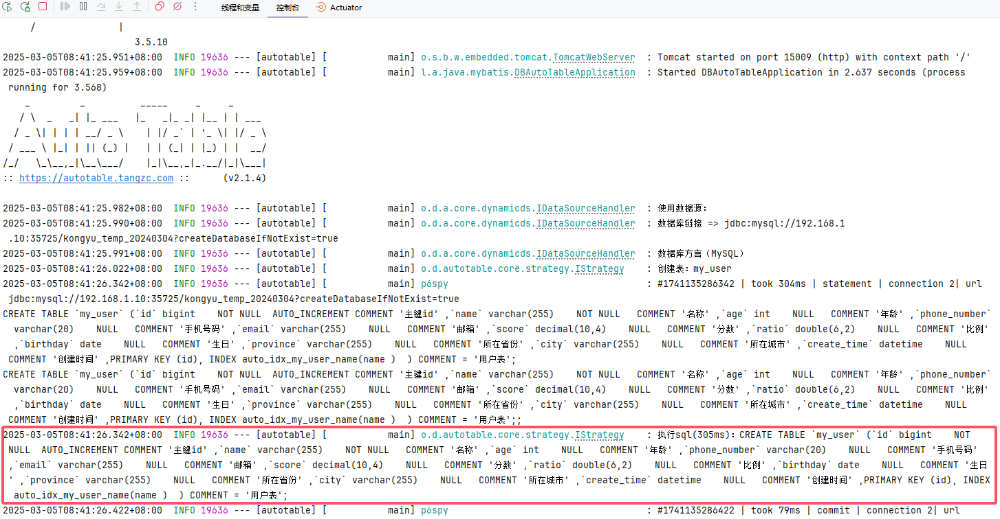
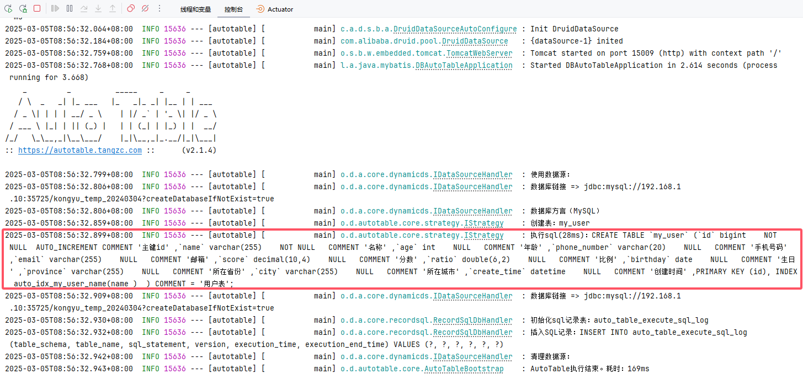
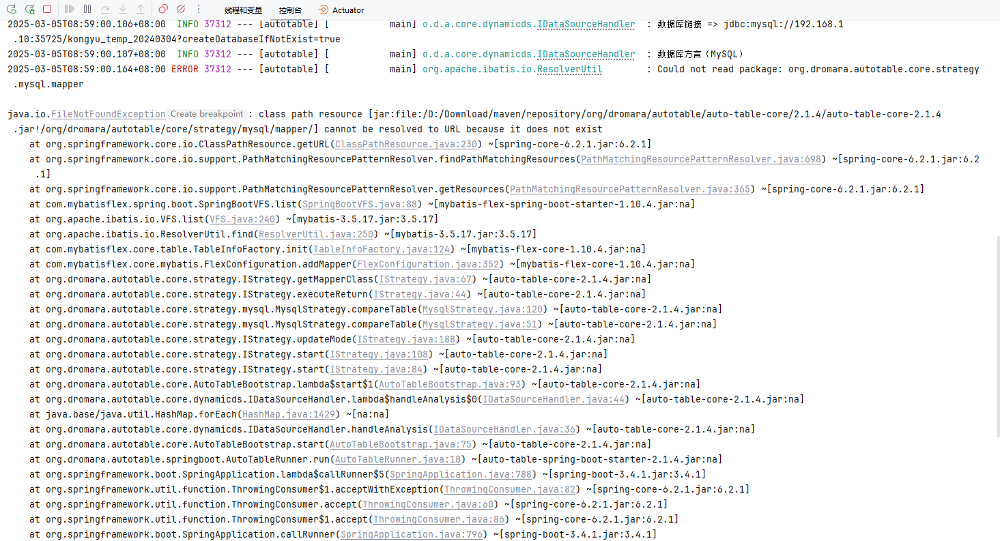
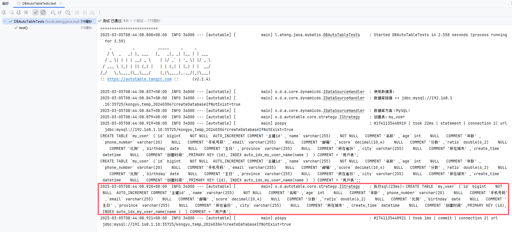
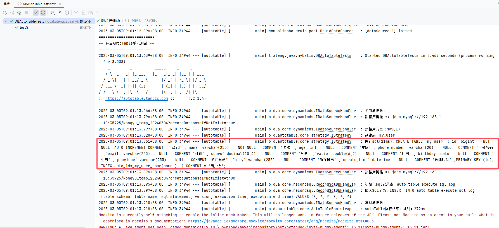

# AutoTable

自动表格，根据 Java 实体，自动映射成数据库的表结构。

- [官网链接](https://autotable.tangzc.com/)

使用步骤

1. 集成数据库框架
2. 集成AutoTable框架
3. 创建实体类并启动服务自动创建表
4. 使用代码生成器生成Mapper、Service、Controller等代码
5. 继续开发...


## 集成数据库框架

参考以下文档的 **基础配置** 部分，集成数据库框架。

### Mybatis Plus

参考：[Mybatis Plus使用文档](/work/Ateng-Java/database/mybatis-plus/)

### Mybatis Flex

参考：[Mybatis Flex使用文档](/work/Ateng-Java/database/mybatis-flex/)


## 集成AutoTable

### 添加依赖

```xml
<!-- AutoTable 依赖 -->
<dependency>
    <groupId>org.dromara.autotable</groupId>
    <artifactId>auto-table-spring-boot-starter</artifactId>
    <version>2.1.4</version>
</dependency>
```

### 启动服务

```java
package local.ateng.java.mybatis;

import org.dromara.autotable.springboot.EnableAutoTable;
import org.springframework.boot.SpringApplication;
import org.springframework.boot.autoconfigure.SpringBootApplication;

@EnableAutoTable // 声明使用AutoTable框架
@SpringBootApplication
public class DBAutoTableApplication {

    public static void main(String[] args) {
        SpringApplication.run(DBAutoTableApplication.class, args);
    }

}
```

### 配置实体类

详情参考以下链接：

- [定义表](https://autotable.tangzc.com/%E6%8C%87%E5%8D%97/%E8%BF%9B%E9%98%B6/%E5%AE%9A%E4%B9%89%E8%A1%A8.html)
- [定义列](https://autotable.tangzc.com/%E6%8C%87%E5%8D%97/%E8%BF%9B%E9%98%B6/%E5%AE%9A%E4%B9%89%E5%88%97.html)
- [定义索引](https://autotable.tangzc.com/%E6%8C%87%E5%8D%97/%E8%BF%9B%E9%98%B6/%E5%AE%9A%E4%B9%89%E7%B4%A2%E5%BC%95.html)

```java
package local.ateng.java.mybatis.entity;

import lombok.Data;
import org.dromara.autotable.annotation.*;

import java.io.Serial;
import java.io.Serializable;
import java.math.BigDecimal;
import java.time.LocalDate;
import java.time.LocalDateTime;

@AutoTable(value = "my_user", comment = "用户表")
@Data
public class MyUser implements Serializable {

    @Serial
    private static final long serialVersionUID = 1L;

    /**
     * 主键id
     */
    @ColumnComment("主键id")
    @PrimaryKey(autoIncrement = true)
    @ColumnNotNull
    private Long id;

    /**
     * 名称
     */
    @ColumnComment("名称")
    @Index
    @ColumnNotNull
    private String name;

    /**
     * 年龄
     */
    @ColumnComment("年龄")
    private Integer age;

    /**
     * 手机号码
     */
    @ColumnComment("手机号码")
    @ColumnType(length = 20)
    private String phoneNumber;

    /**
     * 邮箱
     */
    @ColumnComment("邮箱")
    private String email;

    /**
     * 分数
     */
    @ColumnComment("分数")
    private BigDecimal score;

    /**
     * 比例
     */
    @ColumnComment("比例")
    private Double ratio;

    /**
     * 生日
     */
    @ColumnComment("生日")
    private LocalDate birthday;

    /**
     * 所在省份
     */
    @ColumnComment("所在省份")
    private String province;

    /**
     * 所在城市
     */
    @ColumnComment("所在城市")
    private String city;

    /**
     * 创建时间
     */
    @ColumnComment("创建时间")
    private LocalDateTime createTime;

}
```

### 启动服务

#### Application

启动 **Application** 会自动创建表

**Mybatis Plus**



**Mybatis Flex**



在Mybatis Flex中，当表已经存在且无变更的情况下会有一个报错，这是AutoTable的BUG：




#### ApplicationTest

如果需要在spring boot单元测试环境下，希望AutoTable仍然自动建表，那么就需要使用到@EnableAutoTableTest了

```java
package local.ateng.java.mybatis;

import org.dromara.autotable.springboot.EnableAutoTableTest;
import org.junit.jupiter.api.Test;
import org.springframework.boot.test.context.SpringBootTest;

@SpringBootTest
@EnableAutoTableTest
public class DBAutoTableTests {
    @Test
    public void test() {
        // 测试逻辑...
    }
}
```

**Mybatis Plus**



**Mybatis Flex**




### 代码生成

根据数据库框架的代码生成器生成Mapper、Service、Controller等代码


### 生产环境

在生产环境中建议以下流程：

1. 设置auto-table.enable=false
2. 从开发环境的数据库中生成SQL

