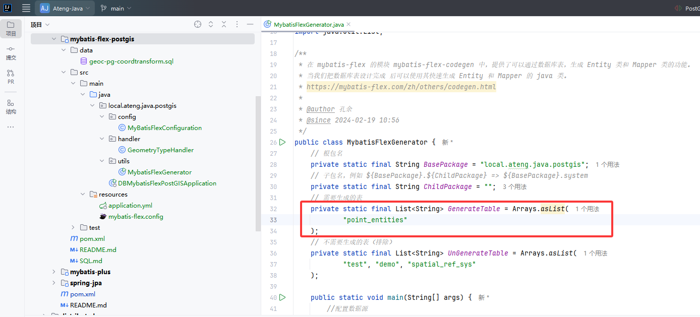
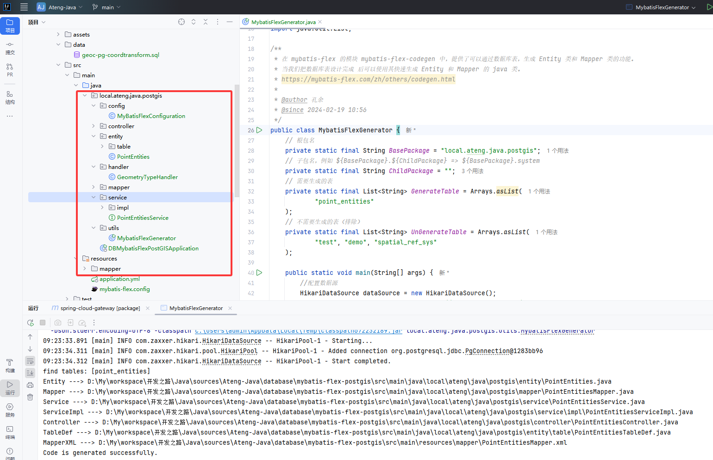

# PostGIS

PostGIS 是 PostgreSQL 的空间扩展插件，为数据库添加了地理信息系统（GIS）功能。它支持存储、查询和分析地理空间数据，如点、线、多边形等。PostGIS 遵循 OGC 标准，广泛应用于地图服务、空间分析和位置数据处理等领域。

本文档使用MyBatis-Flex完成对PostGIS的开发

- [官网链接](https://postgis.net/)

- [Mybatis Flex使用文档](/work/Ateng-Java/database/mybatis-flex/)

- [PostgreSQL安装文档](https://kongyu666.github.io/ops/#/work/docker/service/postgresql/)
- [PostGIS SQL的使用](/work/Ateng-Java/database/mybatis-flex-postgis/SQL.md)


## 基础配置

### 集成Mybatis Flex框架

参考 [Mybatis Flex使用文档](/work/Ateng-Java/database/mybatis-flex/) 集成框架

pom.xml关键配置

```xml
    <!-- 项目属性 -->
    <properties>
        <mybatis-flex.version>1.10.5</mybatis-flex.version>
        <druid.version>1.2.24</druid.version>
    </properties>

    <!-- 项目依赖 -->
    <dependencies>
        <!-- Postgresql数据库驱动 -->
        <dependency>
            <groupId>org.postgresql</groupId>
            <artifactId>postgresql</artifactId>
        </dependency>
        <!--PostGIS的JDBC扩展，以支持空间数据类型-->
        <dependency>
            <groupId>net.postgis</groupId>
            <artifactId>postgis-jdbc</artifactId>
            <version>2024.1.0</version>
        </dependency>
        
        <!-- Mybatis Flex 数据库框架 -->
        <dependency>
            <groupId>com.mybatis-flex</groupId>
            <artifactId>mybatis-flex-spring-boot3-starter</artifactId>
        </dependency>
        <!-- MyBatis-Flex 代码生成器 -->
        <dependency>
            <groupId>com.mybatis-flex</groupId>
            <artifactId>mybatis-flex-codegen</artifactId>
        </dependency>
        <!-- HikariCP 数据源 依赖 -->
        <dependency>
            <groupId>com.zaxxer</groupId>
            <artifactId>HikariCP</artifactId>
        </dependency>
    </dependencies>

    <!-- Spring Boot 依赖管理 -->
    <dependencyManagement>
        <dependencies>
            <!-- MyBatis-Flex 依赖管理 -->
            <dependency>
                <groupId>com.mybatis-flex</groupId>
                <artifactId>mybatis-flex-dependencies</artifactId>
                <version>${mybatis-flex.version}</version>
                <type>pom</type>
                <scope>import</scope>
            </dependency>
        </dependencies>
    </dependencyManagement>
```


### 编辑配置文件

编辑 `application.yml` 配置文件

```yaml
---
# 数据库的相关配置
spring:
  datasource:
    url: jdbc:postgresql://192.168.1.10:32297/ateng_postgis?currentSchema=public&stringtype=unspecified  # PostgreSQL数据库连接URL
    username: postgres  # 数据库用户名
    password: Lingo@local_postgresql_5432  # 数据库密码
    # driver-class-name: org.postgresql.Driver  # 数据库驱动类，框架会自动适配
    type: com.zaxxer.hikari.HikariDataSource  # 使用 HikariCP 数据源
    hikari:
      maximum-pool-size: 1000  # 最大连接池大小
      minimum-idle: 10  # 最小空闲连接数
      idle-timeout: 30000  # 空闲连接超时时间，单位毫秒
      connection-timeout: 30000  # 获取连接的最大等待时间，单位毫秒
# Mybatis Flex的配置 https://mybatis-flex.com/zh/base/configuration.html
mybatis-flex:
  global-config:
    print-banner: false
```

**编辑 `mybatis-flex.config` 文件**

在 `resources` 目录下创建 `mybatis-flex.config` 文件

参考官网文档：[地址](https://mybatis-flex.com/zh/others/apt.html)

```
# https://mybatis-flex.com/zh/others/apt.html
# 开启 @Mapper 注解
processor.mapper.annotation=true
```


### 编辑 `Configuration` 文件

#### 创建配置

**创建 `MyBatisFlexConfiguration`**

```java
package local.ateng.java.postgis.config;

import com.mybatisflex.core.audit.AuditManager;
import org.mybatis.spring.annotation.MapperScan;
import org.slf4j.Logger;
import org.slf4j.LoggerFactory;
import org.springframework.context.annotation.Configuration;

@Configuration
@MapperScan("local.ateng.java.**.mapper")
public class MyBatisFlexConfiguration {

    private static final Logger logger = LoggerFactory.getLogger("mybatis-flex-sql");

    // SQL 日志打印
    public MyBatisFlexConfiguration() {
        //开启审计功能
        AuditManager.setAuditEnable(true);

        //设置 SQL 审计收集器
        AuditManager.setMessageCollector(auditMessage -> logger.info("访问数据库 ==> Time={}ms, SQL={}", auditMessage.getElapsedTime(), auditMessage.getFullSql()));
    }
}
```

#### 创建代码生成器

参考官网文档：[地址](https://mybatis-flex.com/zh/others/codegen.html)

使用的时候修改以下配置：

- 修改数据库的信息dataSource
- 需要生成的表GenerateTable
- 需要排除的表UnGenerateTable
- 其他的根据实际情况修改

```java
package local.ateng.java.postgis.utils;

import com.mybatisflex.codegen.Generator;
import com.mybatisflex.codegen.config.GlobalConfig;
import com.mybatisflex.codegen.config.TableDefConfig;
import com.mybatisflex.core.BaseMapper;
import com.mybatisflex.core.service.IService;
import com.mybatisflex.spring.service.impl.ServiceImpl;
import com.zaxxer.hikari.HikariDataSource;

import java.io.File;
import java.net.URISyntaxException;
import java.time.LocalDate;
import java.time.format.DateTimeFormatter;
import java.util.Arrays;
import java.util.List;

/**
 * 在 mybatis-flex 的模块 mybatis-flex-codegen 中，提供了可以通过数据库表，生成 Entity 类和 Mapper 类的功能。
 * 当我们把数据库表设计完成 后可以使用其快速生成 Entity 和 Mapper 的 java 类。
 * https://mybatis-flex.com/zh/others/codegen.html
 *
 * @author 孔余
 * @since 2024-02-19 10:56
 */
public class MybatisFlexGenerator {
    // 根包名
    private static final String BasePackage = "local.ateng.java.postgis";
    // 子包名，例如 ${BasePackage}.${ChildPackage} => ${BasePackage}.system
    private static final String ChildPackage = "";
    // 需要生成的表
    private static final List<String> GenerateTable = Arrays.asList(
            "my_user", "my_order"
    );
    // 不需要生成的表（排除）
    private static final List<String> UnGenerateTable = Arrays.asList(
            "test", "demo", "spatial_ref_sys"
    );

    public static void main(String[] args) {
        //配置数据源
        HikariDataSource dataSource = new HikariDataSource();
        dataSource.setJdbcUrl("jdbc:postgresql://192.168.1.10:32297/ateng_postgis?currentSchema=public&stringtype=unspecified");
        dataSource.setUsername("postgres");
        dataSource.setPassword("Lingo@local_postgresql_5432");

        //创建配置内容，两种风格都可以。
        GlobalConfig globalConfig = createGlobalConfigUseStyle();

        //通过 datasource 和 globalConfig 创建代码生成器
        Generator generator = new Generator(dataSource, globalConfig);

        //生成代码
        generator.generate();
    }

    public static GlobalConfig createGlobalConfigUseStyle() {
        //创建配置内容
        GlobalConfig globalConfig = new GlobalConfig();

        //设置代码路径和根包
        PathEntity path = getPath();
        globalConfig.getPackageConfig()
                .setSourceDir(path.getSourceDir())
                .setBasePackage(path.getBasePackage())
                .setMapperXmlPath(path.getMapperXmlPath());

        // 设置生成 Entity 并启用 Lombok
        globalConfig.enableEntity()
                .setWithLombok(true);
        // 启用 Mapper 生成
        globalConfig.enableMapper();
        // 启用 Service 生成
        globalConfig.enableService();
        // 启用 ServiceImpl 生成
        globalConfig.enableServiceImpl();
        // 启用 Controller 生成
        globalConfig.enableController();
        // 启用 TableDef 生成
        globalConfig.enableTableDef();
        // 启用 MapperXml 生成
        globalConfig.enableMapperXml();

        // 注释配置 JavadocConfig
        globalConfig.getJavadocConfig()
                .setAuthor("ATeng")
                .setSince(DateTimeFormatter.ofPattern("yyyy-MM-dd").format(LocalDate.now()));

        //设置项目的JDK版本，项目的JDK为14及以上时建议设置该项，小于14则可以不设置
        globalConfig.setEntityJdkVersion(21);

        // 策略配置 StrategyConfig，setGenerateTables 和 setUnGenerateTables 未配置时，生成所有表。
        globalConfig.getStrategyConfig()
                .setGenerateTable(GenerateTable.toArray(new String[0])) // 生成哪些表，白名单
                .setUnGenerateTable(UnGenerateTable.toArray(new String[0])); // 不生成哪些表，黑名单

        // Entity 生成配置 EntityConfig
        globalConfig.getEntityConfig()
                .setWithLombok(true)
                .setClassPrefix("")
                .setClassSuffix("")
                .setOverwriteEnable(false);
        // Mapper 生成配置 MapperConfig
        globalConfig.getMapperConfig()
                .setClassPrefix("")
                .setClassSuffix("Mapper")
                .setSuperClass(BaseMapper.class)
                .setMapperAnnotation(false)
                .setOverwriteEnable(false);
        // Service 生成配置 ServiceConfig
        globalConfig.getServiceConfig()
                .setClassPrefix("")
                .setClassSuffix("Service")
                .setSuperClass(IService.class)
                .setOverwriteEnable(false);
        // ServiceImpl 生成配置 ServiceImplConfig
        globalConfig.getServiceImplConfig()
                .setClassPrefix("")
                .setClassSuffix("ServiceImpl")
                .setSuperClass(ServiceImpl.class)
                .setCacheExample(false)
                .setOverwriteEnable(false);
        // Controller 生成配置 ControllerConfig
        globalConfig.getControllerConfig()
                .setClassPrefix("")
                .setClassSuffix("Controller")
                .setRestStyle(true)
                .setOverwriteEnable(false);
        // TableDef 生成配置 TableDefConfig
        globalConfig.getTableDefConfig()
                .setClassPrefix("")
                .setClassSuffix("TableDef")
                .setOverwriteEnable(true)
                .setPropertiesNameStyle(TableDefConfig.NameStyle.UPPER_CASE)
                .setInstanceSuffix("");
        // MapperXml 生成配置 MapperXmlConfig
        globalConfig.getMapperXmlConfig()
                .setFilePrefix("")
                .setFileSuffix("Mapper")
                .setOverwriteEnable(false);
        // 返回配置
        return globalConfig;
    }

    /**
     * 获取当前模块的路径
     */
    public static String getModulePath() {
        // 获取当前类的路径
        String path = null;
        try {
            path = MybatisFlexGenerator.class.getProtectionDomain().getCodeSource().getLocation().toURI().getPath();
        } catch (URISyntaxException e) {
            throw new RuntimeException(e);
        }
        // 获取父目录（模块目录）
        File moduleDir = new File(path).getParentFile();
        return moduleDir.getPath().replace("\\target", "");
    }

    /**
     * 获取配置需要的路径
     */
    public static PathEntity getPath() {
        String sourceDir = getModulePath() + "/src/main/java";
        String basePath = BasePackage.replaceAll("^\\.|\\.$", "");
        String mapperPath = getModulePath() + "/src/main/resources/mapper";
        if (!ChildPackage.isBlank()) {
            basePath = basePath + "." + ChildPackage.replaceAll("^\\.|\\.$|^/|/$", "");
            mapperPath = mapperPath + "/" + ChildPackage.replaceAll("^\\.|\\.$|^/|/$", "");
        }
        return new PathEntity(sourceDir, basePath, mapperPath);
    }

    /**
     * 设置路径的类
     */
    public static class PathEntity {
        private String sourceDir;
        private String basePackage;
        private String mapperXmlPath;

        public PathEntity(String sourceDir, String basePackage, String mapperXmlPath) {
            this.sourceDir = sourceDir;
            this.basePackage = basePackage;
            this.mapperXmlPath = mapperXmlPath;
        }

        public String getSourceDir() {
            return sourceDir;
        }

        public String getBasePackage() {
            return basePackage;
        }

        public String getMapperXmlPath() {
            return mapperXmlPath;
        }
    }

}
```

### 创建类型处理器

自定义TypeHandler映射Geometry空间几何数据

```java
package local.ateng.java.postgis.handler;

import net.postgis.jdbc.PGgeometry;
import net.postgis.jdbc.geometry.Geometry;
import org.apache.ibatis.type.BaseTypeHandler;
import org.apache.ibatis.type.JdbcType;
import org.apache.ibatis.type.MappedTypes;

import java.sql.CallableStatement;
import java.sql.PreparedStatement;
import java.sql.ResultSet;
import java.sql.SQLException;

/**
 * 自定义TypeHandler映射Geometry空间几何数据
 *
 * @author 孔余
 * @since 2023-08-30 15:58:37
 */
@MappedTypes(Geometry.class)
public class GeometryTypeHandler extends BaseTypeHandler<Geometry> {

    @Override
    public void setNonNullParameter(PreparedStatement ps, int i, Geometry parameter, JdbcType jdbcType) throws SQLException {
        PGgeometry geometry = new PGgeometry();
        geometry.setGeometry(parameter);
        ps.setObject(i, geometry);
    }

    @Override
    public Geometry getNullableResult(ResultSet rs, String columnName) throws SQLException {
        PGgeometry pGgeometry = (PGgeometry) rs.getObject(columnName);
        if (pGgeometry == null) {
            return null;
        }
        return pGgeometry.getGeometry();
    }

    @Override
    public Geometry getNullableResult(ResultSet rs, int columnIndex) throws SQLException {
        PGgeometry pGgeometry = (PGgeometry) rs.getObject(columnIndex);
        if (pGgeometry == null) {
            return null;
        }
        return pGgeometry.getGeometry();
    }

    @Override
    public Geometry getNullableResult(CallableStatement cs, int columnIndex) throws SQLException {
        PGgeometry pGgeometry = (PGgeometry) cs.getObject(columnIndex);
        if (pGgeometry == null) {
            return null;
        }
        return pGgeometry.getGeometry();
    }
}
```


### 创建表

**创建表**

```sql
CREATE TABLE point_entities (
    id SERIAL PRIMARY KEY,
    name TEXT NOT NULL,
    category TEXT,
    created_at TIMESTAMP DEFAULT NOW(),

    geom GEOMETRY(POINT, 4326)
);
CREATE INDEX idx_point_geom ON point_entities USING GIST (geom);
```

**插入数据**

```sql
INSERT INTO point_entities (name, category, geom) VALUES
('解放碑步行街', '商业区', 'POINT(106.5784 29.5628)'),
('重庆北站', '交通枢纽', 'POINT(106.5516 29.6067)'),
('重庆市人民医院', '医疗机构', 'POINT(106.5231 29.5409)'),
('洪崖洞', '景点', 'POINT(106.5764 29.5622)'),
('重庆大学 A 区', '高校', 'POINT(106.4597 29.5647)');
```

**查询数据**

```sql
SELECT id, name, category, created_at, ST_AsText(geom) AS geom_wkt FROM point_entities;
```

**使用示例**

查询某多边形区域内的点

```sql
SELECT * FROM point_entities
WHERE ST_Within(geom, ST_GeomFromText(
  'POLYGON((106.56 29.55, 106.58 29.55, 106.58 29.57, 106.56 29.57, 106.56 29.55))', 4326
));
```

距离“解放碑”500 米以内的点

```sql
SELECT * FROM point_entities
WHERE ST_DWithin(
  geom::geography,
  ST_SetSRID(ST_Point(106.5784, 29.5628), 4326)::geography,
  500
);
```


### 坐标转换

导入坐标转换函数

在[Github仓库](https://github.com/geocompass/pg-coordtransform)下载 `geoc-pg-coordtransform.sql` 文件并执行

```
curl -o geoc-pg-coordtransform.sql https://github.com/geocompass/pg-coordtransform/raw/refs/heads/master/geoc-pg-coordtransform.sql
geoc-pg-coordtransform.sql
```

执行SQL

```
psql -h localhost -U postgres -d ateng_postgis -f geoc-pg-coordtransform.sql
```

使用转换函数WGS84转GCJ02

```
select ST_AsText(geoc_wgs84togcj02(ST_SetSRID(ST_MakePoint(118.168668, 29.718148), 4326))) as wgs84;
```

其他建议，也可以通过前端进行坐标转换，参考项目：[链接](https://github.com/wandergis/coordtransform)


### 代码生成

配置数据库信息和需要生成的表后，运行代码生成器 `MybatisFlexGenerator` 。



生成后如下图所示：



### 修改GEOM字段

修改Geometry空间几何数据字段的类型，将所有的geom字段设置类型处理器

```java
@Column(typeHandler = GeometryTypeHandler.class)
private Geometry geom;
```


## 基础查询

### 测试类准备

```java
/**
 * PostGIS 数据处理
 *
 * @author Ateng
 * @email 2385569970@qq.com
 * @since 2025-04-18
 */
@SpringBootTest
@RequiredArgsConstructor(onConstructor = @__(@Autowired))
public class PostGISTests {
    private final PointEntitiesService pointEntitiesService;

    @Test
    public void test() {
        System.out.println(pointEntitiesService.list());
    }

}
```

运行后输出以下内容

```
2025-04-21T09:32:35.950+08:00  INFO 7964 --- [mybatis-flex-postgis] [           main] mybatis-flex-sql                         : 访问数据库 ==> Time=40ms, SQL=SELECT "id", "name", "category", "created_at", "geom" FROM "point_entities"
[PointEntities(id=1, name=解放碑步行街, category=商业区, createdAt=2025-04-18 16:01:21.645533, geom=SRID=4326;POINT(106.5784 29.5628)), PointEntities(id=2, name=重庆北站, category=交通枢纽, createdAt=2025-04-18 16:01:21.645533, geom=SRID=4326;POINT(106.5516 29.6067)), PointEntities(id=3, name=重庆市人民医院, category=医疗机构, createdAt=2025-04-18 16:01:21.645533, geom=SRID=4326;POINT(106.5231 29.5409)), PointEntities(id=4, name=洪崖洞, category=景点, createdAt=2025-04-18 16:01:21.645533, geom=SRID=4326;POINT(106.5764 29.5622)), PointEntities(id=5, name=重庆大学 A 区, category=高校, createdAt=2025-04-18 16:01:21.645533, geom=SRID=4326;POINT(106.4597 29.5647)), PointEntities(id=6, name=重庆市, category=重庆市, createdAt=2025-04-21 09:32:20.585945, geom=SRID=4326;POINT(106.551787 29.56268))]
```


### 数据写入

**实体写入**

```java
    @Test
    void pointEntitiesSave() {
        PointEntities pois = PointEntities.builder()
                .name("重庆市")
                .category("重庆市")
                .geom(new Point(106.551787, 29.56268))
                .build();
        pointEntitiesService.save(pois);
    }
```

**字符串写入**

```java
    @Test
    void pointEntitiesSaveStr() throws SQLException {
        PointEntities pois = PointEntities.builder()
                .name("重庆市")
                .category("重庆市")
                .geom(new Point("106.551787 29.56268"))
                .build();
        pointEntitiesService.save(pois);
    }
```

**转换坐标系**

```java
    @Test
    void transformCoordinates() {
        // Gcj02 坐标转换成 Wgs84 坐标系再写入数据库
        double lng = 106.560199;
        double lat = 29.471087;
        CoordinateUtil.Coordinate coordinate = CoordinateUtil.gcj02ToWgs84(lng, lat);
        Point point = new Point(coordinate.getLng(), coordinate.getLat());
        PointEntities pois = PointEntities.builder()
                .name("重庆市")
                .category("重庆市")
                .geom(point)
                .build();
        pointEntitiesService.save(pois);
    }
```

**PostGIS JDBC 的典型几何对象构造方式**

| 几何类型             | 对应类                           | 示例构造方式                                                 |
| -------------------- | -------------------------------- | ------------------------------------------------------------ |
| `POINT`              | `org.postgis.Point`              | `new Point("106.55 29.56")`                                  |
| `LINESTRING`         | `org.postgis.LineString`         | `new LineString("LINESTRING(106.55 29.56, 106.56 29.57)")`   |
| `POLYGON`            | `org.postgis.Polygon`            | `new Polygon("POLYGON((106.55 29.56, 106.56 29.56, 106.56 29.57, 106.55 29.57, 106.55 29.56))")` |
| `MULTIPOINT`         | `org.postgis.MultiPoint`         | `new MultiPoint("MULTIPOINT((106.55 29.56), (106.56 29.57))")` |
| `MULTILINESTRING`    | `org.postgis.MultiLineString`    | `new MultiLineString("MULTILINESTRING((106.55 29.56, 106.56 29.57))")` |
| `MULTIPOLYGON`       | `org.postgis.MultiPolygon`       | `new MultiPolygon("MULTIPOLYGON(((106.55 29.56, 106.56 29.56, 106.56 29.57, 106.55 29.57, 106.55 29.56)))")` |
| `GEOMETRYCOLLECTION` | `org.postgis.GeometryCollection` | `new GeometryCollection("GEOMETRYCOLLECTION(POINT(106.55 29.56), LINESTRING(106.55 29.56, 106.56 29.57))")` |


### 数据查询

#### 查询字段转换成GeoJSON

```java
    @Test
    void select() {
        QueryColumn geomColumn = column("ST_AsGeoJSON(geom) AS geojson");
        List<JSONObject> list = pointEntitiesService.queryChain()
                .select(POINT_ENTITIES.ID, POINT_ENTITIES.NAME, POINT_ENTITIES.CATEGORY, POINT_ENTITIES.CREATED_AT, geomColumn)
                .from(POINT_ENTITIES)
                .listAs(JSONObject.class);
        System.out.println(list);
    }
```

输出以下内容：

```
2025-04-21T10:26:06.418+08:00  INFO 12028 --- [mybatis-flex-postgis] [           main] mybatis-flex-sql                         : 访问数据库 ==> Time=35ms, SQL=SELECT "id", "name", "category", "created_at", ST_AsGeoJSON(geom) AS geojson FROM "point_entities"
[{id=1, name=解放碑步行街, category=商业区, created_at=2025-04-18 16:01:21.645533, geojson={"type":"Point","coordinates":[106.5784,29.5628]}}, {id=2, name=重庆北站, category=交通枢纽, created_at=2025-04-18 16:01:21.645533, geojson={"type":"Point","coordinates":[106.5516,29.6067]}}, {id=3, name=重庆市人民医院, category=医疗机构, created_at=2025-04-18 16:01:21.645533, geojson={"type":"Point","coordinates":[106.5231,29.5409]}}, {id=4, name=洪崖洞, category=景点, created_at=2025-04-18 16:01:21.645533, geojson={"type":"Point","coordinates":[106.5764,29.5622]}}, {id=5, name=重庆大学 A 区, category=高校, created_at=2025-04-18 16:01:21.645533, geojson={"type":"Point","coordinates":[106.4597,29.5647]}}, {id=6, name=重庆市, category=重庆市, created_at=2025-04-21 09:32:20.585945, geojson={"type":"Point","coordinates":[106.551787,29.56268]}}, {id=7, name=重庆市, category=重庆市, created_at=2025-04-21 09:34:31.940317, geojson={"type":"Point","coordinates":[106.551787,29.56268]}}, {id=8, name=重庆市, category=重庆市, created_at=2025-04-21 09:45:05.534287, geojson={"type":"Point","coordinates":[106.556500188,29.473988837]}}]
```

#### 查询所有内容转换成GeoJSON

```java
    @Test
    void select2() {
        QueryColumn geomColumn = column("jsonb_agg(ST_AsGeoJSON(t)::jsonb) AS geojson");
        String str = pointEntitiesService.queryChain()
                .select(geomColumn)
                .from(POINT_ENTITIES.as("t"))
                .objAs(String.class);
        System.out.println(str);
    }
```

输出以下内容：

```
2025-04-21T10:26:39.562+08:00  INFO 14712 --- [mybatis-flex-postgis] [           main] mybatis-flex-sql                         : 访问数据库 ==> Time=37ms, SQL=SELECT jsonb_agg(ST_AsGeoJSON(t)::jsonb) AS geojson FROM "point_entities" AS "t"
[{"type": "Feature", "geometry": {"type": "Point", "coordinates": [106.5784, 29.5628]}, "properties": {"id": 1, "name": "解放碑步行街", "category": "商业区", "created_at": "2025-04-18T16:01:21.645533"}}, {"type": "Feature", "geometry": {"type": "Point", "coordinates": [106.5516, 29.6067]}, "properties": {"id": 2, "name": "重庆北站", "category": "交通枢纽", "created_at": "2025-04-18T16:01:21.645533"}}, {"type": "Feature", "geometry": {"type": "Point", "coordinates": [106.5231, 29.5409]}, "properties": {"id": 3, "name": "重庆市人民医院", "category": "医疗机构", "created_at": "2025-04-18T16:01:21.645533"}}, {"type": "Feature", "geometry": {"type": "Point", "coordinates": [106.5764, 29.5622]}, "properties": {"id": 4, "name": "洪崖洞", "category": "景点", "created_at": "2025-04-18T16:01:21.645533"}}, {"type": "Feature", "geometry": {"type": "Point", "coordinates": [106.4597, 29.5647]}, "properties": {"id": 5, "name": "重庆大学 A 区", "category": "高校", "created_at": "2025-04-18T16:01:21.645533"}}, {"type": "Feature", "geometry": {"type": "Point", "coordinates": [106.551787, 29.56268]}, "properties": {"id": 6, "name": "重庆市", "category": "重庆市", "created_at": "2025-04-21T09:32:20.585945"}}, {"type": "Feature", "geometry": {"type": "Point", "coordinates": [106.551787, 29.56268]}, "properties": {"id": 7, "name": "重庆市", "category": "重庆市", "created_at": "2025-04-21T09:34:31.940317"}}, {"type": "Feature", "geometry": {"type": "Point", "coordinates": [106.556500188, 29.473988837]}, "properties": {"id": 8, "name": "重庆市", "category": "重庆市", "created_at": "2025-04-21T09:45:05.534287"}}]
```

#### 查询矩形范围内的点（bounding box）

当前端地图移动或缩放时，只加载当前视图范围内的点，前端传入地图视图边界（bounding box）

```
{
  "minLat": ...,
  "minLng": ...,
  "maxLat": ...,
  "maxLng": ...
}
```

后端使用 `ST_MakeEnvelope` 和 `ST_Within` 查询

```sql
SELECT *
FROM points
WHERE ST_Within(geom, ST_MakeEnvelope(minLng, minLat, maxLng, maxLat, 4326));
```

示例代码

```java
    @Test
    void select3() {
        QueryColumn geomColumn = column("ST_AsGeoJSON(geom) AS geojson");
        List<JSONObject> list = pointEntitiesService.queryChain()
                .select(POINT_ENTITIES.ID, POINT_ENTITIES.NAME, POINT_ENTITIES.CATEGORY, POINT_ENTITIES.CREATED_AT, geomColumn)
                .from(POINT_ENTITIES)
                .where("ST_Within(geom,ST_MakeEnvelope(106.50, 29.50, 106.60, 29.60, 4326));")
                .listAs(JSONObject.class);
        System.out.println(list);
    }
```

**地图视图变化频繁问题解决**

用户滑动地图很快时会触发大量请求，造成后端压力大 + 前端性能差 + 数据抖动

地图视图变化频繁时只监听 `moveend` 而不是 `move`

```
map.on('moveend', () => {
  // 获取地图范围然后请求数据
});
```

#### Wgs84转Gcj02

```java
    @Test
    void select4() {
        QueryColumn geomColumn = column("geoc_wgs84togcj02(geom) AS geom");
        List<PointEntities> list = pointEntitiesService.queryChain()
                .select(POINT_ENTITIES.ID, POINT_ENTITIES.NAME, POINT_ENTITIES.CATEGORY, POINT_ENTITIES.CREATED_AT, geomColumn)
                .from(POINT_ENTITIES)
                .list();
        System.out.println(list);
    }
```

#### 网格数据聚合

```java
    @Test
    void select5() {
        String sql = "WITH\n" +
                "-- 模拟当前视图的边界和缩放级别\n" +
                "params AS (\n" +
                "  SELECT\n" +
                "    ST_MakeEnvelope(?,?,?,?,?) AS bbox,\n" +
                "    ? AS zoom_level  -- 改这个值模拟不同缩放级别\n" +
                "),\n" +
                "\n" +
                "-- 根据 zoom_level 决定网格大小，若 zoom >= 16 则为 NULL 表示不聚合\n" +
                "grid_size AS (\n" +
                "  SELECT\n" +
                "    zoom_level,\n" +
                "    CASE\n" +
                "      WHEN zoom_level < 5 THEN 0.5        -- 世界级\n" +
                "      WHEN zoom_level < 7 THEN 0.2        -- 国家级\n" +
                "      WHEN zoom_level < 9 THEN 0.1        -- 区域级\n" +
                "      WHEN zoom_level < 11 THEN 0.05      -- 城市级\n" +
                "      WHEN zoom_level < 13 THEN 0.02      -- 区县级\n" +
                "      WHEN zoom_level < 14 THEN 0.01      -- 街道级\n" +
                "      WHEN zoom_level < 15 THEN 0.005     -- 社区级\n" +
                "      WHEN zoom_level < 16 THEN 0.002     -- 小区级\n" +
                "      ELSE NULL                           -- >=16 显示原始点\n" +
                "    END AS cell_size,\n" +
                "    bbox\n" +
                "  FROM params\n" +
                "),\n" +
                "\n" +
                "-- 构造网格（当 cell_size 非空时才构建）\n" +
                "grid AS (\n" +
                "  SELECT (ST_SquareGrid(gs.cell_size, gs.bbox)).*\n" +
                "  FROM grid_size gs\n" +
                "  WHERE gs.cell_size IS NOT NULL\n" +
                "),\n" +
                "\n" +
                "-- 聚合数据（仅当 zoom_level < 16）\n" +
                "aggregated AS (\n" +
                "  SELECT\n" +
                "    ST_Centroid(g.geom) AS center_point,\n" +
                "    COUNT(p.*) AS point_count,\n" +
                "    JSON_AGG(\n" +
                "        JSON_BUILD_OBJECT(\n" +
                "            'id', p.id,\n" +
                "            'name', p.name,\n" +
                "            'category', p.category\n" +
                "        )\n" +
                "    ) AS data_items\n" +
                "  FROM grid g\n" +
                "  JOIN point_entities p\n" +
                "    ON ST_Intersects(g.geom, p.geom)\n" +
                "  GROUP BY g.geom\n" +
                "),\n" +
                "\n" +
                "-- 原始点数据（仅当 zoom_level >= 16）\n" +
                "raw_points AS (\n" +
                "  SELECT\n" +
                "    p.geom AS center_point,\n" +
                "    1 AS point_count,\n" +
                "    JSON_BUILD_ARRAY(\n" +
                "        JSON_BUILD_OBJECT(\n" +
                "            'id', p.id,\n" +
                "            'name', p.name,\n" +
                "            'category', p.category\n" +
                "        )\n" +
                "    ) AS data_items\n" +
                "  FROM point_entities p, params pa\n" +
                "  WHERE ST_Intersects(p.geom, pa.bbox)\n" +
                ")\n" +
                ", result AS (\n" +
                "-- 最终输出\n" +
                "SELECT * FROM aggregated WHERE (SELECT zoom_level FROM params) < 16\n" +
                "UNION ALL\n" +
                "SELECT * FROM raw_points WHERE (SELECT zoom_level FROM params) >= 16\n" +
                ")\n" +
                "SELECT\n" +
                "    JSON_BUILD_OBJECT(\n" +
                "        'type', 'FeatureCollection',\n" +
                "        'features', jsonb_agg(ST_AsGeoJSON(r)::jsonb)\n" +
                "    ) AS feature\n" +
                "FROM result as r;";
        PGobject pgObject = (PGobject) Db.selectObject(sql, 106.50, 29.50, 106.60, 29.60, 4326, 13);
        System.out.println(pgObject.getType());
        System.out.println(pgObject.getValue());
    }
```

打印内容

```
json
{"type" : "FeatureCollection", "features" : [{"type": "Feature", "geometry": {"type": "Point", "coordinates": [106.555, 29.605]}, "properties": {"data_items": [{"id": 2, "name": "重庆北站", "category": "交通枢纽"}], "point_count": 1}}, {"type": "Feature", "geometry": {"type": "Point", "coordinates": [106.555, 29.565]}, "properties": {"data_items": [{"id": 6, "name": "重庆市", "category": "重庆市"}, {"id": 7, "name": "重庆市", "category": "重庆市"}], "point_count": 2}}, {"type": "Feature", "geometry": {"type": "Point", "coordinates": [106.575, 29.565]}, "properties": {"data_items": [{"id": 1, "name": "解放碑步行街", "category": "商业区"}, {"id": 4, "name": "洪崖洞", "category": "景点"}], "point_count": 2}}, {"type": "Feature", "geometry": {"type": "Point", "coordinates": [106.525, 29.545]}, "properties": {"data_items": [{"id": 3, "name": "重庆市人民医院", "category": "医疗机构"}], "point_count": 1}}]}
```

