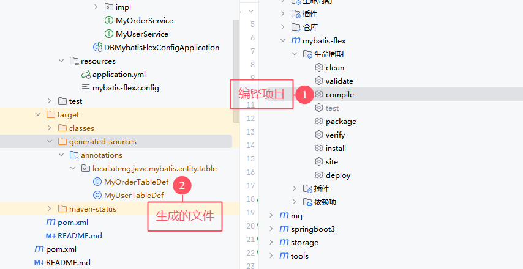

# MyBatis-Flex

MyBatis-Flex 是一个优雅的 MyBatis 增强框架，它非常轻量、同时拥有极高的性能与灵活性。我们可以轻松的使用 Mybaits-Flex 链接任何数据库，其内置的 QueryWrapper^亮点 帮助我们极大的减少了 SQL 编写的工作的同时，减少出错的可能性。

- [官网地址](https://mybatis-flex.com/zh/intro/what-is-mybatisflex.html)

**特征**

1、轻量

除了 MyBatis，没有任何第三方依赖轻依赖、没有任何拦截器，其原理是通过 SqlProvider 的方式实现的轻实现。同时，在执行的过程中，没有任何的 Sql 解析（Parse）轻运行。 这带来了几个好处：1、极高的性能；2、极易对代码进行跟踪和调试； 3、更高的把控性。

2、灵活

支持 Entity 的增删改查、以及分页查询的同时，MyBatis-Flex 提供了 Db + Row^灵活 工具，可以无需实体类对数据库进行增删改查以及分页查询。 与此同时，MyBatis-Flex 内置的 QueryWrapper^灵活 可以轻易的帮助我们实现 多表查询、链接查询、子查询 等等常见的 SQL 场景。

3、强大

支持任意关系型数据库，还可以通过方言持续扩展，同时支持 多（复合）主键、逻辑删除、乐观锁配置、数据脱敏、数据审计、 数据填充 等等功能。


## 基础配置

### 添加依赖

参考官网链接：[地址](https://mybatis-flex.com/zh/intro/maven.html)

**添加属性**

```xml
    <!-- 项目属性 -->
    <properties>
        <mybatis-flex.version>1.10.4</mybatis-flex.version>
        <druid.version>1.2.24</druid.version>
    </properties>
```

**添加依赖管理**

```xml
    <!-- Spring Boot 依赖管理 -->
    <dependencyManagement>
        <dependencies>
            <!-- MyBatis-Flex 依赖管理 -->
            <dependency>
                <groupId>com.mybatis-flex</groupId>
                <artifactId>mybatis-flex-dependencies</artifactId>
                <version>${mybatis-flex.version}</version>
                <type>pom</type>
                <scope>import</scope>
            </dependency>
        </dependencies>
    </dependencyManagement>
```

**添加依赖**

```xml
    <!-- 项目依赖 -->
    <dependencies>
        <!-- MySQL数据库驱动 -->
        <dependency>
            <groupId>com.mysql</groupId>
            <artifactId>mysql-connector-j</artifactId>
        </dependency>
        <!-- Postgresql数据库驱动 -->
        <!--<dependency>
            <groupId>org.postgresql</groupId>
            <artifactId>postgresql</artifactId>
        </dependency>-->

        <!-- Mybatis Flex 数据库框架 -->
        <dependency>
            <groupId>com.mybatis-flex</groupId>
            <artifactId>mybatis-flex-spring-boot3-starter</artifactId>
        </dependency>
        <!-- MyBatis-Flex 代码生成器 -->
        <dependency>
            <groupId>com.mybatis-flex</groupId>
            <artifactId>mybatis-flex-codegen</artifactId>
        </dependency>

        <!-- Druid 数据源: 高性能数据库连接池 -->
        <!-- https://mvnrepository.com/artifact/com.alibaba/druid-spring-boot-starter -->
        <dependency>
            <groupId>com.alibaba</groupId>
            <artifactId>druid-spring-boot-3-starter</artifactId>
            <version>${druid.version}</version>
        </dependency>
    </dependencies>
```

**注解处理器配置**

```xml
<plugin>
    <groupId>org.apache.maven.plugins</groupId>
    <artifactId>maven-compiler-plugin</artifactId>
    <version>${maven-compiler.version}</version>
    <configuration>
        <annotationProcessorPaths>
            <path>
                <groupId>com.mybatis-flex</groupId>
                <artifactId>mybatis-flex-processor</artifactId>
            </path>
        </annotationProcessorPaths>
    </configuration>
</plugin>
```

### 编辑配置文件

编辑 `application.yml` 配置文件

```yaml
---
# 数据库的相关配置
spring:
  datasource:
    url: jdbc:mysql://192.168.1.10:35725/kongyu  # MySQL数据库连接URL
    #url: jdbc:postgresql://192.168.1.10:32297/kongyu?currentSchema=public&stringtype=unspecified  # PostgreSQL数据库连接URL
    username: root  # 数据库用户名
    password: Admin@123  # 数据库密码
    # driver-class-name: com.mysql.cj.jdbc.Driver  # 数据库驱动类，框架会自动适配
    type: com.alibaba.druid.pool.DruidDataSource  # 使用Druid数据源
    # Druid连接池配置 https://github.com/alibaba/druid/tree/master/druid-spring-boot-starter
    druid:
      initial-size: 10  # 初始化连接池大小
      min-idle: 10  # 最小空闲连接数
      max-active: 1000  # 最大活跃连接数
      max-wait: 10000  # 获取连接的最大等待时间，单位毫秒
# Mybatis Flex的配置 https://mybatis-flex.com/zh/base/configuration.html
mybatis-flex:
  global-config:
    print-banner: false
```

**编辑 `mybatis-flex.config` 文件**

在 `resources` 目录下创建 `mybatis-flex.config` 文件

参考官网文档：[地址](https://mybatis-flex.com/zh/others/apt.html)

```
# https://mybatis-flex.com/zh/others/apt.html
# 开启 @Mapper 注解
processor.mapper.annotation=true
```


### 编辑 `Configuration` 文件

**创建 `MyBatisFlexConfiguration`**

```java
package local.ateng.java.mybatis.config;

import com.mybatisflex.core.audit.AuditManager;
import org.mybatis.spring.annotation.MapperScan;
import org.mybatis.spring.annotation.MapperScans;
import org.slf4j.Logger;
import org.slf4j.LoggerFactory;
import org.springframework.context.annotation.Configuration;

@Configuration
@MapperScan("local.ateng.java.**.mapper")
public class MyBatisFlexConfiguration {

    private static final Logger logger = LoggerFactory.getLogger("mybatis-flex-sql");

    // SQL 日志打印
    public MyBatisFlexConfiguration() {
        //开启审计功能
        AuditManager.setAuditEnable(true);

        //设置 SQL 审计收集器
        AuditManager.setMessageCollector(auditMessage -> logger.info("访问数据库 ==> Time={}ms, SQL={}", auditMessage.getElapsedTime(), auditMessage.getFullSql()));
    }
}
```

**创建代码生成器**

参考官网文档：[地址](https://mybatis-flex.com/zh/others/codegen.html)

使用的时候修改以下配置：

- 修改数据库的信息dataSource
- 需要生成的表GenerateTable
- 需要排除的表UnGenerateTable
- 其他的根据实际情况修改

```java
package local.ateng.java.mybatis.generator;

import com.alibaba.druid.pool.DruidDataSource;
import com.mybatisflex.codegen.Generator;
import com.mybatisflex.codegen.config.ColumnConfig;
import com.mybatisflex.codegen.config.GlobalConfig;
import com.mybatisflex.core.BaseMapper;
import com.mybatisflex.core.service.IService;
import com.mybatisflex.spring.service.impl.ServiceImpl;

import java.io.File;
import java.net.URISyntaxException;
import java.util.Arrays;
import java.util.List;

/**
 * 在 mybatis-flex 的模块 mybatis-flex-codegen 中，提供了可以通过数据库表，生成 Entity 类和 Mapper 类的功能。
 * 当我们把数据库表设计完成 后可以使用其快速生成 Entity 和 Mapper 的 java 类。
 * https://mybatis-flex.com/zh/others/codegen.html
 *
 * @author 孔余
 * @since 2024-02-19 10:56
 */
public class MybatisFlexGenerator {
    // 生成的包路径
    private static final String BasePackage = "local.ateng.java.mybatis";
    // 需要生成的表
    private static final List<String> GenerateTable = Arrays.asList(
            "my_user", "my_order"
    );
    // 不需要生成的表（排除）
    private static final List<String> UnGenerateTable = Arrays.asList(
            "test", "demo", "spatial_ref_sys"
    );

    public static void main(String[] args) {
        //配置数据源
        DruidDataSource dataSource = new DruidDataSource();
        dataSource.setUrl("jdbc:mysql://192.168.1.10:35725/kongyu");
        dataSource.setUsername("root");
        dataSource.setPassword("Admin@123");

        //创建配置内容，两种风格都可以。
        GlobalConfig globalConfig = createGlobalConfigUseStyle();

        //通过 datasource 和 globalConfig 创建代码生成器
        Generator generator = new Generator(dataSource, globalConfig);

        //生成代码
        generator.generate();
    }

    public static GlobalConfig createGlobalConfigUseStyle() {
        //创建配置内容
        GlobalConfig globalConfig = new GlobalConfig();

        //设置代码路径和根包
        globalConfig.getPackageConfig()
                .setSourceDir(getModulePath() + "/src/main/java")
                .setBasePackage(BasePackage);
        //.setMapperXmlPath(System.getProperty("user.dir") + "/src/main/resources/mapper");

        // 设置生成 Entity 并启用 Lombok
        globalConfig.enableEntity()
                .setWithLombok(true);
        // 启用 Mapper 生成
        globalConfig.enableMapper();
        // 启用 Service 生成
        globalConfig.enableService();
        // 启用 ServiceImpl 生成
        globalConfig.enableServiceImpl();
        // 启用 Controller 生成
        globalConfig.enableController();
        // 启用 TableDef 生成
        //globalConfig.enableTableDef();
        // 启用 MapperXml 生成
        //globalConfig.enableMapperXml();

        // 注释配置 JavadocConfig
        globalConfig.getJavadocConfig()
                .setAuthor("孔余")
                .setSince("1.0.0");

        //设置项目的JDK版本，项目的JDK为14及以上时建议设置该项，小于14则可以不设置
        globalConfig.setEntityJdkVersion(21);

        // 策略配置 StrategyConfig，setGenerateTables 和 setUnGenerateTables 未配置时，生成所有表。
        globalConfig.getStrategyConfig()
                .setGenerateTable(GenerateTable.toArray(new String[0])) // 生成哪些表，白名单
                .setUnGenerateTable(UnGenerateTable.toArray(new String[0])); // 不生成哪些表，黑名单

        // Entity 生成配置 EntityConfig
        globalConfig.getEntityConfig()
                .setWithLombok(true)
                .setClassPrefix("")
                .setClassSuffix("")
                .setOverwriteEnable(false);
        // Mapper 生成配置 MapperConfig
        globalConfig.getMapperConfig()
                .setClassPrefix("")
                .setClassSuffix("Mapper")
                .setSuperClass(BaseMapper.class)
                .setMapperAnnotation(false)
                .setOverwriteEnable(false);
        // Service 生成配置 ServiceConfig
        globalConfig.getServiceConfig()
                .setClassPrefix("")
                .setClassSuffix("Service")
                .setSuperClass(IService.class)
                .setOverwriteEnable(false);
        // ServiceImpl 生成配置 ServiceImplConfig
        globalConfig.getServiceImplConfig()
                .setClassPrefix("")
                .setClassSuffix("ServiceImpl")
                .setSuperClass(ServiceImpl.class)
                .setCacheExample(false)
                .setOverwriteEnable(false);
        // Controller 生成配置 ControllerConfig
        globalConfig.getControllerConfig()
                .setClassPrefix("")
                .setClassSuffix("Controller")
                .setRestStyle(true)
                .setOverwriteEnable(false);
        // 返回配置
        return globalConfig;
    }

    /**
     * 获取当前模块的路径
     *
     * @return
     */
    public static String getModulePath() {
        // 获取当前类的路径
        String path = null;
        try {
            path = MybatisFlexGenerator.class.getProtectionDomain().getCodeSource().getLocation().toURI().getPath();
        } catch (URISyntaxException e) {
            throw new RuntimeException(e);
        }
        // 获取父目录（模块目录）
        File moduleDir = new File(path).getParentFile();
        return moduleDir.getPath().replace("\\target", "");
    }
}
```


## 数据库表准备

### 创建表

**创建表**

```sql
-- 用户表
create table if not exists my_user
(
    id          bigint auto_increment
        primary key comment '用户ID，主键，自增',
    name        varchar(50)                              not null comment '用户名',
    age         int                                      null comment '用户年龄，允许为空',
    score       double                                   default 0 comment '用户分数，默认为0',
    birthday    datetime(3)                              null comment '用户生日，允许为空',
    province    varchar(50)                              null comment '用户所在省份，允许为空',
    city        varchar(50)                              null comment '用户所在城市，允许为空',
    create_time datetime(3) default CURRENT_TIMESTAMP(3) not null comment '记录创建时间，默认当前时间'
) comment '用户信息表，存储用户的基本信息';

-- 订单表
create table if not exists kongyu.my_order
(
    id           bigint auto_increment
        primary key comment '订单ID，主键，自增',
    user_id      bigint         not null comment '用户ID，外键，关联用户表',
    date         date           not null comment '订单日期',
    total_amount decimal(10, 2) not null comment '订单总金额，精确到小数点后两位',
    constraint fk_my_order_user foreign key (user_id) references my_user (id) on delete cascade on update cascade
) comment '订单信息表，存储用户的订单数据';
```

**插入数据**

将项目模块下 `/data` 目录的SQL运行在数据库中


## 代码生成

配置数据库信息和需要生成的表后，运行代码生成器 `MybatisFlexGenerator` 。

生成后如下图所示：


## 编译项目

MyBatis-Flex 使用了 APT（Annotation Processing Tool）技术，在项目编译的时候，会自动根据 Entity 类定义的字段帮你生成 "ACCOUNT" 类以及 Entity。使用命令编译：`mvn -DskipTests=true compile` 。如下图所示：

每次entity有变动（修改、新增、删除）都需要重新编译。




## 基础查询

### 测试类准备

```java
package local.ateng.java.mybatis;

import local.ateng.java.mybatis.service.MyOrderService;
import local.ateng.java.mybatis.service.MyUserService;
import lombok.RequiredArgsConstructor;
import org.junit.jupiter.api.Test;
import org.springframework.beans.factory.annotation.Autowired;
import org.springframework.boot.test.context.SpringBootTest;

/**
 * 基础查询
 *
 * @author 孔余
 * @email 2385569970@qq.com
 * @since 2025-01-10
 */
@SpringBootTest
@RequiredArgsConstructor(onConstructor = @__(@Autowired))
public class BasicQueryTests {
    private final MyUserService myUserService;
    private final MyOrderService myOrderService;

    @Test
    void test() {
        long count = myUserService.count();
        System.out.println(count);
    }
}
```

### 条件查询

**查询id是88的一条数据**

```java
    @Test
    void test01() {
        // 查询id是88的一条数据
        MyUser myUser = myUserService.queryChain()
                .where(MY_USER.ID.eq(88))
                .one();
        System.out.println(myUser);
    }
```

**查询id是88到90(包含)这个范围内的数据**

```java
    @Test
    void test02() {
        // 查询id是88到90(包含)这个范围内的数据
        List<MyUser> userList = myUserService.queryChain()
                .where(MY_USER.ID.between(88, 90))
                .list();
        System.out.println(userList);
    }
```

**查询所有的区域**

```java
    @Test
    void test03() {
        // 查询所有的区域
        // 常见的SQL函数：https://mybatis-flex.com/zh/base/querywrapper.html#select-function-sql-%E5%87%BD%E6%95%B0
        List<String> list = myUserService.queryChain()
                .select(distinct(MY_USER.CITY))
                .listAs(String.class);
        System.out.println(list);
    }
```

**查询创建时间是2024年8月的数据数量**

```java
    @Test
    void test04() {
        // 查询创建时间是2024年8月的数据数量
        // 自定义字符串列名：https://mybatis-flex.com/zh/base/querywrapper.html#%E8%87%AA%E5%AE%9A%E4%B9%89%E5%AD%97%E7%AC%A6%E4%B8%B2%E5%88%97%E5%90%8D
        QueryColumn monthF = column("DATE_FORMAT(create_time, '%Y-%m')");
        QueryColumn month = column("month");
        List<Row> list = myUserService.queryChain()
                .select(monthF.as("month"), count().as("count"))
                .groupBy(monthF)
                .having(month.eq("2025-01"))
                .listAs(Row.class);
        System.out.println(list);
    }
```

**查询并按照创建时间排序(降序)，创建时间一样则按照id排序(降序)**

```java
    @Test
    void test05() {
        // 查询并按照创建时间排序(降序)，创建时间一样则按照id排序(降序)
        List<MyUser> userList = myUserService.queryChain()
                .where(MY_USER.ID.between(88, 90))
                .orderBy(MY_USER.CREATE_TIME.desc(), MY_USER.ID.desc())
                .list();
        System.out.println(userList);
    }
```

**关联查询**

```java
    @Test
    void test06() {
        // 关联查询
        List<MyUserOrderVo> list = myUserService.queryChain()
                .select(
                        // 要实现全映射需要手动写出所有字段
                        MY_USER.ALL_COLUMNS,
                        MY_ORDER.ID.as("order_id"),
                        MY_ORDER.DATE.as("order_date"),
                        MY_ORDER.TOTAL_AMOUNT
                )
                .from(MY_USER.as("u"))
                .where(MY_USER.ID.between(88, 90))
                .leftJoin(MY_ORDER.as("r"))
                .on(MY_USER.ID.eq(MY_ORDER.USER_ID))
                .listAs(MyUserOrderVo.class);
        System.out.println(JSON.toJSONString(list));
    }
```

**关联查询 一对多**

```java
    @Test
    void test07() {
        // 关联查询 一对多
        List<MyUserVo> list = myUserService.queryChain()
                .select(
                        // 要实现全映射需要手动写出所有字段
                        MY_USER.ID,
                        MY_USER.NAME,
                        MY_USER.AGE,
                        MY_USER.SCORE,
                        MY_USER.BIRTHDAY,
                        MY_USER.PROVINCE,
                        MY_USER.CITY,
                        MY_USER.CREATE_TIME,
                        MY_ORDER.ID,
                        MY_ORDER.USER_ID,
                        MY_ORDER.DATE,
                        MY_ORDER.TOTAL_AMOUNT
                )
                .from(MY_USER.as("u"))
                .where(MY_USER.ID.between(88, 90))
                .leftJoin(MY_ORDER.as("r"))
                .on(MY_USER.ID.eq(MY_ORDER.USER_ID))
                .listAs(MyUserVo.class);
        System.out.println(JSON.toJSONString(list));
    }
```

**分页查询**

```java
    @Test
    void test08() {
        Page<MyUser> page = new Page<>(2, 10);  // 第2页，每页10条记录
        // 分页查询
        Page<MyUser> userPage = myUserService.queryChain()
                .where(MY_USER.ID.between(88, 888))
                .page(page);
        // 获取分页结果
        List<MyUser> users = userPage.getRecords();  // 分页数据
        long total = userPage.getTotalRow();  // 总记录数
        long pages = userPage.getTotalPage();  // 总页数
        // 输出查询结果
        System.out.println(userPage);
        System.out.println("Total: " + total);
        System.out.println("Pages: " + pages);
        users.forEach(user -> System.out.println(user));
    }
```


## 多数据源

参考官网文档：[地址](https://mybatis-flex.com/zh/core/multi-datasource.html#%E5%BC%80%E5%A7%8B%E4%BD%BF%E7%94%A8)

### 编辑配置文件

**编辑 `application.yml` 添加多数据源配置**

原有的spring.datasource可以注释掉了，配置了mybatis-flex.datasource只会加载这个，并且第一个数据源为默认的。

```yaml
---
# 数据库的相关配置
#spring:
#  datasource:
#    url: jdbc:mysql://192.168.1.10:35725/kongyu  # MySQL数据库连接URL
#    #url: jdbc:postgresql://192.168.1.10:32297/kongyu?currentSchema=public&stringtype=unspecified  # PostgreSQL数据库连接URL
#    username: root  # 数据库用户名
#    password: Admin@123  # 数据库密码
#    # driver-class-name: com.mysql.cj.jdbc.Driver  # 数据库驱动类，框架会自动适配
#    type: com.alibaba.druid.pool.DruidDataSource  # 使用Druid数据源
#    # Druid连接池配置 https://github.com/alibaba/druid/tree/master/druid-spring-boot-starter
#    druid:
#      initial-size: 10  # 初始化连接池大小
#      min-idle: 10  # 最小空闲连接数
#      max-active: 1000  # 最大活跃连接数
#      max-wait: 10000  # 获取连接的最大等待时间，单位毫秒
#      async-init: true
# Mybatis Flex的配置 https://mybatis-flex.com/zh/base/configuration.html
mybatis-flex:
  global-config:
    print-banner: false
  datasource:
    # 第一个数据源为默认数据源
    # https://mybatis-flex.com/zh/core/multi-datasource.html
    mysql:
      url: jdbc:mysql://192.168.1.10:35725/kongyu
      username: root
      password: Admin@123
      type: com.alibaba.druid.pool.DruidDataSource
      initial-size: 10
      min-idle: 10
      max-active: 1000
      max-wait: 10000
      async-init: true
    doris:
      type: com.alibaba.druid.pool.DruidDataSource
      url: jdbc:mysql://192.168.1.12:9030/kongyu
      username: admin
      password: Admin@123
      initial-size: 10
      min-idle: 10
      max-active: 100
      max-wait: 10000
```

### 使用多数据源

**创建测试类使用第二个指定的数据源**

执行代码后输出的内容就是Doris中表的数据，详细使用参考[官方文档](https://mybatis-flex.com/zh/core/multi-datasource.html)

```java
package local.ateng.java.mybatis;

import com.mybatisflex.core.datasource.DataSourceKey;
import com.mybatisflex.core.row.Db;
import com.mybatisflex.core.row.Row;
import org.junit.jupiter.api.Test;
import org.springframework.boot.test.context.SpringBootTest;

import java.util.List;

@SpringBootTest
public class MultiDatasourceTests {

    @Test
    void test01() {
        try {
            DataSourceKey.use("doris");
            List<Row> rows = Db.selectAll("example_tbl_unique");
            System.out.println(rows);
        } finally {
            DataSourceKey.clear();
        }
    }

}
```

