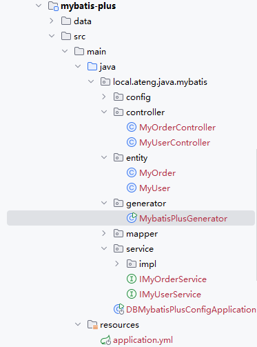

# MyBatis Plus

[MyBatis-Plus](https://github.com/baomidou/mybatis-plus) 是一个 [MyBatis](https://www.mybatis.org/mybatis-3/) 的增强工具，在 MyBatis 的基础上只做增强不做改变，为简化开发、提高效率而生。

- [官网地址](https://baomidou.com/introduce/)

**特性**

- **无侵入**：只做增强不做改变，引入它不会对现有工程产生影响，如丝般顺滑
- **损耗小**：启动即会自动注入基本 CURD，性能基本无损耗，直接面向对象操作
- **强大的 CRUD 操作**：内置通用 Mapper、通用 Service，仅仅通过少量配置即可实现单表大部分 CRUD 操作，更有强大的条件构造器，满足各类使用需求
- **支持 Lambda 形式调用**：通过 Lambda 表达式，方便的编写各类查询条件，无需再担心字段写错
- **支持主键自动生成**：支持多达 4 种主键策略（内含分布式唯一 ID 生成器 - Sequence），可自由配置，完美解决主键问题
- **支持 ActiveRecord 模式**：支持 ActiveRecord 形式调用，实体类只需继承 Model 类即可进行强大的 CRUD 操作
- **支持自定义全局通用操作**：支持全局通用方法注入（ Write once, use anywhere ）
- **内置代码生成器**：采用代码或者 Maven 插件可快速生成 Mapper 、 Model 、 Service 、 Controller 层代码，支持模板引擎，更有超多自定义配置等您来使用
- **内置分页插件**：基于 MyBatis 物理分页，开发者无需关心具体操作，配置好插件之后，写分页等同于普通 List 查询
- **分页插件支持多种数据库**：支持 MySQL、MariaDB、Oracle、DB2、H2、HSQL、SQLite、Postgre、SQLServer 等多种数据库
- **内置性能分析插件**：可输出 SQL 语句以及其执行时间，建议开发测试时启用该功能，能快速揪出慢查询
- **内置全局拦截插件**：提供全表 delete 、 update 操作智能分析阻断，也可自定义拦截规则，预防误操作


## 基础配置

### 添加依赖

参考官网链接：[地址](https://mybatis-flex.com/zh/intro/maven.html)

**添加属性**

```xml
    <!-- 项目属性 -->
    <properties>
        <mybatis-plus.version>3.5.10</mybatis-plus.version>
        <druid.version>1.2.24</druid.version>
    </properties>
```

**添加依赖管理**

```xml
    <!-- Spring Boot 依赖管理 -->
    <dependencyManagement>
        <dependencies>
            <!-- MyBatis Plus 依赖管理 -->
            <dependency>
                <groupId>com.baomidou</groupId>
                <artifactId>mybatis-plus-bom</artifactId>
                <version>${mybatis-plus.version}</version>
                <type>pom</type>
                <scope>import</scope>
            </dependency>
        </dependencies>
    </dependencyManagement>
```

**添加依赖**

```xml
        <!-- Mybatis Plus 数据库框架 -->
        <dependency>
            <groupId>com.baomidou</groupId>
            <artifactId>mybatis-plus-spring-boot3-starter</artifactId>
        </dependency>
        <!-- MyBatis Plus 增加工具包 -->
        <dependency>
            <groupId>com.baomidou</groupId>
            <artifactId>mybatis-plus-jsqlparser</artifactId>
        </dependency>
        <!-- MyBatis Plus 代码生成器 -->
        <dependency>
            <groupId>com.baomidou</groupId>
            <artifactId>mybatis-plus-generator</artifactId>
        </dependency>
        <!-- 代码生成器的模板引擎 VelocityTemplateEngine -->
        <dependency>
            <groupId>org.apache.velocity</groupId>
            <artifactId>velocity-engine-core</artifactId>
            <version>2.4.1</version>
        </dependency>
        <!-- 代码生成器的模板引擎 FreemarkerTemplateEngine -->
        <!--<dependency>
            <groupId>org.freemarker</groupId>
            <artifactId>freemarker</artifactId>
            <version>2.3.34</version>
        </dependency>-->
        <!-- MyBatis-Plus SQL分析与打印功能 -->
        <!-- 有性能损耗，在生产环境中谨慎使用 -->
        <dependency>
            <groupId>com.github.gavlyukovskiy</groupId>
            <artifactId>p6spy-spring-boot-starter</artifactId>
            <version>1.10.0</version>
        </dependency>
```

**添加数据源依赖**

以下任选一种数据库即可

- HikariCP

Mybatis-Plus依赖中默认已经包含了该依赖（在spring-boot-starter-jdbc中）

```xml
<!-- HikariCP 数据源 依赖 -->
<dependency>
    <groupId>com.zaxxer</groupId>
    <artifactId>HikariCP</artifactId>
</dependency>
```

- Druid

```xml
<!-- Druid 数据源: 高性能数据库连接池 -->
<!-- https://mvnrepository.com/artifact/com.alibaba/druid-spring-boot-starter -->
<dependency>
    <groupId>com.alibaba</groupId>
    <artifactId>druid-spring-boot-3-starter</artifactId>
    <version>${druid.version}</version>
</dependency>
```


### 编辑配置文件

编辑 `application.yml` 配置文件

```yaml
---
# 数据库的相关配置
spring:
  datasource:
    url: jdbc:mysql://192.168.1.10:35725/kongyu  # MySQL数据库连接URL
    #url: jdbc:postgresql://192.168.1.10:32297/kongyu?currentSchema=public&stringtype=unspecified  # PostgreSQL数据库连接URL
    username: root  # 数据库用户名
    password: Admin@123  # 数据库密码
    # driver-class-name: com.mysql.cj.jdbc.Driver  # 数据库驱动类，框架会自动适配
    type: com.alibaba.druid.pool.DruidDataSource  # 使用Druid数据源
    # Druid连接池配置 https://github.com/alibaba/druid/tree/master/druid-spring-boot-starter
    druid:
      initial-size: 10  # 初始化连接池大小
      min-idle: 10  # 最小空闲连接数
      max-active: 1000  # 最大活跃连接数
      max-wait: 10000  # 获取连接的最大等待时间，单位毫秒
      async-init: true
# Mybatis Plus的配置 https://baomidou.com/reference
mybatis-plus:
  global-config:
    banner: false
```

如果使用的是 **HikariCP** ，配置如下

```yaml
spring:
  datasource:
    # ...
    type: com.zaxxer.hikari.HikariDataSource  # 使用 HikariCP 数据源
    hikari:
      maximum-pool-size: 1000  # 最大连接池大小
      minimum-idle: 10  # 最小空闲连接数
      idle-timeout: 30000  # 空闲连接超时时间，单位毫秒
      connection-timeout: 30000  # 获取连接的最大等待时间，单位毫秒
```


### 编辑 `Configuration` 文件

**创建 `MyBatisPlusConfiguration`**

分页插件的DbType需要根据实际数据库类型填写，我这里是MySQL

```java
package local.ateng.java.mybatis.config;

import com.baomidou.mybatisplus.annotation.DbType;
import com.baomidou.mybatisplus.extension.plugins.MybatisPlusInterceptor;
import com.baomidou.mybatisplus.extension.plugins.inner.PaginationInnerInterceptor;
import org.mybatis.spring.annotation.MapperScan;
import org.springframework.context.annotation.Bean;
import org.springframework.context.annotation.Configuration;

@Configuration
@MapperScan("local.ateng.java.mybatis.**.mapper")
public class MyBatisPlusConfiguration {

    /**
     * 添加分页插件
     * https://baomidou.com/plugins/pagination/
     */
    @Bean
    public MybatisPlusInterceptor mybatisPlusInterceptor() {
        MybatisPlusInterceptor interceptor = new MybatisPlusInterceptor();
        interceptor.addInnerInterceptor(new PaginationInnerInterceptor(DbType.MYSQL)); // 如果配置多个插件, 切记分页最后添加
        // 如果有多数据源可以不配具体类型, 否则都建议配上具体的 DbType
        return interceptor;
    }
}
```

**创建代码生成器**

参考官网文档：[地址](https://baomidou.com/guides/new-code-generator/)

使用的时候修改以下配置：

- 修改数据库的信息dataSource
- 需要生成的表GenerateTable
- 其他的根据实际情况修改

```java
package local.ateng.java.mybatis.generator;

import com.baomidou.mybatisplus.generator.FastAutoGenerator;
import com.baomidou.mybatisplus.generator.config.OutputFile;

import java.io.File;
import java.net.URISyntaxException;
import java.util.Arrays;
import java.util.Collections;
import java.util.List;


/**
 * 代码生成器
 * 全新的 MyBatis-Plus 代码生成器，通过 builder 模式可以快速生成你想要的代码，快速且优雅，跟随下面的代码一睹为快。
 * https://baomidou.com/guides/new-code-generator/
 *
 * @author 孔余
 * @email 2385569970@qq.com
 * @since 2025-01-13
 */
public class MybatisPlusGenerator {
    // 生成的包路径
    private static final String BasePackage = "local.ateng.java.mybatis";
    // 需要生成的表
    private static final List<String> GenerateTable = Arrays.asList(
            "my_user", "my_order"
    );

    public static void main(String[] args) {
        FastAutoGenerator.create("jdbc:mysql://192.168.1.10:35725/kongyu", "root", "Admin@123")
                .globalConfig(builder -> builder
                        .author("孔余")
                        .outputDir(getModulePath() + "/src/main/java")
                        .commentDate("yyyy-MM-dd")
                        .disableOpenDir()
                )
                .packageConfig(builder -> builder
                        .parent(BasePackage)
                        .entity("entity")
                        .mapper("mapper")
                        .service("service")
                        .serviceImpl("service.impl")
                        .xml("mapper.xml")
                        .pathInfo(Collections.singletonMap(OutputFile.xml, getModulePath() + "/src/main/resources/mapper")) // 设置 Mapper XML 文件生成路径
                )
                .strategyConfig(builder -> builder
                        .addInclude(GenerateTable) // 设置需要生成的表名
                        .entityBuilder() // Entity 策略配置
                        .enableLombok() // 启用 Lombok
                        .enableTableFieldAnnotation() // 启用字段注解
                        .controllerBuilder()// Controller 策略配置
                        .enableRestStyle() // 启用 REST 风格
                )
                .execute();
    }

    /**
     * 获取当前模块的路径
     *
     * @return
     */
    public static String getModulePath() {
        // 获取当前类的路径
        String path = null;
        try {
            path = MybatisPlusGenerator.class.getProtectionDomain().getCodeSource().getLocation().toURI().getPath();
        } catch (URISyntaxException e) {
            throw new RuntimeException(e);
        }
        // 获取父目录（模块目录）
        File moduleDir = new File(path).getParentFile();
        return moduleDir.getPath().replace("\\target", "");
    }
}
```


## 数据库表准备

### 创建表

**创建表**

```sql
-- 用户表
create table if not exists my_user
(
    id          bigint auto_increment
        primary key comment '用户ID，主键，自增',
    name        varchar(50)                              not null comment '用户名',
    age         int                                      null comment '用户年龄，允许为空',
    score       double                                   default 0 comment '用户分数，默认为0',
    birthday    datetime(3)                              null comment '用户生日，允许为空',
    province    varchar(50)                              null comment '用户所在省份，允许为空',
    city        varchar(50)                              null comment '用户所在城市，允许为空',
    create_time datetime(3) default CURRENT_TIMESTAMP(3) not null comment '记录创建时间，默认当前时间'
) comment '用户信息表，存储用户的基本信息';

-- 订单表
create table if not exists kongyu.my_order
(
    id           bigint auto_increment
        primary key comment '订单ID，主键，自增',
    user_id      bigint         not null comment '用户ID，外键，关联用户表',
    date         date           not null comment '订单日期',
    total_amount decimal(10, 2) not null comment '订单总金额，精确到小数点后两位',
    constraint fk_my_order_user foreign key (user_id) references my_user (id) on delete cascade on update cascade
) comment '订单信息表，存储用户的订单数据';
```

**插入数据**

将项目模块下 `/data` 目录的SQL运行在数据库中


## 代码生成

配置数据库信息和需要生成的表后，运行代码生成器 `MybatisPlusGenerator` 。

生成后如下图所示：




## 基础查询

### 测试类准备

```java
package local.ateng.java.mybatis;

import local.ateng.java.mybatis.service.IMyOrderService;
import local.ateng.java.mybatis.service.IMyUserService;
import lombok.RequiredArgsConstructor;
import org.junit.jupiter.api.Test;
import org.springframework.beans.factory.annotation.Autowired;
import org.springframework.boot.test.context.SpringBootTest;


/**
 * 基础查询
 *
 * @author 孔余
 * @email 2385569970@qq.com
 * @since 2025-01-10
 */
@SpringBootTest
@RequiredArgsConstructor(onConstructor = @__(@Autowired))
public class BasicQueryTests {
    private final IMyUserService myUserService;
    private final IMyOrderService myOrderService;

    @Test
    void test() {
        long count = myUserService.count();
        System.out.println(count);
    }

}
```

### 条件查询

**查询id是88的一条数据**

```java
    @Test
    void test01() {
        // 查询id是88的一条数据
        MyUser user = myUserService.lambdaQuery()
                .eq(MyUser::getId, 88)
                .one();
        System.out.println(user);
    }
```

**查询id是88到90(包含)这个范围内的数据**

```java
    @Test
    void test02() {
        // 查询id是88到90(包含)这个范围内的数据
        List<MyUser> userList = myUserService.lambdaQuery()
                .between(MyUser::getId, 88, 90)
                .list();
        System.out.println(userList);
    }
```

**查询所有的区域**

```java
    @Test
    void test03() {
        // 查询所有的区域
        List<MyUser> list = myUserService.query()
                .select("DISTINCT city")
                .list();
        System.out.println(list.stream().map(MyUser::getCity).toList());
    }
```

**查询创建时间是2024年8月的数据数量**

```java
    @Test
    void test04() {
        // 查询创建时间是2024年8月的数据数量
        QueryWrapper<MyUser> wrapper = new QueryWrapper<MyUser>()
                .select("DATE_FORMAT(create_time, '%Y-%m') as month", "COUNT(*) as count")
                .groupBy("DATE_FORMAT(create_time, '%Y-%m')")
                .having("month = '2025-01'");
        List<Map<String, Object>> list = myUserService.listMaps(wrapper);
        System.out.println(list);
    }
```

**查询并按照创建时间排序(降序)，创建时间一样则按照id排序(降序)**

```java
    @Test
    void test05() {
        // 查询并按照创建时间排序(降序)，创建时间一样则按照id排序(降序)
        List<MyUser> userList = myUserService.lambdaQuery()
                .between(MyUser::getId, 88, 90)
                .orderByDesc(MyUser::getCreateTime, MyUser::getId)
                .list();
        System.out.println(userList);
    }
```

**分页查询**

```java
    @Test
    void test06() {
        // 引入 MyBatis-Plus 分页插件
        Page<MyUser> page = new Page<>(2, 10);  // 第2页，每页10条记录
        // 分页查询
        Page<MyUser> userPage = myUserService.lambdaQuery()
                .between(MyUser::getId, 88, 888)
                .page(page);
        // 获取分页结果
        List<MyUser> users = userPage.getRecords();  // 分页数据
        long total = userPage.getTotal();  // 总记录数
        long pages = userPage.getPages();  // 总页数
        // 输出查询结果
        System.out.println(userPage);
        System.out.println("Total: " + total);
        System.out.println("Pages: " + pages);
        users.forEach(user -> System.out.println(user));
    }
```


## 多数据源

参考官网文档：[地址](https://github.com/baomidou/dynamic-datasource)

### 添加依赖

```xml
<!-- MyBatis Plus 多数据源 -->
<dependency>
    <groupId>com.baomidou</groupId>
    <artifactId>dynamic-datasource-spring-boot3-starter</artifactId>
    <version>4.3.1</version>
</dependency>
```

### 编辑配置文件

**编辑 `application.yml` 添加多数据源配置**

原有的spring.datasource可以注释

```yaml
---
# 数据库的相关配置
#spring:
#  datasource:
#    url: jdbc:mysql://192.168.1.10:35725/kongyu  # MySQL数据库连接URL
#    #url: jdbc:postgresql://192.168.1.10:32297/kongyu?currentSchema=public&stringtype=unspecified  # PostgreSQL数据库连接URL
#    username: root  # 数据库用户名
#    password: Admin@123  # 数据库密码
#    # driver-class-name: com.mysql.cj.jdbc.Driver  # 数据库驱动类，框架会自动适配
#    type: com.alibaba.druid.pool.DruidDataSource  # 使用Druid数据源
#    # Druid连接池配置 https://github.com/alibaba/druid/tree/master/druid-spring-boot-starter
#    druid:
#      initial-size: 10  # 初始化连接池大小
#      min-idle: 10  # 最小空闲连接数
#      max-active: 1000  # 最大活跃连接数
#      max-wait: 10000  # 获取连接的最大等待时间，单位毫秒
#      async-init: true
spring:
  datasource:
    dynamic:
      primary: mysql
      strict: false
      datasource:
        mysql:
          url: jdbc:mysql://192.168.1.10:35725/kongyu  # MySQL数据库连接URL
          #url: jdbc:postgresql://192.168.1.10:32297/kongyu?currentSchema=public&stringtype=unspecified  # PostgreSQL数据库连接URL
          username: root  # 数据库用户名
          password: Admin@123  # 数据库密码
          # driver-class-name: com.mysql.cj.jdbc.Driver  # 数据库驱动类，框架会自动适配
          type: com.alibaba.druid.pool.DruidDataSource  # 使用Druid数据源
          # Druid连接池配置 https://github.com/alibaba/druid/tree/master/druid-spring-boot-starter
          druid:
            initial-size: 10  # 初始化连接池大小
            min-idle: 10  # 最小空闲连接数
            max-active: 1000  # 最大活跃连接数
            max-wait: 10000  # 获取连接的最大等待时间，单位毫秒
            async-init: true
        doris:
          type: com.alibaba.druid.pool.DruidDataSource
          url: jdbc:mysql://192.168.1.12:9030/kongyu
          username: admin
          password: Admin@123
          # Druid连接池配置 https://github.com/alibaba/druid/tree/master/druid-spring-boot-starter
          druid:
            initial-size: 10  # 初始化连接池大小
            min-idle: 10  # 最小空闲连接数
            max-active: 1000  # 最大活跃连接数
            max-wait: 10000  # 获取连接的最大等待时间，单位毫秒
            async-init: true
```

### 使用多数据源

**创建测试类使用第二个指定的数据源**

执行代码后输出的内容就是Doris中表的数据，详细使用参考[官方文档](https://github.com/baomidou/dynamic-datasource)

```java
@Service
@DS("slave")
public class UserServiceImpl implements UserService {

    @Autowired
    private JdbcTemplate jdbcTemplate;

    public List selectAll() {
        return jdbcTemplate.queryForList("select * from user");
    }

    @Override
    @DS("slave_1")
    public List selectByCondition() {
        return jdbcTemplate.queryForList("select * from user where age >10");
    }
}
```


## 使用Mapper XML

### 创建Mapper

```java
package local.ateng.java.mybatis.mapper;

import com.alibaba.fastjson2.JSONObject;
import com.baomidou.mybatisplus.core.mapper.BaseMapper;
import local.ateng.java.mybatis.entity.MyUser;
import org.apache.ibatis.annotations.Param;

import java.util.List;


/**
 * <p>
 * 用户信息表，存储用户的基本信息 Mapper 接口
 * </p>
 *
 * @author 孔余
 * @since 2025-01-13
 */
public interface MyUserMapper extends BaseMapper<MyUser> {

    List<MyUser> selectAllUsers();

    MyUser selectUserById(@Param("id") Long id);

    // 根据查询条件获取用户及其订单信息
    List<JSONObject> selectUsersWithOrders(@Param("orderId") Long orderId);

}
```

### 创建Mapper.xml

```java
<?xml version="1.0" encoding="UTF-8"?>
<!DOCTYPE mapper PUBLIC "-//mybatis.org//DTD Mapper 3.0//EN" "http://mybatis.org/dtd/mybatis-3-mapper.dtd">
<mapper namespace="local.ateng.java.mybatis.mapper.MyUserMapper">

    <!-- 查询所有用户 -->
    <select id="selectAllUsers" resultType="local.ateng.java.mybatis.entity.MyUser">
        SELECT * FROM my_user;
    </select>

    <!-- 根据ID查询用户 -->
    <select id="selectUserById" parameterType="java.lang.Long" resultType="local.ateng.java.mybatis.entity.MyUser">
        SELECT * FROM my_user WHERE id = #{id};
    </select>

    <!-- 查询所有用户及其对应的订单信息 -->
    <select id="selectUsersWithOrders" resultType="com.alibaba.fastjson2.JSONObject">
        SELECT
            u.id as id,
            u.name,
            u.age,
            u.score,
            u.birthday,
            u.province,
            u.city,
            u.create_time,
            o.id as order_id,
            o.date as order_date,
            o.total_amount as order_total_amount
        FROM my_user u
        LEFT JOIN my_order o ON u.id = o.user_id
        WHERE 1=1
            <if test="orderId != null">AND o.id = #{orderId}</if>
    </select>

</mapper>
```

### 测试使用

```java
package local.ateng.java.mybatis;

import com.alibaba.fastjson2.JSONObject;
import local.ateng.java.mybatis.entity.MyUser;
import local.ateng.java.mybatis.mapper.MyUserMapper;
import lombok.RequiredArgsConstructor;
import org.junit.jupiter.api.Test;
import org.springframework.beans.factory.annotation.Autowired;
import org.springframework.boot.test.context.SpringBootTest;

import java.util.List;

@SpringBootTest
@RequiredArgsConstructor(onConstructor = @__(@Autowired))
public class MapperTests {
    private final MyUserMapper myUserMapper;

    @Test
    void test01() {
        List<MyUser> list = myUserMapper.selectAllUsers();
        System.out.println(list);
    }

    @Test
    void test02() {
        MyUser myUser = myUserMapper.selectUserById(1L);
        System.out.println(myUser);
    }

    @Test
    void test03() {
        List<JSONObject> list = myUserMapper.selectUsersWithOrders(1L);
        System.out.println(list);
    }
}
```

