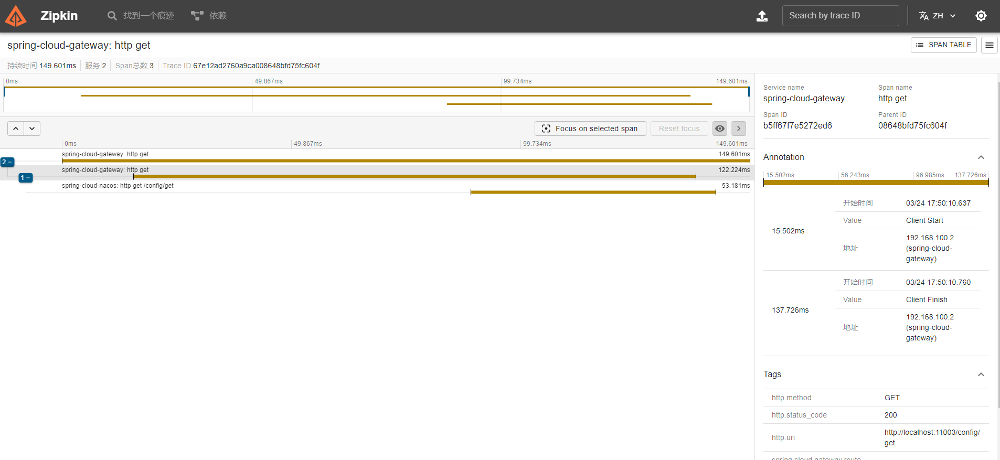

# 分布式链路追踪

使用 **Brave + Zipkin** 进行分布式链路追踪

介绍一下涉及的关键词

**Micrometer** 是一个用于 **度量（Metrics）** 的库，广泛用于在分布式系统中收集和导出应用程序的性能指标。它是 **Spring Boot** 和 **Spring Cloud** 的默认监控库，同时也是支持多种监控后端的通用度量库。它可以帮助开发者追踪应用程序的运行状态，包括 **CPU 使用率**、**内存占用**、**垃圾回收信息**、**HTTP 请求延迟**等关键信息。

**Brave** 是一个专注于 Java 的分布式追踪库，最初由 Twitter 开发，是 **Zipkin** 生态系统的一部分。它用于在分布式环境中生成和收集追踪数据，帮助开发者分析请求在不同服务之间的传播路径。

**Zipkin** 是一个分布式链路追踪系统，最初由 Twitter 开发，并贡献给了开源社区。它专门用于收集、存储和展示分布式系统中的请求链路数据，帮助开发者分析和定位性能瓶颈以及故障原因。在微服务架构中，一次请求通常会经过多个服务或组件，Zipkin 通过在这些服务之间传播 **Trace** 和 **Span**，完整地记录请求的执行路径和耗时情况。

🚀 **Zipkin 的工作原理**

Zipkin 的工作流大致分为四个阶段：

1. **Instrumentation（数据采集）**
    - 使用像 **Brave**（Java）或 **OpenTelemetry** 等库在应用中植入追踪代码，记录请求的 Trace 和 Span 数据。
2. **Transport（数据传输）**
    - 采集的追踪数据通过 HTTP、Kafka 或 RabbitMQ 等方式发送到 Zipkin Server。
3. **Storage（数据存储）**
    - Zipkin 支持多种存储后端，如 **Elasticsearch**、**MySQL**、**Cassandra** 等。
4. **UI 展示和分析**
    - Zipkin 提供了一个 Web UI，可视化展示完整的 Trace 信息，帮助开发者快速定位性能瓶颈。


- [Zipkin部署文档](https://atengk.github.io/ops/#/work/kubernetes/service/zipkin/v3.4.4/)


## 基础配置

### 添加依赖

**添加依赖管理器**

```xml
<!-- 依赖管理 -->
<dependencyManagement>
    <dependencies>
        <dependency>
            <groupId>org.springframework.boot</groupId>
            <artifactId>spring-boot-dependencies</artifactId>
            <version>${spring-boot.version}</version>
            <type>pom</type>
            <scope>import</scope>
        </dependency>
        <dependency>
            <groupId>org.springframework.cloud</groupId>
            <artifactId>spring-cloud-dependencies</artifactId>
            <version>${spring-cloud.version}</version>
            <type>pom</type>
            <scope>import</scope>
        </dependency>
        <dependency>
            <groupId>com.alibaba.cloud</groupId>
            <artifactId>spring-cloud-alibaba-dependencies</artifactId>
            <version>${spring-cloud-alibaba.version}</version>
            <type>pom</type>
            <scope>import</scope>
        </dependency>
        <dependency>
            <groupId>org.apache.dubbo</groupId>
            <artifactId>dubbo-bom</artifactId>
            <version>${dubbo.version}</version>
            <type>pom</type>
            <scope>import</scope>
        </dependency>
    </dependencies>
</dependencyManagement>
```

**添加依赖**

```xml
<dependencies>
    <!-- Micrometer Tracing -->
    <dependency>
        <groupId>io.micrometer</groupId>
        <artifactId>micrometer-tracing</artifactId>
    </dependency>

    <!-- Brave（用于 Zipkin 集成） -->
    <dependency>
        <groupId>io.micrometer</groupId>
        <artifactId>micrometer-tracing-bridge-brave</artifactId>
    </dependency>

    <!-- Zipkin Reporter -->
    <dependency>
        <groupId>io.zipkin.reporter2</groupId>
        <artifactId>zipkin-reporter-brave</artifactId>
    </dependency>

    <!-- Spring Boot Actuator（提供追踪端点） -->
    <dependency>
        <groupId>org.springframework.boot</groupId>
        <artifactId>spring-boot-starter-actuator</artifactId>
    </dependency>
</dependencies>
```

### 编辑配置

```yaml
---
# 分布式追踪配置
management:
  zipkin:
    tracing:
      endpoint: http://192.168.1.10:38646/api/v2/spans
  tracing:
    sampling:
      probability: 1.0
```


## 使用追踪

### 集成网关

调用接口后查看日志的 traceId 和 spanId

查看 zipkin 的链路信息




