# 微服务模块

在 **IntelliJ IDEA** 中创建微服务模块并使用。


## 父模块

### 新建项目

新建项目，选择空项目，最后点击创建

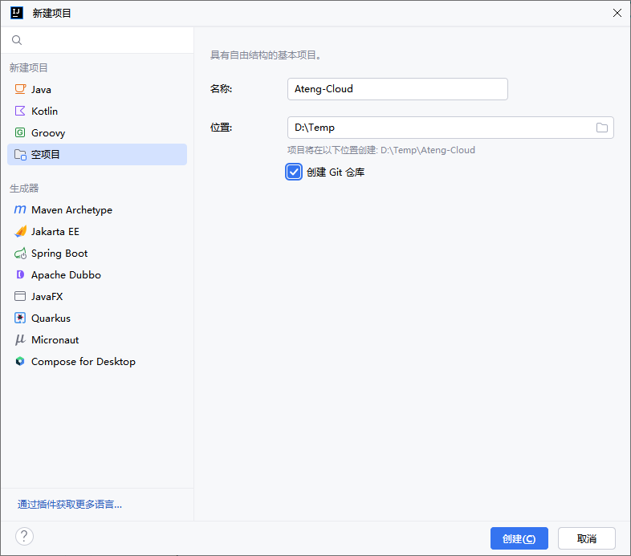

### 创建 `.gitignore`

```
#忽略根目录下的所有文件
*
 
#忽略子目录下的所有文件
/*
 
#包含目录
!*/
 
#指定不忽略的文件
#!*.css
#!*.js
!*.html
!*.gif
!*.ico
!*.jpg
!*.svg
!*.png
!.nojekyll
!.gitignore
!*.md
!*.yaml
!*.yml
!*.sh
!*Dockerfile*
!*Jenkinsfile*
!*.java
!*.xml
!*.config
!*.iml
!*.imports
!*.sql
!banner.txt

#忽略根目录下的文件
/temp/
/logs/
 
#忽略特定文件夹名
tmp/
temp/
temporary/
other/
target/
logs/
.idea/
```

### 创建 `pom.xml`

```xml
<?xml version="1.0" encoding="UTF-8"?>
<project xmlns:xsi="http://www.w3.org/2001/XMLSchema-instance" xmlns="http://maven.apache.org/POM/4.0.0"
         xsi:schemaLocation="http://maven.apache.org/POM/4.0.0 https://maven.apache.org/xsd/maven-4.0.0.xsd">
    <!-- 项目模型版本 -->
    <modelVersion>4.0.0</modelVersion>

    <!-- 项目坐标 -->
    <groupId>io.github.kongyu666</groupId>
    <artifactId>ateng-cloud</artifactId>
    <version>${revision}</version>
    <name>Ateng-Cloud</name>
    <url>https://github.com/kongyu666/Ateng-Cloud</url>
    <description>JDK21 SpringBoot3 SpringCloud Alibaba 微服务架构</description>

    <!-- 打包方式为 POM，表示该项目为聚合项目 -->
    <packaging>pom</packaging>
    <!-- 项目包含的子模块 -->
    <modules>
        <module>ateng-common</module>
        <module>ateng-gateway</module>
    </modules>

    <!-- 项目属性 -->
    <properties>
        <revision>1.0.0</revision>
        <project.build.sourceEncoding>UTF-8</project.build.sourceEncoding>
        <java.version>21</java.version>
        <maven.compiler.source>21</maven.compiler.source>
        <maven.compiler.target>21</maven.compiler.target>
        <maven-compiler.version>3.12.1</maven-compiler.version>
        <spring-boot.version>3.3.9</spring-boot.version>
        <spring-cloud.version>2023.0.5</spring-cloud.version>
        <spring-cloud-alibaba.version>2023.0.3.2</spring-cloud-alibaba.version>
    </properties>

    <!-- 项目环境配置 -->
    <profiles>
        <!-- 开发环境配置 -->
        <profile>
            <id>dev</id>
            <activation>
                <activeByDefault>true</activeByDefault>
            </activation>
            <properties>
                <profiles.active>dev</profiles.active>
                <profiles.desc>开发环境</profiles.desc>
                <logging.level>info</logging.level>
            </properties>
        </profile>

        <!-- 测试环境配置 -->
        <profile>
            <id>test</id>
            <properties>
                <profiles.active>test</profiles.active>
                <profiles.desc>测试环境</profiles.desc>
                <logging.level>info</logging.level>
            </properties>
        </profile>

        <!-- 生产环境配置 -->
        <profile>
            <id>prod</id>
            <properties>
                <profiles.active>prod</profiles.active>
                <profiles.desc>生产环境</profiles.desc>
                <logging.level>warn</logging.level>
            </properties>
        </profile>
    </profiles>

    <!-- 依赖管理 -->
    <dependencyManagement>
        <dependencies>
            <dependency>
                <groupId>org.springframework.cloud</groupId>
                <artifactId>spring-cloud-dependencies</artifactId>
                <version>${spring-cloud.version}</version>
                <type>pom</type>
                <scope>import</scope>
            </dependency>
            <dependency>
                <groupId>org.springframework.boot</groupId>
                <artifactId>spring-boot-dependencies</artifactId>
                <version>${spring-boot.version}</version>
                <type>pom</type>
                <scope>import</scope>
            </dependency>
            <dependency>
                <groupId>com.alibaba.cloud</groupId>
                <artifactId>spring-cloud-alibaba-dependencies</artifactId>
                <version>${spring-cloud-alibaba.version}</version>
                <type>pom</type>
                <scope>import</scope>
            </dependency>
        </dependencies>
    </dependencyManagement>

    <!-- 插件仓库配置 -->
    <repositories>
        <!-- Central Repository -->
        <repository>
            <id>central</id>
            <name>阿里云中央仓库</name>
            <url>https://maven.aliyun.com/repository/central</url>
            <!--<name>Maven官方中央仓库</name>
            <url>https://repo.maven.apache.org/maven2/</url>-->
        </repository>
    </repositories>

    <!-- 构建配置 -->
    <build>
        <finalName>${project.name}-${project.version}</finalName>
        <plugins>
            <!-- Maven 编译插件 -->
            <plugin>
                <groupId>org.apache.maven.plugins</groupId>
                <artifactId>maven-compiler-plugin</artifactId>
                <version>${maven-compiler.version}</version>
                <configuration>
                    <source>${java.version}</source>
                    <target>${java.version}</target>
                    <encoding>${project.build.sourceEncoding}</encoding>
                    <!-- 编译参数 -->
                    <compilerArgs>
                        <!-- 启用Java 8参数名称保留功能 -->
                        <arg>-parameters</arg>
                    </compilerArgs>
                </configuration>
            </plugin>
        </plugins>
        <resources>
            <!-- 第一个资源配置块 -->
            <resource>
                <directory>src/main/resources</directory>
                <filtering>false</filtering>
            </resource>
            <!-- 第二个资源配置块 -->
            <resource>
                <directory>src/main/resources</directory>
                <includes>
                    <include>application*</include>
                    <include>bootstrap*.yml</include>
                    <include>common*</include>
                    <include>banner*</include>
                </includes>
                <filtering>true</filtering>
            </resource>
        </resources>
    </build>

</project>
```

### 添加为 Maven 项目

在 `pom.xml` 文件中，右键点击 `添加为 Maven 项目` 

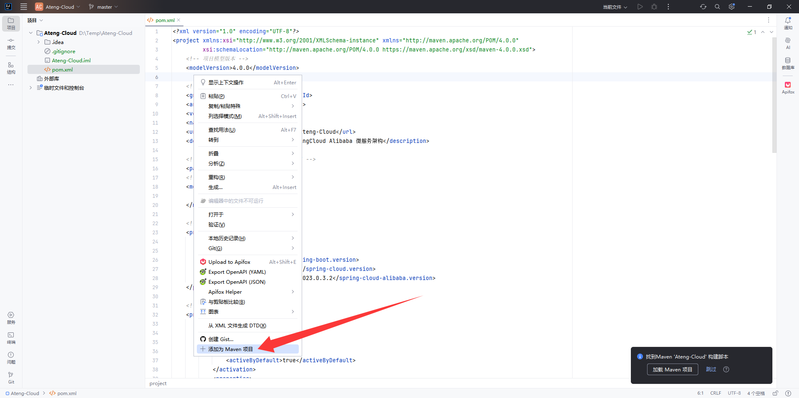

最终父模块创建完成后如下图所示

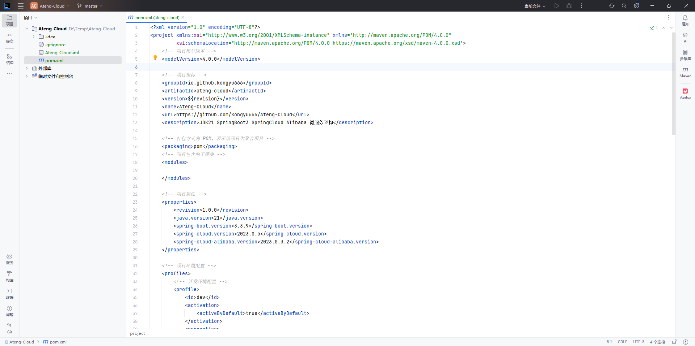


## 公共父模块

### 创建目录

创建 **公共父模块** 目录


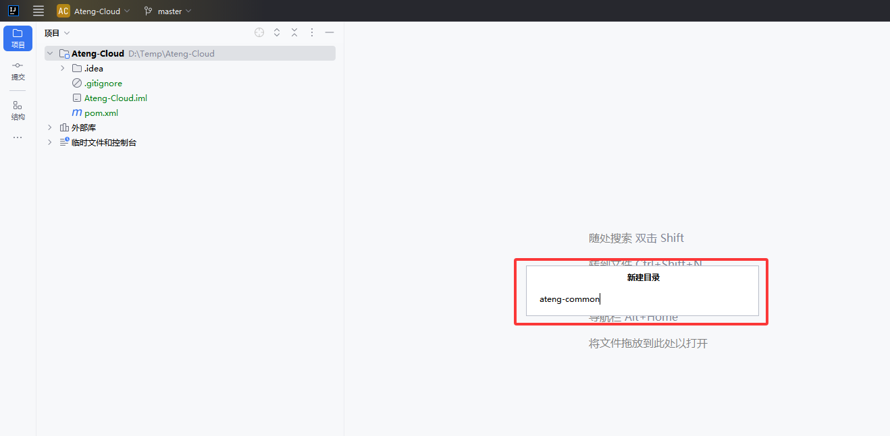

### 创建 `pom.xml`

```xml
<?xml version="1.0" encoding="UTF-8"?>
<project xmlns:xsi="http://www.w3.org/2001/XMLSchema-instance" xmlns="http://maven.apache.org/POM/4.0.0"
         xsi:schemaLocation="http://maven.apache.org/POM/4.0.0 https://maven.apache.org/xsd/maven-4.0.0.xsd">
    <!-- 项目模型版本 -->
    <modelVersion>4.0.0</modelVersion>

    <!-- 父模块 -->
    <parent>
        <groupId>io.github.kongyu666</groupId>
        <artifactId>ateng-cloud</artifactId>
        <version>${revision}</version>
    </parent>

    <!-- 项目坐标 -->
    <artifactId>ateng-common</artifactId>
    <description>
        ateng-common 通用模块
    </description>

    <!-- 打包方式为 POM，表示该项目为聚合项目 -->
    <packaging>pom</packaging>
    <!-- 项目包含的子模块 -->
    <modules>
        
    </modules>

</project>
```

### 添加模块

在父模块中添加公共父模块，然后点击再重新加载项目

```xml
<modules>
    <module>ateng-common</module>
</modules>
```

最终公共父模块创建完成后如下图所示

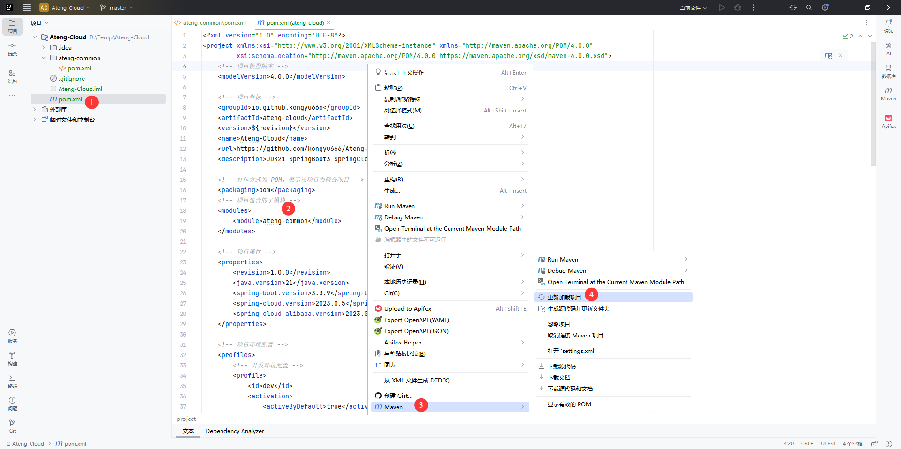


## 公共子模块

### Nacos模块

#### 创建模块

在 **公共父模块** 中创建 Nacos 模块

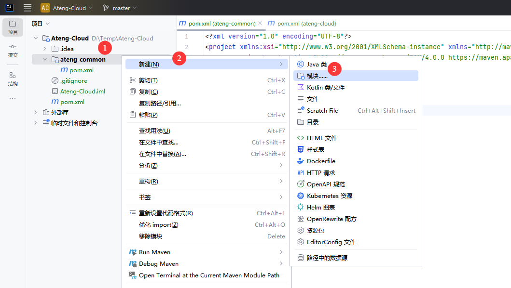

选择 `Java`，输入公共子模块名称


#### 修改 pom.xml

```xml
<?xml version="1.0" encoding="UTF-8"?>
<project xmlns:xsi="http://www.w3.org/2001/XMLSchema-instance" xmlns="http://maven.apache.org/POM/4.0.0"
         xsi:schemaLocation="http://maven.apache.org/POM/4.0.0 https://maven.apache.org/xsd/maven-4.0.0.xsd">
    <!-- 项目模型版本 -->
    <modelVersion>4.0.0</modelVersion>

    <!-- 父模块 -->
    <parent>
        <groupId>io.github.kongyu666</groupId>
        <artifactId>ateng-common</artifactId>
        <version>${revision}</version>
    </parent>

    <!-- 项目坐标 -->
    <artifactId>ateng-common-nacos</artifactId>
    <description>
        ateng-common-nacos 公共模块-Nacos模块，服务发现、配置管理
    </description>

    <!-- 服务依赖 -->
    <dependencies>

        <!-- Nacos 服务发现的依赖 -->
        <dependency>
            <groupId>com.alibaba.cloud</groupId>
            <artifactId>spring-cloud-starter-alibaba-nacos-discovery</artifactId>
        </dependency>

        <!-- Nacos 配置管理的依赖 -->
        <dependency>
            <groupId>com.alibaba.cloud</groupId>
            <artifactId>spring-cloud-starter-alibaba-nacos-config</artifactId>
        </dependency>

    </dependencies>

</project>
```

#### 添加模块

在公共父模块中添加公共子模块Nacos，然后点击再重新加载项目

```xml
<modules>
    <module>ateng-common-nacos</module>
</modules>
```

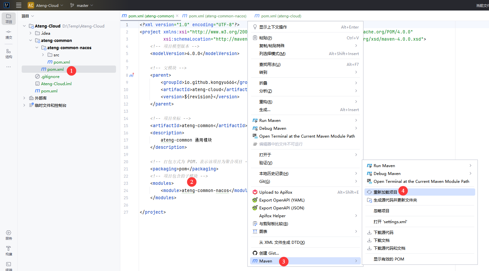

最终公共子模块创建完成后如下图所示

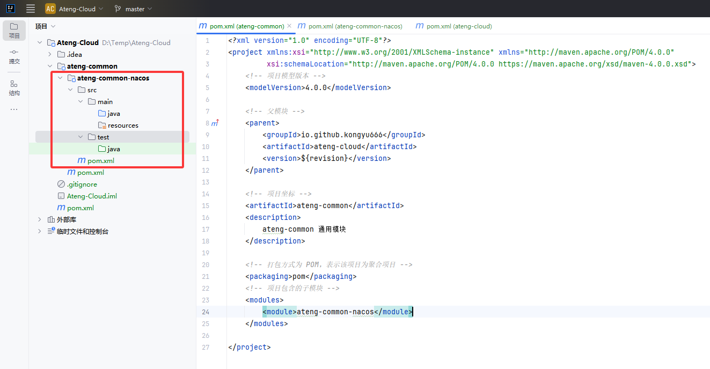


## 网关模块

### 创建模块

在 **父模块** 中创建 网关 模块

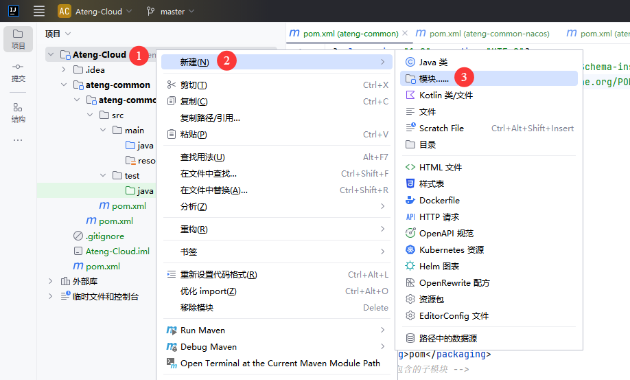

选择 `Java`，输入模块名称

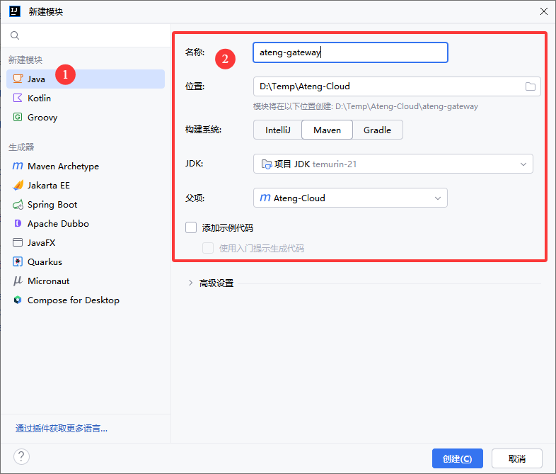

### 修改 pom.xml

```xml
<?xml version="1.0" encoding="UTF-8"?>
<project xmlns:xsi="http://www.w3.org/2001/XMLSchema-instance" xmlns="http://maven.apache.org/POM/4.0.0"
         xsi:schemaLocation="http://maven.apache.org/POM/4.0.0 https://maven.apache.org/xsd/maven-4.0.0.xsd">
    <!-- 项目模型版本 -->
    <modelVersion>4.0.0</modelVersion>

    <!-- 父模块 -->
    <parent>
        <groupId>io.github.kongyu666</groupId>
        <artifactId>ateng-cloud</artifactId>
        <version>${revision}</version>
    </parent>

    <!-- 项目坐标 -->
    <artifactId>ateng-gateway</artifactId>
    <description>
        ateng-gateway 网关模块
    </description>

    <!-- 服务依赖 -->
    <dependencies>

        <!-- Spring Cloud Gateway 启动器依赖，用于构建API网关 -->
        <dependency>
            <groupId>org.springframework.cloud</groupId>
            <artifactId>spring-cloud-starter-gateway</artifactId>
        </dependency>

        <!-- Spring Cloud 负载均衡启动器依赖，用于客户端负载均衡 -->
        <dependency>
            <groupId>org.springframework.cloud</groupId>
            <artifactId>spring-cloud-starter-loadbalancer</artifactId>
        </dependency>

        <!-- ateng-common-nacos 公共模块-Nacos模块，服务发现、配置管理 -->
        <dependency>
            <groupId>io.github.kongyu666</groupId>
            <artifactId>ateng-common-nacos</artifactId>
            <version>${revision}</version>
        </dependency>

    </dependencies>

    <!-- 构建配置 -->
    <build>
        <plugins>
            <!-- Spring Boot Maven 插件 -->
            <plugin>
                <groupId>org.springframework.boot</groupId>
                <artifactId>spring-boot-maven-plugin</artifactId>
                <version>${spring-boot.version}</version>
                <executions>
                    <execution>
                        <id>repackage</id>
                        <goals>
                            <goal>repackage</goal>
                        </goals>
                    </execution>
                </executions>
            </plugin>
        </plugins>
    </build>

</project>
```

### 添加模块

在父模块中添加子模块，然后点击再重新加载项目

```xml
<modules>
    <module>ateng-gateway</module>
</modules>
```

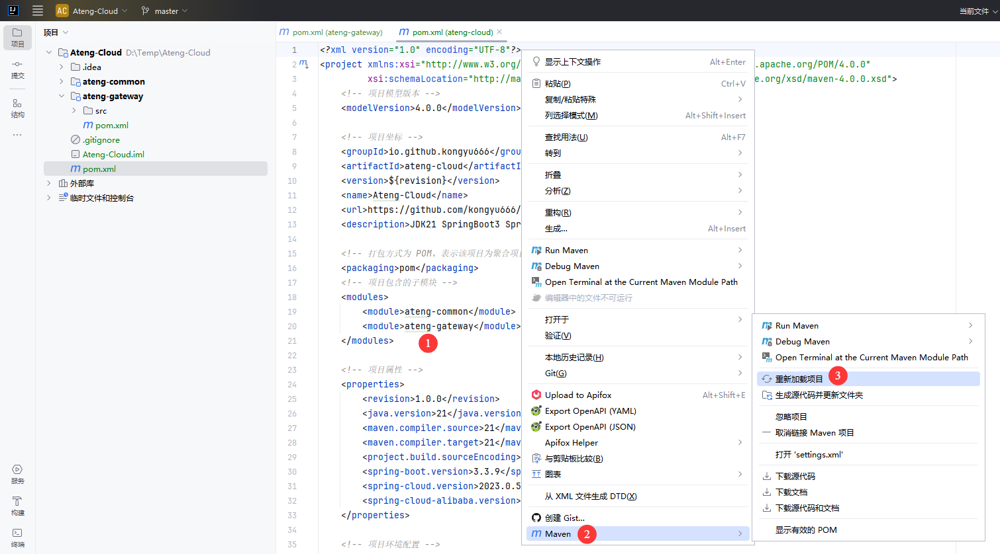

### 创建Application

**新建 Java 类，创建 Application**


**输入包名和类名**

```
io.github.kongyu666.gateway.GatewayApplication
```

**修改application**

```java
package io.github.kongyu666.gateway;

import org.springframework.boot.SpringApplication;
import org.springframework.boot.autoconfigure.SpringBootApplication;
import org.springframework.cloud.client.discovery.EnableDiscoveryClient;

@SpringBootApplication
@EnableDiscoveryClient // 启动Nacos服务发现
public class GatewayApplication {

    public static void main(String[] args) {
        SpringApplication.run(GatewayApplication.class, args);
    }

}
```

### 创建配置

**新建 配置文件**

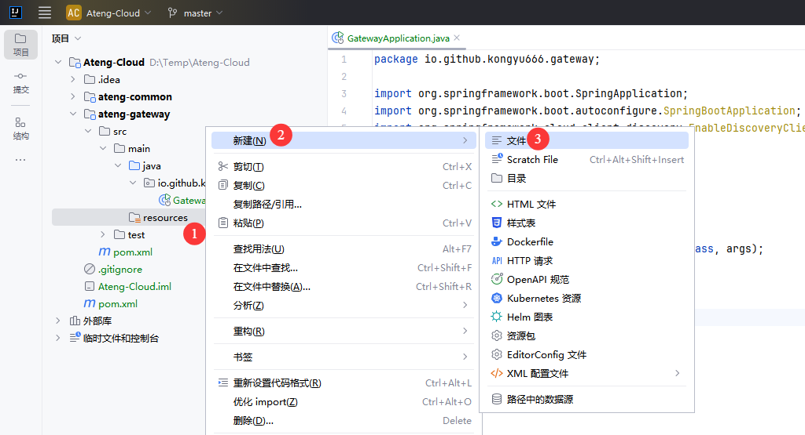

**创建 application.yml**

```yaml
server:
  port: 16801
  servlet:
    context-path: /
spring:
  main:
    web-application-type: reactive
  application:
    name: ${project.artifactId}
---
# 环境配置
spring:
  profiles:
    active: @profiles.active@
    desc: @profiles.desc@
```

**创建 application-dev.yml**

```yaml
# nacos 配置
spring:
  cloud:
    nacos:
      # nacos:8848 服务地址
      server-addr: 192.168.1.10:30648
      username: nacos
      password: Admin@123
      discovery:
        # 注册组
        group: ${spring.profiles.active}
        namespace: a8126e6d-5758-4f5b-b892-2522a250074c
      config:
        # 配置组
        group: ${spring.profiles.active}
        namespace: a8126e6d-5758-4f5b-b892-2522a250074c
  config:
    import: # 引入配置nacos中的配置application-common.yml
      - optional:nacos:application-common.yml
      - optional:nacos:${spring.application.name}.yml
```

**创建 banner.txt**

```

         █████╗ ████████╗███████╗███╗   ██╗ ██████╗
        ██╔══██╗╚══██╔══╝██╔════╝████╗  ██║██╔════╝
        ███████║   ██║   █████╗  ██╔██╗ ██║██║  ███╗
        ██╔══██║   ██║   ██╔══╝  ██║╚██╗██║██║   ██║
        ██║  ██║   ██║   ███████╗██║ ╚████║╚██████╔╝
        ╚═╝  ╚═╝   ╚═╝   ╚══════╝╚═╝  ╚═══╝ ╚═════╝

${AnsiColor.CYAN}        Application Name:${AnsiColor.BLACK} ${AnsiColor.BRIGHT_GREEN}${spring.application.name:Ateng} ${AnsiColor.BLACK}
${AnsiColor.CYAN}        SpringBoot Version:${AnsiColor.BLACK} ${AnsiColor.BRIGHT_GREEN}${spring-boot.version} ${AnsiColor.BLACK}
${AnsiColor.CYAN}        Profiles Active:${AnsiColor.BLACK} ${AnsiColor.BRIGHT_GREEN}${spring.profiles.active:-} ${AnsiColor.BLACK}
${AnsiColor.CYAN}        Profiles Describe:${AnsiColor.BLACK} ${AnsiColor.BRIGHT_GREEN}${spring.profiles.desc:-} ${AnsiColor.BLACK}
```

### 启动应用

**启动应用程序**

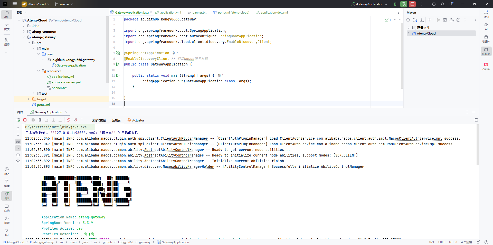

**在Nacos中查看应用**

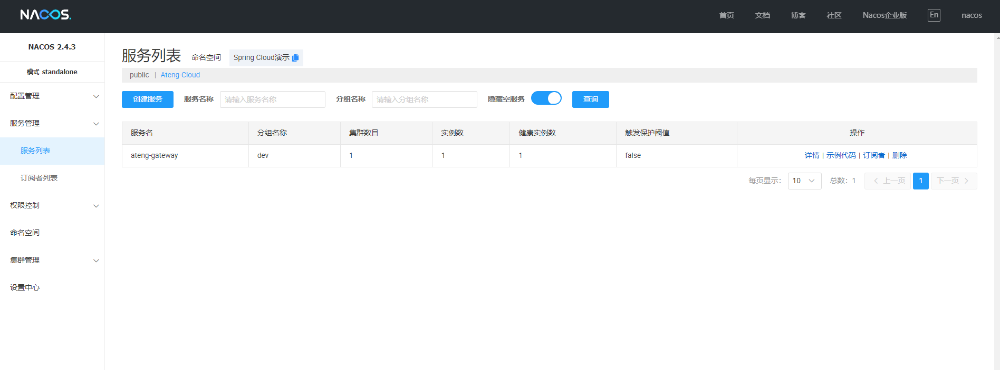


## 业务父模块

### 创建目录

创建 **业务父模块** 目录

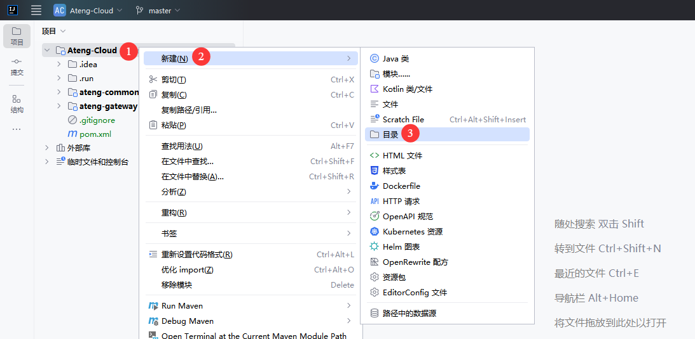

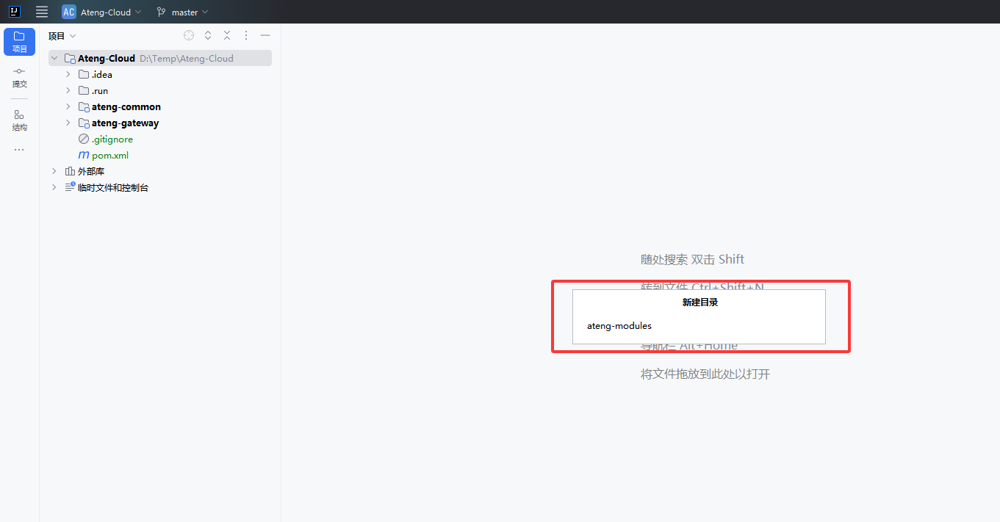

### 创建 `pom.xml`

```xml
<?xml version="1.0" encoding="UTF-8"?>
<project xmlns:xsi="http://www.w3.org/2001/XMLSchema-instance" xmlns="http://maven.apache.org/POM/4.0.0"
         xsi:schemaLocation="http://maven.apache.org/POM/4.0.0 https://maven.apache.org/xsd/maven-4.0.0.xsd">
    <!-- 项目模型版本 -->
    <modelVersion>4.0.0</modelVersion>

    <!-- 父模块 -->
    <parent>
        <groupId>io.github.kongyu666</groupId>
        <artifactId>ateng-cloud</artifactId>
        <version>${revision}</version>
    </parent>

    <!-- 项目坐标 -->
    <artifactId>ateng-modules</artifactId>
    <description>
        ateng-modules 业务模块，业务系统
    </description>

    <!-- 打包方式为 POM，表示该项目为聚合项目 -->
    <packaging>pom</packaging>
    <!-- 项目包含的子模块 -->
    <modules>
        
    </modules>

</project>
```

### 添加模块

在父模块中添加业务父模块，然后点击再重新加载项目

```xml
<modules>
    <module>ateng-modules</module>
</modules>
```

最终业务父模块创建完成后如下图所示


## 业务子模块

### System模块

#### 创建模块

在 **业务父模块** 中创建 system系统 模块

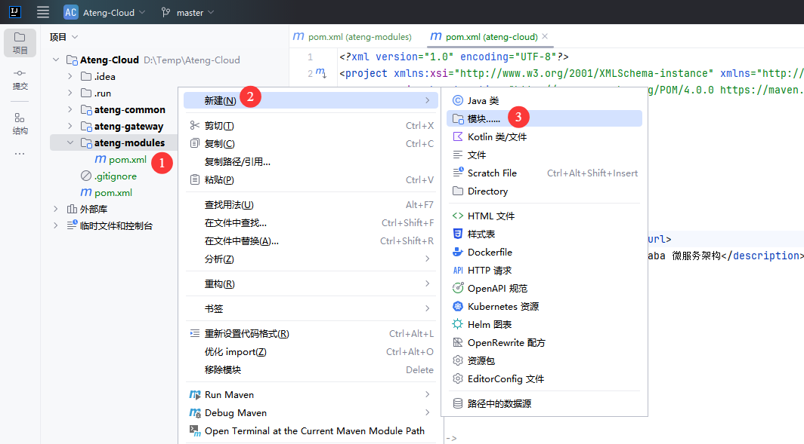

选择 `Java`，输入子模块名称

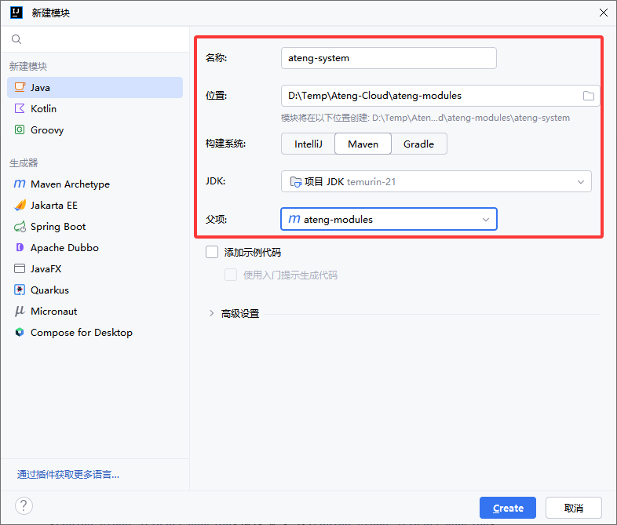

#### 修改 pom.xml

```xml
<?xml version="1.0" encoding="UTF-8"?>
<project xmlns:xsi="http://www.w3.org/2001/XMLSchema-instance" xmlns="http://maven.apache.org/POM/4.0.0"
         xsi:schemaLocation="http://maven.apache.org/POM/4.0.0 https://maven.apache.org/xsd/maven-4.0.0.xsd">
    <!-- 项目模型版本 -->
    <modelVersion>4.0.0</modelVersion>

    <!-- 父模块 -->
    <parent>
        <groupId>io.github.kongyu666</groupId>
        <artifactId>ateng-modules</artifactId>
        <version>${revision}</version>
    </parent>

    <!-- 项目坐标 -->
    <artifactId>ateng-system</artifactId>
    <description>
        ateng-system 系统模块
    </description>

    <!-- 服务依赖 -->
    <dependencies>

        <!-- Spring Boot Web Starter: 包含用于构建Web应用程序的Spring Boot依赖项 -->
        <dependency>
            <groupId>org.springframework.boot</groupId>
            <artifactId>spring-boot-starter-web</artifactId>
        </dependency>

        <!-- Spring Boot Starter Test: 包含用于测试Spring Boot应用程序的依赖项 -->
        <dependency>
            <groupId>org.springframework.boot</groupId>
            <artifactId>spring-boot-starter-test</artifactId>
            <scope>test</scope>
        </dependency>

        <!-- ateng-common-nacos 公共模块-Nacos模块，服务发现、配置管理 -->
        <dependency>
            <groupId>io.github.kongyu666</groupId>
            <artifactId>ateng-common-nacos</artifactId>
            <version>${revision}</version>
        </dependency>

    </dependencies>

    <!-- 构建配置 -->
    <build>
        <plugins>
            <!-- Spring Boot Maven 插件 -->
            <plugin>
                <groupId>org.springframework.boot</groupId>
                <artifactId>spring-boot-maven-plugin</artifactId>
                <version>${spring-boot.version}</version>
                <executions>
                    <execution>
                        <id>repackage</id>
                        <goals>
                            <goal>repackage</goal>
                        </goals>
                    </execution>
                </executions>
            </plugin>
        </plugins>
    </build>

</project>
```

#### 添加模块

在业务父模块中添加业务子模块，然后点击再重新加载项目

```xml
<modules>
    <module>ateng-system</module>
</modules>
```

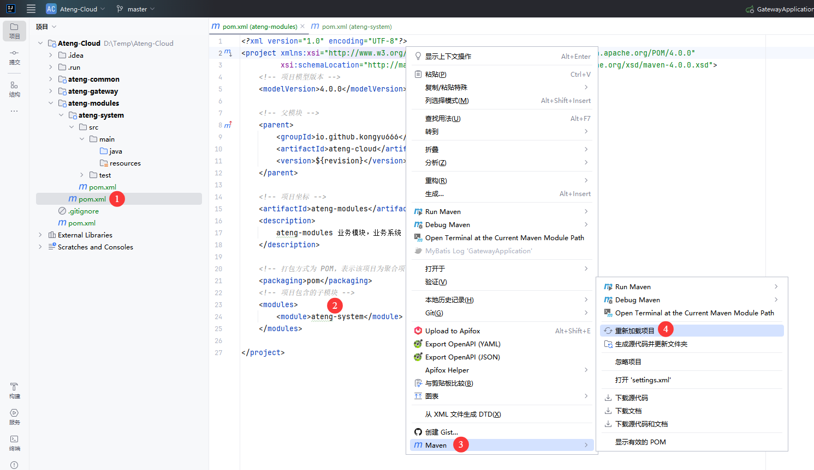

#### 创建Application

**新建 Java 类，创建 Application**


**输入包名和类名**

```
io.github.kongyu666.system.SystemApplication
```

**修改application**

```java
package io.github.kongyu666.system;

import org.springframework.boot.SpringApplication;
import org.springframework.boot.autoconfigure.SpringBootApplication;
import org.springframework.cloud.client.discovery.EnableDiscoveryClient;

@SpringBootApplication
@EnableDiscoveryClient // 启动Nacos服务发现
public class SystemApplication {
    
    public static void main(String[] args) {
        SpringApplication.run(SystemApplication.class, args);
    }

}
```

#### 创建配置

**新建 配置文件**

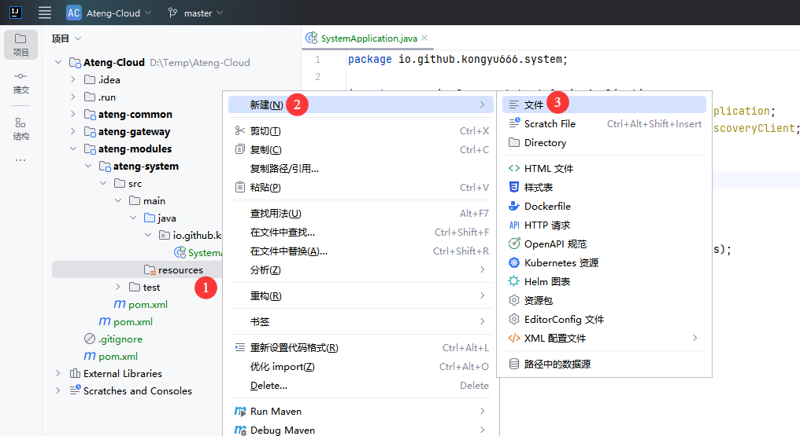

**创建 application.yml**

```yaml
server:
  port: 16811
  servlet:
    context-path: /
spring:
  main:
    web-application-type: servlet
  application:
    name: ${project.artifactId}
---
# 环境配置
spring:
  profiles:
    active: @profiles.active@
    desc: @profiles.desc@
```

**创建 application-dev.yml**

```yaml
# nacos 配置
spring:
  cloud:
    nacos:
      # nacos:8848 服务地址
      server-addr: 192.168.1.10:30648
      username: nacos
      password: Admin@123
      discovery:
        # 注册组
        group: ${spring.profiles.active}
        namespace: a8126e6d-5758-4f5b-b892-2522a250074c
      config:
        # 配置组
        group: ${spring.profiles.active}
        namespace: a8126e6d-5758-4f5b-b892-2522a250074c
  config:
    import: # 引入配置nacos中的配置application-common.yml
      - optional:nacos:application-common.yml
      - optional:nacos:${spring.application.name}.yml
```

**创建 banner.txt**

```
         █████╗ ████████╗███████╗███╗   ██╗ ██████╗
        ██╔══██╗╚══██╔══╝██╔════╝████╗  ██║██╔════╝
        ███████║   ██║   █████╗  ██╔██╗ ██║██║  ███╗
        ██╔══██║   ██║   ██╔══╝  ██║╚██╗██║██║   ██║
        ██║  ██║   ██║   ███████╗██║ ╚████║╚██████╔╝
        ╚═╝  ╚═╝   ╚═╝   ╚══════╝╚═╝  ╚═══╝ ╚═════╝

${AnsiColor.CYAN}        Application Name:${AnsiColor.BLACK} ${AnsiColor.BRIGHT_GREEN}${spring.application.name:Ateng} ${AnsiColor.BLACK}
${AnsiColor.CYAN}        SpringBoot Version:${AnsiColor.BLACK} ${AnsiColor.BRIGHT_GREEN}${spring-boot.version} ${AnsiColor.BLACK}
${AnsiColor.CYAN}        Profiles Active:${AnsiColor.BLACK} ${AnsiColor.BRIGHT_GREEN}${spring.profiles.active:-} ${AnsiColor.BLACK}
${AnsiColor.CYAN}        Profiles Describe:${AnsiColor.BLACK} ${AnsiColor.BRIGHT_GREEN}${spring.profiles.desc:-} ${AnsiColor.BLACK}
```

#### 启动应用

**启动应用程序**

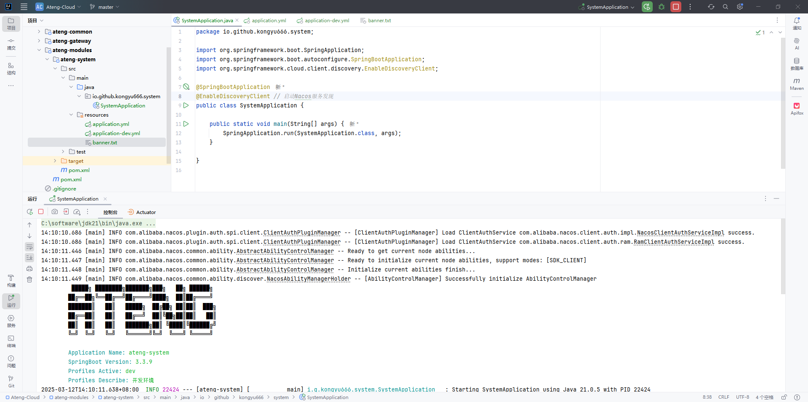

**在Nacos中查看应用**


## 项目打包

### 全局打包

在 父模块 中可以直接对所有子模块全部进行打包操作

1. 点击 Maven 的 `生命周期` 的 `clean`
2. 点击 Maven 的 `生命周期` 的 `package`

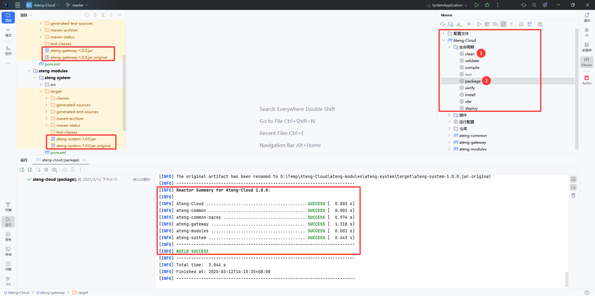

### 局部打包

在某些场景下，不需要全部模块都打包，而是指定一个子模块，例如这里只打包 网关模块 

#### 添加配置

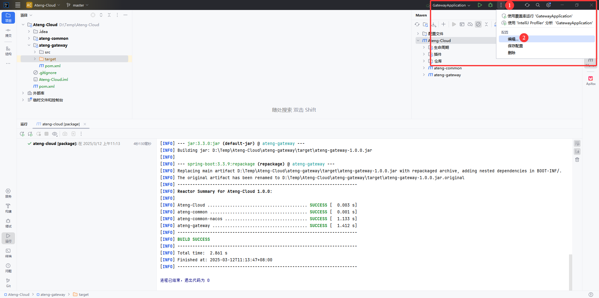

#### 添加 Maven

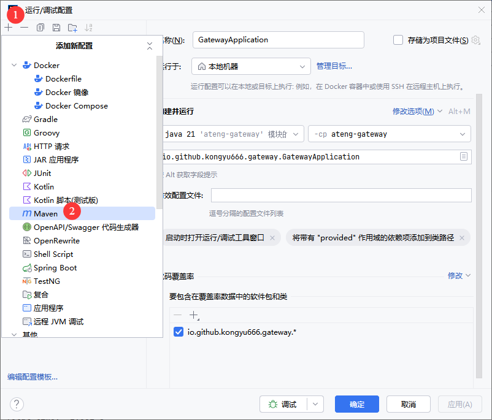

#### 设置 clean

子模块使用以下运行命令

```
clean -pl ateng-gateway -f pom.xml
```

子模块的子模块（例如ateng-system模块）下使用以下运行命令

```
clean -pl ateng-modules/ateng-system -f pom.xml
```

- `-pl ModulesName`: 指定的模块。

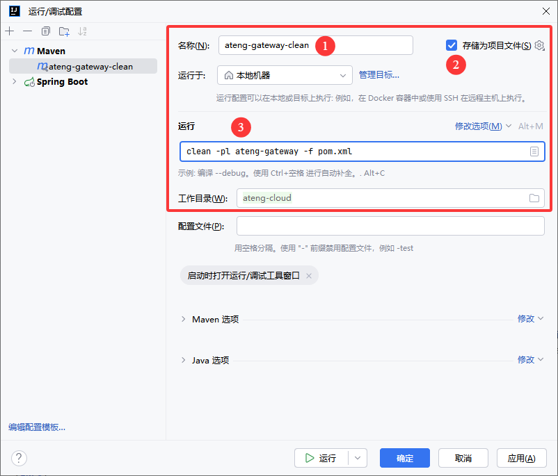

#### 设置 package

子模块使用以下运行命令

```
clean package -Ptest -DskipTests -pl ateng-gateway -am -f pom.xml
```

子模块的子模块（例如ateng-system模块）下使用以下运行命令

```
clean package -Ptest -DskipTests -pl ateng-modules/ateng-system -am -f pom.xml
```

- `-Ptest`: 激活 `test` Maven profile。
- `-pl ModulesName`: 指定构建的模块。
- `-am`: 同时构建该模块的所有依赖模块。

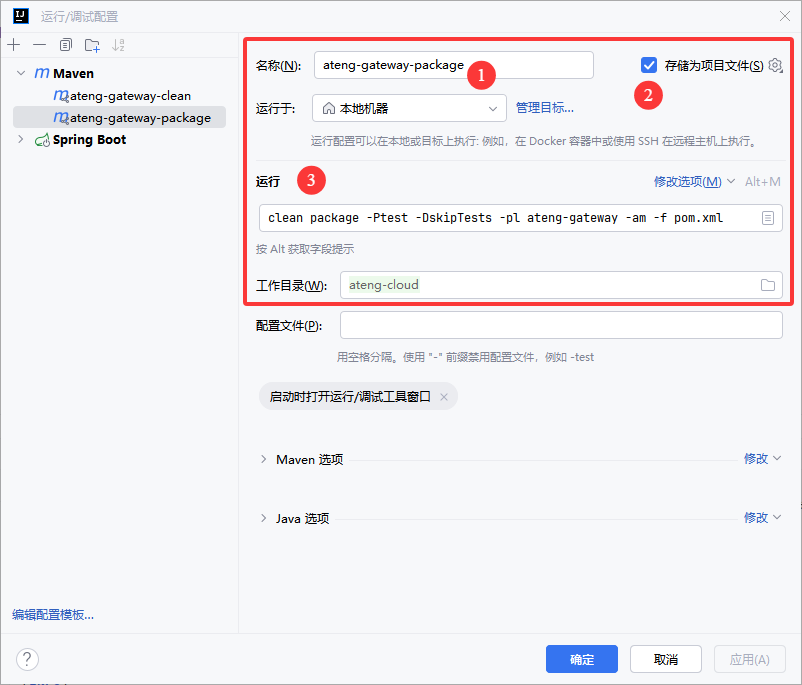

#### 查看配置

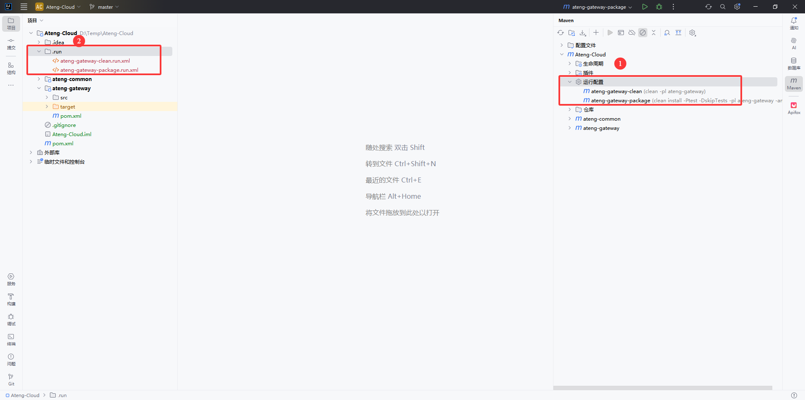

#### 打包模块

按照一下流程进行打包

1. 先使用 `ateng-gateway-clean` 清空 `target` 目录（也可以直接进行打包操作，因为打包操作里面配置了clean。这个clean是用于切换运行环境的场景下需要使用）
2. 确保存在 `application-test.yml` 配置文件，打包的时候是使用 `test` 环境配置，不然无法找到Nacos的配置会报错
3. 再使用 `ateng-gateway-package` 打包
4. 运行 Jar 文件测试

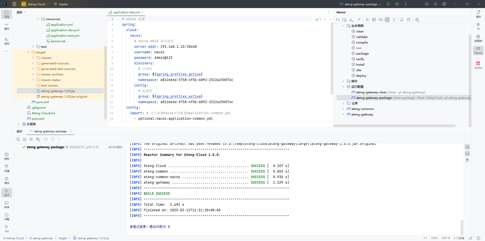

运行测试

```
PS D:\Temp\Ateng-Cloud> java -jar .\ateng-gateway\target\ateng-gateway-1.0.0.jar
```

