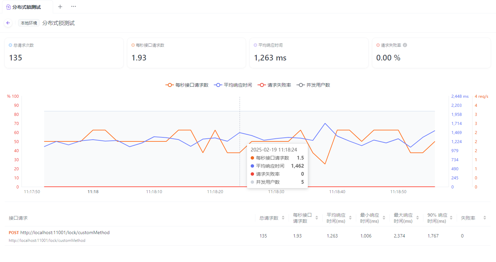
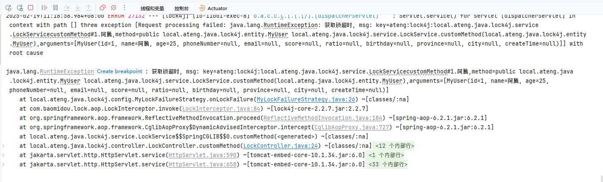

# Lock4j

基于Spring AOP 的声明式和编程式分布式锁，支持RedisTemplate、Redisson、Zookeeper

- [官网地址](https://github.com/baomidou/lock4j)


## 基础配置

### RedisTemplate

#### 添加依赖

```xml
<!-- Lock4j 依赖，redisTemplate作为分布式锁底层 -->
<dependency>
    <groupId>com.baomidou</groupId>
    <artifactId>lock4j-redis-template-spring-boot-starter</artifactId>
    <version>2.2.7</version>
</dependency>

<!-- Spring Boot Redis 数据库集成，支持多种 Redis 数据结构和操作 -->
<dependency>
    <groupId>org.springframework.boot</groupId>
    <artifactId>spring-boot-starter-data-redis</artifactId>
</dependency>
<!-- Lettuce 客户端连接池实现，基于 Apache Commons Pool2 -->
<dependency>
    <groupId>org.apache.commons</groupId>
    <artifactId>commons-pool2</artifactId>
</dependency>
```

#### 添加配置文件

```yaml
---
# Redis的相关配置
spring:
  data:
    redis:
      host: 192.168.1.10 # Redis服务器地址
      database: 102 # Redis数据库索引（默认为0）
      port: 42784 # Redis服务器连接端口
      password: Admin@123 # Redis服务器连接密码（默认为空）
      client-type: lettuce  # 默认使用Lettuce作为Redis客户端
      lettuce:
        pool:
          max-active: 100 # 连接池最大连接数（使用负值表示没有限制）
          max-wait: -1s # 连接池最大阻塞等待时间（使用负值表示没有限制）
          max-idle: 100 # 连接池中的最大空闲连接
          min-idle: 0 # 连接池最小空闲连接数
          time-between-eviction-runs: 1s # 空闲对象逐出器线程的运行间隔时间.空闲连接线程释放周期时间
      timeout: 5000ms # 连接超时时间（毫秒）
---
# lock4j 配置
lock4j:
  acquire-timeout: 3000 #默认值3s，可不设置
  expire: 30000 #默认值30s，可不设置
  lock-key-prefix: "ateng:lock4j" #锁key前缀, 默认值lock4j，可不设置
```

### Redisson

#### 添加依赖

```xml
<!-- Lock4j 依赖，redisson作为分布式锁底层 -->
<dependency>
    <groupId>com.baomidou</groupId>
    <artifactId>lock4j-redisson-spring-boot-starter</artifactId>
    <version>2.2.7</version>
</dependency>

<!-- Redisson 依赖 -->
<dependency>
    <groupId>org.redisson</groupId>
    <artifactId>redisson-spring-boot-starter</artifactId>
    <version>3.44.0</version>
</dependency>
```

#### 添加配置文件

```yaml
---
# Redisson 的相关配置
redisson:
  config: |
    singleServerConfig:
      address: redis://192.168.1.10:42784
      password: Admin@123
      database: 41
      clientName: redisson-client
      connectionPoolSize: 64      # 最大连接数
      connectionMinimumIdleSize: 24 # 最小空闲连接
      idleConnectionTimeout: 10000 # 空闲连接超时时间（ms）
      connectTimeout: 5000        # 连接超时时间
      timeout: 3000               # 命令等待超时
      retryAttempts: 3            # 命令重试次数
      retryInterval: 1500         # 命令重试间隔（ms）
    threads: 16                   # 处理Redis事件的线程数
    nettyThreads: 32              # Netty线程数
    codec: !<org.redisson.codec.JsonJacksonCodec> {} # 推荐JSON序列化
---
# lock4j 配置
lock4j:
  acquire-timeout: 3000 #默认值3s，可不设置
  expire: 30000 #默认值30s，可不设置
  lock-key-prefix: "ateng:lock4j" #锁key前缀, 默认值lock4j，可不设置
```

#### 创建配置属性

```java
package local.ateng.java.lock4j.config;

import lombok.Data;
import org.springframework.boot.context.properties.ConfigurationProperties;
import org.springframework.context.annotation.Configuration;

@ConfigurationProperties(prefix = "redisson")
@Configuration
@Data
public class RedissonProperties {
    private String config;
}
```

#### 创建客户端Bean

```java
package local.ateng.java.lock4j.config;

import lombok.RequiredArgsConstructor;
import org.redisson.Redisson;
import org.redisson.api.RedissonClient;
import org.redisson.config.Config;
import org.springframework.beans.factory.annotation.Autowired;
import org.springframework.context.annotation.Bean;
import org.springframework.context.annotation.Configuration;

import java.io.IOException;

@Configuration
@RequiredArgsConstructor(onConstructor = @__(@Autowired))
public class RedissonConfig {
    private final RedissonProperties redissonProperties;

    @Bean
    public RedissonClient redissonClient() throws IOException {
        Config config = Config.fromYAML(redissonProperties.getConfig());
        return Redisson.create(config);
    }

}
```

### Zookeeper

#### 添加依赖

```xml
<!-- Lock4j 依赖，zookeeper作为分布式锁底层 -->
<dependency>
    <groupId>com.baomidou</groupId>
    <artifactId>lock4j-zookeeper-spring-boot-starter</artifactId>
    <version>2.2.7</version>
</dependency>

<!-- Zookeeper 依赖 -->
<dependency>
    <groupId>org.apache.curator</groupId>
    <artifactId>curator-recipes</artifactId>
    <version>5.7.1</version>
</dependency>
```

#### 添加配置文件

```yaml
---
# Zookeeper 配置
spring:
  coordinate:
    zookeeper:
      # Zookeeper 服务的连接地址（Zookeeper 服务器的 IP 地址和端口）
      zkServers: 192.168.1.10:24287
      # 会话超时时间，单位为毫秒（如果客户端与 Zookeeper 之间的连接超过此时间未响应，则认为连接已超时）
      sessionTimeout: 30000
      # 连接超时时间，单位为毫秒（客户端与 Zookeeper 服务器建立连接时的最大等待时间）
      connectionTimeout: 30000
      # 客户端与 Zookeeper 服务器的最大重试次数
      maxRetries: 3
      # 客户端连接 Zookeeper 时的初始等待时间，单位为毫秒（如果连接失败，客户端会按此时间间隔重试，逐渐加长重试时间）
      baseSleepTimeMs: 30000
---
# lock4j 配置
lock4j:
  acquire-timeout: 3000 #默认值3s，可不设置
  expire: 30000 #默认值30s，可不设置
  lock-key-prefix: "ateng:lock4j" #锁key前缀, 默认值lock4j，可不设置
```


## 使用分布式锁

### 自定义锁获取失败策略

```java
package local.ateng.java.lock4j.config;


import com.baomidou.lock.LockFailureStrategy;
import lombok.extern.slf4j.Slf4j;
import org.springframework.stereotype.Component;

import java.lang.reflect.Method;
import java.util.Arrays;

/**
 * 自定义锁获取失败策略
 *
 * @author 孔余
 * @email 2385569970@qq.com
 * @since 2025-02-19
 */
@Component
@Slf4j
public class MyLockFailureStrategy implements LockFailureStrategy {

    @Override
    public void onLockFailure(String key, Method method, Object[] arguments) {
        String msg = String.format("获取锁超时, msg: key=%s,method=%s,arguments=%s", key, method, Arrays.toString(arguments));
        log.error(msg);
        throw new RuntimeException(msg);
    }
}
```

### 使用方法注解

#### 创建service

```java
package local.ateng.java.lock4j.service;

import com.baomidou.lock.annotation.Lock4j;
import local.ateng.java.lock4j.entity.MyUser;
import lombok.extern.slf4j.Slf4j;
import org.springframework.stereotype.Service;

@Service
@Slf4j
public class LockService {

    @Lock4j
    public void simple() {
        try {
            log.info("Task is being processed...");

            // 这里模拟任务的执行，假设我们有一些需要在分布式环境下确保单一实例执行的操作
            Thread.sleep(5000);  // 模拟耗时操作

            log.info("Task finished.");
        } catch (InterruptedException e) {
            throw new RuntimeException(e);
        }
    }

    // 完全配置，支持spel
    @Lock4j(keys = {"#myUser.id", "#myUser.name"}, expire = 60000, acquireTimeout = 1000)
    public MyUser customMethod(MyUser myUser) {
        try {
            Thread.sleep(1000);  // 模拟耗时操作
        } catch (InterruptedException e) {
            throw new RuntimeException(e);
        }
        return myUser;
    }

}
```

#### 创建接口

```java
package local.ateng.java.lock4j.controller;

import local.ateng.java.lock4j.entity.MyUser;
import local.ateng.java.lock4j.service.LockService;
import lombok.RequiredArgsConstructor;
import org.springframework.beans.factory.annotation.Autowired;
import org.springframework.web.bind.annotation.*;

@RestController
@RequestMapping("/lock")
@RequiredArgsConstructor(onConstructor = @__(@Autowired))
public class LockController {

    private final LockService lockService;

    @GetMapping("/simple")
    public String simple() {
        lockService.simple();
        return "Task completed with distributed lock.";
    }

    @PostMapping("/customMethod")
    public String customMethod(@RequestBody MyUser myUser) {
        lockService.customMethod(myUser);
        return "Task completed with distributed lock.";
    }

}
```

#### 访问接口

同时访问接口需要等待先访问的客户端完成后下一个客户端才能访问，如果等待超过acquire-timeout(排队时长)就会抛出异常

使用[Apifox](https://apifox.com/)进行并发测试，从日志中可以看到锁超时的异常。






### 手动使用锁

#### 手动使用锁

```java
@Service
@Slf4j
@RequiredArgsConstructor(onConstructor = @__(@Autowired))
public class LockService {
    private final LockTemplate lockTemplate;
    private AtomicInteger counter = new AtomicInteger(0);

    /**
     * 手动上锁解锁
     *
     * @param userId
     */
    public void programmaticLock(String userId) {
        // 各种查询操作 不上锁
        // ...
        // 获取锁
        final LockInfo lockInfo = lockTemplate.lock(userId, 30000L, 5000L);
        if (null == lockInfo) {
            throw new RuntimeException("业务处理中,请稍后再试");
        }
        // 获取锁成功，处理业务
        try {
            System.out.println("执行简单方法1 , 当前线程:" + Thread.currentThread().getName() + " , counter：" + counter.addAndGet(1));
        } finally {
            //释放锁
            lockTemplate.releaseLock(lockInfo);
        }
        //结束
    }
}
```

#### 限流

```java
/**
 * 指定时间内不释放锁(限流)
 * 用户在5秒内只能访问1次
 *
 * @return
 */
@Lock4j(keys = {"#myUser.id"}, acquireTimeout = 0, expire = 5000, autoRelease = false)
public MyUser limit(MyUser myUser) {
    return myUser;
}
```

