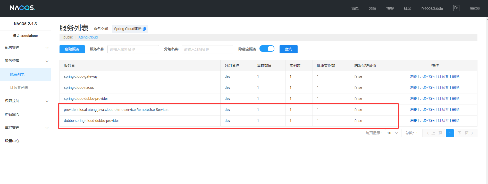

# Apache Dubbo

Apache Dubbo 是一款高性能的 **Java RPC（Remote Procedure Call，远程过程调用）** 框架，广泛应用于分布式服务架构中。它最初由阿里巴巴开源，并已成为 Apache 软件基金会的顶级项目。Dubbo 主要用于 **微服务架构**，提供高效、可扩展的服务治理能力。

- [官网地址](https://dubbo.apache.org)

**Apache Dubbo 的工作流程**

Dubbo 采用 **生产者（Provider）-消费者（Consumer）-注册中心（Registry）** 的架构，基本工作流程如下：

**1. 服务启动与注册**

- **服务提供者（Provider）** 启动后，会将自身服务的 **接口信息（Service Metadata）** 注册到 **注册中心（Registry）**。
- 注册中心保存该服务的地址、版本信息等，并对外提供 **服务发现能力**。

**2. 服务发现**

- **服务消费者（Consumer）** 在调用远程服务时，会先从 **注册中心** 获取可用的服务提供者列表。
- 消费者会 **缓存提供者列表**，避免频繁查询注册中心，提高性能。

**3. 远程调用**

- Consumer 根据负载均衡策略选择 **一个 Provider** 进行远程调用。
- 通过 **Netty 进行网络通信**，请求发送到 Provider 端，Provider 执行业务逻辑后返回结果。
- **Dubbo 支持异步调用**，提高吞吐量。

**4. 健康检测与服务治理**

- **注册中心** 定期检查 Provider 的健康状况，提供者下线时通知消费者更新服务列表。
- **监控中心（Monitor）** 记录调用日志、QPS、错误率等数据，帮助运维人员优化系统。


## 基础配置

### 添加配置属性

```xml
<!-- 项目属性 -->
<properties>
    <dubbo.version>3.3.4</dubbo.version>
</properties>
```

### 添加依赖管理

```xml
<!-- 依赖管理 -->
<dependencyManagement>
    <dependencies>
        <dependency>
            <groupId>org.apache.dubbo</groupId>
            <artifactId>dubbo-bom</artifactId>
            <version>${dubbo.version}</version>
            <type>pom</type>
            <scope>import</scope>
        </dependency>
    </dependencies>
</dependencyManagement>
```

### 添加依赖

```xml
<!-- Apache Dubbo Spring Boot 启动器依赖，用于将 Dubbo 集成到 Spring Boot 项目中 -->
<dependency>
    <groupId>org.apache.dubbo</groupId>
    <artifactId>dubbo-spring-boot-starter</artifactId>
</dependency>
<dependency>
    <groupId>org.apache.dubbo</groupId>
    <artifactId>dubbo-nacos-spring-boot-starter</artifactId>
</dependency>
```


## 公共API模块

公共 API 模块主要定义了服务接口（Service API），供服务提供者（Provider）和服务消费者（Consumer）共同依赖。它通常只包含 **接口定义、DTO（数据传输对象）和常量**，不包含具体实现逻辑。例如，在 `dubbo-api` 模块中，我们可以定义 `HelloService` 接口，而 Provider 和 Consumer 通过依赖该模块来实现或调用该服务。这样可以实现 **解耦**，确保服务提供方和消费方共享相同的接口规范，提高可维护性和兼容性。

### 创建公共API模块

最终效果如下：


### 配置pom.xml

```xml
<?xml version="1.0" encoding="UTF-8"?>
<project xmlns:xsi="http://www.w3.org/2001/XMLSchema-instance" xmlns="http://maven.apache.org/POM/4.0.0"
         xsi:schemaLocation="http://maven.apache.org/POM/4.0.0 https://maven.apache.org/xsd/maven-4.0.0.xsd">
    <!-- 项目模型版本 -->
    <modelVersion>4.0.0</modelVersion>

    <!-- 项目坐标 -->
    <groupId>local.ateng.java</groupId>
    <artifactId>spring-cloud-dubbo-api</artifactId>
    <version>v1.0</version>
    <name>spring-cloud-dubbo-api</name>
    <description>
        Apache Dubbo 公共API模块
    </description>
    <url>https://dubbo.apache.org/</url>

    <!-- 项目属性 -->
    <properties>
        <java.version>21</java.version>
        <project.build.sourceEncoding>UTF-8</project.build.sourceEncoding>
        <project.reporting.outputEncoding>UTF-8</project.reporting.outputEncoding>
        <maven-compiler.version>3.12.1</maven-compiler.version>
        <lombok.version>1.18.36</lombok.version>
        <dubbo.version>3.3.4</dubbo.version>
    </properties>

    <!-- 项目依赖 -->
    <dependencies>
        <!-- Lombok: 简化Java代码编写的依赖项 -->
        <dependency>
            <groupId>org.projectlombok</groupId>
            <artifactId>lombok</artifactId>
            <version>${lombok.version}</version>
            <scope>provided</scope>
        </dependency>
        <!-- Apache Dubbo Spring Boot 启动器依赖，用于将 Dubbo 集成到 Spring Boot 项目中 -->
        <dependency>
            <groupId>org.apache.dubbo</groupId>
            <artifactId>dubbo-spring-boot-starter</artifactId>
        </dependency>
        <dependency>
            <groupId>org.apache.dubbo</groupId>
            <artifactId>dubbo-nacos-spring-boot-starter</artifactId>
        </dependency>
    </dependencies>

    <!-- 依赖管理 -->
    <dependencyManagement>
        <dependencies>
            <dependency>
                <groupId>org.apache.dubbo</groupId>
                <artifactId>dubbo-bom</artifactId>
                <version>${dubbo.version}</version>
                <type>pom</type>
                <scope>import</scope>
            </dependency>
        </dependencies>
    </dependencyManagement>

    <!-- 插件仓库配置 -->
    <repositories>
        <!-- Central Repository -->
        <repository>
            <id>central</id>
            <name>阿里云中央仓库</name>
            <url>https://maven.aliyun.com/repository/central</url>
            <!--<name>Maven官方中央仓库</name>
            <url>https://repo.maven.apache.org/maven2/</url>-->
        </repository>
    </repositories>

    <!-- 构建配置 -->
    <build>
        <finalName>${project.name}-${project.version}</finalName>
        <plugins>
            <!-- Maven 编译插件 -->
            <plugin>
                <groupId>org.apache.maven.plugins</groupId>
                <artifactId>maven-compiler-plugin</artifactId>
                <version>${maven-compiler.version}</version>
                <configuration>
                    <source>${java.version}</source>
                    <target>${java.version}</target>
                    <encoding>${project.build.sourceEncoding}</encoding>
                    <!-- 编译参数 -->
                    <compilerArgs>
                        <!-- 启用Java 8参数名称保留功能 -->
                        <arg>-parameters</arg>
                    </compilerArgs>
                </configuration>
            </plugin>
        </plugins>
    </build>

</project>
```

### 创建远程实体

```java
package local.ateng.java.cloud.demo.entity;

import lombok.AllArgsConstructor;
import lombok.Builder;
import lombok.Data;
import lombok.NoArgsConstructor;

import java.io.Serial;
import java.io.Serializable;
import java.time.LocalDateTime;

@Data
@Builder
@NoArgsConstructor
@AllArgsConstructor
public class RemoteUser implements Serializable {

    @Serial
    private static final long serialVersionUID = 1L;

    private Long id;
    private String username;
    private Integer age;
    private LocalDateTime createTime;

}
```

### 创建远程服务接口

```java
package local.ateng.java.cloud.demo.service;

import local.ateng.java.cloud.demo.entity.RemoteUser;

public interface RemoteUserService {

    // 获取用户
    RemoteUser getUser();

}
```


## Provider模块

服务提供者模块是 Dubbo 微服务架构中的 **服务实现者**，负责提供远程服务并注册到注册中心（如 Nacos、Zookeeper）。在该模块中，具体业务逻辑通过 **实现 API 模块中的接口** 来提供服务，并使用 `@DubboService` 注解进行暴露。Provider 在启动时，会将可用的服务信息注册到 Dubbo 注册中心，供 Consumer 发现和调用。为了保证高可用性，Provider 端可部署多个实例，并结合 **负载均衡、熔断降级** 等策略来优化性能。

### 添加依赖

添加 **公共API模块**

```xml
<!-- 公共API模块 -->
<dependency>
    <groupId>local.ateng.java</groupId>
    <artifactId>spring-cloud-dubbo-api</artifactId>
    <version>v1.0</version>
</dependency>
```

完整pom.xml如下

```xml
<?xml version="1.0" encoding="UTF-8"?>
<project xmlns:xsi="http://www.w3.org/2001/XMLSchema-instance" xmlns="http://maven.apache.org/POM/4.0.0"
         xsi:schemaLocation="http://maven.apache.org/POM/4.0.0 https://maven.apache.org/xsd/maven-4.0.0.xsd">
    <!-- 项目模型版本 -->
    <modelVersion>4.0.0</modelVersion>

    <!-- 项目坐标 -->
    <groupId>local.ateng.java</groupId>
    <artifactId>spring-cloud-dubbo-provider</artifactId>
    <version>v1.0</version>
    <name>spring-cloud-dubbo-provider</name>
    <description>
        Apache Dubbo 是一款高性能、轻量级的 Java RPC 框架，广泛应用于微服务架构。
    </description>
    <url>https://dubbo.apache.org/</url>

    <!-- 项目属性 -->
    <properties>
        <java.version>21</java.version>
        <project.build.sourceEncoding>UTF-8</project.build.sourceEncoding>
        <project.reporting.outputEncoding>UTF-8</project.reporting.outputEncoding>
        <spring-boot.version>3.3.9</spring-boot.version>
        <spring-cloud.version>2023.0.5</spring-cloud.version>
        <spring-cloud-alibaba.version>2023.0.3.2</spring-cloud-alibaba.version>
        <maven-compiler.version>3.12.1</maven-compiler.version>
        <lombok.version>1.18.36</lombok.version>
        <dubbo.version>3.3.4</dubbo.version>
    </properties>

    <!-- 项目环境配置 -->
    <profiles>
        <!-- 开发环境配置 -->
        <profile>
            <id>dev</id>
            <activation>
                <activeByDefault>true</activeByDefault>
            </activation>
            <properties>
                <profiles.active>dev</profiles.active>
                <profiles.desc>开发环境</profiles.desc>
                <logging.level>info</logging.level>
            </properties>
        </profile>

        <!-- 测试环境配置 -->
        <profile>
            <id>test</id>
            <properties>
                <profiles.active>test</profiles.active>
                <profiles.desc>测试环境</profiles.desc>
                <logging.level>info</logging.level>
            </properties>
        </profile>

        <!-- 生产环境配置 -->
        <profile>
            <id>prod</id>
            <properties>
                <profiles.active>prod</profiles.active>
                <profiles.desc>生产环境</profiles.desc>
                <logging.level>warn</logging.level>
            </properties>
        </profile>
    </profiles>

    <!-- 项目依赖 -->
    <dependencies>
        <!-- Spring Boot Web Starter: 包含用于构建Web应用程序的Spring Boot依赖项 -->
        <dependency>
            <groupId>org.springframework.boot</groupId>
            <artifactId>spring-boot-starter-web</artifactId>
        </dependency>

        <!-- Spring Boot Starter Test: 包含用于测试Spring Boot应用程序的依赖项 -->
        <dependency>
            <groupId>org.springframework.boot</groupId>
            <artifactId>spring-boot-starter-test</artifactId>
            <scope>test</scope>
        </dependency>

        <!-- Lombok: 简化Java代码编写的依赖项 -->
        <!-- https://mvnrepository.com/artifact/org.projectlombok/lombok -->
        <dependency>
            <groupId>org.projectlombok</groupId>
            <artifactId>lombok</artifactId>
            <version>${lombok.version}</version>
            <scope>provided</scope>
        </dependency>

        <!-- Nacos 服务发现的依赖 -->
        <dependency>
            <groupId>com.alibaba.cloud</groupId>
            <artifactId>spring-cloud-starter-alibaba-nacos-discovery</artifactId>
        </dependency>

        <!-- Nacos 配置管理的依赖 -->
        <dependency>
            <groupId>com.alibaba.cloud</groupId>
            <artifactId>spring-cloud-starter-alibaba-nacos-config</artifactId>
        </dependency>

        <!-- Apache Dubbo Spring Boot 启动器依赖，用于将 Dubbo 集成到 Spring Boot 项目中 -->
        <dependency>
            <groupId>org.apache.dubbo</groupId>
            <artifactId>dubbo-spring-boot-starter</artifactId>
        </dependency>
        <dependency>
            <groupId>org.apache.dubbo</groupId>
            <artifactId>dubbo-nacos-spring-boot-starter</artifactId>
        </dependency>

    </dependencies>

    <!-- 依赖管理 -->
    <dependencyManagement>
        <dependencies>
            <dependency>
                <groupId>org.springframework.boot</groupId>
                <artifactId>spring-boot-dependencies</artifactId>
                <version>${spring-boot.version}</version>
                <type>pom</type>
                <scope>import</scope>
            </dependency>
            <dependency>
                <groupId>org.springframework.cloud</groupId>
                <artifactId>spring-cloud-dependencies</artifactId>
                <version>${spring-cloud.version}</version>
                <type>pom</type>
                <scope>import</scope>
            </dependency>
            <dependency>
                <groupId>com.alibaba.cloud</groupId>
                <artifactId>spring-cloud-alibaba-dependencies</artifactId>
                <version>${spring-cloud-alibaba.version}</version>
                <type>pom</type>
                <scope>import</scope>
            </dependency>
            <dependency>
                <groupId>org.apache.dubbo</groupId>
                <artifactId>dubbo-bom</artifactId>
                <version>${dubbo.version}</version>
                <type>pom</type>
                <scope>import</scope>
            </dependency>
        </dependencies>
    </dependencyManagement>

    <!-- 插件仓库配置 -->
    <repositories>
        <!-- Central Repository -->
        <repository>
            <id>central</id>
            <name>阿里云中央仓库</name>
            <url>https://maven.aliyun.com/repository/central</url>
            <!--<name>Maven官方中央仓库</name>
            <url>https://repo.maven.apache.org/maven2/</url>-->
        </repository>
    </repositories>

    <!-- 构建配置 -->
    <build>
        <finalName>${project.name}-${project.version}</finalName>
        <plugins>
            <!-- Maven 编译插件 -->
            <plugin>
                <groupId>org.apache.maven.plugins</groupId>
                <artifactId>maven-compiler-plugin</artifactId>
                <version>${maven-compiler.version}</version>
                <configuration>
                    <source>${java.version}</source>
                    <target>${java.version}</target>
                    <encoding>${project.build.sourceEncoding}</encoding>
                    <!-- 编译参数 -->
                    <compilerArgs>
                        <!-- 启用Java 8参数名称保留功能 -->
                        <arg>-parameters</arg>
                    </compilerArgs>
                </configuration>
            </plugin>

            <!-- Spring Boot Maven 插件 -->
            <plugin>
                <groupId>org.springframework.boot</groupId>
                <artifactId>spring-boot-maven-plugin</artifactId>
                <version>${spring-boot.version}</version>
                <executions>
                    <execution>
                        <id>repackage</id>
                        <goals>
                            <goal>repackage</goal>
                        </goals>
                    </execution>
                </executions>
            </plugin>
        </plugins>
        <resources>
            <!-- 第一个资源配置块 -->
            <resource>
                <directory>src/main/resources</directory>
                <filtering>false</filtering>
            </resource>
            <!-- 第二个资源配置块 -->
            <resource>
                <directory>src/main/resources</directory>
                <includes>
                    <include>application*</include>
                    <include>bootstrap*.yml</include>
                    <include>common*</include>
                    <include>banner*</include>
                </includes>
                <filtering>true</filtering>
            </resource>
        </resources>
    </build>

</project>
```

### 编辑配置文件

**添加Dubbo配置**

```yaml
---
# Dubbo 配置
dubbo:
  application:
    name: dubbo-${spring.application.name}
  protocol:
    name: dubbo
    port: -1
  # 注册中心配置
  registry:
    address: nacos://${spring.cloud.nacos.server-addr}
    group: ${spring.cloud.nacos.discovery.group}
    username: ${spring.cloud.nacos.username}
    password: ${spring.cloud.nacos.password}
    parameters:
      namespace: ${spring.cloud.nacos.discovery.namespace}
```

**完整配置文件如下**

application.yml

```yaml
server:
  port: 11004
  servlet:
    context-path: /
spring:
  main:
    web-application-type: servlet
  application:
    name: ${project.artifactId}
---
# 环境配置
spring:
  profiles:
    active: @profiles.active@
    desc: @profiles.desc@
```

application-dev.yml

```yaml
# nacos 配置
spring:
  cloud:
    nacos:
      # nacos:8848 服务地址
      server-addr: 192.168.1.10:30648
      username: nacos
      password: Admin@123
      discovery:
        # 注册组
        group: ${spring.profiles.active}
        namespace: a8126e6d-5758-4f5b-b892-2522a250074c
      config:
        # 配置组
        group: ${spring.profiles.active}
        namespace: a8126e6d-5758-4f5b-b892-2522a250074c
  config:
    import: # 引入配置nacos中的配置application-common.yml
      - optional:nacos:application-common.yml
      - optional:nacos:${spring.application.name}.yml
---
# Dubbo 配置
dubbo:
  application:
    name: dubbo-${spring.application.name}
  protocol:
    name: dubbo
    port: -1
  # 注册中心配置
  registry:
    address: nacos://${spring.cloud.nacos.server-addr}
    group: ${spring.cloud.nacos.discovery.group}
    username: ${spring.cloud.nacos.username}
    password: ${spring.cloud.nacos.password}
    parameters:
      namespace: ${spring.cloud.nacos.discovery.namespace}
```

### 启动Dubbo

```java
package local.ateng.java.cloud;

import org.apache.dubbo.config.spring.context.annotation.EnableDubbo;
import org.springframework.boot.SpringApplication;
import org.springframework.boot.autoconfigure.SpringBootApplication;
import org.springframework.cloud.client.discovery.EnableDiscoveryClient;

@SpringBootApplication
@EnableDiscoveryClient // 启动Nacos服务发现
@EnableDubbo // 启用 Dubbo
public class DistributedCloudDubboProviderApplication {

    public static void main(String[] args) {
        SpringApplication.run(DistributedCloudDubboProviderApplication.class, args);
    }

}
```

### 服务接口实现

```java
package local.ateng.java.cloud.service.impl;

import local.ateng.java.cloud.demo.entity.RemoteUser;
import local.ateng.java.cloud.demo.service.RemoteUserService;
import org.apache.dubbo.config.annotation.DubboService;

import java.time.LocalDateTime;

@DubboService  // Dubbo 服务注解，暴露服务
public class RemoteUserServiceImpl implements RemoteUserService {
    @Override
    public RemoteUser getUser() {
        return RemoteUser.builder()
                .id(1L)
                .username("阿腾")
                .age(25)
                .createTime(LocalDateTime.now())
                .build();
    }
}
```

### 启动provider服务

启动后Dubbo的服务在Nacos的服务列表中可以看到




## Consumer模块

服务消费者模块是 Dubbo 微服务架构中的 **远程调用者**，用于调用 Provider 提供的服务。在该模块中，使用 `@DubboReference` 注解引用 API 模块中的接口，Dubbo 通过代理机制实现透明的 RPC 调用。Consumer 启动时，会从注册中心获取可用的 Provider 列表，并根据负载均衡策略选择一个进行远程调用。为了提升健壮性，Consumer 端可以配置 **超时、重试、熔断降级** 机制，并结合监控系统进行服务治理。

### 添加依赖

添加 **公共API模块**

```xml
<!-- 公共API模块 -->
<dependency>
    <groupId>local.ateng.java</groupId>
    <artifactId>spring-cloud-dubbo-api</artifactId>
    <version>v1.0</version>
</dependency>
```

完整pom.xml如下

```xml
<?xml version="1.0" encoding="UTF-8"?>
<project xmlns:xsi="http://www.w3.org/2001/XMLSchema-instance" xmlns="http://maven.apache.org/POM/4.0.0"
         xsi:schemaLocation="http://maven.apache.org/POM/4.0.0 https://maven.apache.org/xsd/maven-4.0.0.xsd">
    <!-- 项目模型版本 -->
    <modelVersion>4.0.0</modelVersion>

    <!-- 项目坐标 -->
    <groupId>local.ateng.java</groupId>
    <artifactId>spring-cloud-dubbo-consumer</artifactId>
    <version>v1.0</version>
    <name>spring-cloud-dubbo-consumer</name>
    <description>
        Apache Dubbo 是一款高性能、轻量级的 Java RPC 框架，广泛应用于微服务架构。
    </description>
    <url>https://dubbo.apache.org/</url>

    <!-- 项目属性 -->
    <properties>
        <java.version>21</java.version>
        <project.build.sourceEncoding>UTF-8</project.build.sourceEncoding>
        <project.reporting.outputEncoding>UTF-8</project.reporting.outputEncoding>
        <spring-boot.version>3.3.9</spring-boot.version>
        <spring-cloud.version>2023.0.5</spring-cloud.version>
        <spring-cloud-alibaba.version>2023.0.3.2</spring-cloud-alibaba.version>
        <maven-compiler.version>3.12.1</maven-compiler.version>
        <lombok.version>1.18.36</lombok.version>
        <dubbo.version>3.3.4</dubbo.version>
    </properties>

    <!-- 项目环境配置 -->
    <profiles>
        <!-- 开发环境配置 -->
        <profile>
            <id>dev</id>
            <activation>
                <activeByDefault>true</activeByDefault>
            </activation>
            <properties>
                <profiles.active>dev</profiles.active>
                <profiles.desc>开发环境</profiles.desc>
                <logging.level>info</logging.level>
            </properties>
        </profile>

        <!-- 测试环境配置 -->
        <profile>
            <id>test</id>
            <properties>
                <profiles.active>test</profiles.active>
                <profiles.desc>测试环境</profiles.desc>
                <logging.level>info</logging.level>
            </properties>
        </profile>

        <!-- 生产环境配置 -->
        <profile>
            <id>prod</id>
            <properties>
                <profiles.active>prod</profiles.active>
                <profiles.desc>生产环境</profiles.desc>
                <logging.level>warn</logging.level>
            </properties>
        </profile>
    </profiles>

    <!-- 项目依赖 -->
    <dependencies>
        <!-- Spring Boot Web Starter: 包含用于构建Web应用程序的Spring Boot依赖项 -->
        <dependency>
            <groupId>org.springframework.boot</groupId>
            <artifactId>spring-boot-starter-web</artifactId>
        </dependency>

        <!-- Spring Boot Starter Test: 包含用于测试Spring Boot应用程序的依赖项 -->
        <dependency>
            <groupId>org.springframework.boot</groupId>
            <artifactId>spring-boot-starter-test</artifactId>
            <scope>test</scope>
        </dependency>

        <!-- Lombok: 简化Java代码编写的依赖项 -->
        <!-- https://mvnrepository.com/artifact/org.projectlombok/lombok -->
        <dependency>
            <groupId>org.projectlombok</groupId>
            <artifactId>lombok</artifactId>
            <version>${lombok.version}</version>
            <scope>provided</scope>
        </dependency>

        <!-- Nacos 服务发现的依赖 -->
        <dependency>
            <groupId>com.alibaba.cloud</groupId>
            <artifactId>spring-cloud-starter-alibaba-nacos-discovery</artifactId>
        </dependency>

        <!-- Nacos 配置管理的依赖 -->
        <dependency>
            <groupId>com.alibaba.cloud</groupId>
            <artifactId>spring-cloud-starter-alibaba-nacos-config</artifactId>
        </dependency>

        <!-- Apache Dubbo Spring Boot 启动器依赖，用于将 Dubbo 集成到 Spring Boot 项目中 -->
        <dependency>
            <groupId>org.apache.dubbo</groupId>
            <artifactId>dubbo-spring-boot-starter</artifactId>
        </dependency>
        <dependency>
            <groupId>org.apache.dubbo</groupId>
            <artifactId>dubbo-nacos-spring-boot-starter</artifactId>
        </dependency>

        <!-- 公共API模块 -->
        <dependency>
            <groupId>local.ateng.java</groupId>
            <artifactId>spring-cloud-dubbo-api</artifactId>
            <version>v1.0</version>
        </dependency>

    </dependencies>

    <!-- 依赖管理 -->
    <dependencyManagement>
        <dependencies>
            <dependency>
                <groupId>org.springframework.boot</groupId>
                <artifactId>spring-boot-dependencies</artifactId>
                <version>${spring-boot.version}</version>
                <type>pom</type>
                <scope>import</scope>
            </dependency>
            <dependency>
                <groupId>org.springframework.cloud</groupId>
                <artifactId>spring-cloud-dependencies</artifactId>
                <version>${spring-cloud.version}</version>
                <type>pom</type>
                <scope>import</scope>
            </dependency>
            <dependency>
                <groupId>com.alibaba.cloud</groupId>
                <artifactId>spring-cloud-alibaba-dependencies</artifactId>
                <version>${spring-cloud-alibaba.version}</version>
                <type>pom</type>
                <scope>import</scope>
            </dependency>
            <dependency>
                <groupId>org.apache.dubbo</groupId>
                <artifactId>dubbo-bom</artifactId>
                <version>${dubbo.version}</version>
                <type>pom</type>
                <scope>import</scope>
            </dependency>
        </dependencies>
    </dependencyManagement>

    <!-- 插件仓库配置 -->
    <repositories>
        <!-- Central Repository -->
        <repository>
            <id>central</id>
            <name>阿里云中央仓库</name>
            <url>https://maven.aliyun.com/repository/central</url>
            <!--<name>Maven官方中央仓库</name>
            <url>https://repo.maven.apache.org/maven2/</url>-->
        </repository>
    </repositories>

    <!-- 构建配置 -->
    <build>
        <finalName>${project.name}-${project.version}</finalName>
        <plugins>
            <!-- Maven 编译插件 -->
            <plugin>
                <groupId>org.apache.maven.plugins</groupId>
                <artifactId>maven-compiler-plugin</artifactId>
                <version>${maven-compiler.version}</version>
                <configuration>
                    <source>${java.version}</source>
                    <target>${java.version}</target>
                    <encoding>${project.build.sourceEncoding}</encoding>
                    <!-- 编译参数 -->
                    <compilerArgs>
                        <!-- 启用Java 8参数名称保留功能 -->
                        <arg>-parameters</arg>
                    </compilerArgs>
                </configuration>
            </plugin>

            <!-- Spring Boot Maven 插件 -->
            <plugin>
                <groupId>org.springframework.boot</groupId>
                <artifactId>spring-boot-maven-plugin</artifactId>
                <version>${spring-boot.version}</version>
                <executions>
                    <execution>
                        <id>repackage</id>
                        <goals>
                            <goal>repackage</goal>
                        </goals>
                    </execution>
                </executions>
            </plugin>
        </plugins>
        <resources>
            <!-- 第一个资源配置块 -->
            <resource>
                <directory>src/main/resources</directory>
                <filtering>false</filtering>
            </resource>
            <!-- 第二个资源配置块 -->
            <resource>
                <directory>src/main/resources</directory>
                <includes>
                    <include>application*</include>
                    <include>bootstrap*.yml</include>
                    <include>common*</include>
                    <include>banner*</include>
                </includes>
                <filtering>true</filtering>
            </resource>
        </resources>
    </build>

</project>
```

### 编辑配置文件

**添加Dubbo配置**

```yaml
---
# Dubbo 配置
dubbo:
  application:
    name: dubbo-${spring.application.name}
  protocol:
    name: dubbo
    port: -1
  # 注册中心配置
  registry:
    address: nacos://${spring.cloud.nacos.server-addr}
    group: ${spring.cloud.nacos.discovery.group}
    username: ${spring.cloud.nacos.username}
    password: ${spring.cloud.nacos.password}
    parameters:
      namespace: ${spring.cloud.nacos.discovery.namespace}
  # 消费者配置
  consumer:
    timeout: 5000  # 请求超时，单位毫秒
    retries: 3     # 重试次数
    loadbalance: roundrobin # 负载均衡策略（轮询）
```

**完整配置文件如下**

application.yml

```yaml
server:
  port: 11005
  servlet:
    context-path: /
spring:
  main:
    web-application-type: servlet
  application:
    name: ${project.artifactId}
---
# 环境配置
spring:
  profiles:
    active: @profiles.active@
    desc: @profiles.desc@
```

application-dev.yml

```yaml
# nacos 配置
spring:
  cloud:
    nacos:
      # nacos:8848 服务地址
      server-addr: 192.168.1.10:30648
      username: nacos
      password: Admin@123
      discovery:
        # 注册组
        group: ${spring.profiles.active}
        namespace: a8126e6d-5758-4f5b-b892-2522a250074c
      config:
        # 配置组
        group: ${spring.profiles.active}
        namespace: a8126e6d-5758-4f5b-b892-2522a250074c
  config:
    import: # 引入配置nacos中的配置application-common.yml
      - optional:nacos:application-common.yml
      - optional:nacos:${spring.application.name}.yml
---
# Dubbo 配置
dubbo:
  application:
    name: dubbo-${spring.application.name}
  protocol:
    name: dubbo
    port: -1
  # 注册中心配置
  registry:
    address: nacos://${spring.cloud.nacos.server-addr}
    group: ${spring.cloud.nacos.discovery.group}
    username: ${spring.cloud.nacos.username}
    password: ${spring.cloud.nacos.password}
    parameters:
      namespace: ${spring.cloud.nacos.discovery.namespace}
  # 消费者配置
  consumer:
    timeout: 5000  # 请求超时，单位毫秒
    retries: 3     # 重试次数
    loadbalance: roundrobin # 负载均衡策略（轮询）
```

### 启动Dubbo

```java
package local.ateng.java.cloud;

import org.apache.dubbo.config.spring.context.annotation.EnableDubbo;
import org.springframework.boot.SpringApplication;
import org.springframework.boot.autoconfigure.SpringBootApplication;
import org.springframework.cloud.client.discovery.EnableDiscoveryClient;

@SpringBootApplication
@EnableDiscoveryClient // 启动Nacos服务发现
@EnableDubbo // 启用 Dubbo
public class DistributedCloudDubboConsumerApplication {

    public static void main(String[] args) {
        SpringApplication.run(DistributedCloudDubboConsumerApplication.class, args);
    }

}
```

### 使用服务接口

在消费者服务类中，使用 @DubboReference 引用远程服务：

```java
package local.ateng.java.cloud.contro;

import local.ateng.java.cloud.demo.entity.RemoteUser;
import local.ateng.java.cloud.demo.service.RemoteUserService;
import org.apache.dubbo.config.annotation.DubboReference;
import org.springframework.web.bind.annotation.GetMapping;
import org.springframework.web.bind.annotation.RequestMapping;
import org.springframework.web.bind.annotation.RestController;

@RestController
@RequestMapping("/user")
public class UserController {

    @DubboReference
    private RemoteUserService remoteUserService;

    @GetMapping("/get")
    public RemoteUser sayHello() {
        return remoteUserService.getUser();
    }

}
```

### 启动Consumer服务

启动后调用接口访问测试

```
curl http://localhost:11005/user/get
```


## **配置** 和 核心注解

配置详情参考：[官方文档](https://cn.dubbo.apache.org/zh-cn/overview/mannual/java-sdk/reference-manual/config/properties/#dubboapplication)

### **1. Dubbo 在 `application.yml` 中的配置**

Dubbo 在 `Spring Boot` 中的 **`application.yml`** 主要包括 **应用信息、注册中心、协议、消费者设置、负载均衡、超时等**，这里是一个完整的示例配置：

#### **✅  `application.yml` 完整配置**

```yaml
dubbo:
  application:
    name: dubbo-provider  # 服务应用名称
    metadata-type: remote  # 指定元数据存储方式（remote/local）
    qos-enable: true  # 是否开启 QOS
    qos-port: 33333  # 自定义 QOS 端口

  registry:
    address: nacos://127.0.0.1:8848  # 指定注册中心（支持 nacos、zookeeper、consul 等）
    group: DUBBO_GROUP  # 注册中心分组（保证 Provider & Consumer 一致）
    parameters:
      namespace: public  # 正确的 Namespace 配置方式

  metadata-report:
    address: nacos://127.0.0.1:8848  # 指定元数据存储地址
    group: DUBBO_METADATA_GROUP  # 元数据中心分组
    parameters:
      namespace: public  # 指定元数据命名空间

  protocol:
    name: dubbo  # 通信协议（dubbo、tri、grpc）
    port: 20880  # Dubbo 服务端口

  monitor:
    protocol: registry  # 监控中心，支持 registry、direct（如 Prometheus、Pinpoint）

  provider:
    retries: 2  # 失败重试次数
    timeout: 5000  # 超时时间（毫秒）
    delay: -1  # -1 表示不延迟发布服务
    weight: 100  # Provider 负载均衡权重
    token: false  # 是否启用 Token 认证
    accesslog: true  # 是否启用访问日志
    loadbalance: roundrobin  # 负载均衡策略（random、roundrobin、leastactive）

  consumer:
    check: false  # 启动时不检查 Provider 是否可用
    timeout: 3000  # 消费者调用超时时间
    retries: 1  # 失败重试次数
    loadbalance: leastactive  # 负载均衡策略
    cluster: failover  # 失败策略（failover、failsafe、failfast、failback）
    sticky: false  # 是否粘滞连接（减少负载均衡开销）
```

------

#### **✅ 配置参数解析**

| **配置项**                                | **作用**                                                     |
| ----------------------------------------- | ------------------------------------------------------------ |
| **`dubbo.application.name`**              | Dubbo 应用名称                                               |
| **`dubbo.application.metadata-type`**     | **元数据存储方式**（`remote` 远程存储 / `local` 本地存储）   |
| **`dubbo.application.qos-enable`**        | 是否开启 QOS（默认 `true`，调试用）                          |
| **`dubbo.application.qos-port`**          | QOS 端口（默认 `22222`，可修改）                             |
| **`dubbo.registry.address`**              | 注册中心地址，支持 `nacos://`、`zookeeper://`、`consul://`   |
| **`dubbo.registry.group`**                | Dubbo 服务分组（Provider & Consumer 需一致）                 |
| **`dubbo.registry.parameters.namespace`** | **正确的 Nacos 命名空间配置方式**                            |
| **`dubbo.metadata-report.address`**       | 元数据中心地址                                               |
| **`dubbo.metadata-report.group`**         | 元数据中心分组（**不同环境可隔离元数据**）                   |
| **`dubbo.protocol.name`**                 | 指定通信协议（`dubbo`、`tri`、`grpc`）                       |
| **`dubbo.protocol.port`**                 | Dubbo 监听端口（默认 `20880`）                               |
| **`dubbo.monitor.protocol`**              | 监控中心（`registry` 通过注册中心上报 / `direct` 指定地址）  |
| **`dubbo.provider.retries`**              | Provider 失败重试次数（默认 `2`）                            |
| **`dubbo.provider.timeout`**              | Provider 端超时时间（毫秒）                                  |
| **`dubbo.provider.delay`**                | 延迟发布时间（`-1` 表示立即发布）                            |
| **`dubbo.provider.weight`**               | Provider 负载均衡权重                                        |
| **`dubbo.provider.token`**                | 是否启用 Token 认证（防止 Consumer 伪造请求）                |
| **`dubbo.provider.accesslog`**            | 是否开启访问日志                                             |
| **`dubbo.provider.loadbalance`**          | 负载均衡策略（`random`、`roundrobin`、`leastactive`）        |
| **`dubbo.consumer.check`**                | Consumer 启动时是否检查 Provider（默认 `true`，`false` 忽略） |
| **`dubbo.consumer.timeout`**              | Consumer 端超时时间                                          |
| **`dubbo.consumer.retries`**              | Consumer 失败重试次数                                        |
| **`dubbo.consumer.loadbalance`**          | 负载均衡策略（同 Provider）                                  |
| **`dubbo.consumer.cluster`**              | 失败策略（`failover` 自动切换 / `failfast` 快速失败）        |
| **`dubbo.consumer.sticky`**               | 是否粘滞连接（避免请求跳转到不同 Provider）                  |

---

### **2. `@DubboService` 注解的参数**

`@DubboService` 用于 **暴露 Dubbo 服务**，支持多个参数配置，主要包括 **接口定义、版本号、超时、重试策略等**。

#### **✅ `@DubboService` 使用示例**

```java
import org.apache.dubbo.config.annotation.DubboService;
import com.example.api.HelloService;

@DubboService(
    interfaceClass = HelloService.class,  // 指定接口（可选）
    version = "1.0.0",  // 版本号（用于区分不同版本服务）
    group = "test-group",  // 服务分组
    timeout = 5000,  // 超时时间（毫秒）
    retries = 2,  // 失败重试次数
    loadbalance = "roundrobin"  // 负载均衡策略
)
public class HelloServiceImpl implements HelloService {
    @Override
    public String sayHello(String name) {
        return "Hello, " + name;
    }
}
```

#### **🔹 关键参数解析**

| 参数             | 作用                                                  |
| ---------------- | ----------------------------------------------------- |
| `interfaceClass` | 指定实现的服务接口（默认自动推断）                    |
| `version`        | 版本号（不同版本服务可同时存在）                      |
| `group`          | 分组（防止同名服务冲突）                              |
| `timeout`        | 远程调用超时时间（毫秒）                              |
| `retries`        | 失败重试次数（默认 2）                                |
| `loadbalance`    | 负载均衡策略（`random`、`roundrobin`、`leastactive`） |
| `weight`         | 权重（用于 Provider 负载均衡）                        |
| `delay`          | 延迟暴露服务时间（毫秒，`-1` 表示不延迟）             |

------

### **3. `@DubboReference` 注解的参数**

`@DubboReference` 用于 **远程调用 Dubbo 服务**，支持多个参数配置，主要包括 **超时、版本、负载均衡、异步调用等**。

#### **✅ `@DubboReference` 使用示例**

```java
import org.apache.dubbo.config.annotation.DubboReference;
import com.example.api.HelloService;
import org.springframework.web.bind.annotation.*;

@RestController
public class HelloController {
    @DubboReference(
        version = "1.0.0",  // 指定调用的服务版本
        group = "test-group",  // 指定调用的服务分组
        timeout = 3000,  // 超时时间（毫秒）
        retries = 1,  // 失败重试次数
        loadbalance = "random",  // 负载均衡策略
        check = false,  // 启动时不检查 Provider 是否可用
        async = false  // 是否异步调用
    )
    private HelloService helloService;

    @GetMapping("/sayHello")
    public String sayHello(@RequestParam String name) {
        return helloService.sayHello(name);
    }
}
```

#### **🔹 关键参数解析**

| 参数          | 作用                                                  |
| ------------- | ----------------------------------------------------- |
| `version`     | 指定调用的服务版本                                    |
| `group`       | 指定调用的服务分组                                    |
| `timeout`     | 远程调用超时时间（毫秒）                              |
| `retries`     | 失败重试次数                                          |
| `loadbalance` | 负载均衡策略（`random`、`roundrobin`、`leastactive`） |
| `check`       | 启动时是否检查 Provider 是否可用（默认 `true`）       |
| `async`       | 是否异步调用（默认 `false`）                          |
| `mock`        | 调用失败时返回 Mock 数据                              |
| `sticky`      | 是否粘滞连接（避免请求跳转到不同的 Provider）         |

