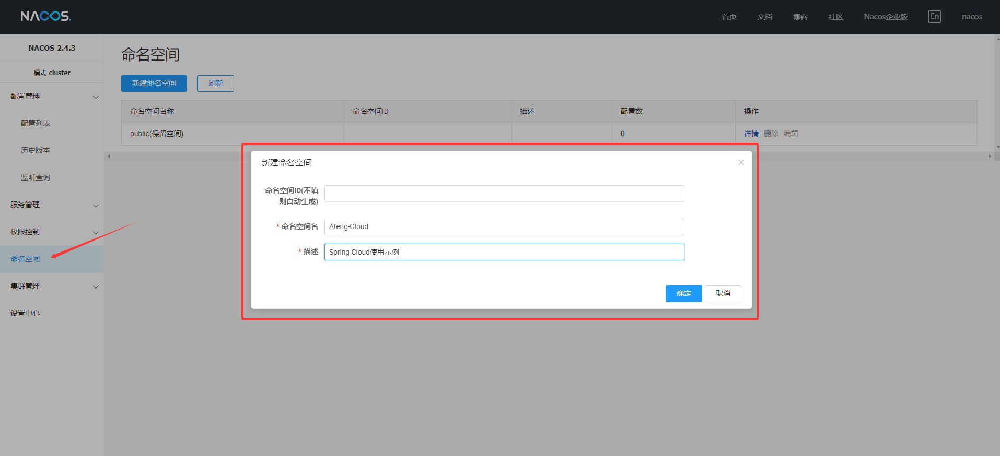
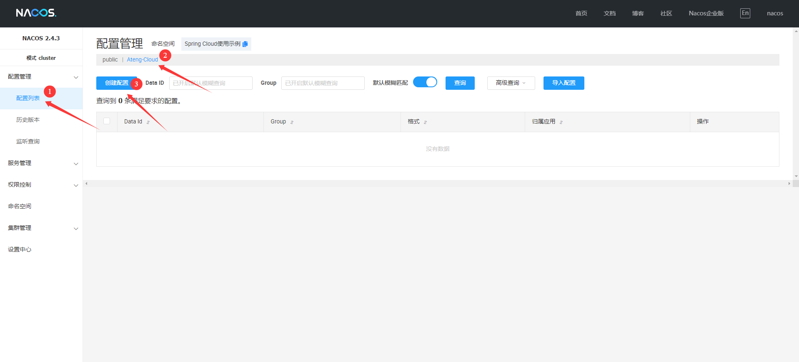
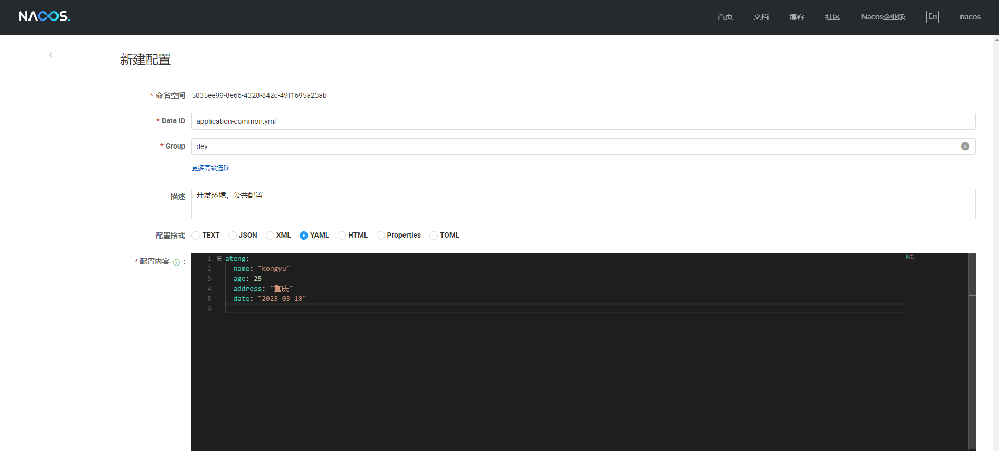
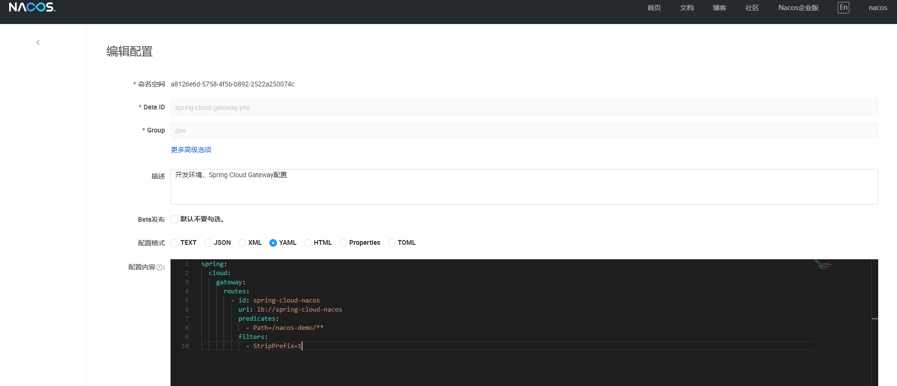
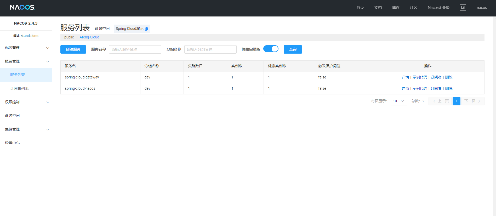

# Spring Cloud Gateway


## 概述

Spring Cloud Gateway 是基于 Spring WebFlux 和 Project Reactor 的 API 网关解决方案，旨在提供动态路由、流量控制、身份验证、限流和监控等功能。它是 Spring Cloud 生态系统的一部分，常用于微服务架构中充当 API 入口。

**官网地址：**

- [Spring Cloud Gateway 官方文档](https://spring.io/projects/spring-cloud-gateway)

**主要特性：**

- **动态路由**：根据 URL、请求头、参数等条件匹配并转发请求。
- **断言（Predicate）系统**：提供多种匹配规则，如路径、方法、请求头等。
- **过滤器（Filter）**：可以修改请求和响应，如添加请求头、修改路径、限流等。
- **负载均衡**：结合 Spring Cloud LoadBalancer，实现请求分发。
- **熔断与限流**：支持 Resilience4j 进行熔断、`RequestRateLimiter` 进行限流。
- **无阻塞式编程**：基于 Netty 和 WebFlux，适用于高并发场景。
- **安全集成**：支持 OAuth 2.0、JWT 等身份验证方式。
- **可观测性**：与 Spring Boot Actuator 结合进行监控和日志分析。

Spring Cloud Gateway 适用于构建 API 统一入口，可用于认证、鉴权、流量控制等场景，尤其适合微服务架构中的 API 管理。

------

## 核心概念

Spring Cloud Gateway 的核心由 **路由（Route）、断言（Predicate）和过滤器（Filter）** 组成，它们决定了请求如何被处理和转发。

### 1. **路由（Route）**

**路由** 是 Spring Cloud Gateway 的基本构建块，定义了 **请求的转发规则**。

每个路由由 **ID、断言（Predicate）和目标 URI** 组成。

当请求满足断言条件时，该请求将被转发到目标 URI。

**示例：**

```yaml
spring:
  cloud:
    gateway:
      routes:
        - id: service-route
          uri: lb://my-service  # lb://表示使用负载均衡
          predicates:
            - Path=/api/**
          filters:
            - StripPrefix=1
```

- `lb://my-service` 代表从注册中心（如 Eureka、Nacos）中获取 `my-service` 实例，并进行负载均衡。

---

### 2. **断言（Predicate）**

**断言** 用于判断一个请求是否匹配某个路由，只有匹配的请求才会被该路由处理。

断言基于 Spring 的 `java.util.function.Predicate`，可以组合多个条件。

**常见的断言**：

| **Predicate 名称** | **作用**               | **示例**                                                     |
| ------------------ | ---------------------- | ------------------------------------------------------------ |
| **Path**           | 匹配请求路径           | `- Path=/api/**`                                             |
| **Method**         | 匹配 HTTP 方法         | `- Method=GET,POST`                                          |
| **Header**         | 匹配请求头             | `- Header=X-Request-Id, \d+`（匹配值为数字的 `X-Request-Id` 头） |
| **Query**          | 匹配 URL 查询参数      | `- Query=foo, bar`（匹配 `?foo=bar`）                        |
| **Cookie**         | 匹配请求 Cookie        | `- Cookie=SESSION, .*`（匹配 `SESSION` Cookie）              |
| **After**          | 匹配指定时间之后的请求 | `- After=2024-01-01T00:00:00+08:00[Asia/Shanghai]`           |
| **Before**         | 匹配指定时间之前的请求 | `- Before=2024-12-31T23:59:59+08:00[Asia/Shanghai]`          |
| **Between**        | 匹配指定时间范围       | `- Between=2024-01-01T00:00:00+08:00, 2024-12-31T23:59:59+08:00` |
| **RemoteAddr**     | 匹配 IP 地址           | `- RemoteAddr=192.168.1.1/24`                                |
| **Host**           | 匹配请求的主机名       | `- Host=**.example.com`（匹配 `www.example.com`）            |
| **Weight**         | 负载均衡的权重         | `- Weight=group, 5`（`group` 组内权重为 `5`）                |

**示例：**

```yaml
predicates:
  - Path=/user/**
  - Method=GET
```

这个配置表示 **匹配所有 `GET` 请求，并且路径以 `/user/` 开头** 的请求。

---

### 3. **过滤器（Filter）**

**过滤器** 用于在请求被转发之前或之后对其进行修改，比如：

- **请求/响应** 头修改
- **URL 重写**
- **身份认证**
- **限流**

过滤器分为 **全局过滤器（GlobalFilter）** 和 **局部过滤器（GatewayFilter）**。

**常见的局部过滤器**：

**请求修改相关**

| **Filter 名称**         | **作用**     | **示例**                                |
| ----------------------- | ------------ | --------------------------------------- |
| **AddRequestHeader**    | 添加请求头   | `- AddRequestHeader=X-Request-Id, 123`  |
| **AddRequestParameter** | 添加请求参数 | `- AddRequestParameter=username, admin` |
| **RemoveRequestHeader** | 移除请求头   | `- RemoveRequestHeader=Cookie`          |

**响应修改相关**

| **Filter 名称**          | **作用**        | **示例**                                             |
| ------------------------ | --------------- | ---------------------------------------------------- |
| **AddResponseHeader**    | 添加响应头      | `- AddResponseHeader=Content-Type, application/json` |
| **RemoveResponseHeader** | 移除响应头      | `- RemoveResponseHeader=Server`                      |
| **SetResponseHeader**    | 设置/覆盖响应头 | `- SetResponseHeader=Cache-Control, no-cache`        |

**URL 处理相关**

| **Filter 名称** | **作用**     | **示例**                                                     |
| --------------- | ------------ | ------------------------------------------------------------ |
| **StripPrefix** | 去除路径前缀 | `- StripPrefix=1`（`/api/user` → `/user`）                   |
| **RewritePath** | 正则替换路径 | `- RewritePath=/api/(?<segment>.*), /$\\{segment}`（`/api/user` → `/user`） |
| **SetPath**     | 直接修改路径 | `- SetPath=/newPath`（请求路径变为 `/newPath`）              |

**负载均衡 & 限流**

| **Filter 名称**        | **作用** | **示例**                                                     |
| ---------------------- | -------- | ------------------------------------------------------------ |
| **RequestRateLimiter** | 限流     | `- name: RequestRateLimiter`<br> `args: key-resolver: "#{@userKeyResolver}" redis-rate-limiter.replenishRate=10 redis-rate-limiter.burstCapacity=20` |
| **Retry**              | 失败重试 | `- Retry=3`（最多重试 3 次）                                 |
| **CircuitBreaker**     | 断路器   | `- CircuitBreaker=id=myCircuitBreaker`                       |

**其他功能**

| **Filter 名称** | **作用**         | **示例**                                     |
| --------------- | ---------------- | -------------------------------------------- |
| **PrefixPath**  | 添加路径前缀     | `- PrefixPath=/api`（`/user` → `/api/user`） |
| **SetStatus**   | 修改 HTTP 状态码 | `- SetStatus=403`（返回 403）                |
| **RedirectTo**  | 重定向           | `- RedirectTo=302, https://example.com`      |

**示例：**

```yaml
filters:
  - AddRequestHeader=X-Custom-Header, MyValue
  - StripPrefix=1
```

这个配置表示 **给请求添加 `X-Custom-Header: MyValue` 头，并去掉路径的第一级前缀**


## 基础配置

### 添加依赖

#### 添加依赖属性

```xml
<!-- 项目属性 -->
<properties>
    <spring-boot.version>3.3.9</spring-boot.version>
    <spring-cloud.version>2023.0.5</spring-cloud.version>
    <spring-cloud-alibaba.version>2023.0.3.2</spring-cloud-alibaba.version>
</properties>
```

#### 添加依赖管理

```xml
<!-- 依赖管理 -->
<dependencyManagement>
    <dependencies>
        <dependency>
            <groupId>org.springframework.boot</groupId>
            <artifactId>spring-boot-dependencies</artifactId>
            <version>${spring-boot.version}</version>
            <type>pom</type>
            <scope>import</scope>
        </dependency>
        <dependency>
            <groupId>org.springframework.cloud</groupId>
            <artifactId>spring-cloud-dependencies</artifactId>
            <version>${spring-cloud.version}</version>
            <type>pom</type>
            <scope>import</scope>
        </dependency>
        <dependency>
            <groupId>com.alibaba.cloud</groupId>
            <artifactId>spring-cloud-alibaba-dependencies</artifactId>
            <version>${spring-cloud-alibaba.version}</version>
            <type>pom</type>
            <scope>import</scope>
        </dependency>
    </dependencies>
</dependencyManagement>
```

#### 添加依赖

```xml
<!-- 项目依赖 -->
<dependencies>
    <!-- Nacos 服务发现的依赖 -->
    <dependency>
        <groupId>com.alibaba.cloud</groupId>
        <artifactId>spring-cloud-starter-alibaba-nacos-discovery</artifactId>
    </dependency>

    <!-- Nacos 配置管理的依赖 -->
    <dependency>
        <groupId>com.alibaba.cloud</groupId>
        <artifactId>spring-cloud-starter-alibaba-nacos-config</artifactId>
    </dependency>

    <!-- Spring Cloud Gateway 启动器依赖，用于构建API网关 -->
    <dependency>
        <groupId>org.springframework.cloud</groupId>
        <artifactId>spring-cloud-starter-gateway</artifactId>
    </dependency>
    
    <!-- Spring Cloud 负载均衡启动器依赖，用于客户端负载均衡 -->
    <dependency>
        <groupId>org.springframework.cloud</groupId>
        <artifactId>spring-cloud-starter-loadbalancer</artifactId>
    </dependency>
</dependencies>
```

#### 项目环境配置

```xml
<!-- 项目环境配置 -->
<profiles>
    <!-- 开发环境配置 -->
    <profile>
        <id>dev</id>
        <activation>
            <activeByDefault>true</activeByDefault>
        </activation>
        <properties>
            <profiles.active>dev</profiles.active>
            <profiles.desc>开发环境</profiles.desc>
            <logging.level>info</logging.level>
        </properties>
    </profile>

    <!-- 测试环境配置 -->
    <profile>
        <id>test</id>
        <properties>
            <profiles.active>test</profiles.active>
            <profiles.desc>测试环境</profiles.desc>
            <logging.level>info</logging.level>
        </properties>
    </profile>

    <!-- 生产环境配置 -->
    <profile>
        <id>prod</id>
        <properties>
            <profiles.active>prod</profiles.active>
            <profiles.desc>生产环境</profiles.desc>
            <logging.level>warn</logging.level>
        </properties>
    </profile>
</profiles>
```

#### 完整pom.xml

```xml
<?xml version="1.0" encoding="UTF-8"?>
<project xmlns:xsi="http://www.w3.org/2001/XMLSchema-instance" xmlns="http://maven.apache.org/POM/4.0.0"
         xsi:schemaLocation="http://maven.apache.org/POM/4.0.0 https://maven.apache.org/xsd/maven-4.0.0.xsd">
    <!-- 项目模型版本 -->
    <modelVersion>4.0.0</modelVersion>

    <!-- 项目坐标 -->
    <groupId>local.ateng.java</groupId>
    <artifactId>spring-cloud-gateway</artifactId>
    <version>v1.0</version>
    <name>spring-cloud-gateway</name>
    <description>
        基于 Spring WebFlux 构建，提供了一种简单而高效的方式来路由 API 请求，并提供诸如负载均衡、限流、熔断、身份验证等功能。
    </description>
    <url>https://spring.io/projects/spring-cloud-gateway</url>

    <!-- 项目属性 -->
    <properties>
        <java.version>21</java.version>
        <project.build.sourceEncoding>UTF-8</project.build.sourceEncoding>
        <project.reporting.outputEncoding>UTF-8</project.reporting.outputEncoding>
        <spring-boot.version>3.3.9</spring-boot.version>
        <spring-cloud.version>2023.0.5</spring-cloud.version>
        <spring-cloud-alibaba.version>2023.0.3.2</spring-cloud-alibaba.version>
        <maven-compiler.version>3.12.1</maven-compiler.version>
        <lombok.version>1.18.36</lombok.version>
    </properties>

    <!-- 项目环境配置 -->
    <profiles>
        <!-- 开发环境配置 -->
        <profile>
            <id>dev</id>
            <activation>
                <activeByDefault>true</activeByDefault>
            </activation>
            <properties>
                <profiles.active>dev</profiles.active>
                <profiles.desc>开发环境</profiles.desc>
                <logging.level>info</logging.level>
            </properties>
        </profile>

        <!-- 测试环境配置 -->
        <profile>
            <id>test</id>
            <properties>
                <profiles.active>test</profiles.active>
                <profiles.desc>测试环境</profiles.desc>
                <logging.level>info</logging.level>
            </properties>
        </profile>

        <!-- 生产环境配置 -->
        <profile>
            <id>prod</id>
            <properties>
                <profiles.active>prod</profiles.active>
                <profiles.desc>生产环境</profiles.desc>
                <logging.level>warn</logging.level>
            </properties>
        </profile>
    </profiles>

    <!-- 项目依赖 -->
    <dependencies>

        <!-- Lombok: 简化Java代码编写的依赖项 -->
        <!-- https://mvnrepository.com/artifact/org.projectlombok/lombok -->
        <dependency>
            <groupId>org.projectlombok</groupId>
            <artifactId>lombok</artifactId>
            <version>${lombok.version}</version>
            <scope>provided</scope>
        </dependency>

        <!-- Nacos 服务发现的依赖 -->
        <dependency>
            <groupId>com.alibaba.cloud</groupId>
            <artifactId>spring-cloud-starter-alibaba-nacos-discovery</artifactId>
        </dependency>

        <!-- Nacos 配置管理的依赖 -->
        <dependency>
            <groupId>com.alibaba.cloud</groupId>
            <artifactId>spring-cloud-starter-alibaba-nacos-config</artifactId>
        </dependency>

        <!-- Spring Cloud Gateway 启动器依赖，用于构建API网关 -->
        <dependency>
            <groupId>org.springframework.cloud</groupId>
            <artifactId>spring-cloud-starter-gateway</artifactId>
        </dependency>

        <!-- Spring Cloud 负载均衡启动器依赖，用于客户端负载均衡 -->
        <dependency>
            <groupId>org.springframework.cloud</groupId>
            <artifactId>spring-cloud-starter-loadbalancer</artifactId>
        </dependency>

    </dependencies>

    <!-- 依赖管理 -->
    <dependencyManagement>
        <dependencies>
            <dependency>
                <groupId>org.springframework.boot</groupId>
                <artifactId>spring-boot-dependencies</artifactId>
                <version>${spring-boot.version}</version>
                <type>pom</type>
                <scope>import</scope>
            </dependency>
            <dependency>
                <groupId>org.springframework.cloud</groupId>
                <artifactId>spring-cloud-dependencies</artifactId>
                <version>${spring-cloud.version}</version>
                <type>pom</type>
                <scope>import</scope>
            </dependency>
            <dependency>
                <groupId>com.alibaba.cloud</groupId>
                <artifactId>spring-cloud-alibaba-dependencies</artifactId>
                <version>${spring-cloud-alibaba.version}</version>
                <type>pom</type>
                <scope>import</scope>
            </dependency>
        </dependencies>
    </dependencyManagement>

    <!-- 插件仓库配置 -->
    <repositories>
        <!-- Central Repository -->
        <repository>
            <id>central</id>
            <name>阿里云中央仓库</name>
            <url>https://maven.aliyun.com/repository/central</url>
            <!--<name>Maven官方中央仓库</name>
            <url>https://repo.maven.apache.org/maven2/</url>-->
        </repository>
    </repositories>

    <!-- 构建配置 -->
    <build>
        <finalName>${project.name}-${project.version}</finalName>
        <plugins>
            <!-- Maven 编译插件 -->
            <plugin>
                <groupId>org.apache.maven.plugins</groupId>
                <artifactId>maven-compiler-plugin</artifactId>
                <version>${maven-compiler.version}</version>
                <configuration>
                    <source>${java.version}</source>
                    <target>${java.version}</target>
                    <encoding>${project.build.sourceEncoding}</encoding>
                    <!-- 编译参数 -->
                    <compilerArgs>
                        <!-- 启用Java 8参数名称保留功能 -->
                        <arg>-parameters</arg>
                    </compilerArgs>
                </configuration>
            </plugin>

            <!-- Spring Boot Maven 插件 -->
            <plugin>
                <groupId>org.springframework.boot</groupId>
                <artifactId>spring-boot-maven-plugin</artifactId>
                <version>${spring-boot.version}</version>
                <executions>
                    <execution>
                        <id>repackage</id>
                        <goals>
                            <goal>repackage</goal>
                        </goals>
                    </execution>
                </executions>
            </plugin>
        </plugins>
        <resources>
            <!-- 第一个资源配置块 -->
            <resource>
                <directory>src/main/resources</directory>
                <filtering>false</filtering>
            </resource>
            <!-- 第二个资源配置块 -->
            <resource>
                <directory>src/main/resources</directory>
                <includes>
                    <include>application*</include>
                    <include>bootstrap*.yml</include>
                    <include>common*</include>
                    <include>banner*</include>
                </includes>
                <filtering>true</filtering>
            </resource>
        </resources>
    </build>

</project>
```


## 创建配置

### 创建命名空间



### 创建配置

进入 **新建配置** 页面



**创建公共配置**



**创建服务配置**

配置路由到 `spring-cloud-nacos` 服务上

```yaml
spring:
  cloud:
    gateway:
      routes:
        - id: spring-cloud-nacos
          uri: lb://spring-cloud-nacos
          predicates:
            - Path=/nacos-demo/**
          filters:
            - StripPrefix=1
```



### 启动服务发现

```java
package local.ateng.java.cloud;

import org.springframework.boot.SpringApplication;
import org.springframework.boot.autoconfigure.SpringBootApplication;
import org.springframework.cloud.client.discovery.EnableDiscoveryClient;

@SpringBootApplication
@EnableDiscoveryClient // 启动Nacos服务发现
public class DistributedCloudGatewayApplication {

    public static void main(String[] args) {
        SpringApplication.run(DistributedCloudGatewayApplication.class, args);
    }

}
```


## 编辑配置

### 编辑配置文件

编辑 `application.yml`

```yaml
server:
  port: 11003
  servlet:
    context-path: /
spring:
  main:
    web-application-type: reactive
  application:
    name: ${project.artifactId}
---
# 环境配置
spring:
  profiles:
    active: @profiles.active@
    desc: @profiles.desc@
```

编辑 `application-dev.yml`

```yaml
# nacos 配置
spring:
  cloud:
    nacos:
      # nacos:8848 服务地址
      server-addr: 192.168.1.10:30648
      username: nacos
      password: Admin@123
      discovery:
        # 注册组
        group: ${spring.profiles.active}
        namespace: a8126e6d-5758-4f5b-b892-2522a250074c
      config:
        # 配置组
        group: ${spring.profiles.active}
        namespace: a8126e6d-5758-4f5b-b892-2522a250074c
  config:
    import: # 引入配置nacos中的配置application-common.yml
      - optional:nacos:application-common.yml
      - optional:nacos:${spring.application.name}.yml
```

## 启动服务

### 查看服务列表



### 访问接口

在配置管理中修改了相关配置文件后，服务端也会动态刷新。

```
C:\Users\admin>curl localhost:11003/nacos-demo/config/get
{"ateng-config":"AtengConfig(name=kongyu, age=25, address=重庆, date=2025-03-10)","my-config":"MyConfig(name=ateng, age=25)"}
```


## 使用Actuator

### 添加依赖

```xml
<!-- Spring Boot Actuator 依赖 -->
<dependency>
    <groupId>org.springframework.boot</groupId>
    <artifactId>spring-boot-starter-actuator</artifactId>
</dependency>
```

### 编辑配置

在Nacos中修改公共配置文件 `application-common.yml`，添加以下配置：

```yaml
---
# Spring Boot Actuator 配置
management:
  endpoints:
    web:
      base-path: /actuator
      exposure:
        include: health,metrics,info,gateway
  endpoint:
    gateway:
      enabled: true
```

### 访问端点

- 查看健康状态

    ```
    curl http://localhost:11003/actuator/health
    ```

- 查看所有路由

    ```
    curl http://localhost:11003/actuator/gateway/routes
    ```

- 刷新路由

    ```
    curl -X POST http://localhost:11003/actuator/gateway/refresh
    ```

