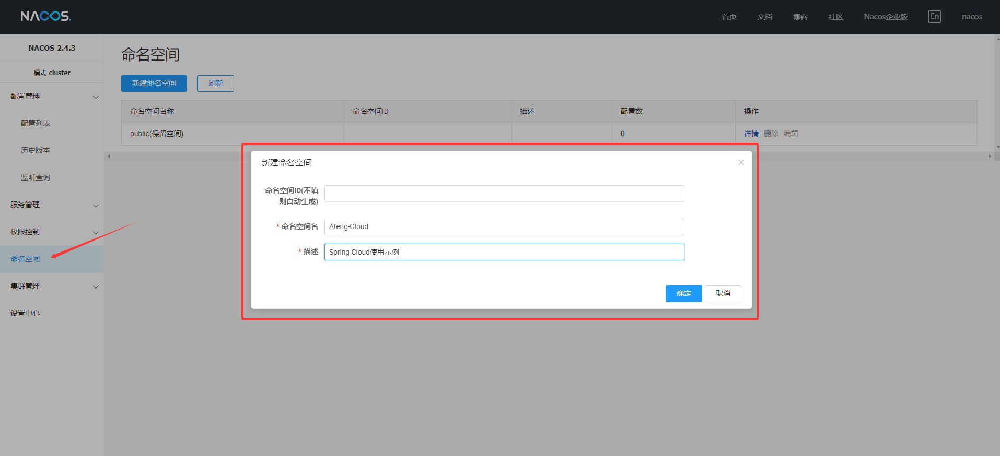
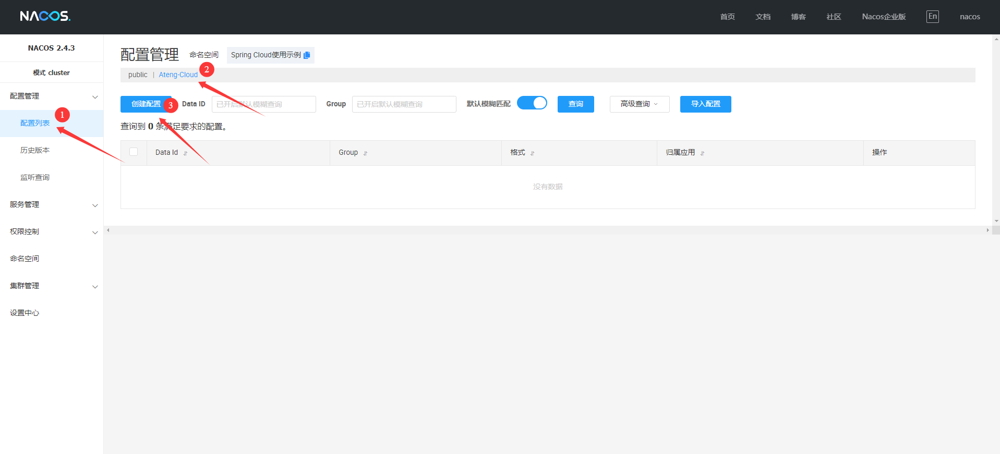
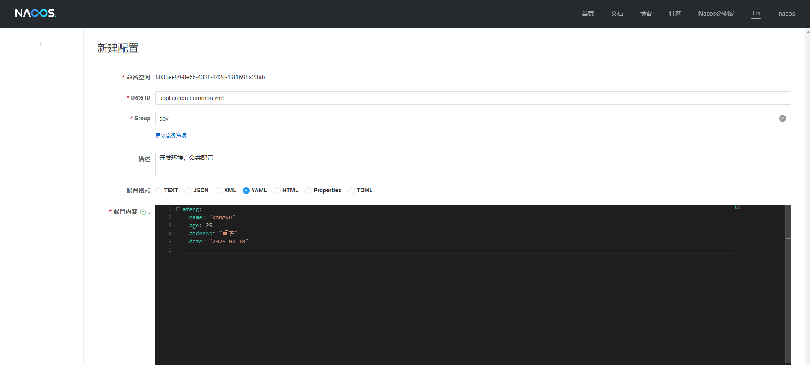
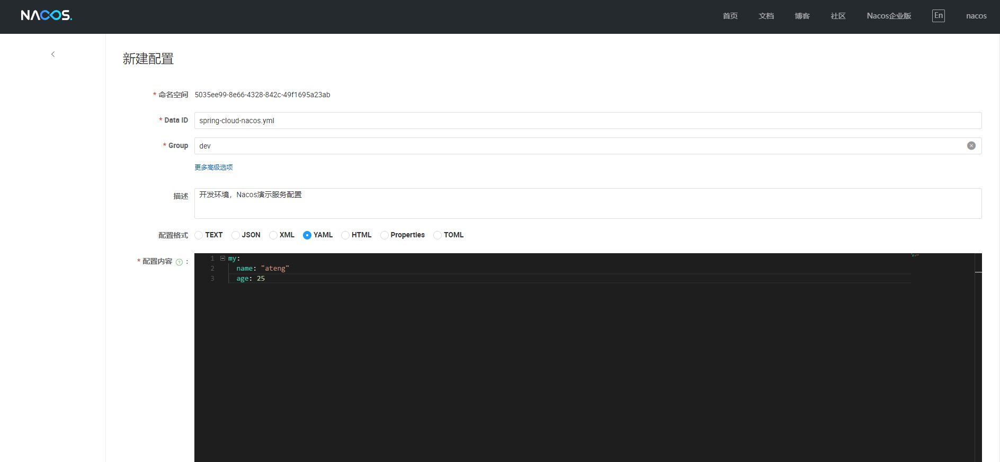
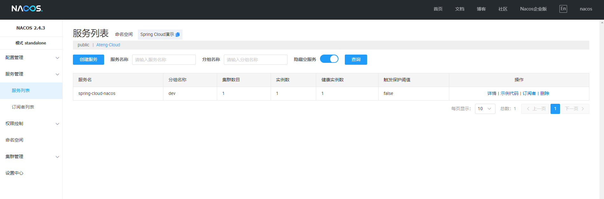

# Nacos

Nacos（"Dynamic Naming and Configuration Service"）是一个开源的动态服务发现、配置管理和服务管理平台，主要用于云原生应用和微服务架构中。它由阿里巴巴开源，旨在帮助开发者构建灵活、高可用的分布式系统。

Nacos通常与微服务架构中的其他组件一起使用，像是 Spring Cloud、Dubbo 等，成为分布式系统中服务治理和配置管理的重要一环。

- [官方文档](https://nacos.io/docs/v2.4/overview/)
- [GitHub](https://github.com/alibaba/nacos)

- [部署文档](https://kongyu666.github.io/ops/#/work/kubernetes/service/nacos/v2.4.3/)


## 基础配置

### 添加依赖

#### 添加依赖属性

```xml
<!-- 项目属性 -->
<properties>
    <java.version>21</java.version>
    <spring-boot.version>3.3.9</spring-boot.version>
    <spring-cloud.version>2023.0.5</spring-cloud.version>
    <spring-cloud-alibaba.version>2023.0.3.2</spring-cloud-alibaba.version>
</properties>
```

#### 添加依赖管理

```xml
<!-- 依赖管理 -->
<dependencyManagement>
    <dependencies>
        <dependency>
            <groupId>org.springframework.cloud</groupId>
            <artifactId>spring-cloud-dependencies</artifactId>
            <version>${spring-cloud.version}</version>
            <type>pom</type>
            <scope>import</scope>
        </dependency>
        <dependency>
            <groupId>org.springframework.boot</groupId>
            <artifactId>spring-boot-dependencies</artifactId>
            <version>${spring-boot.version}</version>
            <type>pom</type>
            <scope>import</scope>
        </dependency>
        <dependency>
            <groupId>com.alibaba.cloud</groupId>
            <artifactId>spring-cloud-alibaba-dependencies</artifactId>
            <version>${spring-cloud-alibaba.version}</version>
            <type>pom</type>
            <scope>import</scope>
        </dependency>
    </dependencies>
</dependencyManagement>
```

#### 添加依赖

```xml
<!-- 项目依赖 -->
<dependencies>
    <!-- Nacos 服务发现的依赖 -->
    <dependency>
        <groupId>com.alibaba.cloud</groupId>
        <artifactId>spring-cloud-starter-alibaba-nacos-discovery</artifactId>
    </dependency>

    <!-- Nacos 配置管理的依赖 -->
    <dependency>
        <groupId>com.alibaba.cloud</groupId>
        <artifactId>spring-cloud-starter-alibaba-nacos-config</artifactId>
    </dependency>
</dependencies>
```

#### 项目环境配置

```xml
<!-- 项目环境配置 -->
<profiles>
    <!-- 开发环境配置 -->
    <profile>
        <id>dev</id>
        <activation>
            <activeByDefault>true</activeByDefault>
        </activation>
        <properties>
            <profiles.active>dev</profiles.active>
            <profiles.desc>开发环境</profiles.desc>
            <logging.level>info</logging.level>
        </properties>
    </profile>

    <!-- 测试环境配置 -->
    <profile>
        <id>test</id>
        <properties>
            <profiles.active>test</profiles.active>
            <profiles.desc>测试环境</profiles.desc>
            <logging.level>info</logging.level>
        </properties>
    </profile>

    <!-- 生产环境配置 -->
    <profile>
        <id>prod</id>
        <properties>
            <profiles.active>prod</profiles.active>
            <profiles.desc>生产环境</profiles.desc>
            <logging.level>warn</logging.level>
        </properties>
    </profile>
</profiles>
```


#### 完整pom.xml

```xml
<?xml version="1.0" encoding="UTF-8"?>
<project xmlns:xsi="http://www.w3.org/2001/XMLSchema-instance" xmlns="http://maven.apache.org/POM/4.0.0"
         xsi:schemaLocation="http://maven.apache.org/POM/4.0.0 https://maven.apache.org/xsd/maven-4.0.0.xsd">
    <!-- 项目模型版本 -->
    <modelVersion>4.0.0</modelVersion>

    <!-- 项目坐标 -->
    <groupId>local.ateng.java</groupId>
    <artifactId>spring-cloud-nacos</artifactId>
    <version>v1.0</version>
    <name>spring-cloud-nacos</name>
    <description>
        Nacos：配置中心和注册中心的使用
    </description>
    <url>https://nacos.io/</url>

    <!-- 项目属性 -->
    <properties>
        <java.version>21</java.version>
        <project.build.sourceEncoding>UTF-8</project.build.sourceEncoding>
        <project.reporting.outputEncoding>UTF-8</project.reporting.outputEncoding>
        <spring-boot.version>3.3.9</spring-boot.version>
        <spring-cloud.version>2023.0.5</spring-cloud.version>
        <spring-cloud-alibaba.version>2023.0.3.2</spring-cloud-alibaba.version>
        <maven-compiler.version>3.12.1</maven-compiler.version>
        <lombok.version>1.18.36</lombok.version>
    </properties>

    <!-- 项目环境配置 -->
    <profiles>
        <!-- 开发环境配置 -->
        <profile>
            <id>dev</id>
            <activation>
                <activeByDefault>true</activeByDefault>
            </activation>
            <properties>
                <profiles.active>dev</profiles.active>
                <profiles.desc>开发环境</profiles.desc>
                <logging.level>info</logging.level>
            </properties>
        </profile>

        <!-- 测试环境配置 -->
        <profile>
            <id>test</id>
            <properties>
                <profiles.active>test</profiles.active>
                <profiles.desc>测试环境</profiles.desc>
                <logging.level>info</logging.level>
            </properties>
        </profile>

        <!-- 生产环境配置 -->
        <profile>
            <id>prod</id>
            <properties>
                <profiles.active>prod</profiles.active>
                <profiles.desc>生产环境</profiles.desc>
                <logging.level>warn</logging.level>
            </properties>
        </profile>
    </profiles>

    <!-- 项目依赖 -->
    <dependencies>
        <!-- Spring Boot Web Starter: 包含用于构建Web应用程序的Spring Boot依赖项 -->
        <dependency>
            <groupId>org.springframework.boot</groupId>
            <artifactId>spring-boot-starter-web</artifactId>
        </dependency>

        <!-- Spring Boot Starter Test: 包含用于测试Spring Boot应用程序的依赖项 -->
        <dependency>
            <groupId>org.springframework.boot</groupId>
            <artifactId>spring-boot-starter-test</artifactId>
            <scope>test</scope>
        </dependency>

        <!-- Lombok: 简化Java代码编写的依赖项 -->
        <!-- https://mvnrepository.com/artifact/org.projectlombok/lombok -->
        <dependency>
            <groupId>org.projectlombok</groupId>
            <artifactId>lombok</artifactId>
            <version>${lombok.version}</version>
            <scope>provided</scope>
        </dependency>

        <!-- Nacos 服务发现的依赖 -->
        <dependency>
            <groupId>com.alibaba.cloud</groupId>
            <artifactId>spring-cloud-starter-alibaba-nacos-discovery</artifactId>
        </dependency>

        <!-- Nacos 配置管理的依赖 -->
        <dependency>
            <groupId>com.alibaba.cloud</groupId>
            <artifactId>spring-cloud-starter-alibaba-nacos-config</artifactId>
        </dependency>

    </dependencies>

    <!-- 依赖管理 -->
    <dependencyManagement>
        <dependencies>
            <dependency>
                <groupId>org.springframework.boot</groupId>
                <artifactId>spring-boot-dependencies</artifactId>
                <version>${spring-boot.version}</version>
                <type>pom</type>
                <scope>import</scope>
            </dependency>
            <dependency>
                <groupId>org.springframework.cloud</groupId>
                <artifactId>spring-cloud-dependencies</artifactId>
                <version>${spring-cloud.version}</version>
                <type>pom</type>
                <scope>import</scope>
            </dependency>
            <dependency>
                <groupId>com.alibaba.cloud</groupId>
                <artifactId>spring-cloud-alibaba-dependencies</artifactId>
                <version>${spring-cloud-alibaba.version}</version>
                <type>pom</type>
                <scope>import</scope>
            </dependency>
        </dependencies>
    </dependencyManagement>

    <!-- 插件仓库配置 -->
    <repositories>
        <!-- Central Repository -->
        <repository>
            <id>central</id>
            <name>阿里云中央仓库</name>
            <url>https://maven.aliyun.com/repository/central</url>
            <!--<name>Maven官方中央仓库</name>
            <url>https://repo.maven.apache.org/maven2/</url>-->
        </repository>
    </repositories>

    <!-- 构建配置 -->
    <build>
        <finalName>${project.name}-${project.version}</finalName>
        <plugins>
            <!-- Maven 编译插件 -->
            <plugin>
                <groupId>org.apache.maven.plugins</groupId>
                <artifactId>maven-compiler-plugin</artifactId>
                <version>${maven-compiler.version}</version>
                <configuration>
                    <source>${java.version}</source>
                    <target>${java.version}</target>
                    <encoding>${project.build.sourceEncoding}</encoding>
                    <!-- 编译参数 -->
                    <compilerArgs>
                        <!-- 启用Java 8参数名称保留功能 -->
                        <arg>-parameters</arg>
                    </compilerArgs>
                </configuration>
            </plugin>

            <!-- Spring Boot Maven 插件 -->
            <plugin>
                <groupId>org.springframework.boot</groupId>
                <artifactId>spring-boot-maven-plugin</artifactId>
                <version>${spring-boot.version}</version>
                <executions>
                    <execution>
                        <id>repackage</id>
                        <goals>
                            <goal>repackage</goal>
                        </goals>
                    </execution>
                </executions>
            </plugin>
        </plugins>
        <resources>
            <!-- 第一个资源配置块 -->
            <resource>
                <directory>src/main/resources</directory>
                <filtering>false</filtering>
            </resource>
            <!-- 第二个资源配置块 -->
            <resource>
                <directory>src/main/resources</directory>
                <includes>
                    <include>application*</include>
                    <include>bootstrap*.yml</include>
                    <include>common*</include>
                    <include>banner*</include>
                </includes>
                <filtering>true</filtering>
            </resource>
        </resources>
    </build>

</project>
```


## 创建配置

### 创建命名空间



### 创建配置

进入 **新建配置** 页面



**创建公共配置**



**创建服务配置**




## 编辑配置

### 编辑配置文件

编辑 `application.yml`

```yaml
server:
  port: 11002
  servlet:
    context-path: /
spring:
  main:
    web-application-type: servlet
  application:
    name: ${project.artifactId}
---
# 环境配置
spring:
  profiles:
    active: @profiles.active@
    desc: @profiles.desc@
```

编辑 `application-dev.yml`

```yaml
# nacos 配置
spring:
  cloud:
    nacos:
      # nacos:8848 服务地址
      server-addr: 192.168.1.10:30648
      username: nacos
      password: Admin@123
      discovery:
        # 注册组
        group: ${spring.profiles.active}
        namespace: a8126e6d-5758-4f5b-b892-2522a250074c
      config:
        # 配置组
        group: ${spring.profiles.active}
        namespace: a8126e6d-5758-4f5b-b892-2522a250074c
  config:
    import: # 引入配置nacos中的配置application-common.yml
      - optional:nacos:application-common.yml
      - optional:nacos:${spring.application.name}.yml
```

### 创建配置属性

#### 创建配置属性

**AtengConfig**

```java
package local.ateng.java.cloud.config;

import lombok.Data;
import org.springframework.boot.context.properties.ConfigurationProperties;
import org.springframework.context.annotation.Configuration;

import java.time.LocalDate;

@Configuration
@ConfigurationProperties(prefix = "ateng")
@Data
public class AtengConfig {
    private String name;
    private Integer age;
    private String address;
    private LocalDate date;
}
```

**MyConfig**

```java
package local.ateng.java.cloud.config;

import lombok.Data;
import org.springframework.boot.context.properties.ConfigurationProperties;
import org.springframework.context.annotation.Configuration;

@Configuration
@ConfigurationProperties(prefix = "my")
@Data
public class MyConfig {
    private String name;
    private Integer age;
}
```

#### 创建接口

```java
package local.ateng.java.cloud.controller;

import local.ateng.java.cloud.config.AtengConfig;
import local.ateng.java.cloud.config.MyConfig;
import lombok.RequiredArgsConstructor;
import org.springframework.beans.factory.annotation.Autowired;
import org.springframework.web.bind.annotation.GetMapping;
import org.springframework.web.bind.annotation.RequestMapping;
import org.springframework.web.bind.annotation.RestController;

import java.util.LinkedHashMap;
import java.util.Map;

@RestController
@RequestMapping("/config")
@RequiredArgsConstructor(onConstructor = @__(@Autowired))
public class ConfigController {
    private final AtengConfig atengConfig;
    private final MyConfig myConfig;

    @GetMapping("/get")
    public Map<String, String> getConfig() {
        return new LinkedHashMap<>() {{
            put("ateng-config", atengConfig.toString());
            put("my-config", myConfig.toString());
        }};
    }

}
```


### 启动服务发现

```java
package local.ateng.java.cloud;

import org.springframework.boot.SpringApplication;
import org.springframework.boot.autoconfigure.SpringBootApplication;
import org.springframework.cloud.client.discovery.EnableDiscoveryClient;

@SpringBootApplication
@EnableDiscoveryClient // 启动Nacos服务发现
public class DistributedCloudNacosApplication {

    public static void main(String[] args) {
        SpringApplication.run(DistributedCloudNacosApplication.class, args);
    }

}
```


## 启动服务

### 查看服务列表



### 访问接口

在配置管理中修改了相关配置文件后，服务端也会动态刷新。

```
C:\Users\admin>curl localhost:11002/config/get
{"ateng-config":"AtengConfig(name=kongyu, age=25, address=重庆, date=2025-03-10)","my-config":"MyConfig(name=ateng, age=25)"}
```


## 负载均衡

在 **Spring Cloud** 中，如果你使用 **Nacos** 作为注册中心，并且启用了 **Spring Cloud LoadBalancer**，你可以使用 `lb://spring-cloud-nacos` 作为服务 URL。

### 添加依赖

```xml
<!-- Spring Cloud 负载均衡启动器依赖，用于客户端负载均衡 -->
<dependency>
    <groupId>org.springframework.cloud</groupId>
    <artifactId>spring-cloud-starter-loadbalancer</artifactId>
</dependency>
```

### 配置 RestTemplate

在 **Spring Boot** 配置类中定义了 **`@LoadBalanced`** 的 `RestTemplate`：

```java
@Configuration
public class RestTemplateConfig {
    @Bean
    @LoadBalanced // 让 RestTemplate 具有负载均衡能力
    public RestTemplate restTemplate() {
        return new RestTemplate();
    }
}
```

### 负载均衡访问

```java
@RestController
@RequestMapping("/consumer")
public class ConsumerController {

    @Autowired
    private RestTemplate restTemplate;

    @GetMapping("/call")
    public String callService() {
        return restTemplate.getForObject("lb://spring-cloud-nacos/config/get", String.class);
    }
}
```

**注意：**

- **`lb://spring-cloud-nacos`** 代表的是 **Nacos** 中注册的 `spring-cloud-nacos` 服务。
- **`@LoadBalanced`** 让 `RestTemplate` 具备 **负载均衡能力**，可以从 Nacos **动态解析** `spring-cloud-nacos` 的实例并进行调用。
