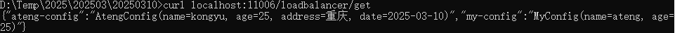

# Spring Cloud OpenFeign

Spring Cloud OpenFeign 是 Spring Cloud 生态系统中的一个声明式 HTTP 客户端。它基于 Feign 并与 Spring Boot 无缝集成，使开发者可以通过简单的 Java 接口来调用 REST API，而无需编写复杂的 HTTP 请求代码。它支持负载均衡（与 Ribbon 结合）、熔断（与 Resilience4j/Hystrix 结合）等功能，非常适用于微服务架构。

- [官方文档](https://docs.spring.io/spring-cloud-openfeign/docs/current/reference/html/)


## 基础配置

### 添加依赖

添加OpenFeign依赖

```xml
<!-- Spring Cloud OpenFeign 启动器依赖，用于声明式的 HTTP 客户端 -->
<dependency>
    <groupId>org.springframework.cloud</groupId>
    <artifactId>spring-cloud-starter-openfeign</artifactId>
</dependency>
```

完整pom.xml如下

```xml
<?xml version="1.0" encoding="UTF-8"?>
<project xmlns:xsi="http://www.w3.org/2001/XMLSchema-instance" xmlns="http://maven.apache.org/POM/4.0.0"
         xsi:schemaLocation="http://maven.apache.org/POM/4.0.0 https://maven.apache.org/xsd/maven-4.0.0.xsd">
    <!-- 项目模型版本 -->
    <modelVersion>4.0.0</modelVersion>

    <!-- 项目坐标 -->
    <groupId>local.ateng.java</groupId>
    <artifactId>spring-cloud-openfeign</artifactId>
    <version>v1.0</version>
    <name>spring-cloud-openfeign</name>
    <description>
        Spring Cloud OpenFeign 是 Spring Cloud 生态系统中的一个声明式 HTTP 客户端。
    </description>
    <url>https://docs.spring.io/spring-cloud-openfeign/docs/current/reference/html/</url>

    <!-- 项目属性 -->
    <properties>
        <java.version>21</java.version>
        <project.build.sourceEncoding>UTF-8</project.build.sourceEncoding>
        <project.reporting.outputEncoding>UTF-8</project.reporting.outputEncoding>
        <spring-boot.version>3.3.9</spring-boot.version>
        <spring-cloud.version>2023.0.5</spring-cloud.version>
        <spring-cloud-alibaba.version>2023.0.3.2</spring-cloud-alibaba.version>
        <maven-compiler.version>3.12.1</maven-compiler.version>
        <lombok.version>1.18.36</lombok.version>
    </properties>

    <!-- 项目环境配置 -->
    <profiles>
        <!-- 开发环境配置 -->
        <profile>
            <id>dev</id>
            <activation>
                <activeByDefault>true</activeByDefault>
            </activation>
            <properties>
                <profiles.active>dev</profiles.active>
                <profiles.desc>开发环境</profiles.desc>
                <logging.level>info</logging.level>
            </properties>
        </profile>

        <!-- 测试环境配置 -->
        <profile>
            <id>test</id>
            <properties>
                <profiles.active>test</profiles.active>
                <profiles.desc>测试环境</profiles.desc>
                <logging.level>info</logging.level>
            </properties>
        </profile>

        <!-- 生产环境配置 -->
        <profile>
            <id>prod</id>
            <properties>
                <profiles.active>prod</profiles.active>
                <profiles.desc>生产环境</profiles.desc>
                <logging.level>warn</logging.level>
            </properties>
        </profile>
    </profiles>

    <!-- 项目依赖 -->
    <dependencies>
        <!-- Spring Boot Web Starter: 包含用于构建Web应用程序的Spring Boot依赖项 -->
        <dependency>
            <groupId>org.springframework.boot</groupId>
            <artifactId>spring-boot-starter-web</artifactId>
        </dependency>

        <!-- Spring Boot Starter Test: 包含用于测试Spring Boot应用程序的依赖项 -->
        <dependency>
            <groupId>org.springframework.boot</groupId>
            <artifactId>spring-boot-starter-test</artifactId>
            <scope>test</scope>
        </dependency>

        <!-- Lombok: 简化Java代码编写的依赖项 -->
        <!-- https://mvnrepository.com/artifact/org.projectlombok/lombok -->
        <dependency>
            <groupId>org.projectlombok</groupId>
            <artifactId>lombok</artifactId>
            <version>${lombok.version}</version>
            <scope>provided</scope>
        </dependency>

        <!-- Nacos 服务发现的依赖 -->
        <dependency>
            <groupId>com.alibaba.cloud</groupId>
            <artifactId>spring-cloud-starter-alibaba-nacos-discovery</artifactId>
        </dependency>

        <!-- Nacos 配置管理的依赖 -->
        <dependency>
            <groupId>com.alibaba.cloud</groupId>
            <artifactId>spring-cloud-starter-alibaba-nacos-config</artifactId>
        </dependency>

        <!-- Spring Cloud OpenFeign 启动器依赖，用于声明式的 HTTP 客户端 -->
        <dependency>
            <groupId>org.springframework.cloud</groupId>
            <artifactId>spring-cloud-starter-openfeign</artifactId>
        </dependency>

    </dependencies>

    <!-- 依赖管理 -->
    <dependencyManagement>
        <dependencies>
            <dependency>
                <groupId>org.springframework.boot</groupId>
                <artifactId>spring-boot-dependencies</artifactId>
                <version>${spring-boot.version}</version>
                <type>pom</type>
                <scope>import</scope>
            </dependency>
            <dependency>
                <groupId>org.springframework.cloud</groupId>
                <artifactId>spring-cloud-dependencies</artifactId>
                <version>${spring-cloud.version}</version>
                <type>pom</type>
                <scope>import</scope>
            </dependency>
            <dependency>
                <groupId>com.alibaba.cloud</groupId>
                <artifactId>spring-cloud-alibaba-dependencies</artifactId>
                <version>${spring-cloud-alibaba.version}</version>
                <type>pom</type>
                <scope>import</scope>
            </dependency>
        </dependencies>
    </dependencyManagement>

    <!-- 插件仓库配置 -->
    <repositories>
        <!-- Central Repository -->
        <repository>
            <id>central</id>
            <name>阿里云中央仓库</name>
            <url>https://maven.aliyun.com/repository/central</url>
            <!--<name>Maven官方中央仓库</name>
            <url>https://repo.maven.apache.org/maven2/</url>-->
        </repository>
    </repositories>

    <!-- 构建配置 -->
    <build>
        <finalName>${project.name}-${project.version}</finalName>
        <plugins>
            <!-- Maven 编译插件 -->
            <plugin>
                <groupId>org.apache.maven.plugins</groupId>
                <artifactId>maven-compiler-plugin</artifactId>
                <version>${maven-compiler.version}</version>
                <configuration>
                    <source>${java.version}</source>
                    <target>${java.version}</target>
                    <encoding>${project.build.sourceEncoding}</encoding>
                    <!-- 编译参数 -->
                    <compilerArgs>
                        <!-- 启用Java 8参数名称保留功能 -->
                        <arg>-parameters</arg>
                    </compilerArgs>
                </configuration>
            </plugin>

            <!-- Spring Boot Maven 插件 -->
            <plugin>
                <groupId>org.springframework.boot</groupId>
                <artifactId>spring-boot-maven-plugin</artifactId>
                <version>${spring-boot.version}</version>
                <executions>
                    <execution>
                        <id>repackage</id>
                        <goals>
                            <goal>repackage</goal>
                        </goals>
                    </execution>
                </executions>
            </plugin>
        </plugins>
        <resources>
            <!-- 第一个资源配置块 -->
            <resource>
                <directory>src/main/resources</directory>
                <filtering>false</filtering>
            </resource>
            <!-- 第二个资源配置块 -->
            <resource>
                <directory>src/main/resources</directory>
                <includes>
                    <include>application*</include>
                    <include>bootstrap*.yml</include>
                    <include>common*</include>
                    <include>banner*</include>
                </includes>
                <filtering>true</filtering>
            </resource>
        </resources>
    </build>

</project>
```

### 编辑配置文件

application.yml

```yaml
server:
  port: 11006
  servlet:
    context-path: /
spring:
  main:
    web-application-type: servlet
  application:
    name: ${project.artifactId}
---
# 环境配置
spring:
  profiles:
    active: @profiles.active@
    desc: @profiles.desc@
```

application-dev.yml

```yaml
# nacos 配置
spring:
  cloud:
    nacos:
      # nacos:8848 服务地址
      server-addr: 192.168.1.10:30648
      username: nacos
      password: Admin@123
      discovery:
        # 注册组
        group: ${spring.profiles.active}
        namespace: a8126e6d-5758-4f5b-b892-2522a250074c
      config:
        # 配置组
        group: ${spring.profiles.active}
        namespace: a8126e6d-5758-4f5b-b892-2522a250074c
  config:
    import: # 引入配置nacos中的配置application-common.yml
      - optional:nacos:application-common.yml
      - optional:nacos:${spring.application.name}.yml
```


## 使用Feign

### 启用 Feign

```java
package local.ateng.java.cloud;

import org.springframework.boot.SpringApplication;
import org.springframework.boot.autoconfigure.SpringBootApplication;
import org.springframework.cloud.client.discovery.EnableDiscoveryClient;
import org.springframework.cloud.openfeign.EnableFeignClients;

@SpringBootApplication
@EnableDiscoveryClient // 启动Nacos服务发现
@EnableFeignClients  // 启用 Feign
public class DistributedCloudOpenFeignApplication {

    public static void main(String[] args) {
        SpringApplication.run(DistributedCloudOpenFeignApplication.class, args);
    }

}
```

### 定义 Feign 客户端

如果 `spring-cloud-nacos` 已注册到 Spring Cloud 注册中心（如 Nacos、Eureka），可以省略 `url`，Feign 会自动通过服务发现进行调用：

```java
package local.ateng.java.cloud.service;

import org.springframework.cloud.openfeign.FeignClient;
import org.springframework.web.bind.annotation.GetMapping;

@FeignClient(name = "spring-cloud-nacos")
public interface FeignLoadBalancerService {

    @GetMapping("/config/get")
    String get();

}
```


### 使用 Feign 客户端

#### 创建接口

```java
package local.ateng.java.cloud.controller;

import local.ateng.java.cloud.service.FeignLoadBalancerService;
import lombok.RequiredArgsConstructor;
import org.springframework.beans.factory.annotation.Autowired;
import org.springframework.web.bind.annotation.GetMapping;
import org.springframework.web.bind.annotation.RequestMapping;
import org.springframework.web.bind.annotation.RestController;

@RestController
@RequestMapping("/loadbalancer")
@RequiredArgsConstructor(onConstructor = @__(@Autowired))
public class LoadBalancerController {

    private final FeignLoadBalancerService feignLoadBalancerService;

    @GetMapping("/get")
    public String get() {
        return feignLoadBalancerService.get();
    }

}
```

#### 调用接口

```
curl localhost:11006/loadbalancer/get
```



## 熔断与降级处理

在分布式系统中，远程服务可能会因为网络问题、超时或高负载导致调用失败。Spring Cloud OpenFeign 可以结合 **Resilience4j** 或 **Sentinel** 来实现熔断和降级处理，从而提高系统的稳定性和可用性。

### 添加依赖

```xml
<!-- Resilience4j 熔断和降级 -->
<dependency>
    <groupId>org.springframework.cloud</groupId>
    <artifactId>spring-cloud-starter-circuitbreaker-resilience4j</artifactId>
</dependency>
```

### 编辑配置文件

```yaml
---
# 使用 Resilience4j 进行熔断
spring:
  cloud:
    openfeign:
      circuitbreaker:
        enabled: true
```

### 实现 Fallback 逻辑

```java
package local.ateng.java.cloud.service.fallback;

import local.ateng.java.cloud.service.FeignLoadBalancerService;
import org.springframework.stereotype.Component;

@Component
public class FeignLoadBalancerServiceFallback implements FeignLoadBalancerService {
    @Override
    public String get() {
        return "null";
    }
}
```

### Feign 客户端开启熔断

```java
package local.ateng.java.cloud.service;

import local.ateng.java.cloud.service.fallback.FeignLoadBalancerServiceFallback;
import org.springframework.cloud.openfeign.FeignClient;
import org.springframework.web.bind.annotation.GetMapping;

@FeignClient(name = "spring-cloud-nacos", fallback = FeignLoadBalancerServiceFallback.class)
public interface FeignLoadBalancerService {

    @GetMapping("/config/get")
    String get();

}
```

当 `spring-cloud-nacos` 服务超时或不可用时，就会熔断降级走 `fallback` 的默认值。


## 定义 Feign 客户端 🎯

### 基础 FeignClient 定义

使用 `@FeignClient` 定义 Feign 客户端接口，指定远程服务名称或 URL：

```java
import org.springframework.cloud.openfeign.FeignClient;
import org.springframework.web.bind.annotation.GetMapping;
import org.springframework.web.bind.annotation.PathVariable;

@FeignClient(name = "user-service", url = "http://localhost:8080") // 指定服务名或URL
public interface UserClient {
    @GetMapping("/users/{id}")
    User getUserById(@PathVariable("id") Long id);
}
```

### 指定服务名（结合 Spring Cloud LoadBalancer）

如果 `user-service` 已注册到 Spring Cloud 注册中心（如 Nacos、Eureka），可以省略 `url`，Feign 会自动通过服务发现进行调用：

```java
@FeignClient(name = "user-service") // 直接使用服务名
public interface UserClient {
    @GetMapping("/users/{id}")
    User getUserById(@PathVariable("id") Long id);
}
```

### 处理请求参数

- **路径参数（PathVariable）**

```java
@FeignClient(name = "order-service")
public interface OrderClient {
    @GetMapping("/orders/{orderId}")
    Order getOrderById(@PathVariable("orderId") Long orderId);
}
```

- **请求参数（RequestParam）**

```java
@FeignClient(name = "product-service")
public interface ProductClient {
    @GetMapping("/products")
    List<Product> getProducts(@RequestParam("category") String category);
}
```

- **请求体参数（RequestBody）**

```java
@FeignClient(name = "order-service")
public interface OrderClient {
    @PostMapping("/orders")
    Order createOrder(@RequestBody Order order);
}
```

### 配置 FeignClient 的 `contextId` 避免多个接口冲突

当多个 FeignClient 访问同一个服务但调用不同的 API 时，需要使用 `contextId` 以避免 Spring Bean 冲突：

```java
@FeignClient(name = "user-service", contextId = "userClientV1")
public interface UserClientV1 {
    @GetMapping("/users/v1/{id}")
    User getUserById(@PathVariable("id") Long id);
}

@FeignClient(name = "user-service", contextId = "userClientV2")
public interface UserClientV2 {
    @GetMapping("/users/v2/{id}")
    User getUserById(@PathVariable("id") Long id);
}
```

