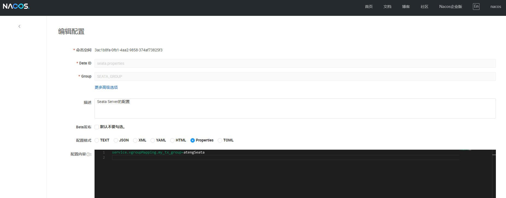
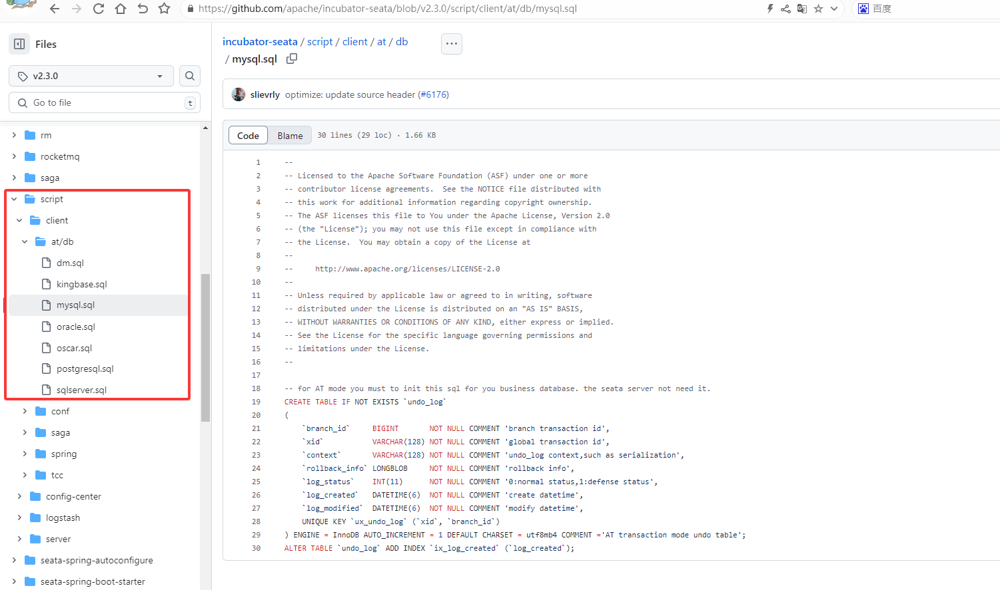

# Sentinel

Seata（Simple Extensible Autonomous Transaction Architecture）是一款开源的分布式事务解决方案，旨在解决微服务架构下的数据一致性问题。它提供了AT、TCC、SAGA和XA等多种事务模式，支持自动回滚和补偿机制。Seata通过事务协调器（TC）管理全局事务，确保各服务间的事务一致性。它易于集成，广泛兼容Spring Cloud、Dubbo等框架，是微服务环境中可靠的分布式事务解决方案。

- [官方文档](https://seata.apache.org/zh-cn/docs/overview/what-is-seata)
- [Seata Server安装](https://kongyu666.github.io/ops/#/work/kubernetes/service/seata/)


## 基础配置

### 添加依赖

```xml
<!-- Seata 分布式事务 -->
<dependency>
    <groupId>com.alibaba.cloud</groupId>
    <artifactId>spring-cloud-starter-alibaba-seata</artifactId>
</dependency>
```

### 添加配置文件

**在Nacos中配置应用的 Seata 配置**

- **`seata.service.vgroup-mapping.my_tx_group 和 seata.tx-service-group`**：名字保持一致，这是 Seata 的事务组名称。每个微服务都有自己的事务组名，用于标识全局事务。在 Seata Server 中会根据这个组名找到对应的事务协调器。
- **`seata.service.vgroup-mapping`**：**虚拟组映射配置**。Seata 使用 `tx-service-group` 和服务集群（Cluster）之间建立映射关系。`my_tx_group` → `atengSeata`：表示当前事务组 `my_tx_group` 对应于 Seata 服务集群 `atengSeata`。`atengSeata`为Seata Server的cluster名称，在Server的 `seata.registry.nacos.cluster` 参数设置。
- **`seata.registry`**：为Seata Server同一配置。
    - Seata Client：使用 `seata.registry` 查找 Seata Server 的地址，来加入全局事务。
    - Seata Server：使用 `seata.registry` 将自身注册到注册中心，供客户端发现。

```yaml
---
# Seata 配置
seata:
  tx-service-group: my_tx_group
  service:
    vgroup-mapping:
      my_tx_group: atengSeata
  registry:
    type: nacos
    nacos:
      server-addr: 192.168.1.10:30648
      username: nacos
      password: Admin@123
      namespace: 3ac1b8fa-0fb1-4aa2-9858-374af73825f3
      group: SEATA_GROUP
  config:
    type: nacos
    nacos:
      server-addr: 192.168.1.10:30648
      username: nacos
      password: Admin@123
      namespace: 3ac1b8fa-0fb1-4aa2-9858-374af73825f3
      group: SEATA_GROUP
      data-id: seata.properties
```

**在 Nacos 中添加配置文件，将事务分组映射Seata Server集群**

- `service.vgroupMapping`：用于将事务分组映射到 Seata Server 集群，便于客户端找到正确的事务协调器。
- `my_tx_group`：逻辑事务组名，标识当前微服务的事务组，Seata Client 根据此名称查找对应的集群。
- `atengSeata`：Seata Server 的集群名，实际运行的 Seata Server 所属的集群，用于协调和管理分布式事务。

```properties
service.vgroupMapping.my_tx_group=atengSeata
```




## 集成数据库

### 集成Mybatis Plus

参考 [Mybatis Plus使用文档](/work/Ateng-Java/database/mybatis-plus/)  集成数据库

### 创建undo_log表

AT模式客户端服务的数据库（业务库）都需要建表undo_log

SQL：[Github链接](https://github.com/apache/incubator-seata/blob/v2.3.0/script/client/at/db/mysql.sql)

- MySQL

```sql
CREATE TABLE IF NOT EXISTS `undo_log`
(
    `branch_id`     BIGINT       NOT NULL COMMENT 'branch transaction id',
    `xid`           VARCHAR(128) NOT NULL COMMENT 'global transaction id',
    `context`       VARCHAR(128) NOT NULL COMMENT 'undo_log context,such as serialization',
    `rollback_info` LONGBLOB     NOT NULL COMMENT 'rollback info',
    `log_status`    INT(11)      NOT NULL COMMENT '0:normal status,1:defense status',
    `log_created`   DATETIME(6)  NOT NULL COMMENT 'create datetime',
    `log_modified`  DATETIME(6)  NOT NULL COMMENT 'modify datetime',
    UNIQUE KEY `ux_undo_log` (`xid`, `branch_id`)
) ENGINE = InnoDB AUTO_INCREMENT = 1 DEFAULT CHARSET = utf8mb4 COMMENT ='AT transaction mode undo table';
ALTER TABLE `undo_log` ADD INDEX `ix_log_created` (`log_created`);
```

- PostgreSQL

```sql
CREATE TABLE IF NOT EXISTS public.undo_log
(
    id            SERIAL       NOT NULL,
    branch_id     BIGINT       NOT NULL,
    xid           VARCHAR(128) NOT NULL,
    context       VARCHAR(128) NOT NULL,
    rollback_info BYTEA        NOT NULL,
    log_status    INT          NOT NULL,
    log_created   TIMESTAMP(0) NOT NULL,
    log_modified  TIMESTAMP(0) NOT NULL,
    CONSTRAINT pk_undo_log PRIMARY KEY (id),
    CONSTRAINT ux_undo_log UNIQUE (xid, branch_id)
);
CREATE INDEX ix_log_created ON undo_log(log_created);

COMMENT ON TABLE public.undo_log IS 'AT transaction mode undo table';
COMMENT ON COLUMN public.undo_log.branch_id IS 'branch transaction id';
COMMENT ON COLUMN public.undo_log.xid IS 'global transaction id';
COMMENT ON COLUMN public.undo_log.context IS 'undo_log context,such as serialization';
COMMENT ON COLUMN public.undo_log.rollback_info IS 'rollback info';
COMMENT ON COLUMN public.undo_log.log_status IS '0:normal status,1:defense status';
COMMENT ON COLUMN public.undo_log.log_created IS 'create datetime';
COMMENT ON COLUMN public.undo_log.log_modified IS 'modify datetime';

CREATE SEQUENCE IF NOT EXISTS undo_log_id_seq INCREMENT BY 1 MINVALUE 1 ;
```




## 使用分布式事务

在 Spring Cloud Alibaba Seata 中，默认的事务模式是 **AT 模式（Automatic Transaction）**。

- **AT 模式**是 Seata 提供的 **自动补偿事务模式**，它适用于典型的关系型数据库（如 MySQL、PostgreSQL）。
- 它基于 **二阶段提交（Two-Phase Commit，2PC）**，但由 Seata 自动完成数据回滚和提交。
- 用户只需要在业务方法上标注 `@GlobalTransactional`，Seata 就会自动管理分布式事务的提交和回滚。

在多个模块中涉及写入数据到对应的数据库（数据库可以是不同的关系型数据库，例如一个MySQL、一个PostgreSQL），例如使用OpenFeign或者Dobbo。Seata 发现异常后会自动回滚所有已执行的 SQL。

在涉及到调用其他模块的方法中使用注解@GlobalTransactional

### 使用OpenFeign

```java
@GlobalTransactional
public void saveUser(MyUser myUser) {
    int num = new Random().nextInt(0, 2);
    // 当起模块写入
    this.save(myUser);
    // 其他远程模块写入，通过OpenFeign
    feignMyOrderService.save(MyOrder.builder().userId(myUser.getId()).date(LocalDate.now()).totalAmount(new BigDecimal("1213.12")).build());
    // 模拟异常
    if (num == 0) {
        throw new RuntimeException();
    }
}
```

### 使用Double

```java
@GlobalTransactional
public void saveUser(MyUser myUser) {
    int num = new Random().nextInt(0, 2);
    // 当起模块写入
    this.save(myUser);
    // 其他远程模块写入，通过Dubbo
    remoteOrderService.save(RemoteOrder.builder().userId(myUser.getId()).date(LocalDate.now()).totalAmount(new BigDecimal("1213.12")).build());
    // 模拟异常
    if (num == 0) {
        throw new RuntimeException();
    }
}
```

