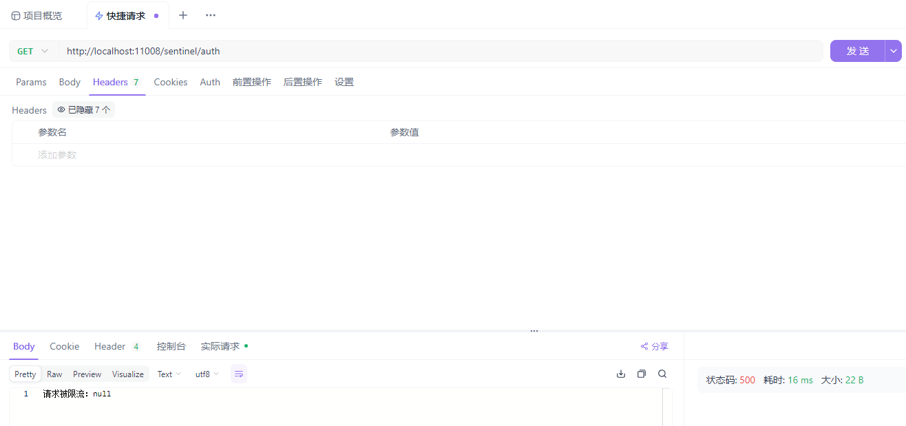

# Sentinel

**Sentinel** 是阿里巴巴开源的 **流量控制** 和 **熔断降级** 框架，专注于保障 **分布式系统稳定性**。它提供 **限流**（QPS/并发控制）、**熔断降级**（失败率、响应时间触发）、**热点参数限流**、**系统自适应保护** 等功能，并支持 **Sentinel Dashboard** 进行可视化监控和动态规则管理。Sentinel 可与 **Spring Cloud、Dubbo、Nacos** 等无缝集成，广泛应用于 **高并发场景**，如电商、支付系统等，有效防止流量突增导致的系统崩溃。

- [官网链接](https://sentinelguard.io/zh-cn/index.html)
- [集成SpringCloudAlibaba](https://github.com/alibaba/spring-cloud-alibaba/wiki/Sentinel)

- [Dashboard部署文档](https://atengk.github.io/ops/#/work/kubernetes/service/sentinel/)


## 基础配置

### 添加依赖

添加 Sentinel 依赖

```xml
<!-- Sentinel 流量治理 -->
<dependency>
    <groupId>com.alibaba.cloud</groupId>
    <artifactId>spring-cloud-starter-alibaba-sentinel</artifactId>
</dependency>
```

完整 pom.xml 文件如下

```xml
<?xml version="1.0" encoding="UTF-8"?>
<project xmlns:xsi="http://www.w3.org/2001/XMLSchema-instance" xmlns="http://maven.apache.org/POM/4.0.0"
         xsi:schemaLocation="http://maven.apache.org/POM/4.0.0 https://maven.apache.org/xsd/maven-4.0.0.xsd">
    <!-- 项目模型版本 -->
    <modelVersion>4.0.0</modelVersion>

    <!-- 项目坐标 -->
    <groupId>local.ateng.java</groupId>
    <artifactId>spring-cloud-sentinel</artifactId>
    <version>v1.0</version>
    <name>spring-cloud-sentinel</name>
    <description>
        Sentinel 面向分布式、多语言异构化服务架构的流量治理组件
    </description>
    <url>https://sentinelguard.io/zh-cn/index.html</url>

    <!-- 项目属性 -->
    <properties>
        <java.version>21</java.version>
        <project.build.sourceEncoding>UTF-8</project.build.sourceEncoding>
        <project.reporting.outputEncoding>UTF-8</project.reporting.outputEncoding>
        <spring-boot.version>3.3.9</spring-boot.version>
        <spring-cloud.version>2023.0.5</spring-cloud.version>
        <spring-cloud-alibaba.version>2023.0.3.2</spring-cloud-alibaba.version>
        <maven-compiler.version>3.12.1</maven-compiler.version>
        <lombok.version>1.18.36</lombok.version>
    </properties>

    <!-- 项目环境配置 -->
    <profiles>
        <!-- 开发环境配置 -->
        <profile>
            <id>dev</id>
            <activation>
                <activeByDefault>true</activeByDefault>
            </activation>
            <properties>
                <profiles.active>dev</profiles.active>
                <profiles.desc>开发环境</profiles.desc>
                <logging.level>info</logging.level>
            </properties>
        </profile>

        <!-- 测试环境配置 -->
        <profile>
            <id>test</id>
            <properties>
                <profiles.active>test</profiles.active>
                <profiles.desc>测试环境</profiles.desc>
                <logging.level>info</logging.level>
            </properties>
        </profile>

        <!-- 生产环境配置 -->
        <profile>
            <id>prod</id>
            <properties>
                <profiles.active>prod</profiles.active>
                <profiles.desc>生产环境</profiles.desc>
                <logging.level>warn</logging.level>
            </properties>
        </profile>
    </profiles>

    <!-- 项目依赖 -->
    <dependencies>
        <!-- Spring Boot Web Starter: 包含用于构建Web应用程序的Spring Boot依赖项 -->
        <dependency>
            <groupId>org.springframework.boot</groupId>
            <artifactId>spring-boot-starter-web</artifactId>
        </dependency>

        <!-- Spring Boot Starter Test: 包含用于测试Spring Boot应用程序的依赖项 -->
        <dependency>
            <groupId>org.springframework.boot</groupId>
            <artifactId>spring-boot-starter-test</artifactId>
            <scope>test</scope>
        </dependency>

        <!-- Lombok: 简化Java代码编写的依赖项 -->
        <!-- https://mvnrepository.com/artifact/org.projectlombok/lombok -->
        <dependency>
            <groupId>org.projectlombok</groupId>
            <artifactId>lombok</artifactId>
            <version>${lombok.version}</version>
            <scope>provided</scope>
        </dependency>

        <!-- Nacos 服务发现的依赖 -->
        <dependency>
            <groupId>com.alibaba.cloud</groupId>
            <artifactId>spring-cloud-starter-alibaba-nacos-discovery</artifactId>
        </dependency>

        <!-- Nacos 配置管理的依赖 -->
        <dependency>
            <groupId>com.alibaba.cloud</groupId>
            <artifactId>spring-cloud-starter-alibaba-nacos-config</artifactId>
        </dependency>

        <!-- Sentinel 流量治理 -->
        <dependency>
            <groupId>com.alibaba.cloud</groupId>
            <artifactId>spring-cloud-starter-alibaba-sentinel</artifactId>
        </dependency>

        <!-- 配置 Sentinel 配置 Nacos 的数据持久化 -->
        <dependency>
            <groupId>com.alibaba.csp</groupId>
            <artifactId>sentinel-datasource-nacos</artifactId>
        </dependency>

    </dependencies>

    <!-- 依赖管理 -->
    <dependencyManagement>
        <dependencies>
            <dependency>
                <groupId>org.springframework.boot</groupId>
                <artifactId>spring-boot-dependencies</artifactId>
                <version>${spring-boot.version}</version>
                <type>pom</type>
                <scope>import</scope>
            </dependency>
            <dependency>
                <groupId>org.springframework.cloud</groupId>
                <artifactId>spring-cloud-dependencies</artifactId>
                <version>${spring-cloud.version}</version>
                <type>pom</type>
                <scope>import</scope>
            </dependency>
            <dependency>
                <groupId>com.alibaba.cloud</groupId>
                <artifactId>spring-cloud-alibaba-dependencies</artifactId>
                <version>${spring-cloud-alibaba.version}</version>
                <type>pom</type>
                <scope>import</scope>
            </dependency>
        </dependencies>
    </dependencyManagement>

    <!-- 插件仓库配置 -->
    <repositories>
        <!-- Central Repository -->
        <repository>
            <id>central</id>
            <name>阿里云中央仓库</name>
            <url>https://maven.aliyun.com/repository/central</url>
            <!--<name>Maven官方中央仓库</name>
            <url>https://repo.maven.apache.org/maven2/</url>-->
        </repository>
    </repositories>

    <!-- 构建配置 -->
    <build>
        <finalName>${project.name}-${project.version}</finalName>
        <plugins>
            <!-- Maven 编译插件 -->
            <plugin>
                <groupId>org.apache.maven.plugins</groupId>
                <artifactId>maven-compiler-plugin</artifactId>
                <version>${maven-compiler.version}</version>
                <configuration>
                    <source>${java.version}</source>
                    <target>${java.version}</target>
                    <encoding>${project.build.sourceEncoding}</encoding>
                    <!-- 编译参数 -->
                    <compilerArgs>
                        <!-- 启用Java 8参数名称保留功能 -->
                        <arg>-parameters</arg>
                    </compilerArgs>
                </configuration>
            </plugin>

            <!-- Spring Boot Maven 插件 -->
            <plugin>
                <groupId>org.springframework.boot</groupId>
                <artifactId>spring-boot-maven-plugin</artifactId>
                <version>${spring-boot.version}</version>
                <executions>
                    <execution>
                        <id>repackage</id>
                        <goals>
                            <goal>repackage</goal>
                        </goals>
                    </execution>
                </executions>
            </plugin>
        </plugins>
        <resources>
            <!-- 第一个资源配置块 -->
            <resource>
                <directory>src/main/resources</directory>
                <filtering>false</filtering>
            </resource>
            <!-- 第二个资源配置块 -->
            <resource>
                <directory>src/main/resources</directory>
                <includes>
                    <include>application*</include>
                    <include>bootstrap*.yml</include>
                    <include>common*</include>
                    <include>banner*</include>
                </includes>
                <filtering>true</filtering>
            </resource>
        </resources>
    </build>

</project>
```


### 添加配置

在 Nacos 中添加 Sentinel 的地址信息

```yaml
# Sentinel 配置
spring:
  cloud:
    sentinel:
      transport:
        dashboard: 192.168.1.10:38858  # Sentinel 控制台地址
        port: 38719  # 发送心跳的端口（默认 8719）
```


### 创建接口

```java
package local.ateng.java.cloud.controller;

import com.alibaba.csp.sentinel.annotation.SentinelResource;
import com.alibaba.csp.sentinel.slots.block.BlockException;
import jakarta.servlet.http.HttpServletResponse;
import org.springframework.web.bind.annotation.GetMapping;
import org.springframework.web.bind.annotation.RequestMapping;
import org.springframework.web.bind.annotation.RequestParam;
import org.springframework.web.bind.annotation.RestController;
import org.springframework.web.context.request.RequestContextHolder;
import org.springframework.web.context.request.ServletRequestAttributes;

import java.util.Random;
import java.util.concurrent.TimeUnit;

@RestController
@RequestMapping("/sentinel")
public class SentinelController {

    /**
     * **1. 基本限流**
     * 演示 Sentinel 对接口的 QPS 限流
     */
    @GetMapping("/hello")
    @SentinelResource(value = "hello", blockHandler = "handleBlock")
    public String hello() {
        return "Hello Sentinel!";
    }

    /**
     * **2. 熔断降级**
     * 模拟耗时请求，当响应时间过长时触发降级
     */
    @GetMapping("/slowRequest")
    @SentinelResource(value = "slowRequest", blockHandler = "handleBlock", fallback = "handleFallback")
    public String slowRequest() throws InterruptedException {
        int delay = new Random().nextInt(3); // 随机 0~2 秒延迟
        TimeUnit.SECONDS.sleep(delay);

        // **主动抛出异常，触发 fallback**
        if (delay > 1) {
            throw new RuntimeException("请求超时，触发 fallback");
        }

        return "慢请求处理完成";

    }

    /**
     * **3. 热点参数限流**
     * 对特定参数进行限流
     */
    @GetMapping("/hotParam")
    @SentinelResource(value = "hotParam", blockHandler = "handleHotParam")
    public String hotParam(@RequestParam(value = "item", required = false) String item) {
        return "热点参数请求：" + item;
    }

    /**
     * **4. 访问控制**
     * 限制特定 IP 或应用访问
     */
    @GetMapping("/auth")
    @SentinelResource(value = "auth", blockHandler = "handleBlock")
    public String auth() {
        return "访问通过";
    }

    // ==================== 限流 / 熔断 / 访问控制 处理方法 ====================

    /**
     * **限流处理方法**
     * `blockHandler`：被限流时的处理逻辑
     */
    public String handleBlock(BlockException e) {
        // 通过 ThreadLocal 方式获取 response 并设置状态码
        HttpServletResponse response = ((ServletRequestAttributes) RequestContextHolder.getRequestAttributes()).getResponse();
        if (response != null) {
            response.setStatus(HttpServletResponse.SC_INTERNAL_SERVER_ERROR);  // 设置 HTTP 500 错误码
        }
        return "请求被限流：" + e.getMessage();
    }

    /**
     * **熔断降级处理方法**
     * `fallback`：接口发生异常时的处理逻辑
     */
    public String handleFallback(Throwable t) {
        // 通过 ThreadLocal 方式获取 response 并设置状态码
        HttpServletResponse response = ((ServletRequestAttributes) RequestContextHolder.getRequestAttributes()).getResponse();
        if (response != null) {
            response.setStatus(HttpServletResponse.SC_INTERNAL_SERVER_ERROR);  // 设置 HTTP 500 错误码
        }
        return "请求被熔断：" + t.getMessage();
    }

    /**
     * **热点参数限流处理**
     */
    public String handleHotParam(String item, BlockException e) {
        // 通过 ThreadLocal 方式获取 response 并设置状态码
        HttpServletResponse response = ((ServletRequestAttributes) RequestContextHolder.getRequestAttributes()).getResponse();
        if (response != null) {
            response.setStatus(HttpServletResponse.SC_INTERNAL_SERVER_ERROR);  // 设置 HTTP 500 错误码
        }
        return "热点参数限流：" + item;
    }
}
```


## 使用Sentinel

### 流控规则（Flow Rule）

通过设置每秒请求数（QPS）或并发数等方式限制接口流量，防止瞬时流量过载。支持排队等待、拒绝请求等处理方式，保障系统稳定性。还可根据调用关系设置不同的限流策略。

#### Nacos配置

在 Nacos 中添加配置，添加这个后需要重启相关的应用

```yaml
---
# 流控规则
spring:
  cloud:
    sentinel:
      datasource:
        flow:
          nacos:
            serverAddr: ${spring.cloud.nacos.server-addr}
            namespace: ${spring.cloud.nacos.config.namespace}
            username: ${spring.cloud.nacos.username}
            password: ${spring.cloud.nacos.password}
            groupId: ${spring.cloud.nacos.config.group}
            dataId: sentinel-flow.json
            dataType: json
            rule-type: flow
```


#### 添加规则

在以上配置的 `dataId` 创建规则配置，添加后立即生效

> 如果 `hello` 接口 **QPS 超过 2**，则 **超出的请求会被直接拒绝** 并触发 `blockHandler` 方法进行限流处理。

```json
[
    {
        "resource": "hello",
        "limitApp": "default",
        "grade": 1,
        "count": 2,
        "strategy": 0,
        "controlBehavior": 0,
        "clusterMode": false
    }
]
```


对应控制台参数，对于其他参数设置可以在dashboard中新增，浏览器使用调试（快捷键F12）查看接口调用的相关参数


#### 参数详解

| **参数**          | **类型**  | **含义**                                 | **可选值**                                                   |
| ----------------- | --------- | ---------------------------------------- | ------------------------------------------------------------ |
| `resource`        | `String`  | 受保护的资源（接口/方法名）              | 例如 `"hello"`                                               |
| `limitApp`        | `String`  | 限制的来源应用（"default" 表示所有来源） | `"default"` 或指定应用名                                     |
| `grade`           | `int`     | 限流模式                                 | `0`（**并发线程数** 限流） `1`（**QPS（每秒查询数）** 限流） |
| `count`           | `double`  | 阈值（限流阈值，单位随 `grade` 变化）    | 并发线程数或 QPS                                             |
| `strategy`        | `int`     | 限流策略（针对资源访问）                 | `0`（**直接限流**） `1`（**关联流控**） `2`（**链路流控**）  |
| `controlBehavior` | `int`     | 流控效果（如何处理超限流量）             | `0`（**快速失败**） `1`（**匀速排队**） `2`（**WarmUp 预热**） |
| `clusterMode`     | `boolean` | 是否启用集群模式                         | `false`（**单机模式**） `true`（**集群模式**）               |


#### 访问接口

```
curl http://localhost:11008/sentinel/hello
```

频繁访问该接口就会限流


### 熔断降级规则（Degrade Rule）

当接口的异常比例、慢调用比例或异常数达到阈值时，触发熔断。短期内拒绝请求，待恢复后自动关闭熔断，防止因服务故障导致的连锁崩溃，保护整体系统稳定。

#### Nacos配置

在 Nacos 中添加配置，添加这个后需要重启相关的应用

```yaml
---
# 熔断降级规则
spring:
  cloud:
    sentinel:
      datasource:
        degrade:
          nacos:
            serverAddr: ${spring.cloud.nacos.server-addr}
            namespace: ${spring.cloud.nacos.config.namespace}
            username: ${spring.cloud.nacos.username}
            password: ${spring.cloud.nacos.password}
            groupId: ${spring.cloud.nacos.config.group}
            dataId: sentinel-degrade.json
            dataType: json
            rule-type: degrade
```


#### 添加规则

在以上配置的 `dataId` 创建规则配置，添加后立即生效

> 如果 **1 秒内 `slowRequest` 请求中，80% 以上耗时超过 500ms**，则触发熔断，熔断 3 秒后自动恢复

```json
[
    {
        "resource": "slowRequest",
        "limitApp": "default",
        "grade": 0,
        "count": 500,
        "timeWindow": 3,
        "minRequestAmount": 1,
        "slowRatioThreshold": 0.8,
        "statIntervalMs": 1000
    }
]
```


对应控制台参数，对于其他参数设置可以在dashboard中新增，浏览器使用调试（快捷键F12）查看接口调用的相关参数


#### 参数详解

| **参数**             | **类型** | **含义**                    | **可选值**                                                |
| -------------------- | -------- | --------------------------- | --------------------------------------------------------- |
| `resource`           | `String` | 受保护的资源（接口/方法名） | 例如 `"hello"`                                            |
| `grade`              | `int`    | **熔断策略**                | `0`（**响应时间**） `1`（**异常比例**） `2`（**异常数**） |
| `count`              | `double` | **熔断阈值**                | **随 `grade` 变化**（响应时间/ms、异常比例、异常数）      |
| `timeWindow`         | `int`    | **熔断恢复时间**（秒）      | **超出阈值后，熔断多久恢复**                              |
| `minRequestAmount`   | `int`    | **最小请求数**              | **触发熔断的最小请求量**                                  |
| `slowRatioThreshold` | `double` | **慢调用比例阈值**          | **仅在 `grade=0` 时生效**                                 |
| `statIntervalMs`     | `int`    | **统计窗口时间（ms）**      | **用于计算失败率**                                        |


#### 访问接口

```
http://localhost:11008/sentinel/slowRequest
```

接口访问超时或异常都会触发熔断降级


### 热点参数限流规则（Param Flow Rule）

针对请求中某些重要参数（如商品ID、用户ID）进行限流。若某个参数的访问频率过高，可单独限制它的请求量，避免个别热点数据导致系统负载过高。

#### Nacos配置

在 Nacos 中添加配置，添加这个后需要重启相关的应用

```yaml
---
# 热点参数限流规则
spring:
  cloud:
    sentinel:
      datasource:
        param-flow:
          nacos:
            serverAddr: ${spring.cloud.nacos.server-addr}
            namespace: ${spring.cloud.nacos.config.namespace}
            username: ${spring.cloud.nacos.username}
            password: ${spring.cloud.nacos.password}
            groupId: ${spring.cloud.nacos.config.group}
            dataId: sentinel-param-flow.json
            dataType: json
            rule-type: param-flow
```


#### 添加规则

在以上配置的 `dataId` 创建规则配置，添加后立即生效

> 对 `hotParam` 方法的第一个参数进行热点限流，仅当参数值为 `"ateng"` 时，最大允许 QPS 为 `2`，超出后直接拒绝，而其他参数值不受限流影响。

```json
[
    {
        "resource": "hotParam",
        "limitApp": "default",
        "paramIdx": 0,
        "count": 0,
        "grade": 1,
        "controlBehavior": 0,
        "paramFlowItemList": [
            {
                "object": "ateng",
                "count": 2,
                "classType": "java.lang.String"
            }
        ]
    }
]
```


对应控制台参数


#### 参数详解

| **参数名**          | **类型**       | **默认值**  | **含义**                                                     |
| ------------------- | -------------- | ----------- | ------------------------------------------------------------ |
| `resource`          | `String`       | 无          | **资源名称**（接口或方法名），必填项                         |
| `paramIdx`          | `int`          | `-1`        | **热点参数索引（从 0 开始）**，-1 表示所有参数               |
| `grade`             | `int`          | `1`         | **限流模式：1 表示 QPS 模式**（每秒请求数）                  |
| `count`             | `double`       | `1.0`       | **默认情况下的 QPS 限流阈值**（即参数值未命中 `paramFlowItemList` 时适用） |
| `durationInSec`     | `int`          | `1`         | **统计时间窗口（单位：秒）**，超过 `count` 限流              |
| `controlBehavior`   | `int`          | `0`         | **流控效果：0=直接拒绝，1=匀速排队**                         |
| `burstCount`        | `int`          | `0`         | **令牌桶模式下的突发流量（未开启时填 0）**                   |
| `maxQueueingTimeMs` | `int`          | `500`       | **匀速排队模式下的最大排队等待时间（单位：毫秒）**           |
| `clusterMode`       | `boolean`      | `false`     | **是否启用集群模式**（默认为单机模式）                       |
| `paramFlowItemList` | `List<Object>` | `[]`        | **针对特定参数值的限流规则**（参数值、对应的 `count`）       |
| `regex`             | `boolean`      | `false`     | **是否使用正则匹配参数值**                                   |
| `limitApp`          | `String`       | `"default"` | **适用的调用来源**（`default` 代表适用于所有来源）           |

------

**参数例外项**

该参数用于对 **特定热点参数值** 设定不同的限流阈值。

| **字段名**  | **类型** | **含义**                                    |
| ----------- | -------- | ------------------------------------------- |
| `object`    | `Object` | **指定的参数值**（如 `"admin"`、`1001` 等） |
| `count`     | `double` | **该参数值的单独 QPS 限流阈值**             |
| `classType` |          | **参数类型**，表明该参数是字符串类型。      |


#### 访问接口

```
http://localhost:11008/sentinel/hotParam?item=ateng
```

频繁访问使用接口并且第一个参数是ateng的就会限流


### 访问控制规则（Authority Rule）

根据调用方身份、用户标签等维度限制访问权限。可通过黑名单、白名单方式控制哪些用户或服务可访问特定接口，确保敏感接口或资源的安全性。

#### 配置 RequestOriginParser

```java
package local.ateng.java.cloud.sentinel;

import com.alibaba.csp.sentinel.adapter.spring.webmvc_v6x.callback.RequestOriginParser;
import jakarta.servlet.http.HttpServletRequest;
import org.springframework.stereotype.Component;
import org.springframework.util.StringUtils;

/**
 * 自定义 RequestOriginParser 实现，用于解析 HTTP 请求中的 "origin" 请求头。
 * 该类可用于结合 Sentinel 授权规则，根据请求来源进行访问控制。
 * 如果 "origin" 请求头为空，返回默认值 "blank"。
 *
 * @author Ateng
 * @email 2385569970@qq.com
 * @since 2025-03-18
 */
@Component
public class HeaderOriginParser implements RequestOriginParser {

    /**
     * 解析请求头中的 "origin" 字段，返回其值；若为空，则返回 "blank"。
     *
     * @param request 当前 HTTP 请求
     * @return 请求来源标识
     */
    @Override
    public String parseOrigin(HttpServletRequest request) {
        String origin = request.getHeader("origin");
        if (StringUtils.isEmpty(origin)) {
            origin = "blank";
        }
        return origin;
    }
}
```

#### Nacos配置

在 Nacos 中添加配置，添加这个后需要重启相关的应用

```yaml
---
# 访问控制规则
spring:
  cloud:
    sentinel:
      datasource:
        authority:
          nacos:
            serverAddr: ${spring.cloud.nacos.server-addr}
            namespace: ${spring.cloud.nacos.config.namespace}
            username: ${spring.cloud.nacos.username}
            password: ${spring.cloud.nacos.password}
            groupId: ${spring.cloud.nacos.config.group}
            dataId: sentinel-authority.json
            dataType: json
            rule-type: authority
```


#### 添加规则

在以上配置的 `dataId` 创建规则配置，添加后立即生效

> 该配置定义了名为 `auth` 的接口访问控制规则，采用白名单策略 (`strategy: 0`)，只有 `ateng` 和 `ateng-gateway` 应用可以访问该接口。

```json
[
    {
        "resource": "auth",
        "limitApp": "ateng,ateng-gateway",
        "strategy": 0
    }
]
```


对应控制台参数


#### 参数详解

| 参数名称   | 说明                                                         | 示例值                  |
| ---------- | ------------------------------------------------------------ | ----------------------- |
| `resource` | 资源名称，指定要应用授权控制的接口资源。                     | `"auth"`                |
| `limitApp` | 限制的应用名称列表，多个应用之间使用逗号分隔。表示哪些应用可以访问该资源。 | `"ateng,ateng-gateway"` |
| `strategy` | 授权策略，决定是白名单策略还是黑名单策略： 0：白名单策略（默认） 1：黑名单策略 |                         |


#### 访问接口

```
http://localhost:11008/sentinel/auth
```

只允许Header中存在 `origin: ateng` 或者 `origin: ateng-gateway` 的请求


如果没有相关Header就会被拦截




### 系统规则（Systen Rule）

基于整体系统负载进行限流保护。当CPU使用率、内存占用或入口QPS超过设定阈值时，系统会自动触发限流或拒绝部分请求，优先保障核心功能的稳定运行。

#### Nacos配置

在 Nacos 中添加配置，添加这个后需要重启相关的应用

```yaml
---
# 系统规则
spring:
  cloud:
    sentinel:
      datasource:
        system:
          nacos:
            serverAddr: ${spring.cloud.nacos.server-addr}
            namespace: ${spring.cloud.nacos.config.namespace}
            username: ${spring.cloud.nacos.username}
            password: ${spring.cloud.nacos.password}
            groupId: ${spring.cloud.nacos.config.group}
            dataId: sentinel-system.json
            dataType: json
            rule-type: system
```


#### 添加规则

在以上配置的 `dataId` 创建规则配置，添加后立即生效

> 该配置将系统的 QPS 限制为 3，而其他参数（如系统负载、平均响应时间、线程数和 CPU 使用率）均不设置限制。

```json
[
    {
        "highestSystemLoad": -1.0,
        "avgRt": -1,
        "maxThread": -1,
        "qps": 3.0,
        "highestCpuUsage": -1.0
    }
]
```


对应控制台参数


#### 参数详解

以下是 Sentinel 系统规则中这些参数的配置实例及解释，以表格形式呈现：

| 参数类型   | 配置示例 | 解释                                                         |
| ---------- | -------- | ------------------------------------------------------------ |
| LOAD       | 5        | 系统负载阈值。通常设置为 CPU 核数的 2-3 倍，当系统负载超过该值时进行限流。 |
| RT         | 1000     | 响应时间阈值，单位为毫秒。当接口的平均响应时间超过该值时触发限流。 |
| 线程数     | 200      | 并发线程数阈值。当接口的并发线程数超过该值时执行限流。       |
| 入口 QPS   | 3000     | 每秒查询数（QPS）阈值。限制进入系统的请求数，避免系统过载。  |
| CPU 使用率 | 80       | CPU 使用率阈值，百分比形式。当 CPU 使用率超过该值时触发限流。 |


## 整合远程调用

### 整合OpenFeign

参考 [OpenFeign使用文档](/work/Ateng-Java/distributed/spring-cloud-openfeign/) 整合

添加配置文件，开启feign对sentinel的支持

```yaml
---
# 开启feign对sentinel的支持
feign:
  sentinel:
    enabled: true
```

使用OpenFeign

```java
@FeignClient(name = "spring-cloud-nacos", fallback = FeignLoadBalancerServiceFallback.class)
public interface FeignLoadBalancerService {

    @GetMapping("/config/get")
    String get();

}

@RestController
@RequestMapping("/loadbalancer")
@RequiredArgsConstructor(onConstructor = @__(@Autowired))
public class LoadBalancerController {

    private final FeignLoadBalancerService feignLoadBalancerService;

    @GetMapping("/get")
    public String get() {
        return feignLoadBalancerService.get();
    }

}
```

有调用到OpenFeign的地方就会这样显示，按照以上的操作进行相应的配置即可


### 整合Dubbo

参考 [Dubbo使用文档](/work/Ateng-Java/distributed/spring-cloud-dubbo-provider/) 整合

添加依赖

```xml
<!-- Sentinel 集成 Dubbo -->
<dependency>
    <groupId>org.apache.dubbo</groupId>
    <artifactId>dubbo-sentinel-spring-boot-starter</artifactId>
</dependency>
```

使用Dubbo

```java
@RestController
@RequestMapping("/dubbo")
public class DubboController {

    @DubboReference
    private RemoteUserService remoteUserService;

    @GetMapping("/get")
    public RemoteUser get() {
        return remoteUserService.getUser();
    }

}
```

有调用到Dubbo的地方就会这样显示，按照以上的操作进行相应的配置即可


