# Spring Cloud Stream

Spring Cloud Stream 是一个用于构建事件驱动的微服务的框架，它基于 Spring Boot 和 Spring Cloud，简化了消息驱动微服务的开发。它通过绑定器（Binder）将应用程序与消息中间件进行解耦，从而支持各种消息代理如 Kafka、RabbitMQ 等。

- [官方文档](https://docs.spring.io/spring-cloud-stream/reference/)


## Kafka

Kafka是一个开源的分布式流处理平台，主要用于处理实时数据流。它可以高效地发布和订阅消息，存储数据流，并处理这些数据。Kafka通常用于构建数据管道和流应用，能够保证高吞吐量、低延迟和高可扩展性。

- [官网链接](https://kafka.apache.org/)
- [SpringCloudStream使用文档](https://docs.spring.io/spring-cloud-stream/reference/kafka/kafka-binder/usage.html)
- [K8S部署文档](https://atengk.github.io/ops/#/work/kubernetes/service/kafka/v3.8.1/cluster/)
- [Docker部署文档](https://atengk.github.io/ops/#/work/docker/service/kafka/)

### 添加依赖

Spring Cloud Stream Kafka 依赖

```xml
<!-- Spring Cloud Stream Kafka 依赖 -->
<dependency>
    <groupId>org.springframework.cloud</groupId>
    <artifactId>spring-cloud-starter-stream-kafka</artifactId>
</dependency>
```

如果集成了Nacos相关的依赖，需要添加 `Actuator` 依赖。不然会有 `MeterRegistry` 相关报错，未正确初始化 Micrometer 监控系统

```xml
<!-- Spring Boot Actuator 依赖 -->
<dependency>
    <groupId>org.springframework.boot</groupId>
    <artifactId>spring-boot-starter-actuator</artifactId>
</dependency>
```

### 添加配置参数

添加 Spring Cloud Stream Kafka 配置 **全局默认参数（`default`）**和 **Kafka 绑定器（`binders`）**

- 全局默认参数（`default`）：指定默认的 Kafka 绑定器、设置默认的消费组、设置默认的消息格式为 JSON
    - **`binder: kafka-default`**: 指定默认使用 `kafka-default` 这个 binder（Kafka 连接配置）。
    - **`group: ateng-${spring.application.name:-0}-${spring.profiles.active:-0}`**:
        - `group` 是 Kafka 消费者组 ID，多个实例会共享消费。
        - 这里的 `${spring.application.name:-0}` 代表应用名，`${spring.profiles.active:-0}` 代表当前环境（如 `dev`、`prod`），用于动态生成唯一的消费者组名。
    - **`content-type: application/json`**: 消息默认使用 JSON 格式。
- Kafka 绑定器（`binders`）：Kafka 连接配置和相关参数的设置
    - **spring.cloud.stream.kafka.binder.brokers**: Kafka 服务器地址，`192.168.1.10:9094`。
    - **spring.cloud.stream.kafka.binder.producer-properties.max.request.size**: 生产者最大请求大小，`10MB`（10485760 字节）。
    - **spring.cloud.stream.kafka.binder.consumer-properties.fetch.max.bytes**: 消费者每次最大拉取大小，`10MB`（10485760 字节）。
    - **spring.cloud.stream.kafka.binder.consumer-properties.auto.offset.reset**: 无偏移量时的消费策略，`earliest`（从最早的消息开始消费）。常见值包括：`earliest`（从最早的消息开始消费，适用于日志分析、数据仓库等场景）、`latest`（默认，仅消费新消息，适用于实时监控、事件驱动架构）、`none`（无偏移量时抛出异常，适用于手动管理偏移量的严格控制场景）。

```yaml
---
# Spring Cloud Stream Kafka 配置
spring:
  cloud:
    stream:
      default:
        binder: kafka-default
        group: ateng-${spring.application.name:-0}-${spring.profiles.active:-0}
        content-type: application/json
      binders:
        kafka-default:
          type: kafka
          environment:
            spring.cloud.stream.kafka.binder.brokers: 192.168.1.10:9094
            spring.cloud.stream.kafka.binder.producer-properties:
              max.request.size: 10485760
            spring.cloud.stream.kafka.binder.consumer-properties:
              fetch.max.bytes: 10485760
              auto.offset.reset: earliest
```


### 字符串消息

#### 添加配置参数

添加 **生产者 & 消费者绑定** 和 **启用 Consumer 函数**

- 生产者 & 消费者绑定：生产者 (`-out-index`) 绑定，向 `my-string` 这个 Kafka 主题发送消息；消费者 (`-in-index`) 绑定，消费 `my-string` 主题的消息；指定了 `content-type: text/plain`，表示发送/消费文本消息。
- 启用 Consumer 函数：明确指定 启用 `myString` 这个 `@Bean` 消费者（`Consumer`）。
- 保持 `Bean方法名`、`definition` 和 `bindings` 的名称一致，避免额外配置！

```yaml
spring:
  cloud:
    stream:
      # 生产者 & 消费者绑定
      bindings:
        myString-out-0:
          destination: my-string
          content-type: text/plain
        myString-in-0:
          destination: my-string
          content-type: text/plain
    # 启用 Consumer 函数
    function:
      definition: myString
```

其他局部可以指定的相关属性，例如：

```yaml
spring:
  cloud:
    stream:
      bindings:
        myString-in-1:
          binder: kafka-default
          destination: my-string-other
          group: ateng-group
          content-type: text/plain
```

#### 创建生产者

创建生产者，用于发送消息

```java
package local.ateng.java.cloud.service;

import lombok.RequiredArgsConstructor;
import org.springframework.beans.factory.annotation.Autowired;
import org.springframework.cloud.stream.function.StreamBridge;
import org.springframework.messaging.Message;
import org.springframework.messaging.support.MessageBuilder;
import org.springframework.stereotype.Service;

@Service
@RequiredArgsConstructor(onConstructor = @__(@Autowired))
public class KafkaProducerService {

    private final StreamBridge streamBridge;

    public void sendMessage(String data) {
        Message<String> message = MessageBuilder.withPayload(data).build();
        streamBridge.send("myString-out-0", message);
    }

}
```

#### 创建消费者

```java
package local.ateng.java.cloud.service;

import org.springframework.context.annotation.Bean;
import org.springframework.stereotype.Service;

import java.util.function.Consumer;

@Service
public class KafkaConsumerService {

    @Bean
    public Consumer<String> myString() {
        return message -> {
            System.out.println("接受消息: " + message);
        };
    }

}
```

#### 创建接口

创建接口调用测试

```java
@RestController
@RequestMapping("/kafka")
@RequiredArgsConstructor(onConstructor = @__(@Autowired))
public class KafkaController {
    private final KafkaProducerService kafkaProducerService;

    @GetMapping("/send")
    public void send(String message) {
        kafkaProducerService.sendMessage(message);
    }

}
```

发送消息

```
curl localhost:11011/kafka/send?message=ateng_2024
```

可以看到控制台到接收的消息

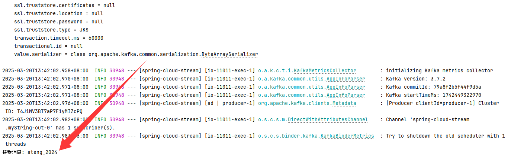

### JSON消息

#### 添加配置参数

添加 **生产者 & 消费者绑定** 和 **启用 Consumer 函数**

- 生产者 & 消费者绑定：生产者 (`-out-index`) 绑定，向 `my-user` 这个 Kafka 主题发送消息；消费者 (`-in-index`) 绑定，消费 `my-user` 主题的消息。
- 启用 Consumer 函数：明确指定 启用 `myUser` 这个 `@Bean` 消费者（`Consumer`），多个函数之间使用分号分割。
- 保持 `Bean方法名`、`definition` 和 `bindings` 的名称一致，避免额外配置！

```yaml
spring:
  cloud:
    stream:
      # 生产者 & 消费者绑定
      bindings:
        myUser-out-0:
          destination: my-user
        myUser-in-0:
          destination: my-user
    # 启用 Consumer 函数
    function:
      definition: myString;myUser
```

其他局部可以指定的相关属性，例如：

```yaml
spring:
  cloud:
    stream:
      bindings:
        myUser-in-1:
          binder: kafka-default
          destination: my-user-other
          group: ateng-group
          content-type: application/json
```

#### 创建生产者

创建生产者，用于发送消息

```java
package local.ateng.java.cloud.service;

import local.ateng.java.cloud.entity.MyUser;
import lombok.RequiredArgsConstructor;
import org.springframework.beans.factory.annotation.Autowired;
import org.springframework.cloud.stream.function.StreamBridge;
import org.springframework.messaging.Message;
import org.springframework.messaging.support.MessageBuilder;
import org.springframework.stereotype.Service;

@Service
@RequiredArgsConstructor(onConstructor = @__(@Autowired))
public class KafkaProducerService {

    private final StreamBridge streamBridge;

    public void sendMessage(MyUser data) {
        Message<MyUser> message = MessageBuilder.withPayload(data).build();
        streamBridge.send("myUser-out-0", message);
    }

}
```

#### 创建消费者

```java
package local.ateng.java.cloud.service;

import local.ateng.java.cloud.entity.MyUser;
import org.springframework.context.annotation.Bean;
import org.springframework.stereotype.Service;

import java.util.function.Consumer;

@Service
public class KafkaConsumerService {

    @Bean
    public Consumer<MyUser> myUser() {
        return message -> {
            System.out.println("接受消息: " + message);
        };
    }

}
```

#### 创建接口

创建接口调用测试

```java
@RestController
@RequestMapping("/kafka")
@RequiredArgsConstructor(onConstructor = @__(@Autowired))
public class KafkaController {
    private final KafkaProducerService kafkaProducerService;

    @PostMapping("/send")
    public void send(@RequestBody MyUser message) {
        kafkaProducerService.sendMessage(message);
    }

}
```

发送消息

```
curl -X POST http://localhost:11011/kafka/send \
     -H "Content-Type: application/json" \
     -d '{
           "id": 1,
           "name": "阿腾",
           "age": 25,
           "phoneNumber": "10086",
           "email": "2385569970@qq.com",
           "score": 99.99,
           "ratio": 0.88,
           "birthday": "2000-01-01",
           "province": "重庆市",
           "city": "重庆市",
           "createTime": "2025-03-20T09:41:21"
         }'
```

可以看到控制台到接收的消息

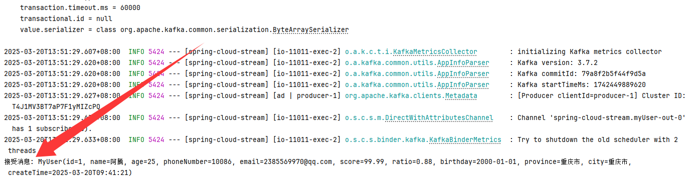


### 复杂消息

**发送消息**

```java
public void sendMessageParam(MyUser data) {
    String key = System.currentTimeMillis() + "";
    Message<MyUser> message = MessageBuilder
        .withPayload(data)
        .setHeader(KafkaHeaders.KEY, key.getBytes()) // Kafka消息Key
        .setHeader(KafkaHeaders.TIMESTAMP, System.currentTimeMillis()) // 时间戳
        .setHeader(KafkaHeaders.PARTITION, 0) // 指定分区
        .build();
    streamBridge.send("myUser-out-0", message);
    System.out.println("发送消息：" + message);
}
```

**接受消息**

```java
@Bean
public Consumer<Message<MyUser>> myUser() {
    return message -> {
        MessageHeaders headers = message.getHeaders();
        MyUser payload = message.getPayload();
        String topic = headers.get(KafkaHeaders.RECEIVED_TOPIC, String.class);
        String key = headers.get(KafkaHeaders.RECEIVED_KEY, String.class);
        Long timestamp = headers.get(KafkaHeaders.RECEIVED_TIMESTAMP, Long.class);
        Integer partition = headers.get(KafkaHeaders.RECEIVED_PARTITION, Integer.class);

        System.out.println(String.format("接受消息: Topic=%s, Payload=%s, Key=%s, Timestamp=%s, Partition=%s",
                                         topic, payload, key, timestamp, partition));
    };
}
```

输出如下内容：

```
接受消息: Topic=my-user, Payload=MyUser(id=1, name=阿腾, age=25, phoneNumber=10086, email=2385569970@qq.com, score=99.99, ratio=0.88, birthday=2000-01-01, province=重庆市, city=重庆市, createTime=2025-03-20T09:41:21), Key=1742453189574, Timestamp=1742453189574, Partition=0
```


### 批量消费消息

#### 添加配置参数

添加 **生产者 & 消费者绑定** 和 **启用 Consumer 函数**

- 生产者 & 消费者绑定：生产者 (`-out-index`) 绑定，向 `my-user-batch` 这个 Kafka 主题发送消息；消费者 (`-in-index`) 绑定，消费 `my-user-batch` 主题的消息；启用批量消费模式，一次性消费多条消息；设置消费并发数。
- 配置属性
    - **fetch.max.bytes**: 单次获取的最大字节数，限制消费者从 Kafka 拉取的数据大小，避免内存溢出（默认 50MB，这里设为 10MB）。
    - **fetch.min.bytes**: 最小获取字节数，Kafka 服务器只有在可提供数据大小达到该值时才返回数据，减少网络请求次数，提高吞吐量（这里设为 100KB）。
    - **fetch.max.wait.ms**: 最大等待时间（毫秒），如果数据量未达 `fetch.min.bytes`，Kafka 最多等待该时间再返回数据，以优化批量拉取（这里设为 5000ms）。
    - **max.poll.records**: 单次最多拉取的消息数，防止一次消费数据过多导致性能下降或超时（这里设为 100）。
- 启用 Consumer 函数：明确指定 启用 `myUserBatch` 这个 `@Bean` 消费者（`Consumer`），多个函数之间使用分号分割。
- 保持 `Bean方法名`、`definition` 和 `bindings` 的名称一致，避免额外配置！

```yaml
spring:
  cloud:
    stream:
      # 生产者 & 消费者绑定
      bindings:
        myUserBatch-out-0:
          destination: my-user-batch
        myUserBatch-in-0:
          destination: my-user-batch
          consumer:
            batch-mode: true
            concurrency: 3
      # 配置属性
      kafka:
        bindings:
          myUserBatch-in-0:
            consumer:
              configuration:
                fetch.max.bytes: 10485760
                fetch.min.bytes: 100000
                fetch.max.wait.ms: 5000
                max.poll.records: 100
    # 启用 Consumer 函数
    function:
      definition: myString;myUser;myUserBatch
```

#### 创建生产者

创建生产者，用于发送消息

```java
package local.ateng.java.cloud.service;

import local.ateng.java.cloud.entity.MyUser;
import lombok.RequiredArgsConstructor;
import org.springframework.beans.factory.annotation.Autowired;
import org.springframework.cloud.stream.function.StreamBridge;
import org.springframework.messaging.Message;
import org.springframework.messaging.support.MessageBuilder;
import org.springframework.stereotype.Service;

@Service
@RequiredArgsConstructor(onConstructor = @__(@Autowired))
public class KafkaProducerService {

    private final StreamBridge streamBridge;

    public void sendMessageBatch(MyUser data) {
        Message<MyUser> message = MessageBuilder.withPayload(data).build();
        streamBridge.send("myUserBatch-out-0", message);
    }

}
```

#### 创建消费者

```java
package local.ateng.java.cloud.service;

import local.ateng.java.cloud.entity.MyUser;
import org.springframework.context.annotation.Bean;
import org.springframework.stereotype.Service;

import java.util.List;
import java.util.function.Consumer;

@Service
public class KafkaConsumerService {

    @Bean
    public Consumer<List<MyUser>> myUserBatch() {
        return message -> {
            System.out.println("批量接受消息: " + message.size());
        };
    }

}
```

#### 创建接口

创建接口调用测试

```java
@RestController
@RequestMapping("/kafka")
@RequiredArgsConstructor(onConstructor = @__(@Autowired))
public class KafkaController {
    private final KafkaProducerService kafkaProducerService;

    @PostMapping("/send-batch")
    public void sendBatch(@RequestBody MyUser message) {
        kafkaProducerService.sendMessageBatch(message);
    }

}
```

发送消息

```
while true
do
    curl -X POST http://192.168.100.2:11011/kafka/send-batch \
     -H "Content-Type: application/json" \
     -d '{
           "id": 1,
           "name": "阿腾",
           "age": 25,
           "phoneNumber": "10086",
           "email": "2385569970@qq.com",
           "score": 99.99,
           "ratio": 0.88,
           "birthday": "2000-01-01",
           "province": "重庆市",
           "city": "重庆市",
           "createTime": "2025-03-20T09:41:21"
         }'
    sleep 0.1
done
```

可以看到控制台接收到100条消息后打印输出，5秒没有收到消息也打印输出


### 手动确认消息

#### 添加配置参数

添加 **生产者 & 消费者绑定** 、**配置属性** 和 **启用 Consumer 函数**

- 生产者 & 消费者绑定：生产者 (`-out-index`) 绑定，向 `my-user-manual` 这个 Kafka 主题发送消息；消费者 (`-in-index`) 绑定，消费 `my-user-manual` 主题的消息；消息重试的次数。
- 配置属性
    - `ack-mode: MANUAL`：开启手动确认模式。
- 启用 Consumer 函数：明确指定 启用 `myUserManual` 这个 `@Bean` 消费者（`Consumer`），多个函数之间使用分号分割。
- 保持 `Bean方法名`、`definition` 和 `bindings` 的名称一致，避免额外配置！

```yaml
spring:
  cloud:
    stream:
      # 生产者 & 消费者绑定
      bindings:
        myUserManual-out-0:
          destination: my-user-manual
        myUserManual-in-0:
          destination: my-user-manual
          consumer:
            max-attempts: 3
      # 配置属性
      kafka:
        bindings:
          myUserManual-in-0:
            consumer:
              ack-mode: MANUAL
    # 启用 Consumer 函数
    function:
      definition: myString;myUser;myUserBatch;myUserManual
```

#### 创建生产者

创建生产者，用于发送消息

```java
package local.ateng.java.cloud.service;

import local.ateng.java.cloud.entity.MyUser;
import lombok.RequiredArgsConstructor;
import org.springframework.beans.factory.annotation.Autowired;
import org.springframework.cloud.stream.function.StreamBridge;
import org.springframework.messaging.Message;
import org.springframework.messaging.support.MessageBuilder;
import org.springframework.stereotype.Service;

@Service
@RequiredArgsConstructor(onConstructor = @__(@Autowired))
public class KafkaProducerService {

    private final StreamBridge streamBridge;

    public void sendMessageManual(MyUser data) {
        Message<MyUser> message = MessageBuilder.withPayload(data).build();
        streamBridge.send("myUserManual-out-0", message);
    }

}
```

#### 创建消费者

```java
package local.ateng.java.cloud.service;

import local.ateng.java.cloud.entity.MyUser;
import org.springframework.context.annotation.Bean;
import org.springframework.kafka.support.Acknowledgment;
import org.springframework.kafka.support.KafkaHeaders;
import org.springframework.messaging.Message;
import org.springframework.stereotype.Service;

import java.util.Random;
import java.util.function.Consumer;

@Service
public class KafkaConsumerService {

    @Bean
    public Consumer<Message<MyUser>> myUserManual() {
        return message -> {
            MyUser payload = message.getPayload();
            System.out.println("收到消息: " + payload);
            Acknowledgment acknowledgment = message.getHeaders().get(KafkaHeaders.ACKNOWLEDGMENT, Acknowledgment.class);

            if (acknowledgment != null) {
                System.out.println("检测到消息确认对象，开始处理...");
                // 处理业务逻辑
                // processUser(myUser);
                if (new Random().nextInt(0, 2) == 0 || payload.getId() == 0) {
                    System.err.println("处理消息时发生异常，抛出异常，重新消费消息");
                    // 关键：抛出异常，防止偏移量提交
                    throw new RuntimeException("模拟业务异常");
                }

                // 手动确认消息
                acknowledgment.acknowledge();
                System.out.println("消息已成功确认。");
            } else {
                System.err.println("未找到消息确认对象，无法确认消息。");
            }
        };
    }

}
```

#### 创建接口

创建接口调用测试

```java
@RestController
@RequestMapping("/kafka")
@RequiredArgsConstructor(onConstructor = @__(@Autowired))
public class KafkaController {
    private final KafkaProducerService kafkaProducerService;

    @PostMapping("/send-manual")
    public void sendManual(@RequestBody MyUser message) {
        kafkaProducerService.sendMessageManual(message);
    }

}
```

发送消息，将id设置为0可以测试消息重试的次数，超过 `max-attempts` 设定的值就会报错。

```
curl -X POST http://localhost:11011/kafka/send-manual \
     -H "Content-Type: application/json" \
     -d '{
           "id": 1,
           "name": "阿腾",
           "age": 25,
           "phoneNumber": "10086",
           "email": "2385569970@qq.com",
           "score": 99.99,
           "ratio": 0.88,
           "birthday": "2000-01-01",
           "province": "重庆市",
           "city": "重庆市",
           "createTime": "2025-03-20T09:41:21"
         }'
```

可以看到方法类有异常抛出的情况下就会重新消费消息

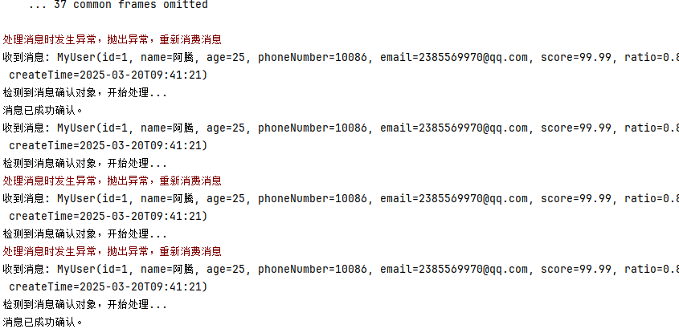


### 死信队列

死信队列（DLQ）用于存储 **无法成功处理的消息**，避免数据丢失，并提供**后续分析或补偿的机会**。

#### 添加配置参数

添加 **生产者 & 消费者绑定** 、**配置属性** 和 **启用 Consumer 函数**

- 生产者 & 消费者绑定：生产者 (`-out-index`) 绑定，向 `my-user-manual` 这个 Kafka 主题发送消息；消费者 (`-in-index`) 绑定，消费 `my-user-manual` 主题的消息；消息重试的次数。
- 配置属性
    - `ack-mode: MANUAL`：开启手动确认模式。
    - `enable-dlq: true`：开启死信队列，当消费消息达到一定重试次数（`max-attempts`）后就将该消息发送到死信队列中。
    - `dlq-name: my-user-dlq`：指定死信队列的名称。
- 启用 Consumer 函数：明确指定 启用 `myUserManual` 这个 `@Bean` 消费者（`Consumer`），多个函数之间使用分号分割。
- 保持 `Bean方法名`、`definition` 和 `bindings` 的名称一致，避免额外配置！

```yaml
spring:
  cloud:
    stream:
      # 生产者 & 消费者绑定
      bindings:
        myUserManual-out-0:
          destination: my-user-manual
        myUserManual-in-0:
          destination: my-user-manual
          consumer:
            max-attempts: 3
      # 配置属性
      kafka:
        bindings:
          myUserManual-in-0:
            consumer:
              ack-mode: MANUAL
              enable-dlq: true
              dlq-name: my-user-dlq
    # 启用 Consumer 函数
    function:
      definition: myString;myUser;myUserBatch;myUserManual
```

#### 创建生产者

创建生产者，用于发送消息

```java
package local.ateng.java.cloud.service;

import local.ateng.java.cloud.entity.MyUser;
import lombok.RequiredArgsConstructor;
import org.springframework.beans.factory.annotation.Autowired;
import org.springframework.cloud.stream.function.StreamBridge;
import org.springframework.messaging.Message;
import org.springframework.messaging.support.MessageBuilder;
import org.springframework.stereotype.Service;

@Service
@RequiredArgsConstructor(onConstructor = @__(@Autowired))
public class KafkaProducerService {

    private final StreamBridge streamBridge;

    public void sendMessageManual(MyUser data) {
        Message<MyUser> message = MessageBuilder.withPayload(data).build();
        streamBridge.send("myUserManual-out-0", message);
    }

}
```

#### 创建消费者

```java
package local.ateng.java.cloud.service;

import local.ateng.java.cloud.entity.MyUser;
import org.springframework.context.annotation.Bean;
import org.springframework.kafka.support.Acknowledgment;
import org.springframework.kafka.support.KafkaHeaders;
import org.springframework.messaging.Message;
import org.springframework.stereotype.Service;

import java.util.Random;
import java.util.function.Consumer;

@Service
public class KafkaConsumerService {

    @Bean
    public Consumer<Message<MyUser>> myUserManual() {
        return message -> {
            MyUser payload = message.getPayload();
            System.out.println("收到消息: " + payload);
            Acknowledgment acknowledgment = message.getHeaders().get(KafkaHeaders.ACKNOWLEDGMENT, Acknowledgment.class);

            if (acknowledgment != null) {
                System.out.println("检测到消息确认对象，开始处理...");
                // 处理业务逻辑
                // processUser(myUser);
                if (new Random().nextInt(0, 2) == 0 || payload.getId() == 0) {
                    System.err.println("处理消息时发生异常，抛出异常，重新消费消息");
                    // 关键：抛出异常，防止偏移量提交
                    throw new RuntimeException("模拟业务异常");
                }

                // 手动确认消息
                acknowledgment.acknowledge();
                System.out.println("消息已成功确认。");
            } else {
                System.err.println("未找到消息确认对象，无法确认消息。");
            }
        };
    }

}
```

#### 创建接口

创建接口调用测试

```java
@RestController
@RequestMapping("/kafka")
@RequiredArgsConstructor(onConstructor = @__(@Autowired))
public class KafkaController {
    private final KafkaProducerService kafkaProducerService;

    @PostMapping("/send-manual")
    public void sendManual(@RequestBody MyUser message) {
        kafkaProducerService.sendMessageManual(message);
    }

}
```

发送消息，将id设置为0可以测试消息重试的次数，超过 `max-attempts` 设定的值就会报错。

```
curl -X POST http://localhost:11011/kafka/send-manual \
     -H "Content-Type: application/json" \
     -d '{
           "id": 1,
           "name": "阿腾",
           "age": 25,
           "phoneNumber": "10086",
           "email": "2385569970@qq.com",
           "score": 99.99,
           "ratio": 0.88,
           "birthday": "2000-01-01",
           "province": "重庆市",
           "city": "重庆市",
           "createTime": "2025-03-20T09:41:21"
         }'
```

可以看到方法类有异常抛出的情况下就会重新消费消息，超过 `max-attempts` 设定的值就会将该消息发送给 死信队列 my-user-dlq。

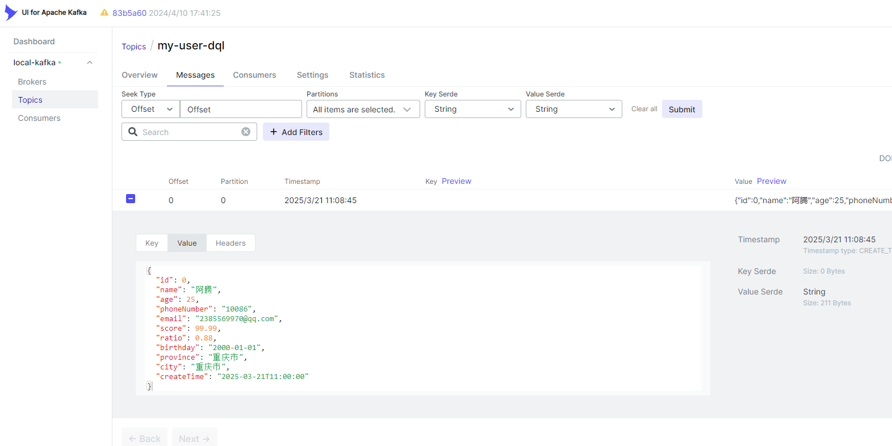

#### 监听死信队列

如果需要监听死信队列并处理消息可以参考以下步骤

**添加配置参数**

```yaml
spring:
  cloud:
    stream:
      # 生产者 & 消费者绑定
      bindings:
        myUserDlq-in-0:
          binder: kafka-default
          destination: my-user-dlq
          group: ateng-group
          content-type: text/plain
    # 启用 Consumer 函数
    function:
      definition: myString;myUser;myUserBatch;myUserManual;myUserDlq
```

**创建消费者**

```java
@Bean
public Consumer<String> myUserDlq() {
    return message -> {
        System.out.println("接受死信队列的消息: " + message);
    };
}
```

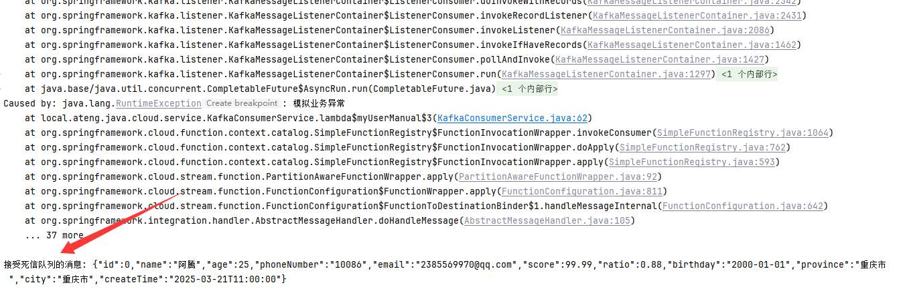


### 多数据源

#### 添加配置参数

在 `spring.cloud.stream.binders` 添加其他Kafka配置，相关参数可以参考 `kafka-default（自定义命名）`，例如这里添加了一个名为 `kafka-other` 的bingder，再后续的bindings中可以指定binder为kafka-other。

```yaml
---
# Spring Cloud Stream Kafka 配置
spring:
  cloud:
    stream:
      default:
        binder: kafka-default
        group: ateng-${spring.application.name:-0}-${spring.profiles.active:-0}
        content-type: application/json
      binders:
        kafka-default:
          type: kafka
          environment:
            spring.cloud.stream.kafka.binder.brokers: 192.168.1.10:9094
            spring.cloud.stream.kafka.binder.producer-properties:
              max.request.size: 10485760
            spring.cloud.stream.kafka.binder.consumer-properties:
              fetch.max.bytes: 10485760
              auto.offset.reset: earliest
        kafka-other:
          type: kafka
          environment:
            spring.cloud.stream.kafka.binder.brokers: 47.108.163.211:22286
            spring.cloud.stream.kafka.binder.producer-properties:
              max.request.size: 10485760  # 生产者最大请求大小 10MB
            spring.cloud.stream.kafka.binder.consumer-properties:
              fetch.max.bytes: 10485760  # 消费者最大拉取大小 10MB
              auto.offset.reset: earliest  # earliest or latest
      # 生产者 & 消费者绑定
      bindings:
        myUser-out-0:
          destination: my-user
        myUser-in-0:
          destination: my-user
        myUserOther-out-0:
          binder: kafka-other
          destination: my-user-other
        myUserOther-in-0:
          binder: kafka-other
          destination: my-user-other
    # 启用 Consumer 函数
    function:
      definition: myString;myUser;myUserOther
```

#### 创建生产者

创建生产者，用于发送消息

```java
package local.ateng.java.cloud.service;

import local.ateng.java.cloud.entity.MyUser;
import lombok.RequiredArgsConstructor;
import org.springframework.beans.factory.annotation.Autowired;
import org.springframework.cloud.stream.function.StreamBridge;
import org.springframework.messaging.Message;
import org.springframework.messaging.support.MessageBuilder;
import org.springframework.stereotype.Service;

@Service
@RequiredArgsConstructor(onConstructor = @__(@Autowired))
public class KafkaProducerService {

    private final StreamBridge streamBridge;

    public void sendMessageOther(MyUser data) {
        Message<MyUser> message = MessageBuilder.withPayload(data).build();
        streamBridge.send("myUserOther-out-0", message);
    }

}
```

#### 创建消费者

```java
package local.ateng.java.cloud.service;

import local.ateng.java.cloud.entity.MyUser;
import org.springframework.context.annotation.Bean;
import org.springframework.stereotype.Service;

import java.util.function.Consumer;

@Service
public class KafkaConsumerService {

    @Bean
    public Consumer<MyUser> myUserOther() {
        return message -> {
            System.out.println("接受消息: " + message);
        };
    }

}
```

#### 创建接口

创建接口调用测试

```java
@RestController
@RequestMapping("/kafka")
@RequiredArgsConstructor(onConstructor = @__(@Autowired))
public class KafkaController {
    private final KafkaProducerService kafkaProducerService;

    @PostMapping("/send-other")
    public void sendOther(@RequestBody MyUser message) {
        kafkaProducerService.sendMessageOther(message);
    }

}
```

发送消息

```
curl -X POST http://localhost:11011/kafka/send-other \
     -H "Content-Type: application/json" \
     -d '{
           "id": 1,
           "name": "阿腾",
           "age": 25,
           "phoneNumber": "10086",
           "email": "2385569970@qq.com",
           "score": 99.99,
           "ratio": 0.88,
           "birthday": "2000-01-01",
           "province": "重庆市",
           "city": "重庆市",
           "createTime": "2025-03-20T09:41:21"
         }'
```

可以看到控制台到接收的消息

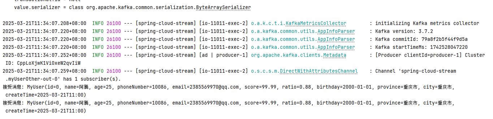

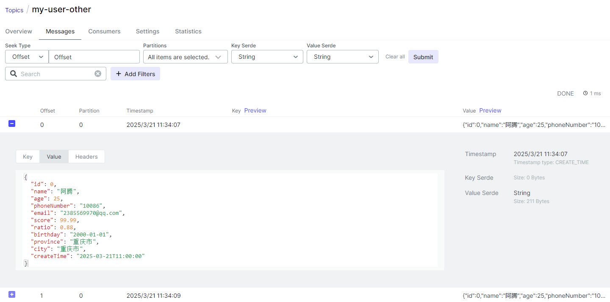


## RabbitMQ

RabbitMQ 是一种开源的消息代理软件，广泛用于实现消息队列系统。它支持多种消息传递模式，满足不同的应用需求。RabbitMQ 基于 AMQP (Advanced Message Queuing Protocol) 协议，它为不同的消息传递方式提供了多种机制，通常通过 交换机（Exchange）、队列（Queue）和 路由键（Routing Key）来定义消息的流动和处理方式。

- [官网链接](https://www.rabbitmq.com/)
- [SpringCloudStream使用文档](https://docs.spring.io/spring-cloud-stream/reference/rabbit/rabbit_overview.html)
- [K8S部署文档](https://atengk.github.io/ops/#/work/kubernetes/service/rabbitmq/v4.0.2/)
- [Docker部署文档](https://atengk.github.io/ops/#/work/docker/service/rabbitmq/)

### 添加依赖

Spring Cloud Stream RabbitMQ 依赖

```xml
<!-- Spring Cloud Stream RabbitMQ 依赖 -->
<dependency>
    <groupId>org.springframework.cloud</groupId>
    <artifactId>spring-cloud-starter-stream-rabbit</artifactId>
</dependency>
```

### 添加配置参数

添加 Spring Cloud Stream Kafka 配置 **全局默认参数（`default`）**和 **RabbitMQ绑定器（`binders`）**

- 全局默认参数（`default`）：指定默认的 RabbitMQ绑定器、设置默认的消费组、设置默认的消息格式为 JSON
- RabbitMQ绑定器（`binders`）：RabbitMQ 连接配置和相关参数的设置

```yaml
---
# Spring Cloud Stream RabbitMQ 配置
spring:
  cloud:
    stream:
      default:
        binder: rabbit-default
        group: ateng-${spring.application.name:-0}-${spring.profiles.active:-0}
        content-type: application/json
      binders:
        rabbit-default:
          type: rabbit
          environment:
            spring.rabbitmq.addresses: 192.168.1.10:29210
            spring.rabbitmq.username: admin
            spring.rabbitmq.password: Admin@123
            spring.rabbitmq.virtual-host: /
```

### JSON消息

#### 添加配置参数

添加 **生产者 & 消费者绑定** 和 **启用 Consumer 函数**

- 生产者 & 消费者绑定：生产者 (`-out-index`) 绑定，向 `my-user` 这个 RabbitMQ 主题发送消息；消费者 (`-in-index`) 绑定，消费 `my-user` 主题的消息。
- 启用 Consumer 函数：明确指定 启用 `myUser` 这个 `@Bean` 消费者（`Consumer`），多个函数之间使用分号分割。
- 保持 `Bean方法名`、`definition` 和 `bindings` 的名称一致，避免额外配置！

```yaml
spring:
  cloud:
    stream:
      # 生产者 & 消费者绑定
      bindings:
        myUser-out-0:
          destination: my-user
        myUser-in-0:
          destination: my-user
    # 启用 Consumer 函数
    function:
      definition: myUser
```

其他局部可以指定的相关属性，例如：

```yaml
spring:
  cloud:
    stream:
      bindings:
        myUser-in-1:
          binder: rabbit-default
          destination: my-user-other
          group: ateng-group
          content-type: application/json
```

#### 创建生产者

创建生产者，用于发送消息

```java
package local.ateng.java.cloud.service;

import local.ateng.java.cloud.entity.MyUser;
import lombok.RequiredArgsConstructor;
import org.springframework.beans.factory.annotation.Autowired;
import org.springframework.cloud.stream.function.StreamBridge;
import org.springframework.messaging.Message;
import org.springframework.messaging.support.MessageBuilder;
import org.springframework.stereotype.Service;

@Service
@RequiredArgsConstructor(onConstructor = @__(@Autowired))
public class RabbitProducerService {

    private final StreamBridge streamBridge;

    public void sendMessage(MyUser data) {
        Message<MyUser> message = MessageBuilder.withPayload(data).build();
        streamBridge.send("myUser-out-0", message);
    }

}
```

#### 创建消费者

```java
package local.ateng.java.cloud.service;

import local.ateng.java.cloud.entity.MyUser;
import org.springframework.context.annotation.Bean;
import org.springframework.stereotype.Service;

import java.util.function.Consumer;

@Service
public class RabbitConsumerService {

    @Bean
    public Consumer<MyUser> myUser() {
        return message -> {
            System.out.println("接受消息: " + message);
        };
    }

}
```

#### 创建接口

创建接口调用测试

```java
@RestController
@RequestMapping("/rabbit")
@RequiredArgsConstructor(onConstructor = @__(@Autowired))
public class RabbitController {
    private final RabbitProducerService rabbitProducerService;

    @PostMapping("/send")
    public void send(@RequestBody MyUser message) {
        rabbitProducerService.sendMessage(message);
    }

}
```

发送消息

```
curl -X POST http://localhost:11011/rabbit/send \
     -H "Content-Type: application/json" \
     -d '{
           "id": 1,
           "name": "阿腾",
           "age": 25,
           "phoneNumber": "10086",
           "email": "2385569970@qq.com",
           "score": 99.99,
           "ratio": 0.88,
           "birthday": "2000-01-01",
           "province": "重庆市",
           "city": "重庆市",
           "createTime": "2025-03-20T09:41:21"
         }'
```

可以看到控制台到接收的消息

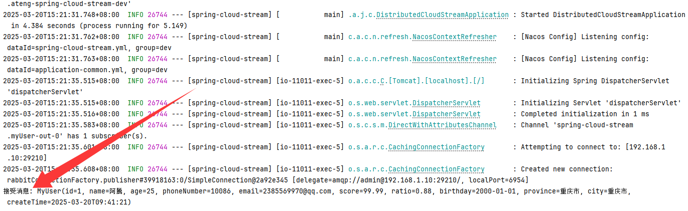

在RabbitMQ中查看 `Exchange` 和 `Queue`

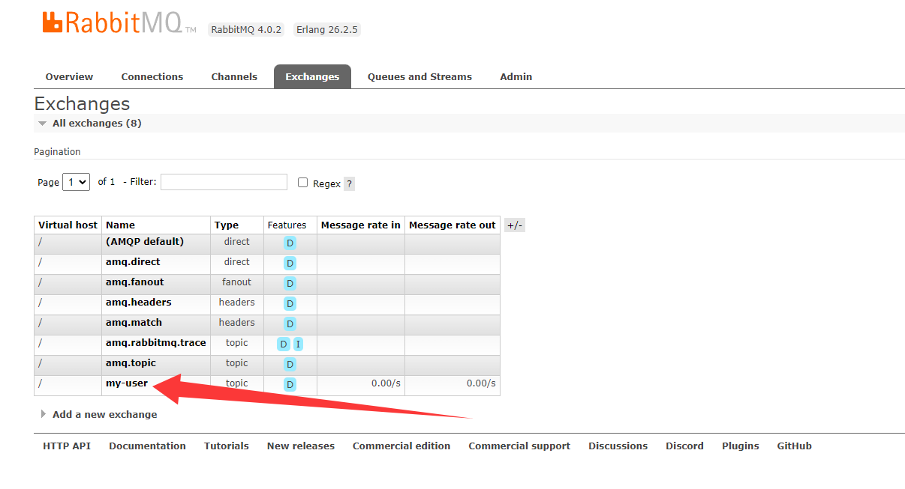

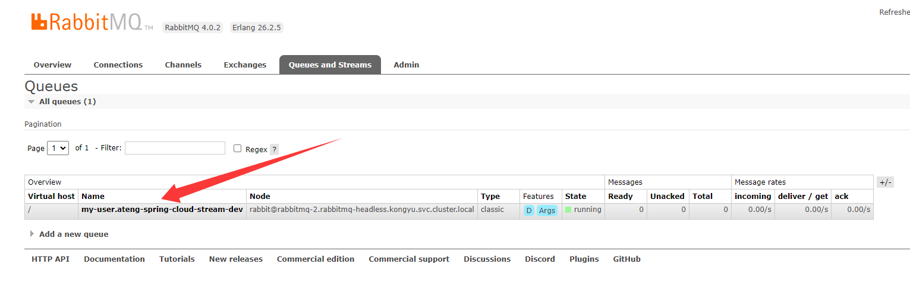

### 延迟消息

需要服务端安装 `rabbitmq_delayed_message_exchange` 插件。

`rabbitmq_delayed_message_exchange` 是一个 RabbitMQ 插件，它允许在消息被发送到队列之前，对消息进行延迟。与传统的死信队列（DLX）+ TTL 实现延迟消息的方式不同，这种方法更加直观且易于管理。

#### 添加配置参数

添加 **生产者 & 消费者绑定** 、**配置属性** 和 **启用 Consumer 函数**

- 生产者 & 消费者绑定：生产者 (`-out-index`) 绑定，向 `my-user-delay` 这个 RabbitMQ 主题发送消息；消费者 (`-in-index`) 绑定，消费 `my-user-delay` 主题的消息。
- 配置属性：配置 `my-user-delay` 交换机 为延迟交换机 `x-delayed-type`。
- 启用 Consumer 函数：明确指定 启用 `myUserDelay` 这个 `@Bean` 消费者（`Consumer`），多个函数之间使用分号分割。
- 保持 `Bean方法名`、`definition` 和 `bindings` 的名称一致，避免额外配置！

```yaml
spring:
  cloud:
    stream:
      # 生产者 & 消费者绑定
      bindings:
        myUserDelay-out-0:
          destination: my-user-delay
        myUserDelay-in-0:
          destination: my-user-delay
      # 配置属性
      rabbit:
        bindings:
          myUserDelay-out-0:
            producer:
              delayed-exchange: true
          myUserDelay-in-0:
            consumer:
              delayed-exchange: true
    # 启用 Consumer 函数
    function:
      definition: myUser;myUserDelay
```

#### 创建生产者

创建生产者，用于发送消息

```java
package local.ateng.java.cloud.service;

import local.ateng.java.cloud.entity.MyUser;
import lombok.RequiredArgsConstructor;
import org.springframework.beans.factory.annotation.Autowired;
import org.springframework.cloud.stream.function.StreamBridge;
import org.springframework.messaging.Message;
import org.springframework.messaging.support.MessageBuilder;
import org.springframework.stereotype.Service;

@Service
@RequiredArgsConstructor(onConstructor = @__(@Autowired))
public class RabbitProducerService {

    private final StreamBridge streamBridge;

    public void sendMessageDelay(MyUser data) {
        Message<MyUser> message = MessageBuilder.withPayload(data)
                .setHeader("x-delay", 5000) // 设置延迟时间（单位：毫秒）
                .build();
        streamBridge.send("myUserDelay-out-0", message);
    }

}
```

#### 创建消费者

```java
package local.ateng.java.cloud.service;

import local.ateng.java.cloud.entity.MyUser;
import org.springframework.context.annotation.Bean;
import org.springframework.stereotype.Service;

import java.util.function.Consumer;

@Service
public class RabbitConsumerService {

    @Bean
    public Consumer<MyUser> myUserDelay() {
        return message -> {
            System.out.println("接受消息: " + message);
        };
    }

}
```

#### 创建接口

创建接口调用测试

```java
@RestController
@RequestMapping("/rabbit")
@RequiredArgsConstructor(onConstructor = @__(@Autowired))
public class RabbitController {
    private final RabbitProducerService rabbitProducerService;

    @PostMapping("/send-delay")
    public void sendDelay(@RequestBody MyUser message) {
        rabbitProducerService.sendMessageDelay(message);
    }

}
```

发送消息

```
curl -X POST http://localhost:11011/rabbit/send-delay \
     -H "Content-Type: application/json" \
     -d '{
           "id": 1,
           "name": "阿腾",
           "age": 25,
           "phoneNumber": "10086",
           "email": "2385569970@qq.com",
           "score": 99.99,
           "ratio": 0.88,
           "birthday": "2000-01-01",
           "province": "重庆市",
           "city": "重庆市",
           "createTime": "2025-03-20T09:41:21"
         }'
```

可以看到控制台再发送消息5秒后接收到消息

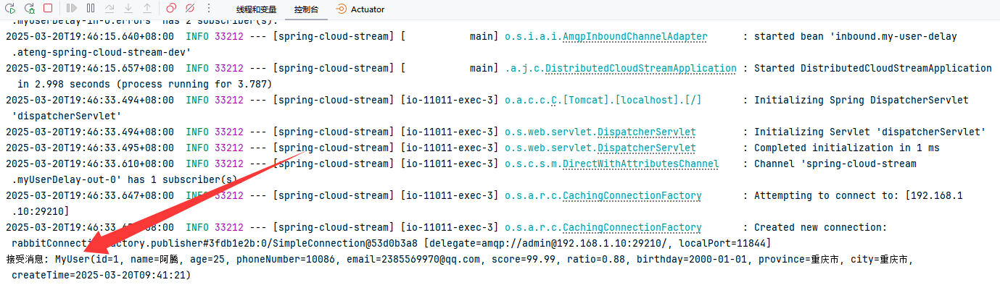

在RabbitMQ中查看 `Exchange` 和 `Queue`

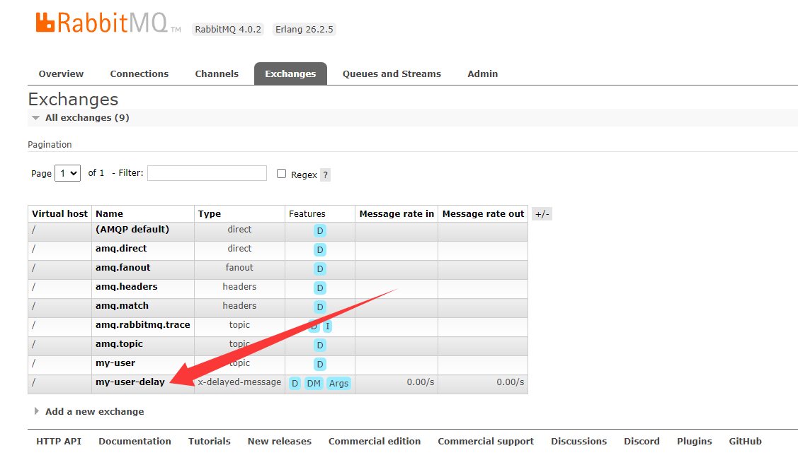


### 批量消费消息

#### 添加配置参数

添加 **生产者 & 消费者绑定** 、**配置属性** 和 **启用 Consumer 函数**

- 生产者 & 消费者绑定：生产者 (`-out-index`) 绑定，向 `my-user-batch` 这个 RabbitMQ 主题发送消息；消费者 (`-in-index`) 绑定，消费 `my-user-batch` 主题的消息，启用批量消费模式，一次性消费多条消息。
- 配置属性
    - **`max-concurrency: 3`**：表示消费者的最大并发数，可以启动最多 3 个消费者实例进行并行处理。
    - **`enable-batching: true`**：启用 RabbitMQ 的批量拉取功能，RabbitMQ 会自动合并消息进行批量消费。
    - **`batch-size: 100`**：单次批量拉取的最大消息数量。即每次最多拉取 100 条消息。
    - **`receive-timeout: 5000`**：超过5秒没有收到消息就返回。
- 启用 Consumer 函数：明确指定 启用 `myUserBatch` 这个 `@Bean` 消费者（`Consumer`），多个函数之间使用分号分割。
- 保持 `Bean方法名`、`definition` 和 `bindings` 的名称一致，避免额外配置！

```yaml
spring:
  cloud:
    stream:
      # 生产者 & 消费者绑定
      bindings:
        myUserBatch-out-0:
          destination: my-user-batch
        myUserBatch-in-0:
          destination: my-user-batch
          consumer:
            batch-mode: true
      # 配置属性
      rabbit:
        bindings:
          myUserBatch-in-0:
            consumer:
              max-concurrency: 3
              enable-batching: true
              batch-size: 100
              receive-timeout: 5000
    # 启用 Consumer 函数
    function:
      definition: myUser;myUserDelay;myUserBatch
```

#### 创建生产者

创建生产者，用于发送消息

```java
package local.ateng.java.cloud.service;

import local.ateng.java.cloud.entity.MyUser;
import lombok.RequiredArgsConstructor;
import org.springframework.beans.factory.annotation.Autowired;
import org.springframework.cloud.stream.function.StreamBridge;
import org.springframework.messaging.Message;
import org.springframework.messaging.support.MessageBuilder;
import org.springframework.stereotype.Service;

@Service
@RequiredArgsConstructor(onConstructor = @__(@Autowired))
public class RabbitProducerService {

    private final StreamBridge streamBridge;

    public void sendMessageBatch(MyUser data) {
        Message<MyUser> message = MessageBuilder.withPayload(data).build();
        streamBridge.send("myUserBatch-out-0", message);
    }

}
```

#### 创建消费者

```java
package local.ateng.java.cloud.service;

import local.ateng.java.cloud.entity.MyUser;
import org.springframework.context.annotation.Bean;
import org.springframework.stereotype.Service;

import java.util.List;
import java.util.function.Consumer;

@Service
public class RabbitConsumerService {

    @Bean
    public Consumer<List<MyUser>> myUserBatch() {
        return message -> {
            System.out.println("批量接受消息: " + message.size());
        };
    }

}
```

#### 创建接口

创建接口调用测试

```java
@RestController
@RequestMapping("/rabbit")
@RequiredArgsConstructor(onConstructor = @__(@Autowired))
public class RabbitController {
    private final RabbitProducerService rabbitProducerService;

    @PostMapping("/send-batch")
    public void sendBatch(@RequestBody MyUser message) {
        rabbitProducerService.sendMessageBatch(message);
    }

}
```

发送消息

```
while true
do
    curl -X POST http://192.168.100.2:11011/rabbit/send-batch \
     -H "Content-Type: application/json" \
     -d '{
           "id": 1,
           "name": "阿腾",
           "age": 25,
           "phoneNumber": "10086",
           "email": "2385569970@qq.com",
           "score": 99.99,
           "ratio": 0.88,
           "birthday": "2000-01-01",
           "province": "重庆市",
           "city": "重庆市",
           "createTime": "2025-03-20T09:41:21"
         }'
    sleep 0.1
done
```

可以看到控制台接收到100条消息后打印输出，5秒没有收到消息也打印输出

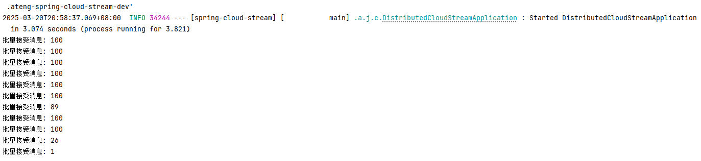


### 手动确认消息

#### 添加配置参数

添加 **生产者 & 消费者绑定** 、**配置属性** 和 **启用 Consumer 函数**

- 生产者 & 消费者绑定：生产者 (`-out-index`) 绑定，向 `my-user-manual` 这个 RabbitMQ 主题发送消息；消费者 (`-in-index`) 绑定，消费 `my-user-manual` 主题的消息；消息重试的次数。
- 配置属性
    - `acknowledge-mode: MANUAL`：开启手动确认模式。
- 启用 Consumer 函数：明确指定 启用 `myUserManual` 这个 `@Bean` 消费者（`Consumer`），多个函数之间使用分号分割。
- 保持 `Bean方法名`、`definition` 和 `bindings` 的名称一致，避免额外配置！

```yaml
spring:
  cloud:
    stream:
      # 生产者 & 消费者绑定
      bindings:
        myUserManual-out-0:
          destination: my-user-manual
        myUserManual-in-0:
          destination: my-user-manual
          consumer:
            max-attempts: 3
      # 配置属性
      rabbit:
        bindings:
          myUserManual-in-0:
            consumer:
              acknowledge-mode: MANUAL
    # 启用 Consumer 函数
    function:
      definition: myUser;myUserDelay;myUserBatch;myUserManual
```

#### 创建生产者

创建生产者，用于发送消息

```java
package local.ateng.java.cloud.service;

import local.ateng.java.cloud.entity.MyUser;
import lombok.RequiredArgsConstructor;
import org.springframework.beans.factory.annotation.Autowired;
import org.springframework.cloud.stream.function.StreamBridge;
import org.springframework.messaging.Message;
import org.springframework.messaging.support.MessageBuilder;
import org.springframework.stereotype.Service;

@Service
@RequiredArgsConstructor(onConstructor = @__(@Autowired))
public class RabbitProducerService {

    private final StreamBridge streamBridge;

    public void sendMessageManual(MyUser data) {
        Message<MyUser> message = MessageBuilder.withPayload(data).build();
        streamBridge.send("myUserManual-out-0", message);
    }

}
```

#### 创建消费者

注意这样操作会产生消息循环......

```java
package local.ateng.java.cloud.service;

import com.rabbitmq.client.Channel;
import local.ateng.java.cloud.entity.MyUser;
import lombok.extern.slf4j.Slf4j;
import org.springframework.amqp.support.AmqpHeaders;
import org.springframework.context.annotation.Bean;
import org.springframework.messaging.Message;
import org.springframework.stereotype.Service;

import java.io.IOException;
import java.util.Random;
import java.util.function.Consumer;

@Service
@Slf4j
public class RabbitConsumerService {

    @Bean
    public Consumer<Message<MyUser>> myUserManual() {
        return message -> {
            // 获取消息体
            MyUser payload = message.getPayload();
            log.info("接收到用户信息: {}", payload);

            // 获取 RabbitMQ 的 Channel 和 DeliveryTag
            Channel channel = message.getHeaders().get(AmqpHeaders.CHANNEL, Channel.class);
            Long deliveryTag = message.getHeaders().get(AmqpHeaders.DELIVERY_TAG, Long.class);

            if (channel != null && deliveryTag != null) {
                try {
                    // 处理业务逻辑
                    // processUser(myUser);
                    if (new Random().nextInt(0, 2) == 0 || payload.getId() == 0) {
                        throw new RuntimeException("模拟业务异常");
                    }

                    // 手动确认消息
                    channel.basicAck(deliveryTag, false);
                    log.info("消息已成功确认 (ACK)");
                } catch (Exception e) {
                    log.error("处理消息失败，错误信息: {}", e.getMessage(), e);
                    try {
                        // - 拒绝并不重新投递
                        //channel.basicNack(deliveryTag, false, false);
                        // - 拒绝并重新投递
                        channel.basicNack(deliveryTag, false, true);
                        log.warn("消息处理失败，已重新投递");
                    } catch (IOException ex) {
                        log.error("消息拒绝失败，错误信息: {}", ex.getMessage(), ex);
                        throw new RuntimeException(ex);
                    }
                }
            } else {
                log.error("消息头中缺少 Channel 或 DeliveryTag，无法进行手动确认");
            }
        };
    }

}
```

#### 创建接口

创建接口调用测试

```java
@RestController
@RequestMapping("/rabbit")
@RequiredArgsConstructor(onConstructor = @__(@Autowired))
public class RabbitController {
    private final RabbitProducerService rabbitProducerService;

    @PostMapping("/send-manual")
    public void sendManual(@RequestBody MyUser message) {
        rabbitProducerService.sendMessageManual(message);
    }

}
```

发送消息

```
curl -X POST http://localhost:11011/rabbit/send-manual \
     -H "Content-Type: application/json" \
     -d '{
           "id": 0,
           "name": "阿腾",
           "age": 25,
           "phoneNumber": "10086",
           "email": "2385569970@qq.com",
           "score": 99.99,
           "ratio": 0.88,
           "birthday": "2000-01-01",
           "province": "重庆市",
           "city": "重庆市",
           "createTime": "2025-03-20T09:41:21"
         }'
```

可以看到方法类有异常的情况下就会重新投递消息然后重新消费

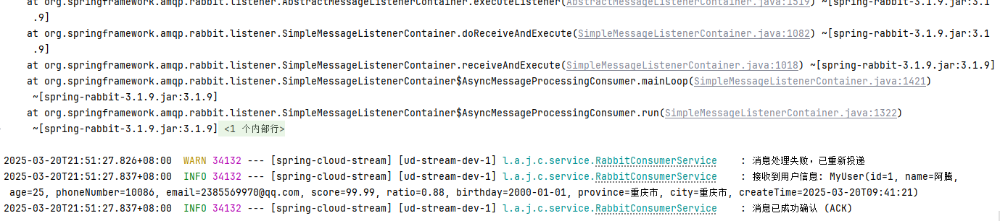


### 死信队列

#### 添加配置参数

添加 **生产者 & 消费者绑定** 和 **启用 Consumer 函数**

- 生产者 & 消费者绑定：生产者 (`-out-index`) 绑定，向 `my-user-two` 这个 RabbitMQ 主题发送消息；消费者 (`-in-index`) 绑定，消费 `my-user-two` 主题的消息。
- 配置属性
    - `auto-bind-dlq: true`：自动声明DLQ并将其绑定到绑定器DLX。默认的RoutingKey是destination（my-user-two.ateng-spring-cloud-stream-dev），队列名是destination.dlq（my-user-two.ateng-spring-cloud-stream-dev.dlq），交换机名是DLX。
- 启用 Consumer 函数：明确指定 启用 `myUserTwo` 这个 `@Bean` 消费者（`Consumer`），多个函数之间使用分号分割。
- 保持 `Bean方法名`、`definition` 和 `bindings` 的名称一致，避免额外配置！

```yaml
spring:
  cloud:
    stream:
      # 生产者 & 消费者绑定
      bindings:
        myUserTwo-out-0:
          destination: my-user-two
        myUserTwo-in-0:
          destination: my-user-two
          consumer:
            max-attempts: 3
      # 配置属性
      rabbit:
        bindings:
          myUserTwo-in-0:
            consumer:
              auto-bind-dlq: true
    # 启用 Consumer 函数
    function:
      definition: myUser;myUserTwo
```

#### 创建生产者

创建生产者，用于发送消息

```java
package local.ateng.java.cloud.service;

import local.ateng.java.cloud.entity.MyUser;
import lombok.RequiredArgsConstructor;
import org.springframework.beans.factory.annotation.Autowired;
import org.springframework.cloud.stream.function.StreamBridge;
import org.springframework.messaging.Message;
import org.springframework.messaging.support.MessageBuilder;
import org.springframework.stereotype.Service;

@Service
@RequiredArgsConstructor(onConstructor = @__(@Autowired))
public class RabbitProducerService {

    private final StreamBridge streamBridge;

    public void sendMessageTwo(MyUser data) {
        Message<MyUser> message = MessageBuilder.withPayload(data).build();
        streamBridge.send("myUserTwo-out-0", message);
    }

}
```

#### 创建消费者

```java
package local.ateng.java.cloud.service;

import local.ateng.java.cloud.entity.MyUser;
import org.springframework.context.annotation.Bean;
import org.springframework.stereotype.Service;

import java.util.function.Consumer;

@Service
public class RabbitConsumerService {

    @Bean
    public Consumer<MyUser> myUserTwo() {
        return message -> {
            if (message.getId() == 0) {
                System.err.println("接受消息发送异常");
                throw new RuntimeException("模拟业务异常");
            }
            System.out.println("接受消息: " + message);
        };
    }

}
```

#### 创建接口

创建接口调用测试

```java
@RestController
@RequestMapping("/rabbit")
@RequiredArgsConstructor(onConstructor = @__(@Autowired))
public class RabbitController {
    private final RabbitProducerService rabbitProducerService;

    @PostMapping("/send-two")
    public void sendTwo(@RequestBody MyUser message) {
        rabbitProducerService.sendMessageTwo(message);
    }

}
```

发送消息

```
curl -X POST http://localhost:11011/rabbit/send-two \
     -H "Content-Type: application/json" \
     -d '{
           "id": 0,
           "name": "阿腾",
           "age": 25,
           "phoneNumber": "10086",
           "email": "2385569970@qq.com",
           "score": 99.99,
           "ratio": 0.88,
           "birthday": "2000-01-01",
           "province": "重庆市",
           "city": "重庆市",
           "createTime": "2025-03-20T09:41:21"
         }'
```

可以看到方法类有异常抛出的情况下就会重新消费消息，超过 `max-attempts` 设定的值就会将该消息发送给 DLX死信交换机，如何转发 死信队列 my-user-two.ateng-spring-cloud-stream-dev.dlq，RoutingKey是my-user-two.ateng-spring-cloud-stream-dev。

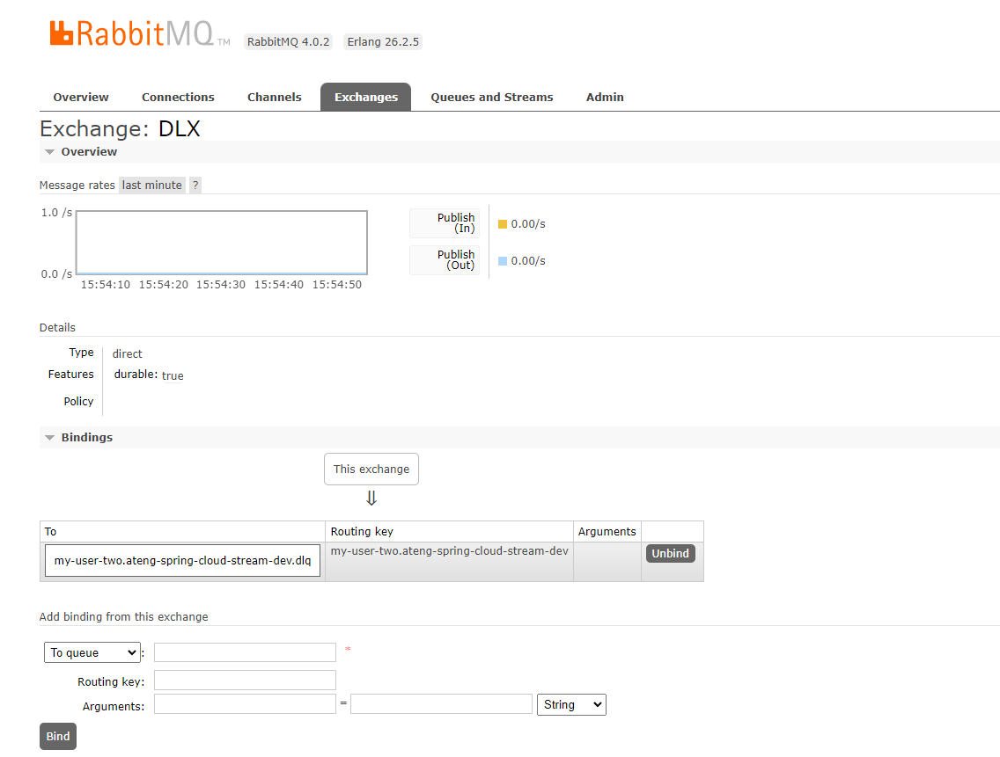

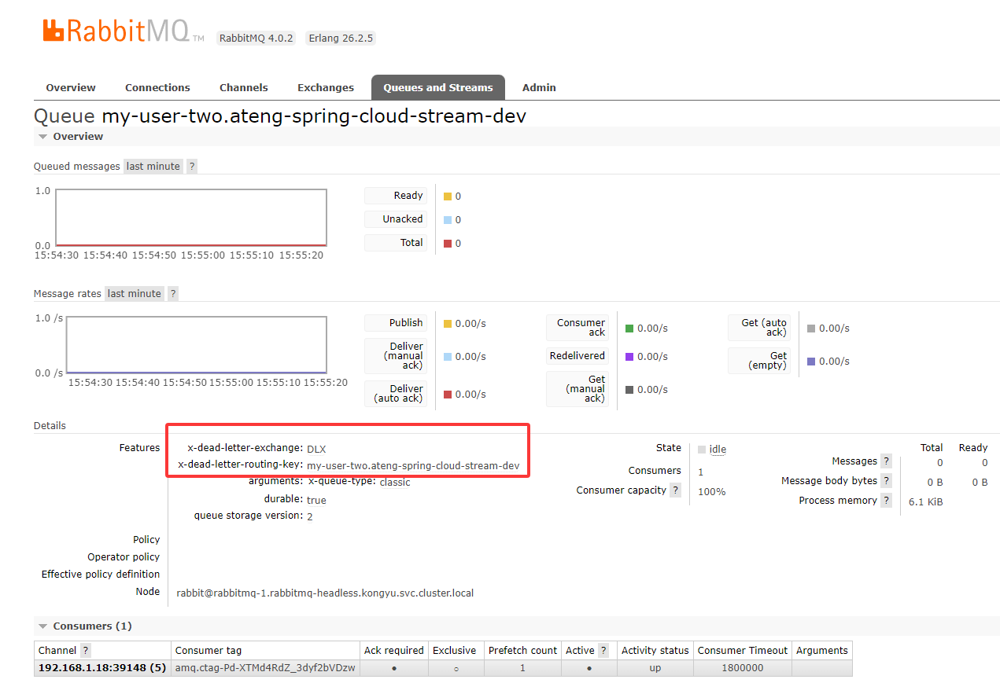

#### 监听死信队列

如果需要监听死信队列并处理消息可以参考以下步骤

**添加配置参数**

配置死信队列的交换机、队列、RoutingKey

```yaml
spring:
  cloud:
    stream:
      # 生产者 & 消费者绑定
      bindings:
        myUserTwoDlq-in-0:
          destination: DLX
          group: my-user-two.ateng-spring-cloud-stream-dev.dlq
      # 配置属性
      rabbit:
        bindings:
          myUserTwoDlq-in-0:
            consumer:
              exchange-type: direct
              binding-routing-key: my-user-two.ateng-spring-cloud-stream-dev
              bind-queue: false
              declare-exchange: false
              queue-name-group-only: true
    # 启用 Consumer 函数
    function:
      definition: myUserTwo;myUserTwoDlq
```

**创建消费者**

```java
@Bean
public Consumer<MyUser> myUserTwoDlq() {
    return message -> {
        // 处理死信队列中的消息
        System.out.println("接受死信队列消息: " + message);
        // 这里可以添加具体的处理逻辑
    };
}
```

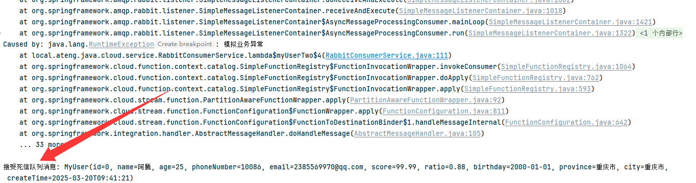


### 使用已存在的交换机和队列

参考：[官方文档](https://docs.spring.io/spring-cloud-stream/reference/rabbit/rabbit_overview/existing-destinations.html)

使用以下已存在的：

- Exchange: exchange-ateng
- Exchange Type: topic
- Queue: queue-ateng
- RoutingKey：routingkey-ateng

#### 添加配置参数

**Producer（生产者）配置参数**

- **destination**: exchange-ateng → 指定要发送消息的交换机名称。
- **group**: queue-ateng → 通常在消费者场景中使用，生产者场景下不会生效。
- **routing-key**: routingkey.ateng → 指定消息发送时的路由键。
- **exchange-type**: topic → 使用 `topic` 类型的交换机，支持基于路由键的消息分发。

**Consumer（消费者）配置参数**

- **destination**: exchange-ateng → 指定要监听的交换机名称。
- **group**: queue-ateng → 指定消费者监听的队列名称。
- **exchange-type**: topic → 使用 `topic` 类型的交换机进行消息接收。
- **binding-routing-key**: routingkey.ateng → 指定消费者监听的路由键，接收匹配的消息。
- **bind-queue**: false → 不绑定交换机和队列，假设它们已存在。
- **declare-exchange**: false → 不声明交换机，假设交换机已存在。
- **queue-name-group-only**: true → 使用 `group` 名称作为队列名，直接监听该队列。

```yaml
spring:
  cloud:
    stream:
      # 生产者 & 消费者绑定
      bindings:
        atengTopic-out-0:
          destination: exchange-ateng
          group: queue-ateng
        atengTopic-in-0:
          destination: exchange-ateng
          group: queue-ateng
      # 配置属性
      rabbit:
        bindings:
          atengTopic-out-0:
            producer:
              routing-key: routingkey.ateng
              exchange-type: topic
          atengTopic-in-0:
            consumer:
              exchange-type: topic
              binding-routing-key: routingkey.ateng
              bind-queue: false
              declare-exchange: false
              queue-name-group-only: true
    # 启用 Consumer 函数
    function:
      definition: myUserTwo;myUserTwoDlq;atengTopic
```

#### 创建生产者

创建生产者，用于发送消息

```java
package local.ateng.java.cloud.service;

import lombok.RequiredArgsConstructor;
import org.springframework.beans.factory.annotation.Autowired;
import org.springframework.cloud.stream.function.StreamBridge;
import org.springframework.messaging.Message;
import org.springframework.messaging.support.MessageBuilder;
import org.springframework.stereotype.Service;

@Service
@RequiredArgsConstructor(onConstructor = @__(@Autowired))
public class RabbitProducerService {

    private final StreamBridge streamBridge;

    public void sendMessageAteng(String data) {
        Message<String> message = MessageBuilder.withPayload(data).build();
        streamBridge.send("atengTopic-out-0", message);
    }

}
```

#### 创建消费者

```java
package local.ateng.java.cloud.service;

import org.springframework.context.annotation.Bean;
import org.springframework.stereotype.Service;

import java.util.function.Consumer;

@Service
public class RabbitConsumerService {

    @Bean
    public Consumer<String> atengTopic() {
        return message -> {
            System.out.println("接受消息: " + message);
        };
    }

}
```

#### 创建接口

创建接口调用测试

```java
@RestController
@RequestMapping("/rabbit")
@RequiredArgsConstructor(onConstructor = @__(@Autowired))
public class RabbitController {
    private final RabbitProducerService rabbitProducerService;

    @GetMapping("/send-ateng")
    public void sendAteng(String message) {
        rabbitProducerService.sendMessageAteng(message);
    }

}
```

发送消息

```
curl http://localhost:11011/rabbit/send-ateng?message=ateng
```

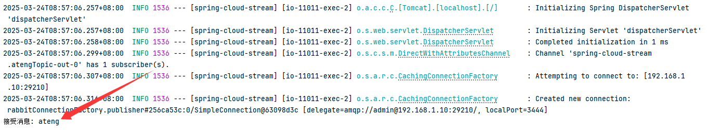


## RocketMQ

**RocketMQ** 是 **Apache** 顶级开源的**分布式消息队列**，最初由 **阿里巴巴** 开发，具备**高吞吐、低延迟、高可用**等特性，广泛用于**异步解耦、分布式事务、流式计算**等场景。RocketMQ **5.x** 版本引入 **Controller、Proxy、云原生支持**，增强了**多协议兼容性（HTTP/gRPC/MQTT）、自动主从切换、存储优化**。其核心组件包括 **NameServer（注册中心）、Broker（存储转发）、Controller（高可用管理）、Proxy（协议适配）**，适合**云环境和高并发业务** 🚀。

- [官网链接](https://rocketmq.apache.org/zh/)
- [SpringCloudStream使用文档](https://sca.aliyun.com/docs/2023/user-guide/rocketmq/quick-start/)
- [部署文档](https://atengk.github.io/ops/#/work/service/springcloudalibaba/rocketmq/standalone/)

### 添加依赖

Spring Cloud Stream RocketMQ依赖

```xml
<!-- Spring Cloud Stream RocketMQ 依赖 -->
<dependency>
    <groupId>com.alibaba.cloud</groupId>
    <artifactId>spring-cloud-starter-stream-rocketmq</artifactId>
</dependency>
```

### 添加配置参数

添加 Spring Cloud Stream RocketMQ配置 **全局默认参数（`default`）**和 **Kafka 绑定器（`binders`）**

- 全局默认参数（`default`）：指定默认的 RocketMQ 绑定器、设置默认的消费组、设置默认的消息格式为 JSON
    - **`binder: rocketmq-default`**: 指定默认使用 `kafka-default` 这个 binder（Kafka 连接配置）。
    - **`group: ateng-${spring.application.name:-0}-${spring.profiles.active:-0}`**:
        - `group` 是 RocketMQ 消费者组 ID，多个实例会共享消费。
        - 这里的 `${spring.application.name:-0}` 代表应用名，`${spring.profiles.active:-0}` 代表当前环境（如 `dev`、`prod`），用于动态生成唯一的消费者组名。
    - **`content-type: application/json`**: 消息默认使用 JSON 格式。
- RocketMQ 绑定器（`binders`）：RocketMQ 连接配置和相关参数的设置
    - **spring.cloud.stream.rocketmq.binder.name-server**: RocketMQ NameServer 服务器地址，`192.168.1.13:9876`。

```yaml
---
# Spring Cloud Stream RocketMQ 配置
spring:
  cloud:
    stream:
      default:
        binder: rocketmq-default
        group: ateng-${spring.application.name:-0}-${spring.profiles.active:-0}
        content-type: application/json
      binders:
        rocketmq-default:
          type: rocketmq
          environment:
            spring.cloud.stream.rocketmq.binder.name-server: 192.168.1.13:9876
```


### 字符串消息

#### 添加配置参数

添加 **生产者 & 消费者绑定** 和 **启用 Consumer 函数**

- 生产者 & 消费者绑定：生产者 (`-out-index`) 绑定，向 `my-string` 这个 RocketMQ 主题发送消息；消费者 (`-in-index`) 绑定，消费 `my-string` 主题的消息；指定了 `content-type: text/plain`，表示发送/消费文本消息。
- 启用 Consumer 函数：明确指定 启用 `myString` 这个 `@Bean` 消费者（`Consumer`）。
- 保持 `Bean方法名`、`definition` 和 `bindings` 的名称一致，避免额外配置！

```yaml
spring:
  cloud:
    stream:
      # 生产者 & 消费者绑定
      bindings:
        myString-out-0:
          destination: my-string
          content-type: text/plain
        myString-in-0:
          destination: my-string
          content-type: text/plain
    # 启用 Consumer 函数
    function:
      definition: myString
```

其他局部可以指定的相关属性，例如：

```yaml
spring:
  cloud:
    stream:
      bindings:
        myString-in-1:
          binder: rocketmq-default
          destination: my-string-other
          group: ateng-group
          content-type: text/plain
```

#### 创建生产者

创建生产者，用于发送消息

```java
package local.ateng.java.cloud.service;

import lombok.RequiredArgsConstructor;
import org.springframework.beans.factory.annotation.Autowired;
import org.springframework.cloud.stream.function.StreamBridge;
import org.springframework.messaging.Message;
import org.springframework.messaging.support.MessageBuilder;
import org.springframework.stereotype.Service;

@Service
@RequiredArgsConstructor(onConstructor = @__(@Autowired))
public class RocketProducerService {
    
    private final StreamBridge streamBridge;

    public void sendMessage(String data) {
        Message<String> message = MessageBuilder.withPayload(data).build();
        streamBridge.send("myString-out-0", message);
    }
    
}
```

#### 创建消费者

```java
package local.ateng.java.cloud.service;

import org.springframework.context.annotation.Bean;
import org.springframework.stereotype.Service;

import java.util.function.Consumer;

@Service
public class RocketConsumerService {

    @Bean
    public Consumer<String> myString() {
        return message -> {
            System.out.println("接受消息: " + message);
        };
    }

}
```

#### 创建接口

创建接口调用测试

```java
@RestController
@RequestMapping("/rocket")
@RequiredArgsConstructor(onConstructor = @__(@Autowired))
public class RocketController {
    private final RocketProducerService rocketProducerService;

    @GetMapping("/send")
    public void send(String message) {
        rocketProducerService.sendMessage(message);
    }

}
```

发送消息

```
curl localhost:11011/rocket/send?message=ateng_2024
```

可以看到控制台到接收的消息

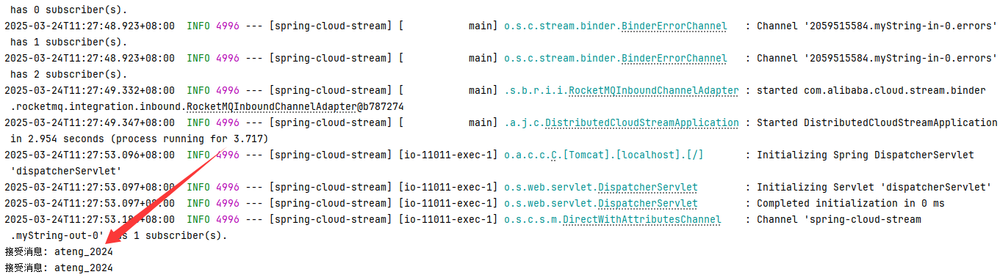


### JSON消息

#### 添加配置参数

添加 **生产者 & 消费者绑定** 和 **启用 Consumer 函数**

- 生产者 & 消费者绑定：生产者 (`-out-index`) 绑定，向 `my-user` 这个 RocketMQ 主题发送消息；消费者 (`-in-index`) 绑定，消费 `my-user` 主题的消息。
- 启用 Consumer 函数：明确指定 启用 `myUser` 这个 `@Bean` 消费者（`Consumer`），多个函数之间使用分号分割。
- 保持 `Bean方法名`、`definition` 和 `bindings` 的名称一致，避免额外配置！

```yaml
spring:
  cloud:
    stream:
      # 生产者 & 消费者绑定
      bindings:
        myUser-out-0:
          destination: my-user
        myUser-in-0:
          destination: my-user
    # 启用 Consumer 函数
    function:
      definition: myString;myUser
```

其他局部可以指定的相关属性，例如：

```yaml
spring:
  cloud:
    stream:
      bindings:
        myUser-in-1:
          binder: rocketmq-default
          destination: my-user-other
          group: ateng-group
          content-type: text/plain
```

#### 创建生产者

创建生产者，用于发送消息

```java
package local.ateng.java.cloud.service;

import local.ateng.java.cloud.entity.MyUser;
import lombok.RequiredArgsConstructor;
import org.springframework.beans.factory.annotation.Autowired;
import org.springframework.cloud.stream.function.StreamBridge;
import org.springframework.messaging.Message;
import org.springframework.messaging.support.MessageBuilder;
import org.springframework.stereotype.Service;

@Service
@RequiredArgsConstructor(onConstructor = @__(@Autowired))
public class RocketProducerService {
    
    private final StreamBridge streamBridge;

    public void sendMessage(MyUser data) {
        Message<MyUser> message = MessageBuilder.withPayload(data).build();
        streamBridge.send("myUser-out-0", message);
    }
    
}
```

#### 创建消费者

```java
package local.ateng.java.cloud.service;

import local.ateng.java.cloud.entity.MyUser;
import org.springframework.context.annotation.Bean;
import org.springframework.stereotype.Service;

import java.util.function.Consumer;

@Service
public class RocketConsumerService {

    @Bean
    public Consumer<MyUser> myUser() {
        return message -> {
            System.out.println("接受消息: " + message);
        };
    }

}
```

#### 创建接口

创建接口调用测试

```java
@RestController
@RequestMapping("/rocket")
@RequiredArgsConstructor(onConstructor = @__(@Autowired))
public class RocketController {
    private final RocketProducerService rocketProducerService;

    @PostMapping("/send-user")
    public void sendUser(@RequestBody MyUser message) {
        rocketProducerService.sendMessage(message);
    }

}
```

发送消息

```
curl -X POST http://localhost:11011/rocket/send-user \
     -H "Content-Type: application/json" \
     -d '{
           "id": 1,
           "name": "阿腾",
           "age": 25,
           "phoneNumber": "10086",
           "email": "2385569970@qq.com",
           "score": 99.99,
           "ratio": 0.88,
           "birthday": "2000-01-01",
           "province": "重庆市",
           "city": "重庆市",
           "createTime": "2025-03-20T09:41:21"
         }'
```

可以看到控制台到接收的消息

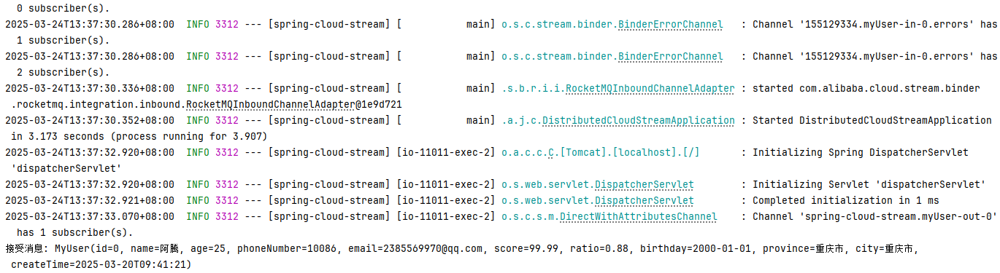
