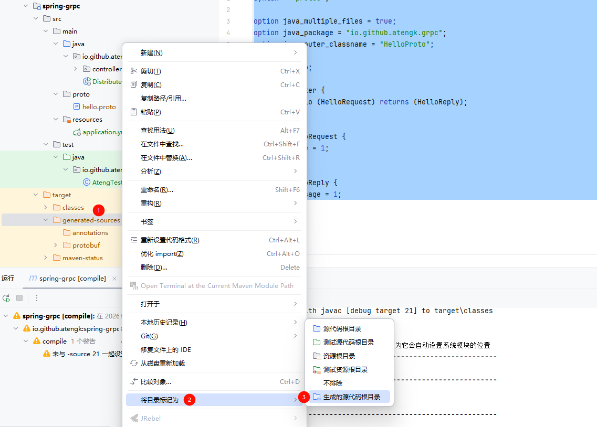
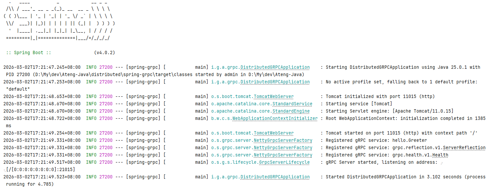

# Spring gRPC

Spring gRPC 是一个基于 Spring Boot 的 gRPC 集成框架，它让开发者可以在 Spring 项目中快速搭建高性能的 gRPC 服务与客户端。它提供 `@GrpcService` 注解用于服务端实现 gRPC 接口，同时支持通过 `GrpcChannelFactory` 创建客户端 Stub，实现微服务间的高效二进制通信。Spring gRPC 支持与传统 HTTP/REST 并行运行，方便在混合架构中使用，兼容 Spring Boot 的配置和依赖管理，简化了 gRPC 的启动、注入和管理流程，是构建企业级微服务和高性能内部接口的利器。

- 源码：[地址](https://github.com/spring-projects/spring-grpc)


## 版本信息

| 组件        | 版本   |
| ----------- | ------ |
| JDK         | 25     |
| Maven       | 3.9.12 |
| SpringBoot  | 4.0.2  |
| Spring gRPC | 1.0.2  |

## 基础配置

### 配置 pom.xml

```xml
<!-- 项目属性 -->
<properties>
    <java.version>25</java.version>
    <spring-boot.version>4.0.2</spring-boot.version>
    <grpc.version>1.77.1</grpc.version>
    <protobuf-java.version>4.33.4</protobuf-java.version>
    <spring-grpc.version>1.0.2</spring-grpc.version>
</properties>

<!-- 项目依赖 -->
<dependencies>

    <!-- Spring gRPC 依赖 -->
    <dependency>
        <groupId>io.grpc</groupId>
        <artifactId>grpc-services</artifactId>
    </dependency>
    <dependency>
        <groupId>org.springframework.grpc</groupId>
        <artifactId>spring-grpc-spring-boot-starter</artifactId>
    </dependency>

</dependencies>

<!-- Spring Boot 依赖管理 -->
<dependencyManagement>
    <dependencies>
        <dependency>
            <groupId>org.springframework.grpc</groupId>
            <artifactId>spring-grpc-dependencies</artifactId>
            <version>${spring-grpc.version}</version>
            <type>pom</type>
            <scope>import</scope>
        </dependency>
    </dependencies>
</dependencyManagement>

<!-- 构建配置 -->
<build>
    <plugins>

        <!-- gRPC Maven 插件 -->
        <plugin>
            <groupId>io.github.ascopes</groupId>
            <artifactId>protobuf-maven-plugin</artifactId>
            <version>4.0.3</version>
            <configuration>
                <protoc>${protobuf-java.version}</protoc>
                <binaryMavenPlugins>
                    <binaryMavenPlugin>
                        <groupId>io.grpc</groupId>
                        <artifactId>protoc-gen-grpc-java</artifactId>
                        <version>${grpc.version}</version>
                        <options>@generated=omit</options>
                    </binaryMavenPlugin>
                </binaryMavenPlugins>
            </configuration>
            <executions>
                <execution>
                    <id>generate</id>
                    <goals>
                        <goal>generate</goal>
                    </goals>
                </execution>
            </executions>
        </plugin>
    </plugins>

</build>
```

### 配置 application.yml

```yaml
server:
  port: 11015
spring:
  application:
    name: ${project.artifactId}
  grpc:
    server:
      port: 21015
```


## gRPC 服务实现

### 写 proto 文件

创建 `src/main/proto/hello.proto`

```protobuf
syntax = "proto3";

option java_multiple_files = true;
option java_package = "io.github.atengk.grpc";
option java_outer_classname = "HelloProto";

package hello;

service Greeter {
  rpc SayHello (HelloRequest) returns (HelloReply);
}

message HelloRequest {
  string name = 1;
}

message HelloReply {
  string message = 1;
}
```

生成代码

```
mvn clean compile
```

会生成：

```
GreeterGrpc.java
HelloRequest.java
HelloReply.java
```




### gRPC 服务实现

```java
package io.github.atengk.grpc.service;

import io.github.atengk.grpc.GreeterGrpc;
import io.github.atengk.grpc.HelloReply;
import io.github.atengk.grpc.HelloRequest;
import io.grpc.stub.StreamObserver;
import org.springframework.grpc.server.service.GrpcService;

@GrpcService
public class GreeterService extends GreeterGrpc.GreeterImplBase {

    @Override
    public void sayHello(HelloRequest request,
                         StreamObserver<HelloReply> responseObserver) {

        HelloReply reply = HelloReply.newBuilder()
                .setMessage("Hello " + request.getName())
                .build();

        responseObserver.onNext(reply);
        responseObserver.onCompleted();
    }
}
```

### 启动 Springboot




## gRPC 客户端

### 添加 gRPC服务端 配置

```yaml
---
# gRPC 客户端配置
spring:
  grpc:
    client:
      channels:
        greeter:
          address: localhost:21015
          negotiation-type: plaintext
```

### 创建 gRPC 客户端

```java
package io.github.atengk.grpc.client;

import io.github.atengk.grpc.GreeterGrpc;
import io.github.atengk.grpc.HelloReply;
import io.github.atengk.grpc.HelloRequest;
import io.grpc.Channel;
import org.springframework.grpc.client.GrpcChannelFactory;
import org.springframework.stereotype.Service;


@Service
public class GreeterClient {

    private final GreeterGrpc.GreeterBlockingStub stub;

    public GreeterClient(GrpcChannelFactory channelFactory) {
        Channel channel = channelFactory.createChannel("greeter");

        this.stub = GreeterGrpc.newBlockingStub(channel);
    }

    public String sayHello(String name) {
        HelloReply reply = stub.sayHello(
                HelloRequest.newBuilder().setName(name).build()
        );
        return reply.getMessage();
    }
}
```

### 调用服务端

```java
package io.github.atengk.grpc.client;

import io.github.atengk.grpc.GreeterGrpc;
import io.github.atengk.grpc.HelloReply;
import io.github.atengk.grpc.HelloRequest;
import io.grpc.Channel;
import org.springframework.grpc.client.GrpcChannelFactory;
import org.springframework.stereotype.Service;


@Service
public class GreeterClient {

    private final GreeterGrpc.GreeterBlockingStub stub;

    public GreeterClient(GrpcChannelFactory channelFactory) {
        Channel channel = channelFactory.createChannel("greeter");

        this.stub = GreeterGrpc.newBlockingStub(channel);
    }

    public String sayHello(String name) {
        HelloReply reply = stub.sayHello(
                HelloRequest.newBuilder().setName(name).build()
        );
        return reply.getMessage();
    }
}
```

调用接口

```
GET http://localhost:11015/hello?name=ateng
```

返回：Hello ateng
