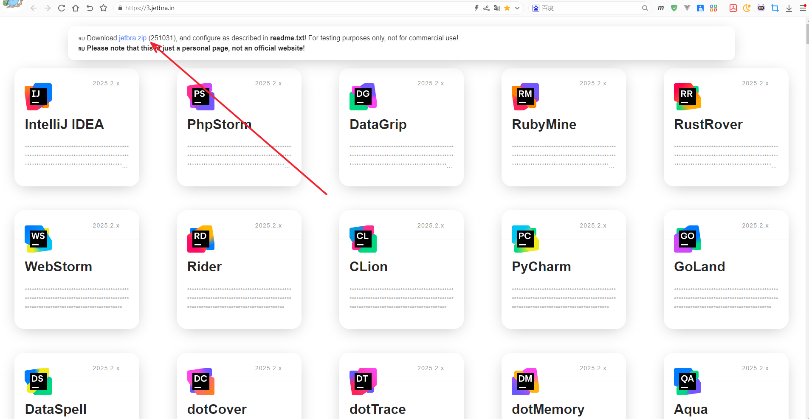
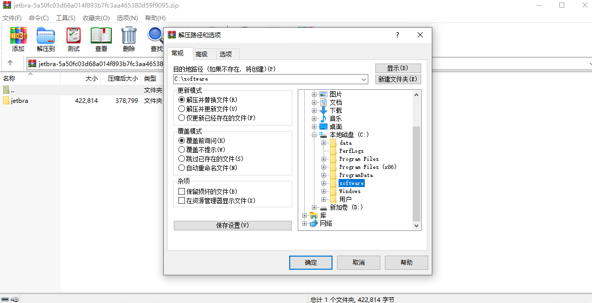
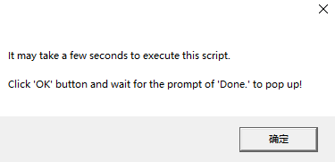
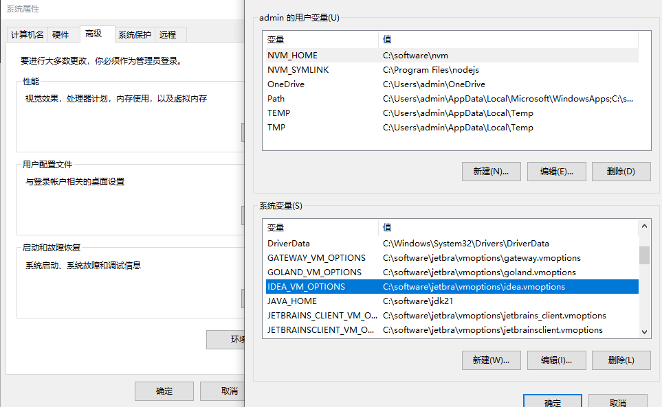
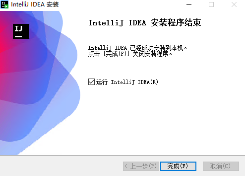
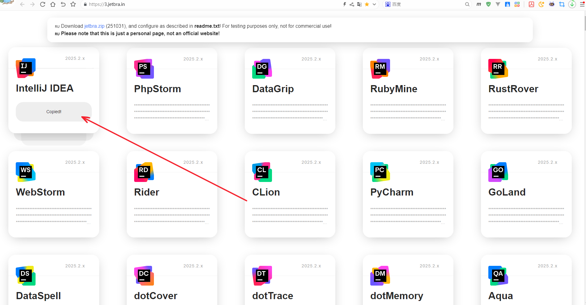
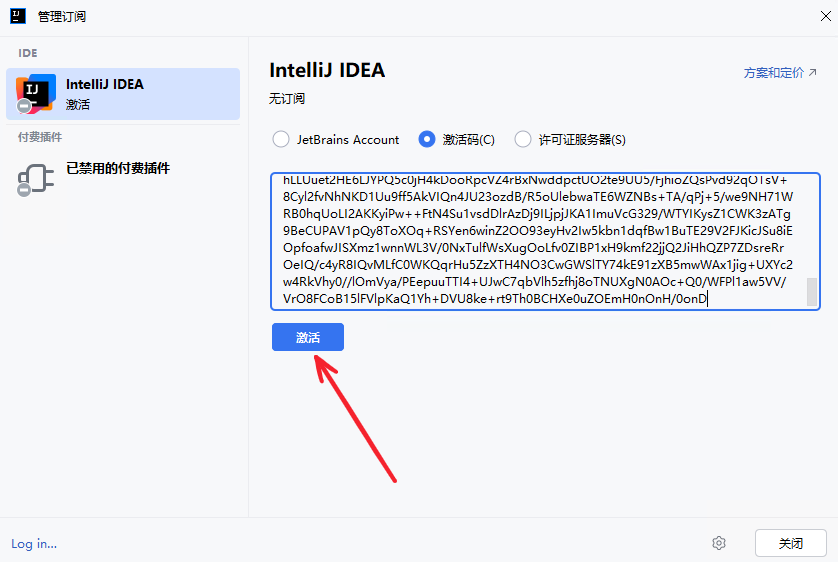
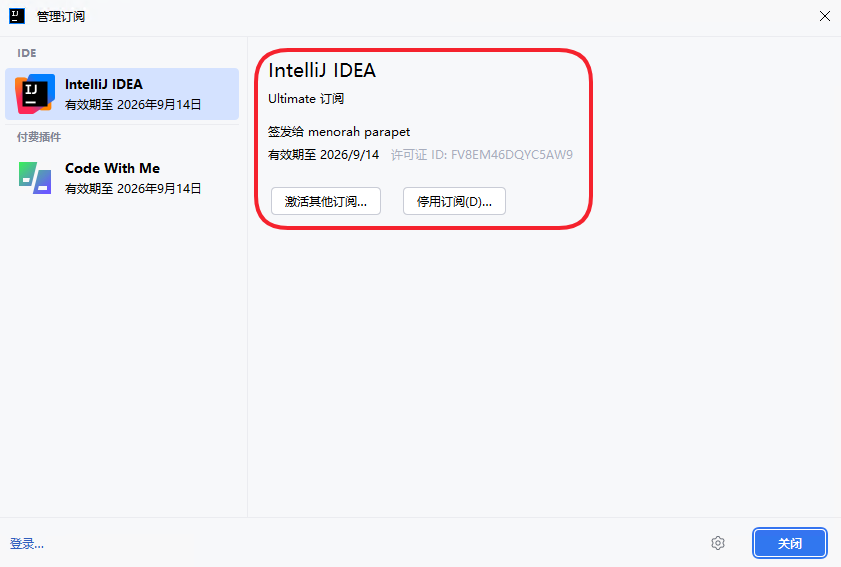
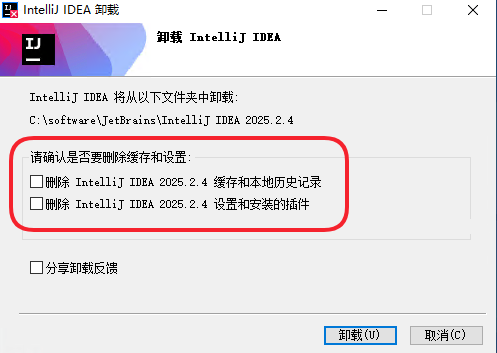

# 安装 IntelliJ IDEA

> **免责声明：**
>  本文仅记录本人在本地环境中对第三方网站 **3.jetbra.in** 所提供内容进行的技术性测试过程，用于个人学习与研究，**不构成对任何破解、绕过授权或非法激活行为的鼓励、推荐或支持**。
>
> 请注意：该网站所标注的“仅供测试、不用于商业用途”等字样 **并不等同于 JetBrains 官方授权**，其内容来源非官方，可能存在版权风险、法律风险以及潜在的安全风险（如恶意代码、后门、数据泄露等）。
>
> **本文不提供任何激活码、补丁文件，也不保证第三方资源的安全性或合法性。若读者选择访问或使用相关链接、文件或工具，所有后果由使用者自行承担，作者概不负责。**
>
> 如需长期或商业使用 IntelliJ IDEA，请务必通过 JetBrains 官方渠道获取正版授权。


## 安装 jetbra

### 下载

进入网站 https://3.jetbra.in ，下载软件包：https://3.jetbra.in/files/jetbra-5a50fc03d68a014f893b7fc3aa465380d59f9095.zip



### 解压

将下载的压缩包解压到电脑的软件安装目录（选择任意目录都可以，只要避免被清除即可），我这里解压的目录是：`C:\software`，最终软件目录是： `C:\software\jetbra`



### 执行脚本

> 如果已经执行了其他版本的脚本，那么需要先执行相应的 uninstall 脚本删除配置。

执行这个脚本 `scripts\install-all-users.vbs` ，将 jetbrains 旗下相关的软件的环境变量配置在环境变量中。

执行后会弹出以下提示，最终再弹出 **Done** 即配置完成。



可以看到脚本在系统变量中配置了一些环境变量



## 安装 IDEA

### 下载

在 [JetBrains官网](https://www.jetbrains.com.cn/) 下载软件安装包

- IntelliJ IDEA 软件包下载页面：https://www.jetbrains.com.cn/idea/download/other.html
- IntelliJ IDEA 2025.2.4 软件包下载链接：https://download.jetbrains.com/idea/ideaIU-2025.2.4.exe

### 安装软件包

软件的安装方式就根据自己的喜好安装即可，这里不再赘述。

在安装完后打开软件，准备破解



在 [网站](https://3.jetbra.in) 上找到 IntelliJ IDEA 的秘钥并复制，在 `IntelliJ IDEA` 的 `管理订阅` 中使用 `激活码` 的方式激活软件









### 扩展

**关于软件升级安装破解问题**

如果需要进行软件升级，可以直接将现有软件卸载，注意别删除本地的数据（如下图所示），然后再安装新版本，安装完毕后就可以正常使用，无需再破解。

> 注意该步骤需要通过文档的破解安装升级才可能会有效果哦！



如果以上步骤不可行，那么就需要在卸载时清除所有数据，并且还要删除注册表和IDEA相关的数据，可以参考[文档](https://blog.csdn.net/qq_24426227/article/details/144903550)彻底删除IDEA数据。清除完毕后就按照文档步骤安装即可。

```
C:\Users\admin\AppData\Roaming\JetBrains\IntelliJIdea2024.1
```


**关于 JetBrains 旗下 IDE 破解安装**

以下软件经过测试也可以使用该步骤安装：

| 名称          | 版本     | 下载页面                                                  | 下载地址                                                     |
| ------------- | -------- | --------------------------------------------------------- | ------------------------------------------------------------ |
| IntelliJ IDEA | 2025.2.4 | https://www.jetbrains.com.cn/idea/download/other.html     | https://download.jetbrains.com/idea/ideaIU-2025.2.4.exe      |
| DataGrip      | 2025.2.4 | https://www.jetbrains.com.cn/datagrip/download/other.html | https://download.jetbrains.com/datagrip/datagrip-2025.2.4.exe |
| WebStorm      | 2025.2.4 | https://www.jetbrains.com.cn/webstorm/download/other.html | https://download.jetbrains.com/webstorm/WebStorm-2025.2.4.exe |
| PyCharm       | 2025.2.4 | https://www.jetbrains.com.cn/pycharm/download/other.html  | https://download.jetbrains.com/python/pycharm-2025.2.4.exe   |
| GoLand        | 2025.2.4 | https://www.jetbrains.com.cn/goland/download/other.html   | https://download.jetbrains.com/go/goland-2025.2.4.exe        |


