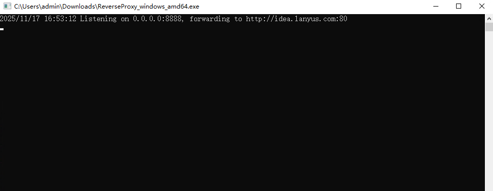
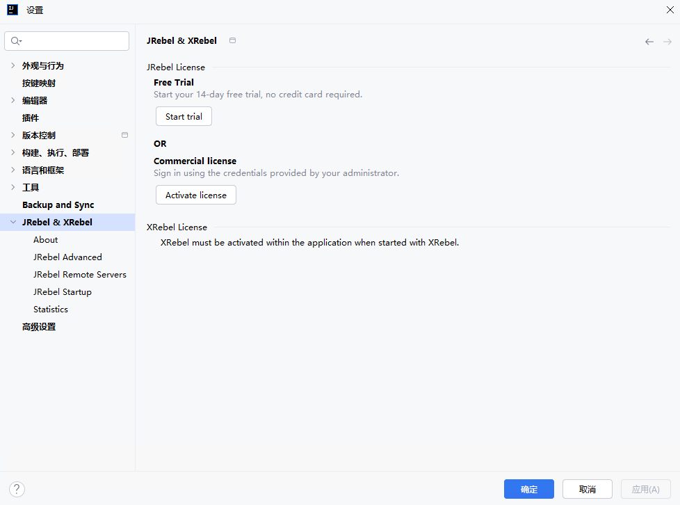
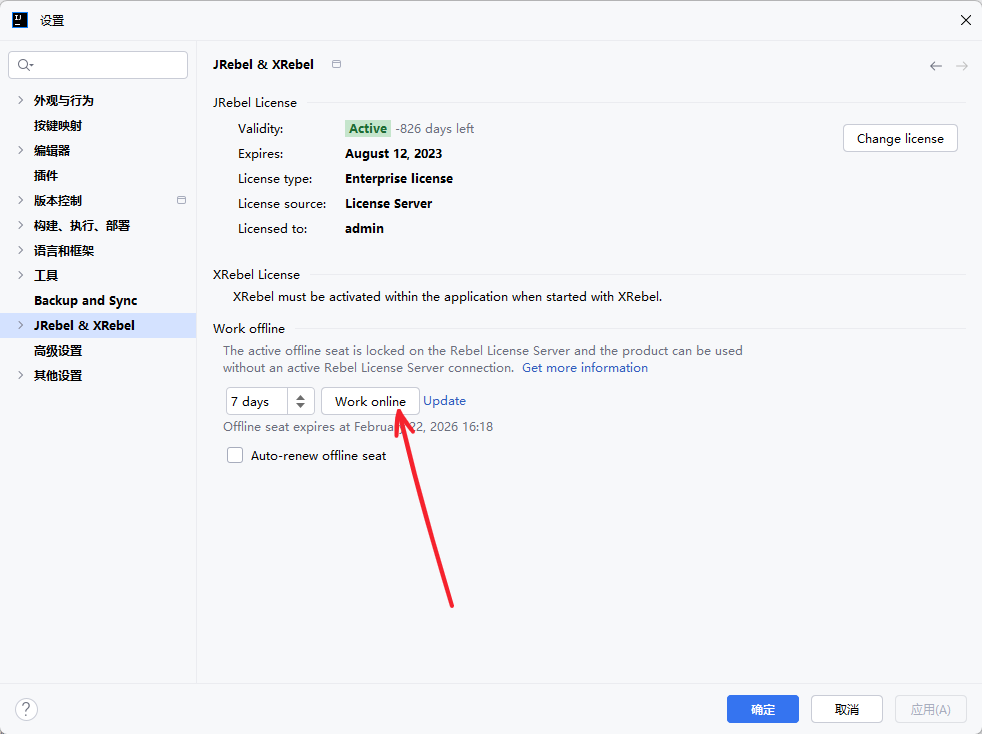

# JRebel

JRebel 是由 Perforce（原 ZeroTurnaround） 开发的一款 Java 热重载（hot-reload）工具，可以在 不重启 JVM、不重启应用 的情况下，实时加载代码变更。

> **JRebel 免责声明：**
>  本文涉及的 JRebel 激活、补丁或相关技术内容，仅在本人本地环境中用于研究与测试目的，不构成对破解、绕过授权或非法使用软件的任何推荐或引导。
>
> 请注意，任何来源于非官方渠道的激活方式、补丁文件或密钥，均可能违背 JRebel 官方授权协议，也可能带来法律及安全风险。本文不提供任何 JRebel 激活文件或下载方式，亦不对第三方资源的安全性、完整性和可靠性做任何保证。
>
> 若读者访问或使用非官方工具、站点或文件，由此产生的所有风险与后果由使用者自行承担，作者概不负责。若需长期或商业使用 JRebel，请通过官方渠道获取正版授权。


## 运行 Reverse Proxy

搭建这个 ReverseProxy 服务后，JRebel 的激活请求可以被 “反代” 到一个远程服务器

### 下载

访问 [GitHub下载页](https://github.com/ilanyu/ReverseProxy/releases/tag/v1.4) 下载Windows平台的[软件包](https://github.com/ilanyu/ReverseProxy/releases/download/v1.4/ReverseProxy_windows_amd64.exe)

### 运行

直接运行即可。




## 安装 JRebel and XRebel

在 IntelliJ IDEA 的 插件 中输入 `JRebel and XRebel` 安装最新版的JRebel插件


安装插件后进入`JRebel & XRebel` 设置，点击按钮 `Activate license` 进行激活配置



在 `Team URL` 选项中 输入以下信息

```
Team URL: http://127.0.0.1:8888/{uuid}
Email address: 邮箱随意
```

例如：

```
Team URL: http://127.0.0.1:8888/ef4fa162-462c-4bdd-b03a-54ec395ea88e
Email address: 2385569970@qq.com
```

激活后改为离线模式




最后，JRebel的破解地址容易失效...


## 参考文档

[参考文档](https://developer.aliyun.com/article/937829?spm=5176.26934566.main.8.9a9353b9SjoRpi)

[参考文档2](https://blog.csdn.net/m0_68477586/article/details/135686444)

