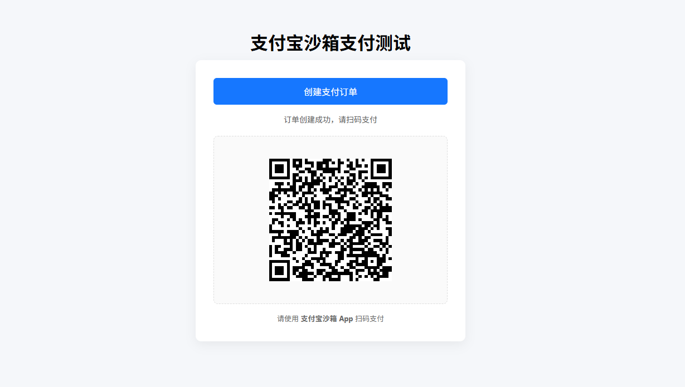
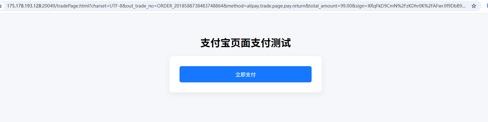

# IJPay

聚合支付，IJPay 让支付触手可及，封装了微信支付、QQ支付、支付宝支付、京东支付、银联支付、PayPal支付等常用的支付方式以及各种常用的接口。不依赖任何第三方 mvc 框架，仅仅作为工具使用简单快速完成支付模块的开发，可轻松嵌入到任何系统里。

## 基础配置

**添加依赖**

```xml
<properties>
    <IJPay.version>2.9.12.1-17</IJPay.version>
</properties>
<dependencies>
    <!-- IJPay 支付宝支付依赖 -->
    <dependency>
        <groupId>com.github.javen205</groupId>
        <artifactId>IJPay-AliPay</artifactId>
        <version>${IJPay.version}</version>
    </dependency>
</dependencies>
```

------

**application.yml 配置**

```yaml
---
# 支付宝支付配置
alipay:
  app-id: 9021xxxxx
  private-key: MIIExxxxx
  app-cert-path: alipay/cert/appPublicCert.crt
  alipay-cert-path: alipay/cert/alipayPublicCert.crt
  alipay-root-cert-path: alipay/cert/alipayRootCert.crt

  server-url: https://openapi-sandbox.dl.alipaydev.com/gateway.do
  notify-url: http://你的域名/api/pay/alipay/notify
  return-url: http://你的域名/index.html
  charset: UTF-8
  sign-type: RSA2
```

------

**创建配置文件和初始化 IJPay**

```java
package io.github.atengk.ijpay.config;

import com.ijpay.alipay.AliPayApiConfig;
import com.ijpay.alipay.AliPayApiConfigKit;
import lombok.Data;
import org.springframework.boot.context.event.ApplicationReadyEvent;
import org.springframework.boot.context.properties.ConfigurationProperties;
import org.springframework.context.annotation.Configuration;
import org.springframework.context.event.EventListener;
import org.springframework.core.io.ClassPathResource;

import java.io.File;
import java.io.FileOutputStream;
import java.io.InputStream;
import java.io.OutputStream;

/**
 * 支付宝配置（IJPay + 证书模式）
 *
 * <p>
 * 负责：
 * <ul>
 *     <li>读取 application.yml 中的支付宝配置</li>
 *     <li>初始化 IJPay 的 AliPayApiConfig</li>
 * </ul>
 *
 * @author 孔余
 * @since 2026-02-03
 */
@Data
@Configuration
@ConfigurationProperties(prefix = "alipay")
public class AlipayConfig {

    /** 应用 APP_ID */
    private String appId;

    /** 应用私钥 */
    private String privateKey;

    /** 应用公钥证书路径（classpath） */
    private String appCertPath;

    /** 支付宝公钥证书路径（classpath） */
    private String alipayCertPath;

    /** 支付宝公钥证书真实文件路径（用于验签） */
    private String realAlipayCertPath;

    /** 支付宝根证书路径（classpath） */
    private String alipayRootCertPath;

    /** 支付宝网关地址 */
    private String serverUrl;

    /** 异步通知地址 */
    private String notifyUrl;

    /** 同步返回地址 */
    private String returnUrl;

    /** 编码格式 */
    private String charset;

    /** 签名类型（RSA2） */
    private String signType;

    /**
     * 应用启动完成后初始化 IJPay 配置
     *
     * <p>
     * 证书模式下，证书必须是「真实文件路径」，
     * 因此需要先从 classpath 拷贝到临时文件。
     * </p>
     */
    @EventListener(ApplicationReadyEvent.class)
    public void initAliPayApiConfig() throws Exception {

        // 将证书从 classpath 拷贝到临时文件
        String appCert = copyCertToTemp(appCertPath);
        String alipayCert = copyCertToTemp(alipayCertPath);
        String rootCert = copyCertToTemp(alipayRootCertPath);

        // 保存支付宝公钥证书真实路径（用于回调验签）
        this.realAlipayCertPath = alipayCert;

        // 构建 IJPay 支付宝证书模式配置
        AliPayApiConfig aliPayApiConfig = AliPayApiConfig.builder()
                .setAppId(appId)
                .setPrivateKey(privateKey)
                .setAppCertPath(appCert)
                .setAliPayCertPath(alipayCert)
                .setAliPayRootCertPath(rootCert)
                .setServiceUrl(serverUrl)
                .setCharset(charset)
                .setSignType(signType)
                .buildByCert();

        // 注册配置到 IJPay
        AliPayApiConfigKit.putApiConfig(aliPayApiConfig);
        AliPayApiConfigKit.setThreadLocalAliPayApiConfig(aliPayApiConfig);
    }

    /**
     * 将 classpath 下的证书文件拷贝到临时目录
     *
     * @param classpathLocation classpath 路径
     * @return 临时文件的绝对路径
     */
    private String copyCertToTemp(String classpathLocation) throws Exception {

        // 提取证书文件名
        String fileName = classpathLocation.substring(
                classpathLocation.lastIndexOf('/') + 1
        );

        // 创建临时证书文件
        File tempFile = File.createTempFile(fileName, ".crt");
        tempFile.deleteOnExit();

        // 拷贝证书内容
        try (InputStream in = new ClassPathResource(classpathLocation).getInputStream();
             OutputStream out = new FileOutputStream(tempFile)) {
            in.transferTo(out);
        }

        return tempFile.getAbsolutePath();
    }
}
```

------

## 创建接口

### 创建扫描支付链接接口（当面付）

```java
package io.github.atengk.ijpay.controller;

import cn.hutool.core.util.IdUtil;
import com.alibaba.fastjson2.JSON;
import com.alipay.api.domain.AlipayTradePrecreateModel;
import com.alipay.api.internal.util.AlipaySignature;
import com.ijpay.alipay.AliPayApi;
import io.github.atengk.ijpay.config.AlipayConfig;
import jakarta.servlet.http.HttpServletRequest;
import lombok.RequiredArgsConstructor;
import lombok.extern.slf4j.Slf4j;
import org.springframework.web.bind.annotation.PostMapping;
import org.springframework.web.bind.annotation.RequestMapping;
import org.springframework.web.bind.annotation.RestController;

import java.util.HashMap;
import java.util.Map;

/**
 * 支付宝支付 Controller（IJPay + 证书模式）
 *
 * <p>
 * 主要职责：
 * <ul>
 *     <li>发起支付宝当面付（扫码支付）</li>
 *     <li>接收并处理支付宝异步通知</li>
 * </ul>
 *
 * <p>
 * 说明：
 * <ul>
 *     <li>支付能力由 IJPay 提供，内部通过 AliPayApiConfigKit 获取证书配置</li>
 *     <li>本类只负责「协议交互」，不建议在此直接写复杂业务逻辑</li>
 * </ul>
 *
 * @author 孔余
 * @since 2026-02-03
 */
@Slf4j
@RestController
@RequestMapping("/api/pay/alipay")
@RequiredArgsConstructor
public class AlipayController {

    /**
     * 支付宝配置（证书模式）
     */
    private final AlipayConfig alipayConfig;

    /**
     * 创建支付宝扫码支付订单（当面付）
     *
     * <p>
     * 返回二维码字符串，前端自行生成二维码图片。
     * </p>
     */
    @PostMapping("/tradePrecreatePay")
    public String tradePrecreatePay() throws Exception {

        // 构建扫码支付业务模型
        AlipayTradePrecreateModel model = new AlipayTradePrecreateModel();
        model.setSubject("测试订单");                       // 订单标题
        model.setTotalAmount("99.00");                    // 订单金额（单位：元）
        model.setTimeoutExpress("5m");                     // 超时时间
        model.setOutTradeNo("ORDER_" + IdUtil.getSnowflakeNextIdStr()); // 商户订单号

        // 调用 IJPay 封装的当面付接口
        return AliPayApi
                .tradePrecreatePayToResponse(model, alipayConfig.getNotifyUrl())
                .getQrCode();
    }

}
```


### 异步通知回调接口

```java
package io.github.atengk.ijpay.controller;

import cn.hutool.core.util.IdUtil;
import com.alibaba.fastjson2.JSON;
import com.alipay.api.domain.AlipayTradePrecreateModel;
import com.alipay.api.internal.util.AlipaySignature;
import com.ijpay.alipay.AliPayApi;
import io.github.atengk.ijpay.config.AlipayConfig;
import jakarta.servlet.http.HttpServletRequest;
import lombok.RequiredArgsConstructor;
import lombok.extern.slf4j.Slf4j;
import org.springframework.web.bind.annotation.PostMapping;
import org.springframework.web.bind.annotation.RequestMapping;
import org.springframework.web.bind.annotation.RestController;

import java.util.HashMap;
import java.util.Map;

/**
 * 支付宝支付 Controller（IJPay + 证书模式）
 *
 * <p>
 * 主要职责：
 * <ul>
 *     <li>发起支付宝当面付（扫码支付）</li>
 *     <li>接收并处理支付宝异步通知</li>
 * </ul>
 *
 * <p>
 * 说明：
 * <ul>
 *     <li>支付能力由 IJPay 提供，内部通过 AliPayApiConfigKit 获取证书配置</li>
 *     <li>本类只负责「协议交互」，不建议在此直接写复杂业务逻辑</li>
 * </ul>
 *
 * @author 孔余
 * @since 2026-02-03
 */
@Slf4j
@RestController
@RequestMapping("/api/pay/alipay")
@RequiredArgsConstructor
public class AlipayController {

    /**
     * 支付宝配置（证书模式）
     */
    private final AlipayConfig alipayConfig;

    /**
     * 支付宝异步通知回调接口
     *
     * <p>
     * 重要说明：
     * <ul>
     *     <li>必须使用证书验签（rsaCertCheckV1）</li>
     *     <li>返回值只能是 "success" 或 "failure"</li>
     *     <li>接口中不能有任何多余输出</li>
     * </ul>
     * </p>
     */
    @PostMapping("/notify")
    public String notify(HttpServletRequest request) throws Exception {

        log.info("[ALIPAY-NOTIFY] receive");

        // 1. 将请求参数转换为 Map<String, String>
        Map<String, String> params = new HashMap<>();
        request.getParameterMap().forEach(
                (key, value) -> params.put(key, value[0])
        );

        log.info("[ALIPAY-NOTIFY] params={}", JSON.toJSONString(params));

        // 2. 使用支付宝公钥证书进行验签（证书模式）
        boolean signVerified = AlipaySignature.rsaCertCheckV1(
                params,
                alipayConfig.getRealAlipayCertPath(), // 支付宝公钥证书真实路径
                alipayConfig.getCharset(),
                alipayConfig.getSignType()
        );

        log.info("[ALIPAY-NOTIFY] signVerified={}", signVerified);

        // 验签失败，直接返回 failure
        if (!signVerified) {
            log.warn("[ALIPAY-NOTIFY] sign verify fail");
            return "failure";
        }

        // 3. 解析核心业务参数
        String tradeStatus = params.get("trade_status");
        String outTradeNo = params.get("out_trade_no");
        String totalAmount = params.get("total_amount");
        String tradeNo = params.get("trade_no");

        log.info(
                "[ALIPAY-BIZ] tradeStatus={}, outTradeNo={}, tradeNo={}, totalAmount={}",
                tradeStatus, outTradeNo, tradeNo, totalAmount
        );

        // 4. 只处理成功状态（实际业务中需要做幂等校验）
        if ("TRADE_SUCCESS".equals(tradeStatus)) {
            // TODO:
            // 1. 校验订单是否存在
            // 2. 校验金额是否一致
            // 3. 校验订单是否已处理（幂等）
            // 4. 更新订单状态
            log.info("[ALIPAY-BIZ] success outTradeNo={}", outTradeNo);
        } else {
            // 其他状态直接忽略，但仍需返回 success，避免支付宝重复通知
            log.warn("[ALIPAY-BIZ] ignore tradeStatus={}, outTradeNo={}",
                    tradeStatus, outTradeNo);
        }

        log.info("[ALIPAY-NOTIFY] return success");
        return "success";
    }
}
```

### 前端页面（展示支付二维码）

Vue3 可以参考使用 VueUse 的 useQRCode 生成二维码图片，链接：[二维码生成：useQuCode](https://atengk.github.io/Ateng-Vue/#/apps/vueuse-integrations/?id=%e4%ba%8c%e7%bb%b4%e7%a0%81%e7%94%9f%e6%88%90%ef%bc%9auseqrcode)

```html
<!DOCTYPE html>
<html lang="zh-CN">
<head>
    <meta charset="UTF-8">
    <title>支付宝沙箱支付测试</title>
    <meta name="viewport" content="width=device-width, initial-scale=1.0">

    <!-- 二维码生成库 -->
    <script src="https://cdn.jsdelivr.net/npm/qrcodejs2@0.0.2/qrcode.min.js"></script>

    <style>
        body {
            font-family: -apple-system, BlinkMacSystemFont, "Segoe UI", Roboto, Helvetica, Arial;
            background: #f5f7fa;
            padding: 40px;
            text-align: center;
        }

        h1 {
            margin-bottom: 10px;
        }

        .container {
            max-width: 420px;
            margin: 0 auto;
            background: #ffffff;
            padding: 32px;
            border-radius: 10px;
            box-shadow: 0 6px 20px rgba(0, 0, 0, 0.06);
        }

        button {
            width: 100%;
            padding: 12px 0;
            font-size: 16px;
            border: none;
            border-radius: 6px;
            background: #1677ff;
            color: #fff;
            cursor: pointer;
        }

        button:disabled {
            background: #a0c2ff;
            cursor: not-allowed;
        }

        .status {
            margin-top: 16px;
            font-size: 14px;
            color: #555;
            min-height: 20px;
        }

        .order {
            margin-top: 10px;
            font-size: 13px;
            color: #888;
        }

        #qrcode {
            margin-top: 20px;
            padding: 20px;
            background: #fafafa;
            border-radius: 8px;
            display: flex;
            justify-content: center;
            align-items: center;
            min-height: 260px;
            border: 1px dashed #ddd;
        }

        .tip {
            margin-top: 16px;
            color: #666;
            font-size: 13px;
        }
    </style>
</head>
<body>

<h1>支付宝沙箱支付测试</h1>

<div class="container">

    <button id="payBtn" onclick="createPay()">创建支付订单</button>

    <div class="status" id="statusText"></div>
    <div class="order" id="orderText"></div>

    <div id="qrcode">
        <span style="color:#999;font-size:14px;">二维码将在此显示</span>
    </div>

    <div class="tip">
        请使用 <strong>支付宝沙箱 App</strong> 扫码支付
    </div>

</div>

<script>
    const payBtn = document.getElementById("payBtn");
    const statusText = document.getElementById("statusText");
    const orderText = document.getElementById("orderText");
    const qrContainer = document.getElementById("qrcode");

    function createPay() {

        // UI 初始化
        payBtn.disabled = true;
        statusText.textContent = "正在创建支付订单...";
        orderText.textContent = "";
        qrContainer.innerHTML = "";

        fetch("/api/pay/alipay/tradePrecreatePay", {
            method: "POST",
            headers: {
                "Content-Type": "application/json"
            }
        })
        .then(resp => {
            if (!resp.ok) {
                throw new Error("HTTP " + resp.status);
            }
            return resp.text();
        })
        .then(qrCodeText => {

            statusText.textContent = "订单创建成功，请扫码支付";

            new QRCode(qrContainer, {
                text: qrCodeText,
                width: 220,
                height: 220
            });

            // 从二维码内容里简单截取订单号（仅用于演示）
            const match = qrCodeText.match(/out_trade_no=([^&]+)/);
            if (match) {
                orderText.textContent = "订单号：" + decodeURIComponent(match[1]);
            }
        })
        .catch(err => {
            statusText.textContent = "创建支付失败，请重试";
            console.error(err);
        })
        .finally(() => {
            payBtn.disabled = false;
        });
    }
</script>

</body>
</html>
```


## 支付方式

### 扫码支付（预下单）

#### 接口

```java
    /**
     * 扫码支付（预下单 / 当面付）
     *
     * <p>
     * 返回支付宝二维码地址，
     * 前端负责生成二维码展示
     * </p>
     */
    @PostMapping("/qr")
    public String qrPay() {
        try {
            // 1. 构建预下单模型
            AlipayTradePrecreateModel model = new AlipayTradePrecreateModel();
            model.setSubject("扫码支付订单");
            model.setTotalAmount("0.01");
            model.setTimeoutExpress("5m");
            model.setOutTradeNo("ORDER_" + IdUtil.getSnowflakeNextIdStr());

            // 可选：门店号
            model.setStoreId("STORE_001");

            // 2. 调用 IJPay 预下单接口
            AlipayTradePrecreateResponse alipayTradePrecreateResponse = AliPayApi
                    .tradePrecreatePayToResponse(model, alipayConfig.getNotifyUrl());

            // 3. 解析二维码地址
            String qrCode = alipayTradePrecreateResponse.getQrCode();

            // 4. 返回给前端
            return qrCode;

        } catch (Exception e) {
            log.error("[ALIPAY-QR] precreate error", e);
            return null;
        }
    }
```

#### 前端

```html
<!DOCTYPE html>
<html lang="zh-CN">
<head>
    <meta charset="UTF-8">
    <title>支付宝沙箱支付测试</title>
    <meta name="viewport" content="width=device-width, initial-scale=1.0">

    <!-- 二维码生成库 -->
    <script src="https://cdn.jsdelivr.net/npm/qrcodejs2@0.0.2/qrcode.min.js"></script>

    <style>
        body {
            font-family: -apple-system, BlinkMacSystemFont, "Segoe UI", Roboto, Helvetica, Arial;
            background: #f5f7fa;
            padding: 40px;
            text-align: center;
        }

        h1 {
            margin-bottom: 10px;
        }

        .container {
            max-width: 420px;
            margin: 0 auto;
            background: #ffffff;
            padding: 32px;
            border-radius: 10px;
            box-shadow: 0 6px 20px rgba(0, 0, 0, 0.06);
        }

        button {
            width: 100%;
            padding: 12px 0;
            font-size: 16px;
            border: none;
            border-radius: 6px;
            background: #1677ff;
            color: #fff;
            cursor: pointer;
        }

        button:disabled {
            background: #a0c2ff;
            cursor: not-allowed;
        }

        .status {
            margin-top: 16px;
            font-size: 14px;
            color: #555;
            min-height: 20px;
        }

        .order {
            margin-top: 10px;
            font-size: 13px;
            color: #888;
        }

        #qrcode {
            margin-top: 20px;
            padding: 20px;
            background: #fafafa;
            border-radius: 8px;
            display: flex;
            justify-content: center;
            align-items: center;
            min-height: 260px;
            border: 1px dashed #ddd;
        }

        .tip {
            margin-top: 16px;
            color: #666;
            font-size: 13px;
        }
    </style>
</head>
<body>

<h1>支付宝沙箱支付测试</h1>

<div class="container">

    <button id="payBtn" onclick="createPay()">创建支付订单</button>

    <div class="status" id="statusText"></div>
    <div class="order" id="orderText"></div>

    <div id="qrcode">
        <span style="color:#999;font-size:14px;">二维码将在此显示</span>
    </div>

    <div class="tip">
        请使用 <strong>支付宝沙箱 App</strong> 扫码支付
    </div>

</div>

<script>
    const payBtn = document.getElementById("payBtn");
    const statusText = document.getElementById("statusText");
    const orderText = document.getElementById("orderText");
    const qrContainer = document.getElementById("qrcode");

    function createPay() {

        // UI 初始化
        payBtn.disabled = true;
        statusText.textContent = "正在创建支付订单...";
        orderText.textContent = "";
        qrContainer.innerHTML = "";

        fetch("/api/pay/alipay/qr", {
            method: "POST",
            headers: {
                "Content-Type": "application/json"
            }
        })
        .then(resp => {
            if (!resp.ok) {
                throw new Error("HTTP " + resp.status);
            }
            return resp.text();
        })
        .then(qrCodeText => {

            statusText.textContent = "订单创建成功，请扫码支付";

            new QRCode(qrContainer, {
                text: qrCodeText,
                width: 220,
                height: 220
            });

            // 从二维码内容里简单截取订单号（仅用于演示）
            const match = qrCodeText.match(/out_trade_no=([^&]+)/);
            if (match) {
                orderText.textContent = "订单号：" + decodeURIComponent(match[1]);
            }
        })
        .catch(err => {
            statusText.textContent = "创建支付失败，请重试";
            console.error(err);
        })
        .finally(() => {
            payBtn.disabled = false;
        });
    }
</script>

</body>
</html>
```

#### 使用

访问：http://175.178.193.128:20049/qrPay.html




### 条码 / 声波支付（付款码）

#### 接口

```java
    /**
     * 条码 / 声波支付（付款码支付）
     *
     * <p>
     * 商户扫用户付款码，
     * 支付结果同步返回
     * </p>
     */
    @PostMapping("/tradePay")
    public String tradePay(
            @RequestParam("authCode") String authCode,
            @RequestParam("scene") String scene
    ) {

        try {
            // bar_code / wave_code
            String subject;
            if ("bar_code".equals(scene)) {
                subject = "条码支付订单";
            } else if ("wave_code".equals(scene)) {
                subject = "声波支付订单";
            } else {
                return "非法支付场景";
            }

            // 1. 构建支付模型
            AlipayTradePayModel model = new AlipayTradePayModel();
            model.setOutTradeNo("ORDER_" + IdUtil.getSnowflakeNextIdStr());
            model.setSubject(subject);
            model.setTotalAmount("99.99");
            model.setAuthCode(authCode); // 用户付款码
            model.setScene(scene);       // bar_code / wave_code

            // 2. 发起支付
            String body = AliPayApi
                    .tradePayToResponse(model, alipayConfig.getNotifyUrl())
                    .getBody();

            // 3. 返回同步结果
            return body;

        } catch (Exception e) {
            log.error("[ALIPAY-TRADE-PAY] error", e);
            return "付款码支付失败";
        }
    }
```

#### 前端（收银枪 / 扫码器）

```html
<input id="authCode" placeholder="请扫描用户付款码" />
<button onclick="pay()">确认收款</button>

<script>
function pay() {
  const authCode = document.getElementById('authCode').value;

  fetch('/api/pay/alipay/tradePay', {
    method: 'POST',
    headers: { 'Content-Type': 'application/x-www-form-urlencoded' },
    body: new URLSearchParams({
      authCode: authCode,
      scene: 'bar_code'
    })
  })
  .then(res => res.json())
  .then(res => {
    console.log(res);
  });
}
</script>
```

接口调用测试

```
POST: http://localhost:16001/api/pay/alipay/tradePay?authCode=2088722094284600&scene=bar_code
响应:
{
	"alipay_trade_pay_response": {
		"code": "10003",
		"msg": " order success pay inprocess",
		"buyer_logon_id": "nvp***@sandbox.com",
		"buyer_pay_amount": "0.00",
		"buyer_user_id": "2088722094284600",
		"buyer_user_type": "PRIVATE",
		"invoice_amount": "0.00",
		"out_trade_no": "ORDER_2018597233773858816",
		"point_amount": "0.00",
		"receipt_amount": "0.00",
		"total_amount": "99.99",
		"trade_no": "2026020322001484600508888398"
	},
	"alipay_cert_sn": "260ccbb11e34bc7981552fc8a782a9aa",
	"sign": "UCw9J5XdQ87iHesBB7VvkE0C2J9mShMYw9nx3OKHIU0qPTkVNoZdh8M02z8aL59sQpHuiadDpc5upSohmc5gxRBDTvclHIAwhzsMiTCHdDa/6sjUCtilwemaKERH4AUcxWUN8jY8TMTkeYWLJcu47fPLzvJsSWY4WyIaocjP2ZzrR7vDrp0nlSPGxIEKaeCbaptelCggIJ3po/ALNHQWmRV8F7NYSAkEFGjAdV7AhvUyR4DYN0u/oTWdd8SEBFGPYhACuqGlx+PPVKeZsnhOwIj6p/Il6dJKa7Y3DlmKeyzuctmGsuod5jWI03dS/oND55jzkrRHJggfjUigRJQ53A=="
}
```


### PC 网站支付

#### 配置

```yaml
alipay:
  return-url: http://175.178.193.128:20049/tradePage.html
```

#### 接口

```java
    /**
     * PC 网站支付
     *
     * <p>
     * 浏览器访问该接口后，
     * 会直接跳转到支付宝 PC 收银台页面
     * </p>
     */
    @GetMapping("/tradePage")
    public void tradePage(HttpServletResponse response) {

        try {
            // 1. 商户订单号（必须唯一）
            String outTradeNo = "ORDER_" + IdUtil.getSnowflakeNextIdStr();
            log.info("[ALIPAY-PC] outTradeNo={}", outTradeNo);

            // 2. 构建 PC 网站支付模型
            AlipayTradePagePayModel model = new AlipayTradePagePayModel();
            model.setOutTradeNo(outTradeNo);
            model.setProductCode("FAST_INSTANT_TRADE_PAY");
            model.setTotalAmount("99.00");
            model.setSubject("PC 网站支付测试订单");
            model.setBody("IJPay + SpringBoot3 PC 网站支付测试");

            // 可选：回传参数（异步通知会原样返回）
            model.setPassbackParams("pc_pay_test");

            // 3. 调用 IJPay PC 网站支付
            //    内部会输出 HTML form 并自动提交
            AliPayApi.tradePage(
                    response,
                    model,
                    alipayConfig.getNotifyUrl(),
                    alipayConfig.getReturnUrl()
            );

        } catch (Exception e) {
            log.error("[ALIPAY-PC] pay error", e);
        }
    }
```

#### 前端

```html
<!DOCTYPE html>
<html lang="zh-CN">
<head>
    <meta charset="UTF-8">
    <title>支付宝页面支付测试</title>
    <meta name="viewport" content="width=device-width, initial-scale=1.0">

    <style>
        body {
            font-family: -apple-system, BlinkMacSystemFont, "Segoe UI", Roboto;
            background: #f5f7fa;
            padding: 40px;
            text-align: center;
        }

        .container {
            max-width: 420px;
            margin: 0 auto;
            background: #ffffff;
            padding: 32px;
            border-radius: 10px;
            box-shadow: 0 6px 20px rgba(0, 0, 0, 0.06);
        }

        button {
            width: 100%;
            padding: 14px 0;
            font-size: 16px;
            border: none;
            border-radius: 6px;
            background: #1677ff;
            color: #fff;
            cursor: pointer;
        }
    </style>
</head>
<body>

<h1>支付宝页面支付测试</h1>

<div class="container">
    <button onclick="pay()">立即支付</button>
</div>

<script>
    function pay() {
        window.location.href = "/api/pay/alipay/tradePage";
    }
</script>

</body>
</html>
```

#### 使用

访问：http://175.178.193.128:20049/tradePage.html




### WAP 支付（手机网页）

#### 配置

```yaml
alipay:
  return-url: http://175.178.193.128:20049/wapPay.html
```

#### 接口

```java
    /**
     * WAP 支付（手机网页）
     *
     * <p>
     * 适用于手机浏览器 / WebView，
     * 会跳转到支付宝 H5 收银台
     * </p>
     */
    @GetMapping("/wap")
    public void wapPay(HttpServletResponse response) {

        try {
            // 1. 商户订单号
            String outTradeNo = "ORDER_" + IdUtil.getSnowflakeNextIdStr();
            log.info("[ALIPAY-WAP] outTradeNo={}", outTradeNo);

            // 2. 构建 WAP 支付模型
            AlipayTradeWapPayModel model = new AlipayTradeWapPayModel();
            model.setOutTradeNo(outTradeNo);
            model.setTotalAmount("99.00");
            model.setSubject("WAP 支付测试订单");
            model.setBody("IJPay + SpringBoot3 WAP 支付测试");

            // WAP 支付固定值
            model.setProductCode("QUICK_WAP_WAY");

            // 可选：超时时间
            model.setTimeoutExpress("5m");

            // 3. 调用 IJPay WAP 支付
            //    返回 HTML form 并自动提交
            AliPayApi.wapPay(
                    response,
                    model,
                    alipayConfig.getNotifyUrl(),
                    alipayConfig.getReturnUrl()
            );

        } catch (Exception e) {
            log.error("[ALIPAY-WAP] pay error", e);
        }
    }
```

#### 前端

```html
<!DOCTYPE html>
<html lang="zh-CN">
<head>
    <meta charset="UTF-8">
    <title>支付宝页面支付测试</title>
    <meta name="viewport" content="width=device-width, initial-scale=1.0">

    <style>
        body {
            font-family: -apple-system, BlinkMacSystemFont, "Segoe UI", Roboto;
            background: #f5f7fa;
            padding: 40px;
            text-align: center;
        }

        .container {
            max-width: 420px;
            margin: 0 auto;
            background: #ffffff;
            padding: 32px;
            border-radius: 10px;
            box-shadow: 0 6px 20px rgba(0, 0, 0, 0.06);
        }

        button {
            width: 100%;
            padding: 14px 0;
            font-size: 16px;
            border: none;
            border-radius: 6px;
            background: #1677ff;
            color: #fff;
            cursor: pointer;
        }
    </style>
</head>
<body>

<h1>支付宝页面支付测试</h1>

<div class="container">
    <button onclick="pay()">立即支付</button>
</div>

<script>
    function pay() {
        window.location.href = "/api/pay/alipay/wap";
    }
</script>

</body>
</html>
```

#### 使用

访问：http://175.178.193.128:20049/wapPay.html


### APP 支付

#### 接口

```java
    /**
     * APP 支付
     *
     * <p>
     * 返回给 App 的是 orderString，
     * 由 App 端调用支付宝 SDK 发起支付
     * </p>
     */
    @PostMapping("/app")
    public String appPay() {

        try {
            // 1. 构建 APP 支付模型
            AlipayTradeAppPayModel model = new AlipayTradeAppPayModel();
            model.setBody("IJPay APP 支付测试");
            model.setSubject("APP 支付订单");
            model.setOutTradeNo("ORDER_" + IdUtil.getSnowflakeNextIdStr());
            model.setTimeoutExpress("30m");
            model.setTotalAmount("0.01");

            // APP 支付固定值
            model.setProductCode("QUICK_MSECURITY_PAY");

            // 2. 调用 IJPay，生成 orderString
            String orderString = AliPayApi
                    .appPayToResponse(model, alipayConfig.getNotifyUrl())
                    .getBody();

            // 3. 返回给 App
            return orderString;

        } catch (Exception e) {
            log.error("[ALIPAY-APP] pay error", e);
            return null;
        }
    }
```

#### 前端（App 端）

Android 示例（Java）

```
// 1. 请求你后端接口，拿到 orderString
String orderString = response.body().getData();

// 2. 调用支付宝 SDK
PayTask alipay = new PayTask(activity);
Map<String, String> result = alipay.payV2(orderString, true);
```

------

Android 示例（Kotlin）

```
val orderString = response.data

val payTask = PayTask(activity)
val result = payTask.payV2(orderString, true)
```

------

iOS 示例（Objective-C）

```
[[AlipaySDK defaultService] payOrder:orderString
                           fromScheme:@"yourAppScheme"
                             callback:^(NSDictionary *resultDic) {
    NSLog(@"res = %@", resultDic);
}];
```

------

iOS 示例（Swift）

```
AlipaySDK.defaultService().payOrder(orderString, fromScheme: "yourAppScheme") { result in
    print(result ?? "")
}
```


## 全资金能力

### 单笔转账到账户接口

```java
    /**
     * 单笔转账到账户接口
     */
    @PostMapping("/fund/transfer")
    public String fundTransfer() {
        try {
            AlipayFundTransToaccountTransferModel model = new AlipayFundTransToaccountTransferModel();
            model.setOutBizNo("FUND_TRANSFER_" + IdUtil.getSnowflakeNextIdStr());
            model.setPayeeType("ALIPAY_LOGONID");
            model.setPayeeAccount("nvpwqr6580@sandbox.com");
            model.setAmount("10.00");
            model.setRemark("IJPay 转账测试");

            AlipayFundTransToaccountTransferResponse response =
                    AliPayApi.transferToResponse(model);

            return response.getBody();
        } catch (Exception e) {
            return null;
        }
    }
```

响应：

```json
{
	"alipay_fund_trans_toaccount_transfer_response": {
		"code": "10000",
		"msg": "Success",
		"order_id": "20260203110070001502360003802737",
		"out_biz_no": "FUND_TRANSFER_2018602082733182976",
		"pay_date": "2026-02-03 16:26:56"
	},
	"alipay_cert_sn": "260ccbb11e34bc7981552fc8a782a9aa",
	"sign": "aC8NC4LzT28FEbIYRgl4PgDb6Smiwgs0J5P03bPQuQJN3XOki1/gn/WFKbVhFwB3NdYIV8sTEQioOochKEfs3hGd47UWYvgRqGLUK9oDAuXwBklGlDtHOEQnM4OV/tGnQdgo7A61pUuSEIqTpcEDnVvw1oYgF9NfLu8z3sC+L+zdfLf5+//x4O27y1+oHaMWpkcx4ZtwNAyIbVXqRIyxmRz9v0OHCzZcVnsWIyvcVu+ZCGtIJUwpxxbkZGAKpGZNz0SV+ESVBN96OjGFfdLKyZM6Pf2cnvax89vVInftmRO1JQvN5JdzeCXkS8cZYbZOKZzqB5j6I/nq4WJs4g98fw=="
}
```

### 单笔转账到账户查询接口

```java
    /**
     * 单笔转账到账户查询接口
     */
    @PostMapping("/fund/transfer/query")
    public String fundTransferQuery(@RequestParam(required = false, name = "outBizNo") String outBizNo,
                                    @RequestParam(required = false, name = "orderId") String orderId) {
        try {
            AlipayFundTransOrderQueryModel model = new AlipayFundTransOrderQueryModel();

            if (StrUtil.isBlank(outBizNo) && StrUtil.isBlank(orderId)) {
                throw new RuntimeException("参数有误。参数out_biz_no与order_id不能同时为空");
            }

            if (StrUtil.isNotBlank(outBizNo)) {
                model.setOutBizNo(outBizNo);
            }
            if (StrUtil.isNotBlank(orderId)) {
                model.setOrderId(orderId);
            }

            AlipayFundTransOrderQueryResponse response =
                    AliPayApi.transferQueryToResponse(model);

            return response.getBody();
        } catch (Exception e) {
            return null;
        }
    }
```

响应：

```
POST: http://localhost:16001/api/pay/alipay/fund/transfer/query?orderId=20260203110070001502360003802737
响应:
{
	"alipay_fund_trans_order_query_response": {
		"code": "10000",
		"msg": "Success",
		"order_fee": "0.00",
		"order_id": "20260203110070001502360003802737",
		"out_biz_no": "FUND_TRANSFER_2018602082733182976",
		"pay_date": "2026-02-03 16:26:56",
		"status": "SUCCESS"
	},
	"alipay_cert_sn": "260ccbb11e34bc7981552fc8a782a9aa",
	"sign": "EnDRrwhb/BUE41uW+YYEJCVrmuq6BrecLfUmuFbiPUVNxKl5pDuzuWHWJcflB822CAuRf6fa45yzEJE2LTjjjlo8Rl16jDL1qta5JuSmtERdAyawkcsrz5yWb6hJFFYD0f3VJ++heL8ej4CvJsT/XvUlfzOVaHo1XxBpigJw+r6qQC2WGNzjY2y/gu3Czh5weSKVRZGQac1yA+E15DplxjZff7YzbKNUFQTWrpaLuecWpY2DPhrd6/dVFacLQjNx/ncAM45cwxvYkls4WxykwlG8IG0mO54NRtRXKWEW4XYgOcrQg1oXtMESUBucQOg+KVCVcPJ52PEqrBm/fh4KFg=="
}
```


### 转账支付接口

```java
    /**
     * 转账支付接口
     */
    @PostMapping(value = "/fund/uni/transfer")
    public String fundUniTransfer() {
        String totalAmount = "1";
        AlipayFundTransUniTransferModel model = new AlipayFundTransUniTransferModel();
        model.setOutBizNo("ATENG" + IdUtil.getSnowflakeNextIdStr());
        model.setTransAmount(totalAmount);
        model.setProductCode("TRANS_ACCOUNT_NO_PWD");
        model.setBizScene("DIRECT_TRANSFER");
        model.setOrderTitle("统一转账-转账至支付宝账户");
        model.setRemark("IJPay 测试统一转账");

        Participant payeeInfo = new Participant();
        payeeInfo.setIdentity("nvpwqr6580@sandbox.com");
        payeeInfo.setIdentityType("ALIPAY_LOGON_ID");
        payeeInfo.setName("nvpwqr6580");
        model.setPayeeInfo(payeeInfo);

        try {
            return AliPayApi.uniTransferToResponse(model, null).getBody();
        } catch (Exception e) {
            e.printStackTrace();
        }
        return null;
    }
```

响应：

```json
{
	"alipay_fund_trans_uni_transfer_response": {
		"code": "10000",
		"msg": "Success",
		"order_id": "20260203110070000002360003799974",
		"out_biz_no": "ATENG2018606220661563392",
		"pay_fund_order_id": "20260203110070001502360003802738",
		"status": "SUCCESS",
		"trans_date": "2026-02-03 16:43:22"
	},
	"alipay_cert_sn": "260ccbb11e34bc7981552fc8a782a9aa",
	"sign": "VWvg7uRLcxyC2HKKsM2vUEIZJjuXuCi6vtb6TX30OfMt2iaUZqgZrIE6DP3ufk5ze4iL5Z7tD6ED2x3O8um1sORqnd/txe6bkWte2I6HUMYDNa8irEkjRVto9wCrCJstF9uaEcab5ePSH7GgDfkQhBaqTnYLGD+aCTJQIHHVNl3b6kHMyB4xLqGC/uPZ8KLpZuREt4k/ahPdKVz0/vSFwPITfRyoOwuShvG4EhZejipP7hiq0UjEQB0fsORm1zRcSsYopmu1Sr4YePJSEt1m/e8Kg1l6yZfETaqM24NuqxzY0Xt4woG0jct8M/P5s1NcjkbY/DtrmxzTf9pn6JK6XQ=="
}
```

### 转账支付查询接口

```java
    /**
     * 转账支付接口
     */
    @PostMapping(value = "/fund/uni/transfer/query")
    public String fundUniTransferQuery(@RequestParam(required = false, name = "outBizNo") String outBizNo,
                                   @RequestParam(required = false, name = "orderId") String orderId) {
        AlipayFundTransCommonQueryModel model = new AlipayFundTransCommonQueryModel();

        if (StrUtil.isBlank(outBizNo) && StrUtil.isBlank(orderId)) {
            throw new RuntimeException("参数有误。参数out_biz_no与order_id不能同时为空");
        }

        if (StringUtils.isNotEmpty(outBizNo)) {
            model.setOutBizNo(outBizNo);
        }
        if (StringUtils.isNotEmpty(orderId)) {
            model.setOrderId(orderId);
        }

        try {
            return AliPayApi.transCommonQueryToResponse(model, null).getBody();
        } catch (Exception e) {
            e.printStackTrace();
        }
        return null;
    }
```

响应：

```
POST: http://localhost:16001/api/pay/alipay/fund/uni/transfer/query?orderId=20260203110070000002360003799974

响应:
{
	"alipay_fund_trans_common_query_response": {
		"code": "10000",
		"msg": "Success",
		"order_id": "20260203110070000002360003799974",
		"out_biz_no": "ATENG2018606220661563392",
		"pay_date": "2026-02-03 16:43:22",
		"pay_fund_order_id": "20260203110070001502360003802738",
		"status": "SUCCESS",
		"trans_amount": "1.00"
	},
	"alipay_cert_sn": "260ccbb11e34bc7981552fc8a782a9aa",
	"sign": "Dj4ui08SMoog27FLvmRWu5iChlSBBwRiFSq4lllECmoJoxpH63vbSoY13hGS6lHmJekLVoDaRriRp082EXvO3H9ninxTGTY2pt/3gRDQ+6mqtHeY+Jt8WOmCsHSlPDmqIkFMKg/PhtT8wC5dbil7YYj0euEZvJz1TLOLgY48krl0FXQfctcSrYFLYURGf/K2WiluOeuYNTDCaN2UYgHkX77nm8L7m2ZmxLqVg2L9SU0fKNzGEITh0VpmfXZOsvugDWVEcZk0E1k+QyjIjIsS2bMyVmzM5jIinwIt6yNWaopxU8Q57xUULlTeeRt5gP/bykfD4tIzzZlP/2J/UqdrMw=="
}
```


### 查询账户余额

```java
    /**
     * 查询支付宝账户余额
     */
    @PostMapping("/fund/account")
    public String fundAccountQuery() {
        try {
            AlipayFundAccountQueryModel model = new AlipayFundAccountQueryModel();
            model.setAccountType("ACCTRANS_ACCOUNT"); // 资金账户

            AlipayFundAccountQueryResponse response =
                    AliPayApi.accountQueryToResponse(model, null);

            return response.getBody();
        } catch (Exception e) {
            return null;
        }
    }
```

响应：

```json
{
	"alipay_fund_account_query_response": {
		"code": "10000",
		"msg": "Success",
		"available_amount": "1000782.15",
		"freeze_amount": "0.00"
	},
	"alipay_cert_sn": "260ccbb11e34bc7981552fc8a782a9aa",
	"sign": "jJpp2A9csVP5h0di4X36FlIxW2LhJ0juwKol6yl4ztZxkrTfS1EjDYyQ0tzCW/9hx1Uha7h1GILbgWkMW9TWW8DWWQBFWt9u0gwnAf46aDYxl8sywXsR4hv28slP1H+hpv64AWhZRbSorQLdxcJ2Gn46dhVKwBO5/l95PTq/J6olBHwsiIejP737t/cCxG5HBx+EM9b6462kDmDIOzXwwHQQ01jY6WwynI30BGQOfuX+Hoh2VTvd+1jRr2CEF/ZW1AFJ+68Z20g1i+XMDGmaXg47sokpWV+AHkrNgGM+Y6xS6WmfyIocbS8CAeZLmeAjRnqJbNd8ZK2owQa8tmYDAw=="
}
```

