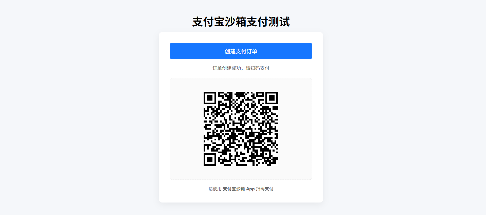
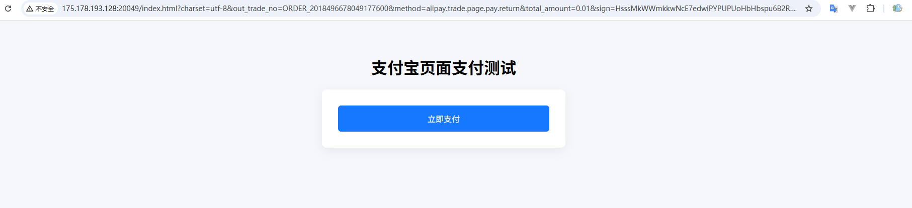

# 支付宝支付

------

## 整体流程

**支付宝沙箱支付 = 5 个核心步骤**

1. 申请并配置支付宝沙箱
2. 引入 SDK + 基础配置
3. 创建支付订单（生成二维码）
4. 支付宝异步通知（回调验签）
5. 支付结果查询 / 业务落库

------

## 支付宝沙箱准备

**进入沙箱**

👉 https://open.alipay.com/platform/appDaily.htm

**创建沙箱应用**

私钥和公钥是 `接口加签方式` 的 `公钥模式`

| 参数       | 用途         |
| ---------- | ------------ |
| APPID      | 应用唯一标识 |
| 应用私钥   | 你这边签名用 |
| 支付宝公钥 | 验签用       |
| 网关地址   | 沙箱网关     |

**沙箱网关地址（一定要用这个）**

```
https://openapi-sandbox.dl.alipaydev.com/gateway.do
```

**下载沙箱版支付宝 App（测试扫码用）**

页面有下载链接，用普通支付宝是扫不了沙箱码的。

**沙箱 vs 正式环境切换要点**

代码不变，只换配置

| 项目       | 沙箱    | 正式    |
| ---------- | ------- | ------- |
| 网关       | sandbox | openapi |
| APPID      | 沙箱    | 正式    |
| 密钥       | 沙箱    | 正式    |
| 支付宝 App | 沙箱版  | 正式    |

**网关地址**

| 环境     | 网关地址                                              |
| -------- | ----------------------------------------------------- |
| **沙箱** | `https://openapi-sandbox.dl.alipaydev.com/gateway.do` |
| **正式** | `https://openapi.alipay.com/gateway.do`               |

------

## 基础配置

**添加依赖**

```xml
<properties>
    <alipay.version>4.40.645.ALL</alipay.version>
</properties>
<dependencies>
   <!-- 支付宝支付依赖 -->
    <dependency>
        <groupId>com.alipay.sdk</groupId>
        <artifactId>alipay-sdk-java</artifactId>
        <version>${alipay.version}</version>
    </dependency>
</dependencies>
```

------

**application.yml 配置**

注意这个回调地址 `notify-url`，需要支付宝能访问到的地址，内网可以使用FRP穿透到公网：[FRP内网穿透参考文档](https://atengk.github.io/ops/#/work/service/frp/)

```yaml
---
# 支付宝支付配置
alipay:
  app-id: 9021000xxxxxxxx
  private-key: MIIExxxxxxxx
  alipay-public-key: MIIBxxxxxxxx
  
  gateway-url: https://openapi-sandbox.dl.alipaydev.com/gateway.do
  notify-url: https://你的域名/api/pay/alipay/notify
  charset: utf-8
  sign-type: RSA2
```

------

**AlipayClient 配置 Bean**

```java
package io.github.atengk.alipay.config;

import com.alipay.api.AlipayClient;
import com.alipay.api.DefaultAlipayClient;
import lombok.Data;
import org.springframework.boot.context.properties.ConfigurationProperties;
import org.springframework.context.annotation.Bean;
import org.springframework.context.annotation.Configuration;

/**
 * 支付宝基础配置类
 *
 * <p>
 * 用于加载支付宝相关配置，并创建 {@link AlipayClient} 客户端实例。
 * 支持沙箱环境和正式环境通过配置切换，业务代码无需改动。
 * </p>
 *
 * @author 孔余
 * @since 2026-02-02
 */
@Configuration
@ConfigurationProperties(prefix = "alipay")
@Data
public class AlipayConfig {

    /**
     * 支付宝应用 APPID
     */
    private String appId;

    /**
     * 应用私钥（PKCS8 格式）
     */
    private String privateKey;

    /**
     * 支付宝公钥
     */
    private String alipayPublicKey;

    /**
     * 支付宝网关地址
     *
     * <p>
     * 沙箱环境：
     * https://openapi-sandbox.dl.alipaydev.com/gateway.do
     *
     * 正式环境：
     * https://openapi.alipay.com/gateway.do
     * </p>
     */
    private String gatewayUrl;

    /**
     * 支付宝异步通知回调地址
     */
    private String notifyUrl;

    /**
     * 请求和响应字符集
     */
    private String charset;

    /**
     * 签名类型（通常为 RSA2）
     */
    private String signType;

    /**
     * 创建支付宝客户端实例
     *
     * <p>
     * 该客户端用于调用支付宝各类 OpenAPI 接口，
     * 如创建支付订单、查询交易状态等。
     * </p>
     *
     * @return AlipayClient
     */
    @Bean
    public AlipayClient alipayClient() {
        return new DefaultAlipayClient(
                gatewayUrl,
                appId,
                privateKey,
                "json",
                charset,
                alipayPublicKey,
                signType
        );
    }
}
```

------

## 创建接口

### 创建支付订单

```java
package io.github.atengk.alipay.controller;

import com.alibaba.fastjson2.JSON;
import com.alibaba.fastjson2.JSONObject;
import com.alipay.api.AlipayClient;
import com.alipay.api.internal.util.AlipaySignature;
import com.alipay.api.request.AlipayTradePrecreateRequest;
import com.alipay.api.response.AlipayTradePrecreateResponse;
import io.github.atengk.alipay.config.AlipayConfig;
import jakarta.servlet.http.HttpServletRequest;
import lombok.RequiredArgsConstructor;
import lombok.extern.slf4j.Slf4j;
import org.springframework.web.bind.annotation.PostMapping;
import org.springframework.web.bind.annotation.RequestMapping;
import org.springframework.web.bind.annotation.RestController;

import java.util.HashMap;
import java.util.Map;

/**
 * 支付宝支付接口控制器
 *
 * <p>
 * 主要用于演示和测试支付宝【当面付（扫码支付）】的完整流程：
 * 创建支付订单、生成二维码、接收支付宝异步通知。
 * </p>
 *
 * @author 孔余
 * @since 2026-02-02
 */
@Slf4j
@RestController
@RequestMapping("/api/pay/alipay")
@RequiredArgsConstructor
public class AlipayController {

    /**
     * 支付宝客户端
     */
    private final AlipayClient alipayClient;

    /**
     * 支付宝配置（APPID、密钥、回调地址等）
     */
    private final AlipayConfig alipayConfig;

    /**
     * 创建支付宝支付订单（当面付预下单）
     *
     * <p>
     * 调用支付宝接口生成支付二维码（支付链接），
     * 前端根据返回的二维码内容展示给用户扫码支付。
     * </p>
     *
     * @return 支付二维码内容（支付链接）
     * @throws Exception 支付宝接口调用异常
     */
    @PostMapping("/create")
    public String createPay() throws Exception {

        String outTradeNo = "ORDER_" + System.currentTimeMillis();
        String amount = "0.01";

        log.info("[ALIPAY-CREATE] 开始创建支付订单");
        log.info("[ALIPAY-CREATE] outTradeNo={}, amount={}", outTradeNo, amount);

        AlipayTradePrecreateRequest request = new AlipayTradePrecreateRequest();

        JSONObject bizContent = new JSONObject();
        bizContent.put("out_trade_no", outTradeNo);
        bizContent.put("total_amount", amount);
        bizContent.put("subject", "测试订单");
        bizContent.put("timeout_express", "5m");

        request.setBizContent(bizContent.toString());
        request.setNotifyUrl(alipayConfig.getNotifyUrl());

        log.info("[ALIPAY-CREATE] 请求参数 bizContent={}", bizContent.toJSONString());
        log.info("[ALIPAY-CREATE] notifyUrl={}", alipayConfig.getNotifyUrl());

        AlipayTradePrecreateResponse response = alipayClient.execute(request);

        log.info("[ALIPAY-RESPONSE] 支付宝响应 raw={}", JSON.toJSONString(response));

        if (response.isSuccess()) {
            log.info("[ALIPAY-RESPONSE] 创建成功 outTradeNo={}, qrCode={}",
                    outTradeNo, response.getQrCode());
            return response.getQrCode();
        }

        log.error("[ALIPAY-RESPONSE] 创建失败 outTradeNo={}, subCode={}, subMsg={}",
                outTradeNo, response.getSubCode(), response.getSubMsg());

        throw new RuntimeException(response.getSubMsg());
    }

}
```


### 异步通知回调接口

```java
package io.github.atengk.alipay.controller;

import com.alibaba.fastjson2.JSON;
import com.alibaba.fastjson2.JSONObject;
import com.alipay.api.AlipayClient;
import com.alipay.api.internal.util.AlipaySignature;
import com.alipay.api.request.AlipayTradePrecreateRequest;
import com.alipay.api.response.AlipayTradePrecreateResponse;
import io.github.atengk.alipay.config.AlipayConfig;
import jakarta.servlet.http.HttpServletRequest;
import lombok.RequiredArgsConstructor;
import lombok.extern.slf4j.Slf4j;
import org.springframework.web.bind.annotation.PostMapping;
import org.springframework.web.bind.annotation.RequestMapping;
import org.springframework.web.bind.annotation.RestController;

import java.util.HashMap;
import java.util.Map;

/**
 * 支付宝支付接口控制器
 *
 * <p>
 * 主要用于演示和测试支付宝【当面付（扫码支付）】的完整流程：
 * 创建支付订单、生成二维码、接收支付宝异步通知。
 * </p>
 *
 * @author 孔余
 * @since 2026-02-02
 */
@Slf4j
@RestController
@RequestMapping("/api/pay/alipay")
@RequiredArgsConstructor
public class AlipayController {

    /**
     * 支付宝客户端
     */
    private final AlipayClient alipayClient;

    /**
     * 支付宝配置（APPID、密钥、回调地址等）
     */
    private final AlipayConfig alipayConfig;

    /**
     * 支付宝异步通知回调接口
     *
     * <p>
     * 用于接收支付宝支付结果通知，
     * 通过验签确认通知合法性，并根据支付状态执行业务逻辑。
     * </p>
     *
     * @param request 支付宝回调请求
     * @return success 表示处理成功，failure 表示处理失败
     * @throws Exception 验签或业务处理异常
     */
    @PostMapping("/notify")
    public String notify(HttpServletRequest request) throws Exception {

        log.info("[ALIPAY-NOTIFY] 收到支付宝异步通知");

        Map<String, String> params = new HashMap<>();
        request.getParameterMap().forEach(
                (k, v) -> params.put(k, v[0])
        );

        log.info("[ALIPAY-NOTIFY] 通知参数={}", JSON.toJSONString(params));

        boolean signVerified = AlipaySignature.rsaCheckV1(
                params,
                alipayConfig.getAlipayPublicKey(),
                alipayConfig.getCharset(),
                alipayConfig.getSignType()
        );

        log.info("[ALIPAY-NOTIFY] 验签结果 signVerified={}", signVerified);

        if (!signVerified) {
            log.warn("[ALIPAY-NOTIFY] 验签失败，直接返回 failure");
            return "failure";
        }

        String tradeStatus = params.get("trade_status");
        String outTradeNo = params.get("out_trade_no");
        String totalAmount = params.get("total_amount");
        String tradeNo = params.get("trade_no");

        log.info(
                "[ALIPAY-BIZ] tradeStatus={}, outTradeNo={}, tradeNo={}, totalAmount={}",
                tradeStatus, outTradeNo, tradeNo, totalAmount
        );

        if ("TRADE_SUCCESS".equals(tradeStatus)) {

            log.info("[ALIPAY-BIZ] 支付成功，准备执行业务逻辑 outTradeNo={}", outTradeNo);

            // TODO 校验金额
            // TODO 校验 app_id / seller_id
            // TODO 幂等处理（是否已处理过该订单）

            log.info("[ALIPAY-BIZ] 业务处理完成 outTradeNo={}", outTradeNo);
        } else {
            log.warn("[ALIPAY-BIZ] 非成功状态 tradeStatus={}, outTradeNo={}",
                    tradeStatus, outTradeNo);
        }

        log.info("[ALIPAY-NOTIFY] 返回 success 给支付宝");
        return "success";
    }
}

```

### 前端页面（展示支付二维码）

Vue3 可以参考使用 VueUse 的 useQRCode 生成二维码图片，链接：[二维码生成：useQuCode](https://atengk.github.io/Ateng-Vue/#/apps/vueuse-integrations/?id=%e4%ba%8c%e7%bb%b4%e7%a0%81%e7%94%9f%e6%88%90%ef%bc%9auseqrcode)

```html
<!DOCTYPE html>
<html lang="zh-CN">
<head>
    <meta charset="UTF-8">
    <title>支付宝沙箱支付测试</title>
    <meta name="viewport" content="width=device-width, initial-scale=1.0">

    <!-- 二维码生成库 -->
    <script src="https://cdn.jsdelivr.net/npm/qrcodejs2@0.0.2/qrcode.min.js"></script>

    <style>
        body {
            font-family: -apple-system, BlinkMacSystemFont, "Segoe UI", Roboto, Helvetica, Arial;
            background: #f5f7fa;
            padding: 40px;
            text-align: center;
        }

        h1 {
            margin-bottom: 10px;
        }

        .container {
            max-width: 420px;
            margin: 0 auto;
            background: #ffffff;
            padding: 32px;
            border-radius: 10px;
            box-shadow: 0 6px 20px rgba(0, 0, 0, 0.06);
        }

        button {
            width: 100%;
            padding: 12px 0;
            font-size: 16px;
            border: none;
            border-radius: 6px;
            background: #1677ff;
            color: #fff;
            cursor: pointer;
        }

        button:disabled {
            background: #a0c2ff;
            cursor: not-allowed;
        }

        .status {
            margin-top: 16px;
            font-size: 14px;
            color: #555;
            min-height: 20px;
        }

        .order {
            margin-top: 10px;
            font-size: 13px;
            color: #888;
        }

        #qrcode {
            margin-top: 20px;
            padding: 20px;
            background: #fafafa;
            border-radius: 8px;
            display: flex;
            justify-content: center;
            align-items: center;
            min-height: 260px;
            border: 1px dashed #ddd;
        }

        .tip {
            margin-top: 16px;
            color: #666;
            font-size: 13px;
        }
    </style>
</head>
<body>

<h1>支付宝沙箱支付测试</h1>

<div class="container">

    <button id="payBtn" onclick="createPay()">创建支付订单</button>

    <div class="status" id="statusText"></div>
    <div class="order" id="orderText"></div>

    <div id="qrcode">
        <span style="color:#999;font-size:14px;">二维码将在此显示</span>
    </div>

    <div class="tip">
        请使用 <strong>支付宝沙箱 App</strong> 扫码支付
    </div>

</div>

<script>
    const payBtn = document.getElementById("payBtn");
    const statusText = document.getElementById("statusText");
    const orderText = document.getElementById("orderText");
    const qrContainer = document.getElementById("qrcode");

    function createPay() {

        // UI 初始化
        payBtn.disabled = true;
        statusText.textContent = "正在创建支付订单...";
        orderText.textContent = "";
        qrContainer.innerHTML = "";

        fetch("/api/pay/alipay/create", {
            method: "POST",
            headers: {
                "Content-Type": "application/json"
            }
        })
        .then(resp => {
            if (!resp.ok) {
                throw new Error("HTTP " + resp.status);
            }
            return resp.text();
        })
        .then(qrCodeText => {

            statusText.textContent = "订单创建成功，请扫码支付";

            new QRCode(qrContainer, {
                text: qrCodeText,
                width: 220,
                height: 220
            });

            // 从二维码内容里简单截取订单号（仅用于演示）
            const match = qrCodeText.match(/out_trade_no=([^&]+)/);
            if (match) {
                orderText.textContent = "订单号：" + decodeURIComponent(match[1]);
            }
        })
        .catch(err => {
            statusText.textContent = "创建支付失败，请重试";
            console.error(err);
        })
        .finally(() => {
            payBtn.disabled = false;
        });
    }
</script>

</body>
</html>
```




## 证书模式

 `接口加签方式` 的 `证书模式`

| 参数           | 配置名               |
| -------------- | -------------------- |
| 应用私钥       | `privateKey`         |
| 应用公钥证书   | `appCertPath`        |
| 支付宝公钥证书 | `alipayCertPath`     |
| 支付宝根证书   | `alipayRootCertPath` |


### 配置

**application.yml 配置**

```yaml
---
# 支付宝支付配置
alipay:
  app-id: 9021000xxxxxxxx
  private-key: MIIExxxxxxxx
  app-cert-path: alipay/cert/appPublicCert.crt
  alipay-cert-path: alipay/cert/alipayPublicCert.crt
  alipay-root-cert-path: alipay/cert/alipayRootCert.crt

  gateway-url: https://openapi-sandbox.dl.alipaydev.com/gateway.do
  notify-url: http://你的域名/api/pay/alipay/notify
  charset: utf-8
  sign-type: RSA2
```

**AlipayClient 配置 Bean**

```java
package io.github.atengk.alipay.config;

import com.alipay.api.AlipayClient;
import com.alipay.api.CertAlipayRequest;
import com.alipay.api.DefaultAlipayClient;
import lombok.Data;
import org.springframework.boot.context.properties.ConfigurationProperties;
import org.springframework.context.annotation.Bean;
import org.springframework.context.annotation.Configuration;
import org.springframework.core.io.ClassPathResource;

import java.io.File;
import java.io.FileOutputStream;
import java.io.InputStream;
import java.io.OutputStream;

/**
 * 支付宝证书模式配置类
 *
 * <p>
 * 该配置基于支付宝开放平台「证书模式」进行初始化，
 * 通过 CertAlipayRequest 构建 AlipayClient 实例。
 * </p>
 *
 * <p>
 * 由于支付宝 SDK 仅支持读取文件系统中的证书路径，
 * 因此 classpath 下的证书文件会在启动时复制到系统临时目录，
 * 再将生成的绝对路径交由 SDK 使用。
 * </p>
 */
@Data
@Configuration
@ConfigurationProperties(prefix = "alipay")
public class AlipayConfig {

    /**
     * 支付宝应用 APP_ID
     */
    private String appId;

    /**
     * 商户应用私钥
     *
     * <p>
     * 用于请求加签，必须与支付宝后台配置的应用公钥成对
     * </p>
     */
    private String privateKey;

    /**
     * 应用公钥证书路径（classpath 相对路径）
     */
    private String appCertPath;

    /**
     * 支付宝公钥证书路径（classpath 相对路径）
     */
    private String alipayCertPath;

    /**
     * 支付宝公钥证书路径
     */
    private String realAlipayCertPath;

    /**
     * 支付宝根证书路径（classpath 相对路径）
     */
    private String alipayRootCertPath;

    /**
     * 支付宝网关地址
     *
     * <p>
     * 沙箱环境与正式环境不同
     * </p>
     */
    private String gatewayUrl;

    /**
     * 支付宝异步通知地址
     */
    private String notifyUrl;

    /**
     * 请求与响应字符集
     */
    private String charset;

    /**
     * 签名算法类型
     *
     * <p>
     * 证书模式下通常使用 RSA2
     * </p>
     */
    private String signType;

    /**
     * 初始化支付宝客户端（证书模式）
     *
     * <p>
     * 启动时会将 classpath 下的证书复制到系统临时目录，
     * 并使用临时文件的绝对路径构建 CertAlipayRequest。
     * </p>
     *
     * @return AlipayClient 实例
     * @throws Exception 证书读取或初始化异常
     */
    @Bean
    public AlipayClient alipayClient() throws Exception {

        String appCert = copyCertToTemp(appCertPath);
        String alipayCert = copyCertToTemp(alipayCertPath);
        String rootCert = copyCertToTemp(alipayRootCertPath);

        this.realAlipayCertPath = alipayCert;

        CertAlipayRequest certRequest = new CertAlipayRequest();
        certRequest.setServerUrl(gatewayUrl);
        certRequest.setAppId(appId);
        certRequest.setPrivateKey(privateKey);
        certRequest.setFormat("json");
        certRequest.setCharset(charset);
        certRequest.setSignType(signType);
        certRequest.setCertPath(appCert);
        certRequest.setAlipayPublicCertPath(alipayCert);
        certRequest.setRootCertPath(rootCert);

        return new DefaultAlipayClient(certRequest);
    }

    /**
     * 将 classpath 下的证书文件复制到系统临时目录
     *
     * <p>
     * 支付宝 SDK 证书模式仅支持通过文件系统路径读取证书，
     * 无法直接使用 classpath 资源或 InputStream，
     * 因此需要在运行时生成临时文件。
     * </p>
     *
     * @param classpathLocation classpath 相对路径
     * @return 临时证书文件的绝对路径
     * @throws Exception 证书读取或文件写入异常
     */
    private String copyCertToTemp(String classpathLocation) throws Exception {

        String fileName = classpathLocation.substring(
                classpathLocation.lastIndexOf('/') + 1
        );

        File tempFile = File.createTempFile(fileName, ".crt");
        tempFile.deleteOnExit();

        try (InputStream in = new ClassPathResource(classpathLocation).getInputStream();
             OutputStream out = new FileOutputStream(tempFile)) {
            in.transferTo(out);
        }

        return tempFile.getAbsolutePath();
    }

}
```

### 接口

```java
package io.github.atengk.alipay.controller;

import com.alibaba.fastjson2.JSON;
import com.alibaba.fastjson2.JSONObject;
import com.alipay.api.AlipayClient;
import com.alipay.api.internal.util.AlipaySignature;
import com.alipay.api.request.AlipayTradePrecreateRequest;
import com.alipay.api.response.AlipayTradePrecreateResponse;
import io.github.atengk.alipay.config.AlipayConfig;
import jakarta.servlet.http.HttpServletRequest;
import lombok.RequiredArgsConstructor;
import lombok.extern.slf4j.Slf4j;
import org.springframework.web.bind.annotation.PostMapping;
import org.springframework.web.bind.annotation.RequestMapping;
import org.springframework.web.bind.annotation.RestController;

import java.util.HashMap;
import java.util.Map;

/**
 * 支付宝支付接口控制器
 *
 * <p>
 * 基于支付宝【当面付（扫码支付）】能力，
 * 使用【证书模式】完成支付下单与异步通知验签处理。
 * </p>
 *
 * <p>
 * 当前接口主要用于：
 * </p>
 * <ul>
 *     <li>创建支付订单并生成二维码</li>
 *     <li>接收支付宝支付结果异步通知</li>
 * </ul>
 *
 * @author 孔余
 * @since 2026-02-02
 */
@Slf4j
@RestController
@RequestMapping("/api/pay/alipay")
@RequiredArgsConstructor
public class AlipayController {

    /**
     * 支付宝客户端（证书模式）
     */
    private final AlipayClient alipayClient;

    /**
     * 支付宝配置（APPID、证书路径、回调地址等）
     */
    private final AlipayConfig alipayConfig;

    /**
     * 创建支付宝支付订单（当面付预下单）
     *
     * <p>
     * 调用支付宝 {@code alipay.trade.precreate} 接口，
     * 生成用于扫码支付的二维码链接。
     * </p>
     *
     * <p>
     * 前端获取返回的二维码内容后，
     * 可通过二维码组件生成支付二维码。
     * </p>
     *
     * @return 支付二维码内容（qr_code）
     * @throws Exception 支付宝接口调用异常
     */
    @PostMapping("/create")
    public String createPay() throws Exception {

        String outTradeNo = "ORDER_" + System.currentTimeMillis();
        String amount = "0.01";

        log.info("[ALIPAY-CREATE] start outTradeNo={}, amount={}", outTradeNo, amount);

        AlipayTradePrecreateRequest request = new AlipayTradePrecreateRequest();

        JSONObject bizContent = new JSONObject();
        bizContent.put("out_trade_no", outTradeNo);
        bizContent.put("total_amount", amount);
        bizContent.put("subject", "测试订单");
        bizContent.put("timeout_express", "5m");

        request.setBizContent(bizContent.toJSONString());
        request.setNotifyUrl(alipayConfig.getNotifyUrl());

        log.info("[ALIPAY-CREATE] bizContent={}", bizContent.toJSONString());
        log.info("[ALIPAY-CREATE] notifyUrl={}", alipayConfig.getNotifyUrl());

        AlipayTradePrecreateResponse response =
                alipayClient.certificateExecute(request);

        log.info("[ALIPAY-RESPONSE] raw={}", JSON.toJSONString(response));

        if (response.isSuccess()) {
            log.info("[ALIPAY-RESPONSE] success outTradeNo={}, qrCode={}",
                    outTradeNo, response.getQrCode());
            return response.getQrCode();
        }

        log.error("[ALIPAY-RESPONSE] fail outTradeNo={}, subCode={}, subMsg={}",
                outTradeNo, response.getSubCode(), response.getSubMsg());

        throw new RuntimeException(response.getSubMsg());
    }

    /**
     * 支付宝支付结果异步通知接口
     *
     * <p>
     * 支付宝在支付状态变更后，会以 POST 方式调用该接口。
     * 接口需完成以下步骤：
     * </p>
     *
     * <ol>
     *     <li>接收并解析回调参数</li>
     *     <li>使用支付宝公钥证书进行验签</li>
     *     <li>根据交易状态执行业务逻辑</li>
     *     <li>返回 {@code success} 或 {@code failure}</li>
     * </ol>
     *
     * <p>
     * 注意：只有返回字符串 {@code success}，
     * 支付宝才会认为通知处理成功。
     * </p>
     *
     * @param request 支付宝异步通知请求
     * @return success 表示处理成功，failure 表示处理失败
     * @throws Exception 验签或业务处理异常
     */
    @PostMapping("/notify")
    public String notify(HttpServletRequest request) throws Exception {

        log.info("[ALIPAY-NOTIFY] receive");

        Map<String, String> params = new HashMap<>();
        request.getParameterMap().forEach(
                (k, v) -> params.put(k, v[0])
        );

        log.info("[ALIPAY-NOTIFY] params={}", JSON.toJSONString(params));

        boolean signVerified = AlipaySignature.rsaCertCheckV1(
                params,
                alipayConfig.getRealAlipayCertPath(),
                alipayConfig.getCharset(),
                alipayConfig.getSignType()
        );

        log.info("[ALIPAY-NOTIFY] signVerified={}", signVerified);

        if (!signVerified) {
            log.warn("[ALIPAY-NOTIFY] sign verify fail");
            return "failure";
        }

        String tradeStatus = params.get("trade_status");
        String outTradeNo = params.get("out_trade_no");
        String totalAmount = params.get("total_amount");
        String tradeNo = params.get("trade_no");

        log.info("[ALIPAY-BIZ] tradeStatus={}, outTradeNo={}, tradeNo={}, totalAmount={}",
                tradeStatus, outTradeNo, tradeNo, totalAmount);

        if ("TRADE_SUCCESS".equals(tradeStatus)) {
            log.info("[ALIPAY-BIZ] success outTradeNo={}", outTradeNo);
        } else {
            log.warn("[ALIPAY-BIZ] ignore tradeStatus={}, outTradeNo={}",
                    tradeStatus, outTradeNo);
        }

        log.info("[ALIPAY-NOTIFY] return success");
        return "success";
    }
}
```


## 常用接口

```java
package io.github.atengk.alipay.controller;

import com.alibaba.fastjson2.JSON;
import com.alibaba.fastjson2.JSONObject;
import com.alipay.api.AlipayClient;
import com.alipay.api.internal.util.AlipaySignature;
import com.alipay.api.request.*;
import com.alipay.api.response.*;
import io.github.atengk.alipay.config.AlipayConfig;
import jakarta.servlet.http.HttpServletRequest;
import lombok.RequiredArgsConstructor;
import lombok.extern.slf4j.Slf4j;
import org.springframework.web.bind.annotation.*;

import java.util.HashMap;
import java.util.Map;

@Slf4j
@RestController
@RequestMapping("/api/pay/alipay")
@RequiredArgsConstructor
public class AlipayController {

    private final AlipayClient alipayClient;
    private final AlipayConfig alipayConfig;

    /** 创建支付（扫码） */
    @PostMapping("/create")
    public String create() throws Exception {

        String outTradeNo = "ORDER_" + System.currentTimeMillis();

        AlipayTradePrecreateRequest request = new AlipayTradePrecreateRequest();

        JSONObject biz = new JSONObject();
        biz.put("out_trade_no", outTradeNo);
        biz.put("total_amount", "0.01");
        biz.put("subject", "测试订单");
        biz.put("timeout_express", "5m");

        request.setBizContent(biz.toJSONString());
        request.setNotifyUrl(alipayConfig.getNotifyUrl());

        AlipayTradePrecreateResponse response =
                alipayClient.certificateExecute(request);

        if (response.isSuccess()) {
            return response.getQrCode();
        }

        throw new RuntimeException(response.getSubMsg());
    }

    /** 支付宝异步通知 */
    @PostMapping("/notify")
    public String notify(HttpServletRequest request) throws Exception {

        Map<String, String> params = new HashMap<>();
        request.getParameterMap()
                .forEach((k, v) -> params.put(k, v[0]));

        boolean signVerified = AlipaySignature.rsaCertCheckV1(
                params,
                alipayConfig.getRealAlipayCertPath(),
                alipayConfig.getCharset(),
                alipayConfig.getSignType()
        );

        if (!signVerified) {
            return "failure";
        }

        if ("TRADE_SUCCESS".equals(params.get("trade_status"))) {
            log.info("支付成功 outTradeNo={}", params.get("out_trade_no"));
            // 更新订单状态（幂等）
        }

        return "success";
    }

    /** 查询订单状态 */
    @GetMapping("/query")
    public String query(@RequestParam String outTradeNo) throws Exception {

        AlipayTradeQueryRequest request = new AlipayTradeQueryRequest();

        JSONObject biz = new JSONObject();
        biz.put("out_trade_no", outTradeNo);
        request.setBizContent(biz.toJSONString());

        AlipayTradeQueryResponse response =
                alipayClient.certificateExecute(request);

        return JSON.toJSONString(response);
    }

    /** 关闭订单 */
    @PostMapping("/close")
    public String close(@RequestParam String outTradeNo) throws Exception {

        AlipayTradeCloseRequest request = new AlipayTradeCloseRequest();

        JSONObject biz = new JSONObject();
        biz.put("out_trade_no", outTradeNo);
        request.setBizContent(biz.toJSONString());

        AlipayTradeCloseResponse response =
                alipayClient.certificateExecute(request);

        return JSON.toJSONString(response);
    }

    /** 退款 */
    @PostMapping("/refund")
    public String refund(
            @RequestParam String outTradeNo,
            @RequestParam String amount
    ) throws Exception {

        AlipayTradeRefundRequest request = new AlipayTradeRefundRequest();

        JSONObject biz = new JSONObject();
        biz.put("out_trade_no", outTradeNo);
        biz.put("refund_amount", amount);
        request.setBizContent(biz.toJSONString());

        AlipayTradeRefundResponse response =
                alipayClient.certificateExecute(request);

        return JSON.toJSONString(response);
    }

    /** 查询退款 */
    @GetMapping("/refund/query")
    public String refundQuery(
            @RequestParam String outTradeNo,
            @RequestParam String refundRequestNo
    ) throws Exception {

        AlipayTradeFastpayRefundQueryRequest request =
                new AlipayTradeFastpayRefundQueryRequest();

        JSONObject biz = new JSONObject();
        biz.put("out_trade_no", outTradeNo);
        biz.put("out_request_no", refundRequestNo);
        request.setBizContent(biz.toJSONString());

        AlipayTradeFastpayRefundQueryResponse response =
                alipayClient.certificateExecute(request);

        return JSON.toJSONString(response);
    }

    /** 对账 / 补偿（主动同步） */
    @PostMapping("/sync")
    public String sync(@RequestParam String outTradeNo) throws Exception {

        AlipayTradeQueryRequest request = new AlipayTradeQueryRequest();

        JSONObject biz = new JSONObject();
        biz.put("out_trade_no", outTradeNo);
        request.setBizContent(biz.toJSONString());

        AlipayTradeQueryResponse response =
                alipayClient.certificateExecute(request);

        if (response.isSuccess()
                && "TRADE_SUCCESS".equals(response.getTradeStatus())) {
            log.info("补偿成功 outTradeNo={}", outTradeNo);
        }

        return JSON.toJSONString(response);
    }
}
```


## 跳转支付宝支付

### 配置

只需要添加一个 `return-url` 参数

**application.yml 配置**

```yaml
alipay:
  return-url: http://你的域名/index.html
```

**AlipayClient 配置 Bean**

```java
public class AlipayConfig {

    /**
     * 支付宝支付成功跳转页面地址
     */
    private String returnUrl;
}
```

### 接口

```java
package io.github.atengk.alipay.controller;

import cn.hutool.core.util.IdUtil;
import com.alibaba.fastjson2.JSON;
import com.alipay.api.AlipayClient;
import com.alipay.api.domain.AlipayTradePagePayModel;
import com.alipay.api.internal.util.AlipaySignature;
import com.alipay.api.request.AlipayTradePagePayRequest;
import io.github.atengk.alipay.config.AlipayConfig;
import jakarta.servlet.http.HttpServletRequest;
import jakarta.servlet.http.HttpServletResponse;
import lombok.RequiredArgsConstructor;
import lombok.extern.slf4j.Slf4j;
import org.springframework.web.bind.annotation.GetMapping;
import org.springframework.web.bind.annotation.PostMapping;
import org.springframework.web.bind.annotation.RequestMapping;
import org.springframework.web.bind.annotation.RestController;

import java.util.HashMap;
import java.util.Map;

/**
 * 支付宝页面支付控制器
 *
 * <p>
 * 负责：
 * <ul>
 *   <li>创建支付宝页面支付订单（跳转至支付宝收银台）</li>
 *   <li>接收并处理支付宝异步通知回调</li>
 * </ul>
 * </p>
 *
 * <p>
 * 说明：
 * <ul>
 *   <li>支付结果以 {@code notify} 异步通知为准</li>
 *   <li>同步 {@code return_url} 仅用于页面跳转展示</li>
 *   <li>异步通知处理必须保证业务幂等</li>
 * </ul>
 * </p>
 */
@Slf4j
@RestController
@RequestMapping("/api/pay/alipay")
@RequiredArgsConstructor
public class AlipayController {

    /**
     * 支付宝 SDK 客户端
     * <p>
     * 由配置类统一初始化（证书模式 / 密钥模式）
     * </p>
     */
    private final AlipayClient alipayClient;

    /**
     * 支付宝配置（appId、回调地址、证书路径等）
     */
    private final AlipayConfig alipayConfig;

    /**
     * 创建页面支付订单（跳转到支付宝收银台）
     *
     * <p>
     * 该接口会返回一段 HTML form，
     * 浏览器渲染后会自动提交到支付宝网关。
     * </p>
     */
    @GetMapping("/create")
    public void create(HttpServletResponse response) throws Exception {

        // 商户订单号（必须全局唯一）
        String outTradeNo = "ORDER_" + IdUtil.getSnowflakeNextIdStr();

        // 页面支付请求对象
        AlipayTradePagePayRequest request = new AlipayTradePagePayRequest();

        // 异步通知地址（以此为准处理业务结果）
        request.setNotifyUrl(alipayConfig.getNotifyUrl());

        // 同步跳转地址（仅用于页面跳转展示）
        request.setReturnUrl(alipayConfig.getReturnUrl());

        // 页面支付业务参数（推荐使用 Model，避免签名问题）
        AlipayTradePagePayModel model = new AlipayTradePagePayModel();
        model.setOutTradeNo(outTradeNo);
        model.setProductCode("FAST_INSTANT_TRADE_PAY");
        model.setTotalAmount("0.01");
        model.setSubject("测试订单");

        request.setBizModel(model);

        log.info("[ALIPAY-CREATE] outTradeNo={}", outTradeNo);

        // 调用 SDK 生成自动提交的 HTML 表单
        String form = alipayClient.pageExecute(request).getBody();

        // 直接将表单写回浏览器
        response.setContentType("text/html;charset=UTF-8");
        response.getWriter().write(form);
        response.getWriter().flush();
    }

    /**
     * 支付宝异步通知回调
     *
     * <p>
     * 注意：
     * 1. 必须进行验签
     * 2. 必须保证业务处理幂等
     * 3. 处理成功后返回 "success"
     * </p>
     */
    @PostMapping("/notify")
    public String notify(HttpServletRequest request) throws Exception {

        // 将支付宝回调参数转换为 Map
        Map<String, String> params = new HashMap<>();
        request.getParameterMap()
                .forEach((k, v) -> params.put(k, v[0]));

        log.info("[ALIPAY-NOTIFY] params={}", JSON.toJSONString(params));

        // 证书模式验签
        boolean signVerified = AlipaySignature.rsaCertCheckV1(
                params,
                alipayConfig.getRealAlipayCertPath(),
                alipayConfig.getCharset(),
                alipayConfig.getSignType()
        );

        if (!signVerified) {
            log.warn("[ALIPAY-NOTIFY] sign verify fail");
            return "failure";
        }

        // 仅处理支付成功状态
        if ("TRADE_SUCCESS".equals(params.get("trade_status"))) {
            log.info("[ALIPAY-BIZ] pay success outTradeNo={}",
                    params.get("out_trade_no"));

            // TODO 更新订单状态（必须做幂等控制）
        }

        // 返回 success 告知支付宝已正确处理
        return "success";
    }
}
```

### 前端页面

```html
<!DOCTYPE html>
<html lang="zh-CN">
<head>
    <meta charset="UTF-8">
    <title>支付宝页面支付测试</title>
    <meta name="viewport" content="width=device-width, initial-scale=1.0">

    <style>
        body {
            font-family: -apple-system, BlinkMacSystemFont, "Segoe UI", Roboto;
            background: #f5f7fa;
            padding: 40px;
            text-align: center;
        }

        .container {
            max-width: 420px;
            margin: 0 auto;
            background: #ffffff;
            padding: 32px;
            border-radius: 10px;
            box-shadow: 0 6px 20px rgba(0, 0, 0, 0.06);
        }

        button {
            width: 100%;
            padding: 14px 0;
            font-size: 16px;
            border: none;
            border-radius: 6px;
            background: #1677ff;
            color: #fff;
            cursor: pointer;
        }
    </style>
</head>
<body>

<h1>支付宝页面支付测试</h1>

<div class="container">
    <button onclick="pay()">立即支付</button>
</div>

<script>
    function pay() {
        window.location.href = "/api/pay/alipay/create";
    }
</script>

</body>
</html>
```


