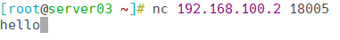
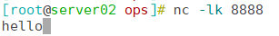

# Netty

Netty 是一个基于 NIO（New IO）的高性能、异步事件驱动的网络通信框架，适用于构建高并发、低延迟的网络应用。


## 基础配置

### 添加依赖

```xml
<!-- Netty 依赖 -->
<dependency>
    <groupId>io.netty</groupId>
    <artifactId>netty-all</artifactId>
</dependency>
```

### 编辑配置文件

```yaml
server:
  port: 18004
  servlet:
    context-path: /
spring:
  main:
    web-application-type: servlet
  application:
    name: ${project.artifactId}
---
netty:
  # Netty 服务端 端口号
  server:
    port: 18005
  # Netty 客户端 地址和端口号
  client:
    host: 192.168.1.12
    port: 8888
```


## 配置服务端

### 配置NettyServer

```java
package local.ateng.java.netty.netty;

import io.netty.bootstrap.ServerBootstrap;
import io.netty.channel.Channel;
import io.netty.channel.ChannelInitializer;
import io.netty.channel.ChannelPipeline;
import io.netty.channel.EventLoopGroup;
import io.netty.channel.nio.NioEventLoopGroup;
import io.netty.channel.socket.SocketChannel;
import io.netty.channel.socket.nio.NioServerSocketChannel;
import io.netty.handler.codec.string.StringDecoder;
import io.netty.handler.codec.string.StringEncoder;
import io.netty.handler.logging.LogLevel;
import io.netty.handler.logging.LoggingHandler;
import jakarta.annotation.PostConstruct;
import jakarta.annotation.PreDestroy;
import org.slf4j.Logger;
import org.slf4j.LoggerFactory;
import org.springframework.beans.factory.annotation.Value;
import org.springframework.stereotype.Component;


/**
 * Netty服务端
 *
 * @author 孔余
 * @email 2385569970@qq.com
 * @date 2024-08-29 09:21:02
 */
@Component
public class NettyServer {

    private static final Logger log = LoggerFactory.getLogger(NettyServer.class);
    // BossGroup 负责处理客户端的连接请求，线程数为1（通常即可）。
    private final EventLoopGroup bossGroup = new NioEventLoopGroup(1);
    // WorkerGroup 负责处理客户端的读写操作，线程数默认为 CPU 核心数的两倍。
    private final EventLoopGroup workerGroup = new NioEventLoopGroup();
    // 从 Spring 配置文件中读取端口号，默认为 27248
    @Value("${netty.server.port:27248}")
    private int port;
    // Netty 服务端的通道对象
    private Channel channel;

    /**
     * 启动 Netty 服务，绑定指定端口，处理客户端连接。
     * 使用 @PostConstruct 注解确保该方法在 Spring Bean 初始化后执行。
     */
    @PostConstruct
    public void start() {
        try {
            ServerBootstrap b = new ServerBootstrap(); // 创建并配置服务端的启动引导类

            b.group(bossGroup, workerGroup) // 设置线程组，处理连接和 IO 操作
                    .channel(NioServerSocketChannel.class) // 指定服务端 NIO 通信的通道类型
                    .handler(new LoggingHandler(LogLevel.INFO)) // 为服务端通道添加日志记录器，便于调试
                    .childHandler(new ChannelInitializer<SocketChannel>() { // 为每个客户端连接初始化处理器
                        @Override
                        protected void initChannel(SocketChannel ch) throws Exception {
                            ChannelPipeline p = ch.pipeline(); // 获取客户端的处理管道
                            // 添加编码器和解码器，处理字符串类型的数据传输
                            p.addLast(new StringDecoder());
                            p.addLast(new StringEncoder());
                            // 添加自定义的业务逻辑处理器
                            p.addLast(new NettyServerHandler());
                        }
                    });

            // 绑定端口并同步等待服务端启动
            channel = b.bind(port).sync().channel();
            log.info("启动TCP服务端成功，端口号：{}", port);
        } catch (InterruptedException e) {
            Thread.currentThread().interrupt(); // 恢复线程中断状态
            log.error("启动TCP服务端失败，端口号：{}，失败内容：{}", port, e.getMessage());
        }
    }

    /**
     * 获取 Netty 服务端通道
     *
     * @return 服务端通道对象
     */
    public Channel getChannel() {
        return channel;
    }

    /**
     * 停止 Netty 服务并释放资源。
     * 使用 @PreDestroy 注解确保该方法在 Spring Bean 销毁之前执行。
     */
    @PreDestroy
    public void stop() {
        if (channel != null) {
            channel.close(); // 关闭服务端通道
        }
        // 优雅地关闭线程组，释放资源
        bossGroup.shutdownGracefully();
        workerGroup.shutdownGracefully();
        log.info("关闭TCP服务，端口号：{}", port);
    }
}
```

### 配置NettyServerHandler

```java
package local.ateng.java.netty.netty;

import io.netty.channel.ChannelHandlerContext;
import io.netty.channel.SimpleChannelInboundHandler;
import io.netty.channel.group.ChannelGroup;
import io.netty.channel.group.DefaultChannelGroup;
import io.netty.util.concurrent.GlobalEventExecutor;

/**
 * 处理 Netty 服务端的客户端连接和消息。
 *
 * @author 孔余
 * @email 2385569970@qq.com
 * @date 2024-08-29 09:23:17
 */
public class NettyServerHandler extends SimpleChannelInboundHandler<String> {

    // 线程安全的 ChannelGroup，用于保存所有已连接的客户端通道
    private static final ChannelGroup channels = new DefaultChannelGroup(GlobalEventExecutor.INSTANCE);

    /**
     * 获取所有连接的客户端通道组
     *
     * @return 保存所有客户端通道的 ChannelGroup
     */
    public static ChannelGroup getChannels() {
        return channels;
    }

    /**
     * 当客户端连接到服务器时，调用该方法。
     * 将客户端通道添加到 channels 中。
     */
    @Override
    public void channelActive(ChannelHandlerContext ctx) throws Exception {
        channels.add(ctx.channel());
        System.out.println("Client connected: " + ctx.channel().remoteAddress());
    }

    /**
     * 当客户端断开连接时，调用该方法。
     * 将客户端通道从 channels 中移除。
     */
    @Override
    public void channelInactive(ChannelHandlerContext ctx) throws Exception {
        channels.remove(ctx.channel());
        System.out.println("Client disconnected: " + ctx.channel().remoteAddress());
    }

    /**
     * 当接收到客户端的消息时，调用该方法。
     * 打印接收到的消息。
     *
     * @param ctx 客户端的上下文信息
     * @param msg 接收到的消息
     */
    @Override
    protected void channelRead0(ChannelHandlerContext ctx, String msg) throws Exception {
        //System.out.println("Received message from " + ctx.channel().remoteAddress() + ": " + msg);
    }

    /**
     * 当处理过程中发生异常时，调用该方法。
     * 打印异常信息并关闭该客户端的连接。
     */
    @Override
    public void exceptionCaught(ChannelHandlerContext ctx, Throwable cause) throws Exception {
        cause.printStackTrace();  // 打印异常堆栈
        ctx.close();  // 关闭连接
    }
}
```

### 创建NettyServerService

```java
package local.ateng.java.netty.netty;

import io.netty.channel.group.ChannelGroup;

/**
 * Netty 服务端 服务
 *
 * @author 孔余
 * @email 2385569970@qq.com
 * @date 2024-08-29 09:12:29
 */
public class NettyServerService {

    /**
     * 发送消息
     *
     * @param message 消息
     */
    public static void send(String message) {
        ChannelGroup channels = NettyServerHandler.getChannels();
        channels.writeAndFlush(message);
    }
}
```


## 配置客户端

### 配置NettyClient

```java
package local.ateng.java.netty.netty;


import io.netty.bootstrap.Bootstrap;
import io.netty.channel.Channel;
import io.netty.channel.ChannelInitializer;
import io.netty.channel.ChannelPipeline;
import io.netty.channel.EventLoopGroup;
import io.netty.channel.nio.NioEventLoopGroup;
import io.netty.channel.socket.SocketChannel;
import io.netty.channel.socket.nio.NioSocketChannel;
import io.netty.handler.codec.string.StringDecoder;
import io.netty.handler.codec.string.StringEncoder;
import io.netty.handler.logging.LogLevel;
import io.netty.handler.logging.LoggingHandler;
import jakarta.annotation.PostConstruct;
import jakarta.annotation.PreDestroy;
import lombok.extern.slf4j.Slf4j;
import org.springframework.beans.factory.annotation.Value;
import org.springframework.stereotype.Component;


/**
 * Netty客户端
 *
 * @author 孔余
 * @email 2385569970@qq.com
 * @date 2024-08-29 09:21:02
 */
@Component
@Slf4j
public class NettyClient {

    private final EventLoopGroup group = new NioEventLoopGroup();
    private Channel channel;

    // 从 Spring 配置文件中读取服务器地址和端口号
    @Value("${netty.client.host:192.168.1.12}")
    private String host;
    @Value("${netty.client.port:27248}")
    private int port;

    /**
     * 启动 Netty 客户端并连接到服务器。
     * 使用 @PostConstruct 注解确保该方法在 Spring Bean 初始化后执行。
     */
    @PostConstruct
    public void start() {
        try {
            Bootstrap b = new Bootstrap(); // 创建并配置客户端的启动引导类

            b.group(group) // 设置线程组
                    .channel(NioSocketChannel.class) // 指定客户端 NIO 通信的通道类型
                    .handler(new LoggingHandler(LogLevel.INFO)) // 为客户端通道添加日志记录器，便于调试
                    .handler(new ChannelInitializer<SocketChannel>() { // 初始化客户端的通道
                        @Override
                        protected void initChannel(SocketChannel ch) throws Exception {
                            ChannelPipeline p = ch.pipeline(); // 获取客户端的处理管道
                            // 添加编码器和解码器，处理字符串类型的数据传输
                            p.addLast(new StringDecoder());
                            p.addLast(new StringEncoder());
                            // 添加自定义的业务逻辑处理器
                            p.addLast(new NettyClientHandler());
                        }
                    });

            // 连接到服务器并同步等待连接完成
            channel = b.connect(host, port).sync().channel();
            log.info("连接TCP服务端成功：{}:{}", host, port);
        } catch (InterruptedException e) {
            Thread.currentThread().interrupt(); // 恢复线程中断状态
            log.error("连接TCP服务端失败：{}:{}, 错误内容：{}", host, port, e.getMessage());
        }
    }

    /**
     * 获取 Netty 客户端通道
     *
     * @return 客户端通道对象
     */
    public Channel getChannel() {
        return channel;
    }

    /**
     * 停止 Netty 客户端并释放资源。
     * 使用 @PreDestroy 注解确保该方法在 Spring Bean 销毁之前执行。
     */
    @PreDestroy
    public void stop() {
        if (channel != null) {
            channel.close(); // 关闭客户端通道
        }
        // 优雅地关闭线程组，释放资源
        group.shutdownGracefully();
        log.info("关闭TCP服务端连接：{}:{}", host, port);
    }
}
```

### 配置NettyClientHandler

```java
package local.ateng.java.netty.netty;

import io.netty.channel.ChannelHandlerContext;
import io.netty.channel.SimpleChannelInboundHandler;

public class NettyClientHandler extends SimpleChannelInboundHandler<String> {

    /**
     * 处理从服务器接收到的消息。
     *
     * @param ctx 客户端上下文
     * @param msg 接收到的消息
     */
    @Override
    protected void channelRead0(ChannelHandlerContext ctx, String msg) throws Exception {
        //System.out.println("Received message from server: " + msg);
    }

    /**
     * 当连接到服务器时调用，可以在这里执行连接成功后的逻辑。
     */
    @Override
    public void channelActive(ChannelHandlerContext ctx) throws Exception {
        //System.out.println("Client connected to server: " + ctx.channel().remoteAddress());
    }

    /**
     * 当与服务器断开连接时调用，可以在这里执行断开后的逻辑。
     */
    @Override
    public void channelInactive(ChannelHandlerContext ctx) throws Exception {
        //System.out.println("Client disconnected from server");
    }

    /**
     * 捕获处理过程中发生的异常并关闭连接。
     *
     * @param ctx   客户端上下文
     * @param cause 异常原因
     */
    @Override
    public void exceptionCaught(ChannelHandlerContext ctx, Throwable cause) throws Exception {
        cause.printStackTrace();  // 打印异常堆栈
        ctx.close();  // 关闭连接
    }

}
```

### 配置NettyClientService

```java
package local.ateng.java.netty.netty;

import io.netty.channel.Channel;
import lombok.RequiredArgsConstructor;
import org.springframework.beans.factory.annotation.Autowired;
import org.springframework.stereotype.Component;

/**
 * Netty 客户端 服务
 *
 * @author 孔余
 * @email 2385569970@qq.com
 * @date 2024-08-29 09:12:29
 */
@Component
@RequiredArgsConstructor(onConstructor = @__(@Autowired))
public class NettyClientService {
    private final NettyClient nettyClient;

    /**
     * 发送消息
     *
     * @param message 消息
     */
    public void send(String message) {
        Channel channel = nettyClient.getChannel();
        channel.writeAndFlush(message);
    }
}
```


## 使用Netty

### 使用服务端

启动应用程序后，在Linux服务端使用nc命令访问TCP

```
nc 192.168.100.2 18005
```

调用接口发送消息给客户端

```
http://192.168.100.2:18004/message/server?message=hello
```



### 使用客户端

调用接口发送消息给服务端

```
http://192.168.100.2:18004/message/client?message=hello
```



