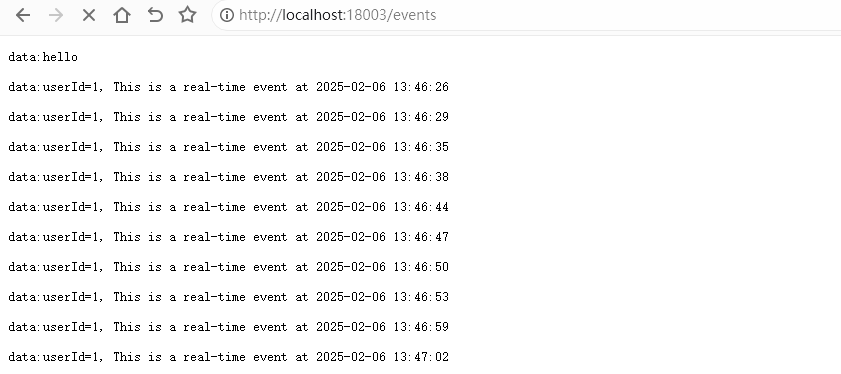
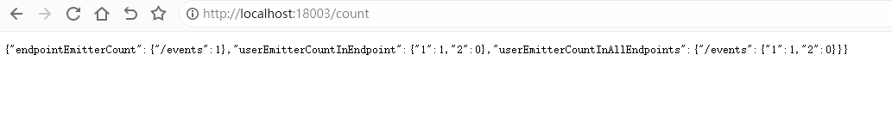

# SSE

SSE（Server-Sent Events，服务器推送事件）是一种用于从服务器向客户端单向推送实时数据的技术。SSE 使用 HTTP 协议，通过建立一个持续的连接，服务器可以定期或在需要时将数据推送到客户端，而不需要客户端不断发起请求。这在实现实时更新、通知等场景时非常有用。


## 基础配置

### 编辑 `pom.xml`

```xml
<?xml version="1.0" encoding="UTF-8"?>
<project xmlns:xsi="http://www.w3.org/2001/XMLSchema-instance" xmlns="http://maven.apache.org/POM/4.0.0"
         xsi:schemaLocation="http://maven.apache.org/POM/4.0.0 https://maven.apache.org/xsd/maven-4.0.0.xsd">
    <!-- 项目模型版本 -->
    <modelVersion>4.0.0</modelVersion>

    <!-- 项目坐标 -->
    <groupId>local.ateng.java</groupId>
    <artifactId>sse</artifactId>
    <version>v1.0</version>
    <name>sse</name>
    <description>
        SSE（Server-Sent Events，服务器推送事件）是一种用于从服务器向客户端单向推送实时数据的技术。
    </description>

    <!-- 项目属性 -->
    <properties>
        <java.version>21</java.version>
        <project.build.sourceEncoding>UTF-8</project.build.sourceEncoding>
        <project.reporting.outputEncoding>UTF-8</project.reporting.outputEncoding>
        <spring-boot.version>3.4.1</spring-boot.version>
        <maven-compiler.version>3.12.1</maven-compiler.version>
        <lombok.version>1.18.36</lombok.version>
        <fastjson2.version>2.0.53</fastjson2.version>
        <hutool.version>5.8.35</hutool.version>
    </properties>

    <!-- 项目依赖 -->
    <dependencies>
        <!-- Spring Boot Web Starter: 包含用于构建Web应用程序的Spring Boot依赖项 -->
        <dependency>
            <groupId>org.springframework.boot</groupId>
            <artifactId>spring-boot-starter-web</artifactId>
        </dependency>

        <!-- Spring Boot Starter Test: 包含用于测试Spring Boot应用程序的依赖项 -->
        <dependency>
            <groupId>org.springframework.boot</groupId>
            <artifactId>spring-boot-starter-test</artifactId>
            <scope>test</scope>
        </dependency>

        <!-- Lombok: 简化Java代码编写的依赖项 -->
        <!-- https://mvnrepository.com/artifact/org.projectlombok/lombok -->
        <dependency>
            <groupId>org.projectlombok</groupId>
            <artifactId>lombok</artifactId>
            <version>${lombok.version}</version>
            <scope>provided</scope>
        </dependency>

        <!-- Hutool: Java工具库，提供了许多实用的工具方法 -->
        <dependency>
            <groupId>cn.hutool</groupId>
            <artifactId>hutool-all</artifactId>
            <version>${hutool.version}</version>
        </dependency>

        <!-- Lombok: 简化Java代码编写的依赖项 -->
        <!-- https://mvnrepository.com/artifact/org.projectlombok/lombok -->
        <dependency>
            <groupId>org.projectlombok</groupId>
            <artifactId>lombok</artifactId>
            <version>${lombok.version}</version>
            <scope>provided</scope>
        </dependency>

        <!-- 高性能的JSON库 -->
        <!-- https://github.com/alibaba/fastjson2/wiki/fastjson2_intro_cn#0-fastjson-20%E4%BB%8B%E7%BB%8D -->
        <dependency>
            <groupId>com.alibaba.fastjson2</groupId>
            <artifactId>fastjson2</artifactId>
            <version>${fastjson2.version}</version>
        </dependency>

    </dependencies>

    <!-- Spring Boot 依赖管理 -->
    <dependencyManagement>
        <dependencies>
            <dependency>
                <groupId>org.springframework.boot</groupId>
                <artifactId>spring-boot-dependencies</artifactId>
                <version>${spring-boot.version}</version>
                <type>pom</type>
                <scope>import</scope>
            </dependency>
        </dependencies>
    </dependencyManagement>

    <!-- 插件仓库配置 -->
    <repositories>
        <!-- Central Repository -->
        <repository>
            <id>central</id>
            <name>阿里云中央仓库</name>
            <url>https://maven.aliyun.com/repository/central</url>
            <!--<name>Maven官方中央仓库</name>
            <url>https://repo.maven.apache.org/maven2/</url>-->
        </repository>
    </repositories>

    <!-- 构建配置 -->
    <build>
        <finalName>${project.name}-${project.version}</finalName>
        <plugins>
            <!-- Maven 编译插件 -->
            <plugin>
                <groupId>org.apache.maven.plugins</groupId>
                <artifactId>maven-compiler-plugin</artifactId>
                <version>${maven-compiler.version}</version>
                <configuration>
                    <source>${java.version}</source>
                    <target>${java.version}</target>
                    <encoding>${project.build.sourceEncoding}</encoding>
                    <!-- 编译参数 -->
                    <compilerArgs>
                        <!-- 启用Java 8参数名称保留功能 -->
                        <arg>-parameters</arg>
                    </compilerArgs>
                </configuration>
            </plugin>

            <!-- Spring Boot Maven 插件 -->
            <plugin>
                <groupId>org.springframework.boot</groupId>
                <artifactId>spring-boot-maven-plugin</artifactId>
                <version>${spring-boot.version}</version>
                <executions>
                    <execution>
                        <id>repackage</id>
                        <goals>
                            <goal>repackage</goal>
                        </goals>
                    </execution>
                </executions>
            </plugin>
        </plugins>
        <resources>
            <!-- 第一个资源配置块 -->
            <resource>
                <directory>src/main/resources</directory>
                <filtering>false</filtering>
            </resource>
            <!-- 第二个资源配置块 -->
            <resource>
                <directory>src/main/resources</directory>
                <includes>
                    <include>application*</include>
                    <include>bootstrap*.yml</include>
                    <include>common*</include>
                    <include>banner*</include>
                </includes>
                <filtering>true</filtering>
            </resource>
        </resources>
    </build>

</project>
```

### 配置跨域

```java
package local.ateng.java.sse.config;

import org.springframework.context.annotation.Bean;
import org.springframework.context.annotation.Configuration;
import org.springframework.web.cors.CorsConfiguration;
import org.springframework.web.cors.UrlBasedCorsConfigurationSource;
import org.springframework.web.filter.CorsFilter;
import org.springframework.web.servlet.config.annotation.CorsRegistry;
import org.springframework.web.servlet.config.annotation.WebMvcConfigurer;

@Configuration
public class CorsConfig {

    /**
     * 跨域配置
     */
    @Bean
    public CorsFilter corsFilter() {
        CorsConfiguration config = new CorsConfiguration();
        config.setAllowCredentials(true);
        // 设置访问源地址
        config.addAllowedOriginPattern("*");
        // 设置访问源请求头
        config.addAllowedHeader("*");
        // 设置访问源请求方法
        config.addAllowedMethod("*");
        // 有效期 1800秒
        config.setMaxAge(1800L);
        // 添加映射路径，拦截一切请求
        UrlBasedCorsConfigurationSource source = new UrlBasedCorsConfigurationSource();
        source.registerCorsConfiguration("/**", config);
        // 返回新的CorsFilter
        return new CorsFilter(source);
    }

}
```


## 使用SSE

### 配置SSEService

```java
package local.ateng.java.sse.service;

import org.springframework.stereotype.Component;
import org.springframework.web.servlet.mvc.method.annotation.SseEmitter;

import java.io.IOException;
import java.util.List;
import java.util.Map;
import java.util.concurrent.ConcurrentHashMap;
import java.util.concurrent.CopyOnWriteArrayList;

/**
 * SSEService类是一个管理Server-Sent Events（SSE）连接的服务类。
 * 它允许创建新的SSE连接，并发送数据到指定的端点和用户。
 *
 * @author 孔余
 * @since 2024-05-11 15:31:40
 */
@Component
public class SSEService {

    // 存储端点(endpoint)和对应SSE连接的Map
    private final Map<String, Map<String, CopyOnWriteArrayList<SseEmitter>>> endpointUserEmittersMap = new ConcurrentHashMap<>();

    /**
     * 创建SSE连接，并发送初始数据
     *
     * @param endpoint    端点
     * @param userId      用户ID
     * @param initialData 初始数据
     * @param <T>         数据类型
     * @return SSE连接
     */
    public <T> SseEmitter createSseEmitter(String endpoint, String userId, T initialData) {
        // 获取该端点下的用户SSE连接列表
        Map<String, CopyOnWriteArrayList<SseEmitter>> userEmittersMap = endpointUserEmittersMap.computeIfAbsent(endpoint, key -> new ConcurrentHashMap<>());

        // 创建一个SseEmitter对象，设置超时时间为永不超时
        SseEmitter emitter = new SseEmitter(-1L);

        // 发送初始数据
        try {
            emitter.send(initialData);
        } catch (IOException e) {
            // 发送失败时，完成该连接并返回
            emitter.completeWithError(e);
            return emitter;
        }

        // 将新的SSE Emitter添加到用户ID管理器中
        userEmittersMap.computeIfAbsent(userId, key -> new CopyOnWriteArrayList<>()).add(emitter);

        // 当连接关闭时，从用户ID管理器中移除SSE Emitter
        emitter.onCompletion(() -> {
            userEmittersMap.getOrDefault(userId, new CopyOnWriteArrayList<>()).remove(emitter);
        });

        return emitter;
    }

    /**
     * 发送数据到指定端点的指定用户的所有SSE连接
     *
     * @param endpoint 端点
     * @param userId   用户ID
     * @param data     数据
     */
    public void sendDataToUserInEndpoint(String endpoint, String userId, Object data) {
        Map<String, CopyOnWriteArrayList<SseEmitter>> userEmittersMap = endpointUserEmittersMap.getOrDefault(endpoint, new ConcurrentHashMap<>());
        // 遍历指定用户的所有SSE连接并发送数据
        for (SseEmitter emitter : userEmittersMap.getOrDefault(userId, new CopyOnWriteArrayList<>())) {
            try {
                emitter.send(data);
            } catch (IOException e) {
                // 发送失败时，完成该连接并从用户管理器中移除
                emitter.completeWithError(e);
                userEmittersMap.getOrDefault(userId, new CopyOnWriteArrayList<>()).remove(emitter);
            }
        }
    }

    /**
     * 发送数据到指定端点的指定用户列表的所有SSE连接
     *
     * @param endpoint 端点
     * @param userIds  用户ID列表
     * @param data     数据
     */
    public void sendDataToUsersInEndpoint(String endpoint, List<String> userIds, Object data) {
        for (String userId : userIds) {
            this.sendDataToUserInEndpoint(endpoint, userId, data);
        }
    }

    /**
     * 发送数据到指定端点的所有SSE连接
     *
     * @param endpoint 端点
     * @param data     数据
     */
    public void sendDataToAllUsersInEndpoint(String endpoint, Object data) {
        Map<String, CopyOnWriteArrayList<SseEmitter>> userEmittersMap = endpointUserEmittersMap.getOrDefault(endpoint, new ConcurrentHashMap<>());
        // 遍历指定端点下的所有SSE连接并发送数据
        for (Map.Entry<String, CopyOnWriteArrayList<SseEmitter>> entry : userEmittersMap.entrySet()) {
            for (SseEmitter emitter : entry.getValue()) {
                try {
                    emitter.send(data);
                } catch (IOException e) {
                    // 发送失败时，完成该连接并从用户管理器中移除
                    emitter.completeWithError(e);
                    entry.getValue().remove(emitter);
                }
            }
        }
    }

    /**
     * 删除指定端点的指定用户的SSE连接
     *
     * @param endpoint 端点
     * @param userId   用户ID
     * @param emitter  SSE连接
     */
    public void removeUserEmitterInEndpoint(String endpoint, String userId, SseEmitter emitter) {
        Map<String, CopyOnWriteArrayList<SseEmitter>> userEmittersMap = endpointUserEmittersMap.get(endpoint);
        if (userEmittersMap != null) {
            CopyOnWriteArrayList<SseEmitter> emitters = userEmittersMap.get(userId);
            if (emitters != null) {
                emitters.remove(emitter);
            }
        }
    }

    /**
     * 删除指定端点的所有SSE连接
     *
     * @param endpoint 端点
     */
    public void removeAllEmittersInEndpoint(String endpoint) {
        endpointUserEmittersMap.remove(endpoint);
    }

    /**
     * 获取指定端点下的所有用户的SSE连接数量信息
     *
     * @param endpoint 端点
     * @return 用户ID和其对应的SSE连接数量的Map
     */
    public Map<String, Integer> getUserEmitterCountInEndpoint(String endpoint) {
        Map<String, CopyOnWriteArrayList<SseEmitter>> userEmittersMap = endpointUserEmittersMap.get(endpoint);
        Map<String, Integer> countMap = new ConcurrentHashMap<>();
        if (userEmittersMap != null) {
            // 遍历端点下的所有用户ID，并获取其对应的SSE连接数量
            for (String userId : userEmittersMap.keySet()) {
                countMap.put(userId, userEmittersMap.get(userId).size());
            }
        }
        return countMap;
    }

    /**
     * 获取所有端点下的用户的SSE连接数量信息
     *
     * @return 各端点下用户ID和其对应的SSE连接数量的Map
     */
    public Map<String, Map<String, Integer>> getUserEmitterCountInAllEndpoints() {
        Map<String, Map<String, Integer>> endpointUserCountMap = new ConcurrentHashMap<>();
        // 遍历所有端点，获取各端点下的用户的SSE连接数量信息
        for (String endpoint : endpointUserEmittersMap.keySet()) {
            endpointUserCountMap.put(endpoint, getUserEmitterCountInEndpoint(endpoint));
        }
        return endpointUserCountMap;
    }

    /**
     * 获取所有端点的SSE连接数量信息
     *
     * @return 端点和其对应的SSE连接数量的Map
     */
    public Map<String, Integer> getEndpointEmitterCount() {
        Map<String, Integer> countMap = new ConcurrentHashMap<>();
        // 遍历所有端点，获取各端点下的SSE连接数量信息并计算总数
        for (String endpoint : endpointUserEmittersMap.keySet()) {
            int totalEmitters = 0;
            for (String userId : endpointUserEmittersMap.get(endpoint).keySet()) {
                totalEmitters += endpointUserEmittersMap.get(endpoint).get(userId).size();
            }
            countMap.put(endpoint, totalEmitters);
        }
        return countMap;
    }
}
```

### 创建定时任务

```java
package local.ateng.java.sse.task;

import cn.hutool.core.date.DateUtil;
import cn.hutool.core.util.RandomUtil;
import cn.hutool.core.util.StrUtil;
import local.ateng.java.sse.service.SSEService;
import org.springframework.beans.factory.annotation.Autowired;
import org.springframework.scheduling.annotation.Scheduled;
import org.springframework.stereotype.Component;

/**
 * 定时发送消息
 *
 * @author 孔余
 * @email 2385569970@qq.com
 * @since 2025-02-06
 */
@Component
public class SSETask {
    @Autowired
    private SSEService sseService;

    // 定时任务，每秒向指定endpoint和user发送数据
    @Scheduled(fixedRate = 3000)
    public void sendEvents() {
        String endpoint = "/events";
        String userId = String.valueOf(RandomUtil.randomInt(1, 3));
        String data = StrUtil.format("userId={}, This is a real-time event at {}", userId, DateUtil.now());
        sseService.sendDataToUserInEndpoint(endpoint, userId, data);
    }

    // 定时任务，每秒向指定endpoint和user发送数据
    @Scheduled(fixedRate = 3000)
    public void sendEvents2() {
        String endpoint = "/events2";
        String data = StrUtil.format("This is a real-time event at {}", DateUtil.now());
        sseService.sendDataToAllUsersInEndpoint(endpoint, data);
    }
}
```

### 创建接口

```java
package local.ateng.java.sse.controller;

import cn.hutool.core.util.RandomUtil;
import com.alibaba.fastjson2.JSONObject;
import jakarta.servlet.http.HttpServletRequest;
import local.ateng.java.sse.service.SSEService;
import org.springframework.beans.factory.annotation.Autowired;
import org.springframework.web.bind.annotation.GetMapping;
import org.springframework.web.bind.annotation.RequestParam;
import org.springframework.web.bind.annotation.RestController;
import org.springframework.web.servlet.mvc.method.annotation.SseEmitter;

import java.util.Map;

@RestController
public class SSEController {

    @Autowired
    private SSEService sseService;

    @GetMapping("/events")
    public SseEmitter handleEvents(HttpServletRequest request) {
        // 获取请求的URI
        String endpoint = request.getRequestURI();
        // 用户ID
        int userId = RandomUtil.randomInt(1, 3);
        // 传递自定义数据
        String data = "hello";
        return sseService.createSseEmitter(endpoint, String.valueOf(userId), data);
    }

    @GetMapping("/count")
    public JSONObject countEvents(@RequestParam(required = false, defaultValue = "/events") String endpoint) {
        Map<String, Integer> endpointEmitterCount = sseService.getEndpointEmitterCount();
        Map<String, Integer> userEmitterCountInEndpoint = sseService.getUserEmitterCountInEndpoint(endpoint);
        Map<String, Map<String, Integer>> userEmitterCountInAllEndpoints = sseService.getUserEmitterCountInAllEndpoints();
        return JSONObject.of(
                "endpointEmitterCount", endpointEmitterCount,
                "userEmitterCountInEndpoint", userEmitterCountInEndpoint,
                "userEmitterCountInAllEndpoints", userEmitterCountInAllEndpoints
        );
    }
}
```

### 访问SSE接口

在浏览器中访问：http://localhost:18003/events



访问统计信息的接口：http://localhost:18003/count



