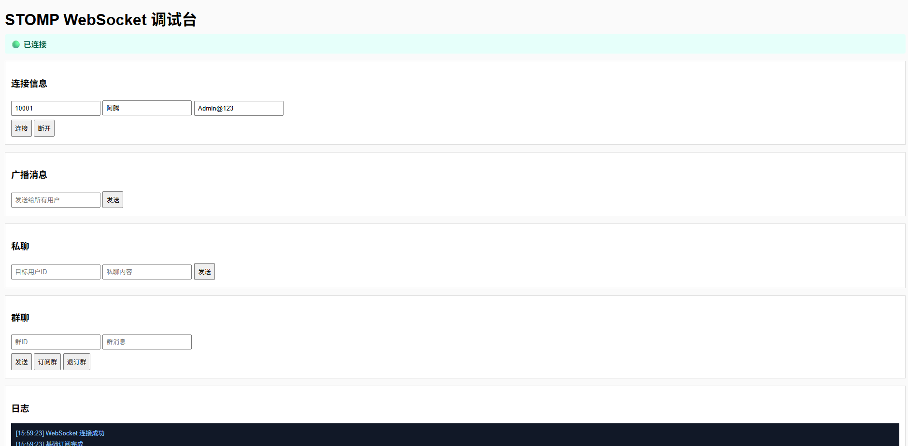

# WebSocket STOMP

- [RabbitMQ使用（开启 STOMP）](https://atengk.github.io/ops/#/work/docker/service/rabbitmq/)
- [Vue3 使用 WebSocket STOMP 示例](https://atengk.github.io/Ateng-Vue/#/apps/stomp/)


## 概述（Overview）

### 整体架构说明

本系统基于 **Spring Boot + WebSocket + STOMP + RabbitMQ + Redis** 构建，目标是实现一个 **支持集群部署、可横向扩展、具备完善会话治理能力的企业级实时消息通信架构**。

整体设计遵循以下核心原则：

- **无状态 WebSocket 服务实例**
- **消息路由下沉到 Broker（RabbitMQ）**
- **连接状态集中存储于 Redis**
- **协议级（STOMP）而非业务级控制**

------

### 架构目标

在企业级场景下，WebSocket 通信通常面临以下问题：

- 多实例部署下，连接状态不可共享
- 内置 SimpleBroker 无法支撑高并发与横向扩展
- 客户端异常断线导致“假在线”
- 会话数、在线人数难以准确统计
- 权限校验与消息路由混杂在业务代码中

本架构的设计目标是：

- **支持多实例 Spring Boot 部署**
- **支持百万级连接的 Broker 分发能力**
- **统一管理用户在线状态与会话生命周期**
- **在 STOMP 协议层完成鉴权与权限控制**
- **实现可观测、可清理、可统计的连接治理体系**

------

### 整体架构组件

系统整体由五个核心组件构成：

#### 1. WebSocket 客户端

- 基于 **SockJS + STOMP 协议**
- 与服务端通过 `/ws` 建立 WebSocket 连接
- 负责：
  - 发送 CONNECT / SUBSCRIBE / SEND 帧
  - 定时发送心跳消息
  - 接收 Broker 推送的实时消息

客户端不直接感知服务端实例，仅与统一入口通信。

------

#### 2. Spring Boot WebSocket 服务

Spring Boot 服务作为 **WebSocket 接入层与业务处理层**，主要职责包括：

- 接收 WebSocket / STOMP 连接
- 执行 STOMP 协议级拦截与鉴权
- 处理业务消息（私聊 / 群聊 / 广播）
- 与 Redis、RabbitMQ 协同完成状态管理与消息分发

**关键特性：**

- 服务实例无状态
- 不维护本地 Session
- 所有连接状态集中存储于 Redis

------

#### 3. STOMP 协议层（Spring Messaging）

基于 Spring 的 STOMP 支持，系统在协议层完成以下能力：

- CONNECT 阶段完成身份认证
- SUBSCRIBE 阶段完成订阅权限校验
- SEND 阶段完成业务消息路由

所有客户端消息均遵循统一的 STOMP 语义：

- `/app/**`：应用级消息入口
- `/topic/**`：广播 / 群消息
- `/user/queue/**`：点对点私聊消息

该设计确保：

- 消息路径语义清晰
- 权限控制集中
- 客户端与服务端协议解耦

------

#### 4. RabbitMQ（STOMP Broker Relay）

RabbitMQ 作为 **消息代理与分发中心**，通过 STOMP Broker Relay 接管消息路由：

- 替代 Spring 内置 SimpleBroker
- 支持 RabbitMQ 集群
- 支持高并发消息分发

在该架构中：

- 群聊消息映射为 RabbitMQ `topic`
- 私聊消息映射为 RabbitMQ `queue`
- 广播消息统一通过 `topic` 分发

**核心作用：**

- 消息跨实例转发
- Broker 级负载均衡
- 解耦消息生产与消费

------

#### 5. Redis（会话与在线状态中心）

Redis 作为 **全局会话与状态管理中心**，负责：

- 用户与 WebSocket Session 的映射关系
- 在线用户集合维护
- Session 心跳时间记录
- 在线人数与连接数统计

通过 Redis：

- 多实例之间共享连接状态
- 支持异常断线自动清理
- 实现准确的在线统计能力

Redis 不参与消息转发，仅负责 **连接治理与状态管理**。

------

### 消息流转总览

一次完整的消息流转过程如下：

1. 客户端通过 WebSocket 建立连接
2. STOMP CONNECT 帧触发身份认证
3. 服务端为连接绑定唯一 Principal
4. 会话信息写入 Redis
5. 客户端订阅 topic / queue
6. 业务消息通过 `/app/**` 发送至服务端
7. 服务端将消息投递至 RabbitMQ
8. RabbitMQ 将消息分发至目标订阅者
9. 客户端实时接收消息

整个过程：

- **服务实例不直接转发消息**
- **所有分发逻辑由 Broker 完成**
- **连接状态与消息流转完全解耦**

------

### 架构设计总结

该架构具备以下特征：

- **高可扩展性**：支持横向扩展 WebSocket 服务实例
- **高可靠性**：Broker 级消息分发，避免单点瓶颈
- **强治理能力**：Redis 集中管理连接与心跳
- **协议清晰**：基于 STOMP 规范，职责边界明确
- **生产友好**：适用于 IM、通知、实时协作等场景

该方案并非简单 WebSocket 示例，而是面向 **企业级实时通信场景** 的标准化架构实现。


## 基础配置

### 添加依赖

编辑 `pom.xml` 添加 WebSocket 依赖

```xml
        <!-- WebSocket 与 STOMP 协议支持 -->
        <dependency>
            <groupId>org.springframework.boot</groupId>
            <artifactId>spring-boot-starter-websocket</artifactId>
        </dependency>

        <!-- Reactor Netty 核心组件，提供基于 Netty 的网络通信能力 -->
        <dependency>
            <groupId>io.projectreactor.netty</groupId>
            <artifactId>reactor-netty-core</artifactId>
        </dependency>

        <!-- Reactor Netty HTTP / WebSocket 支持模块 -->
        <dependency>
            <groupId>io.projectreactor.netty</groupId>
            <artifactId>reactor-netty-http</artifactId>
        </dependency>

        <!-- Spring Boot Redis 数据库集成，支持多种 Redis 数据结构和操作 -->
        <dependency>
            <groupId>org.springframework.boot</groupId>
            <artifactId>spring-boot-starter-data-redis</artifactId>
        </dependency>

        <!-- Lettuce 客户端连接池实现，基于 Apache Commons Pool2 -->
        <dependency>
            <groupId>org.apache.commons</groupId>
            <artifactId>commons-pool2</artifactId>
        </dependency>

        <!-- Spring Boot Validation 数据校验框架 -->
        <dependency>
            <groupId>org.springframework.boot</groupId>
            <artifactId>spring-boot-starter-validation</artifactId>
        </dependency>
```

### 编辑配置文件

编辑 `application.yml` 配置文件

```yaml
server:
  port: 18002
spring:
  application:
    name: ${project.artifactId}
logging:
  level:
    root: info
    io.github.atengk: debug
---
# Redis的相关配置
spring:
  data:
    redis:
      host: 175.178.193.128 # Redis服务器地址
      database: 1 # Redis数据库索引（默认为0）
      port: 20003 # Redis服务器连接端口
      password: Admin@123 # Redis服务器连接密码（默认为空）
      client-type: lettuce  # 默认使用Lettuce作为Redis客户端
      lettuce:
        pool:
          max-active: 100 # 连接池最大连接数（使用负值表示没有限制）
          max-wait: -1s # 连接池最大阻塞等待时间（使用负值表示没有限制）
          max-idle: 100 # 连接池中的最大空闲连接
          min-idle: 0 # 连接池最小空闲连接数
          time-between-eviction-runs: 1s # 空闲对象逐出器线程的运行间隔时间.空闲连接线程释放周期时间
      timeout: 5000ms # 连接超时时间（毫秒）
---
# WebSocket + STOMP Broker Relay 配置
websocket:
  url: /ws                     # WebSocket 端点
  allowed-origins: "*"          # 跨域允许
  heartbeat-interval: 30000     # 前端心跳发送间隔 ms
  application-destination-prefix: /app
  user-destination-prefix: /user
  heartbeat-destination: /app/heartbeat # 心跳发送地址
  broker-relay:
    relay-host: 175.178.193.128
    relay-port: 20015
    client-login: admin
    client-passcode: Admin@123
    system-login: admin
    system-passcode: Admin@123
    system-heartbeat-send-interval: 10000
    system-heartbeat-receive-interval: 10000
```

### 配置文件类

```java
package io.github.atengk.config;

import jakarta.validation.Valid;
import jakarta.validation.constraints.NotBlank;
import jakarta.validation.constraints.NotNull;
import lombok.Data;
import org.springframework.boot.context.properties.ConfigurationProperties;
import org.springframework.stereotype.Component;


/**
 * WebSocket 配置属性绑定类
 *
 * <p>
 * 统一管理 WebSocket + STOMP 相关配置，包括：
 * <ul>
 *     <li>WebSocket 端点配置</li>
 *     <li>STOMP 应用级前缀</li>
 *     <li>用户级消息前缀</li>
 *     <li>心跳相关配置</li>
 *     <li>RabbitMQ STOMP Broker Relay 配置</li>
 * </ul>
 *
 * <p>
 * 该配置通过 {@code application.yml} 中 {@code websocket.*} 前缀进行绑定，
 * 作为整个 WebSocket 架构的统一参数入口。
 * </p>
 *
 * @author 孔余
 * @since 2026-01-30
 */
@Data
@Component
@ConfigurationProperties(prefix = "websocket")
public class WebSocketProperties {

    /**
     * WebSocket STOMP 端点地址
     * <p>示例：/ws</p>
     */
    @NotBlank
    private String url;

    /**
     * 允许跨域的来源
     * <p>支持通配符配置，如：*</p>
     */
    @NotBlank
    private String allowedOrigins;

    /**
     * 前端心跳发送间隔（毫秒）
     */
    @NotNull
    private Long heartbeatInterval;

    /**
     * STOMP 应用级消息前缀
     * <p>客户端向服务端发送消息时使用</p>
     * <p>示例：/app</p>
     */
    @NotBlank
    private String applicationDestinationPrefix;

    /**
     * STOMP 用户级消息前缀
     * <p>用于点对点私聊消息</p>
     * <p>示例：/user</p>
     */
    @NotBlank
    private String userDestinationPrefix;

    /**
     * 心跳消息发送目的地
     * <p>示例：/app/heartbeat</p>
     */
    @NotBlank
    private String heartbeatDestination;

    /**
     * RabbitMQ STOMP Broker Relay 配置
     */
    @Valid
    @NotNull
    private BrokerRelay brokerRelay;

    /**
     * RabbitMQ STOMP Broker Relay 配置项
     *
     * <p>
     * 用于配置 Spring 与 RabbitMQ 之间的 STOMP 协议通信参数，
     * 支持 Broker 集群、系统心跳检测等能力。
     * </p>
     *
     * @author 孔余
     * @since 2026-01-30
     */
    @Data
    public static class BrokerRelay {

        /**
         * RabbitMQ STOMP Relay 主机地址
         */
        @NotBlank
        private String relayHost;

        /**
         * RabbitMQ STOMP Relay 端口
         */
        @NotNull
        private Integer relayPort;

        /**
         * 客户端连接 Broker 使用的用户名
         */
        @NotBlank
        private String clientLogin;

        /**
         * 客户端连接 Broker 使用的密码
         */
        @NotBlank
        private String clientPasscode;

        /**
         * 系统级连接 Broker 使用的用户名
         */
        @NotBlank
        private String systemLogin;

        /**
         * 系统级连接 Broker 使用的密码
         */
        @NotBlank
        private String systemPasscode;

        /**
         * 系统向 Broker 发送心跳的时间间隔（毫秒）
         */
        @NotNull
        private Long systemHeartbeatSendInterval;

        /**
         * 系统从 Broker 接收心跳的时间间隔（毫秒）
         */
        @NotNull
        private Long systemHeartbeatReceiveInterval;
    }
}

```


## 创建实体类

### StompUserPrincipal

```java
package io.github.atengk.entity;

import java.io.Serial;
import java.io.Serializable;
import java.security.Principal;
import java.util.Objects;

/**
 * STOMP 用户身份实现
 *
 * <p>
 * 用于在 WebSocket / STOMP 通信过程中标识当前用户，
 * 通常由 CONNECT 阶段解析并绑定到会话。
 * </p>
 *
 * <p>
 * 该类可安全用于：
 * <ul>
 *     <li>Spring Messaging UserDestination</li>
 *     <li>在线用户映射</li>
 *     <li>分布式会话存储</li>
 * </ul>
 * </p>
 *
 * @author 孔余
 * @since 2026-01-30
 */
public class StompUserPrincipal implements Principal, Serializable {

    @Serial
    private static final long serialVersionUID = 1L;

    /**
     * 业务用户 ID
     */
    private final String userId;

    public StompUserPrincipal(String userId) {
        this.userId = Objects.requireNonNull(userId, "userId must not be null");
    }

    @Override
    public String getName() {
        return userId;
    }

    public String getUserId() {
        return userId;
    }

    @Override
    public boolean equals(Object o) {
        if (this == o) {
            return true;
        }
        if (!(o instanceof StompUserPrincipal)) {
            return false;
        }
        StompUserPrincipal that = (StompUserPrincipal) o;
        return Objects.equals(userId, that.userId);
    }

    @Override
    public int hashCode() {
        return Objects.hash(userId);
    }

    @Override
    public String toString() {
        return "StompUserPrincipal{userId='" + userId + "'}";
    }
}
```

### PrivateMessageDTO

```java
package io.github.atengk.dto;

import lombok.Data;

import java.io.Serial;
import java.io.Serializable;

/**
 * 私聊消息 DTO
 *
 * <p>
 * 表示客户端向指定用户发送的一条私聊消息。
 * </p>
 *
 * @author 孔余
 * @since 2026-01-30
 */
@Data
public class PrivateMessageDTO implements Serializable {

    @Serial
    private static final long serialVersionUID = 1L;

    /**
     * 接收方用户 ID
     */
    private String toUserId;

    /**
     * 消息内容
     */
    private String content;
}

```

### GroupMessageDTO

```java
package io.github.atengk.dto;

import lombok.Data;

import java.io.Serial;
import java.io.Serializable;

/**
 * 群消息 DTO
 *
 * <p>
 * 表示客户端向指定群组发送的一条消息，
 * 通常由服务端转发给群内所有在线成员。
 * </p>
 *
 * @author 孔余
 * @since 2026-01-30
 */
@Data
public class GroupMessageDTO implements Serializable {

    @Serial
    private static final long serialVersionUID = 1L;

    /**
     * 群 ID
     */
    private String groupId;

    /**
     * 消息内容
     */
    private String content;
}

```

## 会话管理服务

### 会话管理服务

```java
package io.github.atengk.service;

import lombok.RequiredArgsConstructor;
import lombok.extern.slf4j.Slf4j;
import org.springframework.data.redis.core.RedisTemplate;
import org.springframework.stereotype.Service;

import java.time.Instant;
import java.util.HashMap;
import java.util.Map;
import java.util.Set;

/**
 * WebSocket 会话管理服务（Redis 企业级实现）
 *
 * <p>
 * 主要职责：
 * <ul>
 *   <li>维护 session 与用户的映射关系</li>
 *   <li>维护用户在线 / 离线状态（支持多端）</li>
 *   <li>基于心跳机制自动清理失效连接</li>
 *   <li>提供在线统计数据，支撑监控与运维</li>
 * </ul>
 * </p>
 *
 * <p>
 * 设计说明：
 * <ul>
 *   <li>使用 Set 支持用户多 session</li>
 *   <li>使用 ZSet 管理 session 心跳超时</li>
 *   <li>所有操作保证幂等性</li>
 * </ul>
 * </p>
 *
 * @author 孔余
 * @since 2026-01-30
 */
@Slf4j
@Service
@RequiredArgsConstructor
public class WebSocketSessionService {

    private final RedisTemplate<String, String> redisTemplate;

    /* ======================= Redis Key ======================= */

    /** WebSocket 用户 -> session 集合 */
    private static final String KEY_USER_SESSIONS = "ws:user:sessions:";

    /** WebSocket session -> user 映射 */
    private static final String KEY_SESSION_USER = "ws:session:user:";

    /** WebSocket 在线用户集合 */
    private static final String KEY_ONLINE_USERS = "ws:stats:online:users";

    /** WebSocket session 心跳 ZSET */
    private static final String KEY_SESSION_HEARTBEAT = "ws:session:heartbeat:zset";

    /** 心跳超时时间（秒） */
    private static final long HEARTBEAT_TIMEOUT_SECONDS = 90;

    /* ======================= 连接管理 ======================= */

    /**
     * STOMP CONNECT 时调用
     *
     * @param userId    用户 ID
     * @param sessionId WebSocket sessionId
     */
    public void onConnect(String userId, String sessionId) {
        // 初始化心跳
        onHeartbeat(sessionId);

        redisTemplate.opsForSet()
                .add(KEY_USER_SESSIONS + userId, sessionId);

        redisTemplate.opsForValue()
                .set(KEY_SESSION_USER + sessionId, userId);

        redisTemplate.opsForSet()
                .add(KEY_ONLINE_USERS, userId);

        log.info("【WebSocket 连接建立】userId={}, sessionId={}", userId, sessionId);
    }

    /**
     * WebSocket 断连处理（幂等）
     *
     * @param sessionId WebSocket sessionId
     */
    public void onDisconnect(String sessionId) {
        // 移除心跳
        redisTemplate.opsForZSet()
                .remove(KEY_SESSION_HEARTBEAT, sessionId);

        String userId = redisTemplate.opsForValue()
                .get(KEY_SESSION_USER + sessionId);

        if (userId == null) {
            log.debug("【WebSocket 断连】session 已被清理，sessionId={}", sessionId);
            return;
        }

        redisTemplate.opsForSet()
                .remove(KEY_USER_SESSIONS + userId, sessionId);

        redisTemplate.delete(KEY_SESSION_USER + sessionId);

        Long remain = redisTemplate.opsForSet()
                .size(KEY_USER_SESSIONS + userId);

        if (remain == null || remain == 0) {
            redisTemplate.opsForSet()
                    .remove(KEY_ONLINE_USERS, userId);
            log.info("【WebSocket 用户离线】userId={}", userId);
        } else {
            log.info("【WebSocket 连接断开】userId={}, 剩余连接数={}", userId, remain);
        }
    }

    /* ======================= 心跳管理 ======================= */

    /**
     * 心跳续期
     *
     * @param sessionId WebSocket sessionId
     */
    public void onHeartbeat(String sessionId) {
        long now = Instant.now().getEpochSecond();

        redisTemplate.opsForZSet()
                .add(KEY_SESSION_HEARTBEAT, sessionId, now);

        log.debug("【WebSocket 心跳刷新】sessionId={}, time={}", sessionId, now);
    }

    /**
     * 清理心跳超时的 WebSocket session
     *
     * <p>
     * 该方法仅负责清理规则与 Redis 操作，
     * 由定时任务或其他触发方式调用。
     * </p>
     */
    public void cleanupExpiredSessions() {
        long expireBefore = Instant.now().getEpochSecond() - HEARTBEAT_TIMEOUT_SECONDS;

        Set<String> expiredSessions = redisTemplate.opsForZSet()
                .rangeByScore(KEY_SESSION_HEARTBEAT, 0, expireBefore);

        if (expiredSessions == null || expiredSessions.isEmpty()) {
            return;
        }

        for (String sessionId : expiredSessions) {
            log.warn("【WebSocket 心跳超时】清理 sessionId={}", sessionId);
            onDisconnect(sessionId);
        }

        log.info("【WebSocket 会话清理完成】清理失效 session 数={}", expiredSessions.size());
    }

    /* ======================= 在线统计 ======================= */

    /**
     * 获取当前 WebSocket 在线统计信息
     *
     * <p>
     * 本方法返回的是一份「系统在线状态快照」，主要用于：
     * <ul>
     *     <li>管理后台在线人数展示</li>
     *     <li>运维监控与容量评估</li>
     *     <li>排查异常连接或多端登录情况</li>
     * </ul>
     * </p>
     *
     * <p>
     * 返回 Map 中各字段含义如下：
     * <ul>
     *     <li>
     *         totalUsers：
     *         当前在线用户数（按用户维度去重）。
     *         <br/>
     *         只要某个用户至少存在一条有效 WebSocket 连接，即视为在线用户。
     *     </li>
     *     <li>
     *         totalConnections：
     *         当前在线的 WebSocket 连接总数。
     *         <br/>
     *         每一个 session 视为一条独立连接，支持多端同时在线。
     *     </li>
     *     <li>
     *         avgConnectionsPerUser：
     *         人均 WebSocket 连接数。
     *         <br/>
     *         计算公式：totalConnections / totalUsers，
     *         用于反映用户多端登录情况或是否存在异常连接。
     *     </li>
     *     <li>
     *         timestamp：
     *         统计数据生成时间的时间戳（秒级，Unix Epoch）。
     *         <br/>
     *         用于标识该统计快照的有效时间点，便于监控与前端判断数据是否过期。
     *     </li>
     * </ul>
     * </p>
     *
     * <p>
     * 说明：
     * <ul>
     *     <li>该统计为实时计算结果，不做缓存</li>
     *     <li>仅用于监控与展示，不参与业务逻辑判断</li>
     * </ul>
     * </p>
     *
     * @return 在线统计数据快照
     *
     * @author 孔余
     * @since 2026-01-30
     */
    public Map<String, Object> getOnlineStats() {
        Map<String, Object> stats = new HashMap<>();

        Set<String> users = redisTemplate.opsForSet()
                .members(KEY_ONLINE_USERS);

        int totalUsers = users == null ? 0 : users.size();
        int totalConnections = 0;

        if (users != null) {
            for (String userId : users) {
                Long count = redisTemplate.opsForSet()
                        .size(KEY_USER_SESSIONS + userId);
                totalConnections += count == null ? 0 : count.intValue();
            }
        }

        stats.put("totalUsers", totalUsers);
        stats.put("totalConnections", totalConnections);
        stats.put("avgConnectionsPerUser",
                totalUsers == 0 ? 0 : (double) totalConnections / totalUsers);
        stats.put("timestamp", Instant.now().getEpochSecond());

        return stats;
    }

}

```

### 创建定时任务

注意开启 `@EnableScheduling`，或者使用其他定时任务调度框架

```java
package io.github.atengk.schedule;

import io.github.atengk.service.WebSocketSessionService;
import lombok.RequiredArgsConstructor;
import lombok.extern.slf4j.Slf4j;
import org.springframework.scheduling.annotation.Scheduled;
import org.springframework.stereotype.Component;

/**
 * WebSocket 会话定时任务
 *
 * <p>
 * 定期触发 WebSocket 会话清理逻辑，
 * 用于清除心跳超时、异常断开的连接，
 * 防止在线状态与 Redis 数据长期不一致。
 * </p>
 *
 * <p>
 * 该类仅负责调度，不包含具体清理规则，
 * 实际清理逻辑由 {@link WebSocketSessionService} 统一维护。
 * </p>
 *
 * @author 孔余
 * @since 2026-01-30
 */
@Slf4j
@Component
@RequiredArgsConstructor
public class WebSocketSessionScheduler {
    private final WebSocketSessionService sessionService;

    /**
     * 定时清理心跳超时的 WebSocket 会话
     *
     * <p>
     * 默认每 60 秒执行一次，用于回收：
     * <ul>
     *     <li>非正常断开的连接</li>
     *     <li>心跳丢失的 session</li>
     * </ul>
     * </p>
     */
    @Scheduled(fixedDelay = 60_000)
    public void cleanupExpiredSessions() {
        log.debug("【WebSocket 定时任务】开始执行会话清理");
        sessionService.cleanupExpiredSessions();
    }
}

```


## 创建拦截器

### 心跳拦截

```java
package io.github.atengk.interceptor;

import io.github.atengk.config.WebSocketProperties;
import io.github.atengk.service.WebSocketSessionService;
import lombok.RequiredArgsConstructor;
import lombok.extern.slf4j.Slf4j;
import org.springframework.messaging.Message;
import org.springframework.messaging.MessageChannel;
import org.springframework.messaging.simp.stomp.StompCommand;
import org.springframework.messaging.simp.stomp.StompHeaderAccessor;
import org.springframework.messaging.support.ChannelInterceptor;
import org.springframework.stereotype.Component;
import org.springframework.util.ObjectUtils;

/**
 * WebSocket 心跳拦截器
 *
 * <p>
 * 用于拦截客户端发送的业务心跳消息，
 * 在不进入业务处理链路的前提下，
 * 刷新对应 WebSocket session 的心跳时间。
 * </p>
 *
 * <p>
 * 拦截规则：
 * <ul>
 *     <li>仅处理 STOMP SEND 帧</li>
 *     <li>仅命中配置的心跳 destination</li>
 * </ul>
 * </p>
 *
 * <p>
 * 设计原则：
 * <ul>
 *     <li>逻辑必须足够轻量</li>
 *     <li>不参与任何业务处理</li>
 *     <li>允许高频调用</li>
 * </ul>
 * </p>
 *
 * @author 孔余
 * @since 2026-01-30
 */
@Slf4j
@Component
@RequiredArgsConstructor
public class WebSocketHeartbeatInterceptor implements ChannelInterceptor {

    private final WebSocketSessionService webSocketSessionService;
    private final WebSocketProperties webSocketProperties;

    @Override
    public Message<?> preSend(Message<?> message, MessageChannel channel) {
        StompHeaderAccessor accessor = StompHeaderAccessor.wrap(message);

        StompCommand command = accessor.getCommand();
        if (!StompCommand.SEND.equals(command)) {
            return message;
        }

        String destination = accessor.getDestination();
        String sessionId = accessor.getSessionId();

        if (ObjectUtils.isEmpty(destination)
                || ObjectUtils.isEmpty(sessionId)
                || ObjectUtils.isEmpty(webSocketProperties.getHeartbeatDestination())) {
            return message;
        }

        // 命中业务心跳 destination
        if (destination.equals(webSocketProperties.getHeartbeatDestination())) {
            webSocketSessionService.onHeartbeat(sessionId);
            log.debug("【WebSocket 心跳续期】sessionId={}", sessionId);

            // 心跳消息无需进入后续业务链路
            return null;
        }

        return message;
    }
}

```

### 认证拦截

```java
package io.github.atengk.interceptor;

import io.github.atengk.entity.StompUserPrincipal;
import lombok.extern.slf4j.Slf4j;
import org.springframework.messaging.Message;
import org.springframework.messaging.MessageChannel;
import org.springframework.messaging.MessagingException;
import org.springframework.messaging.simp.stomp.StompCommand;
import org.springframework.messaging.simp.stomp.StompHeaderAccessor;
import org.springframework.messaging.support.ChannelInterceptor;
import org.springframework.messaging.support.MessageHeaderAccessor;
import org.springframework.stereotype.Component;

import java.security.Principal;

/**
 * WebSocket 鉴权拦截器
 *
 * <p>功能说明：
 * <ul>
 *     <li>CONNECT：WebSocket 连接阶段鉴权，并绑定 Principal</li>
 *     <li>SUBSCRIBE：订阅阶段进行资源级鉴权（如群 topic 权限）</li>
 * </ul>
 *
 * <p>设计原则：
 * <ul>
 *     <li>所有安全逻辑前置在 ChannelInterceptor 层，Controller 无感知</li>
 *     <li>通过绑定 Principal，保证后续 SEND / SUBSCRIBE 身份不可伪造</li>
 *     <li>鉴权失败直接抛出 MessagingException，中断连接或订阅</li>
 * </ul>
 *
 * @author 孔余
 * @since 2026-01-30
 */
@Slf4j
@Component
public class WebSocketAuthInterceptor implements ChannelInterceptor {

    /**
     * 群 topic 前缀（RabbitMQ STOMP 规范）
     */
    private static final String GROUP_TOPIC_PREFIX = "/topic/group.";

    @Override
    public Message<?> preSend(Message<?> message, MessageChannel channel) {

        StompHeaderAccessor accessor =
                MessageHeaderAccessor.getAccessor(message, StompHeaderAccessor.class);

        if (accessor == null || accessor.getCommand() == null) {
            return message;
        }

        StompCommand command = accessor.getCommand();

        if (StompCommand.CONNECT.equals(command)) {
            handleConnect(accessor);
        } else if (StompCommand.SUBSCRIBE.equals(command)) {
            handleSubscribe(accessor);
        }

        return message;
    }

    /* ====================== CONNECT ====================== */

    /**
     * WebSocket CONNECT 阶段鉴权
     *
     * <p>处理逻辑：
     * <ul>
     *     <li>提取 userId / Authorization</li>
     *     <li>校验 token 合法性</li>
     *     <li>绑定 Principal，贯穿整个 WebSocket 会话生命周期</li>
     * </ul>
     */
    private void handleConnect(StompHeaderAccessor accessor) {

        String userId = extractRequiredHeader(accessor, "userId");
        String token = extractRequiredHeader(accessor, "Authorization");

        validateToken(userId, token);

        accessor.setUser(new StompUserPrincipal(userId));

        log.info("【WebSocket CONNECT】鉴权成功 userId={}", userId);
    }

    /**
     * Token 校验
     *
     * <p>说明：
     * <ul>
     *     <li>当前为示例实现</li>
     *     <li>可替换为 JWT / OAuth2 / Redis / RPC 鉴权</li>
     * </ul>
     */
    private void validateToken(String userId, String token) {

        if (!"Bearer Admin@123".equals(token)) {
            log.warn("【WebSocket CONNECT】token 校验失败 userId={}, token={}", userId, token);
            throw new MessagingException("WebSocket 鉴权失败");
        }
    }

    /* ====================== SUBSCRIBE ====================== */

    /**
     * WebSocket SUBSCRIBE 阶段鉴权
     *
     * <p>仅对群 topic 进行权限校验，防止非法监听敏感消息
     */
    private void handleSubscribe(StompHeaderAccessor accessor) {

        String destination = accessor.getDestination();
        Principal principal = accessor.getUser();

        if (destination == null || principal == null) {
            return;
        }

        if (!destination.startsWith(GROUP_TOPIC_PREFIX)) {
            return;
        }

        String groupId = destination.substring(GROUP_TOPIC_PREFIX.length());
        String userId = principal.getName();

        if (!isGroupMember(userId, groupId)) {
            log.warn("【WebSocket SUBSCRIBE】无权订阅 groupId={} userId={}", groupId, userId);
            throw new MessagingException("无权订阅该群");
        }

        log.info("【WebSocket SUBSCRIBE】订阅成功 groupId={} userId={}", groupId, userId);
    }

    /* ====================== Utils ====================== */

    /**
     * 提取必传 Header
     */
    private String extractRequiredHeader(StompHeaderAccessor accessor, String headerName) {

        String value = accessor.getFirstNativeHeader(headerName);
        if (value == null || value.isEmpty()) {
            log.warn("【WebSocket CONNECT】缺少必要 Header：{}", headerName);
            throw new MessagingException("WebSocket 缺少必要参数：" + headerName);
        }
        return value;
    }

    /**
     * 群成员校验
     *
     * <p>示例实现，实际应由：
     * <ul>
     *     <li>数据库</li>
     *     <li>Redis</li>
     *     <li>远程服务</li>
     * </ul>
     * 提供
     */
    private boolean isGroupMember(String userId, String groupId) {

        if ("group-001".equals(groupId)) {
            return "10001".equals(userId) || "10002".equals(userId);
        }

        return false;
    }
}

```

## 连接监听器

```java
package io.github.atengk.listener;

import io.github.atengk.service.WebSocketSessionService;
import lombok.RequiredArgsConstructor;
import lombok.extern.slf4j.Slf4j;
import org.springframework.context.event.EventListener;
import org.springframework.messaging.simp.stomp.StompHeaderAccessor;
import org.springframework.stereotype.Component;
import org.springframework.web.socket.messaging.SessionConnectEvent;
import org.springframework.web.socket.messaging.SessionDisconnectEvent;

import java.security.Principal;

/**
 * WebSocket 连接生命周期事件监听器
 *
 * <p>
 * 负责监听 STOMP 连接 / 断开事件，
 * 并将会话生命周期交由 {@link WebSocketSessionService} 统一管理。
 * </p>
 *
 * @author 孔余
 * @since 2026-01-30
 */
@Slf4j
@Component
@RequiredArgsConstructor
public class WebSocketEventListener {

    private final WebSocketSessionService sessionService;

    /**
     * STOMP CONNECT 事件
     *
     * <p>
     * 触发时机：
     * - 客户端 CONNECT 帧通过鉴权
     * - {@link io.github.atengk.interceptor.WebSocketAuthInterceptor}
     * 已完成 Principal 绑定
     * </p>
     */
    @EventListener
    public void handleConnect(SessionConnectEvent event) {

        StompHeaderAccessor accessor = StompHeaderAccessor.wrap(event.getMessage());
        String sessionId = accessor.getSessionId();
        Principal principal = accessor.getUser();

        if (principal == null) {
            log.warn("【WebSocket CONNECT】未获取到 Principal，sessionId={}", sessionId);
            return;
        }

        String userId = principal.getName();

        sessionService.onConnect(userId, sessionId);

        log.info("【WebSocket CONNECT】userId={}, sessionId={}", userId, sessionId);
    }

    /**
     * STOMP DISCONNECT 事件
     *
     * <p>
     * 说明：
     * - 该事件不一定可靠（浏览器异常断开可能不会触发）
     * - 实际连接治理以 Redis 心跳清理为准
     * </p>
     */
    @EventListener
    public void handleDisconnect(SessionDisconnectEvent event) {

        StompHeaderAccessor accessor = StompHeaderAccessor.wrap(event.getMessage());
        String sessionId = accessor.getSessionId();

        if (sessionId == null) {
            return;
        }

        sessionService.onDisconnect(sessionId);

        log.info("【WebSocket DISCONNECT】sessionId={}", sessionId);
    }
}

```

## 创建 WebSocket 基础配置

```java
package io.github.atengk.config;

import io.github.atengk.interceptor.WebSocketAuthInterceptor;
import io.github.atengk.interceptor.WebSocketHeartbeatInterceptor;
import lombok.RequiredArgsConstructor;
import org.springframework.context.annotation.Configuration;
import org.springframework.messaging.simp.config.ChannelRegistration;
import org.springframework.messaging.simp.config.MessageBrokerRegistry;
import org.springframework.web.socket.config.annotation.EnableWebSocketMessageBroker;
import org.springframework.web.socket.config.annotation.StompEndpointRegistry;
import org.springframework.web.socket.config.annotation.WebSocketMessageBrokerConfigurer;

/**
 * WebSocket + STOMP + RabbitMQ（Broker Relay 模式）核心配置
 *
 * <p>架构说明：
 * <ul>
 *     <li>使用 RabbitMQ STOMP Broker Relay 替代 Spring SimpleBroker</li>
 *     <li>支持多实例 Spring Boot 横向扩展</li>
 *     <li>消息完全由 MQ 承载，应用层无状态</li>
 * </ul>
 *
 * <p>通道职责划分：
 * <ul>
 *     <li>Application Destination：处理业务消息（/app/**）</li>
 *     <li>Broker Destination：由 RabbitMQ 分发（/topic、/queue）</li>
 * </ul>
 *
 * @author 孔余
 * @since 2026-01-30
 */
@Configuration
@EnableWebSocketMessageBroker
@RequiredArgsConstructor
public class WebSocketConfig implements WebSocketMessageBrokerConfigurer {

    private final WebSocketProperties webSocketProperties;
    private final WebSocketHeartbeatInterceptor webSocketHeartbeatInterceptor;
    private final WebSocketAuthInterceptor webSocketAuthInterceptor;

    /**
     * 配置 STOMP 消息代理（RabbitMQ Broker Relay）
     *
     * <p>说明：
     * <ul>
     *     <li>不使用 enableSimpleBroker（单机、内存实现）</li>
     *     <li>Broker Relay 适用于生产环境与集群部署</li>
     *     <li>系统心跳由 Spring 与 RabbitMQ 之间维护</li>
     * </ul>
     */
    @Override
    public void configureMessageBroker(MessageBrokerRegistry registry) {

        registry.enableStompBrokerRelay("/topic", "/queue")
                .setRelayHost(webSocketProperties.getBrokerRelay().getRelayHost())
                .setRelayPort(webSocketProperties.getBrokerRelay().getRelayPort())
                .setClientLogin(webSocketProperties.getBrokerRelay().getClientLogin())
                .setClientPasscode(webSocketProperties.getBrokerRelay().getClientPasscode())
                .setSystemLogin(webSocketProperties.getBrokerRelay().getSystemLogin())
                .setSystemPasscode(webSocketProperties.getBrokerRelay().getSystemPasscode())
                .setSystemHeartbeatSendInterval(
                        webSocketProperties.getBrokerRelay().getSystemHeartbeatSendInterval())
                .setSystemHeartbeatReceiveInterval(
                        webSocketProperties.getBrokerRelay().getSystemHeartbeatReceiveInterval());

        registry.setApplicationDestinationPrefixes(
                webSocketProperties.getApplicationDestinationPrefix());

        registry.setUserDestinationPrefix(
                webSocketProperties.getUserDestinationPrefix());
    }

    /**
     * 注册 WebSocket STOMP 端点
     *
     * <p>说明：
     * <ul>
     *     <li>支持 SockJS，兼容老旧浏览器</li>
     *     <li>allowedOriginPatterns 用于支持多域名部署</li>
     * </ul>
     */
    @Override
    public void registerStompEndpoints(StompEndpointRegistry registry) {

        registry.addEndpoint(webSocketProperties.getUrl())
                .setAllowedOriginPatterns(webSocketProperties.getAllowedOrigins())
                .withSockJS();
    }

    /**
     * 配置客户端 Inbound 通道拦截器
     *
     * <p>执行顺序（非常重要）：
     * <ol>
     *     <li>WebSocketHeartbeatInterceptor：心跳短路，不进入业务层</li>
     *     <li>WebSocketAuthInterceptor：CONNECT / SUBSCRIBE 鉴权</li>
     * </ol>
     *
     * <p>设计原则：
     * <ul>
     *     <li>所有治理逻辑前置在通道层</li>
     *     <li>Controller 只关心业务</li>
     * </ul>
     */
    @Override
    public void configureClientInboundChannel(ChannelRegistration registration) {

        registration.interceptors(
                webSocketHeartbeatInterceptor,
                webSocketAuthInterceptor
        );
    }

}

```

## 创建消息接口

```java
package io.github.atengk.controller;

import com.alibaba.fastjson2.JSONObject;
import io.github.atengk.dto.GroupMessageDTO;
import io.github.atengk.dto.PrivateMessageDTO;
import lombok.RequiredArgsConstructor;
import lombok.extern.slf4j.Slf4j;
import org.springframework.messaging.handler.annotation.MessageMapping;
import org.springframework.messaging.handler.annotation.Payload;
import org.springframework.messaging.simp.SimpMessagingTemplate;
import org.springframework.stereotype.Controller;

import java.security.Principal;

/**
 * WebSocket 聊天消息控制器
 *
 * <p>职责说明：
 * <ul>
 *     <li>只处理业务级消息 SEND</li>
 *     <li>不处理心跳、不处理 CONNECT / SUBSCRIBE</li>
 *     <li>不信任客户端传入的 userId，一律使用 Principal</li>
 * </ul>
 *
 * <p>设计原则：
 * <ul>
 *     <li>安全校验前置（拦截器 + Controller 二次兜底）</li>
 *     <li>消息路由交由 Broker（RabbitMQ）完成</li>
 *     <li>Controller 本身保持无状态</li>
 * </ul>
 *
 * @author 孔余
 * @since 2026-01-30
 */
@Slf4j
@Controller
@RequiredArgsConstructor
public class ChatController {

    private final SimpMessagingTemplate messagingTemplate;

    /* ====================== 公共消息 ====================== */

    /**
     * 公共广播消息
     *
     * <p>说明：
     * <ul>
     *     <li>所有在线用户均可收到</li>
     *     <li>适用于公告、系统广播、弹幕等场景</li>
     * </ul>
     *
     * @param message   消息内容
     * @param principal 当前连接用户身份（来自 CONNECT 阶段绑定）
     */
    @MessageMapping("/public.send")
    public void sendPublicMessage(
            @Payload String message,
            Principal principal
    ) {
        String fromUserId = principal.getName();

        // 权限校验
        validatePublicSendPermission(fromUserId);

        log.info("【公共消息】from={} content={}", fromUserId, message);

        messagingTemplate.convertAndSend(
                "/topic/public",
                buildPublicMessage(fromUserId, message)
        );
    }

    /* ====================== 私聊消息 ====================== */

    /**
     * 私聊消息发送
     *
     * <p>说明：
     * <ul>
     *     <li>基于 user destination（/user/{id}/queue/**）</li>
     *     <li>消息由 Broker 精确投递到目标用户</li>
     * </ul>
     *
     * @param dto       私聊消息 DTO
     * @param principal 当前连接用户身份
     */
    @MessageMapping("/private.send")
    public void sendPrivateMessage(
            @Payload PrivateMessageDTO dto,
            Principal principal
    ) {
        String fromUserId = principal.getName();
        String toUserId = dto.getToUserId();

        // 业务级私聊权限校验
        validatePrivateChatPermission(fromUserId, toUserId);

        log.info("【私聊消息】from={} → to={} content={}",
                fromUserId, toUserId, dto.getContent());

        messagingTemplate.convertAndSendToUser(
                toUserId,
                "/queue/message",
                buildPrivateMessage(fromUserId, dto.getContent())
        );
    }

    /* ====================== 群聊消息 ====================== */

    /**
     * 群消息发送
     *
     * <p>说明：
     * <ul>
     *     <li>一个群对应一个 topic</li>
     *     <li>消息由 Broker 广播给所有订阅该群的成员</li>
     * </ul>
     *
     * @param dto       群消息 DTO
     * @param principal 当前连接用户身份
     */
    @MessageMapping("/group.send")
    public void sendGroupMessage(
            @Payload GroupMessageDTO dto,
            Principal principal
    ) {
        String fromUserId = principal.getName();
        String groupId = dto.getGroupId();

        // 业务级群权限校验（SUBSCRIBE 之外的二次兜底）
        validateGroupChatPermission(fromUserId, groupId);

        log.info("【群消息】group={} from={} content={}",
                groupId, fromUserId, dto.getContent());

        messagingTemplate.convertAndSend(
                "/topic/group." + groupId,
                buildGroupMessage(fromUserId, groupId, dto.getContent())
        );
    }

    /* ====================== 权限校验（示例） ====================== */

    /**
     * 校验用户是否有权限发送公共广播
     */
    private void validatePublicSendPermission(String userId) {
        // TODO: 真实项目调用 Service / DB / Redis
        if (!mockCanSendPublic(userId)) {
            log.warn("【公共消息】用户无权发送 userId={}", userId);
            throw new IllegalArgumentException("无权发送公共消息");
        }
    }

    /**
     * 模拟权限判断
     */
    private boolean mockCanSendPublic(String userId) {
        // 比如只有 userId=10001 可以发送
        return "10001".equals(userId);
    }

    /**
     * 私聊权限校验
     *
     * <p>真实场景可校验：
     * <ul>
     *     <li>是否好友</li>
     *     <li>是否被拉黑</li>
     *     <li>是否同租户 / 同组织</li>
     *     <li>是否允许陌生人私聊</li>
     * </ul>
     *
     * @param fromUserId 发送方用户 ID
     * @param toUserId   接收方用户 ID
     */
    private void validatePrivateChatPermission(String fromUserId, String toUserId) {

        if (fromUserId.equals(toUserId)) {
            throw new IllegalArgumentException("不能给自己发送私聊消息");
        }

        // mock 示例规则
        if ("10001".equals(fromUserId) && "10002".equals(toUserId)) {
            return;
        }

        log.warn("【私聊权限拒绝】from={} to={}", fromUserId, toUserId);
        throw new IllegalArgumentException("无权限向该用户发送私聊消息");
    }

    /**
     * 群聊权限校验
     *
     * <p>真实场景可校验：
     * <ul>
     *     <li>是否群成员</li>
     *     <li>是否被禁言</li>
     *     <li>群是否已解散</li>
     * </ul>
     *
     * @param userId  用户 ID
     * @param groupId 群 ID
     */
    private void validateGroupChatPermission(String userId, String groupId) {

        // mock 示例规则
        if ("group-001".equals(groupId) && ("10001".equals(userId) || "10002".equals(userId))) {
            return;
        }

        log.warn("【群聊权限拒绝】userId={} groupId={}", userId, groupId);
        throw new IllegalArgumentException("无权限向该群发送消息");
    }

    /* ====================== 消息构造 ====================== */

    /**
     * 构造公共 / 私聊消息体
     */
    private JSONObject buildPrivateMessage(String fromUserId, String content) {
        return JSONObject.of(
                "fromUserId", fromUserId,
                "content", content,
                "timestamp", System.currentTimeMillis()
        );
    }

    /**
     * 构造公共消息体
     */
    private JSONObject buildPublicMessage(String fromUserId, String content) {
        return JSONObject.of(
                "fromUserId", fromUserId,
                "content", content,
                "timestamp", System.currentTimeMillis()
        );
    }

    /**
     * 构造群消息体
     */
    private JSONObject buildGroupMessage(String fromUserId, String groupId, String content) {
        return JSONObject.of(
                "groupId", groupId,
                "fromUserId", fromUserId,
                "content", content,
                "timestamp", System.currentTimeMillis()
        );
    }
}

```


## 创建会话接口

```java
package io.github.atengk.controller;

import io.github.atengk.service.WebSocketSessionService;
import lombok.RequiredArgsConstructor;
import org.springframework.web.bind.annotation.GetMapping;
import org.springframework.web.bind.annotation.RequestMapping;
import org.springframework.web.bind.annotation.RestController;

import java.util.Map;

/**
 * WebSocket 会话与在线状态监控接口
 *
 * <p>主要用途：
 * <ul>
 *     <li>提供 WebSocket 在线用户与连接统计</li>
 *     <li>用于运维监控、管理后台、健康检查</li>
 * </ul>
 *
 * <p>设计说明：
 * <ul>
 *     <li>只读接口，不涉及任何写操作</li>
 *     <li>数据来源于 Redis，支持集群环境</li>
 * </ul>
 *
 * @author 孔余
 * @since 2026-01-30
 */
@RestController
@RequestMapping("/websocket-session")
@RequiredArgsConstructor
public class WebSocketSessionController {

    private final WebSocketSessionService webSocketSessionService;

    /**
     * 获取当前 WebSocket 在线统计信息
     *
     * <p>返回数据说明：
     * <ul>
     *     <li>totalUsers：当前在线用户数（去重）</li>
     *     <li>totalConnections：当前在线 WebSocket 连接总数</li>
     *     <li>avgConnectionsPerUser：人均连接数（用于发现多端登录情况）</li>
     *     <li>timestamp：统计时间点（Unix 秒级时间戳）</li>
     * </ul>
     *
     * <p>使用场景：
     * <ul>
     *     <li>管理后台实时展示在线人数</li>
     *     <li>监控系统采集指标</li>
     *     <li>压测 / 容量评估</li>
     * </ul>
     *
     * @return WebSocket 在线统计数据
     */
    @GetMapping("/online-stats")
    public Map<String, Object> getOnlineStats() {
        return webSocketSessionService.getOnlineStats();
    }
}

```


## 前端页面

编辑 ` resources\static\index.html` ，后续调试STOMP的一个页面

```html
<!DOCTYPE html>
<html lang="zh">
<head>
    <meta charset="UTF-8">
    <title>STOMP WebSocket 调试台</title>

    <script src="https://cdnjs.cloudflare.com/ajax/libs/sockjs-client/1.5.0/sockjs.min.js"></script>
    <script src="https://cdnjs.cloudflare.com/ajax/libs/stomp.js/2.3.3/stomp.min.js"></script>

    <style>
        body {
            font-family: Arial, sans-serif;
            margin: 20px;
            background: #fafafa;
        }

        h1 { margin-bottom: 10px; }

        .status {
            padding: 8px 12px;
            margin-bottom: 15px;
            border-radius: 4px;
            font-weight: bold;
        }

        .connected { background: #e6fffa; color: #065f46; }
        .disconnected { background: #fee2e2; color: #7f1d1d; }

        .section {
            margin-top: 15px;
            padding: 12px;
            border: 1px solid #ddd;
            background: #fff;
        }

        input, button {
            padding: 6px;
            margin: 4px 0;
        }

        button {
            cursor: pointer;
        }

        .log {
            font-size: 13px;
            margin-top: 10px;
            background: #111827;
            color: #e5e7eb;
            padding: 10px;
            height: 280px;
            overflow-y: auto;
        }

        .log div { margin-bottom: 4px; }
        .log .sys { color: #93c5fd; }
        .log .send { color: #facc15; }
        .log .recv { color: #86efac; }
        .log .warn { color: #fca5a5; }
    </style>
</head>
<body>

<h1>STOMP WebSocket 调试台</h1>

<div id="status" class="status disconnected">🔴 未连接</div>

<div class="section">
    <h3>连接信息</h3>
    <input id="userId" value="10001" placeholder="userId"/>
    <input id="username" value="阿腾" placeholder="username"/>
    <input id="token" value="Admin@123" placeholder="token"/>
    <br/>
    <button onclick="connect()">连接</button>
    <button onclick="disconnect()">断开</button>
</div>

<div class="section">
    <h3>广播消息</h3>
    <input id="messageToAll" placeholder="发送给所有用户"/>
    <button onclick="sendToAll()">发送</button>
</div>

<div class="section">
    <h3>私聊</h3>
    <input id="targetUserId" placeholder="目标用户ID"/>
    <input id="messageToUser" placeholder="私聊内容"/>
    <button onclick="sendToUser()">发送</button>
</div>

<div class="section">
    <h3>群聊</h3>
    <input id="groupId" placeholder="群ID"/>
    <input id="messageToGroup" placeholder="群消息"/>
    <br/>
    <button onclick="sendToGroup()">发送</button>
    <button onclick="subscribeGroupByInput()">订阅群</button>
    <button onclick="unsubscribeGroupByInput()">退订群</button>
</div>

<div class="section">
    <h3>日志</h3>
    <div id="log" class="log"></div>
</div>

<script>
    let socket;
    let stompClient;
    let heartbeatTimer;

    const WS_URL = "http://localhost:18002/ws";
    const HEARTBEAT_INTERVAL = 30_000;
    const groupSubscriptions = new Map();

    function setStatus(connected) {
        const el = document.getElementById("status");
        el.className = "status " + (connected ? "connected" : "disconnected");
        el.textContent = connected ? "🟢 已连接" : "🔴 未连接";
    }

    function log(msg, type = "sys") {
        const el = document.getElementById("log");
        const div = document.createElement("div");
        div.className = type;
        div.textContent = `[${new Date().toLocaleTimeString()}] ${msg}`;
        el.appendChild(div);
        el.scrollTop = el.scrollHeight;
    }

    function connect() {
        if (stompClient?.connected) {
            log("已连接，无需重复连接", "warn");
            return;
        }

        socket = new SockJS(WS_URL);
        stompClient = Stomp.over(socket);
        stompClient.debug = null;

        stompClient.connect({
            userId: userId.value,
            username: username.value,
            Authorization: "Bearer " + token.value
        }, () => {
            setStatus(true);
            log("WebSocket 连接成功");
            subscribeBase();
            startHeartbeat();
        }, err => {
            log("连接失败：" + err, "warn");
        });
    }

    function disconnect() {
        stopHeartbeat();
        groupSubscriptions.forEach(s => s.unsubscribe());
        groupSubscriptions.clear();

        stompClient?.disconnect(() => {
            setStatus(false);
            log("连接已断开");
        });
    }

    function subscribeBase() {
        stompClient.subscribe("/topic/public", msg => {
            const d = JSON.parse(msg.body);
            log(`📢 公共 ${d.fromUserId}：${d.content}`, "recv");
        });

        stompClient.subscribe("/user/queue/message", msg => {
            const d = JSON.parse(msg.body);
            log(`👤 私聊 ${d.fromUserId}：${d.content}`, "recv");
        });

        log("基础订阅完成");
    }

    function subscribeGroupByInput() {
        const gid = groupId.value;
        if (!gid || groupSubscriptions.has(gid)) return;

        const sub = stompClient.subscribe(`/topic/group.${gid}`, msg => {
            const d = JSON.parse(msg.body);
            log(`👥 群[${gid}] ${d.fromUserId}：${d.content}`, "recv");
        });

        groupSubscriptions.set(gid, sub);
        log(`订阅群 ${gid}`);
    }

    function unsubscribeGroupByInput() {
        const gid = groupId.value;
        const sub = groupSubscriptions.get(gid);
        if (!sub) return;
        sub.unsubscribe();
        groupSubscriptions.delete(gid);
        log(`退订群 ${gid}`);
    }

    function startHeartbeat() {
        heartbeatTimer = setInterval(() => {
            stompClient?.connected &&
            stompClient.send("/app/heartbeat", {}, "");
            log("心跳发送", "sys");
        }, HEARTBEAT_INTERVAL);
    }

    function stopHeartbeat() {
        clearInterval(heartbeatTimer);
    }

    function sendToAll() {
        stompClient.send("/app/public.send", {}, messageToAll.value);
        log("广播：" + messageToAll.value, "send");
        messageToAll.value = "";
    }

    function sendToUser() {
        stompClient.send("/app/private.send", {}, JSON.stringify({
            toUserId: targetUserId.value,
            content: messageToUser.value
        }));
        log("私聊 → " + targetUserId.value, "send");
        messageToUser.value = "";
    }

    function sendToGroup() {
        stompClient.send("/app/group.send", {}, JSON.stringify({
            groupId: groupId.value,
            content: messageToGroup.value
        }));
        log("群消息 → " + groupId.value, "send");
        messageToGroup.value = "";
    }

    window.onbeforeunload = disconnect;
</script>

</body>
</html>

```


