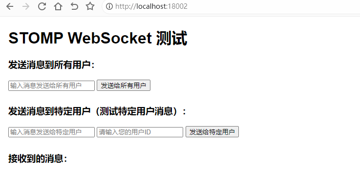
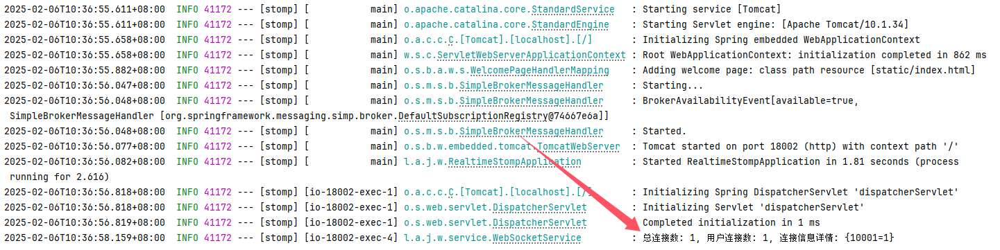
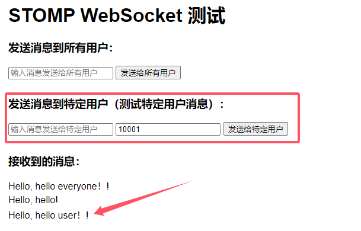
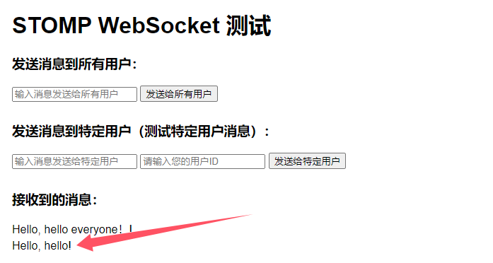
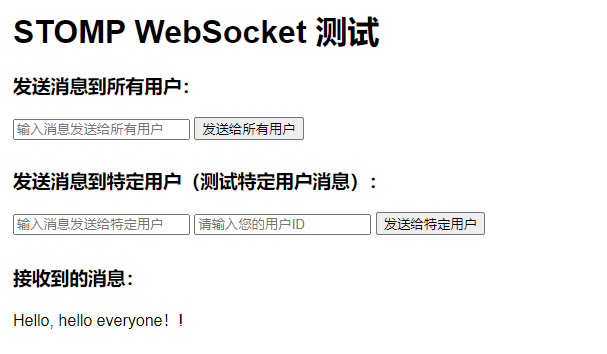
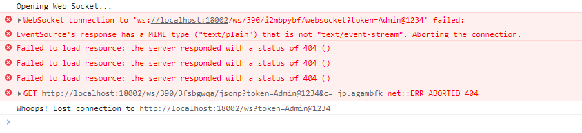

# STOMP

## STOMP 简介

**STOMP (Simple Text Oriented Messaging Protocol)** 是一种简单的文本消息协议，用于在客户端和服务器之间进行消息传递。它是基于 WebSocket 协议之上的，通常用于 **WebSocket** 的消息传递，提供了更强大的消息处理机制，如 **发布/订阅**、**消息队列** 等。

STOMP 的设计目标是简化并标准化 WebSocket 上的消息通信，特别适合实现 **实时通信**、**聊天系统**、**推送通知** 等应用。

### **STOMP 的特点**

1. **文本协议**：STOMP 协议使用简单的文本格式进行消息交换，易于理解和调试。
2. **基于 WebSocket**：STOMP 是在 WebSocket 协议之上构建的，这意味着它具有 WebSocket 的所有优势，如**全双工通信**、**低延迟**和**持久连接**。
3. **支持发布/订阅和队列模型：**
    - **发布/订阅（Pub/Sub）**：客户端可以订阅特定的“频道”，服务器向这些频道发布消息，所有订阅该频道的客户端都会收到消息。
    - **队列模型**：类似于消息队列，消息被发送到指定的“队列”，消费者从队列中取出消息。
4. **轻量级**：STOMP 协议非常轻便，并且与 WebSocket 配合非常好，适用于需要快速、简单消息交换的应用。

### **STOMP 主要概念**

1. **消息（Message）**：STOMP 消息是最基本的通信单元，它包含：
    - **头部（Headers）**：包含消息的元数据，如消息目的地（`destination`）和其他信息。
    - **内容（Body）**：消息的实际内容，通常是字符串。
2. **目的地（Destination）**：
    - 消息的目标地址。客户端使用目标地址发送消息或订阅消息。例如，`/topic/greetings`、`/queue/messages` 等。
3. **订阅（Subscription）**：客户端可以订阅特定的目的地，表示它感兴趣的消息来源。例如，客户端可以订阅 `/topic/greetings`，服务器会将相关的消息发送给它。
4. **发送（Send）**：客户端向服务器发送消息，通常通过指定目标地址来发送。
5. **发送消息的路径前缀**：
    - **应用消息（Application destinations）**：通常以 `/app` 开头，用于向应用程序发送请求。
    - **消息代理（Broker destinations）**：通常以 `/topic` 或 `/queue` 开头，用于发布/订阅消息。

### **STOMP 工作流程**

1. **客户端连接**：客户端通过 WebSocket 连接到服务器，建立 STOMP 会话。
2. **订阅消息**：客户端订阅指定的目标地址（如 `/topic/greetings`），表明它感兴趣的消息。
3. **发送消息**：客户端向服务器的指定目的地（如 `/app/hello`）发送消息。
4. **服务器广播消息**：服务器将消息发送到所有订阅该目标地址的客户端。
5. **客户端接收消息**：客户端收到服务器推送的消息。


## 基础配置

### 添加依赖

编辑 `pom.xml` 添加 WebSocket 依赖

```xml
<!-- Spring Boot Starter for WebSocket -->
<dependency>
    <groupId>org.springframework.boot</groupId>
    <artifactId>spring-boot-starter-websocket</artifactId>
</dependency>
```

### 编辑配置文件

编辑 `application.yml` 配置文件

```yaml
server:
  port: 18002
  servlet:
    context-path: /
spring:
  main:
    web-application-type: servlet
  application:
    name: ${project.artifactId}
---
```

编辑 ` resources\static\index.html` ，后续调试STOMP的一个页面

```html
<!DOCTYPE html>
<html lang="zh">
<head>
    <meta charset="UTF-8">
    <meta name="viewport" content="width=device-width, initial-scale=1.0">
    <title>STOMP WebSocket 测试</title>
    <script src="https://cdnjs.cloudflare.com/ajax/libs/sockjs-client/1.5.0/sockjs.min.js"></script>
    <script src="https://cdnjs.cloudflare.com/ajax/libs/stomp.js/2.3.3/stomp.min.js"></script>
    <style>
        body { font-family: Arial, sans-serif; margin: 20px; }
        input, button { margin-bottom: 10px; }
        .message-list { margin-top: 20px; }
        .message-list div { margin: 5px 0; }
    </style>
</head>
<body>
<h1>STOMP WebSocket 测试</h1>

<h3>发送消息到所有用户：</h3>
<input type="text" id="messageToAll" placeholder="输入消息发送给所有用户" />
<button onclick="sendToAll()">发送给所有用户</button>

<h3>发送消息到特定用户（测试特定用户消息）：</h3>
<input type="text" id="messageToUser" placeholder="输入消息发送给特定用户" />
<input type="text" id="userId" placeholder="请输入您的用户ID" />
<button onclick="sendToUser()">发送给特定用户</button>

<div class="message-list">
    <h3>接收到的消息：</h3>
    <div id="publicMessages"></div>
    <div id="userMessages"></div>
</div>

<script>
    var socket;
    var stompClient;

    // 默认的 userId（你可以根据需求调整）
    let userId = '10001';

    // 定义连接时发送的 headers
    var headers = {
        "Authorization": "Bearer 1234567890",
        "userId": userId,
        "username": "阿腾"
    };

    // 用于订阅公共消息和特定用户消息
    function connect() {
        // 连接成功后执行
        stompClient.connect(headers, function (frame) {
            console.log('已连接: ' + frame);

            // 订阅公共消息
            stompClient.subscribe('/topic/public', function (messageOutput) {
                showMessage("publicMessages", messageOutput.body);
            });

            // 订阅特定用户的消息
            stompClient.subscribe('/user/' + userId + '/queue/user', function (messageOutput) {
                showMessage("userMessages", messageOutput.body);
            });
        });
    }

    // 显示接收到的消息
    function showMessage(elementId, message) {
        const messageDiv = document.createElement("div");
        messageDiv.textContent = message;
        document.getElementById(elementId).appendChild(messageDiv);
    }

    // 发送消息到所有用户
    function sendToAll() {
        const message = document.getElementById("messageToAll").value;
        stompClient.send("/app/public", {}, message);
        document.getElementById("messageToAll").value = '';  // 清空输入框
    }

    // 发送消息到特定用户
    function sendToUser() {
        const message = document.getElementById("messageToUser").value;
        userId = document.getElementById("userId").value;
        if (!userId) {
            alert("请输入您的用户ID");
            return;
        }
        // 发送到特定用户：/app/user/{userId}
        stompClient.send("/app/user/" + userId, {}, message);
        document.getElementById("messageToUser").value = '';  // 清空输入框
    }

    // 页面加载时连接 WebSocket
    window.onload = function() {
        // 如果 stompClient 还没有初始化，则初始化它
        if (!stompClient) {
            socket = new SockJS('http://localhost:18002/ws' + '?token=Admin@123');
            stompClient = Stomp.over(socket);
        }

        // 确保在连接前已经初始化了 stompClient
        if (stompClient) {
            connect();  // 调用 connect() 方法建立连接
        } else {
            console.error("stompClient is not initialized.");
        }
    };

    // 页面卸载时断开 WebSocket 连接
    window.onbeforeunload = function () {
        if (stompClient) {
            stompClient.disconnect(function () {
                console.log('WebSocket连接已断开');
            });
        }
    };
</script>
</body>
</html>
```


## 配置WebSocket

### 配置WebSocketService

```java
package local.ateng.java.websocket.service;

import lombok.extern.slf4j.Slf4j;
import org.springframework.context.event.EventListener;
import org.springframework.messaging.simp.stomp.StompHeaderAccessor;
import org.springframework.stereotype.Component;
import org.springframework.web.socket.messaging.SessionConnectEvent;
import org.springframework.web.socket.messaging.SessionDisconnectEvent;

import java.util.Map;
import java.util.Optional;
import java.util.Set;
import java.util.concurrent.ConcurrentHashMap;
import java.util.concurrent.CopyOnWriteArraySet;
import java.util.stream.Collectors;

/**
 * WebSocket服务类
 *
 * @author 孔余
 * @email 2385569970@qq.com
 * @since 2025-02-05
 */
@Component
@Slf4j
public class WebSocketService {
    // 保存已连接的客户端信息的映射
    public static final Map<String, Set<StompHeaderAccessor>> sessionMap = new ConcurrentHashMap<>();

    /**
     * 获取所有的Session
     *
     * @return StompHeaderAccessor集合
     */
    public static Set<StompHeaderAccessor> getAllSessions() {
        return sessionMap.values().stream() // 获取 sessionMap 的所有值
                .flatMap(Set::stream) // 将每个 Set 转换为 Stream 并展平
                .collect(Collectors.toSet()); // 将结果收集到一个新的 Set 中
    }

    /**
     * 根据userId删除StompHeaderAccessor
     *
     * @param userId
     */
    public static void deleteSession(String userId, String sessionId) {
        Set<StompHeaderAccessor> accessors = sessionMap.get(userId);
        Optional<StompHeaderAccessor> optional = accessors.stream().filter(accessor -> sessionId.equals(accessor.getSessionId())).findFirst();
        if (optional.isPresent()) {
            accessors.remove(optional.get());
        }
    }

    /**
     * 处理WebSocket连接事件的方法。
     * 当有新的WebSocket连接建立时，将会话ID和用户ID添加到对应的映射中。
     *
     * @param event WebSocket连接事件
     */
    @EventListener
    public void handleWebSocketConnectListener(SessionConnectEvent event) {
        StompHeaderAccessor accessor = StompHeaderAccessor.wrap(event.getMessage());
        String sessionId = accessor.getSessionId();
        String userId = accessor.getFirstNativeHeader("userId"); // 获取用户ID

        // 保存userId到Attribute
        accessor.getSessionAttributes().put("userId", userId);

        // 保存会话
        sessionMap
                .computeIfAbsent(userId, k -> new CopyOnWriteArraySet<>())
                .add(accessor);
        // 打印连接信息日志
        logSessionInfo();
    }

    /**
     * 处理WebSocket断开连接事件的方法。
     * 当WebSocket连接断开时，从connectedClients和userSessionMap中移除对应的映射关系。
     *
     * @param event WebSocket断开连接事件
     */
    @EventListener
    public void handleWebSocketDisconnectListener(SessionDisconnectEvent event) {
        StompHeaderAccessor accessor = StompHeaderAccessor.wrap(event.getMessage());
        String sessionId = accessor.getSessionId();

        // 获取userId
        Map<String, Object> sessionAttributes = accessor.getSessionAttributes();
        String userId = (String) sessionAttributes.get("userId");

        // 删除会话
        deleteSession(userId, sessionId);
        // 打印连接信息日志
        logSessionInfo();
    }

    /**
     * 记录会话信息的方法。
     */
    public void logSessionInfo() {
        Map<String, Object> stats = getConnectionStats();
        log.info("总连接数: {}, 用户连接数: {}, 连接信息详情: {}", stats.get("totalConnections"), stats.get("totalUsers"), stats.get("userConnectionCounts"));
    }

    /**
     * 统计指定路径下的 WebSocket 连接信息
     * 返回一个包含路径下统计信息的 Map
     *
     * @return 连接信息 Map
     */
    public Map<String, Object> getConnectionStats() {
        Map<String, Object> stats = new ConcurrentHashMap<>();

        int totalConnections = 0;  // 总连接数
        int totalUsers = 0;        // 用户数
        Map<String, Integer> userConnectionCounts = new ConcurrentHashMap<>(); // 用户连接数详情

        if (sessionMap != null) {
            // 获取用户数
            totalUsers = sessionMap.size();

            // 直接遍历每个用户的会话，更新连接数
            for (Map.Entry<String, Set<StompHeaderAccessor>> entry : sessionMap.entrySet()) {
                String userId = entry.getKey();
                Set<StompHeaderAccessor> sessions = entry.getValue();
                int userSessionCount = sessions.size(); // 获取该用户的会话数量
                totalConnections += userSessionCount; // 累加总连接数
                userConnectionCounts.put(userId, userSessionCount); // 记录每个用户的连接数
            }
        }

        // 将统计信息放入 Map 中返回
        stats.put("totalConnections", totalConnections);
        stats.put("totalUsers", totalUsers);
        stats.put("userConnectionCounts", userConnectionCounts);

        return stats;
    }

}
```

### 配置WebSocketConfig

```java
package local.ateng.java.websocket.config;

import org.springframework.context.annotation.Configuration;
import org.springframework.messaging.simp.config.MessageBrokerRegistry;
import org.springframework.web.socket.config.annotation.EnableWebSocketMessageBroker;
import org.springframework.web.socket.config.annotation.StompEndpointRegistry;
import org.springframework.web.socket.config.annotation.WebSocketMessageBrokerConfigurer;

/**
 * WebSocket配置类
 *
 * @author 孔余
 * @email 2385569970@qq.com
 * @since 2025-02-05
 */
@Configuration
@EnableWebSocketMessageBroker
public class WebSocketConfig implements WebSocketMessageBrokerConfigurer {

    /**
     * 配置消息代理，用于处理消息传输。
     *
     * @param config 消息代理注册对象
     */
    @Override
    public void configureMessageBroker(MessageBrokerRegistry config) {
        // 启用简单的消息代理，以便在特定目的地前缀下广播消息给连接的客户端
        config.enableSimpleBroker("/topic", "/user");
        // 设置应用程序的目的地前缀，客户端发送消息时使用的前缀
        config.setApplicationDestinationPrefixes("/app");
        // 设置用户目的地前缀，用于处理点对点消息
        config.setUserDestinationPrefix("/user");
    }

    /**
     * 注册STOMP端点，允许客户端连接WebSocket。
     *
     * @param registry STOMP端点注册对象
     */
    @Override
    public void registerStompEndpoints(StompEndpointRegistry registry) {
        registry
                // 添加STOMP端点，客户端将使用该端点连接WebSocket
                .addEndpoint("/ws")
                // 允许来自任何源的跨域请求
                .setAllowedOriginPatterns("*")
                // 启用SockJS支持，以便客户端在不支持WebSocket的情况下能够使用备用传输方式
                .withSockJS();
    }

}
```

### 配置WebSocketController

```java
package local.ateng.java.websocket.controller;

import lombok.RequiredArgsConstructor;
import lombok.extern.slf4j.Slf4j;
import org.springframework.beans.factory.annotation.Autowired;
import org.springframework.messaging.handler.annotation.DestinationVariable;
import org.springframework.messaging.handler.annotation.MessageMapping;
import org.springframework.messaging.handler.annotation.SendTo;
import org.springframework.messaging.simp.SimpMessagingTemplate;
import org.springframework.messaging.simp.annotation.SendToUser;
import org.springframework.web.bind.annotation.GetMapping;
import org.springframework.web.bind.annotation.RequestMapping;
import org.springframework.web.bind.annotation.RestController;

import java.util.List;

@RestController
@RequestMapping("/websocket")
@Slf4j
@RequiredArgsConstructor(onConstructor = @__(@Autowired))
public class MyWebsocketController {
    private final SimpMessagingTemplate messagingTemplate;

    /**
     * 广播消息
     * 客户端发送给/app/public消息，服务端通过/topic/public广播给所有订阅该路径的客户端
     *
     * @param message
     * @return
     */
    @MessageMapping("/public")
    @SendTo("/topic/public")
    public String sendToAll(String message) {
        log.info("客户端发送了一条消息: {}", message);
        return "Hello, " + message + "!";
    }

    /**
     * 点对点消息
     * 发送消息给指定用户
     *
     * @param userId
     * @param message
     */
    @MessageMapping("/user/{userId}")
    public void sendToUser(@DestinationVariable String userId, String message) {
        log.info("客户端用户[{}]发送了一条消息: {}", userId, message);
        // 表示消息将被发送到当前用户的队列 /user/{userId}/queue/user
        messagingTemplate.convertAndSendToUser(userId, "/queue/user", "Hello, " + message + "!");
    }

    /**
     * 发送消息给指定用户组
     *
     * @param message
     */
    @GetMapping("/sendToUserGroup")
    public void sendToUserGroup(String message) {
        List<String> list = List.of("10001", "10002", "10003");
        list.forEach(userId -> {
            // 表示消息将被发送到当前用户的队列 /user/{userId}/queue/user
            messagingTemplate.convertAndSendToUser(userId, "/queue/user", "Hello, " + message + "!");
        });
    }

}
```


## 使用STOMP

### 访问页面

浏览器打开 http://localhost:18002/ 进入STOMP测试页面



查看控制台日志：




### 发送点对点消息

在输入框输入要发送的消息：hello user！，用户ID为：10001



### 发送点对多点（组播）消息

访问接口：http://localhost:18002/websocket/sendToUserGroup?message=hello



### 发送所有用户（广播）消息

在输入框输入要发送的消息：hello everyone！




## 配置认证

### 配置拦截器

```java
package local.ateng.java.websocket.interceptor;

import org.springframework.http.server.ServerHttpRequest;
import org.springframework.http.server.ServerHttpResponse;
import org.springframework.stereotype.Component;
import org.springframework.web.socket.WebSocketHandler;
import org.springframework.web.socket.server.HandshakeInterceptor;

import java.util.Map;

/**
 * HandshakeInterceptor用于在WebSocket连接建立之前进行用户认证
 *
 * @author 孔余
 * @email 2385569970@qq.com
 * @since 2025-02-06
 */
@Component
public class AuthHandshakeInterceptor implements HandshakeInterceptor {

    /**
     * 在握手之前调用，用于用户认证。
     *
     * @param request     当前的HTTP请求
     * @param response    当前的HTTP响应
     * @param wsHandler   将要处理WebSocket消息的处理器
     * @param attributes  将传递给WebSocket会话的属性
     * @return 是否同意握手，true表示同意，false表示拒绝
     * @throws Exception 如果发生错误
     */
    @Override
    public boolean beforeHandshake(ServerHttpRequest request, ServerHttpResponse response,
                                   WebSocketHandler wsHandler, Map<String, Object> attributes) throws Exception {
        // 获取URI中的查询参数，并提取token
        String query = request.getURI().getQuery();
        String token = null;

        if (query != null && query.contains("=")) {
            token = query.split("=")[1];
        }

        String authorization = request.getHeaders().getFirst("Authorization");

        // 如果token为空，则拒绝握手
        if (token == null) {
            return false;
        }

        // 将token放入attributes中，供WebSocket处理器使用(handleWebSocketConnectListener)
        attributes.put("token", token);

        // 调用用户认证方法
        return authenticateUser(token);
    }

    /**
     * 在握手之后调用。
     *
     * @param request    当前的HTTP请求
     * @param response   当前的HTTP响应
     * @param wsHandler  将要处理WebSocket消息的处理器
     * @param exception  握手过程中发生的异常
     */
    @Override
    public void afterHandshake(ServerHttpRequest request, ServerHttpResponse response,
                               WebSocketHandler wsHandler, Exception exception) {
        // 握手成功后的处理，可以在此处进行日志记录或其他操作
    }

    /**
     * 用户认证方法。
     *
     * @param token 要认证的token
     * @return 认证是否通过，true表示通过，false表示不通过
     */
    private boolean authenticateUser(String token) {
        // 实现你的用户认证逻辑
        // 示例中简单地假设只有token为"Admin@123"才是合法的
        return "Admin@123".equals(token);
    }
}
```

### 添加拦截器

在WebSocketConfig中添加拦截器：.addInterceptors(new AuthHandshakeInterceptor())

```java
@Override
public void registerStompEndpoints(StompEndpointRegistry registry) {
    registry
            // 添加STOMP端点，客户端将使用该端点连接WebSocket
            .addEndpoint("/ws")
            // 允许来自任何源的跨域请求
            .setAllowedOriginPatterns("*")
            // 添加拦截器，用于在握手之前进行用户认证
            .addInterceptors(new AuthHandshakeInterceptor())
            // 启用SockJS支持，以便客户端在不支持WebSocket的情况下能够使用备用传输方式
            .withSockJS();
}
```

再次连接STOMP就会需要请求地址中的token做验证，如果验证失败就会出现以下错误：




## RabbitMQ STOMP

### 安装RabbitMQ

参考链接：[地址](https://kongyu666.github.io/ops/#/work/kubernetes/service/rabbitmq/v4.0.2/)

### 队列模式

```html
<!DOCTYPE html>
<html>
<head>
  <title>RabbitMQ Web STOMP Example</title>
  <script src="https://cdnjs.cloudflare.com/ajax/libs/sockjs-client/1.5.0/sockjs.min.js"></script>
  <script src="https://cdnjs.cloudflare.com/ajax/libs/stomp.js/2.3.3/stomp.min.js"></script>
</head>
<body>
<h1>RabbitMQ Web STOMP Example</h1>
<div>
  <label for="userId">User ID:</label>
  <input type="text" id="userId" />
  <label for="name">Message:</label>
  <input type="text" id="message" />
  <button onclick="sendMessage()">Send</button>
</div>
<div id="messages"></div>
<script>
  var stompClient = null;

  function connect() {
    var ws = new WebSocket('ws://192.168.1.10:35171/ws');
    stompClient = Stomp.over(ws);
    var login = 'admin';
    var passcode = 'Admin@123';
    var headers = {
      login: login,
      passcode: passcode,
      // 必须加这个，否则会被rabbitmq服务器断开连接
      "heart-beat": "0,0"
    };
    stompClient.connect(headers, function (frame) {
      console.log('Connected: ' + frame);
      // 格式: /queue/{队列名}
      stompClient.subscribe('/queue/my_rabbitmq_stomp.hello', function (message) {
        showMessage(message.body);
      });
    }, function (error) {
      console.log("STOMP protocol error " + error);
    });
  }

  function disconnect() {
    if (stompClient !== null) {
      stompClient.disconnect();
    }
    console.log("Disconnected");
  }

  function sendMessage() {
    var userId = document.getElementById('userId').value;
    var messageContent = document.getElementById('message').value;
    var message = {
      userId: userId,
      content: messageContent
    };
    stompClient.send("/queue/my_rabbitmq_stomp.hello", {}, JSON.stringify(message));
  }

  function showMessage(message) {
    var p = document.createElement('p');
    p.textContent = message;
    document.getElementById('messages').appendChild(p);
  }

  connect();
</script>
</body>
</html>
```

### 交换机模式

```html
<!DOCTYPE html>
<html>
<head>
  <title>RabbitMQ Web STOMP Example</title>
  <script src="https://cdnjs.cloudflare.com/ajax/libs/sockjs-client/1.5.0/sockjs.min.js"></script>
  <script src="https://cdnjs.cloudflare.com/ajax/libs/stomp.js/2.3.3/stomp.min.js"></script>
</head>
<body>
<h1>RabbitMQ Web STOMP Example</h1>
<div>
  <label for="userId">User ID:</label>
  <input type="text" id="userId" />
  <label for="name">Message:</label>
  <input type="text" id="message" />
  <button onclick="sendMessage()">Send</button>
</div>
<div id="messages"></div>
<script>
  var stompClient = null;

  function connect() {
    var ws = new WebSocket('ws://192.168.1.10:35171/ws');
    stompClient = Stomp.over(ws);
    var login = 'admin';
    var passcode = 'Admin@123';
    var vhost = '/';
    var headers = {
      login: login,
      passcode: passcode,
      // 必须加这个，否则会被rabbitmq服务器断开连接
      "heart-beat": "0,0",
      "client-id": "my-client-id"
    };
    stompClient.connect(headers, function (frame) {
      console.log('Connected: ' + frame);
      // 格式: /exchange/{交换机名}/{路由键}
      stompClient.subscribe('/exchange/stomp/myRoutingKey', function (message) {
        showMessage(message.body);
      });
    }, function (error) {
      console.log("STOMP protocol error " + error);
    });
  }

  function disconnect() {
    if (stompClient !== null) {
      stompClient.disconnect();
    }
    console.log("Disconnected");
  }

  function sendMessage() {
    var userId = document.getElementById('userId').value;
    var messageContent = document.getElementById('message').value;
    var message = {
      userId: userId,
      content: messageContent
    };
    stompClient.send("/exchange/stomp/myRoutingKey", {}, JSON.stringify(message));
  }

  function showMessage(message) {
    var p = document.createElement('p');
    p.textContent = message;
    document.getElementById('messages').appendChild(p);
  }

  connect();
</script>
</body>
</html>
```

