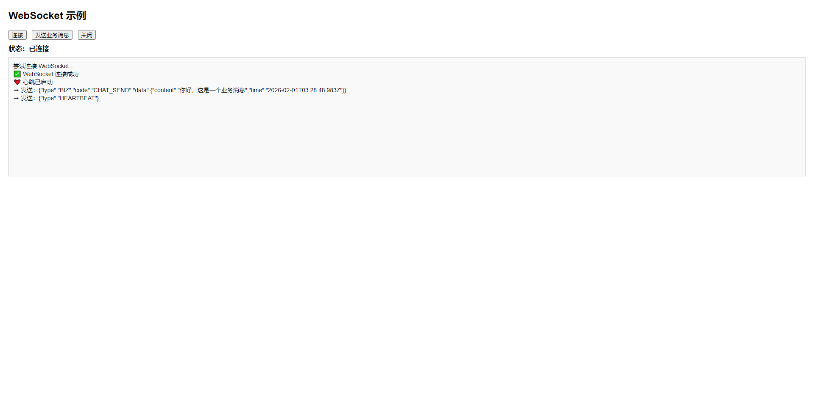

# WebSocket

WebSocket 是一种**全双工**通信协议，它允许服务器和客户端之间建立**持久化连接**，并且可以**实时**双向发送数据，而不需要像 HTTP 那样每次请求都要建立新的连接。

**特点**：

- **全双工通信**：服务器和客户端都可以主动推送消息。
- **低延迟**：相比 HTTP 轮询，WebSocket 只在建立连接时使用 HTTP 进行握手，后续通信使用 TCP，减少了带宽和延迟。
- **减少服务器压力**：减少了频繁的 HTTP 请求，适用于聊天室、实时股票推送、在线游戏等应用场景。

------

## 概览

本方案基于 **Spring Boot + 原生 WebSocket** 构建，面向 **生产级集群部署场景**，在不引入 STOMP 的前提下，实现了 **跨节点消息广播、定向推送、在线状态统一管理** 等能力。

整体设计遵循以下原则：

- **单机能力优先**：在单机 WebSocket 实现稳定的前提下演进至集群
- **职责分离**：WebSocket 只负责连接与推送，集群同步交由 Redis / MQ
- **弱耦合扩展**：节点之间通过消息通信，不直接感知彼此存在
- **工程可维护**：组件清晰、职责单一、便于排查与扩展

------

### 架构组成

系统主要由以下几部分构成：

- **WebSocket 服务层**
  - 维护本节点的 WebSocket 会话
  - 提供用户级、Session 级消息推送能力
  - 支持心跳检测与连接清理
- **Redis 在线状态中心**
  - 维护全局在线用户集合
  - 支持快速判断用户是否在线
  - 为跨节点消息路由提供依据
- **RabbitMQ 集群广播通道**
  - 负责节点之间的消息投递
  - 每个节点拥有独立消费队列
  - 保证消息在集群内可靠分发
- **HTTP 运维与管理接口**
  - 查询在线用户 / 会话数量
  - 主动推送消息
  - 强制踢用户或 Session 下线

------

### 集群通信模型

在集群模式下，WebSocket 消息的流转遵循以下流程：

1. 当前节点接收到推送请求
2. 若目标用户不在本节点：
   - 构造集群广播消息
   - 通过 MQ 投递给其他节点
3. 各节点消费广播消息：
   - 判断是否为自身发送的消息
   - 根据目标用户决定是否转发
4. 命中本地会话后完成 WebSocket 推送

该模型避免了节点间的直接调用，保证了良好的扩展性和容错能力。

------

### 消息类型支持

当前方案支持以下几类 WebSocket 消息推送方式：

- **单用户推送**
- **多用户定向推送**
- **全局广播**
- **指定 Session 推送**

所有消息在集群层面统一封装为广播消息模型，在节点内部再进行精确分发。

------

### 适用场景

该方案适用于以下场景：

- 中小规模 WebSocket 集群
- 对连接数和实时性有要求的系统
- 不需要 STOMP / SockJS 协议支持
- 需要精细控制 WebSocket 行为的业务系统

------

### 方案特点

- 原生 WebSocket，协议轻量
- 无 STOMP 依赖，减少中间抽象
- MQ 解耦节点通信，集群扩展简单
- 支持运维级 HTTP 管理接口
- 具备生产环境落地经验

------

## 基础配置

### 添加依赖

编辑 `pom.xml` 添加 WebSocket 依赖

```xml
<!-- WebSocket 协议支持 -->
<dependency>
    <groupId>org.springframework.boot</groupId>
    <artifactId>spring-boot-starter-websocket</artifactId>
</dependency>

<!-- Spring Boot Validation 数据校验框架 -->
<dependency>
    <groupId>org.springframework.boot</groupId>
    <artifactId>spring-boot-starter-validation</artifactId>
</dependency>
```

### 编辑配置文件

编辑 `application.yml` 配置文件

```yaml
server:
  port: 18001
spring:
  application:
    name: ${project.artifactId}
logging:
  level:
    root: info
    io.github.atengk: debug
---
# WebSocket 配置
websocket:
  # 连接地址
  endpoint: /ws

  # 允许跨域来源
  allowed-origins:
    - http://localhost:5173
    - http://127.0.0.1:5173

  # 心跳超时时间
  heartbeat-timeout: 60s

  # 心跳检测间隔（毫秒）
  heartbeat-check-interval: 30000

```


## 配置WebSocket

### 配置实体类

#### 配置类

```java
package io.github.atengk.config;

import jakarta.validation.constraints.NotBlank;
import jakarta.validation.constraints.NotEmpty;
import jakarta.validation.constraints.NotNull;
import lombok.Data;
import org.springframework.boot.context.properties.ConfigurationProperties;
import org.springframework.stereotype.Component;

import java.time.Duration;
import java.util.List;

/**
 * WebSocket 配置属性绑定类
 *
 * <p>
 * 用于统一管理 WebSocket 相关的配置项，
 * 通过 {@code websocket.*} 前缀从配置文件中加载。
 * </p>
 *
 * @author 孔余
 * @since 2026-01-30
 */
@Data
@Component
@ConfigurationProperties(prefix = "websocket")
public class WebSocketProperties {

    /**
     * WebSocket 端点路径
     *
     * <p>
     * 客户端建立 WebSocket 连接时访问的路径，
     * 例如：/ws
     * </p>
     */
    @NotBlank
    private String endpoint;

    /**
     * 允许跨域访问的来源列表
     *
     * <p>
     * 用于配置 WebSocket 的跨域访问控制，
     * 可配置多个前端访问地址。
     * </p>
     *
     * <pre>
     * 示例：
     * - http://localhost:5173
     * - https://www.example.com
     * </pre>
     */
    @NotEmpty
    private List<String> allowedOrigins;

    /**
     * WebSocket 心跳超时时间
     *
     * <p>
     * 在该时间范围内未收到客户端心跳消息，
     * 将认为连接已失效并主动关闭。
     * </p>
     */
    @NotNull
    private Duration heartbeatTimeout;

    /**
     * WebSocket 心跳检测执行间隔
     *
     * <p>
     * 表示后台定时任务检测心跳超时的执行频率，
     * 单位为毫秒。
     * </p>
     */
    @NotNull
    private Long heartbeatCheckInterval;
}

```

#### 广播消息类

```java
package io.github.atengk.entity;

import lombok.AllArgsConstructor;
import lombok.Data;
import lombok.NoArgsConstructor;

import java.io.Serializable;
import java.util.Set;

/**
 * WebSocket 集群广播消息实体
 *
 * <p>
 * 用于 WebSocket 集群节点之间通过 MQ 传递消息，
 * 消息由发送节点投递，接收节点根据消息内容
 * 决定是否向本地 WebSocket Session 转发。
 * </p>
 *
 * <p>
 * 典型使用场景：
 * <ul>
 *     <li>跨节点广播消息</li>
 *     <li>跨节点定向推送给指定用户</li>
 *     <li>集群内节点间消息同步</li>
 * </ul>
 * </p>
 *
 * <p>
 * 注意：
 * <ul>
 *     <li>消息仅用于节点间通信，不直接暴露给前端</li>
 *     <li>实际 WebSocket 发送内容由 payload 承载</li>
 * </ul>
 * </p>
 *
 * @author 孔余
 * @since 2026-01-30
 */
@Data
@AllArgsConstructor
@NoArgsConstructor
public class WebSocketBroadcastMessage implements Serializable {

    private static final long serialVersionUID = 1L;

    /**
     * 消息来源节点标识
     *
     * <p>
     * 用于区分消息的发送节点，
     * 接收节点可据此避免处理自身发送的消息。
     * </p>
     */
    private String fromNode;

    /**
     * 实际 WebSocket 消息内容
     *
     * <p>
     * 该字段为最终推送给 WebSocket 客户端的消息体，
     * 通常为 JSON 字符串。
     * </p>
     */
    private String payload;

    /**
     * 目标用户集合
     *
     * <p>
     * 当集合为空或为 {@code null} 时，
     * 表示广播给所有在线用户。
     * </p>
     *
     * <p>
     * 当集合不为空时，
     * 仅向指定 userId 对应的 WebSocket Session 推送。
     * </p>
     */
    private Set<String> targetUsers;
}

```

#### 消息类

```java
package io.github.atengk.entity;

import lombok.Data;

/**
 * WebSocket 消息实体
 *
 * <p>
 * 用于客户端与服务端之间统一的数据传输结构，
 * 支持不同类型的业务消息。
 * </p>
 *
 * @author 孔余
 * @since 2026-01-30
 */
@Data
public class WebSocketMessage {

    /**
     * 消息类型
     *
     * <p>
     * 用于区分业务消息、心跳消息、系统消息等
     * </p>
     */
    private String type;

    /**
     * 业务状态码
     *
     * <p>
     * 用于标识消息处理结果或业务场景
     * </p>
     */
    private String code;

    /**
     * 消息数据体
     *
     * <p>
     * 具体业务数据，由不同消息类型决定
     * </p>
     */
    private Object data;
}

```

#### 消息常量类

```java
package io.github.atengk.constants;

/**
 * WebSocket 业务码常量
 *
 * <p>
 * 用于标识 WebSocket 消息对应的具体业务场景，
 * 便于前后端统一识别与处理。
 * </p>
 *
 * @author 孔余
 * @since 2026-01-30
 */
public final class WebSocketBizCodeConstants {

    private WebSocketBizCodeConstants() {
    }

    /**
     * 订单创建
     */
    public static final String ORDER_CREATE = "ORDER_CREATE";

    /**
     * 订单取消
     */
    public static final String ORDER_CANCEL = "ORDER_CANCEL";

    /**
     * 任务进度通知
     */
    public static final String TASK_PROGRESS = "TASK_PROGRESS";
}

```

#### 消息类型枚举

```java
package io.github.atengk.enums;

import lombok.Getter;

/**
 * WebSocket 消息类型枚举
 *
 * <p>
 * 用于区分 WebSocket 消息的基础类型，
 * 如心跳消息、业务消息等。
 * </p>
 *
 * @author 孔余
 * @since 2026-01-30
 */
@Getter
public enum WebSocketMessageType {

    /**
     * 心跳消息
     */
    HEARTBEAT("HEARTBEAT", "心跳"),

    /**
     * 心跳确认消息
     */
    HEARTBEAT_ACK("HEARTBEAT_ACK", "心跳确认"),

    /**
     * 业务消息
     */
    BIZ("BIZ", "业务消息");

    /**
     * 类型编码
     */
    private final String code;

    /**
     * 类型描述
     */
    private final String desc;

    WebSocketMessageType(String code, String desc) {
        this.code = code;
        this.desc = desc;
    }

    /**
     * 根据编码获取消息类型
     *
     * @param code 类型编码
     * @return 消息类型，未匹配返回 null
     */
    public static WebSocketMessageType fromCode(String code) {
        for (WebSocketMessageType type : values()) {
            if (type.code.equals(code)) {
                return type;
            }
        }
        return null;
    }
}

```

#### 业务消息枚举

```java
package io.github.atengk.enums;

import lombok.Getter;

/**
 * WebSocket 业务编码枚举
 *
 * <p>
 * 用于区分不同业务类型的 WebSocket 消息，
 * 结合 {@link io.github.atengk.service.WebSocketBizHandler}
 * 实现按业务分发处理。
 * </p>
 *
 * @author 孔余
 * @since 2026-01-30
 */
@Getter
public enum WebSocketBizCode {

    /**
     * 发送聊天消息
     */
    CHAT_SEND("CHAT_SEND", "发送聊天消息"),

    /**
     * 接收聊天消息
     */
    CHAT_RECEIVE("CHAT_RECEIVE", "接收聊天消息"),

    /**
     * 通知推送
     */
    NOTICE_PUSH("NOTICE_PUSH", "通知推送"),

    /**
     * 通知确认
     */
    NOTICE_ACK("NOTICE_ACK", "通知确认");

    /**
     * 业务编码
     */
    private final String code;

    /**
     * 业务描述
     */
    private final String desc;

    WebSocketBizCode(String code, String desc) {
        this.code = code;
        this.desc = desc;
    }

    /**
     * 根据编码获取业务枚举
     *
     * @param code 业务编码
     * @return 业务枚举，未匹配返回 null
     */
    public static WebSocketBizCode fromCode(String code) {
        for (WebSocketBizCode bizCode : values()) {
            if (bizCode.code.equals(code)) {
                return bizCode;
            }
        }
        return null;
    }
}

```

#### 消息队列常量类

```java
package io.github.atengk.constants;

/**
 * WebSocket MQ 相关常量定义
 *
 * <p>
 * 统一管理 WebSocket 集群模式下使用的
 * RabbitMQ 交换机、队列及路由键名称，
 * 避免在代码中出现硬编码字符串。
 * </p>
 *
 * <p>
 * 使用约定：
 * <ul>
 *     <li>交换机固定为单一广播交换机</li>
 *     <li>队列名称按节点维度动态拼接 nodeId</li>
 *     <li>所有消息使用统一 routingKey</li>
 * </ul>
 * </p>
 *
 * <p>
 * 示例：
 * <pre>
 * Exchange : ws.exchange
 * Queue    : ws.queue.{nodeId}
 * Routing  : ws.broadcast
 * </pre>
 * </p>
 *
 * @author 孔余
 * @since 2026-01-30
 */
public final class WebSocketMqConstants {

    /**
     * WebSocket 广播交换机名称
     *
     * <p>
     * 用于 WebSocket 集群间消息广播，
     * 所有节点队列均绑定到该交换机。
     * </p>
     */
    public static final String EXCHANGE_WS_BROADCAST = "ws.exchange";

    /**
     * WebSocket 广播队列名称前缀
     *
     * <p>
     * 实际队列名称由该前缀与节点标识 nodeId 拼接而成，
     * 每个节点拥有独立的消息队列。
     * </p>
     *
     * <pre>
     * ws.queue.node-1
     * ws.queue.node-2
     * </pre>
     */
    public static final String QUEUE_WS_BROADCAST = "ws.queue.";

    /**
     * WebSocket 广播路由键
     *
     * <p>
     * 所有 WebSocket 广播消息均使用该 routingKey，
     * 简化路由规则，避免复杂绑定。
     * </p>
     */
    public static final String ROUTING_KEY = "ws.broadcast";

    /**
     * 私有构造方法，防止实例化
     */
    private WebSocketMqConstants() {
    }
}

```

### 配置WebSocketService

```java
package io.github.atengk.service;

import com.alibaba.fastjson2.JSONObject;
import io.github.atengk.config.WebSocketProperties;
import io.github.atengk.constants.WebSocketMqConstants;
import io.github.atengk.entity.WebSocketBroadcastMessage;
import io.github.atengk.entity.WebSocketMessage;
import io.github.atengk.enums.WebSocketMessageType;
import io.github.atengk.util.NodeIdUtil;
import jakarta.annotation.PreDestroy;
import lombok.RequiredArgsConstructor;
import lombok.extern.slf4j.Slf4j;
import org.springframework.amqp.rabbit.annotation.RabbitListener;
import org.springframework.amqp.rabbit.core.RabbitTemplate;
import org.springframework.data.redis.core.StringRedisTemplate;
import org.springframework.stereotype.Service;
import org.springframework.web.socket.CloseStatus;
import org.springframework.web.socket.TextMessage;
import org.springframework.web.socket.WebSocketSession;

import java.io.IOException;
import java.util.Collections;
import java.util.Map;
import java.util.Set;
import java.util.concurrent.ConcurrentHashMap;
import java.util.concurrent.atomic.AtomicBoolean;

/**
 * WebSocket 核心服务类（支持集群）
 *
 * <p>
 * 负责 WebSocket Session 生命周期管理、心跳维护、
 * 本地消息投递以及跨节点消息广播。
 * </p>
 *
 * <p>
 * 设计原则：
 * <ul>
 *     <li>Session 仅存在于本地内存，不跨节点共享</li>
 *     <li>Redis 维护全局状态</li>
 *     <li>MQ 仅用于跨节点消息投递</li>
 * </ul>
 * </p>
 *
 * @author 孔余
 * @since 2026-01-30
 */
@Slf4j
@Service
@RequiredArgsConstructor
public class WebSocketService {

    /**
     * Redis Key：在线用户集合
     */
    private static final String KEY_USERS = "ws:online:users";

    /**
     * Redis Key：sessionId -> userId
     */
    private static final String KEY_SESSION_USER = "ws:session:user";

    /**
     * Redis Key：sessionId -> nodeId
     */
    private static final String KEY_SESSION_NODE = "ws:session:node";

    /**
     * Redis Key：nodeId -> sessions
     */
    private static final String KEY_NODE_SESSIONS = "ws:node:sessions:";

    /**
     * Redis Key：nodeId -> 心跳 ZSet
     */
    private static final String KEY_HEARTBEAT_ZSET = "ws:heartbeat:zset:";

    /**
     * 本地 Session 缓存（sessionId -> WebSocketSession）
     */
    private static final Map<String, WebSocketSession> SESSION_MAP = new ConcurrentHashMap<>();

    /**
     * 本地用户 Session 映射（userId -> sessionId 集合）
     */
    private static final Map<String, Set<String>> USER_SESSION_MAP = new ConcurrentHashMap<>();

    private final WebSocketProperties webSocketProperties;
    private final WebSocketBizDispatcher bizDispatcher;
    private final RabbitTemplate rabbitTemplate;
    private final StringRedisTemplate redisTemplate;

    /**
     * 当前节点标识
     */
    private final String nodeId = NodeIdUtil.getNodeId();

    /**
     * 应用是否正在关闭标识
     */
    private static final AtomicBoolean SHUTTING_DOWN = new AtomicBoolean(false);

    /**
     * 应用关闭前标记状态
     */
    @PreDestroy
    public void onShutdown() {
        SHUTTING_DOWN.set(true);
        log.info("WebSocketService 正在关闭，nodeId={}", nodeId);
    }

    /**
     * WebSocket 用户鉴权
     *
     * @param userId 用户ID
     * @return 是否通过鉴权
     */
    public boolean authenticate(String userId) {
        return userId != null && !userId.isBlank();
    }

    /**
     * 注册 WebSocket Session
     *
     * @param userId  用户ID
     * @param session WebSocket Session
     */
    public void registerSession(String userId, WebSocketSession session) {
        String sessionId = session.getId();

        log.info(
                "注册 WebSocket Session，nodeId={}, userId={}, sessionId={}",
                nodeId, userId, sessionId
        );

        SESSION_MAP.put(sessionId, session);
        USER_SESSION_MAP
                .computeIfAbsent(userId, k -> ConcurrentHashMap.newKeySet())
                .add(sessionId);

        redisTemplate.opsForSet().add(KEY_USERS, userId);
        redisTemplate.opsForHash().put(KEY_SESSION_USER, sessionId, userId);
        redisTemplate.opsForHash().put(KEY_SESSION_NODE, sessionId, nodeId);
        redisTemplate.opsForSet().add(KEY_NODE_SESSIONS + nodeId, sessionId);
        redisTemplate.opsForZSet().add(
                KEY_HEARTBEAT_ZSET + nodeId,
                sessionId,
                System.currentTimeMillis()
        );
    }

    /**
     * 移除 WebSocket Session
     *
     * @param session WebSocket Session
     */
    public void removeSession(WebSocketSession session) {
        if (session == null) {
            return;
        }

        String sessionId = session.getId();
        SESSION_MAP.remove(sessionId);

        if (SHUTTING_DOWN.get()) {
            USER_SESSION_MAP.values().forEach(set -> set.remove(sessionId));
            return;
        }

        Object userId = redisTemplate.opsForHash().get(KEY_SESSION_USER, sessionId);

        redisTemplate.opsForHash().delete(KEY_SESSION_USER, sessionId);
        redisTemplate.opsForHash().delete(KEY_SESSION_NODE, sessionId);
        redisTemplate.opsForSet().remove(KEY_NODE_SESSIONS + nodeId, sessionId);
        redisTemplate.opsForZSet().remove(KEY_HEARTBEAT_ZSET + nodeId, sessionId);

        if (userId != null) {
            Set<String> sessions = USER_SESSION_MAP.get(userId.toString());
            if (sessions != null) {
                sessions.remove(sessionId);
                if (sessions.isEmpty()) {
                    USER_SESSION_MAP.remove(userId.toString());
                    redisTemplate.opsForSet().remove(KEY_USERS, userId.toString());
                }
            }
        }

        log.info(
                "移除 WebSocket Session，nodeId={}, sessionId={}, userId={}",
                nodeId, sessionId, userId
        );
    }

    /**
     * 处理心跳消息
     *
     * @param session WebSocket Session
     */
    public void handleHeartbeat(WebSocketSession session) {
        redisTemplate.opsForZSet().add(
                KEY_HEARTBEAT_ZSET + nodeId,
                session.getId(),
                System.currentTimeMillis()
        );

        try {
            if (session.isOpen()) {
                WebSocketMessage msg = new WebSocketMessage();
                msg.setType(WebSocketMessageType.HEARTBEAT_ACK.getCode());
                session.sendMessage(
                        new TextMessage(JSONObject.toJSONString(msg))
                );
            }
        } catch (Exception e) {
            log.warn(
                    "心跳响应失败，准备关闭 Session，sessionId={}",
                    session.getId(),
                    e
            );
            closeSession(session.getId(), CloseStatus.SERVER_ERROR);
        }
    }

    /**
     * 检测心跳超时 Session
     */
    public void checkHeartbeatTimeout() {
        long now = System.currentTimeMillis();
        long timeoutMillis = webSocketProperties.getHeartbeatTimeout().toMillis();
        String heartbeatKey = KEY_HEARTBEAT_ZSET + nodeId;

        Set<String> timeoutSessionIds = redisTemplate.opsForZSet()
                .rangeByScore(heartbeatKey, 0, now - timeoutMillis);

        if (timeoutSessionIds == null || timeoutSessionIds.isEmpty()) {
            return;
        }

        log.warn(
                "检测到心跳超时 Session，nodeId={}, count={}",
                nodeId, timeoutSessionIds.size()
        );

        for (String sessionId : timeoutSessionIds) {
            closeSession(sessionId, CloseStatus.SESSION_NOT_RELIABLE);
        }
    }

    /**
     * 向指定 Session 发送消息
     */
    public void sendToSession(String sessionId, String message) {
        WebSocketSession session = SESSION_MAP.get(sessionId);
        if (session == null || !session.isOpen()) {
            if (session != null) {
                removeSession(session);
            }
            return;
        }

        try {
            session.sendMessage(new TextMessage(message));
        } catch (IOException e) {
            log.warn(
                    "发送消息失败，sessionId={}",
                    sessionId,
                    e
            );
            closeSession(sessionId, CloseStatus.SERVER_ERROR);
        }
    }

    /**
     * 向指定用户发送消息（本节点）
     */
    public void sendToUser(String userId, String message) {
        Set<String> sessionIds =
                USER_SESSION_MAP.getOrDefault(userId, Collections.emptySet());

        for (String sessionId : Set.copyOf(sessionIds)) {
            sendToSession(sessionId, message);
        }
    }

    /**
     * 本地向多个用户发送消息
     */
    private void sendToUsersLocal(Set<String> userIds, String message) {
        for (String userId : userIds) {
            Set<String> sessionIds = USER_SESSION_MAP.get(userId);
            if (sessionIds == null || sessionIds.isEmpty()) {
                continue;
            }
            for (String sessionId : Set.copyOf(sessionIds)) {
                sendToSession(sessionId, message);
            }
        }
    }

    /**
     * 向多个用户发送消息（集群）
     */
    public void sendToUsers(Set<String> userIds, String message) {
        if (userIds == null || userIds.isEmpty()) {
            return;
        }

        sendToUsersLocal(userIds, message);

        rabbitTemplate.convertAndSend(
                WebSocketMqConstants.EXCHANGE_WS_BROADCAST,
                WebSocketMqConstants.ROUTING_KEY,
                new WebSocketBroadcastMessage(nodeId, message, userIds)
        );
    }

    /**
     * 广播消息（集群）
     */
    public void broadcast(String message) {
        broadcastLocal(message);

        rabbitTemplate.convertAndSend(
                WebSocketMqConstants.EXCHANGE_WS_BROADCAST,
                WebSocketMqConstants.ROUTING_KEY,
                new WebSocketBroadcastMessage(nodeId, message, null)
        );
    }

    /**
     * MQ 消息监听（跨节点广播）
     */
    @RabbitListener(queues = "#{wsBroadcastQueue.name}")
    public void onBroadcast(WebSocketBroadcastMessage message) {
        if (nodeId.equals(message.getFromNode())) {
            return;
        }

        if (message.getTargetUsers() == null || message.getTargetUsers().isEmpty()) {
            broadcastLocal(message.getPayload());
            return;
        }

        sendToUsersLocal(message.getTargetUsers(), message.getPayload());
    }

    /**
     * 本地广播消息
     */
    private void broadcastLocal(String message) {
        SESSION_MAP.values().forEach(session -> {
            if (!session.isOpen()) {
                removeSession(session);
                return;
            }
            try {
                session.sendMessage(new TextMessage(message));
            } catch (IOException e) {
                closeSession(session.getId(), CloseStatus.SERVER_ERROR);
            }
        });
    }

    /**
     * 踢用户下线
     */
    public void kickUser(String userId) {
        Set<String> sessionIds =
                USER_SESSION_MAP.getOrDefault(userId, Collections.emptySet());

        for (String sessionId : Set.copyOf(sessionIds)) {
            closeSession(sessionId);
        }
    }

    /**
     * 关闭 Session（默认状态）
     */
    public void closeSession(String sessionId) {
        closeSession(sessionId, CloseStatus.NORMAL);
    }

    /**
     * 关闭 Session
     */
    public void closeSession(String sessionId, CloseStatus status) {
        WebSocketSession session = SESSION_MAP.get(sessionId);
        if (session == null) {
            return;
        }

        try {
            if (session.isOpen()) {
                session.close(status);
            }
        } catch (IOException ignored) {
        } finally {
            removeSession(session);
        }
    }

    /**
     * 分发业务消息
     */
    public void handleBizMessage(WebSocketSession session, WebSocketMessage message) {
        bizDispatcher.dispatch(session, message.getCode(), message);
    }

    /**
     * 获取在线用户列表
     */
    public Set<String> getOnlineUsers() {
        Set<String> users = redisTemplate.opsForSet().members(KEY_USERS);
        return users == null ? Collections.emptySet() : users;
    }

    /**
     * 获取在线用户数量
     */
    public int getOnlineUserCount() {
        Long size = redisTemplate.opsForSet().size(KEY_USERS);
        return size == null ? 0 : size.intValue();
    }

    /**
     * 获取当前节点 Session 数量
     */
    public int getOnlineSessionCount() {
        return SESSION_MAP.size();
    }

    /**
     * 获取用户 Session 数量
     */
    public int getUserSessionCount(String userId) {
        Set<String> sessions = USER_SESSION_MAP.get(userId);
        return sessions == null ? 0 : sessions.size();
    }

    /**
     * 获取指定节点的 Session 列表
     */
    public Set<String> getNodeSessions(String nodeId) {
        Set<String> sessions =
                redisTemplate.opsForSet().members(KEY_NODE_SESSIONS + nodeId);
        return sessions == null ? Collections.emptySet() : sessions;
    }

}

```

### 配置WebSocketAuthInterceptor

```java
package io.github.atengk.interceptor;

import cn.hutool.core.net.url.UrlBuilder;
import cn.hutool.core.net.url.UrlQuery;
import cn.hutool.core.util.CharsetUtil;
import lombok.extern.slf4j.Slf4j;
import org.springframework.http.server.ServerHttpRequest;
import org.springframework.http.server.ServerHttpResponse;
import org.springframework.stereotype.Component;
import org.springframework.web.socket.WebSocketHandler;
import org.springframework.web.socket.server.HandshakeInterceptor;

import java.net.URI;
import java.util.Map;

/**
 * WebSocket 握手阶段鉴权拦截器
 *
 * <p>
 * 在 WebSocket 握手建立之前执行，用于从请求参数中解析 token，
 * 并完成用户身份校验，将用户信息存入 WebSocket Session attributes。
 * </p>
 *
 * @author 孔余
 * @since 2026-01-30
 */
@Slf4j
@Component
public class WebSocketAuthInterceptor implements HandshakeInterceptor {

    /**
     * WebSocket Session 中存储用户ID的属性名
     */
    public static final String ATTR_USER_ID = "USER_ID";

    /**
     * WebSocket 握手前置处理
     *
     * <p>
     * 用于从请求 URI 中解析 token，并校验 token 的合法性。
     * 校验通过后，将用户ID写入 attributes，供后续 WebSocketHandler 使用。
     * </p>
     *
     * @param request    当前 HTTP 请求
     * @param response   当前 HTTP 响应
     * @param handler    WebSocket 处理器
     * @param attributes WebSocket Session 属性集合
     * @return true 表示允许握手，false 表示拒绝握手
     */
    @Override
    public boolean beforeHandshake(ServerHttpRequest request,
                                   ServerHttpResponse response,
                                   WebSocketHandler handler,
                                   Map<String, Object> attributes) {

        // 获取请求 URI
        URI uri = request.getURI();

        // 使用 Hutool 解析并自动解码查询参数
        UrlQuery query = UrlBuilder.of(uri, CharsetUtil.CHARSET_UTF_8).getQuery();

        // 获取 token 参数
        String token = null;
        if (query != null) {
            CharSequence value = query.get("token");
            if (value != null) {
                token = value.toString();
            }
        }

        // token 为空，直接拒绝握手
        if (token == null || token.isBlank()) {
            log.warn("WebSocket 握手失败，token 缺失");
            return false;
        }

        // 根据 token 解析用户ID
        String userId = parseUserIdFromToken(token);
        if (userId == null) {
            log.warn("WebSocket 握手失败，token 无效，token：{}", token);
            return false;
        }

        // 将用户ID存入 WebSocket Session 属性
        attributes.put(ATTR_USER_ID, userId);

        log.info("WebSocket 握手鉴权成功，用户ID：{}", userId);
        return true;
    }

    /**
     * WebSocket 握手完成后的回调
     *
     * <p>
     * 当前未做额外处理，预留扩展。
     * </p>
     *
     * @param request  当前 HTTP 请求
     * @param response 当前 HTTP 响应
     * @param handler  WebSocket 处理器
     * @param ex       握手异常（如果有）
     */
    @Override
    public void afterHandshake(ServerHttpRequest request,
                               ServerHttpResponse response,
                               WebSocketHandler handler,
                               Exception ex) {
    }

    /**
     * 根据 token 解析用户ID
     *
     * <p>
     * 示例实现：通过固定 token 映射用户ID，
     * 实际项目中可替换为 JWT 校验或统一认证中心校验。
     * </p>
     *
     * @param token 客户端传入的 token
     * @return 用户ID，解析失败返回 null
     */
    private String parseUserIdFromToken(String token) {
        if ("Admin@123".equals(token)) {
            return "10001";
        }
        return null;
    }
}
```

### 配置WebSocketHandler

```java
package io.github.atengk.handler;

import com.alibaba.fastjson2.JSON;
import io.github.atengk.entity.WebSocketMessage;
import io.github.atengk.enums.WebSocketMessageType;
import io.github.atengk.interceptor.WebSocketAuthInterceptor;
import io.github.atengk.service.WebSocketService;
import lombok.RequiredArgsConstructor;
import lombok.extern.slf4j.Slf4j;
import org.springframework.stereotype.Component;
import org.springframework.web.socket.CloseStatus;
import org.springframework.web.socket.TextMessage;
import org.springframework.web.socket.WebSocketSession;
import org.springframework.web.socket.handler.TextWebSocketHandler;

/**
 * WebSocket 核心处理器
 *
 * <p>
 * 负责处理 WebSocket 生命周期事件以及文本消息的分发：
 * 连接建立、消息接收、连接关闭、传输异常等。
 * </p>
 *
 * @author 孔余
 * @since 2026-01-30
 */
@Slf4j
@Component
@RequiredArgsConstructor
public class WebSocketHandler extends TextWebSocketHandler {

    /**
     * WebSocket 业务服务
     */
    private final WebSocketService webSocketService;

    /**
     * WebSocket 连接建立成功后的回调
     *
     * <p>
     * 从握手阶段保存的 attributes 中获取用户ID，
     * 进行二次鉴权校验，并注册 WebSocket Session。
     * </p>
     *
     * @param session 当前 WebSocket Session
     */
    @Override
    public void afterConnectionEstablished(WebSocketSession session) {
        String userId = (String) session.getAttributes()
                .get(WebSocketAuthInterceptor.ATTR_USER_ID);

        if (!webSocketService.authenticate(userId)) {
            log.warn("WebSocket 连接鉴权失败，关闭连接，SessionID：{}", session.getId());
            webSocketService.closeSession(session.getId(), CloseStatus.NOT_ACCEPTABLE);
            return;
        }

        webSocketService.registerSession(userId, session);
    }

    /**
     * 处理客户端发送的文本消息
     *
     * <p>
     * 解析消息内容，根据消息类型分发到不同的处理逻辑：
     * 心跳消息或业务消息。
     * </p>
     *
     * @param session 当前 WebSocket Session
     * @param message 客户端发送的文本消息
     */
    @Override
    protected void handleTextMessage(WebSocketSession session, TextMessage message) {
        try {
            // 将 JSON 文本解析为 WebSocketMessage 对象
            WebSocketMessage wsMessage =
                    JSON.parseObject(message.getPayload(), WebSocketMessage.class);

            // 根据消息类型编码获取消息类型枚举
            WebSocketMessageType messageType =
                    WebSocketMessageType.fromCode(wsMessage.getType());

            // 未识别的消息类型，直接忽略
            if (messageType == null) {
                log.warn(
                        "收到未知 WebSocket 消息类型，SessionID：{}，type：{}",
                        session.getId(),
                        wsMessage.getType()
                );
                return;
            }

            switch (messageType) {
                case HEARTBEAT:
                    // 处理心跳消息
                    webSocketService.handleHeartbeat(session);
                    break;

                case BIZ:
                    // 处理业务消息
                    webSocketService.handleBizMessage(session, wsMessage);
                    break;

                default:
                    log.warn(
                            "未处理的 WebSocket 消息类型，SessionID：{}，type：{}",
                            session.getId(),
                            messageType.getCode()
                    );
            }

        } catch (Exception e) {
            log.error("处理 WebSocket 消息异常，SessionID：{}", session.getId(), e);
        }
    }

    /**
     * WebSocket 连接关闭后的回调
     *
     * <p>
     * 清理 Session 及相关连接信息。
     * </p>
     *
     * @param session 当前 WebSocket Session
     * @param status  连接关闭状态
     */
    @Override
    public void afterConnectionClosed(WebSocketSession session, CloseStatus status) {
        webSocketService.removeSession(session);
        log.info("WebSocket 连接关闭，SessionID：{}，状态：{}", session.getId(), status);
    }

    /**
     * WebSocket 传输异常处理
     *
     * <p>
     * 出现传输异常时，主动关闭连接并释放资源。
     * </p>
     *
     * @param session   当前 WebSocket Session
     * @param exception 异常信息
     */
    @Override
    public void handleTransportError(WebSocketSession session, Throwable exception) {
        log.error(
                "WebSocket 传输异常，准备关闭连接，SessionID：{}",
                session.getId(),
                exception
        );

        webSocketService.closeSession(
                session.getId(),
                CloseStatus.SERVER_ERROR
        );
    }

}

```

### 配置消息分发

#### 配置消息分发器

```java
package io.github.atengk.service;

import io.github.atengk.entity.WebSocketMessage;
import lombok.extern.slf4j.Slf4j;
import org.springframework.stereotype.Component;
import org.springframework.web.socket.WebSocketSession;

import java.util.List;

/**
 * WebSocket 业务消息分发器
 *
 * <p>
 * 负责根据业务编码（bizCode），从已注册的 WebSocketBizHandler 中
 * 查找能够处理该业务的处理器，并进行消息分发。
 * </p>
 *
 * @author 孔余
 * @since 2026-01-30
 */
@Slf4j
@Component
public class WebSocketBizDispatcher {

    /**
     * 所有 WebSocket 业务处理器
     *
     * <p>
     * 由 Spring 自动注入，实现 WebSocketBizHandler 接口的 Bean
     * 都会被收集到该列表中。
     * </p>
     */
    private final List<WebSocketBizHandler> handlers;

    /**
     * 构造方法
     *
     * @param handlers WebSocket 业务处理器集合
     */
    public WebSocketBizDispatcher(List<WebSocketBizHandler> handlers) {
        this.handlers = handlers;
    }

    /**
     * 分发 WebSocket 业务消息
     *
     * <p>
     * 根据业务编码查找支持该编码的处理器，
     * 找到后立即处理消息并返回。
     * </p>
     *
     * @param session 当前 WebSocket Session
     * @param bizCode  业务编码
     * @param message  WebSocket 消息对象
     * @return true 表示已成功处理，false 表示未找到对应处理器
     */
    public boolean dispatch(WebSocketSession session, String bizCode, Object message) {
        for (WebSocketBizHandler handler : handlers) {
            if (handler.support(bizCode)) {
                handler.handle(session, (WebSocketMessage) message);
                return true;
            }
        }

        return false;
    }
}

```

#### 配置消息处理器接口

```java
package io.github.atengk.service;

import io.github.atengk.entity.WebSocketMessage;
import org.springframework.web.socket.WebSocketSession;

/**
 * WebSocket 业务消息处理器接口
 *
 * <p>
 * 定义 WebSocket 业务消息的处理规范，
 * 每个业务处理器通过业务编码（bizCode）进行区分。
 * </p>
 *
 * @author 孔余
 * @since 2026-01-30
 */
public interface WebSocketBizHandler {

    /**
     * 判断当前处理器是否支持指定的业务编码
     *
     * @param bizCode 业务编码
     * @return true 表示支持，false 表示不支持
     */
    boolean support(String bizCode);

    /**
     * 处理 WebSocket 业务消息
     *
     * @param session 当前 WebSocket Session
     * @param message WebSocket 消息对象
     */
    void handle(WebSocketSession session, WebSocketMessage message);
}

```

#### 配置消息处理器接口实现

**处理聊天发送消息**

```java
package io.github.atengk.service.impl;

import io.github.atengk.entity.WebSocketMessage;
import io.github.atengk.enums.WebSocketBizCode;
import io.github.atengk.service.WebSocketBizHandler;
import lombok.extern.slf4j.Slf4j;
import org.springframework.stereotype.Component;
import org.springframework.web.socket.WebSocketSession;

/**
 * 聊天消息发送业务处理器
 *
 * <p>
 * 负责处理聊天发送相关的 WebSocket 业务消息，
 * 仅对指定的聊天发送业务编码进行处理。
 * </p>
 *
 * @author 孔余
 * @since 2026-01-30
 */
@Component
@Slf4j
public class ChatSendBizHandler implements WebSocketBizHandler {

    /**
     * 判断是否支持当前业务编码
     *
     * @param bizCode 业务编码
     * @return true 表示支持聊天发送业务
     */
    @Override
    public boolean support(String bizCode) {
        return WebSocketBizCode.CHAT_SEND.getCode().equals(bizCode);
    }

    /**
     * 处理聊天发送业务消息
     *
     * <p>
     * 当前示例仅记录日志，实际业务中可在此处进行
     * 消息持久化、转发、推送等操作。
     * </p>
     *
     * @param session 当前 WebSocket Session
     * @param message WebSocket 消息对象
     */
    @Override
    public void handle(WebSocketSession session, WebSocketMessage message) {
        log.info(
                "处理聊天发送消息，SessionID：{}，数据：{}",
                session.getId(),
                message.getData()
        );
    }
}

```

**处理通知确认消息**

```java
package io.github.atengk.service.impl;

import io.github.atengk.entity.WebSocketMessage;
import io.github.atengk.enums.WebSocketBizCode;
import io.github.atengk.service.WebSocketBizHandler;
import lombok.extern.slf4j.Slf4j;
import org.springframework.stereotype.Component;
import org.springframework.web.socket.WebSocketSession;

/**
 * 通知确认业务处理器
 *
 * <p>
 * 用于处理客户端对通知类消息的确认（ACK）业务，
 * 通常用于已读回执、消息确认等场景。
 * </p>
 *
 * @author 孔余
 * @since 2026-01-30
 */
@Component
@Slf4j
public class NoticeAckBizHandler implements WebSocketBizHandler {

    /**
     * 判断是否支持当前业务编码
     *
     * @param bizCode 业务编码
     * @return true 表示支持通知确认业务
     */
    @Override
    public boolean support(String bizCode) {
        return WebSocketBizCode.NOTICE_ACK.getCode().equals(bizCode);
    }

    /**
     * 处理通知确认业务消息
     *
     * <p>
     * 当前示例仅记录日志，实际业务中可在此处进行
     * 通知状态更新、确认记录持久化等操作。
     * </p>
     *
     * @param session 当前 WebSocket Session
     * @param message WebSocket 消息对象
     */
    @Override
    public void handle(WebSocketSession session, WebSocketMessage message) {
        log.info(
                "处理通知确认消息，SessionID：{}，数据：{}",
                session.getId(),
                message.getData()
        );
    }
}

```

**处理订单创建消息**

```java
package io.github.atengk.service.impl;

import io.github.atengk.constants.WebSocketBizCodeConstants;
import io.github.atengk.entity.WebSocketMessage;
import io.github.atengk.service.WebSocketBizHandler;
import lombok.extern.slf4j.Slf4j;
import org.springframework.stereotype.Component;
import org.springframework.web.socket.WebSocketSession;

/**
 * 订单创建业务处理器
 *
 * <p>
 * 用于处理订单创建相关的 WebSocket 业务消息，
 * 当客户端发送订单创建指令时由该处理器进行处理。
 * </p>
 *
 * @author 孔余
 * @since 2026-01-30
 */
@Component
@Slf4j
public class OrderCreateBizHandler implements WebSocketBizHandler {

    /**
     * 判断是否支持当前业务编码
     *
     * @param bizCode 业务编码
     * @return true 表示支持订单创建业务
     */
    @Override
    public boolean support(String bizCode) {
        return WebSocketBizCodeConstants.ORDER_CREATE.equals(bizCode);
    }

    /**
     * 处理订单创建业务消息
     *
     * <p>
     * 当前示例仅记录日志，实际业务中可在此处完成
     * 订单创建、校验、状态初始化等核心逻辑。
     * </p>
     *
     * @param session 当前 WebSocket Session
     * @param message WebSocket 消息对象
     */
    @Override
    public void handle(WebSocketSession session, WebSocketMessage message) {
        log.info(
                "处理订单创建消息，SessionID：{}，数据：{}",
                session.getId(),
                message.getData()
        );
    }
}

```

### 配置会话定时任务

注意开启 `@EnableScheduling`

```java
package io.github.atengk.schedule;

import io.github.atengk.service.WebSocketService;
import lombok.RequiredArgsConstructor;
import lombok.extern.slf4j.Slf4j;
import org.springframework.scheduling.annotation.Scheduled;
import org.springframework.stereotype.Component;

/**
 * WebSocket 会话定时任务
 *
 * <p>
 * 负责周期性执行 WebSocket 会话相关的后台任务，
 * 目前用于检测并清理心跳超时的连接。
 * </p>
 *
 * @author 孔余
 * @since 2026-01-30
 */
@Slf4j
@Component
@RequiredArgsConstructor
public class WebSocketSessionScheduler {

    /**
     * WebSocket 服务
     */
    private final WebSocketService webSocketService;

    /**
     * 定期检测 WebSocket 心跳超时连接
     *
     * <p>
     * 按固定延迟执行，通过配置项
     * websocket.heartbeat-check-interval 控制执行间隔，
     * 默认 30 秒执行一次。
     * </p>
     */
    @Scheduled(fixedDelayString = "${websocket.heartbeat-check-interval:30000}")
    public void checkHeartbeat() {
        try {
            log.debug("开始执行 WebSocket 心跳超时检测任务");
            webSocketService.checkHeartbeatTimeout();
        } catch (Exception e) {
            log.error("WebSocket 心跳检测任务执行异常", e);
        }
    }

}

```

### 配置WebSocketRabbitConfig

```java
package io.github.atengk.config;

import io.github.atengk.constants.WebSocketMqConstants;
import io.github.atengk.util.NodeIdUtil;
import org.springframework.amqp.core.Binding;
import org.springframework.amqp.core.BindingBuilder;
import org.springframework.amqp.core.DirectExchange;
import org.springframework.amqp.core.Queue;
import org.springframework.amqp.support.converter.DefaultJackson2JavaTypeMapper;
import org.springframework.amqp.support.converter.Jackson2JsonMessageConverter;
import org.springframework.context.annotation.Bean;
import org.springframework.context.annotation.Configuration;

/**
 * WebSocket RabbitMQ 配置类
 *
 * <p>
 * 负责 WebSocket 集群场景下的 MQ 基础设施配置，
 * 用于实现跨节点 WebSocket 消息广播与定向投递。
 * </p>
 *
 * <p>
 * 设计说明：
 * <ul>
 *     <li>使用 DirectExchange + RoutingKey 进行广播</li>
 *     <li>每个节点拥有独立 Queue（通过 nodeId 区分）</li>
 *     <li>消息体统一使用 JSON 序列化</li>
 * </ul>
 * </p>
 *
 * <p>
 * 消息流向示意：
 * <pre>
 * WebSocketService
 *        ↓
 *   ws.exchange
 *        ↓
 *  ws.queue.{nodeId}
 *        ↓
 * 当前节点 WebSocketService 消费
 * </pre>
 * </p>
 *
 * @author 孔余
 * @since 2026-01-30
 */
@Configuration
public class WebSocketRabbitConfig {

    /**
     * WebSocket 广播交换机
     *
     * <p>
     * 使用 DirectExchange，通过固定 routingKey
     * 将消息投递到所有绑定的节点队列。
     * </p>
     *
     * @return DirectExchange
     */
    @Bean
    public DirectExchange wsExchange() {
        return new DirectExchange(
                WebSocketMqConstants.EXCHANGE_WS_BROADCAST,
                true,
                false
        );
    }

    /**
     * WebSocket 广播队列（节点级）
     *
     * <p>
     * 每个 WebSocket 节点创建一个独立队列，
     * 队列名称中包含 nodeId，用于区分不同节点。
     * </p>
     *
     * <p>
     * 示例：
     * <pre>
     * ws.queue.node-1
     * ws.queue.node-2
     * </pre>
     * </p>
     *
     * @return Queue
     */
    @Bean
    public Queue wsBroadcastQueue() {
        return new Queue(
                WebSocketMqConstants.QUEUE_WS_BROADCAST + NodeIdUtil.getNodeId(),
                true
        );
    }

    /**
     * WebSocket 广播队列绑定关系
     *
     * <p>
     * 将当前节点的广播队列绑定到 WebSocket 广播交换机，
     * 使用统一的 routingKey 接收所有广播消息。
     * </p>
     *
     * @param wsBroadcastQueue 当前节点广播队列
     * @param wsExchange       WebSocket 广播交换机
     * @return Binding
     */
    @Bean
    public Binding wsBroadcastBinding(
            Queue wsBroadcastQueue,
            DirectExchange wsExchange
    ) {
        return BindingBuilder
                .bind(wsBroadcastQueue)
                .to(wsExchange)
                .with(WebSocketMqConstants.ROUTING_KEY);
    }

    /**
     * WebSocket MQ 消息 JSON 转换器
     *
     * <p>
     * 用于将 MQ 消息与 Java 对象之间进行 JSON 序列化 / 反序列化，
     * 并限制反序列化时允许的 Java 包路径，防止反序列化安全问题。
     * </p>
     *
     * <p>
     * 仅信任 {@code io.github.atengk.entity} 包下的消息实体，
     * 适用于 WebSocketBroadcastMessage 等内部消息模型。
     * </p>
     *
     * @return Jackson2JsonMessageConverter
     */
    @Bean
    public Jackson2JsonMessageConverter jackson2JsonMessageConverter() {
        Jackson2JsonMessageConverter converter =
                new Jackson2JsonMessageConverter();

        DefaultJackson2JavaTypeMapper typeMapper =
                new DefaultJackson2JavaTypeMapper();

        typeMapper.setTrustedPackages(
                "io.github.atengk.entity"
        );

        converter.setJavaTypeMapper(typeMapper);
        return converter;
    }

}

```


### 配置WebSocketConfig

```java
package io.github.atengk.config;

import io.github.atengk.handler.WebSocketHandler;
import io.github.atengk.interceptor.WebSocketAuthInterceptor;
import lombok.RequiredArgsConstructor;
import org.springframework.context.annotation.Configuration;
import org.springframework.web.socket.config.annotation.EnableWebSocket;
import org.springframework.web.socket.config.annotation.WebSocketConfigurer;
import org.springframework.web.socket.config.annotation.WebSocketHandlerRegistry;

/**
 * WebSocket 配置类
 *
 * <p>
 * 基于 Spring 原生 WebSocket 实现（非 STOMP 协议），
 * 负责注册 WebSocket Handler、鉴权拦截器以及跨域配置。
 * </p>
 *
 * @author 孔余
 * @since 2026-01-30
 */
@Configuration
@EnableWebSocket
@RequiredArgsConstructor
public class WebSocketConfig implements WebSocketConfigurer {

    /**
     * WebSocket 核心处理器
     */
    private final WebSocketHandler webSocketHandler;

    /**
     * WebSocket 握手鉴权拦截器
     */
    private final WebSocketAuthInterceptor webSocketAuthInterceptor;

    /**
     * WebSocket 配置属性
     */
    private final WebSocketProperties webSocketProperties;

    /**
     * 注册 WebSocket Handler
     *
     * <p>
     * 指定 WebSocket 访问路径、拦截器以及允许的跨域来源，
     * 所有配置均由 WebSocketProperties 统一管理。
     * </p>
     *
     * @param registry WebSocket Handler 注册器
     */
    @Override
    public void registerWebSocketHandlers(WebSocketHandlerRegistry registry) {

        registry.addHandler(
                        webSocketHandler,
                        webSocketProperties.getEndpoint()
                )
                // 添加 WebSocket 握手阶段鉴权拦截器
                .addInterceptors(webSocketAuthInterceptor)
                // 设置允许的跨域来源
                .setAllowedOrigins(
                        webSocketProperties
                                .getAllowedOrigins()
                                .toArray(new String[0])
                );
    }
}

```

### 配置WebSocketController

```java
package io.github.atengk.controller;

import com.alibaba.fastjson2.JSONObject;
import io.github.atengk.service.WebSocketService;
import lombok.RequiredArgsConstructor;
import lombok.extern.slf4j.Slf4j;
import org.springframework.web.bind.annotation.*;

import java.util.HashSet;
import java.util.Set;

/**
 * WebSocket 管理控制器
 *
 * <p>
 * 提供基于 HTTP 的 WebSocket 运维与管理接口，
 * 用于查询在线状态、主动推送消息、广播消息、
 * 以及强制断开用户或 Session 连接。
 * </p>
 *
 * <p>
 * 说明：
 * <ul>
 *     <li>仅用于服务端运维 / 管理场景</li>
 *     <li>不参与 WebSocket 实时通信流程</li>
 *     <li>所有操作最终委托给 {@link WebSocketService}</li>
 * </ul>
 * </p>
 *
 * @author 孔余
 * @since 2026-01-30
 */
@Slf4j
@RestController
@RequestMapping("/websocket")
@RequiredArgsConstructor
public class WebSocketController {

    /**
     * WebSocket 核心服务
     */
    private final WebSocketService webSocketService;

    /**
     * 获取在线用户数量
     *
     * @return 在线用户数
     */
    @GetMapping("/online/count")
    public long getOnlineUserCount() {
        long count = webSocketService.getOnlineUserCount();
        log.debug("查询在线用户数量，count={}", count);
        return count;
    }

    /**
     * 获取当前节点在线 Session 数量
     *
     * @return Session 数量
     */
    @GetMapping("/online/session/count")
    public int getOnlineSessionCount() {
        int count = webSocketService.getOnlineSessionCount();
        log.debug("查询在线 Session 数量，count={}", count);
        return count;
    }

    /**
     * 获取在线用户列表
     *
     * @return 用户ID集合
     */
    @GetMapping("/online/users")
    public Set<String> getOnlineUsers() {
        Set<String> users = webSocketService.getOnlineUsers();
        log.debug("查询在线用户列表，size={}", users.size());
        return users;
    }

    /**
     * 向指定用户推送 WebSocket 消息
     *
     * @param userId 用户ID
     * @param body   请求体（message 字段）
     */
    @PostMapping("/send/user/{userId}")
    public void sendToUser(
            @PathVariable String userId,
            @RequestBody JSONObject body
    ) {
        String message = body.getString("message");

        log.info(
                "HTTP 推送 WebSocket 消息给用户，userId={}, message={}",
                userId,
                message
        );

        webSocketService.sendToUser(userId, message);
    }

    /**
     * 向多个用户群发 WebSocket 消息
     *
     * @param body 请求体（userIds + message）
     */
    @PostMapping("/send/users")
    public void sendToUsers(@RequestBody JSONObject body) {
        Set<String> userIds = new HashSet<>(
                body.getJSONArray("userIds").toJavaList(String.class)
        );
        String message = body.getString("message");

        log.info(
                "HTTP 群发 WebSocket 消息，userIds={}, message={}",
                userIds,
                message
        );

        webSocketService.sendToUsers(userIds, message);
    }

    /**
     * 向指定 Session 推送 WebSocket 消息
     *
     * @param sessionId Session ID
     * @param body      请求体（message 字段）
     */
    @PostMapping("/send/session/{sessionId}")
    public void sendToSession(
            @PathVariable String sessionId,
            @RequestBody JSONObject body
    ) {
        String message = body.getString("message");

        log.info(
                "HTTP 推送 WebSocket 消息给 Session，sessionId={}, message={}",
                sessionId,
                message
        );

        webSocketService.sendToSession(sessionId, message);
    }

    /**
     * 广播 WebSocket 消息（所有在线用户）
     *
     * @param body 请求体（message 字段）
     */
    @PostMapping("/broadcast")
    public void broadcast(@RequestBody JSONObject body) {
        String message = body.getString("message");

        log.info(
                "HTTP 广播 WebSocket 消息，message={}",
                message
        );

        webSocketService.broadcast(message);
    }

    /**
     * 强制踢指定用户下线（关闭其所有 Session）
     *
     * @param userId 用户ID
     */
    @PostMapping("/kick/user/{userId}")
    public void kickUser(@PathVariable String userId) {
        log.warn(
                "HTTP 踢用户下线，userId={}",
                userId
        );

        webSocketService.kickUser(userId);
    }

    /**
     * 强制踢指定 Session 下线
     *
     * @param sessionId Session ID
     */
    @PostMapping("/kick/session/{sessionId}")
    public void kickSession(@PathVariable String sessionId) {
        log.warn(
                "HTTP 踢 Session 下线，sessionId={}",
                sessionId
        );

        webSocketService.closeSession(sessionId);
    }

    /**
     * 手动触发 WebSocket 心跳超时检测
     *
     * <p>
     * 一般用于运维排查或调试场景，
     * 正常情况下由定时任务自动触发。
     * </p>
     */
    @PostMapping("/heartbeat/check")
    public void checkHeartbeat() {
        log.info("HTTP 手动触发 WebSocket 心跳超时检测");
        webSocketService.checkHeartbeatTimeout();
    }
}

```


## 使用WebSocket

### 创建index.html页面

编辑 ` resources\static\index.html` ，调试WebSocket的一个页面

```html
<!DOCTYPE html>
<html lang="zh-CN">
<head>
    <meta charset="UTF-8">
    <title>WebSocket Demo</title>
    <meta name="viewport" content="width=device-width, initial-scale=1.0">
    <style>
        body {
            font-family: Arial, sans-serif;
            margin: 20px;
        }
        button {
            margin-right: 8px;
        }
        #status {
            margin: 10px 0;
            font-weight: bold;
        }
        #log {
            margin-top: 10px;
            padding: 10px;
            height: 260px;
            border: 1px solid #ccc;
            overflow-y: auto;
            background: #f9f9f9;
            font-size: 14px;
        }
    </style>
</head>
<body>

<h2>WebSocket 示例</h2>

<div>
    <button onclick="connect()">连接</button>
    <button onclick="sendBizMessage()">发送业务消息</button>
    <button onclick="closeWebSocket()">关闭</button>
</div>

<div id="status">状态：未连接</div>
<div id="log"></div>

<script>
    /* ================== 配置 ================== */

    const WS_URL = "ws://localhost:18001/ws";
    const HEARTBEAT_INTERVAL = 20 * 1000;

    const RECONNECT_BASE_DELAY = 1000;
    const RECONNECT_MAX_DELAY = 30 * 1000;

    const MESSAGE_TYPE = {
        HEARTBEAT: "HEARTBEAT",
        BIZ: "BIZ"
    };

    const BIZ_CODE = {
        CHAT_SEND: "CHAT_SEND"
    };

    /* ================== 状态 ================== */

    let socket = null;
    let heartbeatTimer = null;
    let reconnectTimer = null;
    let reconnectDelay = RECONNECT_BASE_DELAY;
    let manualClose = false;
    let connecting = false;

    /* ================== 连接 ================== */

    function connect() {
        if (connecting) {
            log("⚠️ 正在连接中，请勿重复操作");
            return;
        }

        if (socket && socket.readyState === WebSocket.OPEN) {
            log("WebSocket 已连接");
            return;
        }

        manualClose = false;
        connecting = true;

        const token = "Admin@123";
        const userId = "10001";

        log("尝试连接 WebSocket...");
        setStatus("连接中");

        socket = new WebSocket(
            WS_URL + "?token=" + token + "&userId=" + userId
        );

        socket.onopen = () => {
            connecting = false;
            reconnectDelay = RECONNECT_BASE_DELAY;
            setStatus("已连接");
            log("✅ WebSocket 连接成功");
            startHeartbeat();
        };

        socket.onmessage = (event) => {
            log("⬅ 收到消息：" + event.data);
        };

        socket.onclose = () => {
            connecting = false;
            stopHeartbeat();
            setStatus("已断开");
            log("❌ WebSocket 连接断开");

            if (!manualClose) {
                scheduleReconnect();
            }
        };

        socket.onerror = () => {
            log("❗ WebSocket 发生错误");
        };
    }

    function closeWebSocket() {
        manualClose = true;
        stopHeartbeat();
        clearReconnect();

        if (socket) {
            socket.close();
            socket = null;
        }

        setStatus("已手动关闭");
        log("🛑 WebSocket 已手动关闭");
    }

    /* ================== 自动重连 ================== */

    function scheduleReconnect() {
        if (reconnectTimer) {
            return;
        }

        log(`🔄 ${reconnectDelay / 1000}s 后尝试重连...`);

        reconnectTimer = setTimeout(() => {
            reconnectTimer = null;
            connect();
            reconnectDelay = Math.min(
                reconnectDelay * 2,
                RECONNECT_MAX_DELAY
            );
        }, reconnectDelay);
    }

    function clearReconnect() {
        if (reconnectTimer) {
            clearTimeout(reconnectTimer);
            reconnectTimer = null;
        }
    }

    /* ================== 心跳 ================== */

    function startHeartbeat() {
        stopHeartbeat();
        heartbeatTimer = setInterval(() => {
            send({ type: MESSAGE_TYPE.HEARTBEAT });
        }, HEARTBEAT_INTERVAL);
        log("💓 心跳已启动");
    }

    function stopHeartbeat() {
        if (heartbeatTimer) {
            clearInterval(heartbeatTimer);
            heartbeatTimer = null;
            log("💔 心跳已停止");
        }
    }

    /* ================== 消息 ================== */

    function sendBizMessage() {
        send({
            type: MESSAGE_TYPE.BIZ,
            code: BIZ_CODE.CHAT_SEND,
            data: {
                content: "你好，这是一个业务消息",
                time: new Date().toISOString()
            }
        });
    }

    function send(message) {
        if (!socket || socket.readyState !== WebSocket.OPEN) {
            log("❌ WebSocket 未连接，无法发送消息");
            return;
        }
        const payload = JSON.stringify(message);
        socket.send(payload);
        log("➡ 发送：" + payload);
    }

    /* ================== UI ================== */

    function log(message) {
        const el = document.getElementById("log");
        el.innerHTML += message + "<br/>";
        el.scrollTop = el.scrollHeight;
    }

    function setStatus(text) {
        document.getElementById("status").innerText = "状态：" + text;
    }
</script>

</body>
</html>

```

### 访问页面

浏览器打开 http://localhost:18001/ 进入WebSocket测试页面



### Vue3使用

 前端Vue使用WebSocket参考文档：[链接](https://atengk.github.io/Ateng-Vue/#/apps/web-socket/)

其他的都一样，就是心跳的配置需要修改一下

```
heartbeat: {
    interval: 30000,
    pongTimeout: 10000,

    message: JSON.stringify({
        type: 'HEARTBEAT',
    }),

    responseMessage: JSON.stringify({
        type: 'HEARTBEAT_ACK',
    }),
}
```

