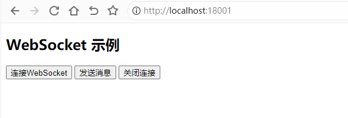
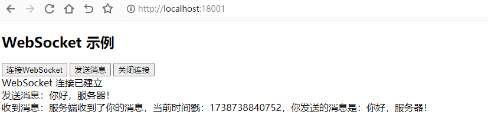
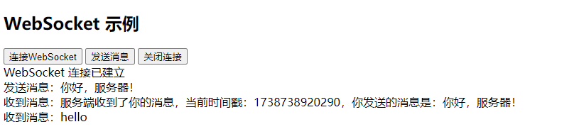
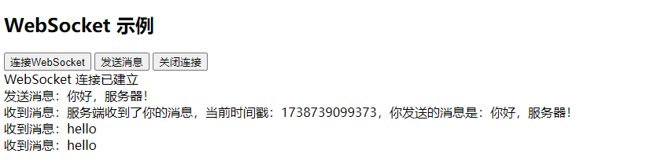
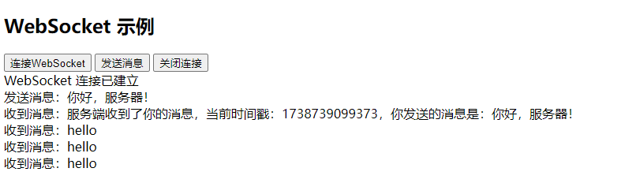
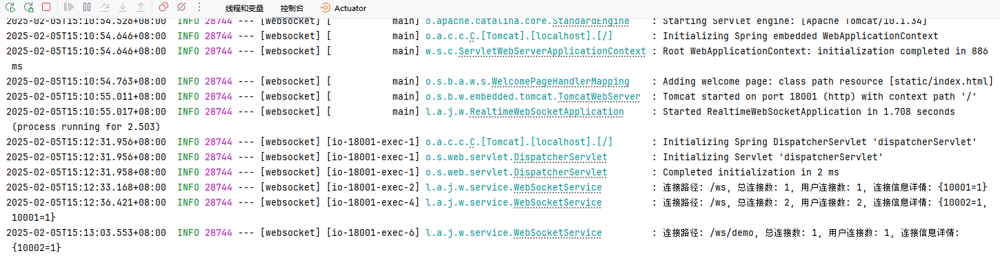
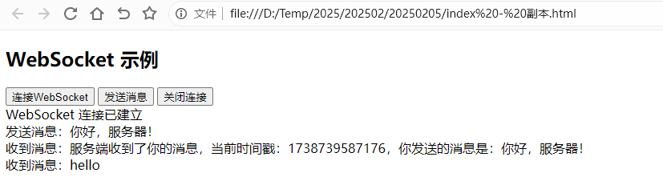

# WebSocket

WebSocket 是一种**全双工**通信协议，它允许服务器和客户端之间建立**持久化连接**，并且可以**实时**双向发送数据，而不需要像 HTTP 那样每次请求都要建立新的连接。

**特点**：

- **全双工通信**：服务器和客户端都可以主动推送消息。
- **低延迟**：相比 HTTP 轮询，WebSocket 只在建立连接时使用 HTTP 进行握手，后续通信使用 TCP，减少了带宽和延迟。
- **减少服务器压力**：减少了频繁的 HTTP 请求，适用于聊天室、实时股票推送、在线游戏等应用场景。


## 基础配置

### 添加依赖

编辑 `pom.xml` 添加 WebSocket 依赖

```xml
<!-- Spring Boot Starter for WebSocket -->
<dependency>
    <groupId>org.springframework.boot</groupId>
    <artifactId>spring-boot-starter-websocket</artifactId>
</dependency>
```

### 编辑配置文件

编辑 `application.yml` 配置文件

```yaml
server:
  port: 18001
  servlet:
    context-path: /
spring:
  main:
    web-application-type: servlet
  application:
    name: ${project.artifactId}
---
```

编辑 ` resources\static\index.html` ，后续调试WebSocket的一个页面

```html
<!DOCTYPE html>
<html lang="zh">
<head>
    <meta charset="UTF-8">
    <meta name="viewport" content="width=device-width, initial-scale=1.0">
    <title>WebSocket 示例</title>
</head>
<body>
<h2>WebSocket 示例</h2>
<button onclick="connect()">连接WebSocket</button>
<button onclick="sendMessage()">发送消息</button>
<button onclick="closeWebSocket()">关闭连接</button>
<div id="output"></div>

<script>
    let socket;

    function connect() {
        var token = "Admin@123";
        var userId = "10001";
        socket = new WebSocket("ws://localhost:18001/ws"+"?token=" + token+"&userId=" + userId);

        socket.onopen = function() {
            log("WebSocket 连接已建立");
        };

        socket.onmessage = function(event) {
            log("收到消息：" + event.data);
        };

        socket.onclose = function() {
            log("WebSocket 连接已关闭");
        };
    }

    function sendMessage() {
        if (socket && socket.readyState === WebSocket.OPEN) {
            socket.send("你好，服务器！");
            log("发送消息：你好，服务器！");
        } else {
            log("WebSocket 未连接");
        }
    }

    function closeWebSocket() {
        if (socket) {
            socket.close();
        }
    }

    function log(message) {
        document.getElementById("output").innerHTML += message + "<br>";
    }
</script>
</body>
</html>
```


## 配置WebSocket

### 配置WebSocketService

```java
package local.ateng.java.websocket.service;

import lombok.extern.slf4j.Slf4j;
import org.springframework.stereotype.Component;
import org.springframework.web.socket.TextMessage;
import org.springframework.web.socket.WebSocketSession;

import java.io.IOException;
import java.util.Map;
import java.util.Set;
import java.util.concurrent.ConcurrentHashMap;

/**
 * WebSocket服务类，用于管理WebSocket会话和消息发送。
 *
 * @author 孔余
 * @email 2385569970@qq.com
 * @since 2025-02-05
 */
@Component
@Slf4j
public class WebSocketService {

    // 存储 path -> (userId -> Set<WebSocketSession>)
    // 每个 path 下的每个 userId 可能有多个会话
    private final Map<String, Map<String, Set<WebSocketSession>>> sessionMap = new ConcurrentHashMap<>();

    /**
     * 添加 WebSocket 连接
     *
     * @param session WebSocket会话
     */
    public void addSession(WebSocketSession session) {
        // 从连接URL中获取参数
        String path = session.getUri().getPath();
        String token = getParamValueFromUrl(session.getUri().getQuery(), "token");
        String userId = getParamValueFromUrl(session.getUri().getQuery(), "userId");
        String sessionId = session.getId();
        // 获取路径下的所有用户会话
        sessionMap
                .computeIfAbsent(path, k -> new ConcurrentHashMap<>()) // 获取指定路径的用户会话 Map
                .computeIfAbsent(userId, k -> ConcurrentHashMap.newKeySet()) // 获取指定用户的会话 Set
                .add(session); // 将 WebSocketSession 添加到 Set 中
        // 打印连接信息日志
        logSessionInfo(path);
    }

    /**
     * 移除 WebSocket 连接
     *
     * @param session WebSocket会话
     */
    public void removeSession(WebSocketSession session) {
        // 从连接URL中获取参数
        String path = session.getUri().getPath();
        String token = getParamValueFromUrl(session.getUri().getQuery(), "token");
        String userId = getParamValueFromUrl(session.getUri().getQuery(), "userId");
        String sessionId = session.getId();
        Map<String, Set<WebSocketSession>> userSessionsMap = sessionMap.get(path);
        if (userSessionsMap != null) {
            Set<WebSocketSession> userSessions = userSessionsMap.get(userId);
            if (userSessions != null) {
                userSessions.removeIf(userSession -> userSession.getId().equals(sessionId));
                if (userSessions.isEmpty()) {
                    userSessionsMap.remove(userId); // 如果用户没有会话，移除该用户
                }
            }
            if (userSessionsMap.isEmpty()) {
                sessionMap.remove(path); // 如果路径下没有会话，移除路径
            }
        }
        // 打印连接信息日志
        logSessionInfo(path);
    }

    /**
     * 获取指定路径和用户的所有 WebSocket 会话
     *
     * @param path   路径
     * @param userId 用户ID
     * @return 用户的所有 WebSocket 会话
     */
    public Set<WebSocketSession> getSessionsByPathAndUserId(String path, String userId) {
        Map<String, Set<WebSocketSession>> userSessionsMap = sessionMap.get(path);
        return userSessionsMap != null ? userSessionsMap.getOrDefault(userId, Set.of()) : Set.of();
    }

    /**
     * 获取指定路径和多个用户列表的所有 WebSocket 会话
     *
     * @param path    路径
     * @param userIds 用户ID列表
     * @return 指定路径下多个用户的 WebSocket 会话集合
     */
    public Set<WebSocketSession> getSessionsByPathAndUserIds(String path, Set<String> userIds) {
        Set<WebSocketSession> allSessions = ConcurrentHashMap.newKeySet();
        Map<String, Set<WebSocketSession>> userSessionsMap = sessionMap.get(path);
        if (userSessionsMap != null) {
            for (String userId : userIds) {
                Set<WebSocketSession> userSessions = userSessionsMap.get(userId);
                if (userSessions != null) {
                    allSessions.addAll(userSessions); // 收集多个用户的会话
                }
            }
        }
        return allSessions;
    }

    /**
     * 获取指定路径下的所有 WebSocket 会话（适用于广播）
     *
     * @param path 路径
     * @return 路径下的所有 WebSocket 会话
     */
    public Set<WebSocketSession> getSessionsByPath(String path) {
        Map<String, Set<WebSocketSession>> userSessionsMap = sessionMap.get(path);
        Set<WebSocketSession> allSessions = ConcurrentHashMap.newKeySet();
        if (userSessionsMap != null) {
            for (Set<WebSocketSession> sessions : userSessionsMap.values()) {
                allSessions.addAll(sessions);
            }
        }
        return allSessions;
    }

    /**
     * 获取所有路径下的所有 WebSocket 会话
     *
     * @return 所有路径的 WebSocket 会话集合
     */
    public Set<WebSocketSession> getAllSessions() {
        Set<WebSocketSession> allSessions = ConcurrentHashMap.newKeySet();
        for (Map<String, Set<WebSocketSession>> userSessionsMap : sessionMap.values()) {
            for (Set<WebSocketSession> sessions : userSessionsMap.values()) {
                allSessions.addAll(sessions);
            }
        }
        return allSessions;
    }

    /**
     * 统计指定路径下的 WebSocket 连接信息
     * 返回一个包含路径下统计信息的 Map
     *
     * @param path 路径
     * @return 连接信息 Map
     */
    public Map<String, Object> getConnectionStatsByPath(String path) {
        Map<String, Object> stats = new ConcurrentHashMap<>();
        Map<String, Set<WebSocketSession>> userSessionsMap = sessionMap.get(path);

        int totalConnections = 0;  // 路径下的总连接数
        int totalUsers = 0;        // 路径下的用户数
        Map<String, Integer> userConnectionCounts = new ConcurrentHashMap<>(); // 用户连接数

        if (userSessionsMap != null) {
            // 获取路径下用户数
            totalUsers = userSessionsMap.size();

            // 直接遍历每个用户的会话，更新连接数
            for (Map.Entry<String, Set<WebSocketSession>> entry : userSessionsMap.entrySet()) {
                String userId = entry.getKey();
                Set<WebSocketSession> sessions = entry.getValue();
                int userSessionCount = sessions.size(); // 获取该用户的会话数量
                totalConnections += userSessionCount; // 累加总连接数
                userConnectionCounts.put(userId, userSessionCount); // 记录每个用户的连接数
            }
        }

        // 将统计信息放入 Map 中返回
        stats.put("totalConnections", totalConnections);
        stats.put("totalUsers", totalUsers);
        stats.put("userConnectionCounts", userConnectionCounts);

        return stats;
    }


    /**
     * 记录会话信息的方法。
     */
    public void logSessionInfo(String path) {
        Map<String, Object> stats = getConnectionStatsByPath(path);
        log.info("连接路径: {}, 总连接数: {}, 用户连接数: {}, 连接信息详情: {}", path, stats.get("totalConnections"), stats.get("totalUsers"), stats.get("userConnectionCounts"));
    }

    /**
     * 发送消息给所有连接的客户端（广播）
     *
     * @param path    请求路径
     * @param message 要发送的消息
     */
    public void sendToAll(String path, String message) {
        Set<WebSocketSession> sessionSet = getSessionsByPath(path);
        for (WebSocketSession session : sessionSet) {
            sendMessageIfSessionOpen(session, message);
        }
    }

    /**
     * 发送消息给群组（群发）
     *
     * @param path    请求路径
     * @param userIds 用户组ID
     * @param message 要发送的消息
     */
    public void sendToGroup(String path, Set<String> userIds, String message) {
        Set<WebSocketSession> sessionSet = getSessionsByPathAndUserIds(path, userIds);
        for (WebSocketSession session : sessionSet) {
            sendMessageIfSessionOpen(session, message);
        }
    }

    /**
     * 发送消息给指定用户（点对点）
     *
     * @param path    请求路径
     * @param userId  用户ID
     * @param message 要发送的消息
     */
    public void sendToUser(String path, String userId, String message) {
        Set<WebSocketSession> sessionSet = getSessionsByPathAndUserId(path, userId);
        for (WebSocketSession session : sessionSet) {
            sendMessageIfSessionOpen(session, message);
        }
    }

    /**
     * 如果会话是打开状态，则向会话发送消息。
     *
     * @param session WebSocket会话
     * @param message 要发送的消息
     */
    private void sendMessageIfSessionOpen(WebSocketSession session, String message) {
        if (session != null && session.isOpen()) {
            try {
                session.sendMessage(new TextMessage(message));
            } catch (IOException e) {
                log.error("发送消息失败: {}", e.getMessage());
            }
        }
    }

    /**
     * 从URL中获取参数值的方法。
     *
     * @param query     URL查询字符串
     * @param paramName 参数名称
     * @return 参数值，如果参数不存在则返回null
     */
    private String getParamValueFromUrl(String query, String paramName) {
        if (query != null) {
            String[] params = query.split("&");
            for (String param : params) {
                String[] keyValue = param.split("=");
                if (keyValue.length == 2 && paramName.equals(keyValue[0])) {
                    return keyValue[1];
                }
            }
        }
        return null;
    }
}
```

### 配置WebSocketHandler

```java
package local.ateng.java.websocket.handler;

import local.ateng.java.websocket.service.WebSocketService;
import lombok.RequiredArgsConstructor;
import org.springframework.beans.factory.annotation.Autowired;
import org.springframework.stereotype.Component;
import org.springframework.web.socket.CloseStatus;
import org.springframework.web.socket.TextMessage;
import org.springframework.web.socket.WebSocketSession;
import org.springframework.web.socket.handler.TextWebSocketHandler;

/**
 * WebSocket处理器，用于处理WebSocket连接的建立、消息的接收和发送，以及连接的关闭。
 *
 * @author 孔余
 * @email 2385569970@qq.com
 * @since 2025-02-05
 */
@Component
@RequiredArgsConstructor(onConstructor = @__(@Autowired))
public class MyWebSocketHandler extends TextWebSocketHandler {
    private final WebSocketService webSocketService;

    /**
     * 当WebSocket连接建立后调用的方法。
     *
     * @param session 当前WebSocket会话
     * @throws Exception 如果发生错误
     */
    @Override
    public void afterConnectionEstablished(WebSocketSession session) throws Exception {
        // 将会话添加到WebSocketService中管理
        webSocketService.addSession(session);
    }

    /**
     * 处理收到的文本消息。
     *
     * @param session 当前WebSocket会话
     * @param message 收到的文本消息
     * @throws Exception 如果发生错误
     */
    @Override
    protected void handleTextMessage(WebSocketSession session, TextMessage message) throws Exception {
        // 获取消息内容
        String payload = message.getPayload();
        // 返回消息
        session.sendMessage(new TextMessage("服务端收到了你的消息，当前时间戳：" + System.currentTimeMillis() + "，你发送的消息是：" + payload));
    }

    /**
     * 当WebSocket连接关闭后调用的方法。
     *
     * @param session 当前WebSocket会话
     * @param status  关闭状态
     * @throws Exception 如果发生错误
     */
    @Override
    public void afterConnectionClosed(WebSocketSession session, CloseStatus status) throws Exception {
        // 从WebSocketService中移除关闭的会话
        webSocketService.removeSession(session);
    }

}
```

### 配置WebSocketConfig

```java
package local.ateng.java.websocket.config;

import local.ateng.java.websocket.handler.MyWebSocketHandler;
import lombok.RequiredArgsConstructor;
import org.springframework.beans.factory.annotation.Autowired;
import org.springframework.context.annotation.Configuration;
import org.springframework.web.socket.config.annotation.EnableWebSocket;
import org.springframework.web.socket.config.annotation.WebSocketConfigurer;
import org.springframework.web.socket.config.annotation.WebSocketHandlerRegistry;

@Configuration
@EnableWebSocket
@RequiredArgsConstructor(onConstructor = @__(@Autowired))
public class WebSocketConfig implements WebSocketConfigurer {
    private final MyWebSocketHandler myWebSocketHandler;

    @Override
    public void registerWebSocketHandlers(WebSocketHandlerRegistry registry) {
        // /ws路径的WebSocket
        registry.addHandler(myWebSocketHandler, "/ws").setAllowedOrigins("*");
    }
}
```

### 配置WebSocketController

```java
package local.ateng.java.websocket.controller;

import local.ateng.java.websocket.service.WebSocketService;
import lombok.RequiredArgsConstructor;
import org.springframework.beans.factory.annotation.Autowired;
import org.springframework.web.bind.annotation.GetMapping;
import org.springframework.web.bind.annotation.RequestMapping;
import org.springframework.web.bind.annotation.RestController;

import java.util.HashSet;
import java.util.List;

@RestController
@RequestMapping("/ws")
@RequiredArgsConstructor(onConstructor = @__(@Autowired))
public class WebSocketController {
    private final WebSocketService webSocketService;

    @GetMapping("/sendToAll")
    public void sendToAll(String path, String message) {
        webSocketService.sendToAll(path, message);
    }

    @GetMapping("/sendToGroup")
    public void sendToGroup(String path, String userIds, String message) {
        webSocketService.sendToGroup(path, new HashSet<>(List.of(userIds.split(","))), message);
    }

    @GetMapping("/sendToUser")
    public void sendToUser(String path, String userId, String message) {
        webSocketService.sendToUser(path, userId, message);
    }
}
```


## 使用WebSocket

### 访问页面

浏览器打开 http://localhost:18001/ 进入WebSocket测试页面



点击 `连接WebSocket` 按钮，再点击 `发送消息`，效果如下图所示：



### 发送点对点消息

访问接口：http://localhost:18001/ws/sendToUser?path=/ws&userId=10001&message=hello



### 发送点对多点（组播）消息

访问接口：http://localhost:18001/ws/sendToGroup?path=/ws&userIds=10001,10002&message=hello



### 发送所有用户（广播）消息

访问接口：http://localhost:18001/ws/sendToAll?path=/ws&message=hello



## 添加多个路径

### 编辑WebSocketConfig

使用registry再添加一个路径

```java
// /ws/demo路径的WebSocket
registry.addHandler(myWebSocketHandler, "/ws/demo").setAllowedOrigins("*");
```

完整代码如下：

```java
package local.ateng.java.websocket.config;

import local.ateng.java.websocket.handler.MyWebSocketHandler;
import lombok.RequiredArgsConstructor;
import org.springframework.beans.factory.annotation.Autowired;
import org.springframework.context.annotation.Configuration;
import org.springframework.web.socket.config.annotation.EnableWebSocket;
import org.springframework.web.socket.config.annotation.WebSocketConfigurer;
import org.springframework.web.socket.config.annotation.WebSocketHandlerRegistry;

@Configuration
@EnableWebSocket
@RequiredArgsConstructor(onConstructor = @__(@Autowired))
public class WebSocketConfig implements WebSocketConfigurer {
    private final MyWebSocketHandler myWebSocketHandler;

    @Override
    public void registerWebSocketHandlers(WebSocketHandlerRegistry registry) {
        // /ws路径的WebSocket
        registry.addHandler(myWebSocketHandler, "/ws").setAllowedOrigins("*");
        // /ws/demo路径的WebSocket
        registry.addHandler(myWebSocketHandler, "/ws/demo").setAllowedOrigins("*");
    }
}
```

### 使用新路径

复制 `index.html` 文件修改其中的路径为/ws/demo，如下：

```html
socket = new WebSocket("ws://localhost:18001/ws/demo"+"?token=" + token+"&userId=" + userId);
```

调用接口发送消息：http://localhost:18001/ws/sendToAll?path=/ws/demo&message=hello






## 配置认证

配置WebSocketService中的addSession，添加认证相关的代码

token效验方法

```java
/**
 * 校验token是否有效的方法。
 *
 * @param token 要校验的token
 * @return 校验结果，true表示有效，false表示无效
 */
private boolean isValidToken(String token) {
    // 实际应用中应根据具体逻辑进行校验
    return "Admin@123".equals(token);
}
```

在addSession中效验token

```java
/**
 * 添加 WebSocket 连接
 *
 * @param session WebSocket会话
 */
public void addSession(WebSocketSession session) {
    // 从连接URL中获取参数
    String path = session.getUri().getPath();
    String token = getParamValueFromUrl(session.getUri().getQuery(), "token");
    String userId = getParamValueFromUrl(session.getUri().getQuery(), "userId");
    String sessionId = session.getId();
    // 校验token是否有效
    if (!isValidToken(token)) {
        // 如果token无效，则发送消息给客户端，并关闭连接
        try {
            session.sendMessage(new TextMessage("token校验不通过"));
            session.close();
        } catch (IOException e) {
            e.printStackTrace();
        }
        log.error("WebSocket: token校验不通过, path: {}, userId: {}", path, userId);
        return;
    }
    // 获取路径下的所有用户会话
    sessionMap
            .computeIfAbsent(path, k -> new ConcurrentHashMap<>()) // 获取指定路径的用户会话 Map
            .computeIfAbsent(userId, k -> ConcurrentHashMap.newKeySet()) // 获取指定用户的会话 Set
            .add(session); // 将 WebSocketSession 添加到 Set 中
    // 打印连接信息日志
    logSessionInfo(path);
}
```

