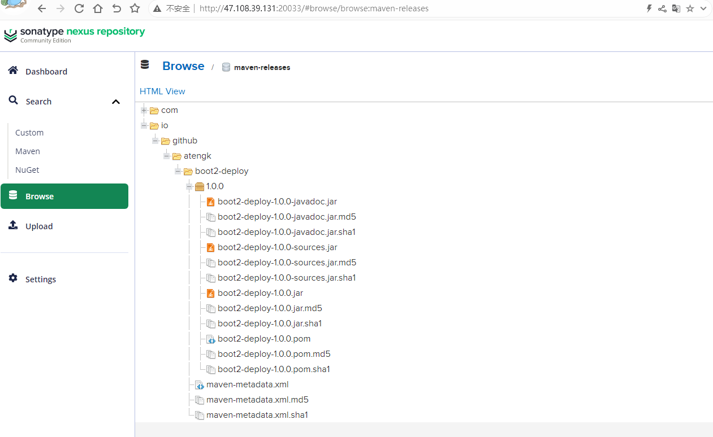
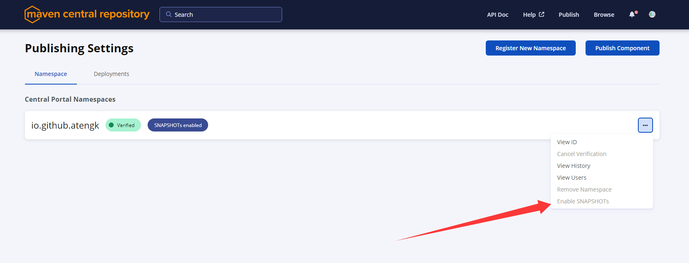
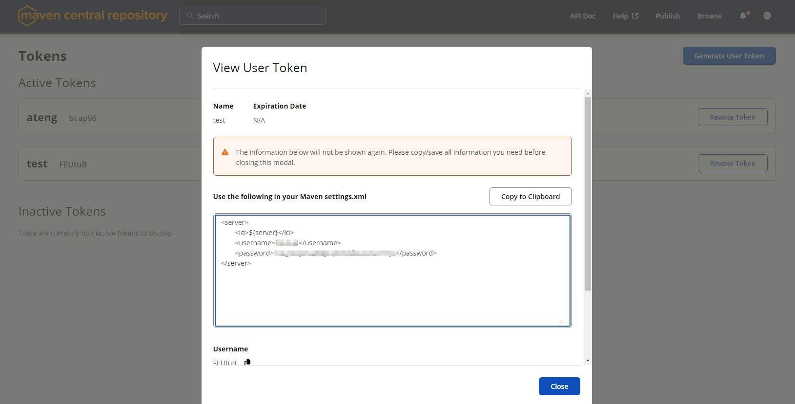
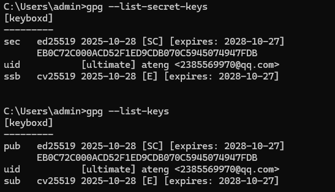

# 发布到 Maven 仓库

**开发一个可复用的 Spring Boot Starter 插件**，然后 **发布到 Maven 仓库**（私服或中央仓库），最后 **在其他 Spring Boot 项目中引入使用**。


## Maven配置

```xml
<?xml version="1.0" encoding="UTF-8"?>
<project xmlns:xsi="http://www.w3.org/2001/XMLSchema-instance" xmlns="http://maven.apache.org/POM/4.0.0"
         xsi:schemaLocation="http://maven.apache.org/POM/4.0.0 https://maven.apache.org/xsd/maven-4.0.0.xsd">
    <!-- 项目模型版本 -->
    <modelVersion>4.0.0</modelVersion>

    <!-- 项目坐标 -->
    <groupId>io.github.atengk</groupId>
    <artifactId>boot2-deploy</artifactId>
    <version>1.0.0</version>
    <name>boot2-deploy</name>
    <description>SpringBoot2 发布到仓库 模块</description>

    <!-- 项目属性 -->
    <properties>
        <java.version>8</java.version>
        <project.build.sourceEncoding>UTF-8</project.build.sourceEncoding>
        <project.reporting.outputEncoding>UTF-8</project.reporting.outputEncoding>
        <spring.boot.version>2.7.18</spring.boot.version>
        <maven-compiler.version>3.12.1</maven-compiler.version>
        <lombok.version>1.18.36</lombok.version>
    </properties>

    <!-- 项目依赖 -->
    <dependencies>
        <!-- Spring Boot Auto Configuration -->
        <dependency>
            <groupId>org.springframework.boot</groupId>
            <artifactId>spring-boot-autoconfigure</artifactId>
            <version>${spring.boot.version}</version>
        </dependency>

        <!-- Optional: 如果需要用到 Spring Boot 核心功能 -->
        <dependency>
            <groupId>org.springframework.boot</groupId>
            <artifactId>spring-boot</artifactId>
            <version>${spring.boot.version}</version>
            <scope>provided</scope>
        </dependency>

        <!-- Lombok: 简化Java代码编写的依赖项 -->
        <!-- https://mvnrepository.com/artifact/org.projectlombok/lombok -->
        <dependency>
            <groupId>org.projectlombok</groupId>
            <artifactId>lombok</artifactId>
            <version>${lombok.version}</version>
            <scope>provided</scope>
        </dependency>

        <!-- 你的业务依赖 -->
        <!-- ... -->
    </dependencies>

    <!-- Spring Boot 依赖管理 -->
    <dependencyManagement>
        <dependencies>
            <dependency>
                <groupId>org.springframework.boot</groupId>
                <artifactId>spring-boot-dependencies</artifactId>
                <version>${spring.boot.version}</version>
                <type>pom</type>
                <scope>import</scope>
            </dependency>
        </dependencies>
    </dependencyManagement>

    <!-- 普通仓库配置 -->
    <repositories>
        <!-- 阿里云中央仓库 -->
        <repository>
            <id>aliyun-central</id>
            <name>阿里云中央仓库</name>
            <url>https://maven.aliyun.com/repository/central</url>
        </repository>

        <!-- 官方中央仓库 -->
        <repository>
            <id>central</id>
            <name>Maven Central</name>
            <url>https://repo.maven.apache.org/maven2/</url>
        </repository>
    </repositories>

    <!-- 构建配置 -->
    <build>
        <plugins>
            <!-- 编译 JAR -->
            <plugin>
                <groupId>org.apache.maven.plugins</groupId>
                <artifactId>maven-compiler-plugin</artifactId>
                <version>3.14.1</version>
                <configuration>
                    <source>${java.version}</source>
                    <target>${java.version}</target>
                </configuration>
            </plugin>

            <!-- 打包源码 -->
            <plugin>
                <groupId>org.apache.maven.plugins</groupId>
                <artifactId>maven-source-plugin</artifactId>
                <version>3.3.1</version>
                <executions>
                    <execution>
                        <id>attach-sources</id>
                        <goals>
                            <goal>jar</goal>
                        </goals>
                    </execution>
                </executions>
            </plugin>

            <!-- javadoc插件 -->
            <plugin>
                <groupId>org.apache.maven.plugins</groupId>
                <artifactId>maven-javadoc-plugin</artifactId>
                <version>3.12.0</version>
                <executions>
                    <execution>
                        <id>attach-javadocs</id>
                        <goals>
                            <goal>jar</goal>
                        </goals>
                    </execution>
                </executions>
                <configuration>
                    <source>${java.version}</source>
                    <encoding>${project.build.sourceEncoding}</encoding>
                    <failOnError>false</failOnError>
                </configuration>
            </plugin>

            <!-- JAR 签名、发布 -->
            <plugin>
                <groupId>org.apache.maven.plugins</groupId>
                <artifactId>maven-deploy-plugin</artifactId>
                <version>3.1.4</version>
            </plugin>
        </plugins>
    </build>
</project>
```

## 编写自动配置类

### 业务配置类

接口服务

```java
package io.github.atengk.service;

import java.util.Map;

/**
 * 阿腾服务接口类
 *
 * @author 孔余
 * @since 2025-10-28
 */
public interface AtengService {

    /**
     * Hello
     * @return 欢迎语
     */
    String hello();

    /**
     * 获取系统环境变量
     *
     * @return 以Map返回所有环境变量
     */
    Map<String, String> getEnv();

}

```

服务实现

```java
package io.github.atengk.service.impl;

import io.github.atengk.service.AtengService;

import java.util.Map;

public class AtengServiceImpl implements AtengService {
    @Override
    public String hello() {
        return "Hello from Ateng！";
    }

    @Override
    public Map<String, String> getEnv() {
        return System.getenv();
    }
}

```


### 自动配置类

```java
package io.github.atengk.config;

import io.github.atengk.service.AtengService;
import io.github.atengk.service.impl.AtengServiceImpl;
import org.springframework.boot.autoconfigure.AutoConfiguration;
import org.springframework.context.annotation.Bean;

@AutoConfiguration
public class AtengAutoConfiguration {

    @Bean
    public AtengService atengService() {
        return new AtengServiceImpl();
    }

}

```


## 注册自动配置

添加文件

```
src/main/resources/META-INF/spring.factories
```

内容

```
org.springframework.boot.autoconfigure.EnableAutoConfiguration=\
io.github.atengk.config.AtengAutoConfiguration
```

多个配置示例

```
org.springframework.boot.autoconfigure.EnableAutoConfiguration=\
io.github.atengk.config.AtengAutoConfiguration,\
io.github.atengk.config.RedisAutoConfiguration,\
io.github.atengk.config.WebMvcAutoConfiguration
```

以上是springboot2的做法，springboot3的配置示例如下：

```
META-INF/spring/org.springframework.boot.autoconfigure.AutoConfiguration.imports
com.example.autoconfig.MyAutoConfiguration
```


## 本地发布（Install）

Maven 提供了 `install` 命令，把包发布到 **本地仓库**（默认路径 `~/.m2/repository`）：

```
mvn clean install
```

在其他项目需要依赖你刚刚 install 的模块：

```
<dependency>
    <groupId>io.github.atengk</groupId>
    <artifactId>boot2-deploy</artifactId>
    <version>1.0.0</version>
</dependency>
```

然后在项目中执行：

```
mvn clean compile
```

Maven 会从 **本地仓库**（`~/.m2/repository`）找到 SNAPSHOT 或 Release 包。


## 发布到 Nexus3 / 私服

Nexus3 安装参考文档：[链接](https://atengk.github.io/ops/#/work/docker/service/nexus/)

### 上传

#### 仓库配置

在 Maven 的`settings.xml` 中配置私服账号：

```xml
  <servers>
    <!-- nexus3 本地私有正式版发布仓库  -->
    <server>
        <id>nexus-local-release</id>
        <username>admin</username>
        <password>Admin@123</password>
    </server>

    <!-- nexus3 本地私有快照版发布仓库  -->
    <server>
        <id>nexus-local-snapshot</id>
        <username>admin</username>
        <password>Admin@123</password>
    </server>
  </servers>
```

然后在 `pom.xml` 添加，注意仓库的id要和上面servers.server配置的id一致

```xml
    <!--
    发布到 Maven 仓库（如 Nexus）的配置：
    用于区分发布版（release）和快照版（snapshot）上传地址
    -->
    <distributionManagement>

        <!-- Nexus3 本地发布版仓库（稳定版本，版本号不带 -SNAPSHOT） -->
        <repository>
            <id>nexus-local-release</id> <!-- 与 settings.xml 中的 server id 对应 -->
            <url>http://47.108.39.131:20033/repository/maven-releases/</url>
        </repository>

        <!-- Nexus3 本地快照版仓库（开发中版本，版本号带 -SNAPSHOT） -->
        <snapshotRepository>
            <id>nexus-local-snapshot</id> <!-- 与 settings.xml 中的 server id 对应 -->
            <url>http://47.108.39.131:20033/repository/maven-snapshots/</url>
        </snapshotRepository>

    </distributionManagement>
```

#### 插件配置

```xml
            <!-- 编译 JAR -->
            <plugin>
                <groupId>org.apache.maven.plugins</groupId>
                <artifactId>maven-compiler-plugin</artifactId>
                <version>3.14.1</version>
                <configuration>
                    <source>${java.version}</source>
                    <target>${java.version}</target>
                </configuration>
            </plugin>

            <!-- 打包源码 -->
            <plugin>
                <groupId>org.apache.maven.plugins</groupId>
                <artifactId>maven-source-plugin</artifactId>
                <version>3.3.1</version>
                <executions>
                    <execution>
                        <id>attach-sources</id>
                        <goals>
                            <goal>jar</goal>
                        </goals>
                    </execution>
                </executions>
            </plugin>

            <!-- javadoc插件 -->
            <plugin>
                <groupId>org.apache.maven.plugins</groupId>
                <artifactId>maven-javadoc-plugin</artifactId>
                <version>3.12.0</version>
                <executions>
                    <execution>
                        <id>attach-javadocs</id>
                        <goals>
                            <goal>jar</goal>
                        </goals>
                    </execution>
                </executions>
                <configuration>
                    <source>${java.version}</source>
                    <encoding>${project.build.sourceEncoding}</encoding>
                    <failOnError>false</failOnError>
                </configuration>
            </plugin>

            <!-- JAR 签名、发布 -->
            <plugin>
                <groupId>org.apache.maven.plugins</groupId>
                <artifactId>maven-deploy-plugin</artifactId>
                <version>3.1.4</version>
            </plugin>
```


#### 完整 pom.xml

```xml
<?xml version="1.0" encoding="UTF-8"?>
<project xmlns:xsi="http://www.w3.org/2001/XMLSchema-instance" xmlns="http://maven.apache.org/POM/4.0.0"
         xsi:schemaLocation="http://maven.apache.org/POM/4.0.0 https://maven.apache.org/xsd/maven-4.0.0.xsd">
    <!-- 项目模型版本 -->
    <modelVersion>4.0.0</modelVersion>

    <!-- 项目坐标 -->
    <groupId>io.github.atengk</groupId>
    <artifactId>boot2-deploy</artifactId>
    <version>1.0.2</version>
    <name>boot2-deploy</name>
    <description>SpringBoot2 发布到仓库 模块</description>

    <!-- 项目属性 -->
    <properties>
        <java.version>8</java.version>
        <project.build.sourceEncoding>UTF-8</project.build.sourceEncoding>
        <project.reporting.outputEncoding>UTF-8</project.reporting.outputEncoding>
        <spring.boot.version>2.7.18</spring.boot.version>
        <maven-compiler.version>3.12.1</maven-compiler.version>
        <lombok.version>1.18.36</lombok.version>
    </properties>

    <!-- 项目依赖 -->
    <dependencies>
        <!-- Spring Boot Auto Configuration -->
        <dependency>
            <groupId>org.springframework.boot</groupId>
            <artifactId>spring-boot-autoconfigure</artifactId>
            <version>${spring.boot.version}</version>
        </dependency>

        <!-- Optional: 如果需要用到 Spring Boot 核心功能 -->
        <dependency>
            <groupId>org.springframework.boot</groupId>
            <artifactId>spring-boot</artifactId>
            <version>${spring.boot.version}</version>
            <scope>provided</scope>
        </dependency>

        <!-- Lombok: 简化Java代码编写的依赖项 -->
        <!-- https://mvnrepository.com/artifact/org.projectlombok/lombok -->
        <dependency>
            <groupId>org.projectlombok</groupId>
            <artifactId>lombok</artifactId>
            <version>${lombok.version}</version>
            <scope>provided</scope>
        </dependency>

        <!-- 你的业务依赖 -->
        <!-- ... -->
    </dependencies>

    <!-- Spring Boot 依赖管理 -->
    <dependencyManagement>
        <dependencies>
            <dependency>
                <groupId>org.springframework.boot</groupId>
                <artifactId>spring-boot-dependencies</artifactId>
                <version>${spring.boot.version}</version>
                <type>pom</type>
                <scope>import</scope>
            </dependency>
        </dependencies>
    </dependencyManagement>

    <!-- 普通仓库配置 -->
    <repositories>
        <!-- 阿里云中央仓库 -->
        <repository>
            <id>aliyun-central</id>
            <name>阿里云中央仓库</name>
            <url>https://maven.aliyun.com/repository/central</url>
        </repository>

        <!-- 官方中央仓库 -->
        <repository>
            <id>central</id>
            <name>Maven Central</name>
            <url>https://repo.maven.apache.org/maven2/</url>
        </repository>
    </repositories>

    <!--
    发布到 Maven 仓库（如 Nexus）的配置：
    用于区分发布版（release）和快照版（snapshot）上传地址
    -->
    <distributionManagement>

        <!-- Nexus3 本地发布版仓库（稳定版本，版本号不带 -SNAPSHOT） -->
        <repository>
            <id>nexus-local-release</id> <!-- 与 settings.xml 中的 server id 对应 -->
            <url>http://47.108.39.131:20033/repository/maven-releases/</url>
        </repository>

        <!-- Nexus3 本地快照版仓库（开发中版本，版本号带 -SNAPSHOT） -->
        <snapshotRepository>
            <id>nexus-local-snapshot</id> <!-- 与 settings.xml 中的 server id 对应 -->
            <url>http://47.108.39.131:20033/repository/maven-snapshots/</url>
        </snapshotRepository>

    </distributionManagement>

    <!-- 构建配置 -->
    <build>
        <plugins>
            <!-- 编译 JAR -->
            <plugin>
                <groupId>org.apache.maven.plugins</groupId>
                <artifactId>maven-compiler-plugin</artifactId>
                <version>3.14.1</version>
                <configuration>
                    <source>${java.version}</source>
                    <target>${java.version}</target>
                </configuration>
            </plugin>

            <!-- 打包源码 -->
            <plugin>
                <groupId>org.apache.maven.plugins</groupId>
                <artifactId>maven-source-plugin</artifactId>
                <version>3.3.1</version>
                <executions>
                    <execution>
                        <id>attach-sources</id>
                        <goals>
                            <goal>jar</goal>
                        </goals>
                    </execution>
                </executions>
            </plugin>

            <!-- javadoc插件 -->
            <plugin>
                <groupId>org.apache.maven.plugins</groupId>
                <artifactId>maven-javadoc-plugin</artifactId>
                <version>3.12.0</version>
                <executions>
                    <execution>
                        <id>attach-javadocs</id>
                        <goals>
                            <goal>jar</goal>
                        </goals>
                    </execution>
                </executions>
                <configuration>
                    <source>${java.version}</source>
                    <encoding>${project.build.sourceEncoding}</encoding>
                    <failOnError>false</failOnError>
                </configuration>
            </plugin>

            <!-- JAR 签名、发布 -->
            <plugin>
                <groupId>org.apache.maven.plugins</groupId>
                <artifactId>maven-deploy-plugin</artifactId>
                <version>3.1.4</version>
            </plugin>
        </plugins>
    </build>
</project>
```

#### 上传到仓库

上传命令：

```bash
mvn clean deploy
```

或者使用 IDEA 的 Maven 插件：clean + deploy


上传后在 Nexus3 查看依赖



#### 后续发布

**正式版本发布**

后续再次发布需要修改版本号version，如果版本号已存在会发布失败。

```xml
    <groupId>io.github.atengk</groupId>
    <artifactId>boot2-deploy</artifactId>
    <version>1.0.2</version>
```

**快照版本发布**

快照版本发布版本号version必须要加上 `-SNAPSHOT` 后缀

```xml
    <groupId>io.github.atengk</groupId>
    <artifactId>boot2-deploy</artifactId>
    <version>1.0.2-SNAPSHOT</version>
```


### 使用

使用端从 Nexus 拉取依赖

#### 仓库配置

在 Maven 的`settings.xml` 中配置私服账号：

```xml
  <servers>
    <!-- nexus3 本地私有正式版发布仓库  -->
    <server>
        <id>nexus-local-release</id>
        <username>admin</username>
        <password>Admin@123</password>
    </server>

    <!-- nexus3 本地私有快照版发布仓库  -->
    <server>
        <id>nexus-local-snapshot</id>
        <username>admin</username>
        <password>Admin@123</password>
    </server>
  </servers>
```

在项目的 `pom.xml`，注意仓库的id要和上面servers.server配置的id一致

```xml
    <!-- 普通仓库配置 -->
    <repositories>
        <!-- Nexus3 本地发布版仓库 -->
        <repository>
            <id>nexus-local-release</id>
            <url>http://47.108.39.131:20033/repository/maven-releases/</url>
        </repository>

        <!-- Nexus3 本地快照版仓库 -->
        <repository>
            <id>nexus-local-snapshot</id>
            <url>http://47.108.39.131:20033/repository/maven-snapshots/</url>
            <releases>
                <enabled>false</enabled>
            </releases>
            <snapshots>
                <enabled>true</enabled>
            </snapshots>
        </repository>

        <!-- 阿里云中央仓库 -->
        <repository>
            <id>aliyun-central</id>
            <name>阿里云中央仓库</name>
            <url>https://maven.aliyun.com/repository/central</url>
        </repository>

        <!-- 官方中央仓库 -->
        <repository>
            <id>central</id>
            <name>Maven Central</name>
            <url>https://repo.maven.apache.org/maven2/</url>
        </repository>
    </repositories>

```

💡 Maven 会按顺序依次尝试下载依赖。
 如果 Nexus 仓库中没有，就会自动去阿里云仓库拉取。

#### 使用

添加依赖

```xml
<dependency>
    <groupId>io.github.atengk</groupId>
    <artifactId>boot2-deploy</artifactId>
    <version>1.0.2</version>
</dependency>
```


## 发布到 Maven Central

### 生成Token

**登录账号**

https://central.sonatype.com/

**注册Namespace**

https://central.sonatype.com/publishing/namespaces

创建Namespace


验证Namespace，在Github上创建指定的仓库，然后`Confirm` 确认


开启 `SNAPSHOTs`，最终如下图所示




**生成Token**

https://central.sonatype.com/usertoken



将生成的Token配置在Maven settings.xml的servers中

```xml
  <servers>

    <!-- Maven Central 仓库 -->
    <server>
        <id>maven-central</id>
        <username>bLapxx</username>
        <password>xRovbvyzl2WDD1upt3qaMS3OF0FDExxxx</password>
    </server>

  </servers>
```


### 安装 GPG 并配置

下载软件并安装

https://www.gpg4win.org/

如果是新安装的，记得重新IDEA加载环境变量

```
C:\Users\admin>gpg --version
gpg (GnuPG) 2.4.8
libgcrypt 1.11.1
Copyright (C) 2025 g10 Code GmbH
License GNU GPL-3.0-or-later <https://gnu.org/licenses/gpl.html>
This is free software: you are free to change and redistribute it.
There is NO WARRANTY, to the extent permitted by law.

Home: C:\Users\admin\AppData\Roaming\gnupg
Supported algorithms:
Pubkey: RSA, ELG, DSA, ECDH, ECDSA, EDDSA
Cipher: IDEA, 3DES, CAST5, BLOWFISH, AES, AES192, AES256, TWOFISH,
        CAMELLIA128, CAMELLIA192, CAMELLIA256
Hash: SHA1, RIPEMD160, SHA256, SHA384, SHA512, SHA224
Compression: Uncompressed, ZIP, ZLIB, BZIP2
```

生成密钥，注意会提示输入口令，设置你的口令后续需要使用

```
C:\Users\admin>gpg --gen-key
gpg (GnuPG) 2.4.8; Copyright (C) 2025 g10 Code GmbH
This is free software: you are free to change and redistribute it.
There is NO WARRANTY, to the extent permitted by law.

Note: Use "gpg --full-generate-key" for a full featured key generation dialog.

GnuPG needs to construct a user ID to identify your key.

Real name: ateng
Email address: 2385569970@qq.com
You selected this USER-ID:
    "ateng <2385569970@qq.com>"

Change (N)ame, (E)mail, or (O)kay/(Q)uit? o
We need to generate a lot of random bytes. It is a good idea to perform
some other action (type on the keyboard, move the mouse, utilize the
disks) during the prime generation; this gives the random number
generator a better chance to gain enough entropy.
We need to generate a lot of random bytes. It is a good idea to perform
some other action (type on the keyboard, move the mouse, utilize the
disks) during the prime generation; this gives the random number
generator a better chance to gain enough entropy.
gpg: C:\\Users\\admin\\AppData\\Roaming\\gnupg\\trustdb.gpg: trustdb created
gpg: directory 'C:\\Users\\admin\\AppData\\Roaming\\gnupg\\openpgp-revocs.d' created
gpg: revocation certificate stored as 'C:\\Users\\admin\\AppData\\Roaming\\gnupg\\openpgp-revocs.d\\EB0C72C000ACD52F1ED9CDB070C5945074947FDB.rev'
public and secret key created and signed.

pub   ed25519 2025-10-28 [SC] [expires: 2028-10-27]
      EB0C72C000ACD52F1ED9CDB070C5945074947FDB
uid                      ateng <2385569970@qq.com>
sub   cv25519 2025-10-28 [E] [expires: 2028-10-27]
```

并在 Maven settings.xml 中配置，如果 GPG 的口令不想配置在文件中，可以使用 `MAVEN_GPG_PASSPHRASE` 环境变量

```xml
  <servers>
    <!--  GPG 口令 -->
    <server>
        <id>gpg.passphrase</id>
        <passphrase>Admin@123</passphrase>
    </server>
	
  </servers>

    <profiles>
        <profile>
            <!-- Profile 名称（可在命令行用 -P release 指定） -->
            <id>release</id>

            <properties>
                <!-- GPG 可执行文件（一般保持默认） -->
                <gpg.executable>gpg</gpg.executable>

                <!-- GPG 密钥名（对应你的 key ID） -->
                <gpg.keyname>EB0C72C000ACD52F1ED9CDB070C5945074947FDB</gpg.keyname>
            </properties>
        </profile>
    </profiles>

    <activeProfiles>
        <!-- 默认激活 release profile，无需手动加 -P -->
        <activeProfile>release</activeProfile>
    </activeProfiles>

```

查看秘钥

```
gpg --list-keys        # 查看公钥
gpg --list-secret-keys # 查看私钥
```



查看你的 GPG key

```
gpg --list-keys
```

输出类似：

```
pub   rsa4096 2023-07-16 [SC]
      1234ABCD5678EF90123456789ABCDEF012345678
uid           [ultimate] atengk <your_email@example.com>
sub   rsa4096 2023-07-16 [E]
```

- 其中那串长长的 **`1234ABCD5678...`** 就是你的 key fingerprint（指纹）。
- 确认这就是你在打包签名时用的那把 key。

上传公钥到公共 PGP 服务器

```
# 推荐上传到 Ubuntu keyserver
gpg --keyserver keyserver.ubuntu.com --send-keys 1234ABCD5678EF90123456789ABCDEF012345678

# 或上传到 keys.openpgp.org
gpg --keyserver hkps://keys.openpgp.org --send-keys 1234ABCD5678EF90123456789ABCDEF012345678
```

> ⚠️ 注意：
>
> - `1234ABCD5678...` 请替换成你自己的 key 指纹。
> - 如果你用 `keys.openpgp.org`，第一次可能需要到邮箱确认（因为它要求验证邮件地址）。

验证公钥是否已成功上传

```
gpg --keyserver keyserver.ubuntu.com --recv-keys 1234ABCD5678EF90123456789ABCDEF012345678
```

如果能成功拉取，说明上传生效。
 过几分钟后 Maven Central 那边就能识别到了。

### 配置项目 pom.xml

#### 基本信息配置

```xml
    <!-- 项目模型版本 -->
    <modelVersion>4.0.0</modelVersion>

    <!-- 项目坐标 -->
    <groupId>io.github.atengk</groupId>
    <artifactId>boot2-deploy</artifactId>
    <version>1.0.2</version>
    <name>boot2-deploy</name>
    <description>SpringBoot2 发布到仓库 模块</description>
    <url>https://atengk.github.io/dev</url>

    <!-- 许可证信息 -->
    <licenses>
        <license>
            <name>The Apache License, Version 2.0</name>
            <url>https://www.apache.org/licenses/LICENSE-2.0.txt</url>
        </license>
    </licenses>

    <!-- 开发者信息 -->
    <developers>
        <developer>
            <id>ateng</id>
            <name>阿腾</name>
            <email>2385569970@qq.com</email>
        </developer>
    </developers>

    <!-- 版本控制信息 -->
    <scm>
        <url>https://github.com/atengk/Ateng-Java</url>
        <connection>scm:git:git://github.com/atengk/Ateng-Java.git</connection>
        <developerConnection>scm:git:ssh://github.com/atengk/Ateng-Java.git</developerConnection>
    </scm>
```


#### 插件配置

##### 编译插件

```xml
            <!-- 编译 JAR -->
            <plugin>
                <groupId>org.apache.maven.plugins</groupId>
                <artifactId>maven-compiler-plugin</artifactId>
                <version>3.14.1</version>
                <configuration>
                    <source>${java.version}</source>
                    <target>${java.version}</target>
                </configuration>
            </plugin>
```

##### 打包插件

```xml
            <!-- 打包源码 -->
            <plugin>
                <groupId>org.apache.maven.plugins</groupId>
                <artifactId>maven-source-plugin</artifactId>
                <version>3.3.1</version>
                <executions>
                    <execution>
                        <id>attach-sources</id>
                        <goals>
                            <goal>jar</goal>
                        </goals>
                    </execution>
                </executions>
            </plugin>
```

##### javadoc插件

```xml
            <!-- javadoc插件 -->
            <plugin>
                <groupId>org.apache.maven.plugins</groupId>
                <artifactId>maven-javadoc-plugin</artifactId>
                <version>3.12.0</version>
                <executions>
                    <execution>
                        <id>attach-javadocs</id>
                        <goals>
                            <goal>jar</goal>
                        </goals>
                    </execution>
                </executions>
                <configuration>
                    <source>${java.version}</source>
                    <encoding>${project.build.sourceEncoding}</encoding>
                    <failOnError>false</failOnError>
                </configuration>
            </plugin>
```

##### 签名、发布插件

```xml
            <!-- JAR 签名、发布 -->
            <plugin>
                <groupId>org.apache.maven.plugins</groupId>
                <artifactId>maven-deploy-plugin</artifactId>
                <version>3.1.4</version>
            </plugin>
```

##### GPG 签名插件

```xml
            <!-- GPG 签名插件 -->
            <plugin>
                <groupId>org.apache.maven.plugins</groupId>
                <artifactId>maven-gpg-plugin</artifactId>
                <version>3.2.8</version>
                <executions>
                    <execution>
                        <id>sign-artifacts</id>
                        <phase>verify</phase>
                        <goals>
                            <goal>sign</goal>
                        </goals>
                    </execution>
                </executions>
                <configuration>
                    <!-- 用 loopback 模式 -->
                    <gpgArguments>
                        <arg>--pinentry-mode</arg>
                        <arg>loopback</arg>
                    </gpgArguments>

                    <!-- 从 settings.xml 中取 passphrase -->
                    <passphraseServerId>gpg.passphrase</passphraseServerId>
                </configuration>
            </plugin>
```

##### 部署到 Sonatype 的插件

```xml
            <!-- 部署到 Sonatype 的插件 -->
            <plugin>
                <groupId>org.sonatype.central</groupId>
                <artifactId>central-publishing-maven-plugin</artifactId>
                <version>0.9.0</version>
                <extensions>true</extensions>
                <configuration>
                    <!-- 对应 settings.xml 中 servers.server 的 id -->
                    <publishingServerId>maven-central</publishingServerId>
                    <!-- 自动发布，否则需要手动去 [sonatype](https://central.sonatype.com/publishing/deployments) 发布 --> 
                    <autoPublish>true</autoPublish>
                </configuration>
            </plugin>
```

#### 完整 pom.xml 

```xml
<?xml version="1.0" encoding="UTF-8"?>
<project xmlns:xsi="http://www.w3.org/2001/XMLSchema-instance" xmlns="http://maven.apache.org/POM/4.0.0"
         xsi:schemaLocation="http://maven.apache.org/POM/4.0.0 https://maven.apache.org/xsd/maven-4.0.0.xsd">
    <!-- 项目模型版本 -->
    <modelVersion>4.0.0</modelVersion>

    <!-- 项目坐标 -->
    <groupId>io.github.atengk</groupId>
    <artifactId>boot2-deploy</artifactId>
    <version>1.0.2</version>
    <name>boot2-deploy</name>
    <description>SpringBoot2 发布到仓库 模块</description>
    <url>https://atengk.github.io/dev</url>

    <!-- 许可证信息 -->
    <licenses>
        <license>
            <name>The Apache License, Version 2.0</name>
            <url>https://www.apache.org/licenses/LICENSE-2.0.txt</url>
        </license>
    </licenses>

    <!-- 开发者信息 -->
    <developers>
        <developer>
            <id>ateng</id>
            <name>阿腾</name>
            <email>2385569970@qq.com</email>
        </developer>
    </developers>

    <!-- 版本控制信息 -->
    <scm>
        <url>https://github.com/atengk/Ateng-Java</url>
        <connection>scm:git:git://github.com/atengk/Ateng-Java.git</connection>
        <developerConnection>scm:git:ssh://github.com/atengk/Ateng-Java.git</developerConnection>
    </scm>

    <!-- 项目属性 -->
    <properties>
        <java.version>8</java.version>
        <project.build.sourceEncoding>UTF-8</project.build.sourceEncoding>
        <project.reporting.outputEncoding>UTF-8</project.reporting.outputEncoding>
        <spring.boot.version>2.7.18</spring.boot.version>
        <maven-compiler.version>3.12.1</maven-compiler.version>
        <lombok.version>1.18.36</lombok.version>
    </properties>

    <!-- 项目依赖 -->
    <dependencies>
        <!-- Spring Boot Auto Configuration -->
        <dependency>
            <groupId>org.springframework.boot</groupId>
            <artifactId>spring-boot-autoconfigure</artifactId>
            <version>${spring.boot.version}</version>
        </dependency>

        <!-- Optional: 如果需要用到 Spring Boot 核心功能 -->
        <dependency>
            <groupId>org.springframework.boot</groupId>
            <artifactId>spring-boot</artifactId>
            <version>${spring.boot.version}</version>
            <scope>provided</scope>
        </dependency>

        <!-- Lombok: 简化Java代码编写的依赖项 -->
        <!-- https://mvnrepository.com/artifact/org.projectlombok/lombok -->
        <dependency>
            <groupId>org.projectlombok</groupId>
            <artifactId>lombok</artifactId>
            <version>${lombok.version}</version>
            <scope>provided</scope>
        </dependency>

        <!-- 你的业务依赖 -->
        <!-- ... -->
    </dependencies>

    <!-- Spring Boot 依赖管理 -->
    <dependencyManagement>
        <dependencies>
            <dependency>
                <groupId>org.springframework.boot</groupId>
                <artifactId>spring-boot-dependencies</artifactId>
                <version>${spring.boot.version}</version>
                <type>pom</type>
                <scope>import</scope>
            </dependency>
        </dependencies>
    </dependencyManagement>

    <!-- 普通仓库配置 -->
    <repositories>
        <!-- 阿里云中央仓库 -->
        <repository>
            <id>aliyun-central</id>
            <name>阿里云中央仓库</name>
            <url>https://maven.aliyun.com/repository/central</url>
        </repository>

        <!-- 官方中央仓库 -->
        <repository>
            <id>central</id>
            <name>Maven Central</name>
            <url>https://repo.maven.apache.org/maven2/</url>
        </repository>
    </repositories>

    <!-- 构建配置 -->
    <build>
        <plugins>
            <!-- 编译 JAR -->
            <plugin>
                <groupId>org.apache.maven.plugins</groupId>
                <artifactId>maven-compiler-plugin</artifactId>
                <version>3.14.1</version>
                <configuration>
                    <source>${java.version}</source>
                    <target>${java.version}</target>
                </configuration>
            </plugin>

            <!-- 打包源码 -->
            <plugin>
                <groupId>org.apache.maven.plugins</groupId>
                <artifactId>maven-source-plugin</artifactId>
                <version>3.3.1</version>
                <executions>
                    <execution>
                        <id>attach-sources</id>
                        <goals>
                            <goal>jar</goal>
                        </goals>
                    </execution>
                </executions>
            </plugin>

            <!-- javadoc插件 -->
            <plugin>
                <groupId>org.apache.maven.plugins</groupId>
                <artifactId>maven-javadoc-plugin</artifactId>
                <version>3.12.0</version>
                <executions>
                    <execution>
                        <id>attach-javadocs</id>
                        <goals>
                            <goal>jar</goal>
                        </goals>
                    </execution>
                </executions>
                <configuration>
                    <source>${java.version}</source>
                    <encoding>${project.build.sourceEncoding}</encoding>
                    <failOnError>false</failOnError>
                </configuration>
            </plugin>

            <!-- JAR 签名、发布 -->
            <plugin>
                <groupId>org.apache.maven.plugins</groupId>
                <artifactId>maven-deploy-plugin</artifactId>
                <version>3.1.4</version>
            </plugin>

            <!-- GPG 签名插件 -->
            <plugin>
                <groupId>org.apache.maven.plugins</groupId>
                <artifactId>maven-gpg-plugin</artifactId>
                <version>3.2.8</version>
                <executions>
                    <execution>
                        <id>sign-artifacts</id>
                        <phase>verify</phase>
                        <goals>
                            <goal>sign</goal>
                        </goals>
                    </execution>
                </executions>
                <configuration>
                    <!-- 用 loopback 模式 -->
                    <gpgArguments>
                        <arg>--pinentry-mode</arg>
                        <arg>loopback</arg>
                    </gpgArguments>

                    <!-- 从 settings.xml 中取 passphrase -->
                    <passphraseServerId>gpg.passphrase</passphraseServerId>
                </configuration>
            </plugin>

            <!-- 部署到 Sonatype 的插件 -->
            <plugin>
                <groupId>org.sonatype.central</groupId>
                <artifactId>central-publishing-maven-plugin</artifactId>
                <version>0.9.0</version>
                <extensions>true</extensions>
                <configuration>
                    <!-- 对应 settings.xml 中 servers.server 的 id -->
                    <publishingServerId>maven-central</publishingServerId>
                    <!-- 自动发布，否则需要手动去 [sonatype](https://central.sonatype.com/publishing/deployments) 发布 -->
                    <autoPublish>true</autoPublish>
                </configuration>
            </plugin>

        </plugins>
    </build>

</project>

```


### 发布到Maven仓库

使用命令

```
mvn clean deploy
```

指定profile

```
mvn clean deploy -P release
mvn clean deploy -P dev,release
```

或者使用 IDEA 的 Maven 插件：clean + deploy


### 查看Maven仓库

发布后需要等待一会（目前状态是PUBLISHING），同步到中央仓库后就是PUBLISHED


### 后续发布

**正式版本发布**

后续再次发布需要修改版本号version，如果版本号已存在会发布失败。

```xml
    <groupId>io.github.atengk</groupId>
    <artifactId>boot2-deploy</artifactId>
    <version>1.0.2</version>
```

**快照版本发布**

快照版本发布版本号version必须要加上 `-SNAPSHOT` 后缀

```xml
    <groupId>io.github.atengk</groupId>
    <artifactId>boot2-deploy</artifactId>
    <version>1.0.2-SNAPSHOT</version>
```

从 **2025年6月起**，Sonatype 官方彻底迁移到新的 **Central Portal（central.sonatype.com）** 平台。
 此平台只支持 **Release（正式版）** 构件发布，不再接收 `-SNAPSHOT` 快照版本。

> 📢 官方说明：
>
> > *Snapshots are no longer supported on Central Portal. For snapshot deployments, you need to host your own repository (e.g., Nexus, JitPack, GitHub Packages, etc.).*

也就是说：

- ✅ 正式版（如 `1.0.0`）可以上传并在 Maven Central 生效。
- ❌ 快照版（如 `1.0.0-SNAPSHOT`）不会被 Central Portal 接受，也不会出现在中央仓库。


### 使用依赖

在其他项目中添加以下依赖就可以使用了

```xml
<dependency>
    <groupId>io.github.atengk</groupId>
    <artifactId>boot2-deploy</artifactId>
    <version>1.0.0</version>
</dependency>
```

