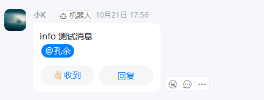

# SMS4J OA消息通知

oa消息通知，飞书、钉钉、企业微信

官网：[链接](https://sms4j.com/doc3/plugin/oa.html)


## 添加依赖

```xml
<!-- SMS4J oa消息通知，飞书、钉钉、企业微信 -->
<dependency>
    <groupId>org.dromara.sms4j</groupId>
    <artifactId>sms4j-oa-core</artifactId>
    <version>3.3.5</version>
</dependency>
```


## 钉钉

### 添加配置文件

```yaml
---
# OA消息通知配置
sms-oa:
  config-type: yaml
  oas:
    dingTalk:
      isEnable: true
      supplier: ding_ding
      tokenId: 1c58688af20ba408585bbb51997532e421b377093f7e876f2ef88333eaaxxxxx
      sign: SEC9dbf5a36f16940ede57fd870b2fcb61c61c0b5fb66bb666b7c0c8828ca0xxxxx
```

- `sms-oa.oas.dingTalk.isEnable`： 生效该配置
- `sms-oa.oas.dingTalk.supplier`： 厂商标识
- `sms-oa.oas.dingTalk.tokenId`：webhook 中的 access_token
- `sms-oa.oas.dingTalk.sign`：安全设置在验签模式下才的秘钥，非验签模式没有此值


### 发送消息

#### 创建测试类

```java
package local.ateng.java.oa;

import org.dromara.oa.api.OaSender;
import org.dromara.oa.comm.entity.Request;
import org.dromara.oa.comm.enums.MessageType;
import org.dromara.oa.core.provider.factory.OaFactory;
import org.junit.jupiter.api.Test;
import org.springframework.boot.test.context.SpringBootTest;

import java.util.ArrayList;

@SpringBootTest
public class OADingTalkTests {

}
```

#### Text消息

```java
/**
 * DingTalk的Text测试
 */
@Test
public void oaDingTalkText() {
    // 获取服务实例
    OaSender alarm = OaFactory.getSmsOaBlend("dingTalk");

    Request request = new Request();
    ArrayList<String> phones = new ArrayList<>();
    phones.add("17623062931");
    // 支持通过手机号@
    request.setPhoneList(phones);
    // 支持@all
    // request.setIsNoticeAll(true);
    request.setContent("info: 测试消息");

    alarm.sender(request, MessageType.DING_TALK_TEXT);
}
```



#### Markdown消息

```java
/**
 * DingTalk的Markdown测试
 */
@Test
public void oaDingTalkMarkdown() {
    // 获取服务实例
    OaSender alarm = OaFactory.getSmsOaBlend("dingTalk");

    Request request = new Request();
    // 支持@all
    request.setIsNoticeAll(true);
    request.setContent("#### 杭州天气 @150XXXXXXXX \n > 9度，西北风1级，空气良89，相对温度73%\n > \n > ###### 10点20分发布 [天气](https://www.dingtalk.com) \n");
    request.setTitle("info:标题");
    alarm.sender(request, MessageType.DING_TALK_MARKDOWN);

}
```


#### Link消息

```java
/**
 * DingTalk的Link测试
 */
@Test
public void oaDingTalkLink() {
    // 获取服务实例
    OaSender alarm = OaFactory.getSmsOaBlend("dingTalk");

    Request request = new Request();
    request.setContent("这个即将发布的新版本，创始人xx称它为红树林。而在此之前，每当面临重大升级，产品经理们都会取一个应景的代号，这一次，为什么是红树林");
    request.setTitle("info:点击跳转到钉钉");
    request.setMessageUrl("https://www.dingtalk.com/s?__biz=MzA4NjMwMTA2Ng==&mid=2650316842&idx=1&sn=60da3ea2b29f1dcc43a7c8e4a7c97a16&scene=2&srcid=09189AnRJEdIiWVaKltFzNTw&from=timeline&isappinstalled=0&key=&ascene=2&uin=&devicetype=android-23&version=26031933&nettype=WIFI");
    request.setPicUrl("https://img.alicdn.com/tfs/TB1NwmBEL9TBuNjy1zbXXXpepXa-2400-1218.png");

    alarm.sender(request, MessageType.DING_TALK_LINK);

}
```


## 企业微信

### 添加配置文件

```yaml
---
# OA消息通知配置
sms-oa:
  config-type: yaml
  oas:
    dingTalk:
      isEnable: true
      supplier: we_talk
      tokenId: ff3e6d6d-fd52-46e7-9ccb-7dd41c9xxxxx
```

- `sms-oa.oas.dingTalk.isEnable`： 生效该配置
- `sms-oa.oas.dingTalk.supplier`： 厂商标识
- `sms-oa.oas.dingTalk.tokenId`：webhook 中的 access_token


### 发送消息

#### 创建测试类

```java
package local.ateng.java.oa;

import org.dromara.oa.api.OaSender;
import org.dromara.oa.comm.entity.Request;
import org.dromara.oa.comm.entity.WeTalkRequestArticle;
import org.dromara.oa.comm.enums.MessageType;
import org.dromara.oa.core.provider.factory.OaFactory;
import org.junit.jupiter.api.Test;
import org.springframework.boot.test.context.SpringBootTest;

import java.util.ArrayList;

@SpringBootTest
public class OAWeTalkTests {

}
```

#### Text消息

```java
/**
 * WeTalk的Text测试
 */
@Test
public void oaWeTalkText() {
    // 获取服务实例
    OaSender alarm = OaFactory.getSmsOaBlend("weTalk");

    Request request = new Request();
    ArrayList<String> phones = new ArrayList<>();
    phones.add("17623062936");
    // 支持通过手机号@
    request.setPhoneList(phones);
    // 支持@all
    // request.setIsNoticeAll(true);
    request.setContent("info: 测试消息");

    alarm.sender(request, MessageType.WE_TALK_TEXT);
}
```

#### Markdown消息

```java
/**
 * WeTalk的Markdown测试
 */
@Test
public void oaWeTalkMarkdown() {
    // 获取服务实例
    OaSender alarm = OaFactory.getSmsOaBlend("weTalk");

    Request request = new Request();
    // 支持@all
    request.setIsNoticeAll(true);
    request.setContent("#### 杭州天气 @150XXXXXXXX \n > 9度，西北风1级，空气良89，相对温度73%\n > \n > ###### 10点20分发布 [天气](https://www.dingtalk.com) \n");
    request.setTitle("info:标题");
    alarm.sender(request, MessageType.WE_TALK_MARKDOWN);

}
```

#### News消息

```java
/**
 * WeTalk的News测试
 */
@Test
public void oaWeTalkLink() {
    // 获取服务实例
    OaSender alarm = OaFactory.getSmsOaBlend("weTalk");

    Request request = new Request();
    ArrayList<WeTalkRequestArticle> articles = new ArrayList<>();
    articles.add(new WeTalkRequestArticle("中秋节礼品领取", "今年中秋节公司有豪礼相送", "www.qq.com", "http://res.mail.qq.com/node/ww/wwopenmng/images/independent/doc/test_pic_msg1.png"));
    request.setArticleList(articles);

    alarm.sender(request, MessageType.WE_TALK_NEWS);

}
```


## 飞书（待测试）

### 添加配置文件

```yaml
---
# OA消息通知配置
sms-oa:
  config-type: yaml
  oas:
    dingTalk:
      isEnable: true
      supplier: byte_talk
      tokenId: 1c58688af20ba408585bbb51997532e421b377093f7e876f2ef88333eaaxxxxx
      sign: SEC9dbf5a36f16940ede57fd870b2fcb61c61c0b5fb66bb666b7c0c8828ca0xxxxx
```

- `sms-oa.oas.dingTalk.isEnable`： 生效该配置
- `sms-oa.oas.dingTalk.supplier`： 厂商标识
- `sms-oa.oas.dingTalk.tokenId`：webhook 中的 access_token
- `sms-oa.oas.dingTalk.sign`：安全设置在验签模式下才的秘钥，非验签模式没有此值


### 发送消息

#### 创建测试类

```java
package local.ateng.java.oa;

import org.dromara.oa.api.OaSender;
import org.dromara.oa.comm.entity.Request;
import org.dromara.oa.comm.enums.MessageType;
import org.dromara.oa.core.provider.factory.OaFactory;
import org.junit.jupiter.api.Test;
import org.springframework.boot.test.context.SpringBootTest;

import java.util.ArrayList;

@SpringBootTest
public class OAByteTalkTests {
    
}
```

#### Text消息

```java
/**
 * ByteTalk的Text测试
 */
@Test
public void oaByteTalkText() {
    // 获取服务实例
    OaSender alarm = OaFactory.getSmsOaBlend("byteTalk");

    Request request = new Request();
    ArrayList<String> phones = new ArrayList<>();
    phones.add("17623062936");
    // 支持通过手机号@
    request.setPhoneList(phones);
    // 支持@all
    // request.setIsNoticeAll(true);
    request.setContent("info: 测试消息");

    alarm.sender(request, MessageType.BYTE_TALK_TEXT);
}

```

#### 

## 动态增加配置

```java
/**
 * DingTalk的动态Text测试
 */
@Test
public void oaDynamicDingTalkText() {
    String key = "oaDingTalk";
    DingTalkConfig dingTalkConfig = new DingTalkConfig();
    dingTalkConfig.setConfigId(key);
    dingTalkConfig.setSign("SEC9dbf5a36f16940ede57fd870b2fcb61c61c0b5fb66bb666b7c0c8828ca0f8551");
    dingTalkConfig.setTokenId("1c58688af20ba408585bbb51997532e421b377093f7e876f2ef88333eaabb291");

    // 根据配置创建服务实例并注册
    OaFactory.createAndRegisterOaSender(dingTalkConfig);
    OaSender alarm = OaFactory.getSmsOaBlend(key);

    Request request = new Request();
    ArrayList<String> phones = new ArrayList<>();
    phones.add("17623062936");
    // 支持通过手机号@
    request.setPhoneList(phones);
    // 支持@all
    // request.setIsNoticeAll(true);
    request.setContent("info: 测试消息");

    alarm.sender(request, MessageType.DING_TALK_TEXT);
}
```

