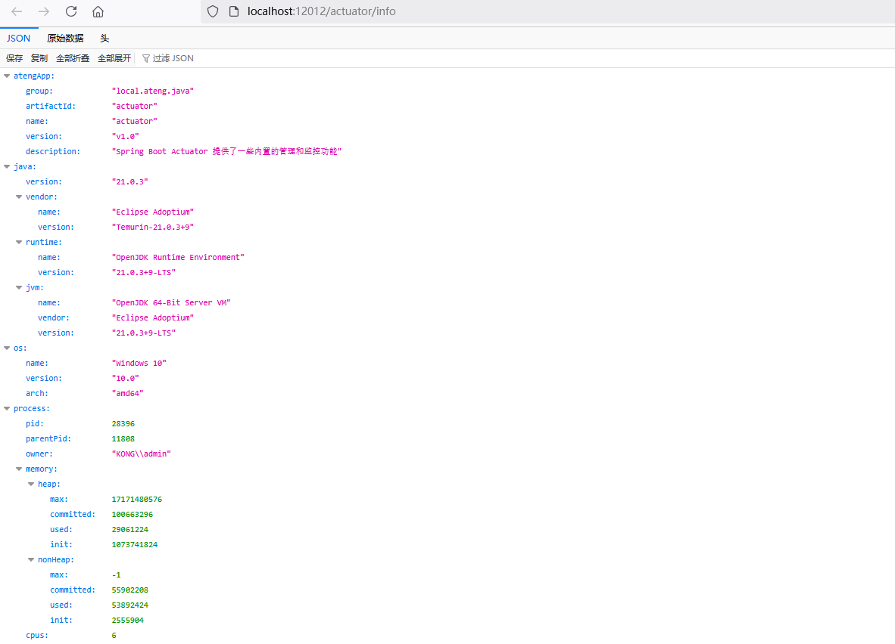
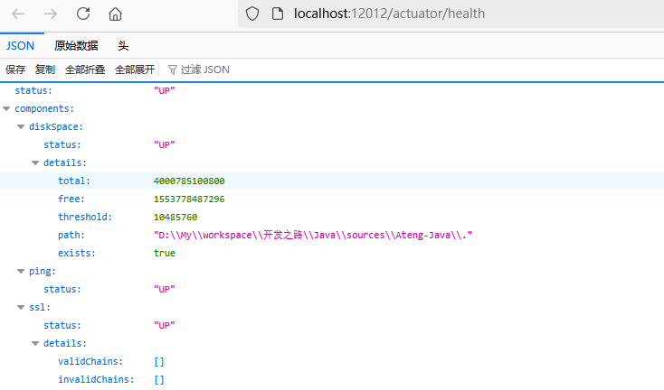
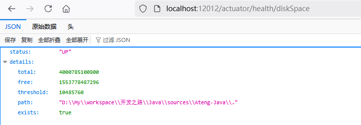
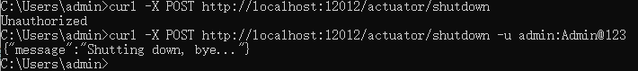

# Spring Boot Actuator

Spring Boot Actuator 是一个非常强大的工具，它为 Spring Boot 应用提供了一些内置的管理和监控功能。通过 Actuator，开发者可以轻松地访问应用的运行时信息，如健康状况、应用信息、性能指标等，并通过端点暴露这些信息。


## 基础配置

### 添加依赖

```xml
<!-- Spring Boot Actuator 依赖 -->
<dependency>
    <groupId>org.springframework.boot</groupId>
    <artifactId>spring-boot-starter-actuator</artifactId>
</dependency>
```

### 添加配置

#### 开启所有端点的配置

```yaml
---
# Spring Boot Actuator 配置
management:
  endpoints:
    web:
      base-path: /actuator
      exposure:
        include: "*"
  endpoint:
    shutdown:
      access: unrestricted
    health:
      show-details: always
    env:
      show-values: always
```

#### 常规配置

```yaml
---
# Spring Boot Actuator 配置
management:
  endpoints:
    web:
      base-path: /actuator
      exposure:
        include: health,metrics,info
```

#### 配置说明

- **`management.endpoints.web.base-path`**: 设置 Actuator 端点的基本路径。
- **`management.endpoints.web.exposure.include`**: 配置暴露的 Actuator 端点。
- **`management.endpoint.shutdown.access`**: 配置关闭端点的访问权限。
- **`management.endpoint.health.show-details`**: 配置健康检查端点显示的详细程度。
- **`management.endpoint.env.show-values`**: 配置环境信息端点是否显示详细值。

#### 开启info端点的数据

```yaml
---
# Spring Boot Actuator 配置
management:
  # ...
  info:
    build:
      enabled: true
    env:
      enabled: true
    git:
      enabled: true
      mode: full
    java:
      enabled: true
    os:
      enabled: true
    process:
      enabled: true
info:
  atengApp:
    group: ${project.groupId}
    artifactId: ${project.artifactId}
    name: ${project.name}
    version: ${project.version}
    description: ${project.description}
```

**注释说明**

- **`management.info` 配置**：用于控制哪些信息将被公开在 `/actuator/info` 端点上。
    - `build`: 启用与构建相关的信息（例如：版本号、构建时间）。
    - `env`: 启用应用的环境变量和系统属性信息。
    - `git`: 启用 Git 提交信息，包括提交 ID、分支、作者等（`mode: full` 表示显示完整信息）。
    - `java`: 启用 Java 环境信息，如 Java 版本、JVM 参数等。
    - `os`: 启用操作系统信息，如操作系统名称、版本等。
    - `process`: 启用进程信息，如进程 ID（PID）、启动时间等。
- **`info.*` 配置**：定义了应用的自定义信息，这些信息会出现在 `/actuator/info` 端点中，通常用于展示与应用相关的元数据（如名称、版本等）。这些值可以从 Maven 或 Gradle 项目的配置中获取。


## Actuator 端点说明

| **端点**                                 | **解释**                                                     |
| ---------------------------------------- | ------------------------------------------------------------ |
| `/actuator/beans`                        | 返回应用中所有的 Spring Beans 和它们的依赖关系。             |
| `/actuator/caches`                       | 显示应用中所有缓存的状态和统计信息。                         |
| `/actuator/caches/{cache}`               | 显示指定缓存的详细信息。                                     |
| `/actuator/health`                       | 返回应用的健康检查状态，包括外部服务的健康状况。             |
| `/actuator/health/{*path}`               | 返回特定健康检查路径的详细信息。                             |
| `/actuator/info`                         | 返回应用的自定义信息，如版本号、构建时间、Git 提交 ID 等。   |
| `/actuator/conditions`                   | 显示应用中所有的条件配置，帮助查看 Spring Boot 自动配置的应用条件。 |
| `/actuator/shutdown`                     | 启用应用程序关闭的端点，通过 `POST` 请求可以关闭应用。此端点需要额外的配置并加上安全访问控制。 |
| `/actuator/configprops`                  | 返回所有的配置属性，展示应用程序中所有已配置的 `@ConfigurationProperties` 类及其属性。 |
| `/actuator/configprops/{prefix}`         | 显示特定前缀的配置属性，帮助定位与前缀相关的配置问题。       |
| `/actuator/env`                          | 返回应用的环境变量和配置信息。                               |
| `/actuator/env/{toMatch}`                | 返回匹配特定字符串的环境变量和配置信息，可以通过过滤关键词来查找相关配置。 |
| `/actuator/loggers`                      | 显示和配置应用的日志记录器，查看当前日志记录器的级别并可动态调整日志级别。 |
| `/actuator/loggers/{name}`               | 查看和配置指定名称的日志记录器，适用于调整特定包或类的日志级别。 |
| `/actuator/heapdump`                     | 返回 JVM 的堆转储（heap dump），用于分析内存问题。           |
| `/actuator/threaddump`                   | 返回 JVM 中所有线程的堆栈信息，帮助分析线程问题。            |
| `/actuator/metrics`                      | 返回应用的各种性能指标，如 HTTP 请求计数、JVM 内存使用、线程池使用等。 |
| `/actuator/metrics/{requiredMetricName}` | 返回指定名称的性能指标详细信息。                             |
| `/actuator/sbom`                         | 返回应用的供应链软件清单（SBOM），展示应用使用的所有库及其版本信息。 |
| `/actuator/sbom/{id}`                    | 返回指定 ID 的软件供应链清单（SBOM）。                       |
| `/actuator/scheduledtasks`               | 返回当前应用中所有已调度任务的列表，查看任务的调度配置。     |
| `/actuator/mappings`                     | 返回应用中所有请求的 URL 映射，展示所有 HTTP 请求路径与控制器方法之间的映射关系。 |


## 访问端点

### /actuator/info



### /actuator/health



访问具体的路径



### /actuator/shutdown

#### 关闭应用

```
curl -X POST http://localhost:12012/actuator/shutdown
```


#### 设置认证

创建一个过滤器设置一个内置的账号密码认证，在实际的项目中可以使用框架来完成。

**创建过滤器**

```java
package local.ateng.java.actuator.filter;

import jakarta.servlet.*;
import jakarta.servlet.http.HttpServletRequest;
import jakarta.servlet.http.HttpServletResponse;
import org.springframework.stereotype.Component;

import java.io.IOException;
import java.util.Base64;

@Component
public class ShutdownFilter implements Filter {

    private static final String USERNAME = "admin";  // 设置账号
    private static final String PASSWORD = "Admin@123";  // 设置密码

    @Override
    public void init(FilterConfig filterConfig) throws ServletException {
        // 过滤器初始化方法，通常不需要做任何事
    }

    @Override
    public void doFilter(ServletRequest request, ServletResponse response, FilterChain chain)
            throws IOException, ServletException {

        HttpServletRequest httpRequest = (HttpServletRequest) request;
        HttpServletResponse httpResponse = (HttpServletResponse) response;

        // 检查请求是否是对 /actuator/shutdown 的请求
        if (httpRequest.getRequestURI().startsWith("/actuator/shutdown")) {
            // 获取请求头中的 Authorization 信息
            String authHeader = httpRequest.getHeader("Authorization");
            if (authHeader == null || !authHeader.startsWith("Basic ")) {
                // 如果没有 Authorization 头或者不是 Basic 认证
                httpResponse.setStatus(HttpServletResponse.SC_UNAUTHORIZED);
                httpResponse.getWriter().write("Unauthorized");
                return;
            }

            // 解码 Basic 认证信息
            String base64Credentials = authHeader.substring(6);
            String credentials = new String(Base64.getDecoder().decode(base64Credentials));
            String[] values = credentials.split(":", 2);

            // 检查用户名和密码
            if (!values[0].equals(USERNAME) || !values[1].equals(PASSWORD)) {
                // 如果用户名或密码不匹配
                httpResponse.setStatus(HttpServletResponse.SC_UNAUTHORIZED);
                httpResponse.getWriter().write("Invalid username or password");
                return;
            }
        }

        // 认证成功后，继续请求处理
        chain.doFilter(request, response);
    }

    @Override
    public void destroy() {
        // 过滤器销毁方法，通常不需要做任何事
    }
}
```

**注册过滤器**

```java
package local.ateng.java.actuator.config;

import local.ateng.java.actuator.filter.ShutdownFilter;
import org.springframework.boot.web.servlet.FilterRegistrationBean;
import org.springframework.context.annotation.Bean;
import org.springframework.context.annotation.Configuration;

@Configuration
public class FilterConfig {

    @Bean
    public FilterRegistrationBean<ShutdownFilter> actuatorShutdownFilter() {
        FilterRegistrationBean<ShutdownFilter> registrationBean = new FilterRegistrationBean<>();
        registrationBean.setFilter(new ShutdownFilter());
        registrationBean.addUrlPatterns("/actuator/shutdown");  // 只拦截 /actuator/shutdown 端点
        registrationBean.setOrder(1);  // 设置过滤器顺序
        return registrationBean;
    }
}
```

**关闭应用**

再次关闭应用就需要内置的账号密码认证

```
curl -X POST http://localhost:12012/actuator/shutdown -u admin:Admin@123
```


