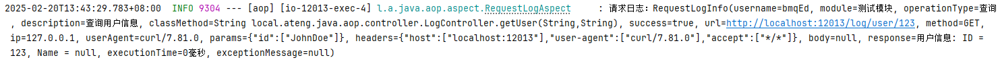
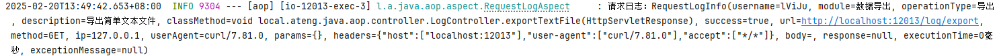

# AOP

在 Spring 中，Spring 的 AOP（面向切面编程）是一种编程方式，允许我们在不修改业务代码的前提下，动态地添加一些额外的功能，比如日志记录、性能监控、事务管理等。它通过“切面”来分离这些跨领域的功能，使得核心业务逻辑和这些额外功能解耦，从而提升代码的可维护性和复用性。AOP 在运行时通过代理机制，将增强逻辑（如前置、后置通知等）织入到目标方法的执行中。简单来说，AOP 就是帮助我们在特定的“切入点”上，插入额外的处理逻辑，而不需要修改原本的代码，既提升了代码的整洁性，也使得功能的扩展更加灵活。


## 概述

### 注解说明

下面是 AOP 通知类型的表格，列出了各个通知类型、触发时机以及常见用法：

| **通知类型** | **注解**          | **触发时机**                       | **常见用法**                                                 |
| ------------ | ----------------- | ---------------------------------- | ------------------------------------------------------------ |
| **前置通知** | `@Before`         | 目标方法执行之前                   | 1. 检查参数有效性 2. 权限控制 3. 日志记录（例如：记录方法调用时的输入参数） |
| **后置通知** | `@After`          | 目标方法执行之后（无论成功或失败） | 1. 清理工作（例如：释放资源） 2. 日志记录（例如：记录方法执行结束） |
| **返回通知** | `@AfterReturning` | 目标方法执行成功后                 | 1. 记录方法执行结果 2. 业务处理后的后续操作（例如：通知、邮件发送） |
| **异常通知** | `@AfterThrowing`  | 目标方法抛出异常时                 | 1. 异常日志记录 2. 异常处理（例如：发送报警通知、记录错误信息） |
| **环绕通知** | `@Around`         | 目标方法执行前后                   | 1. 性能监控（例如：计算执行时间） 2. 事务管理（例如：开始和提交事务） 3. 参数处理或修改 |
| **切点定义** | `@Pointcut`       | 定义切点，指定哪些方法会被通知拦截 | 1. 定义切点表达式，决定哪些方法需要被 AOP 通知拦截 2. 通过注解或方法签名指定通知应用的范围 |

### `pointcut`表达式

在Spring Boot中，AOP的`pointcut`表达式用于定义哪些方法需要被拦截，通常通过`@Pointcut`注解或者在`@Around`、`@Before`、`@After`等注解中使用。`pointcut`表达式有多种写法，常见的有以下几种：

| **表达式类型**                 | **表达式示例**                                               | **说明**                                                     | **匹配场景**                                                 |
| ------------------------------ | ------------------------------------------------------------ | ------------------------------------------------------------ | ------------------------------------------------------------ |
| **匹配所有方法**               | `@Pointcut("execution(* com.example.service.*.*(..))")`      | 匹配指定包下的所有方法，不考虑返回类型和参数类型。           | 匹配 `com.example.service` 包下的所有方法。                  |
| **匹配返回类型**               | `@Pointcut("execution(String com.example.service.*.*(..))")` | 匹配返回类型为指定类型的方法。                               | 匹配 `com.example.service` 包下返回类型为 `String` 的所有方法。 |
| **匹配方法名**                 | `@Pointcut("execution(* com.example.service.*.do*(..))")`    | 匹配方法名符合特定模式的方法（例如以 `do` 开头）。           | 匹配 `com.example.service` 包下所有方法名以 `do` 开头的方法。 |
| **匹配参数类型**               | `@Pointcut("execution(* com.example.service.*.*(String))")`  | 匹配参数类型为指定类型的方法。                               | 匹配 `com.example.service` 包下参数类型为 `String` 的所有方法。 |
| **匹配修饰符**                 | `@Pointcut("execution(public * com.example.service.*.*(..))")` | 匹配指定访问修饰符（如 `public`）的方法。                    | 匹配 `com.example.service` 包下所有 `public` 修饰符的方法。  |
| **匹配子包中的方法**           | `@Pointcut("execution(* com.example.service..*(..))")`       | 匹配指定包及其子包下的所有方法。                             | 匹配 `com.example.service` 包及其所有子包下的方法。          |
| **匹配任意参数**               | `@Pointcut("execution(* com.example.service.*.*(..))")`      | 匹配方法参数为任意类型和个数的方法。                         | 匹配 `com.example.service` 包下的所有方法，忽略参数类型。    |
| **匹配带注解的方法**           | `@Pointcut("@annotation(com.example.annotation.MyAnnotation)")` | 匹配带有指定注解的方法。                                     | 匹配所有带有 `@MyAnnotation` 注解的方法。                    |
| **匹配类注解的方法**           | `@Pointcut("@within(com.example.annotation.MyAnnotation)")`  | 匹配类上标注了指定注解的所有方法。                           | 匹配类上标注了 `@MyAnnotation` 注解的所有方法。              |
| **匹配参数类型**               | `@Pointcut("args(java.lang.String)")`                        | 匹配参数为指定类型的方法。                                   | 匹配参数类型为 `String` 的所有方法。                         |
| **匹配第一个参数类型**         | `@Pointcut("args(java.lang.String,..)")`                     | 匹配第一个参数为指定类型的方法。                             | 匹配第一个参数为 `String` 类型的所有方法。                   |
| **匹配代理类型**               | `@Pointcut("this(com.example.service.MyService)")`           | 匹配当前代理对象类型为指定类型的方法。                       | 匹配代理对象为 `com.example.service.MyService` 类型的方法。  |
| **匹配目标类型**               | `@Pointcut("target(com.example.service.MyService)")`         | 匹配目标对象类型为指定类型的方法。                           | 匹配目标对象为 `com.example.service.MyService` 类型的方法。  |
| **匹配类范围的方法**           | `@Pointcut("within(com.example.service.*)")`                 | 匹配指定类或包中的所有方法。                                 | 匹配 `com.example.service` 包下的所有方法。                  |
| **逻辑否定（排除某些方法）**   | `@Pointcut("execution(* com.example.service.*.*(..)) && !execution(* com.example.service.*.set*(..))")` | 匹配所有方法，但排除某些符合条件的方法（如以 `set` 开头）。  | 匹配 `com.example.service` 包下所有方法，排除掉 `set` 开头的方法。 |
| **逻辑与（多条件匹配）**       | `@Pointcut("execution(* com.example.service.*.*(..)) && @annotation(com.example.annotation.Log)")` | 匹配满足多个条件的所有方法。例如，匹配 `com.example.service` 包下且有 `@Log` 注解的方法。 | 匹配 `com.example.service` 包下所有带有 `@Log` 注解的方法。  |
| **逻辑或（任意一个条件满足）** | `@Pointcut("execution(* com.example.service.*.*(..))         |                                                              | execution(* com.example.dao.*.*(..))")`                      |

#### 1. **匹配指定包下所有方法**

```java
@Pointcut("execution(* com.example.service.*.*(..))")
public void allServiceMethods() {}
```

这会匹配 `com.example.service` 包下的所有方法。

#### 2. **匹配指定方法名和参数类型**

```java
@Pointcut("execution(* com.example.service.*.do*(String))")
public void methodsWithDoPrefixAndStringParam() {}
```

这会匹配 `com.example.service` 包下所有方法名以 `do` 开头，且参数类型为 `String` 的方法。

#### 3. **匹配带有特定注解的方法**

```java
@Pointcut("@annotation(com.example.annotation.Log)")
public void logAnnotatedMethods() {}
```

这会匹配所有带有 `@Log` 注解的方法。

也可以这样写：

```java
@Pointcut("@annotation(log)")
public void logAnnotatedMethods(Log log) {}
```

#### 4. **匹配方法的返回类型**

```java
@Pointcut("execution(String com.example.service.*.*(..))")
public void stringReturningMethods() {}
```

这会匹配 `com.example.service` 包下所有返回类型为 `String` 的方法。

#### 5. **匹配排除某些方法**

```java
@Pointcut("execution(* com.example.service.*.*(..)) && !execution(* com.example.service.*.set*(..))")
public void allMethodsExceptSetters() {}
```

这会匹配 `com.example.service` 包下所有方法，但排除掉方法名以 `set` 开头的方法。


## 基础配置

### 添加依赖

```xml
<!-- Spring Boot AOP 依赖 -->
<dependency>
    <groupId>org.springframework.boot</groupId>
    <artifactId>spring-boot-starter-aop</artifactId>
</dependency>
```

### 启动 AOP

使用 @EnableAspectJAutoProxy 注解启用 AOP 功能：

```java
package local.ateng.java.aop;

import org.springframework.boot.SpringApplication;
import org.springframework.boot.autoconfigure.SpringBootApplication;
import org.springframework.context.annotation.EnableAspectJAutoProxy;

@SpringBootApplication
@EnableAspectJAutoProxy
public class SpringBoot3AOPApplication {

    public static void main(String[] args) {
        SpringApplication.run(SpringBoot3AOPApplication.class, args);
    }

}
```


## 方法计时

### 创建注解

自定义注解 `@PerformanceMonitor` 用于标记需要监控执行时间的方法。我们通过 `@Target` 和 `@Retention` 注解来指定它的作用范围和生命周期。

```java
package local.ateng.java.aop.annotation;

import java.lang.annotation.ElementType;
import java.lang.annotation.Retention;
import java.lang.annotation.RetentionPolicy;
import java.lang.annotation.Target;

/**
 * 自定义注解 @PerformanceMonitor 用于标记需要监控执行时间的方法。
 * <p>
 * 1. @Target(ElementType.METHOD) ：指定该注解只能应用于方法。
 * 2. @Retention(RetentionPolicy.RUNTIME) ：表示注解将在运行时通过反射读取。
 */
@Target(ElementType.METHOD) // 仅限方法使用
@Retention(RetentionPolicy.RUNTIME) // 保留至运行时，可通过反射获取
public @interface PerformanceMonitor {
}
```

**`@Target(ElementType.METHOD)`**：确保该注解仅能应用在方法上，防止误用在类或字段等其他地方。

**`@Retention(RetentionPolicy.RUNTIME)`**：确保该注解能够在运行时通过反射读取，以便 AOP 切面能够识别它并执行相应的逻辑。

### 创建切面

在切面类中，我们使用 `@Around` 环绕通知来计算标记了 `@PerformanceMonitor` 注解的方法的执行时间，并输出日志。

```java
package local.ateng.java.aop.aspect;

import cn.hutool.core.date.DateUtil;
import cn.hutool.core.date.TimeInterval;
import local.ateng.java.aop.annotation.PerformanceMonitor;
import lombok.extern.slf4j.Slf4j;
import org.aspectj.lang.ProceedingJoinPoint;
import org.aspectj.lang.annotation.Around;
import org.aspectj.lang.annotation.Aspect;
import org.springframework.stereotype.Component;

/**
 * AOP 切面类，用于监控方法执行时间
 * <p>
 * 使用 @Around 注解定义环绕通知，计算方法执行的时间。
 */
@Aspect
@Component
@Slf4j
public class PerformanceMonitoringAspect {

    /**
     * 环绕通知，拦截标记了 @PerformanceMonitor 注解的方法，计算执行时间
     *
     * @param joinPoint 连接点，表示目标方法的信息
     * @return 目标方法的返回值
     * @throws Throwable 如果目标方法抛出异常，继续抛出异常
     */
    @Around("@annotation(performanceMonitor)") // 拦截所有标记了 @PerformanceMonitor 注解的方法
    public Object monitorExecutionTime(ProceedingJoinPoint joinPoint, PerformanceMonitor performanceMonitor) throws Throwable {
        // 记录方法开始执行的时间
        TimeInterval timer = DateUtil.timer();

        // 执行目标方法
        Object result = joinPoint.proceed();

        // 计算方法执行的时间（单位：毫秒）
        long executionTimeSecond = timer.intervalSecond();
        long executionTime = timer.intervalRestart();

        // 获取目标方法的名称，并记录方法执行的时间
        String methodName = joinPoint.getSignature().toShortString();
        log.info("方法 {} 执行时间：{} 秒（{} ms）", methodName, executionTimeSecond, executionTime);

        // 返回目标方法的执行结果
        return result;
    }
}
```

**`@Around("@annotation(performanceMonitor)")`**：指定环绕通知拦截所有标记了 `@PerformanceMonitor` 注解的方法。

**`joinPoint.proceed()`**：执行目标方法，返回结果。

### 使用切面

#### 创建服务

```java
package local.ateng.java.aop.service;

import local.ateng.java.aop.annotation.PerformanceMonitor;
import org.springframework.stereotype.Service;

@Service
public class TimerService {

    /**
     * 模拟一个耗时操作的方法，使用 @PerformanceMonitor 注解监控执行时间。
     */
    @PerformanceMonitor  // 使用自定义注解标记需要监控执行时间的方法
    public void one() {
        try {
            Thread.sleep(2000);  // 模拟一个耗时 2 秒的操作
        } catch (InterruptedException e) {
            e.printStackTrace();
        }
    }

    /**
     * 另一个示例方法，模拟不同的执行时间。
     */
    @PerformanceMonitor  // 使用自定义注解标记需要监控执行时间的方法
    public void two() {
        try {
            Thread.sleep(500);  // 模拟一个耗时 0.5 秒的操作
        } catch (InterruptedException e) {
            e.printStackTrace();
        }
    }
}
```

#### 创建接口

```java
package local.ateng.java.aop.controller;

import local.ateng.java.aop.service.TimerService;
import lombok.RequiredArgsConstructor;
import org.springframework.beans.factory.annotation.Autowired;
import org.springframework.web.bind.annotation.GetMapping;
import org.springframework.web.bind.annotation.RequestMapping;
import org.springframework.web.bind.annotation.RestController;

@RestController
@RequestMapping("/timer")
@RequiredArgsConstructor(onConstructor = @__(@Autowired))
public class TimerController {
    private final TimerService timerService;

    @GetMapping("/one")
    public void one() {
        timerService.one();
    }

    @GetMapping("/two")
    public void two() {
        timerService.two();
    }

}
```

#### 调用接口

访问接口，控制台打印方法执行耗时日志

```bash
curl localhost:12013/timer/one
curl localhost:12013/timer/two
```


## HTTP请求日志记录

### 基础配置

#### 创建实体类

用于存储和记录 HTTP 请求和响应相关的日志信息。通过这个类，我们能够详细地记录下每个请求的关键信息，方便后续的日志分析、调试和追踪。

```java
package local.ateng.java.aop.entity;


import lombok.Data;

/**
 * 存储 HTTP 请求和响应日志的实体类
 *
 * @author 孔余
 * @email 2385569970@qq.com
 * @since 2025-02-20
 */
@Data
public class RequestLogInfo {
    private String username;  // 用户名
    private String module;  // 模块名
    private String operationType;  // 操作类型
    private String description;  // 操作说明
    private String classMethod;  // 类名和方法名（全路径）
    private boolean success;  // 请求是否成功
    private String url;
    private String method;
    private String ip;
    private String userAgent;
    private String params;  // 请求参数
    private String headers;  // 请求头
    private String body;  // 请求体
    private String response;  // 响应数据
    private String executionTime;  // 执行时间
    private String exceptionMessage;  // 异常信息
}
```

#### 创建事件类

用于在 Spring 应用程序中发布请求日志事件。它继承自 Spring 提供的 ApplicationEvent 类，通常用于在事件驱动的架构中触发和处理事件。

```java
package local.ateng.java.aop.event;

import local.ateng.java.aop.entity.RequestLogInfo;
import org.springframework.context.ApplicationEvent;

/**
 * 日志事件，用于发布请求日志
 *
 * @author 孔余
 * @email 2385569970@qq.com
 * @since 2025-02-20
 */
public class RequestLogEvent extends ApplicationEvent {
    private final RequestLogInfo requestLogInfo;

    public RequestLogEvent(Object source, RequestLogInfo requestLogInfo) {
        super(source);
        this.requestLogInfo = requestLogInfo;
    }

    public RequestLogInfo getRequestLogInfo() {
        return requestLogInfo;
    }
}
```

#### 创建过滤器

用于解决 **`HttpServletRequest` 只能读取一次请求体** 的问题。通过这个过滤器，`HttpServletRequest` 可以重复读取请求体，这对于需要在多个地方读取请求体的场景（例如：日志记录、请求参数处理等）非常有用。

```java
package local.ateng.java.aop.filter;

import cn.hutool.core.io.IoUtil;
import jakarta.servlet.*;
import jakarta.servlet.http.HttpServletRequest;
import jakarta.servlet.http.HttpServletRequestWrapper;

import java.io.BufferedReader;
import java.io.ByteArrayInputStream;
import java.io.IOException;
import java.io.InputStreamReader;

/**
 * 配置过滤器，可以重复读取请求体
 *
 * @author 孔余
 * @email 2385569970@qq.com
 * @since 2025-02-20
 */
public class RepeatableFilter implements Filter {

    @Override
    public void init(FilterConfig filterConfig) throws ServletException {
        // 过滤器初始化，通常可以做一些初始化操作，比如设置日志记录器等
    }

    @Override
    public void doFilter(ServletRequest request, ServletResponse response, FilterChain chain)
            throws IOException, ServletException {

        // 将缓存请求体存储到 request 属性中，后续可以访问
        ServletRequest requestWrapper = null;
        if (request instanceof HttpServletRequest) {
            requestWrapper = new RepeatedlyRequestWrapper((HttpServletRequest) request, response);
        }

        // 继续执行过滤链
        if (null == requestWrapper) {
            chain.doFilter(request, response);
        } else {
            chain.doFilter(requestWrapper, response);
        }

    }

    @Override
    public void destroy() {
        // 过滤器销毁时执行清理工作，这里没有需要销毁的资源
    }

    /**
     * 自定义 HttpServletRequestWrapper，用于存储缓存的请求体
     */
    public static class RepeatedlyRequestWrapper extends HttpServletRequestWrapper {
        private final byte[] body;

        public RepeatedlyRequestWrapper(HttpServletRequest request, ServletResponse response) throws IOException {
            super(request);
            request.setCharacterEncoding("UTF-8");
            response.setCharacterEncoding("UTF-8");

            body = IoUtil.readBytes(request.getInputStream(), false);
        }

        @Override
        public BufferedReader getReader() throws IOException {
            return new BufferedReader(new InputStreamReader(getInputStream()));
        }

        @Override
        public ServletInputStream getInputStream() throws IOException {
            final ByteArrayInputStream bais = new ByteArrayInputStream(body);
            return new ServletInputStream() {
                @Override
                public int read() throws IOException {
                    return bais.read();
                }

                @Override
                public int available() throws IOException {
                    return body.length;
                }

                @Override
                public boolean isFinished() {
                    return false;
                }

                @Override
                public boolean isReady() {
                    return false;
                }

                @Override
                public void setReadListener(ReadListener readListener) {

                }
            };
        }
    }
}
```

#### 注册过滤器

将自定义的 `RepeatableFilter` 过滤器添加到 Spring Boot 应用的过滤器链中，使得所有的 HTTP 请求都可以重复读取请求体。通过这种方式，在请求体已被读取后，我们仍然能够多次读取它。

```java
package local.ateng.java.aop.config;

import local.ateng.java.aop.filter.RepeatableFilter;
import org.springframework.boot.web.servlet.FilterRegistrationBean;
import org.springframework.context.annotation.Bean;
import org.springframework.context.annotation.Configuration;

/**
 * 过滤器配置类
 *
 * @author 孔余
 * @email 2385569970@qq.com
 * @since 2025-02-20
 */
@Configuration
public class FilterConfig {

    /**
     * 注册一个自定义的 RepeatableFilter，它可以使请求体可重复读取
     * @return
     */
    @Bean
    public FilterRegistrationBean<RepeatableFilter> repeatableFilter() {
        FilterRegistrationBean<RepeatableFilter> registrationBean = new FilterRegistrationBean<>();
        registrationBean.setFilter(new RepeatableFilter());
        registrationBean.addUrlPatterns("/*");  // 设置需要拦截的URL模式
        registrationBean.setName("repeatableFilter");
        registrationBean.setOrder(FilterRegistrationBean.LOWEST_PRECEDENCE);
        return registrationBean;
    }

}
```

### 创建注解

用于标记需要记录 HTTP 请求日志的方法。通过这个注解，我们可以在 Spring 的 AOP 切面中捕获被标记的方法的执行信息，进而记录请求的相关日志（如请求参数、请求头、响应数据等）。

```java
package local.ateng.java.aop.annotation;

import java.lang.annotation.ElementType;
import java.lang.annotation.Retention;
import java.lang.annotation.RetentionPolicy;
import java.lang.annotation.Target;

/**
 * 用于标记需要记录 HTTP 请求日志的方法
 *
 * @author 孔余
 * @email 2385569970@qq.com
 * @since 2025-02-20
 */
@Target(ElementType.METHOD)  // 仅限用于方法
@Retention(RetentionPolicy.RUNTIME)  // 运行时有效
public @interface RequestLog {
    String module() default "";  // 模块名

    String operation() default "";  // 操作类型（如：查询、添加、删除等）

    String description() default "";  // 操作说明

    boolean logParams() default true;  // 是否记录请求参数

    boolean logHeaders() default true;  // 是否记录请求头

    boolean logBody() default true;  // 是否记录请求体

    boolean logResponse() default true;  // 是否记录响应数据

    boolean logExecutionTime() default true;  // 是否记录执行时间
}
```

- **`@Target(ElementType.METHOD)`**：表示该注解仅能应用于方法。换句话说，你只能在方法上使用 `@RequestLog` 注解。
- **`@Retention(RetentionPolicy.RUNTIME)`**：表示该注解在运行时有效，即可以在运行时通过反射读取注解的值。这使得我们能够在 AOP 切面中访问到方法上的 `@RequestLog` 注解。

### 创建切面

在切面类中，我们使用 `@Around` 环绕通知来计算标记了 `@RequestLog` 注解的方法的执行时间，并输出日志。

```java
package local.ateng.java.aop.aspect;

import cn.hutool.core.date.DateUtil;
import cn.hutool.core.date.TimeInterval;
import cn.hutool.core.exceptions.ExceptionUtil;
import cn.hutool.core.util.RandomUtil;
import cn.hutool.core.util.StrUtil;
import cn.hutool.extra.servlet.JakartaServletUtil;
import cn.hutool.json.JSONUtil;
import jakarta.servlet.http.HttpServletRequest;
import local.ateng.java.aop.annotation.RequestLog;
import local.ateng.java.aop.entity.RequestLogInfo;
import local.ateng.java.aop.event.RequestLogEvent;
import lombok.RequiredArgsConstructor;
import lombok.extern.slf4j.Slf4j;
import org.aspectj.lang.ProceedingJoinPoint;
import org.aspectj.lang.annotation.Around;
import org.aspectj.lang.annotation.Aspect;
import org.springframework.beans.factory.annotation.Autowired;
import org.springframework.context.ApplicationEventPublisher;
import org.springframework.stereotype.Component;
import org.springframework.web.context.request.RequestContextHolder;
import org.springframework.web.context.request.ServletRequestAttributes;

/**
 * 日志记录切面，记录 HTTP 请求和响应日志
 */
@Aspect
@Component
@Slf4j
@RequiredArgsConstructor(onConstructor = @__(@Autowired))
public class RequestLogAspect {

    private final ApplicationEventPublisher eventPublisher;

    // 环绕通知：方法执行前后都记录日志
    @Around("@annotation(requestLog)")
    public Object logRequestAndResponse(ProceedingJoinPoint joinPoint, RequestLog requestLog) throws Throwable {
        // 获取 HTTP 请求信息
        RequestLogInfo logInfo = new RequestLogInfo();
        HttpServletRequest request = getHttpServletRequest();

        if (request != null) {
            // 获取请求信息
            logInfo.setUsername(getUsername(request));
            logInfo.setUrl(request.getRequestURL().toString());
            logInfo.setMethod(request.getMethod());
            logInfo.setIp(JakartaServletUtil.getClientIP(request));
            logInfo.setUserAgent(request.getHeader("User-Agent"));

            // 获取注解中配置的模块名、操作类型、操作说明
            logInfo.setModule(requestLog.module());
            logInfo.setOperationType(requestLog.operation());
            logInfo.setDescription(requestLog.description());

            // 记录类名和方法名（全路径）
            logInfo.setClassMethod(joinPoint.getSignature().toString());

            // 记录请求参数
            if (requestLog.logParams()) {
                logInfo.setParams(JSONUtil.toJsonStr(JakartaServletUtil.getParams(request)));
            }

            // 记录请求头
            if (requestLog.logHeaders()) {
                logInfo.setHeaders(JSONUtil.toJsonStr(JakartaServletUtil.getHeadersMap(request)));
            }

            // 记录请求体
            if (requestLog.logBody()) {
                String body = JakartaServletUtil.getBody(request);
                logInfo.setBody(StrUtil.cleanBlank(body));
            }
        }

        // 记录方法执行的开始时间
        TimeInterval timer = DateUtil.timer();
        Object result = null;
        String exceptionMessage = null;

        try {
            // 执行目标方法
            result = joinPoint.proceed();
            logInfo.setSuccess(true);  // 标记为成功
        } catch (Throwable throwable) {
            exceptionMessage = ExceptionUtil.stacktraceToString(throwable, 10000);
            logInfo.setSuccess(false);  // 标记为失败
            logInfo.setExceptionMessage(exceptionMessage);
            throw throwable;  // 重新抛出异常
        } finally {
            // 记录方法执行时间
            logInfo.setExecutionTime(timer.intervalPretty());

            // 记录响应数据
            if (requestLog.logResponse()) {
                logInfo.setResponse(StrUtil.subPre(String.valueOf(result), 10000));
            }

            // 如果出现异常，记录异常信息
            if (exceptionMessage != null) {
                logInfo.setExceptionMessage(exceptionMessage);
            }

            // 输出日志信息
            log.info("请求日志：{}", logInfo);

            // 发布日志事件
            eventPublisher.publishEvent(new RequestLogEvent(this, logInfo));
        }

        return result;
    }

    /**
     * 获取当前请求所属用户
     */
    private String getUsername(HttpServletRequest request) {
        String username = null;
        // 根据实际项目逻辑获取用户名
        username = RandomUtil.randomString(5);
        return username;
    }

    /**
     * 获取当前 HTTP 请求
     */
    private HttpServletRequest getHttpServletRequest() {
        HttpServletRequest request = null;
        ServletRequestAttributes attributes = (ServletRequestAttributes) RequestContextHolder.getRequestAttributes();
        if (attributes != null) {
            request = attributes.getRequest();
        }
        return request;
    }

}
```

**`@Around("@annotation(requestLog)")`**：指定环绕通知拦截所有标记了 `@requestLog` 注解的方法。

**`joinPoint.proceed()`**：执行目标方法，返回结果。

### 使用切面

#### 创建接口

```java
package local.ateng.java.aop.controller;

import jakarta.servlet.http.HttpServletResponse;
import local.ateng.java.aop.annotation.RequestLog;
import lombok.Data;
import org.springframework.web.bind.annotation.*;

import java.io.IOException;
import java.io.OutputStream;
import java.util.Map;


@RestController
@RequestMapping("/log")
public class LogController {

    // 测试 GET 请求 - 用于记录请求日志
    @RequestLog(
            module = "测试模块",
            operation = "查询",
            description = "查询用户信息",
            logParams = true,  // 记录请求参数
            logHeaders = true,  // 记录请求头
            logBody = false,    // 不记录请求体
            logResponse = true,  // 记录响应
            logExecutionTime = true  // 记录执行时长
    )
    @GetMapping("/user/{id}")
    public String getUser(@PathVariable("id") String id,
                          @RequestParam(value = "name", required = false) String name) {
        return "用户信息: ID = " + id + ", Name = " + name;
    }

    // 测试 GET 请求 - 用于记录请求日志
    @RequestLog(
            module = "测试模块",
            operation = "查询",
            description = "查询用户信息"
    )
    @GetMapping("/userJson/{id}")
    public Map<String, String> getUserJson(@PathVariable("id") String id,
                                           @RequestParam(value = "name", required = false) String name) {

        return Map.of("id", id, "name", name);
    }

    // 测试 POST 请求 - 用于记录请求日志
    @RequestLog(
            module = "测试模块",
            operation = "创建",
            description = "创建新用户",
            logParams = true,  // 记录请求参数
            logHeaders = true,  // 记录请求头
            logBody = true,     // 记录请求体
            logResponse = true,  // 记录响应
            logExecutionTime = true  // 记录执行时长
    )
    @PostMapping("/user")
    public String createUser(@RequestBody User user) {
        return "创建用户: " + user.getName() + "，年龄: " + user.getAge();
    }

    // 测试 PUT 请求 - 用于记录请求日志
    @RequestLog(
            module = "测试模块",
            operation = "更新",
            description = "更新用户信息",
            logParams = true,  // 记录请求参数
            logHeaders = true,  // 记录请求头
            logBody = true,     // 记录请求体
            logResponse = true,  // 记录响应
            logExecutionTime = true  // 记录执行时长
    )
    @PutMapping("/user/{id}")
    public String updateUser(@PathVariable("id") String id, @RequestBody User user) {
        return "更新用户: ID = " + id + "，Name = " + user.getName() + "，Age = " + user.getAge();
    }

    // 测试 DELETE 请求 - 用于记录请求日志
    @RequestLog(
            module = "测试模块",
            operation = "删除",
            description = "删除用户",
            logParams = true,  // 记录请求参数
            logHeaders = true,  // 记录请求头
            logBody = false,    // 不记录请求体
            logResponse = true,  // 记录响应
            logExecutionTime = true  // 记录执行时长
    )
    @DeleteMapping("/user/{id}")
    public String deleteUser(@PathVariable("id") String id) {
        return "删除用户: ID = " + id;
    }

    // 测试异常 - 用于记录异常日志
    @RequestLog(
            module = "测试模块",
            operation = "错误测试",
            description = "测试接口异常记录"
    )
    @PostMapping("/error")
    public String testError(@RequestBody User user) {
        if (user.getAge() < 0) {
            throw new IllegalArgumentException("年龄不能为负");
        }
        return "用户信息: " + user.getName() + ", " + user.getAge();
    }

    // 测试空请求体的 POST 请求 - 用于测试空的请求体日志记录
    @RequestLog(
            module = "测试模块",
            operation = "创建",
            description = "创建用户（空请求体）"
    )
    @PostMapping("/user/empty")
    public String createEmptyUser() {
        return "创建用户成功（空请求体）";
    }

    /**
     * 导出简单文本文件
     */
    @RequestLog(
            module = "数据导出",
            operation = "导出",
            description = "导出简单文本文件"
    )
    @GetMapping("/export")
    public void exportTextFile(HttpServletResponse response) {
        // 简单的文本数据
        String data = "Hello, this is the exported file content.\nLine 2 of the file.\nLine 3 of the file.";

        // 设置响应头
        response.setContentType("text/plain");
        response.setHeader("Content-Disposition", "attachment; filename=sample.txt");

        // 获取输出流
        try (OutputStream out = response.getOutputStream()) {
            out.write(data.getBytes());
            out.flush();  // 确保内容被写入响应
        } catch (IOException e) {
            throw new RuntimeException(e);
        }
    }

    // User 类，用于演示请求体中的数据
    @Data
    static class User {
        private String name;
        private int age;
    }
}
```

#### 调用接口

1. **GET 请求 - 查询用户信息**

接口：`/log/user/{id}`

```bash
curl -Ss -X GET "http://localhost:12013/log/user/123?id=JohnDoe"
```



------

2. **GET 请求 - 查询用户信息（返回 JSON）**

接口：`/log/userJson/{id}`

```bash
curl -Ss -X GET "http://localhost:12013/log/userJson/123?name=JohnDoe"
```


------

3. **POST 请求 - 创建用户**

接口：`/log/user`

```bash
curl -Ss -X POST "http://localhost:12013/log/user" \
    -H "Content-Type: application/json" \
    -d '{"name":"JohnDoe", "age":30}'
```


------

4. **PUT 请求 - 更新用户信息**

接口：`/log/user/{id}`

```bash
curl -Ss -X PUT "http://localhost:12013/log/user/123" \
    -H "Content-Type: application/json" \
    -d '{"name":"JohnDoeUpdated", "age":31}'
```


------

5. **DELETE 请求 - 删除用户**

接口：`/log/user/{id}`

```bash
curl -Ss -X DELETE "http://localhost:12013/log/user/123"
```


------

6. **POST 请求 - 错误测试（触发异常）**

接口：`/log/error`

```bash
curl -Ss -X POST "http://localhost:12013/log/error" \
    -H "Content-Type: application/json" \
    -d '{"name":"JohnDoe", "age":-1}'
```


------

7. **POST 请求 - 创建空请求体用户**

接口：`/log/user/empty`

```bash
curl -Ss -X POST "http://localhost:12013/log/user/empty"
```


------

8. **GET 请求 - 导出简单文本文件**

接口：`/log/export`

```bash
curl -Ss -X GET "http://localhost:12013/log/export" -O
```



### 后续优化

#### 将注解的属性设置为枚举

**模块**

```java
package local.ateng.java.aop.constants;

/**
 * 用于定义模块的枚举
 *
 * @author 孔余
 * @email 2385569970@qq.com
 * @since 2025-02-20
 */
public enum Module {
    NULL(null),
    USER("用户模块"),
    ORDER("订单模块"),
    PRODUCT("商品模块");

    private final String description;

    Module(String description) {
        this.description = description;
    }

    public String getDescription() {
        return description;
    }
}
```

**操作类型**

```java
package local.ateng.java.aop.constants;

/**
 * 用于定义操作类型的枚举
 *
 * @author 孔余
 * @email 2385569970@qq.com
 * @since 2025-02-20
 */
public enum Operation {
    NULL(null),
    CREATE("创建"),
    READ("查询"),
    UPDATE("更新"),
    DELETE("删除"),
    EXPORT("导出"),
    IMPORT("导入");

    private final String description;

    Operation(String description) {
        this.description = description;
    }

    public String getDescription() {
        return description;
    }
}
```

**修改注解**

修改 @RequestLog 注解的属性

```
Module module() default Module.NULL;
Operation operation() default Operation.NULL;
```

**修改切面**

修改切面获取这两个注解的方法

```
// 获取注解中配置的模块名、操作类型、操作说明
logInfo.setModule(requestLog.module().getDescription());
logInfo.setOperationType(requestLog.operation().getDescription());
```

**修改使用注解的属性使用枚举**

```
// 测试 GET 请求 - 用于记录请求日志
@RequestLog(
        module = Module.USER,
        operation = Operation.READ,
        description = "查询用户信息"
)
```

#### 接受事件

在切面的最后发布日志事件，现在来接受这个事件的数据

```java
package local.ateng.java.aop.service;

import local.ateng.java.aop.event.RequestLogEvent;
import lombok.extern.slf4j.Slf4j;
import org.springframework.context.event.EventListener;
import org.springframework.scheduling.annotation.Async;
import org.springframework.stereotype.Service;

/**
 * 接受切面发布日志事件的数据
 *
 * @author 孔余
 * @email 2385569970@qq.com
 * @since 2025-02-20
 */
@Service
@Slf4j
public class RequestLogService {

    @EventListener
    @Async
    public void requestLogEvent(RequestLogEvent requestLogEvent) {
        log.info("接受到日志数据={}", requestLogEvent.getRequestLogInfo());
        // 将 RequestLogEvent 事件实体类转换成业务类
        // ...
    }

}
```


## 权限控制

### 创建注解

自定义注解 `@PermissionCheck` 用于权限检查，确保只有符合特定权限的用户才能访问某些接口。我们通过 `@Target` 和 `@Retention` 注解来指定它的作用范围和生命周期。

```java
package local.ateng.java.aop.annotation;

import java.lang.annotation.ElementType;
import java.lang.annotation.Retention;
import java.lang.annotation.RetentionPolicy;
import java.lang.annotation.Target;

/**
 * 权限控制注解，标记需要进行权限检查的方法
 */
@Target(ElementType.METHOD)  // 仅限方法上使用
@Retention(RetentionPolicy.RUNTIME)  // 运行时有效
public @interface PermissionCheck {
    String value();  // 权限标识，比如 "ADMIN", "USER", "MANAGER" 等
}
```

**`@Target(ElementType.METHOD)`**：确保该注解仅能应用在方法上，防止误用在类或字段等其他地方。

**`@Retention(RetentionPolicy.RUNTIME)`**：确保该注解能够在运行时通过反射读取，以便 AOP 切面能够识别它并执行相应的逻辑。

### 创建切面

在切面类中，我们使用 `@Around` 环绕通知来计算标记了 `@PermissionCheck` 注解的实现权限检查，确保只有符合特定权限的用户才能访问某些接口。

```java
package local.ateng.java.aop.aspect;

import jakarta.servlet.http.HttpServletRequest;
import local.ateng.java.aop.annotation.PermissionCheck;
import lombok.RequiredArgsConstructor;
import org.aspectj.lang.annotation.Aspect;
import org.aspectj.lang.annotation.Before;
import org.springframework.beans.factory.annotation.Autowired;
import org.springframework.stereotype.Component;

@Aspect
@Component
@RequiredArgsConstructor(onConstructor = @__(@Autowired))
public class PermissionAspect {

    private final HttpServletRequest request;  // 自动注入 HttpServletRequest

    /**
     * 前置通知：拦截带有 @PermissionCheck 注解的方法，检查权限
     */
    @Before("@annotation(permissionCheck)")  // 拦截带有 PermissionCheck 注解的方法
    public void checkPermission(PermissionCheck permissionCheck) throws Exception {
        String requiredPermission = permissionCheck.value();  // 获取所需权限
        String userPermission = getUserPermission();  // 从请求头获取用户权限

        if (userPermission == null || !userPermission.equals(requiredPermission)) {
            // 如果用户权限为空或不匹配所需权限，抛出权限不足异常
            throw new Exception("权限不足，无法访问该接口");
        }
    }

    /**
     * 从请求头中获取 token，然后解析用户权限
     */
    private String getUserPermission() {
        // 从请求头中获取 token（假设 token 的名字是 "Authorization"）
        String token = request.getHeader("Authorization");

        if (token != null && token.startsWith("Bearer ")) {
            token = token.substring(7);  // 去掉 "Bearer " 前缀
        }

        // 在实际情况下，可以通过解析 token 来获取用户信息
        // 这里简化为固定返回权限，实际情况中应该解析 token 获取用户权限
        // 例如：JWT 解码，获取用户角色等信息

        // 假设 token 解析结果为以下内容，用户权限是 "USER" 或 "ADMIN"
        if ("1234567890".equals(token)) {
            return "USER";  // 返回 "USER" 权限
        } else if ("2385569970".equals(token)) {
            return "ADMIN";  // 返回 "ADMIN" 权限
        }

        // 如果没有有效的 token 或权限信息，返回 null
        return null;
    }
}
```

**`@Around("@annotation(PermissionCheck)")`**：指定环绕通知拦截所有标记了 `@PermissionCheck` 注解的方法。

**`joinPoint.proceed()`**：执行目标方法，返回结果。

### 使用切面

#### 创建接口

```java
package local.ateng.java.aop.controller;

import local.ateng.java.aop.annotation.PermissionCheck;
import org.springframework.web.bind.annotation.GetMapping;
import org.springframework.web.bind.annotation.RequestMapping;
import org.springframework.web.bind.annotation.RestController;

@RestController
@RequestMapping("/permission")
public class PermissionController {

    // 模拟的接口：只有 "ADMIN" 权限的用户可以访问
    @PermissionCheck(value = "ADMIN")  // 需要 ADMIN 权限
    @GetMapping("/admin")
    public String getAdminInfo() {
        return "管理员信息";
    }

    // 模拟的接口：只有 "USER" 权限的用户可以访问
    @PermissionCheck(value = "USER")  // 需要 USER 权限
    @GetMapping("/user")
    public String getUserInfo() {
        return "用户信息";
    }

}
```

#### 调用接口

使用header中的去验证权限，调用接口 `/permission/admin` 显示正常，调用 `/permission/user` 权限不足报错。

```
curl -Ss -H "Authorization: Bearer 2385569970" \
    -X GET http://localhost:12013/permission/admin
```


## 接口防抖

### 配置Redis环境

参考文档：[RedisTemplate使用文档](/work/Ateng-Java/cache/redis-template/)

也可以选择其他缓存框架，更多参考 [缓存相关文档](/work/Ateng-Java/cache/)

### 创建注解

```java
package local.ateng.java.aop.annotation;

import java.lang.annotation.ElementType;
import java.lang.annotation.Retention;
import java.lang.annotation.RetentionPolicy;
import java.lang.annotation.Target;
import java.util.concurrent.TimeUnit;

/**
 * 自定义防抖注解，防止接口重复提交
 *
 * @author 孔余
 * @email 2385569970@qq.com
 * @since 2025-02-21
 */
@Target(ElementType.METHOD)
@Retention(RetentionPolicy.RUNTIME)
public @interface Debounce {

    // 设置防抖的时间，单位：毫秒，默认值为500ms
    long interval() default 500;

    // 时间单位
    TimeUnit timeUnit() default TimeUnit.MILLISECONDS;

    // 提示消息
    String message() default "操作频繁，请稍候再试";
}
```

### 创建切面

```java
package local.ateng.java.aop.aspect;


import cn.hutool.core.util.RandomUtil;
import jakarta.servlet.http.HttpServletRequest;
import local.ateng.java.aop.annotation.Debounce;
import lombok.RequiredArgsConstructor;
import org.aspectj.lang.JoinPoint;
import org.aspectj.lang.annotation.AfterReturning;
import org.aspectj.lang.annotation.AfterThrowing;
import org.aspectj.lang.annotation.Aspect;
import org.aspectj.lang.annotation.Before;
import org.springframework.beans.factory.annotation.Autowired;
import org.springframework.data.redis.core.StringRedisTemplate;
import org.springframework.stereotype.Component;

import java.util.Arrays;

/**
 * AOP切面，用于处理防抖逻辑。
 */
@Aspect
@Component
@RequiredArgsConstructor(onConstructor = @__(@Autowired))
public class DebounceAspect {
    private static final ThreadLocal<String> KEY = new ThreadLocal<>();
    private final StringRedisTemplate redisTemplate;
    private final HttpServletRequest request;

    /**
     * 方法执行前
     * 首先判断Redis的数据是否存在，存在就抛出错误，不存在则继续
     * 将用户的接口访问信息存储到Redis，并设置TTL
     *
     * @param joinPoint
     * @param debounce
     */
    @Before("@annotation(debounce)")
    public void before(JoinPoint joinPoint, Debounce debounce) {
        // 获取访问的接口
        String uri = request.getRequestURI();
        // 获取用户名
        String username = getUsername(request);
        // 写入Redis并设置TTL
        String key = "ateng:debounce:interface:" + uri + ":" + username;
        Boolean isExist = redisTemplate.opsForValue().setIfAbsent(key, "", debounce.interval(), debounce.timeUnit());
        if (!isExist) {
            throw new RuntimeException(debounce.message());
        }
        KEY.set(key);
    }

    /**
     * 方法正常返回后
     *
     * @param joinPoint
     * @param debounce
     */
    @AfterReturning(pointcut = "@annotation(debounce)", returning = "result")
    public void afterReturning(JoinPoint joinPoint, Debounce debounce, Object result) {
        KEY.remove();
    }

    /**
     * 方法异常后
     *
     * @param joinPoint
     * @param debounce
     */
    @AfterThrowing(pointcut = "@annotation(debounce)", throwing = "e")
    public void afterThrowing(JoinPoint joinPoint, Debounce debounce, Exception e) {
        KEY.remove();
    }

    /**
     * 获取当前请求所属用户
     */
    private String getUsername(HttpServletRequest request) {
        String username = null;
        // 根据实际项目逻辑获取用户名
        username = RandomUtil.randomEle(Arrays.asList("ateng", "kongyu"));
        return username;
    }

}
```

### 创建接口

如果接口调用频率超过设定的1秒钟，就会报错。

```java
package local.ateng.java.aop.controller;

import local.ateng.java.aop.annotation.Debounce;
import org.springframework.web.bind.annotation.GetMapping;
import org.springframework.web.bind.annotation.RequestMapping;
import org.springframework.web.bind.annotation.RestController;

import java.util.concurrent.TimeUnit;

@RestController
@RequestMapping("/debounce")
public class DebounceController {

    @GetMapping("/demo")
    @Debounce(interval = 1000, timeUnit = TimeUnit.MILLISECONDS, message = "操作频繁，请稍候再试")
    public String demo() {
        return "ok";
    }

}
```

