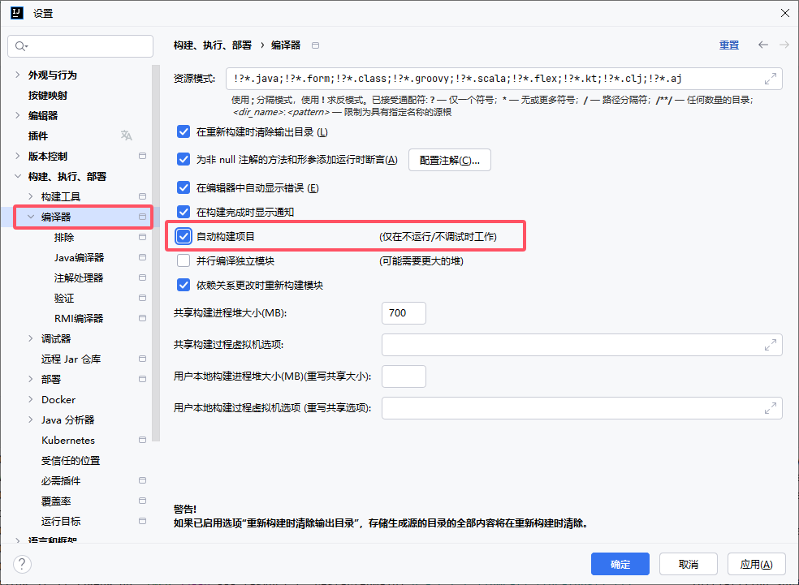

# Spring Boot DevTools

Spring Boot DevTools 是一个用于提高开发效率的工具，它在开发过程中提供了许多有用的功能，比如热部署、自动重启、缓存清理等，可以帮助开发者更快速地进行调试和修改。使用 Spring Boot DevTools 在 IntelliJ IDEA 中，可以大大提升开发体验，尤其是在项目开发过程中需要频繁修改代码并测试的时候。


## 添加依赖

```xml
<!-- Spring Boot 开发工具包，自动重启、热部署等 -->
<dependency>
    <groupId>org.springframework.boot</groupId>
    <artifactId>spring-boot-devtools</artifactId>
    <scope>runtime</scope>
    <optional>true</optional>
</dependency>
```


## 手动触发热重启

点击项目模块的 `compile` 编译就会自动触发热重启


## 自动构建



