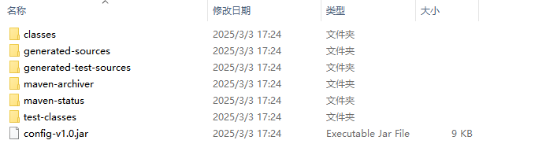
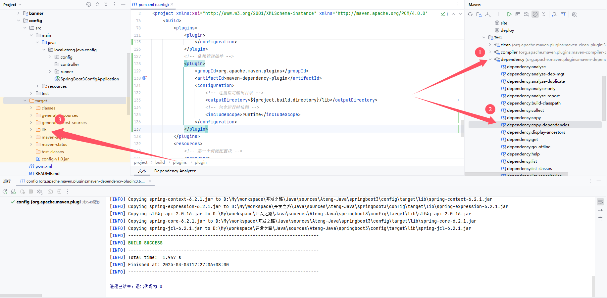

# 打包Jar：源码和依赖分离

在Maven项目打包中，将源码和依赖分离开，将源码打成Jar，依赖单独一个目录lib/

参考部署文档

- [Docker部署Jar](/work/docker/service/java/springboot2/)
- [Kubernetes部署Jar](/work/kubernetes/service/springboot-app/v1.1/)，对于k8s中部署，需要添加一个PVC挂载到Deployment中，首先在initContainers中判断是否存在/opt/app/lib目录，不存在就下载（提前将lib/打包上传到HTTP）并解压，然后containers中按照相应的参数启动服务。


## 编辑pom.xml文件

修改插件plugins配置，如下：

- maven-jar-plugin插件的mainClass参数按照实际情况修改

```xml
<plugins>
    <!-- Maven 编译插件 -->
    <plugin>
        <groupId>org.apache.maven.plugins</groupId>
        <artifactId>maven-compiler-plugin</artifactId>
        <version>${maven-compiler.version}</version>
        <configuration>
            <source>${java.version}</source>
            <target>${java.version}</target>
            <encoding>${project.build.sourceEncoding}</encoding>
            <!-- 编译参数 -->
            <compilerArgs>
                <!-- 启用Java 8参数名称保留功能 -->
                <arg>-parameters</arg>
            </compilerArgs>
        </configuration>
    </plugin>

    <!-- Spring Boot Maven 插件 -->
    <!--<plugin>
        <groupId>org.springframework.boot</groupId>
        <artifactId>spring-boot-maven-plugin</artifactId>
        <version>${spring-boot.version}</version>
        <executions>
            <execution>
                <id>repackage</id>
                <goals>
                    <goal>repackage</goal>
                </goals>
            </execution>
        </executions>
    </plugin>-->
    <!--maven-jar-plugin 直接打包源码（不包含依赖）-->
    <plugin>
        <groupId>org.apache.maven.plugins</groupId>
        <artifactId>maven-jar-plugin</artifactId>
        <configuration>
            <archive>
                <manifest>
                    <!-- 是否添加类路径信息 -->
                    <addClasspath>true</addClasspath>
                    <!-- 指定 Main-Class（可执行 JAR） -->
                    <mainClass>local.ateng.java.config.SpringBoot3ConfigApplication</mainClass>
                    <!-- 设置类路径前缀 -->
                    <classpathPrefix>lib/</classpathPrefix>
                </manifest>
            </archive>
        </configuration>
    </plugin>
    <!-- 依赖管理插件 -->
    <plugin>
        <groupId>org.apache.maven.plugins</groupId>
        <artifactId>maven-dependency-plugin</artifactId>
        <configuration>
            <!-- 这里指定输出目录 -->
            <outputDirectory>${project.build.directory}/lib</outputDirectory>
            <!-- 包含运行时依赖 -->
            <includeScope>runtime</includeScope>
        </configuration>
    </plugin>
</plugins>
```


## 打包源码

通过命令（mvn -DskipTests=true clean package）或者IDEA工具将源码打成Jar




## 拷贝依赖

使用命令：mvn dependency:copy-dependencies 

使用IDEA：



最终得到lib/，该目录是项目中所有依赖包。


## 使用

### 使用默认参数

将lib/依赖目录和源码jar拷贝到运行运行的服务器中，保持在同级目录中。

**Windows && Linux**

```
java -jar config-v1.0.jar
```

### 自定义参数

将lib/依赖目录和源码jar拷贝到运行运行的服务器中，使用-cp指定相关文件和mainClass

**Windows**

```
java -cp config-v1.0.jar;lib/* local.ateng.java.config.SpringBoot3ConfigApplication
```

**Linux**

```
java -cp config-v1.0.jar:lib/* local.ateng.java.config.SpringBoot3ConfigApplication
```

