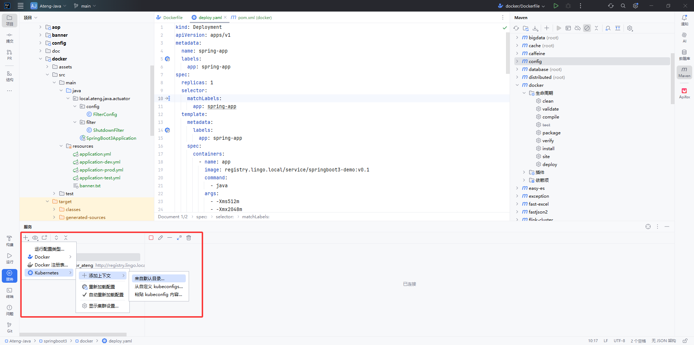
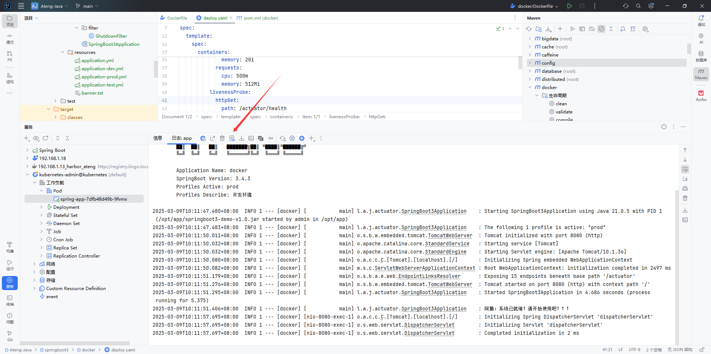

# Docker

Docker 是一个开源的容器化平台，通过容器技术实现应用的打包、分发和运行。它使开发者能够以一致的环境快速部署和扩展应用，无需关心底层系统差异。Docker 提供了轻量级、高性能的虚拟化方式，支持镜像管理和容器编排，是 DevOps 和微服务架构的核心工具之一。

通过 `IntelliJ IDEA` 将源码打包后制作容器镜像，最终部署在服务器上。

- [官网链接](https://www.docker.com/)
- [安装文档](https://kongyu666.github.io/ops/#/work/docker/deploy/v27.3.1/)


## 安装Docker Desktop

进入[官网](https://www.docker.com/)，下载Windows的Docker Desktop并安装

安装完后查看版本


## IDEA添加Docker服务端

### 添加服务器


### 添加Docker服务端


### 添加镜像仓库

以我这里的Harbor仓库为例：


## 运行Dockerfile

### 创建Maven的运行配置

该步骤只是为了打Jar包，如果是单体项目就可以跳过该步骤，如果是多模块项目可以参考该步骤对单个模块打包。

#### 添加配置

点击编辑配置


添加Maven配置


#### 创建clean

多模块项目请使用以下命令

```
clean -DskipTests -pl ateng-gateway -f pom.xml
```

子模块的子模块下使用以下命令

```
clean -DskipTests -pl ateng-modules/ateng-modules-system -f pom.xml
```

- `-pl ateng-modules/ateng-modules-system`: 指定构建的模块为 `ateng-modules/ateng-modules-system`。


#### 创建install

多模块项目请使用以下命令

```
clean install -Ptest -DskipTests -pl ateng-gateway -am -f pom.xml
```

子模块的子模块下使用以下命令

```
clean install -Ptest -DskipTests -pl ateng-modules/ateng-modules-system -am -f pom.xml
```

- `-Ptest`: 激活 `test` Maven profile。
- `-pl ModulesName`: 指定构建的模块为 `ateng-modules/ateng-modules-system`。
- `-am`: 同时构建 `ateng-modules/ateng-modules-system` 模块的所有依赖模块。


#### 打包Jar


### 创建Dockerfile的运行配置

#### 添加配置

打开 `Dockerfile` 后右键点击 `修改运行配置...`


设置镜像参数


### 运行Dockerfile

#### 编辑Dockerfile文件

在项目的根目录创建Dockerfile文件

```dockerfile
# 环境
FROM registry.lingo.local/service/java:debian12_temurin_openjdk-jdk-21-jre

# 定义变量
ARG JAR_FILE=springboot3-demo-v1.0.jar

# 设置工作目录并拷贝数据
WORKDIR /opt/app
COPY --chown=1001:1001 ${JAR_FILE} ${JAR_FILE}

# 设置暴露的端口号
EXPOSE 8080

# 设置启动命令
ENTRYPOINT ["java"]
CMD ["-server", "-Xms128m", "-Xmx1024m", "-jar", "springboot3-demo-v1.0.jar", "--server.port=8080"]
```

#### 运行

注意服务器端需要提前拉取该基础镜像


#### 推送到镜像仓库

右键点击 `推送镜像...`


## 部署到Kubernetes

### 准备软件包

参考以下链接下载软件包：

- kubectl
    - [下载官网链接](https://kubernetes.io/releases/download/#binaries)
    - [kubectl v1.32.2下载链接](https://cdn.dl.k8s.io/release/v1.32.2/bin/windows/amd64/kubelet.exe)

- helm
    - [helm v3.17.1下载链接](https://github.com/helm/helm/releases/tag/v3.17.1)

- kubeconfig
    - 将Kubernetes节点上的 `~/.kube/config` 配置文件拷贝出来，注意修改配置文件的服务地址(kube-apiserver)
    - 自定义用户的kubeconfig参考[链接](https://kongyu666.github.io/ops/#/work/kubernetes/OPS?id=%e5%88%9b%e5%bb%ba%e7%94%a8%e6%88%b7%e5%b9%b6%e5%af%bc%e5%87%bakubeconfig)，如果导入了多个集群的配置最好是自定义用户，因为全部导入默认的kubeconfig名称都是一样的，就会导致IDEA名称重复，在自定义时保证各个集群的名字是唯一的即可

### IDEA配置Kubernetes

#### 基础配置


#### 服务添加Kubernetes



#### 创建deploy.yaml

```yaml
kind: Deployment
apiVersion: apps/v1
metadata:
  name: spring-app
  labels:
    app: spring-app
spec:
  replicas: 1
  selector:
    matchLabels:
      app: spring-app
  template:
    metadata:
      labels:
        app: spring-app
    spec:
      containers:
        - name: app
          image: registry.lingo.local/service/springboot3-demo:v0.1
          command:
            - java
          args:
            - -Xms512m
            - -Xmx2048m
            - -jar
            - /opt/app/springboot3-demo-v1.0.jar
            - --server.port=8080
            - --spring.profiles.active=prod
          ports:
            - name: web
              containerPort: 8080
              protocol: TCP
          resources:
            limits:
              cpu: '2'
              memory: 2Gi
            requests:
              cpu: 500m
              memory: 512Mi
          livenessProbe:
            httpGet:
              path: /actuator/health
              port: 8080
              scheme: HTTP
            initialDelaySeconds: 30
            timeoutSeconds: 1
            periodSeconds: 10
            successThreshold: 1
            failureThreshold: 3
          readinessProbe:
            httpGet:
              path: /actuator/health
              port: 8080
              scheme: HTTP
            initialDelaySeconds: 10
            timeoutSeconds: 1
            periodSeconds: 10
            successThreshold: 1
            failureThreshold: 3
          imagePullPolicy: IfNotPresent
      terminationGracePeriodSeconds: 60
      affinity:
        podAntiAffinity:
          preferredDuringSchedulingIgnoredDuringExecution:
            - podAffinityTerm:
                labelSelector:
                  matchLabels:
                    app: spring-app
                topologyKey: kubernetes.io/hostname
              weight: 1
        nodeAffinity:
          preferredDuringSchedulingIgnoredDuringExecution:
            - preference:
                matchExpressions:
                  - key: kubernetes.service/spring-app
                    operator: In
                    values:
                      - "true"
              weight: 1
---
apiVersion: v1
kind: Service
metadata:
  name: spring-app-service
  labels:
    app: spring-app
spec:
  type: NodePort
  selector:
    app: spring-app
  ports:
  - name: web
    protocol: TCP
    port: 8080
    targetPort: 8080
    nodePort: 30808
```

#### 应用配置

打开deploy.yaml配置，右键应用，然后设置上下文配置文件就创建应用到k8s集群中了。


#### 查看日志



#### 使用服务

访问service暴露的NodePort端口：30808

访问actuator

```
http://192.168.1.10:30808/actuator/info
```


