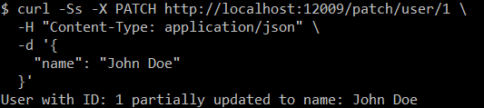

# HTTP接口

关于在SpringBoot3中使用HTTP接口

| 请求方法   | 描述                                   | 用途                                           |
| ---------- | -------------------------------------- | ---------------------------------------------- |
| **GET**    | 请求获取资源。                         | 获取单个或多个资源，数据读取操作。             |
| **POST**   | 提交数据给服务器，通常用于创建资源。   | 创建新资源（例如，提交表单数据或创建新记录）。 |
| **PUT**    | 更新资源，通常用于替换资源的全部内容。 | 替换或更新资源的所有字段（幂等）。             |
| **DELETE** | 删除资源。                             | 删除指定的资源（幂等）。                       |
| **PATCH**  | 部分更新资源。                         | 更新资源的部分字段（通常用于只更新某些字段）。 |

## 基础配置

### 依赖配置

```xml
<?xml version="1.0" encoding="UTF-8"?>
<project xmlns:xsi="http://www.w3.org/2001/XMLSchema-instance" xmlns="http://maven.apache.org/POM/4.0.0"
         xsi:schemaLocation="http://maven.apache.org/POM/4.0.0 https://maven.apache.org/xsd/maven-4.0.0.xsd">
    <!-- 项目模型版本 -->
    <modelVersion>4.0.0</modelVersion>

    <!-- 项目坐标 -->
    <groupId>local.ateng.java</groupId>
    <artifactId>http-interface</artifactId>
    <version>v1.0</version>
    <name>http-interface</name>
    <description>SpringBoot3 HTTP接口相关的模块</description>

    <!-- 项目属性 -->
    <properties>
        <java.version>21</java.version>
        <project.build.sourceEncoding>UTF-8</project.build.sourceEncoding>
        <project.reporting.outputEncoding>UTF-8</project.reporting.outputEncoding>
        <spring-boot.version>3.4.1</spring-boot.version>
        <maven-compiler.version>3.12.1</maven-compiler.version>
        <lombok.version>1.18.36</lombok.version>
    </properties>

    <!-- 项目依赖 -->
    <dependencies>
        <!-- Spring Boot Web Starter: 包含用于构建Web应用程序的Spring Boot依赖项 -->
        <dependency>
            <groupId>org.springframework.boot</groupId>
            <artifactId>spring-boot-starter-web</artifactId>
            <exclusions>
                <exclusion>
                    <artifactId>spring-boot-starter-tomcat</artifactId>
                    <groupId>org.springframework.boot</groupId>
                </exclusion>
            </exclusions>
        </dependency>
        <!-- Web 容器使用 undertow 性能更强 -->
        <dependency>
            <groupId>org.springframework.boot</groupId>
            <artifactId>spring-boot-starter-undertow</artifactId>
        </dependency>

        <!-- Spring Boot Starter Test: 包含用于测试Spring Boot应用程序的依赖项 -->
        <dependency>
            <groupId>org.springframework.boot</groupId>
            <artifactId>spring-boot-starter-test</artifactId>
            <scope>test</scope>
        </dependency>

        <!-- Lombok: 简化Java代码编写的依赖项 -->
        <!-- https://mvnrepository.com/artifact/org.projectlombok/lombok -->
        <dependency>
            <groupId>org.projectlombok</groupId>
            <artifactId>lombok</artifactId>
            <version>${lombok.version}</version>
            <scope>provided</scope>
        </dependency>

    </dependencies>

    <!-- Spring Boot 依赖管理 -->
    <dependencyManagement>
        <dependencies>
            <dependency>
                <groupId>org.springframework.boot</groupId>
                <artifactId>spring-boot-dependencies</artifactId>
                <version>${spring-boot.version}</version>
                <type>pom</type>
                <scope>import</scope>
            </dependency>
        </dependencies>
    </dependencyManagement>

    <!-- 插件仓库配置 -->
    <repositories>
        <!-- Central Repository -->
        <repository>
            <id>central</id>
            <name>阿里云中央仓库</name>
            <url>https://maven.aliyun.com/repository/central</url>
            <!--<name>Maven官方中央仓库</name>
            <url>https://repo.maven.apache.org/maven2/</url>-->
        </repository>
    </repositories>

    <!-- 构建配置 -->
    <build>
        <finalName>${project.name}-${project.version}</finalName>
        <plugins>
            <!-- Maven 编译插件 -->
            <plugin>
                <groupId>org.apache.maven.plugins</groupId>
                <artifactId>maven-compiler-plugin</artifactId>
                <version>${maven-compiler.version}</version>
                <configuration>
                    <source>${java.version}</source>
                    <target>${java.version}</target>
                    <encoding>${project.build.sourceEncoding}</encoding>
                    <!-- 编译参数 -->
                    <compilerArgs>
                        <!-- 启用Java 8参数名称保留功能 -->
                        <arg>-parameters</arg>
                    </compilerArgs>
                </configuration>
            </plugin>

            <!-- Spring Boot Maven 插件 -->
            <plugin>
                <groupId>org.springframework.boot</groupId>
                <artifactId>spring-boot-maven-plugin</artifactId>
                <version>${spring-boot.version}</version>
                <executions>
                    <execution>
                        <id>repackage</id>
                        <goals>
                            <goal>repackage</goal>
                        </goals>
                    </execution>
                </executions>
            </plugin>
        </plugins>
        <resources>
            <!-- 第一个资源配置块 -->
            <resource>
                <directory>src/main/resources</directory>
                <filtering>false</filtering>
            </resource>
            <!-- 第二个资源配置块 -->
            <resource>
                <directory>src/main/resources</directory>
                <includes>
                    <include>application*</include>
                    <include>bootstrap*.yml</include>
                    <include>common*</include>
                    <include>banner*</include>
                </includes>
                <filtering>true</filtering>
            </resource>
        </resources>
    </build>

</project>
```

### 编辑配置文件

```yaml
server:
  port: 12009
  servlet:
    context-path: /
spring:
  main:
    web-application-type: servlet
  application:
    name: ${project.artifactId}
---
```

### Undertow配置

```java
package local.ateng.java.http.config;

import io.undertow.UndertowOptions;
import io.undertow.server.DefaultByteBufferPool;
import io.undertow.websockets.jsr.WebSocketDeploymentInfo;
import org.springframework.boot.web.embedded.undertow.UndertowServletWebServerFactory;
import org.springframework.boot.web.server.WebServerFactoryCustomizer;
import org.springframework.context.annotation.Configuration;

/**
 * Undertow 服务器配置
 *
 * @author 孔余
 * @email 2385569970@qq.com
 * @since 2025-02-10
 */
@Configuration
public class UndertowConfig implements WebServerFactoryCustomizer<UndertowServletWebServerFactory> {
    private final int core = Runtime.getRuntime().availableProcessors();

    @Override
    public void customize(UndertowServletWebServerFactory factory) {
        // 定制 Undertow 服务器的构建器
        factory.addBuilderCustomizers(builder -> {
            // 设置IO线程数
            builder.setIoThreads(core * 2);
            // 设置工作线程数
            builder.setWorkerThreads(core * 2 * 4);
            // 设置缓冲区大小
            builder.setBufferSize(1024);
            // 设置是否直接使用Buffers
            builder.setDirectBuffers(true);
            // 启用HTTP/2
            builder.setServerOption(UndertowOptions.ENABLE_HTTP2, true);
            // 设置最大HTTP POST请求大小
            builder.setServerOption(UndertowOptions.MAX_ENTITY_SIZE, 10 * 1024 * 1024L); // 10MB
        });
        // 定制 WebSocket 的部署信息
        factory.addDeploymentInfoCustomizers(deploymentInfo -> {
            WebSocketDeploymentInfo webSocketDeploymentInfo = new WebSocketDeploymentInfo();
            webSocketDeploymentInfo.setBuffers(new DefaultByteBufferPool(true, 1024));
            deploymentInfo.addServletContextAttribute("io.undertow.websockets.jsr.WebSocketDeploymentInfo", webSocketDeploymentInfo);
        });
    }
}
```

### 创建实体类

```java
package local.ateng.java.http.entity;

import lombok.Data;

import java.io.Serial;
import java.io.Serializable;
import java.math.BigDecimal;
import java.time.LocalDate;
import java.time.LocalDateTime;

@Data
public class MyUser implements Serializable {

    @Serial
    private static final long serialVersionUID = 1L;

    /**
     * 主键id
     */
    private Long id;

    /**
     * 名称
     */
    private String name;

    /**
     * 年龄
     */
    private Integer age;

    /**
     * 分数
     */
    private BigDecimal score;

    /**
     * 生日
     */
    private LocalDate birthday;

    /**
     * 所在省份
     */
    private String province;

    /**
     * 创建时间
     */
    private LocalDateTime createTime;

}
```


## GET 请求

GET方法用于请求获取指定资源。它是一个安全、幂等的请求方法，意味着它不会改变服务器的状态，并且可以多次调用而不产生副作用。常用于获取数据。

### 创建类

```java
package local.ateng.java.http.controller;

import org.springframework.web.bind.annotation.*;

@RestController
@RequestMapping("/get")
public class GetController {
}
```

### 路径参数

```java
    // 获取单个用户，路径参数
    @GetMapping("/user/{id}")
    public String getUserByPath(@PathVariable Long id) {
        return "User with ID: " + id;
    }
```

请求接口

```
curl -L -X GET http://localhost:12009/get/user/1
```


### 请求参数

```java
    // 获取单个用户，请求参数
    @GetMapping("/user")
    public String getUserByParam(@RequestParam Long id) {
        return "User with ID: " + id;
    }
```

请求接口

```
curl -L -X GET http://localhost:12009/get/user?id=1
```


### 无参数

```java
    // 获取单个用户，无参数
    @GetMapping("/users")
    public String getAllUsers() {
        return "List of all users";
    }
```

请求接口

```
curl -L -X GET http://localhost:12009/get/users
```


## POST请求

POST方法用于提交数据给服务器，通常用于创建资源或提交表单数据。POST请求的请求体可以包含数据。

### 创建类

```java
package local.ateng.java.http.controller;

import local.ateng.java.http.entity.MyUser;
import org.springframework.web.bind.annotation.PostMapping;
import org.springframework.web.bind.annotation.RequestBody;
import org.springframework.web.bind.annotation.RequestMapping;
import org.springframework.web.bind.annotation.RestController;

@RestController
@RequestMapping("/post")
public class PostController {
}
```

### POST请求

```java
    // 创建新用户
    @PostMapping("/user")
    public String createUser(@RequestBody MyUser user) {
        return "User " + user.getName() + " created with age " + user.getAge();
    }
```

请求接口

```
curl -Ss -X POST http://localhost:12009/post/user \
  -H "Content-Type: application/json" \
  -d '{
    "name": "John Doe",
    "age": 25,
    "score": 88.5,
    "birthday": "1999-05-15",
    "province": "California",
    "createTime": "2025-02-10T14:30:00"
  }'
```


## PUT请求

PUT方法用于更新指定资源，它是幂等的，这意味着无论请求多少次，结果都是相同的。常用于替换或更新现有资源。

### 创建类

```java
package local.ateng.java.http.controller;

import local.ateng.java.http.entity.MyUser;
import org.springframework.web.bind.annotation.*;

@RestController
@RequestMapping("/put")
public class PutController {
}
```

### PUT请求

```java
    // 更新用户信息
    @PutMapping("/user/{id}")
    public String updateUser(@PathVariable Long id, @RequestBody MyUser user) {
        return "User with ID: " + id + " updated to name: " + user.getName() + " and age: " + user.getAge();
    }
```

请求接口

```
curl -Ss -X PUT http://localhost:12009/put/user/1 \
  -H "Content-Type: application/json" \
  -d '{
    "name": "John Doe",
    "age": 25,
    "score": 88.5,
    "birthday": "1999-05-15",
    "province": "California",
    "createTime": "2025-02-10T14:30:00"
  }'
```


## DELETE请求

DELETE方法用于删除指定资源。它同样是幂等的，调用多次不会产生不同的效果。常用于删除服务器上的资源。

### 创建类

```java
package local.ateng.java.http.controller;

import org.springframework.web.bind.annotation.DeleteMapping;
import org.springframework.web.bind.annotation.PathVariable;
import org.springframework.web.bind.annotation.RequestMapping;
import org.springframework.web.bind.annotation.RestController;

@RestController
@RequestMapping("/delete")
public class DeleteController {
}
```

### DELETE请求

```java
    // 删除用户
    @DeleteMapping("/user/{id}")
    public String deleteUser(@PathVariable Long id) {
        return "User with ID: " + id + " deleted.";
    }
```

请求接口

```
curl -Ss -X DELETE http://localhost:12009/delete/user/1
```


## PATCH请求

PATCH方法用于部分更新资源，通常用于修改资源的部分字段。与PUT不同，PATCH不要求提交完整的资源数据，仅更新提供的字段。

### 创建类

```java
package local.ateng.java.http.controller;

import local.ateng.java.http.entity.MyUser;
import org.springframework.web.bind.annotation.*;

@RestController
@RequestMapping("/patch")
public class PatchController {
}
```

### PATCH请求

```java
    // 创建新用户
    @PostMapping("/user")
    public MyUser createUser(@RequestBody MyUser user) {
        return user;
    }
```

请求接口

```
curl -Ss -X PATCH http://localhost:12009/patch/user/1 \
  -H "Content-Type: application/json" \
  -d '{
    "name": "John Doe"
  }'
```




## 上传文件

### 设置上传文件大小

```yaml
# 配置文件上传大小限制
spring:
  servlet:
    multipart:
      max-file-size: 10MB
      max-request-size: 10MB
      resolve-lazily: true # 开启 multipart 懒加载
```

### 创建类

```java
package local.ateng.java.http.controller;

import local.ateng.java.http.entity.MyUser;
import org.springframework.http.ResponseEntity;
import org.springframework.web.bind.annotation.*;
import org.springframework.web.multipart.MultipartFile;

import java.util.List;

@RestController
@RequestMapping("/file")
public class FileController {
}
```

### 上传单个文件

```java
    // 上传单个文件
    @PostMapping("/upload")
    public String uploadFile(@RequestParam("file") MultipartFile file) {
        // 获取文件名
        String fileName = file.getOriginalFilename();

        return "File uploaded successfully: " + fileName;
    }
```

请求接口

```
curl -Ss -X POST http://localhost:12009/file/upload \
  -H "Content-Type: multipart/form-data" \
  -F "file=@c:/tree.jpg"
```


### 上传文件和其他字段

上传文件和其他字段（例如描述）

```java
    // 上传文件和其他字段（例如描述）
    @PostMapping("/uploadWithFields")
    public String uploadFileWithFields(@RequestParam("file") MultipartFile file,
                                       @RequestParam("description") String description) {
        String fileName = file.getOriginalFilename();
        return "File " + fileName + " uploaded with description: " + description;
    }
```

请求接口

```
curl -Ss -X POST http://localhost:12009/file/uploadWithFields \
  -H "Content-Type: multipart/form-data" \
  -F "file=@c:/tree.jpg" \
  -F "description=this is my file"
```


### 上传文件和实体类

```java
    // 上传文件和实体类
    @PostMapping("/uploadWithJson")
    public String uploadFileWithJson(@RequestPart("file") MultipartFile file,
                                       @RequestPart("user") MyUser user) {
        String fileName = file.getOriginalFilename();
        return "File " + fileName + " uploaded with user: " + user;
    }
```

请求接口

- 参考：[地址](https://www.cnblogs.com/Jason-Xiang/p/14611447.html)

- 需要将user的json内容写入到文件中，然后就可以使用curl命令上传

### 上传多个文件

```java
    // 上传多个文件
    @PostMapping("/uploadMultiple")
    public String uploadMultipleFiles(@RequestParam("files") List<MultipartFile> files) {
        StringBuilder fileNames = new StringBuilder();

        // 遍历所有上传的文件
        for (MultipartFile file : files) {
            fileNames.append(file.getOriginalFilename()).append(", ");
        }

        return "Uploaded files: " + fileNames;
    }
```

调用接口

```
curl -Ss -X POST http://localhost:12009/file/uploadMultiple \
  -H "Content-Type: multipart/form-data" \
  -F "files=@c:/tree.jpg" \
  -F "files=@d:/Temp/2025/202502/20250206/README.md"
```


## 下载文件

### 流式下载文件

```java
    /**
     * 导出CSV数据接口
     *
     * 流式生成包含10万条记录的CSV文件，支持断点续传和客户端中断检测
     *
     * @param response HttpServletResponse对象，用于设置响应头和获取输出流
     */
    @GetMapping("/export-csv")
    public void exportCsvData(HttpServletResponse response) {
        // 设置响应类型为CSV文件下载
        response.setContentType("text/csv; charset=UTF-8");
        response.setHeader("Content-Disposition",
                "attachment; filename=csv_export_" + System.currentTimeMillis() + ".csv");

        // 创建流式响应体
        StreamingResponseBody stream = outputStream -> {
            try {
                // 写入CSV文件头
                String header = "ID,名称,描述\n";
                outputStream.write(header.getBytes(StandardCharsets.UTF_8));

                // 分批生成数据并写入输出流
                for (int i = 1; i <= 1000000; i++) {
                    String row = i + ",名称" + i + ",描述" + i + "\n";
                    try {
                        outputStream.write(row.getBytes(StandardCharsets.UTF_8));
                    } catch (IOException e) {
                        handleIOException(e);
                        break; // 发生写入异常时终止循环
                    }

                    // 每1000条刷新一次缓冲区
                    if (i % 1000 == 0) {
                        outputStream.flush();
                    }
                }

                // 最终刷新确保所有数据写入
                outputStream.flush();
            } catch (IOException e) {
                handleIOException(e);
            }
        };

        try {
            // 将流式响应写入响应输出流
            OutputStream os = response.getOutputStream();
            stream.writeTo(os);
        } catch (Exception e) {
            // 记录日志但不抛出异常，避免重复报错
            System.err.println("CSV导出过程中发生异常：" + e.getMessage());
        }
    }

    /**
     * 统一处理IO异常
     *
     * @param e 发生的IO异常对象
     */
    private void handleIOException(IOException e) {
        if (isClientAbortException(e)) {
            System.out.println("客户端已主动断开连接，终止数据导出");
        } else {
            System.err.println("CSV导出过程中发生IO异常：" + e.getMessage());
            e.printStackTrace();
        }
    }

    /**
     * 判断是否是客户端主动断开连接异常
     *
     * @param e 需要判断的异常对象
     * @return 如果是客户端断开异常返回true，否则返回false
     */
    private boolean isClientAbortException(IOException e) {
        Throwable cause = e;
        while (cause != null) {
            if (cause.getClass().getSimpleName().contains("ClientAbortException")) {
                return true;
            }
            cause = cause.getCause();
        }
        return false;
    }
```

调用接口

```
curl -Ss -X GET http://localhost:12009/file/export-csv
```


## 接口请求耗时记录

### 使用拦截器

#### 创建拦截器

```java
package local.ateng.java.http.interceptor;


import jakarta.servlet.http.HttpServletRequest;
import jakarta.servlet.http.HttpServletResponse;
import org.springframework.stereotype.Component;
import org.springframework.web.servlet.HandlerInterceptor;
import org.springframework.web.servlet.ModelAndView;

@Component
public class RequestTimeInterceptor implements HandlerInterceptor {

    // 在请求处理之前调用，记录开始时间
    @Override
    public boolean preHandle(HttpServletRequest request, HttpServletResponse response, Object handler) throws Exception {
        // 记录请求开始时间
        request.setAttribute("startTime", System.currentTimeMillis());
        return true;  // 继续执行下一个拦截器或者处理器
    }

    // 在请求处理之后调用，用于记录耗时
    @Override
    public void postHandle(HttpServletRequest request, HttpServletResponse response, Object handler,
                           ModelAndView modelAndView) throws Exception {
        // 计算请求耗时
        long startTime = (Long) request.getAttribute("startTime");
        long endTime = System.currentTimeMillis();
        long duration = endTime - startTime;

        // 打印日志
        System.out.println("Request URL: " + request.getRequestURL() + " | Duration: " + duration + " ms");
    }

    // 在请求处理完成之后调用
    @Override
    public void afterCompletion(HttpServletRequest request, HttpServletResponse response, Object handler,
                                Exception ex) throws Exception {
        // 可以做一些资源清理等工作
        request.removeAttribute("startTime");
    }
}
```

#### 注册拦截器

```java
package local.ateng.java.http.config;

import local.ateng.java.http.interceptor.RequestTimeInterceptor;
import org.springframework.beans.factory.annotation.Autowired;
import org.springframework.boot.autoconfigure.AutoConfiguration;
import org.springframework.context.annotation.Bean;
import org.springframework.context.annotation.Configuration;
import org.springframework.web.cors.CorsConfiguration;
import org.springframework.web.cors.UrlBasedCorsConfigurationSource;
import org.springframework.web.filter.CorsFilter;
import org.springframework.web.servlet.config.annotation.InterceptorRegistry;
import org.springframework.web.servlet.config.annotation.ResourceHandlerRegistry;
import org.springframework.web.servlet.config.annotation.WebMvcConfigurer;


/**
 * Web 配置
 *
 * @author 孔余
 * @email 2385569970@qq.com
 * @since 2025-02-10
 */
@Configuration
public class WebConfig implements WebMvcConfigurer {
    private final RequestTimeInterceptor requestTimeInterceptor;

    @Autowired
    public WebConfig(RequestTimeInterceptor requestTimeInterceptor) {
        this.requestTimeInterceptor = requestTimeInterceptor;
    }

    @Override
    public void addInterceptors(InterceptorRegistry registry) {
        // 注册拦截器，并配置拦截的路径
        registry.addInterceptor(requestTimeInterceptor)
                .addPathPatterns("/**");  // 拦截所有请求
    }

    @Override
    public void addResourceHandlers(ResourceHandlerRegistry registry) {
    }

    /**
     * 跨域配置
     */
    @Bean
    public CorsFilter corsFilter() {
        CorsConfiguration config = new CorsConfiguration();
        config.setAllowCredentials(true);
        // 设置访问源地址
        config.addAllowedOriginPattern("*");
        // 设置访问源请求头
        config.addAllowedHeader("*");
        // 设置访问源请求方法
        config.addAllowedMethod("*");
        // 有效期 1800秒
        config.setMaxAge(1800L);
        // 添加映射路径，拦截一切请求
        UrlBasedCorsConfigurationSource source = new UrlBasedCorsConfigurationSource();
        source.registerCorsConfiguration("/**", config);
        // 返回新的CorsFilter
        return new CorsFilter(source);
    }

}
```

访问接口后就出现如下日志：


### 使用监听器

```java
package local.ateng.java.http.listener;

import lombok.extern.slf4j.Slf4j;
import org.springframework.context.ApplicationListener;
import org.springframework.stereotype.Component;
import org.springframework.web.context.support.ServletRequestHandledEvent;

/**
 * 事件监听器：记录接口请求的处理耗时
 *
 * @author 孔余
 * @email 2385569970@qq.com
 * @since 2025-02-11
 */
@Component
@Slf4j
public class RequestTimingEventListener implements ApplicationListener<ServletRequestHandledEvent> {

    @Override
    public void onApplicationEvent(ServletRequestHandledEvent event) {
        // 获取请求失败的原因
        Throwable failureCause = event.getFailureCause();
        String failureMessage = (failureCause == null) ? "" : failureCause.getMessage();

        // 获取请求相关的信息
        String clientAddress = event.getClientAddress();
        String requestUrl = event.getRequestUrl();
        String method = event.getMethod();
        long processingTimeMillis = event.getProcessingTimeMillis();

        // 日志输出请求处理信息
        if (failureCause == null) {
            log.info("客户端地址: {}，请求路径: {}，请求方法: {}，处理耗时: {} 毫秒",
                    clientAddress, requestUrl, method, processingTimeMillis);
        } else {
            log.error("客户端地址: {}，请求路径: {}，请求方法: {}，处理耗时: {} 毫秒，错误信息: {}",
                    clientAddress, requestUrl, method, processingTimeMillis, failureMessage);
        }
    }
}
```


## 配置HTTPS

### 创建证书

**参考[openssl创建证书](https://kongyu666.github.io/ops/#/work/service/tls/tls-openssl/)，得到以下证书：**

生成服务端证书时注意修改 **dn** 和 **alt_names** 模块的内容，**alt_names**中需要填写会和服务端有交互的域名和IP

- ateng-ca.crt
- ateng-server.key
- ateng-server.crt

**将证书和私钥打包成 Java Keystore（PKCS12 格式）**

在Spring Boot中，我们通常使用 **PKCS12** 格式的密钥库，而不是传统的Java keystore格式。接下来，你需要将生成的证书和私钥合并成一个密钥库文件（例如 `ateng-server.p12`），以便Spring Boot使用。

```
openssl pkcs12 -export -in ateng-server.crt -inkey ateng-server.key -out ateng-server.p12 -name ateng-server
```

你会被要求输入导出密码，记得记住这个密码，因为在配置 Spring Boot 时需要用到。

### 配置HTTPS

将证书 ateng-server.p12  放在 `resources` 目录下

```yaml
---
# HTTPS 配置
server:
  ssl:
    key-store: classpath:ateng-server.p12
    key-store-password: Admin@123
    key-store-type: PKCS12
    key-alias: ateng-server
```

### 访问接口

```
curl -L --cacert ateng-ca.crt -X GET https://server:12009/get/user/1
```

