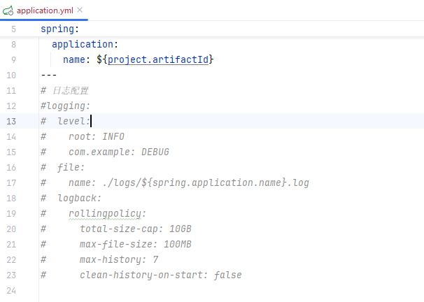
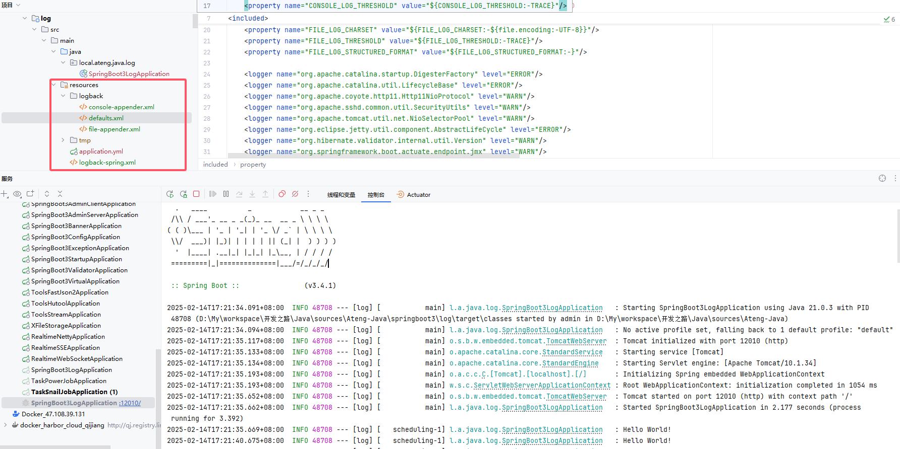
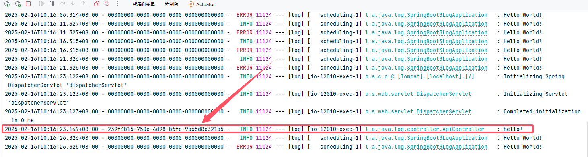

# 日志配置


## 配置文件使用日志

```yaml
---
# 日志配置
logging:
  level:
    root: INFO
    com.example: DEBUG
  file:
    name: ./logs/${spring.application.name}.log
  logback:
    rollingpolicy:
      total-size-cap: 10GB
      max-file-size: 100MB
      max-history: 7
      clean-history-on-start: false
```

明白了，下面是按你要求的格式重新整理的配置解释：

- **`logging.level.root: INFO`**：设置全局根日志级别为`INFO`，即所有未显式指定日志级别的类将使用`INFO`级别。
- **`logging.level.com.example: DEBUG`**：将`com.example`包的日志级别设置为`DEBUG`，表示该包下的类将输出`DEBUG`级别的日志。
- **`logging.file.name: ./logs/${spring.application.name}.log`**：设置日志文件的路径和名称，日志将被写入到`./logs/`目录，并以Spring Boot应用程序的名称命名日志文件。
- **`logging.logback.rollingpolicy.total-size-cap: 10GB`**：设置日志文件的最大总大小为`10GB`，当达到此大小时，日志将开始滚动并创建新文件。
- **`logging.logback.rollingpolicy.max-file-size: 100MB`**：每个日志文件的最大大小为`100MB`，超过此大小后，日志文件将滚动并创建新文件。
- **`logging.logback.rollingpolicy.max-history: 7`**：保留最多`7`个滚动历史日志文件，超过此数量的旧日志文件将被删除。
- **`logging.logback.rollingpolicy.clean-history-on-start: false`**：启动时不清理历史日志文件。如果设置为`true`，则每次应用启动时都会清除旧的历史日志文件。


## 使用Logback配置文件

在操作该步骤之前先将其他的日志配置注释或者删除。如下图所示：



### 基础配置

#### 创建默认设置

在 `resources` 目录下创建文件 `logback/defaults.xml`，可以根据实际需求修改参数

```xml
<?xml version="1.0" encoding="UTF-8"?>

<!--
Default logback configuration provided for import
-->

<included>
	<conversionRule conversionWord="applicationName" class="org.springframework.boot.logging.logback.ApplicationNameConverter"/>
	<conversionRule conversionWord="clr" class="org.springframework.boot.logging.logback.ColorConverter"/>
	<conversionRule conversionWord="correlationId" class="org.springframework.boot.logging.logback.CorrelationIdConverter"/>
	<conversionRule  conversionWord="esb" class="org.springframework.boot.logging.logback.EnclosedInSquareBracketsConverter" />
	<conversionRule conversionWord="wex" class="org.springframework.boot.logging.logback.WhitespaceThrowableProxyConverter" />
	<conversionRule conversionWord="wEx" class="org.springframework.boot.logging.logback.ExtendedWhitespaceThrowableProxyConverter" />

	<property name="CONSOLE_LOG_PATTERN" value="${CONSOLE_LOG_PATTERN:-%clr(%d{${LOG_DATEFORMAT_PATTERN:-yyyy-MM-dd'T'HH:mm:ss.SSSXXX}}){faint} %clr(${LOG_LEVEL_PATTERN:-%5p}){} %clr(${PID:-}){magenta} %clr(--- %esb(){APPLICATION_NAME}%esb{APPLICATION_GROUP}[%15.15t] ${LOG_CORRELATION_PATTERN:-}){faint}%clr(%-40.40logger{39}){cyan} %clr(:){faint} %m%n${LOG_EXCEPTION_CONVERSION_WORD:-%wEx}}"/>
	<property name="CONSOLE_LOG_CHARSET" value="${CONSOLE_LOG_CHARSET:-${file.encoding:-UTF-8}}"/>
	<property name="CONSOLE_LOG_THRESHOLD" value="${CONSOLE_LOG_THRESHOLD:-TRACE}"/>
	<property name="CONSOLE_LOG_STRUCTURED_FORMAT" value="${CONSOLE_LOG_STRUCTURED_FORMAT:-}"/>
	<property name="FILE_LOG_PATTERN" value="${FILE_LOG_PATTERN:-%d{${LOG_DATEFORMAT_PATTERN:-yyyy-MM-dd'T'HH:mm:ss.SSSXXX}} ${LOG_LEVEL_PATTERN:-%5p} ${PID:-} --- %esb(){APPLICATION_NAME}%esb{APPLICATION_GROUP}[%t] ${LOG_CORRELATION_PATTERN:-}%-40.40logger{39} : %m%n${LOG_EXCEPTION_CONVERSION_WORD:-%wEx}}"/>
	<property name="FILE_LOG_CHARSET" value="${FILE_LOG_CHARSET:-${file.encoding:-UTF-8}}"/>
	<property name="FILE_LOG_THRESHOLD" value="${FILE_LOG_THRESHOLD:-TRACE}"/>
	<property name="FILE_LOG_STRUCTURED_FORMAT" value="${FILE_LOG_STRUCTURED_FORMAT:-}"/>

	<logger name="org.apache.catalina.startup.DigesterFactory" level="ERROR"/>
	<logger name="org.apache.catalina.util.LifecycleBase" level="ERROR"/>
	<logger name="org.apache.coyote.http11.Http11NioProtocol" level="WARN"/>
	<logger name="org.apache.sshd.common.util.SecurityUtils" level="WARN"/>
	<logger name="org.apache.tomcat.util.net.NioSelectorPool" level="WARN"/>
	<logger name="org.eclipse.jetty.util.component.AbstractLifeCycle" level="ERROR"/>
	<logger name="org.hibernate.validator.internal.util.Version" level="WARN"/>
	<logger name="org.springframework.boot.actuate.endpoint.jmx" level="WARN"/>
</included>
```

#### 创建控制台设置

在 `resources` 目录下创建文件 `logback/console-appender.xml`

```xml
<?xml version="1.0" encoding="UTF-8"?>

<!--
Console appender logback configuration provided for import, equivalent to the programmatic
initialization performed by Boot
-->

<included>
	<appender name="CONSOLE" class="ch.qos.logback.core.ConsoleAppender">
		<filter class="ch.qos.logback.classic.filter.ThresholdFilter">
			<level>${CONSOLE_LOG_THRESHOLD}</level>
		</filter>
		<encoder>
			<pattern>${CONSOLE_LOG_PATTERN}</pattern>
			<charset>${CONSOLE_LOG_CHARSET}</charset>
		</encoder>
	</appender>
</included>
```

#### 配置 `logback-spring.xml` 文件

在 `resources` 目录下创建文件 `logback-spring.xml`

```xml
<?xml version="1.0" encoding="UTF-8"?>
<configuration>
    <include resource="logback/defaults.xml"/>
    <include resource="logback/console-appender.xml"/>
    <root level="INFO">
        <appender-ref ref="CONSOLE"/>
    </root>
</configuration>
```




### 日志文件配置

将日志保存到日志文件中

#### 创建日志文件设置

在 `resources` 目录下创建文件 `logback/file-appender.xml`，可以根据实际需求修改参数

```xml
<?xml version="1.0" encoding="UTF-8"?>

<!--
File appender logback configuration provided for import, equivalent to the programmatic
initialization performed by Boot
-->

<included>
	<appender name="FILE" class="ch.qos.logback.core.rolling.RollingFileAppender">
		<filter class="ch.qos.logback.classic.filter.ThresholdFilter">
			<level>${FILE_LOG_THRESHOLD}</level>
		</filter>
		<encoder>
			<pattern>${FILE_LOG_PATTERN}</pattern>
			<charset>${FILE_LOG_CHARSET}</charset>
		</encoder>
		<file>${LOG_FILE}</file>
		<rollingPolicy class="ch.qos.logback.core.rolling.SizeAndTimeBasedRollingPolicy">
			<fileNamePattern>${LOGBACK_ROLLINGPOLICY_FILE_NAME_PATTERN:-${LOG_FILE}.%d{yyyy-MM-dd}.%i.gz}</fileNamePattern>
			<cleanHistoryOnStart>${LOGBACK_ROLLINGPOLICY_CLEAN_HISTORY_ON_START:-false}</cleanHistoryOnStart>
			<maxFileSize>${LOGBACK_ROLLINGPOLICY_MAX_FILE_SIZE:-10MB}</maxFileSize>
			<totalSizeCap>${LOGBACK_ROLLINGPOLICY_TOTAL_SIZE_CAP:-0}</totalSizeCap>
			<maxHistory>${LOGBACK_ROLLINGPOLICY_MAX_HISTORY:-7}</maxHistory>
		</rollingPolicy>
	</appender>
</included>
```

#### 配置 `logback-spring.xml` 文件

修改文件 `logback-spring.xml`

```xml
<?xml version="1.0" encoding="UTF-8"?>
<configuration>
    <include resource="logback/defaults.xml"/>
    <property name="LOG_FILE" value="${LOG_FILE:-logs/${APPLICATION_NAME}.log}"/>
    <include resource="logback/console-appender.xml"/>
    <include resource="logback/file-appender.xml"/>
    <root level="INFO">
        <appender-ref ref="CONSOLE"/>
        <appender-ref ref="FILE"/>
    </root>
</configuration>
```


### 日志文件配置（ERROR日志）

将ERROR等级的日志保存到单独的日志文件中

#### 创建日志文件设置

在 `resources` 目录下创建文件 `logback/error-file-appender.xml`，可以根据实际需求修改参数

```xml
<?xml version="1.0" encoding="UTF-8"?>
<included>
    <appender name="ERROR_FILE" class="ch.qos.logback.core.rolling.RollingFileAppender">
        <filter class="ch.qos.logback.classic.filter.ThresholdFilter">
            <level>ERROR</level>
        </filter>
        <encoder>
            <pattern>${FILE_LOG_PATTERN}</pattern>
            <charset>${FILE_LOG_CHARSET}</charset>
        </encoder>
        <file>${LOG_ERROR_FILE}</file>
        <rollingPolicy class="ch.qos.logback.core.rolling.SizeAndTimeBasedRollingPolicy">
            <fileNamePattern>${LOGBACK_ROLLINGPOLICY_FILE_NAME_PATTERN:-${LOG_ERROR_FILE}.%d{yyyy-MM-dd}.%i.gz}</fileNamePattern>
            <cleanHistoryOnStart>${LOGBACK_ROLLINGPOLICY_CLEAN_HISTORY_ON_START:-false}</cleanHistoryOnStart>
            <maxFileSize>${LOGBACK_ROLLINGPOLICY_MAX_FILE_SIZE:-10MB}</maxFileSize>
            <totalSizeCap>${LOGBACK_ROLLINGPOLICY_TOTAL_SIZE_CAP:-0}</totalSizeCap>
            <maxHistory>${LOGBACK_ROLLINGPOLICY_MAX_HISTORY:-7}</maxHistory>
        </rollingPolicy>
    </appender>
</included>
```

#### 配置 `logback-spring.xml` 文件

修改文件 `logback-spring.xml`

```xml
<?xml version="1.0" encoding="UTF-8"?>
<configuration>
    <include resource="logback/defaults.xml"/>
    <property name="LOG_FILE" value="${LOG_FILE:-logs/${APPLICATION_NAME}.log}"/>
    <property name="LOG_ERROR_FILE" value="${LOG_ERROR_FILE:-logs/error/${APPLICATION_NAME}.log}"/>
    <include resource="logback/console-appender.xml"/>
    <include resource="logback/file-appender.xml"/>
    <include resource="logback/error-file-appender.xml"/>
    <root level="INFO">
        <appender-ref ref="CONSOLE"/>
        <appender-ref ref="FILE"/>
        <appender-ref ref="ERROR_FILE"/>
    </root>
</configuration>
```

### 异步日志输出

#### 异步日志配置

给每个Appender添加一个异步输出

```xml
<?xml version="1.0" encoding="UTF-8"?>
<configuration>
    <include resource="logback/defaults.xml"/>
    <property name="LOG_FILE" value="${LOG_FILE:-logs/${APPLICATION_NAME}.log}"/>
    <property name="LOG_ERROR_FILE" value="${LOG_ERROR_FILE:-logs/error/${APPLICATION_NAME}.log}"/>
    <include resource="logback/console-appender.xml"/>
    <include resource="logback/file-appender.xml"/>
    <include resource="logback/error-file-appender.xml"/>
    <!-- 异步日志输出 -->
    <appender name="ASYNC_CONSOLE" class="ch.qos.logback.classic.AsyncAppender">
        <appender-ref ref="CONSOLE"/>
    </appender>
    <appender name="ASYNC_FILE" class="ch.qos.logback.classic.AsyncAppender">
        <appender-ref ref="FILE"/>
    </appender>
    <appender name="ASYNC_ERROR_FILE" class="ch.qos.logback.classic.AsyncAppender">
        <appender-ref ref="ERROR_FILE"/>
    </appender>
    <root level="INFO">
        <appender-ref ref="ASYNC_CONSOLE"/>
        <appender-ref ref="ASYNC_FILE"/>
        <appender-ref ref="ASYNC_ERROR_FILE"/>
    </root>
</configuration>
```

#### 参数配置

```xml
<?xml version="1.0" encoding="UTF-8"?>
<configuration>
    <include resource="logback/defaults.xml"/>
    <property name="LOG_FILE" value="${LOG_FILE:-logs/${APPLICATION_NAME}.log}"/>
    <property name="LOG_ERROR_FILE" value="${LOG_ERROR_FILE:-logs/error/${APPLICATION_NAME}.log}"/>
    <include resource="logback/console-appender.xml"/>
    <include resource="logback/file-appender.xml"/>
    <include resource="logback/error-file-appender.xml"/>
    <!-- 异步日志输出 -->
    <appender name="ASYNC_CONSOLE" class="ch.qos.logback.classic.AsyncAppender">
        <appender-ref ref="CONSOLE"/>
    </appender>
    <appender name="ASYNC_FILE" class="ch.qos.logback.classic.AsyncAppender">
        <!-- 配置队列大小，默认是256 -->
        <queueSize>1024</queueSize>
        <!-- 配置丢弃阈值，单位是百分比，取值范围 0-100 -->
        <discardingThreshold>50</discardingThreshold>
        <!-- 配置最大刷新时间，单位毫秒 -->
        <maxFlushTime>1000</maxFlushTime>
        <!-- 引用控制台日志输出器 -->
        <appender-ref ref="FILE"/>
    </appender>
    <appender name="ASYNC_ERROR_FILE" class="ch.qos.logback.classic.AsyncAppender">
        <appender-ref ref="ERROR_FILE"/>
    </appender>
    <root level="INFO">
        <appender-ref ref="ASYNC_CONSOLE"/>
        <appender-ref ref="ASYNC_FILE"/>
        <appender-ref ref="ASYNC_ERROR_FILE"/>
    </root>
</configuration>
```

**参数说明**：

- **`queueSize`**：指定日志事件队列的大小。如果队列满了，日志事件将被丢弃或阻塞，具体行为取决于 `discardingThreshold` 的配置。
- **`discardingThreshold`**：设置为一个百分比（整数），表示当队列满时，丢弃日志事件的阈值。例如：`discardingThreshold` 设置为 `50` 表示，如果队列的使用率达到 50% 时，日志会被丢弃。
- **`maxFlushTime`**：设置日志事件最大刷新时间，单位为毫秒。当日志事件的刷新时间超过这个值时，异步日志输出器会强制刷新事件。
- **`appender-ref`**：仍然需要引用你实际的日志输出目标（如 `CONSOLE`、`FILE`、`ERROR_FILE` 等）。

### 多环境配置

多环境实现以下功能

- 默认日志只打印控制台，日志级别INFO
- dev环境只打印控制台，日志级别DEBUG
- test环境打印控制台和写入日志文件，日志级别INFO
- prod环境打印控制台和写入日志文件，日志级别WARN

```xml
<?xml version="1.0" encoding="UTF-8"?>
<configuration>
    <include resource="logback/defaults.xml"/>
    <property name="LOG_FILE" value="${LOG_FILE:-logs/${APPLICATION_NAME}.log}"/>
    <include resource="logback/console-appender.xml"/>
    <!-- 默认日志级别 -->
    <root level="INFO">
        <appender-ref ref="CONSOLE"/>
    </root>
    <!-- 多环境配置 -->
    <!-- 针对开发环境的日志级别 -->
    <springProfile name="dev">
        <!-- 对于开发环境，设置较低的日志级别，记录更多的日志信息 -->
        <logger name="com.example" level="WARN"/>
        <root level="DEBUG">
            <appender-ref ref="CONSOLE"/>
        </root>
    </springProfile>
    <!-- 针对测试环境的日志级别 -->
    <springProfile name="test">
        <include resource="logback/file-appender.xml"/>
        <!-- 对于测试环境，记录更多的日志信息，方便测试和调试 -->
        <logger name="com.example" level="WARN"/>
        <root level="INFO">
            <appender-ref ref="CONSOLE"/>
            <appender-ref ref="FILE"/>
        </root>
    </springProfile>
    <!-- 针对生产环境的日志级别 -->
    <springProfile name="prod">
        <include resource="logback/file-appender.xml"/>
        <!-- 对于生产环境，只记录关键信息 -->
        <logger name="com.example" level="WARN"/>
        <root level="WARN">
            <appender-ref ref="CONSOLE"/>
            <appender-ref ref="FILE"/>
        </root>
    </springProfile>
</configuration>
```

在 `application.yml` 设置项目的环境

```yaml
spring:
  profiles:
    active: dev
```

### 动态日志级别调整

#### 添加依赖

```xml
<!-- Actuator 依赖 -->
<dependency>
    <groupId>org.springframework.boot</groupId>
    <artifactId>spring-boot-starter-actuator</artifactId>
</dependency>
```

#### 修改配置文件

在 application.yml 中启用日志级别端点

```yaml
---
# Actuator 监控端点的配置项
management:
  endpoints:
    web:
      exposure:
        include: loggers
```

#### 动态调整日志级别

通过以下 HTTP 请求，可以动态调整日志级别：

```shell
curl -X POST http://localhost:12010/actuator/loggers/local.ateng.java \
-H "Content-Type: application/json" \
-d '{"configuredLevel":"DEBUG"}'
```


## 输出到Logstash

### 添加依赖

```xml
        <!-- Logback to Logstash appender -->
        <dependency>
            <groupId>net.logstash.logback</groupId>
            <artifactId>logstash-logback-encoder</artifactId>
            <version>8.0</version>
        </dependency>
```

### 创建 `logstash-appender.xml`

```xml
<?xml version="1.0" encoding="UTF-8"?>
<configuration>

	<!-- Logback Appender for Logstash -->
	<appender name="LOGSTASH" class="net.logstash.logback.appender.LogstashTcpSocketAppender">

		<!-- Logstash接收日志的IP和端口 -->
		<destination>192.168.1.10:20678</destination>

		<!-- 编码器，用于将日志格式化为JSON -->
		<encoder class="net.logstash.logback.encoder.LogstashEncoder">
			<!-- 配置日志输出的字段 -->
			<fieldNames>
				<timestamp>timestamp</timestamp>
				<level>log_level</level>
				<logger>logger_name</logger>
				<message>log_message</message>
				<thread>thread_name</thread>
				<exception>exception</exception>
			</fieldNames>
			<customFields>{"app_name": "${APPLICATION_NAME}"}</customFields>  <!-- 可以自定义额外字段 -->
		</encoder>

	</appender>

</configuration>
```

#### 配置 `logback-spring.xml` 文件

修改文件 `logback-spring.xml`

```xml
<?xml version="1.0" encoding="UTF-8"?>
<configuration>
    <include resource="logback/defaults.xml"/>
    <include resource="logback/console-appender.xml"/>
    <include resource="logback/logstash-appender.xml"/>
    <root level="INFO">
        <appender-ref ref="CONSOLE"/>
        <appender-ref ref="LOGSTASH"/>
    </root>
</configuration>
```

## 使用MDC实现TRACE_ID

使用MDC（Mapped Diagnostic Context）来实现TRACE_ID的功能通常是为了在日志中追踪请求的链路。MDC是一个与线程绑定的日志上下文，可以用于在日志中插入一些特定的信息，比如请求ID（如TRACE_ID），便于分布式系统中追踪单个请求的生命周期。

### 创建Filter

```java
package local.ateng.java.log.filter;

import jakarta.servlet.FilterChain;
import jakarta.servlet.ServletException;
import jakarta.servlet.http.HttpServletRequest;
import jakarta.servlet.http.HttpServletResponse;
import org.slf4j.MDC;
import org.springframework.web.filter.OncePerRequestFilter;

import java.io.IOException;
import java.util.UUID;

/**
 * 使用MDC生成TRACE_ID
 * 在每个请求的开始处（例如，Filter中），你可以使用MDC.put方法生成并设置TRACE_ID。通常TRACE_ID可以从请求头中获取，或者如果没有可以自己生成一个。
 *
 * @author 孔余
 * @email 2385569970@qq.com
 * @since 2025-02-16
 */
public class TraceIdFilter extends OncePerRequestFilter {

    @Override
    protected void doFilterInternal(HttpServletRequest request, HttpServletResponse response, FilterChain filterChain) throws ServletException, IOException {
        // 从请求头中获取TRACE_ID，如果没有则生成一个
        String traceId = request.getHeader("TRACE_ID");
        if (traceId == null) {
            traceId = UUID.randomUUID().toString();
        }

        // 将TRACE_ID放入MDC
        MDC.put("traceId", traceId);

        try {
            // 继续处理请求
            filterChain.doFilter(request, response);
        } finally {
            // 请求结束后清理MDC，避免内存泄漏
            MDC.remove("traceId");
        }
    }
}
```

### 创建Config

```java
package local.ateng.java.log.config;

import local.ateng.java.log.filter.TraceIdFilter;
import org.springframework.boot.web.servlet.FilterRegistrationBean;
import org.springframework.context.annotation.Bean;
import org.springframework.context.annotation.Configuration;

@Configuration
public class FilterConfig {

    @Bean
    public FilterRegistrationBean<TraceIdFilter> traceIdFilter() {
        FilterRegistrationBean<TraceIdFilter> registrationBean = new FilterRegistrationBean<>();
        registrationBean.setFilter(new TraceIdFilter());
        registrationBean.addUrlPatterns("/api/*"); // 仅针对某些请求
        return registrationBean;
    }
}
```

### 创建接口

```java
package local.ateng.java.log.controller;

import lombok.extern.slf4j.Slf4j;
import org.springframework.web.bind.annotation.GetMapping;
import org.springframework.web.bind.annotation.RequestMapping;
import org.springframework.web.bind.annotation.RestController;

@RestController
@RequestMapping("/api")
@Slf4j
public class ApiController {

    @GetMapping("/demo")
    public String demo() {
        log.info("hello!");
        return "ok";
    }

}
```

### 创建TRACE_ID日志配置文件

在 `resources` 目录下创建文件 `logback/traceId-console-appender.xml`

```xml
<?xml version="1.0" encoding="UTF-8"?>
<included>
	<property name="CONSOLE_LOG_PATTERN" value="%clr(%d{${LOG_DATEFORMAT_PATTERN:-yyyy-MM-dd'T'HH:mm:ss.SSSXXX}}){faint} - %X{traceId:-00000000-0000-0000-0000-000000000000} -  %clr(${LOG_LEVEL_PATTERN:-%5p}){} %clr(${PID:-}){magenta} %clr(--- %esb(){APPLICATION_NAME}%esb{APPLICATION_GROUP}[%15.15t] ${LOG_CORRELATION_PATTERN:-}){faint}%clr(%-40.40logger{39}){cyan} %clr(:){faint} %m%n${LOG_EXCEPTION_CONVERSION_WORD:-%wEx}"/>
	<property name="FILE_LOG_PATTERN" value="%d{${LOG_DATEFORMAT_PATTERN:-yyyy-MM-dd'T'HH:mm:ss.SSSXXX}} - %X{traceId:-00000000-0000-0000-0000-000000000000} -  ${LOG_LEVEL_PATTERN:-%5p} ${PID:-} --- %esb(){APPLICATION_NAME}%esb{APPLICATION_GROUP}[%t] ${LOG_CORRELATION_PATTERN:-}%-40.40logger{39} : %m%n${LOG_EXCEPTION_CONVERSION_WORD:-%wEx}"/>
	<appender name="TRACE_ID_CONSOLE" class="ch.qos.logback.core.ConsoleAppender">
		<filter class="ch.qos.logback.classic.filter.ThresholdFilter">
			<level>${CONSOLE_LOG_THRESHOLD}</level>
		</filter>
		<encoder>
			<pattern>${CONSOLE_LOG_PATTERN}</pattern>
			<charset>${CONSOLE_LOG_CHARSET}</charset>
		</encoder>
	</appender>
</included>
```

### 配置 `logback-spring.xml` 文件

修改文件 `logback-spring.xml`

```xml
<?xml version="1.0" encoding="UTF-8"?>
<configuration>
    <include resource="logback/defaults.xml"/>
    <include resource="logback/traceId-console-appender.xml"/>
    <root level="INFO">
        <appender-ref ref="TRACE_ID_CONSOLE"/>
    </root>
</configuration>
```

### 验证TRACE_ID

1. 访问接口：curl http://127.0.0.1:12010/api/demo
2. 查看日志的TRACE_ID


