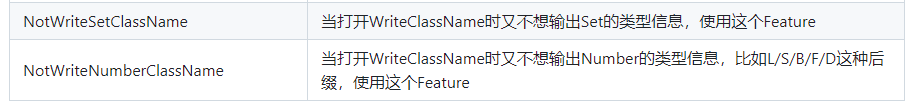

# FastJson1

fastjson是阿里巴巴的开源JSON解析库，它可以解析JSON格式的字符串，支持将Java Bean序列化为JSON字符串，也可以从JSON字符串反序列化到JavaBean。

- [官方文档](https://github.com/alibaba/fastjson/wiki/Quick-Start-CN)

| **应用场景**                       | **序列化**                  | **反序列化**              |
| ---------------------------------- | --------------------------- | ------------------------- |
| **Spring Boot API** 返回 JSON 响应 | Java 对象 → JSON            | 前端请求 JSON → Java 对象 |
| **数据库存储 JSON**                | Java 对象 → JSON 存储       | 读取 JSON → Java 对象     |
| **Redis 缓存**                     | Java 对象 → JSON 存入 Redis | 取出 JSON → Java 对象     |
| **消息队列（MQ）**                 | Java 对象 → JSON 发送       | 监听 JSON → Java 对象     |


## 基础配置

### 添加依赖

```xml
<properties>
    <fastjson.version>1.2.83</fastjson.version>
</properties>
<!-- 在 Spring 中集成 Fastjson2 -->
<dependencies>
    <!-- 高性能的JSON库 -->
    <dependency>
        <groupId>com.alibaba</groupId>
        <artifactId>fastjson</artifactId>
        <version>${fastjson.version}</version>
    </dependency>
</dependencies>
```


## Spring Web MVC序列化和反序列化

在Spring Boot Web应用中，JSON的序列化和反序列化操作通常通过`HttpMessageConverter`来实现。默认情况下，Spring Boot使用Jackson来处理JSON数据，但如果想使用Fastjson作为JSON处理工具，可以通过自定义配置来替换Spring Boot的默认`ObjectMapper`。Fastjson在处理大数据量时具备更高的性能，同时提供了更丰富的序列化特性，如格式化输出、嵌套对象处理和日期格式化等。通过配置`FastjsonHttpMessageConverter`，Spring Boot可以高效地序列化Java对象为JSON格式，也能将JSON字符串反序列化为Java对象。这种配置对于性能要求较高的应用非常有利，尤其是在处理大量数据交互时。

### 配置

```java
package local.ateng.java.serialize.config;

import com.alibaba.fastjson.parser.Feature;
import com.alibaba.fastjson.serializer.SerializerFeature;
import com.alibaba.fastjson.support.config.FastJsonConfig;
import com.alibaba.fastjson.support.spring.FastJsonHttpMessageConverter;
import local.ateng.java.serialize.serializer.DefaultValueFilter;
import org.springframework.context.annotation.Configuration;
import org.springframework.http.MediaType;
import org.springframework.http.converter.HttpMessageConverter;
import org.springframework.web.servlet.config.annotation.WebMvcConfigurer;

import java.nio.charset.StandardCharsets;
import java.util.Collections;
import java.util.List;

/**
 * 在 Spring Web MVC 中集成 Fastjson
 * https://github.com/alibaba/fastjson/wiki/%E5%9C%A8-Spring-%E4%B8%AD%E9%9B%86%E6%88%90-Fastjson
 *
 * @author 孔余
 * @email 2385569970@qq.com
 * @since 2025-09-29
 */
@Configuration
public class FastJsonWebMvcConfig implements WebMvcConfigurer {

    /**
     * 获取自定义的 FastJson HttpMessageConverter 配置
     * 主要用于 Spring Boot WebMVC 的序列化与反序列化
     *
     * @return FastJson HttpMessageConverter
     */
    private static FastJsonHttpMessageConverter getFastJsonHttpMessageConverter() {
        FastJsonHttpMessageConverter converter = new FastJsonHttpMessageConverter();
        FastJsonConfig config = new FastJsonConfig();
        config.setDateFormat("yyyy-MM-dd HH:mm:ss");
        config.setCharset(StandardCharsets.UTF_8);
        // 序列化配置
        config.setSerializerFeatures(
                // 输出为 null 的字段，否则默认会被忽略
                SerializerFeature.WriteMapNullValue,
                // String 类型为 null 时输出 ""
                SerializerFeature.WriteNullStringAsEmpty,
                // Number 类型为 null 时输出 0
                SerializerFeature.WriteNullNumberAsZero,
                // Boolean 类型为 null 时输出 false
                SerializerFeature.WriteNullBooleanAsFalse,
                // 集合类型为 null 时输出 []
                SerializerFeature.WriteNullListAsEmpty,
                // 禁用循环引用检测，避免出现 "$ref" 结构
                SerializerFeature.DisableCircularReferenceDetect,
                // BigDecimal 输出为纯字符串（不使用科学计数法）
                SerializerFeature.WriteBigDecimalAsPlain,
                // 浏览器安全输出，防止特殊字符被浏览器误解析
                SerializerFeature.BrowserCompatible
        );
        // 反序列化配置
        config.setFeatures(
                // 允许 JSON 中包含注释（// 或 /* */）
                Feature.AllowComment,
                // 允许字段名不加双引号
                Feature.AllowUnQuotedFieldNames,
                // 允许单引号作为字符串定界符
                Feature.AllowSingleQuotes,
                // 字段名使用常量池优化内存
                Feature.InternFieldNames,
                // 允许多余的逗号
                Feature.AllowArbitraryCommas,
                // 忽略 JSON 中不存在的字段
                Feature.IgnoreNotMatch,
                // 使用 BigDecimal 处理浮动精度，避免科学计数法的输出
                Feature.UseBigDecimal,
                // 允许 ISO 8601 日期格式（例如：2023-10-11T14:30:00Z）
                Feature.AllowISO8601DateFormat
        );
        config.setSerializeFilters(new DefaultValueFilter());
        converter.setFastJsonConfig(config);
        converter.setSupportedMediaTypes(Collections.singletonList(MediaType.APPLICATION_JSON));
        return converter;
    }

    @Override
    public void configureMessageConverters(List<HttpMessageConverter<?>> converters) {
        FastJsonHttpMessageConverter converter = getFastJsonHttpMessageConverter();
        converters.add(0, converter);
    }

}
```

### 使用

```java
package local.ateng.java.serialize.controller;

import com.alibaba.fastjson.JSONObject;
import local.ateng.java.serialize.entity.MyUser;
import org.springframework.web.bind.annotation.*;

import java.math.BigDecimal;
import java.time.LocalDate;
import java.time.LocalDateTime;
import java.util.Date;
import java.util.List;

@RestController
@RequestMapping("/fastjson")
public class FastjsonController {

    // 序列化
    @GetMapping("/serialize")
    public MyUser serialize() {
        return MyUser.builder()
                .id(1L)
                .name("ateng")
                .age(25)
                .phoneNumber("1762306666")
                .email("kongyu2385569970@gmail.com")
                .score(new BigDecimal("8800000000000000000000000000.911000000000000000000000"))
                .ratio(0.7147)
                .birthday(LocalDate.parse("2000-01-01"))
                .province("<")
                .city("重庆市")
                .createTime(LocalDateTime.now())
                .createTime2(new Date())
                .build();
    }

    // 反序列化
    @PostMapping("/deserialize")
    public String deserialize(@RequestBody MyUser myUser) {
        System.out.println(myUser);
        return "ok";
    }
    // 反序列化
    @PostMapping("/deserialize2")
    public String deserialize2(@RequestBody JSONObject myUser) {
        System.out.println(myUser);
        return "ok";
    }
    // 反序列化
    @PostMapping("/deserialize3")
    public String deserialize3(@RequestBody List<String> list) {
        System.out.println(list);
        return "ok";
    }

    // 反序列化
    @PostMapping("/test")
    public String test(@RequestBody String str) {
        System.out.println(str);
        JSONObject jsonObject = JSONObject.parseObject(str);
        System.out.println(jsonObject);
        System.out.println(jsonObject.getDouble("score"));
        System.out.println(JSONObject.parseObject(str, MyUser.class));
        return "ok";
    }

}

```

**访问序列化接口**

```
curl -X GET http://localhost:12013/fastjson/serialize
```

示例输出：

```json
{"age":25,"birthday":"2000-01-01 00:00:00","city":"重庆市","createTime":"2025-03-06 11:37:07","createTime2":"2025-03-06 11:37:07","createTime3":null,"email":"kongyu2385569970@gmail.com","id":1,"list":null,"name":"ateng","num":0,"phoneNumber":"1762306666","province":"<","ratio":0.7147,"score":"8800000000000000000000000000.911000000000000000000000"}
```

**访问反序列化接口**

```
curl -X POST http://192.168.100.2:12013/fastjson/deserialize \
     -H "Content-Type: application/json" \
     -d '{"age":25,"birthday":"2000-01-01 00:00:00","city":"重庆市","createTime":"2025-03-06 11:37:07","createTime2":"2025-03-06 11:37:07","createTime3":null,"email":"kongyu2385569970@gmail.com","id":1,"list":null,"name":"ateng","num":0,"phoneNumber":"1762306666","province":"<","ratio":0.7147,"score":"8800000000000000000000000000.911000000000000000000000"}'
```

控制台打印

```
MyUser(id=1, name=ateng, age=25, phoneNumber=1762306666, email=kongyu2385569970@gmail.com, score=8800000000000000000000000000.911000000000000000000000, ratio=0.7147, birthday=2000-01-01, province=<, city=重庆市, createTime=2025-03-06T11:37:07, createTime2=Thu Mar 06 11:37:07 CST 2025, createTime3=null, num=0, list=null)
```


## Spring Data Redis序列化和反序列化

在Spring Boot集成Redis时，数据的序列化与反序列化是至关重要的，通常通过`RedisTemplate`来完成。默认情况下，Spring Boot使用JDK的原生序列化方式或Jackson来序列化对象。如果需要使用Fastjson，可以自定义Redis的序列化机制，采用Fastjson进行高效的对象与JSON的转换。通过配置`RedisTemplate`的序列化器，开发者可以利用Fastjson对Redis中存储的对象进行序列化和反序列化。Fastjson在性能上相较于其他序列化库表现更优，尤其是在大规模数据访问时，可以显著提升应用性能，确保在分布式缓存系统中对数据的高效处理和快速响应。

### 配置（默认）

使用 `GenericFastJsonRedisSerializer` 这个有点小问题，一些类型会带有后缀，有些不便于开发修改数据，建议还是 自定义序列化器 配置。

```java
public GenericFastJsonRedisSerializer() {
    config.setReaderFeatures(JSONReader.Feature.SupportAutoType);
    config.setWriterFeatures(JSONWriter.Feature.WriteClassName);
}
```



```java
package local.ateng.java.serialize.config;

import com.alibaba.fastjson.support.spring.GenericFastJsonRedisSerializer;
import org.springframework.context.annotation.Bean;
import org.springframework.context.annotation.Configuration;
import org.springframework.data.redis.connection.RedisConnectionFactory;
import org.springframework.data.redis.core.RedisTemplate;
import org.springframework.data.redis.serializer.StringRedisSerializer;

/**
 * RedisTemplate 配置类
 *
 * <p>
 * 该类负责配置 RedisTemplate，允许对象进行序列化和反序列化。
 * 在这里，我们使用了 StringRedisSerializer 来序列化和反序列化 Redis 键，
 * 使用 FastJsonRedisSerializer 来序列化和反序列化 Redis 值，确保 Redis 能够存储 Java 对象。
 * </p>
 *
 * @author 孔余
 * @email 2385569970@qq.com
 * @since 2025-09-29
 */
@Configuration
public class RedisTemplateConfig {

    @Bean
    public RedisTemplate<String, Object> redisTemplate(RedisConnectionFactory redisConnectionFactory) {
        RedisTemplate redisTemplate = new RedisTemplate();
        redisTemplate.setConnectionFactory(redisConnectionFactory);

        /**
         * 使用StringRedisSerializer来序列化和反序列化redis的key值
         */
        StringRedisSerializer stringRedisSerializer = new StringRedisSerializer();
        redisTemplate.setKeySerializer(stringRedisSerializer);
        redisTemplate.setHashKeySerializer(stringRedisSerializer);

        /**
         * 使用Fastjson默认的Serializer来序列化和反序列化redis的value值
         */
        GenericFastJsonRedisSerializer fastJson2RedisSerializer = new GenericFastJsonRedisSerializer();
        redisTemplate.setValueSerializer(fastJson2RedisSerializer);
        redisTemplate.setHashValueSerializer(fastJson2RedisSerializer);

        // 返回redisTemplate
        redisTemplate.afterPropertiesSet();
        return redisTemplate;
    }

}

```

### 配置（自定义）

#### 配置序列化器

注意修改为自己的包名：`config.setReaderFilters(JSONReader.autoTypeFilter("local.ateng.java."));`

```java
package local.ateng.java.serialize.serializer;

import com.alibaba.fastjson.JSON;
import com.alibaba.fastjson.parser.Feature;
import com.alibaba.fastjson.parser.ParserConfig;
import com.alibaba.fastjson.serializer.SerializerFeature;
import com.alibaba.fastjson.util.IOUtils;
import org.springframework.data.redis.serializer.RedisSerializer;
import org.springframework.data.redis.serializer.SerializationException;

/**
 * 基于 Fastjson 1.x 的 Redis 序列化器
 * 适用于 Spring Data Redis 中的 value 序列化方案。
 * <p>
 * 说明：
 * - 支持类型信息输出（WriteClassName）
 * - 支持空值字段输出（WriteMapNullValue）
 * - 支持安全反序列化（白名单机制）
 * - 通用 UTF-8 编码
 *
 * @param <T> 序列化对象类型
 * @author 孔余
 * @since 2025-11-05
 */
public class FastJsonRedisSerializer<T> implements RedisSerializer<T> {

    private static final ParserConfig GLOBAL_PARSER_CONFIG = new ParserConfig();

    static {
        // 启用 AutoType 支持（反序列化时保留类型信息）
        GLOBAL_PARSER_CONFIG.setAutoTypeSupport(true);
        // 禁止 com.sun.、java.、org.apache. 等类被加载（防止安全漏洞）
        GLOBAL_PARSER_CONFIG.addDeny("java.");
        GLOBAL_PARSER_CONFIG.addDeny("javax.");
        GLOBAL_PARSER_CONFIG.addDeny("com.sun.");
        GLOBAL_PARSER_CONFIG.addDeny("sun.");
        GLOBAL_PARSER_CONFIG.addDeny("org.apache.");
        GLOBAL_PARSER_CONFIG.addDeny("org.springframework.");
        GLOBAL_PARSER_CONFIG.addDeny("com.alibaba.");
        GLOBAL_PARSER_CONFIG.addDeny("ognl.");
        GLOBAL_PARSER_CONFIG.addDeny("bsh.");
        GLOBAL_PARSER_CONFIG.addDeny("c3p0.");
        GLOBAL_PARSER_CONFIG.addDeny("net.sf.ehcache.");
        GLOBAL_PARSER_CONFIG.addDeny("org.yaml.");
        GLOBAL_PARSER_CONFIG.addDeny("org.hibernate.");
        GLOBAL_PARSER_CONFIG.addDeny("org.jboss.");
    }

    private final Class<T> clazz;

    public FastJsonRedisSerializer(Class<T> clazz) {
        this.clazz = clazz;
    }

    /**
     * 序列化：将对象转为 JSON 字节数组
     */
    @Override
    public byte[] serialize(T object) throws SerializationException {
        if (object == null) {
            return new byte[0];
        }
        try {
            return JSON.toJSONBytes(
                    object,
                    // 输出类型信息（反序列化时才能还原具体类）
                    SerializerFeature.WriteClassName,
                    // 输出为 null 的字段，否则默认会被忽略
                    SerializerFeature.WriteMapNullValue,
                    // 禁用循环引用检测，避免 $ref 结构
                    SerializerFeature.DisableCircularReferenceDetect,
                    // BigDecimal 输出为纯字符串，避免科学计数法
                    SerializerFeature.WriteBigDecimalAsPlain
            );
        } catch (Exception ex) {
            throw new SerializationException("Redis 序列化失败: " + ex.getMessage(), ex);
        }
    }

    /**
     * 反序列化：将 JSON 字节数组转回对象
     */
    @Override
    public T deserialize(byte[] bytes) throws SerializationException {
        if (bytes == null || bytes.length == 0) {
            return null;
        }
        try {
            return JSON.parseObject(
                    new String(bytes, IOUtils.UTF8),
                    clazz,
                    GLOBAL_PARSER_CONFIG,
                    // 忽略 JSON 中不存在的字段
                    Feature.IgnoreNotMatch,
                    // 支持 ISO8601 日期格式
                    Feature.AllowISO8601DateFormat
            );
        } catch (Exception ex) {
            throw new SerializationException("Redis 反序列化失败: " + ex.getMessage(), ex);
        }
    }
}

```

#### 配置序列化和反序列化

```java
package local.ateng.java.serialize.config;

import local.ateng.java.serialize.serializer.FastJsonRedisSerializer;
import org.springframework.context.annotation.Bean;
import org.springframework.context.annotation.Configuration;
import org.springframework.data.redis.connection.RedisConnectionFactory;
import org.springframework.data.redis.core.RedisTemplate;
import org.springframework.data.redis.serializer.StringRedisSerializer;

/**
 * RedisTemplate 配置类
 *
 * <p>
 * 该类负责配置 RedisTemplate，允许对象进行序列化和反序列化。
 * 在这里，我们使用了 StringRedisSerializer 来序列化和反序列化 Redis 键，
 * 使用 FastJsonRedisSerializer 来序列化和反序列化 Redis 值，确保 Redis 能够存储 Java 对象。
 * </p>
 *
 * @author 孔余
 * @email 2385569970@qq.com
 * @since 2025-09-29
 */
@Configuration
public class RedisTemplateConfig {

    @Bean
    public RedisTemplate<String, Object> redisTemplate(RedisConnectionFactory redisConnectionFactory) {
        RedisTemplate redisTemplate = new RedisTemplate();
        redisTemplate.setConnectionFactory(redisConnectionFactory);

        /**
         * 使用StringRedisSerializer来序列化和反序列化redis的key值
         */
        StringRedisSerializer stringRedisSerializer = new StringRedisSerializer();
        redisTemplate.setKeySerializer(stringRedisSerializer);
        redisTemplate.setHashKeySerializer(stringRedisSerializer);

        /**
         * 使用自定义的Fastjson2的Serializer来序列化和反序列化redis的value值
         */
        FastJsonRedisSerializer fastJson2RedisSerializer = new FastJsonRedisSerializer(Object.class);
        redisTemplate.setValueSerializer(fastJson2RedisSerializer);
        redisTemplate.setHashValueSerializer(fastJson2RedisSerializer);

        // 返回redisTemplate
        redisTemplate.afterPropertiesSet();
        return redisTemplate;
    }

}

```


### 使用

```java
package local.ateng.java.serialize.controller;

import local.ateng.java.serialize.entity.MyUser;
import lombok.RequiredArgsConstructor;
import org.springframework.data.redis.core.RedisTemplate;
import org.springframework.web.bind.annotation.GetMapping;
import org.springframework.web.bind.annotation.RequestMapping;
import org.springframework.web.bind.annotation.RestController;

import java.math.BigDecimal;
import java.time.LocalDate;
import java.time.LocalDateTime;
import java.util.Date;
import java.util.List;

@RestController
@RequestMapping("/redis")
@RequiredArgsConstructor
public class RedisController {
    private final RedisTemplate<String, Object> redisTemplate;

    // 序列化
    @GetMapping("/serialize")
    public String serialize() {
        MyUser myUser = MyUser.builder()
                .id(1L)
                .name("ateng")
                .age(null)
                .phoneNumber("1762306666")
                .email("kongyu2385569970@gmail.com")
                .score(new BigDecimal("88.911"))
                .ratio(0.7147)
                .birthday(LocalDate.parse("2000-01-01"))
                .province(null)
                .city("重庆市")
                .createTime(LocalDateTime.now())
                .createTime2(new Date())
                .list(List.of("1","2"))
                .build();
        redisTemplate.opsForValue().set("myUser", myUser);
        return "ok";
    }

    // 反序列化
    @GetMapping("/deserialize")
    public String deserialize() {
        MyUser myUser = (MyUser) redisTemplate.opsForValue().get("myUser");
        System.out.println(myUser);
        System.out.println(myUser.getCreateTime());
        return "ok";
    }

}
```

序列化到Redis

```json
{
    "@type": "local.ateng.java.serialize.entity.MyUser",
    "age": null,
    "birthday": "2000-01-01 00:00:00.000",
    "city": "重庆市",
    "createTime": "2025-03-06 14:17:55.734",
    "createTime2": "2025-03-06 14:17:55.734",
    "createTime3": null,
    "email": "kongyu2385569970@gmail.com",
    "id": 1,
    "list": [
        "1",
        "2"
    ],
    "name": "ateng",
    "num": 0,
    "phoneNumber": "1762306666",
    "province": null,
    "ratio": 0.7147,
    "score": 88.911
}
```

反序列化输出

```
MyUser(id=1, name=ateng, age=null, phoneNumber=1762306666, email=kongyu2385569970@gmail.com, score=88.911, ratio=0.7147, birthday=2000-01-01, province=null, city=重庆市, createTime=2025-03-06T14:17:55.734, createTime2=Thu Mar 06 14:17:55 CST 2025, createTime3=null, num=0, list=[1, 2])
```


## 默认值

### 默认注解参数

当该字段为null时，序列化后的值就是字符串的斜杠

```java
@JSONField(defaultValue = "/")
private String province;
```

### 自定义注解+Filters

#### 创建注解

```java
package local.ateng.java.serialize.serializer;

import java.lang.annotation.ElementType;
import java.lang.annotation.Retention;
import java.lang.annotation.RetentionPolicy;
import java.lang.annotation.Target;

@Target(ElementType.FIELD)
@Retention(RetentionPolicy.RUNTIME)
public @interface DefaultNullValue {
    String value() default "/";
}

```

#### 创建过滤器

```java
package local.ateng.java.serialize.serializer;

import com.alibaba.fastjson.serializer.BeanContext;
import com.alibaba.fastjson.serializer.ContextValueFilter;

public class DefaultValueFilter implements ContextValueFilter {

    @Override
    public Object process(BeanContext context, Object object, String name, Object value) {
        if (value != null) {
            return value;
        }

        // 如果字段上有注解，就用注解里的值
        DefaultNullValue ann = context.getField().getAnnotation(DefaultNullValue.class);
        if (ann != null) {
            return ann.value();
        }

        // 没有注解就返回原来的 null
        return null;
    }
}

```

#### 配置Converter

给 FastJsonConfig 配置上序列化过滤器

```java
config.setSerializeFilters(new DefaultValueFilter());
```

完整代码如下

```java
package local.ateng.java.serialize.config;

import com.alibaba.fastjson.parser.Feature;
import com.alibaba.fastjson.serializer.SerializerFeature;
import com.alibaba.fastjson.support.config.FastJsonConfig;
import com.alibaba.fastjson.support.spring.FastJsonHttpMessageConverter;
import local.ateng.java.serialize.serializer.DefaultValueFilter;
import org.springframework.context.annotation.Configuration;
import org.springframework.http.MediaType;
import org.springframework.http.converter.HttpMessageConverter;
import org.springframework.web.servlet.config.annotation.WebMvcConfigurer;

import java.nio.charset.StandardCharsets;
import java.util.Collections;
import java.util.List;

/**
 * 在 Spring Web MVC 中集成 Fastjson
 * https://github.com/alibaba/fastjson/wiki/%E5%9C%A8-Spring-%E4%B8%AD%E9%9B%86%E6%88%90-Fastjson
 *
 * @author 孔余
 * @email 2385569970@qq.com
 * @since 2025-09-29
 */
@Configuration
public class FastJsonWebMvcConfig implements WebMvcConfigurer {

    /**
     * 获取自定义的 FastJson HttpMessageConverter 配置
     * 主要用于 Spring Boot WebMVC 的序列化与反序列化
     *
     * @return FastJson HttpMessageConverter
     */
    private static FastJsonHttpMessageConverter getFastJsonHttpMessageConverter() {
        FastJsonHttpMessageConverter converter = new FastJsonHttpMessageConverter();
        FastJsonConfig config = new FastJsonConfig();
        config.setDateFormat("yyyy-MM-dd HH:mm:ss");
        config.setCharset(StandardCharsets.UTF_8);
        // 序列化配置
        config.setSerializerFeatures(
                // 输出为 null 的字段，否则默认会被忽略
                SerializerFeature.WriteMapNullValue,
                // String 类型为 null 时输出 ""
                SerializerFeature.WriteNullStringAsEmpty,
                // Number 类型为 null 时输出 0
                SerializerFeature.WriteNullNumberAsZero,
                // Boolean 类型为 null 时输出 false
                SerializerFeature.WriteNullBooleanAsFalse,
                // 集合类型为 null 时输出 []
                SerializerFeature.WriteNullListAsEmpty,
                // 禁用循环引用检测，避免出现 "$ref" 结构
                SerializerFeature.DisableCircularReferenceDetect,
                // BigDecimal 输出为纯字符串（不使用科学计数法）
                SerializerFeature.WriteBigDecimalAsPlain,
                // 浏览器安全输出，防止特殊字符被浏览器误解析
                SerializerFeature.BrowserCompatible
        );
        // 反序列化配置
        config.setFeatures(
                // 允许 JSON 中包含注释（// 或 /* */）
                Feature.AllowComment,
                // 允许字段名不加双引号
                Feature.AllowUnQuotedFieldNames,
                // 允许单引号作为字符串定界符
                Feature.AllowSingleQuotes,
                // 字段名使用常量池优化内存
                Feature.InternFieldNames,
                // 允许多余的逗号
                Feature.AllowArbitraryCommas,
                // 忽略 JSON 中不存在的字段
                Feature.IgnoreNotMatch,
                // 使用 BigDecimal 处理浮动精度，避免科学计数法的输出
                Feature.UseBigDecimal,
                // 允许 ISO 8601 日期格式（例如：2023-10-11T14:30:00Z）
                Feature.AllowISO8601DateFormat
        );
        config.setSerializeFilters(new DefaultValueFilter());
        converter.setFastJsonConfig(config);
        converter.setSupportedMediaTypes(Collections.singletonList(MediaType.APPLICATION_JSON));
        return converter;
    }

    @Override
    public void configureMessageConverters(List<HttpMessageConverter<?>> converters) {
        FastJsonHttpMessageConverter converter = getFastJsonHttpMessageConverter();
        converters.add(0, converter);
    }

}
```

#### 配置默认值

在字段上配置默认值即可

```java
@DefaultNullValue("/")
private Date createTime3;
```


## 自定义序列化

### 配置自定义序列化器

```java
package local.ateng.java.serialize.serializer;

import com.alibaba.fastjson.serializer.JSONSerializer;
import com.alibaba.fastjson.serializer.ObjectSerializer;

import java.io.IOException;
import java.lang.reflect.Type;

public class CustomSerializer implements ObjectSerializer {
    @Override
    public void write(JSONSerializer serializer, Object object, Object fieldName, Type fieldType, int features) throws IOException {
        serializer.write(object + "~");
    }
}

```

### 使用

使用 serializeUsing 指定自定义的序列化器，最终序列化后就可以实现自定义，但是注意字段为null就不会走该序列化器（不会生效）

```java
@JSONField(serializeUsing = CustomSerializer.class)
private String province;
```

