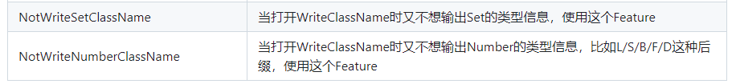

# Fastjson2

[Fastjson2](https://github.com/alibaba/fastjson2/wiki/fastjson2_intro_cn) 是一个高性能的 JSON 处理库，用于序列化和反序列化 Java 对象。在 Spring Boot 中集成 Fastjson2，通过自定义 `HttpMessageConverter` 来定制序列化配置，使其替代默认的 Jackson 进行 JSON 处理。这样，Spring Boot 会使用 Fastjson2 来处理 HTTP 请求和响应的 JSON 数据。

以下是序列化和反序列化的应用场景

| **应用场景**                       | **序列化**                  | **反序列化**              |
| ---------------------------------- | --------------------------- | ------------------------- |
| **Spring Boot API** 返回 JSON 响应 | Java 对象 → JSON            | 前端请求 JSON → Java 对象 |
| **数据库存储 JSON**                | Java 对象 → JSON 存储       | 读取 JSON → Java 对象     |
| **Redis 缓存**                     | Java 对象 → JSON 存入 Redis | 取出 JSON → Java 对象     |
| **消息队列（MQ）**                 | Java 对象 → JSON 发送       | 监听 JSON → Java 对象     |

- [Fastjson2使用文档](/work/Ateng-Java/tools/fastjson2/)


## 基础配置

### 添加依赖

```xml
<properties>
    <fastjson2.version>2.0.53</fastjson2.version>
</properties>
<!-- 在 Spring 中集成 Fastjson2 -->
<dependencies>
    <!-- 在 Spring 中集成 Fastjson2 -->
    <dependency>
        <groupId>com.alibaba.fastjson2</groupId>
        <artifactId>fastjson2-extension-spring6</artifactId>
        <version>${fastjson2.version}</version>
    </dependency>
</dependencies>
```


## Spring Web MVC序列化和反序列化

在Spring Boot Web应用中，JSON的序列化和反序列化操作通常通过`HttpMessageConverter`来实现。默认情况下，Spring Boot使用Jackson来处理JSON数据，但如果想使用Fastjson2作为JSON处理工具，可以通过自定义配置来替换Spring Boot的默认`ObjectMapper`。Fastjson2在处理大数据量时具备更高的性能，同时提供了更丰富的序列化特性，如格式化输出、嵌套对象处理和日期格式化等。通过配置`Fastjson2HttpMessageConverter`，Spring Boot可以高效地序列化Java对象为JSON格式，也能将JSON字符串反序列化为Java对象。这种配置对于性能要求较高的应用非常有利，尤其是在处理大量数据交互时。

### 配置

```java
package local.ateng.java.serialize.config;

import com.alibaba.fastjson2.JSONReader;
import com.alibaba.fastjson2.JSONWriter;
import com.alibaba.fastjson2.support.config.FastJsonConfig;
import com.alibaba.fastjson2.support.spring6.http.converter.FastJsonHttpMessageConverter;
import org.springframework.context.annotation.Configuration;
import org.springframework.http.MediaType;
import org.springframework.http.converter.HttpMessageConverter;
import org.springframework.web.servlet.config.annotation.WebMvcConfigurer;

import java.nio.charset.StandardCharsets;
import java.util.Collections;
import java.util.List;

/**
 * 在 Spring Web MVC 中集成 Fastjson2
 * https://github.com/alibaba/fastjson2/blob/main/docs/spring_support_cn.md#2-%E5%9C%A8-spring-web-mvc-%E4%B8%AD%E9%9B%86%E6%88%90-fastjson2
 *
 * @author 孔余
 * @email 2385569970@qq.com
 * @since 2025-03-06
 */
@Configuration
public class FastJsonWebMvcConfig implements WebMvcConfigurer {

    /**
     * Fastjson2转换器配置
     *
     * @return
     */
    private static FastJsonHttpMessageConverter getFastJsonHttpMessageConverter() {
        FastJsonHttpMessageConverter converter = new FastJsonHttpMessageConverter();
        FastJsonConfig config = new FastJsonConfig();
        config.setDateFormat("yyyy-MM-dd HH:mm:ss");
        config.setWriterFeatures(
                // 序列化输出空值字段
                JSONWriter.Feature.WriteNulls,
                // 在大范围超过JavaScript支持的整数，输出为字符串格式
                JSONWriter.Feature.BrowserCompatible,
                // 序列化BigDecimal使用toPlainString，避免科学计数法
                JSONWriter.Feature.WriteBigDecimalAsPlain
        );
        config.setReaderFeatures(
                // 默认下是camel case精确匹配，打开这个后，能够智能识别camel/upper/pascal/snake/Kebab五中case
                JSONReader.Feature.SupportSmartMatch
        );
        converter.setFastJsonConfig(config);
        converter.setDefaultCharset(StandardCharsets.UTF_8);
        converter.setSupportedMediaTypes(Collections.singletonList(MediaType.APPLICATION_JSON));
        return converter;
    }

    @Override
    public void configureMessageConverters(List<HttpMessageConverter<?>> converters) {
        FastJsonHttpMessageConverter converter = getFastJsonHttpMessageConverter();
        converters.add(0, converter);
    }

}
```

### 使用

```java
package local.ateng.java.serialize.controller;

import com.alibaba.fastjson2.JSONObject;
import local.ateng.java.serialize.entity.MyUser;
import lombok.RequiredArgsConstructor;
import org.springframework.beans.factory.annotation.Autowired;
import org.springframework.web.bind.annotation.*;

import java.math.BigDecimal;
import java.time.LocalDate;
import java.time.LocalDateTime;
import java.util.Date;
import java.util.List;

@RestController
@RequestMapping("/fastjson2")
@RequiredArgsConstructor(onConstructor = @__(@Autowired))
public class Fastjson2Controller {

    // 序列化
    @GetMapping("/serialize")
    public MyUser serialize() {
        return MyUser.builder()
                .id(1L)
                .name("ateng")
                .age(25)
                .phoneNumber("1762306666")
                .email("kongyu2385569970@gmail.com")
                .score(new BigDecimal("8800000000000000000000000000.911000000000000000000000"))
                .ratio(0.7147)
                .birthday(LocalDate.parse("2000-01-01"))
                .province("<")
                .city("重庆市")
                .createTime(LocalDateTime.now())
                .createTime2(new Date())
                .build();
    }

    // 反序列化
    @PostMapping("/deserialize")
    public String deserialize(@RequestBody MyUser myUser) {
        System.out.println(myUser);
        return "ok";
    }
    // 反序列化
    @PostMapping("/deserialize2")
    public String deserialize2(@RequestBody JSONObject myUser) {
        System.out.println(myUser);
        return "ok";
    }
    // 反序列化
    @PostMapping("/deserialize3")
    public String deserialize3(@RequestBody List<String> list) {
        System.out.println(list);
        return "ok";
    }

}
```

**访问序列化接口**

```
curl -X GET http://localhost:12013/fastjson2/serialize
```

示例输出：

```json
{"age":25,"birthday":"2000-01-01 00:00:00","city":"重庆市","createTime":"2025-03-06 11:37:07","createTime2":"2025-03-06 11:37:07","createTime3":null,"email":"kongyu2385569970@gmail.com","id":1,"list":null,"name":"ateng","num":0,"phoneNumber":"1762306666","province":"<","ratio":0.7147,"score":"8800000000000000000000000000.911000000000000000000000"}
```

**访问反序列化接口**

```
curl -X POST http://192.168.100.2:12013/fastjson2/deserialize \
     -H "Content-Type: application/json" \
     -d '{"age":25,"birthday":"2000-01-01 00:00:00","city":"重庆市","createTime":"2025-03-06 11:37:07","createTime2":"2025-03-06 11:37:07","createTime3":null,"email":"kongyu2385569970@gmail.com","id":1,"list":null,"name":"ateng","num":0,"phoneNumber":"1762306666","province":"<","ratio":0.7147,"score":"8800000000000000000000000000.911000000000000000000000"}'
```

控制台打印

```
MyUser(id=1, name=ateng, age=25, phoneNumber=1762306666, email=kongyu2385569970@gmail.com, score=8800000000000000000000000000.911000000000000000000000, ratio=0.7147, birthday=2000-01-01, province=<, city=重庆市, createTime=2025-03-06T11:37:07, createTime2=Thu Mar 06 11:37:07 CST 2025, createTime3=null, num=0, list=null)
```


## Spring Data Redis序列化和反序列化

在Spring Boot集成Redis时，数据的序列化与反序列化是至关重要的，通常通过`RedisTemplate`来完成。默认情况下，Spring Boot使用JDK的原生序列化方式或Jackson来序列化对象。如果需要使用Fastjson2，可以自定义Redis的序列化机制，采用Fastjson2进行高效的对象与JSON的转换。通过配置`RedisTemplate`的序列化器，开发者可以利用Fastjson2对Redis中存储的对象进行序列化和反序列化。Fastjson2在性能上相较于其他序列化库表现更优，尤其是在大规模数据访问时，可以显著提升应用性能，确保在分布式缓存系统中对数据的高效处理和快速响应。

### 配置（默认）

使用 `GenericFastJsonRedisSerializer` 这个有点小问题，一些类型会带有后缀，有些不便于开发修改数据，建议还是 自定义序列化器 配置。

```java
public GenericFastJsonRedisSerializer() {
    config.setReaderFeatures(JSONReader.Feature.SupportAutoType);
    config.setWriterFeatures(JSONWriter.Feature.WriteClassName);
}
```



```java
package local.ateng.java.serialize.config;

import com.alibaba.fastjson2.support.spring6.data.redis.GenericFastJsonRedisSerializer;
import org.springframework.context.annotation.Bean;
import org.springframework.context.annotation.Configuration;
import org.springframework.data.redis.connection.RedisConnectionFactory;
import org.springframework.data.redis.core.RedisTemplate;
import org.springframework.data.redis.serializer.StringRedisSerializer;

/**
 * RedisTemplate 配置类
 *
 * <p>
 * 该类负责配置 RedisTemplate，允许对象进行序列化和反序列化。
 * 在这里，我们使用了 StringRedisSerializer 来序列化和反序列化 Redis 键，
 * 使用 FastJsonRedisSerializer 来序列化和反序列化 Redis 值，确保 Redis 能够存储 Java 对象。
 * </p>
 *
 * @author 孔余
 * @email 2385569970@qq.com
 * @since 2025-03-06
 */
@Configuration
public class RedisTemplateConfig {

    @Bean
    public RedisTemplate<String, Object> redisTemplate(RedisConnectionFactory redisConnectionFactory) {
        RedisTemplate redisTemplate = new RedisTemplate();
        redisTemplate.setConnectionFactory(redisConnectionFactory);

        /**
         * 使用StringRedisSerializer来序列化和反序列化redis的key值
         */
        StringRedisSerializer stringRedisSerializer = new StringRedisSerializer();
        redisTemplate.setKeySerializer(stringRedisSerializer);
        redisTemplate.setHashKeySerializer(stringRedisSerializer);
        /**
         * 使用Fastjson2默认的Serializer来序列化和反序列化redis的value值
         */
        GenericFastJsonRedisSerializer fastJsonRedisSerializer = new GenericFastJsonRedisSerializer();
        redisTemplate.setValueSerializer(fastJsonRedisSerializer);
        redisTemplate.setHashValueSerializer(fastJsonRedisSerializer);
        redisTemplate.setStringSerializer(fastJsonRedisSerializer);

        // 返回redisTemplate
        redisTemplate.afterPropertiesSet();
        return redisTemplate;
    }

}
```

### 配置（自定义）

#### 配置序列化器

注意修改为自己的包名：`config.setReaderFilters(JSONReader.autoTypeFilter("local.ateng.java."));`

```java
package local.ateng.java.serialize.config;

import com.alibaba.fastjson2.JSON;
import com.alibaba.fastjson2.JSONB;
import com.alibaba.fastjson2.JSONReader;
import com.alibaba.fastjson2.JSONWriter;
import com.alibaba.fastjson2.support.config.FastJsonConfig;
import org.springframework.data.redis.serializer.RedisSerializer;
import org.springframework.data.redis.serializer.SerializationException;

import java.nio.charset.Charset;

public class FastJson2RedisSerializer<T> implements RedisSerializer<T> {
    private final Class<T> type;
    private FastJsonConfig config = new FastJsonConfig();

    public FastJson2RedisSerializer(Class<T> type) {
        config.setCharset(Charset.forName("UTF-8"));
        config.setDateFormat("yyyy-MM-dd HH:mm:ss.SSS");
        // 配置 JSONWriter 的特性
        config.setWriterFeatures(
                // 序列化时输出类型信息
                JSONWriter.Feature.WriteClassName,
                // 不输出数字类型的类名
                JSONWriter.Feature.NotWriteNumberClassName,
                // 不输出 Set 类型的类名
                JSONWriter.Feature.NotWriteSetClassName,
                // 序列化输出空值字段
                JSONWriter.Feature.WriteNulls,
                // 在大范围超过JavaScript支持的整数，输出为字符串格式
                JSONWriter.Feature.BrowserCompatible,
                // 序列化BigDecimal使用toPlainString，避免科学计数法
                JSONWriter.Feature.WriteBigDecimalAsPlain
        );

        // 配置 JSONReader 的特性
        config.setReaderFeatures(
                // 默认下是camel case精确匹配，打开这个后，能够智能识别camel/upper/pascal/snake/Kebab五中case
                JSONReader.Feature.SupportSmartMatch
        );

        // 支持自动类型，要读取带"@type"类型信息的JSON数据，需要显式打开SupportAutoType
        config.setReaderFilters(
                JSONReader.autoTypeFilter(
                        // 按需加上需要支持自动类型的类名前缀，范围越小越安全
                        "local.ateng.java."
                )
        );
        this.type = type;
    }

    public FastJsonConfig getFastJsonConfig() {
        return config;
    }

    public void setFastJsonConfig(FastJsonConfig fastJsonConfig) {
        this.config = fastJsonConfig;
    }

    @Override
    public byte[] serialize(T t) throws SerializationException {
        if (t == null) {
            return new byte[0];
        }
        try {
            if (config.isJSONB()) {
                return JSONB.toBytes(t, config.getSymbolTable(), config.getWriterFilters(), config.getWriterFeatures());
            } else {
                return JSON.toJSONBytes(t, config.getDateFormat(), config.getWriterFilters(), config.getWriterFeatures());
            }
        } catch (Exception ex) {
            throw new SerializationException("Could not serialize: " + ex.getMessage(), ex);
        }
    }

    @Override
    public T deserialize(byte[] bytes) throws SerializationException {
        if (bytes == null || bytes.length == 0) {
            return null;
        }
        try {
            if (config.isJSONB()) {
                return JSONB.parseObject(bytes, type, config.getSymbolTable(), config.getReaderFilters(), config.getReaderFeatures());
            } else {
                return JSON.parseObject(bytes, type, config.getDateFormat(), config.getReaderFilters(), config.getReaderFeatures());
            }
        } catch (Exception ex) {
            throw new SerializationException("Could not deserialize: " + ex.getMessage(), ex);
        }
    }
}
```

#### 配置序列化和反序列化

```java
package local.ateng.java.serialize.config;

import org.springframework.context.annotation.Bean;
import org.springframework.context.annotation.Configuration;
import org.springframework.data.redis.connection.RedisConnectionFactory;
import org.springframework.data.redis.core.RedisTemplate;
import org.springframework.data.redis.serializer.StringRedisSerializer;

/**
 * RedisTemplate 配置类
 *
 * <p>
 * 该类负责配置 RedisTemplate，允许对象进行序列化和反序列化。
 * 在这里，我们使用了 StringRedisSerializer 来序列化和反序列化 Redis 键，
 * 使用 FastJsonRedisSerializer 来序列化和反序列化 Redis 值，确保 Redis 能够存储 Java 对象。
 * </p>
 *
 * @author 孔余
 * @email 2385569970@qq.com
 * @since 2025-03-06
 */
@Configuration
public class RedisTemplateConfig {

    @Bean
    public RedisTemplate<String, Object> redisTemplate(RedisConnectionFactory redisConnectionFactory) {
        RedisTemplate redisTemplate = new RedisTemplate();
        redisTemplate.setConnectionFactory(redisConnectionFactory);

        /**
         * 使用StringRedisSerializer来序列化和反序列化redis的key值
         */
        StringRedisSerializer stringRedisSerializer = new StringRedisSerializer();
        redisTemplate.setKeySerializer(stringRedisSerializer);
        redisTemplate.setHashKeySerializer(stringRedisSerializer);

        /**
         * 使用自定义的Fastjson2的Serializer来序列化和反序列化redis的value值
         */
        FastJson2RedisSerializer fastJson2RedisSerializer = new FastJson2RedisSerializer(Object.class);
        redisTemplate.setValueSerializer(fastJson2RedisSerializer);
        redisTemplate.setHashValueSerializer(fastJson2RedisSerializer);

        // 返回redisTemplate
        redisTemplate.afterPropertiesSet();
        return redisTemplate;
    }

}
```


### 使用

```java
package local.ateng.java.serialize.controller;

import local.ateng.java.serialize.entity.MyUser;
import lombok.RequiredArgsConstructor;
import org.springframework.beans.factory.annotation.Autowired;
import org.springframework.data.redis.core.RedisTemplate;
import org.springframework.web.bind.annotation.GetMapping;
import org.springframework.web.bind.annotation.RequestMapping;
import org.springframework.web.bind.annotation.RestController;

import java.math.BigDecimal;
import java.time.LocalDate;
import java.time.LocalDateTime;
import java.util.Date;
import java.util.List;

@RestController
@RequestMapping("/redis")
@RequiredArgsConstructor(onConstructor = @__(@Autowired))
public class RedisController {
    private final RedisTemplate<String, Object> redisTemplate;

    // 序列化
    @GetMapping("/serialize")
    public String serialize() {
        MyUser myUser = MyUser.builder()
                .id(1L)
                .name("ateng")
                .age(null)
                .phoneNumber("1762306666")
                .email("kongyu2385569970@gmail.com")
                .score(new BigDecimal("88.911"))
                .ratio(0.7147)
                .birthday(LocalDate.parse("2000-01-01"))
                .province(null)
                .city("重庆市")
                .createTime(LocalDateTime.now())
                .createTime2(new Date())
                .list(List.of("1","2"))
                .build();
        redisTemplate.opsForValue().set("myUser", myUser);
        return "ok";
    }

    // 反序列化
    @GetMapping("/deserialize")
    public String deserialize() {
        MyUser myUser = (MyUser) redisTemplate.opsForValue().get("myUser");
        System.out.println(myUser);
        System.out.println(myUser.getCreateTime());
        return "ok";
    }

}
```

序列化到Redis

```json
{
    "@type": "local.ateng.java.serialize.entity.MyUser",
    "age": null,
    "birthday": "2000-01-01 00:00:00.000",
    "city": "重庆市",
    "createTime": "2025-03-06 14:17:55.734",
    "createTime2": "2025-03-06 14:17:55.734",
    "createTime3": null,
    "email": "kongyu2385569970@gmail.com",
    "id": 1,
    "list": [
        "1",
        "2"
    ],
    "name": "ateng",
    "num": 0,
    "phoneNumber": "1762306666",
    "province": null,
    "ratio": 0.7147,
    "score": 88.911
}
```

反序列化输出

```
MyUser(id=1, name=ateng, age=null, phoneNumber=1762306666, email=kongyu2385569970@gmail.com, score=88.911, ratio=0.7147, birthday=2000-01-01, province=null, city=重庆市, createTime=2025-03-06T14:17:55.734, createTime2=Thu Mar 06 14:17:55 CST 2025, createTime3=null, num=0, list=[1, 2])
```

