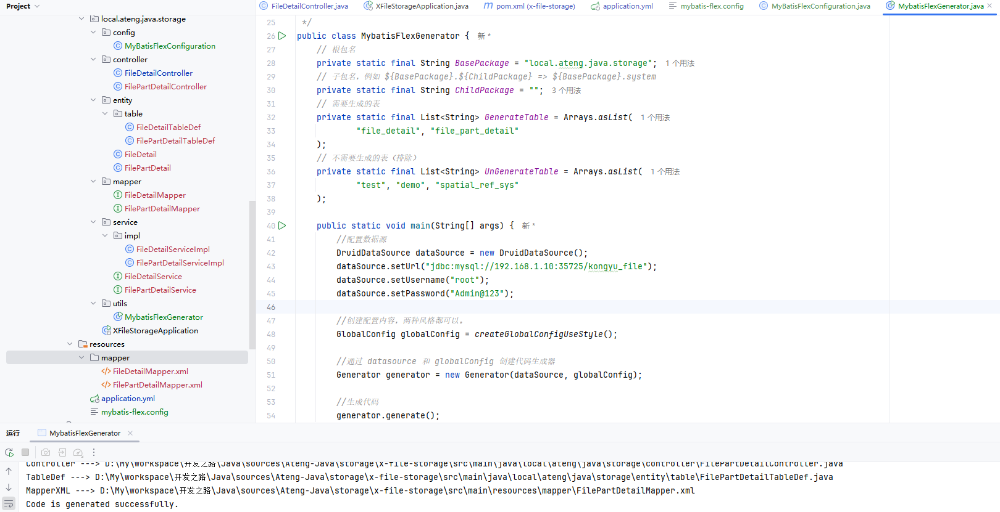

# X File Storage

一行代码将文件存储到本地、FTP、SFTP、WebDAV、阿里云 OSS、华为云 OBS、七牛云 Kodo、腾讯云 COS、百度云 BOS、又拍云 USS、MinIO、 Amazon S3、GoogleCloud Storage、FastDFS、 Azure Blob Storage、Cloudflare R2、金山云 KS3、美团云 MSS、京东云 OSS、天翼云 OOS、移动 云EOS、沃云 OSS、 网易数帆 NOS、Ucloud US3、青云 QingStor、平安云 OBS、首云 OSS、IBM COS、其它兼容 S3 协议的存储平台。查看 所有支持的存储平台

- [官方文档](https://x-file-storage.xuyanwu.cn/#/)


## 基础配置

**添加依赖**

```xml
<file-storage.version>2.2.1</file-storage.version>
<!-- X File Storage: 将文件存储各个存储平台 -->
<dependency>
    <groupId>org.dromara.x-file-storage</groupId>
    <artifactId>x-file-storage-spring</artifactId>
    <version>${file-storage.version}</version>
</dependency>
```

**编辑配置文件**

```yaml
---
# 设置文件和请求大小
spring:
  servlet:
    multipart:
      max-file-size: 10MB
      max-request-size: 10MB
      resolve-lazily: true # 开启 multipart 懒加载
```

**启动服务**

```java
package local.ateng.java.storage;

import org.dromara.x.file.storage.spring.EnableFileStorage;
import org.springframework.boot.SpringApplication;
import org.springframework.boot.autoconfigure.SpringBootApplication;

@SpringBootApplication
@EnableFileStorage
public class XFileStorageApplication {

    public static void main(String[] args) {
        SpringApplication.run(XFileStorageApplication.class, args);
    }

}
```


## 配置存储平台

### MinIO

#### 添加依赖

```xml
<minio.version>8.5.15</minio.version>
<!-- MinIO 对象存储 -->
<dependency>
    <groupId>io.minio</groupId>
    <artifactId>minio</artifactId>
    <version>${minio.version}</version>
</dependency>
```

#### 编辑配置文件

```yaml
---
# 文件存储配置
dromara:
  x-file-storage:
    default-platform: minio-1 #默认使用的存储平台
    thumbnail-suffix: ".min.jpg" #缩略图后缀，例如【.min.jpg】【.png】
    minio: # MinIO，由于 MinIO SDK 支持 AWS S3，其它兼容 AWS S3 协议的存储平台也都可配置在这里
      - platform: minio-1 # 存储平台标识
        enable-storage: true  # 启用存储
        access-key: admin
        secret-key: Admin@123
        end-point: "http://dev.minio.lingo.local"
        bucket-name: test
        domain: "http://dev.minio.lingo.local/test/" # 访问域名，注意“/”结尾，例如：http://minio.abc.com/abc/
        base-path: ateng/ # 基础路径
```


### 阿里云OSS

#### 添加依赖

```xml
<aliyun-oss.version>3.18.1</aliyun-oss.version>
<!-- 阿里云OSS -->
<dependency>
    <groupId>com.aliyun.oss</groupId>
    <artifactId>aliyun-sdk-oss</artifactId>
    <version>${aliyun-oss.version}</version>
</dependency>
```

#### 编辑配置文件

```yaml
---
# 文件存储配置
dromara:
  x-file-storage:
    default-platform: minio-1 #默认使用的存储平台
    thumbnail-suffix: ".min.jpg" #缩略图后缀，例如【.min.jpg】【.png】
    aliyun-oss:
      - platform: aliyun-oss-1 # 存储平台标识
        enable-storage: true  # 启用存储
        access-key: xxx
        secret-key: xxx
        end-point: oss-cn-chengdu.aliyuncs.com
        bucket-name: lingo-bucket-data
        domain: https://lingo-bucket-data.oss-cn-chengdu.aliyuncs.com/ # 访问域名，注意“/”结尾，例如：https://abc.oss-cn-shanghai.aliyuncs.com/
        base-path: ateng/ # 基础路径
```

### FTP

#### 添加依赖

```xml
<!-- Commons Net: 提供了对常见网络协议（如 FTP, SMTP, POP3, Telnet 等）的支持 -->
<dependency>
    <groupId>commons-net</groupId>
    <artifactId>commons-net</artifactId>
    <version>3.9.0</version>
</dependency>

<!--糊涂工具类扩展-->
<dependency>
    <groupId>cn.hutool</groupId>
    <artifactId>hutool-extra</artifactId>
    <version>${hutool.version}</version>
</dependency>

<!-- Apache 的对象池 -->
<dependency>
    <groupId>org.apache.commons</groupId>
    <artifactId>commons-pool2</artifactId>
</dependency>
```

#### 编辑配置文件

```yaml
---
# 文件存储配置
dromara:
  x-file-storage:
    default-platform: minio-1 #默认使用的存储平台
    thumbnail-suffix: ".min.jpg" #缩略图后缀，例如【.min.jpg】【.png】
    ftp:
      - platform: ftp-1 # 存储平台标识
        enable-storage: true  # 启用存储
        host: 192.168.1.13 # 主机，例如：192.168.1.105
        port: 21 # 端口，默认21
        user: admin # 用户名，默认 anonymous（匿名）
        password: "Admin@123" # 密码，默认空
        domain: ftp://192.168.1.13/data/ # 访问域名，注意“/”结尾，例如：ftp://192.168.1.105/
        base-path: ateng/ # 基础路径
        storage-path: /data/ # 存储路径，可以配合 Nginx 实现访问，注意“/”结尾，默认“/”
```


## 上传文件

### 创建接口类

```java
import lombok.RequiredArgsConstructor;
import org.dromara.x.file.storage.core.FileInfo;
import org.dromara.x.file.storage.core.FileStorageService;
import org.springframework.beans.factory.annotation.Autowired;
import org.springframework.web.bind.annotation.PostMapping;
import org.springframework.web.bind.annotation.RequestMapping;
import org.springframework.web.bind.annotation.RestController;
import org.springframework.web.multipart.MultipartFile;

/**
 * X File Storage 演示
 *
 * @author 孔余
 * @email 2385569970@qq.com
 * @since 2025-01-07
 */
@RestController
@RequestMapping("/file")
@RequiredArgsConstructor(onConstructor = @__(@Autowired))
public class FileDetailController {
    private final FileStorageService fileStorageService;

}
```

### 基础上传

最简洁的方式，所有参数使用默认值，实际项目中不会用到这种情况。

```java
    /**
     * 上传文件，使用默认值
     */
    @PostMapping("/upload1")
    public FileInfo upload1(MultipartFile file) {
        return fileStorageService.of(file).upload();
    }
```

FileInfo的内容如下：

```json
{
	"id": null,
	"url": "http://dev.minio.lingo.local/test/ateng/677d27131dfb8b85121a9a1a.docx",
	"size": 735436,
	"filename": "677d27131dfb8b85121a9a1a.docx",
	"originalFilename": "我的文档.docx",
	"basePath": "ateng/",
	"path": "",
	"ext": "docx",
	"contentType": "application/vnd.openxmlformats-officedocument.wordprocessingml.document",
	"platform": "minio-1",
	"thUrl": null,
	"thFilename": null,
	"thSize": null,
	"thContentType": null,
	"objectId": null,
	"objectType": null,
	"metadata": {},
	"userMetadata": {},
	"thMetadata": {},
	"thUserMetadata": {},
	"attr": {},
	"fileAcl": null,
	"thFileAcl": null,
	"hashInfo": {},
	"uploadId": null,
	"uploadStatus": null,
	"createTime": "2025-01-07T13:07:31.025+00:00"
}
```

### 自定义路径

```java
    /**
     * 上传文件，自定义路径
     */
    @PostMapping("/upload2")
    public FileInfo upload2(MultipartFile file) {
        // 设置文件路径
        DateTime dateTime = DateUtil.date();
        String path = DateUtil.format(dateTime, "yyyy/MM/dd/");
        return fileStorageService
                .of(file)
                .setPath(path)
                .upload();
    }
```

### 二进制数据

```java
    /**
     * 上传文件，二进制数据byte[]
     * 这种情况需要自定义文件名和类型
     */
    @PostMapping("/upload3")
    public FileInfo upload3(MultipartFile file) throws IOException {
        // 假设这里是得到了一个文件的二进制，可以是流或者其他途径
        byte[] bytes = file.getBytes();
        // FileTypeUtil 是 Hutool 提供的工具类，它通过分析文件头的魔数（magic number）来判断文件的类型
        String type = FileTypeUtil.getType(new ByteArrayInputStream(bytes), true);
        // 设置文件路径
        DateTime dateTime = DateUtil.date();
        String path = DateUtil.format(dateTime, "yyyy/MM/dd/");
        // 设置文件名
        String dateTimeStr = DateUtil.format(dateTime, "yyyyMMdd-HHmmss");
        String filename = StrUtil.format("{}.{}", dateTimeStr, type);
        return fileStorageService
                .of(file)
                .setPath(path)
                .setSaveFilename(filename)
                .setOriginalFilename(filename)
                .upload();
    }
```

### 上传多个文件

```java
    /**
     * 上传多个文件
     */
    @PostMapping("/upload4")
    public List<FileInfo> uploadMultipleFiles(List<MultipartFile> files) {
        return files.stream()
                .map(file -> fileStorageService.of(file).upload())
                .collect(Collectors.toList());
    }
```

### 上传图片

这里上传图片做了压缩

```java
    /**
     * 上传图片，成功返回文件信息
     * 图片处理使用的是 https://github.com/coobird/thumbnailator
     * 会将图片压缩到1000像素
     */
    @PostMapping("/upload-image")
    public FileInfo uploadImage(MultipartFile file) {
        return fileStorageService.of(file)
                .image(img -> img.size(1000, 1000))  //将图片大小调整到 1000*1000
                .thumbnail(th -> th.size(200, 200))  //再生成一张 200*200 的缩略图
                .upload();
    }
```

返回数据如下

```json
{
    "id": null,
    "url": "http://dev.minio.lingo.local/test/ateng/67c130a97f52e4433505e5a7.jpg",
    "size": 81104,
    "filename": "67c130a97f52e4433505e5a7.jpg",
    "originalFilename": "tree.jpg",
    "basePath": "ateng/",
    "path": "",
    "ext": "jpg",
    "contentType": "image/jpeg",
    "platform": "minio-1",
    "thUrl": "http://dev.minio.lingo.local/test/ateng/67c130a97f52e4433505e5a7.jpg.min.jpg",
    "thFilename": "67c130a97f52e4433505e5a7.jpg.min.jpg",
    "thSize": 5318,
    "thContentType": "image/jpeg",
    "objectId": null,
    "objectType": null,
    "metadata": {},
    "userMetadata": {},
    "thMetadata": {},
    "thUserMetadata": {},
    "attr": {},
    "fileAcl": null,
    "thFileAcl": null,
    "hashInfo": {},
    "uploadId": null,
    "uploadStatus": null,
    "createTime": "2025-02-28T03:42:33.385+00:00"
}
```

### 上传到指定平台

```java
    /**
     * 上传文件，阿里云OSS
     */
    @PostMapping("/upload-oss")
    public FileInfo uploadOss(MultipartFile file) {
        return fileStorageService.of(file).setPlatform("aliyun-oss-1").upload();
    }

    /**
     * 上传文件，FTP
     */
    @PostMapping("/upload-ftp")
    public FileInfo uploadFtp(MultipartFile file) {
        return fileStorageService.of(file).setPlatform("ftp-1").upload();
    }
```

### 监听上传进度

```java
    /**
     * 监听上传进度
     */
    @PostMapping("/upload-progress")
    public FileInfo uploadProgressListener(MultipartFile file) {
        // 设置文件路径
        DateTime dateTime = DateUtil.date();
        String path = DateUtil.format(dateTime, "yyyy/MM/dd/");
        return fileStorageService
                .of(file)
                .setPath(path)
                .setProgressListener(new ProgressListener() {
                    @Override
                    public void start() {
                        System.out.println("上传开始");
                    }

                    @Override
                    public void progress(long progressSize, Long allSize) {
                        System.out.println("已上传 " + progressSize + " 总大小" + (allSize == null ? "未知" : allSize));
                    }

                    @Override
                    public void finish() {
                        System.out.println("上传结束");
                    }
                })
                .upload();
    }
```

### 客户端上传

参考官网文档：[预签名URL](https://x-file-storage.xuyanwu.cn/#/%E9%A2%84%E7%AD%BE%E5%90%8DURL?id=%e4%b8%8a%e4%bc%a0)

生成上传 URL 给客户端，从而实现客户端直传文件，不经过后台，目前这种方式不支持附带缩略图，将在后续版本提供追加缩略图功能，也不支持设置 `ACL`，可以上传后通过后台设置 `ACL`

**第一步：**

服务端根据需求生成上传 URL 及 Headers

```java
    /**
     * 生成上传 URL 给客户端，从而实现客户端直传文件，不经过后台
     */
    @GetMapping("/generate-presigned-url")
    public GeneratePresignedUrlResult generatePresignedUrl() {
        GeneratePresignedUrlResult uploadResult = fileStorageService
                .generatePresignedUrl()
                .setPlatform("minio-1") // 存储平台，不传使用默认的
                .setPath("test/") // 设置路径
                .setFilename("image.jpg") // 设置保存的文件名
                .setMethod(Constant.GeneratePresignedUrl.Method.PUT)    // 签名方法
                .setExpiration(DateUtil.offsetMinute(new Date(), 10))   // 设置过期时间 10 分钟
                .putHeaders(Constant.Metadata.CONTENT_TYPE, "image/jpeg") // 设置要上传文件 MIME 类型
                .putHeaders(Constant.Metadata.CONTENT_DISPOSITION, "attachment;filename=DownloadFileName.jpg") //设置其它元数据，不需要可省略
                .putUserMetadata("role", "666") //设置自定义用户元数据，不需要可省略
                .putQueryParams("admin", "123456") //设置自定义查询参数，不需要可省略
                .generatePresignedUrl();
        Assert.notNull(uploadResult, "生成上传预签名 URL 失败！");
        return uploadResult;
    }
```

**第二步：**

客户端根据得到的 URL 和 Headers 进行上传。注意这里使用 REST 风格上传，body 直接就是文件内容，不是传统的 FormData 形式

Java 写法

```java
byte[] bytes = FileUtil.readBytes("C:\\001.jpg");
String body = HttpRequest.of(uploadResult.getUrl())
        .method(Method.PUT)
        .addHeaders(uploadResult.getHeaders())  //需要添加 Headers ，这一步必不可少
        .body(bytes) //文件内容的 byte 数据
        .execute()
        .body();

//根据返回值判断是否上传成功
Assert.isTrue(StrUtil.isBlank(body), "生成上传预签名 URL 失败：{}", body);
```

JS 写法

```js
let input = document.createElement('input')
input.type = 'file'
input.accept = '.jpg'
input.oninput = async _ => {
    console.log(input.files)
    let file = input.files[0]

    //使用 fetch 上传
    let response = await fetch(uploadResult.url, {
        method: 'PUT',
        headers: uploadResult.headers,
        body: file,
        onProgress: (progress) => {
            console.log(`上传进度: ${Math.round((progress.loaded / progress.total) * 100)}%`);
        }
    });

    //验证是否上传成功
    if (response.ok) {
        console.log('File uploaded successfully!');
    } else {
        console.error('Error uploading file:', response.status);
    }
}
input.click()
```

**第三步：**

参考 [获取文件](https://x-file-storage.xuyanwu.cn/#/基础功能?id=获取文件) 查询已上传的文件，这部分可省略

```java
    /**
     * 查询已上传的文件
     */
    @GetMapping("/get-file-info")
    public FileInfo getFileInfo() {
        //自行传入 path 及 filename 获取文件信息
        RemoteFileInfo info3 = fileStorageService.getFile().setPath("test/").setFilename("image.jpg").getFile();
        Assert.notNull(info3, "文件不存在");
        //文件元数据
        MapProxy metadata = info3.getKebabCaseInsensitiveMetadata();
        System.out.println(metadata);
        //文件用户元数据
        MapProxy userMetadata = info3.getKebabCaseInsensitiveUserMetadata();
        System.out.println(userMetadata);
        //转换成 FileInfo 可方便进行其它操作或保存到数据库中
        FileInfo fileInfo = info3.toFileInfo();
        return fileInfo;
    }
```


## 分片上传和断点续传

前端实现文件分片上传时，主要的步骤包括：

- 将大文件切割成多个小块（分片）。
- 每个分片独立上传，并在上传过程中记录上传进度。
- 支持断点续传，即如果某个分片上传失败，重新上传该分片。

后端实现文件的接收、分片合并等逻辑，主要的步骤包括：

- 接收分片并暂时存储。
- 记录分片的顺序和上传状态。
- 合并所有分片生成完整的文件。

### 前端分片上传

这里就使用Linux命令创建文件并分割然后请求上传替代前端的操作

#### 数据准备

**生成100MB的文件**

使用 `dd` 命令来生成一个大小为 **100MB** 的文件。这个文件将被用作分割的源文件。

```
dd if=/dev/urandom of=bigfile.bin bs=1M count=100
```

查看该文件的校验和

```
# md5sum bigfile.bin
791c78484981e2ba8bf69113a653fc0e  bigfile.bin
# sha256sum bigfile.bin
4641b97e0090976a7411cee54262b9a4861e6b248cb17464bde1cc7263270927  bigfile.bin
```

**分割文件**

使用 `split` 命令将 **bigfile.bin** 文件分割成 **10个文件**。每个文件的大小为 10MB。

```
split -b 10M bigfile.bin part_
```

#### 分片上传

**准备进行分片上传**

首次调用获取FileInfo信息

```shell
fileInfoStr=$(curl -Ss -X POST http://192.168.100.2:14001/file/uploadPart | jq -c '.fileInfo')
echo $fileInfoStr
```

**上传每个分片**

用以下命令逐个上传每个分片

```shell
files=$(ls part_*)
totalChunks=$(ls part_* | wc -l)
chunkIndex=1
for file in ${files}; do
  curl -X POST http://192.168.100.2:14001/file/uploadPart \
    -F "file=@$file" \
    -F "chunkIndex=${chunkIndex}" \
    -F "totalChunks=${totalChunks}" \
    -F "fileInfoStr=${fileInfoStr}" \
    --progress-bar
    ((chunkIndex++)) && echo
done
```

#### 效验结果

分片上传后的文件通过文件校验和可以看到和源文件的值是相同的

```
# md5sum 67c15ef27f52d46c23953fd4
791c78484981e2ba8bf69113a653fc0e  67c15ef27f52d46c23953fd4
# sha256sum 67c15ef27f52d46c23953fd4
4641b97e0090976a7411cee54262b9a4861e6b248cb17464bde1cc7263270927  67c15ef27f52d46c23953fd4
```

### 后端实现分片上传

```java
    /**
     * 手动分片上传
     * 1. 客户端首次准备分片上传时，需要调用该接口，什么参数都不需要传，由服务端判断后返回FileInfo数据（标识）给客户端
     * 2. 接着就开始进行分片上传，将FileInfo数据和file、chunkIndex、totalChunks依次上传给服务端，当chunkIndex==totalChunks时即视为分片文件上传完毕
     *
     * @param file        分片的文件
     * @param chunkIndex  分片索引号，分片文件的顺序号，从1开始
     * @param totalChunks 分片文件总数
     * @param fileInfoStr FileInfo字符串
     * @return
     */
    @PostMapping("/uploadPart")
    public JSONObject uploadPart(
            MultipartFile file,
            Integer chunkIndex,
            Integer totalChunks,
            String fileInfoStr
    ) {
        JSONObject result = JSONObject.of("code", "0");
        // 1. 手动分片上传-是否支持
        MultipartUploadSupportInfo supportInfo = fileStorageService.isSupportMultipartUpload();
        Assert.isTrue(supportInfo.getIsSupport(), "不支持分片上传");
        Assert.isTrue((chunkIndex == null && totalChunks == null) || (totalChunks >= chunkIndex && chunkIndex >= 1), "分片上传错误");
        System.out.println(supportInfo.getIsSupport());//是否支持手动分片上传，正常情况下判断此参数就行了
        System.out.println(supportInfo.getIsSupportListParts());//是否支持列举已上传的分片
        System.out.println(supportInfo.getIsSupportAbort());//是否支持取消上传
        // 2. 手动分片上传-初始化
        FileInfo fileInfo = JSONObject.parseObject(fileInfoStr, FileInfo.class);
        if (BeanUtil.isEmpty(fileInfo)) {
            // 首次上传文件请求直接返回FileInfo信息
            String path = DateUtil.format(DateUtil.date(), "yyyy/MM/dd/");
            fileInfo = fileStorageService
                    .initiateMultipartUpload()
                    .setPath(path)
                    .setSaveFilename("1111111.txt")
                    .putUserMetadata("author", "ateng")
                    .init();
            result.put("fileInfo", fileInfo);
            return result;
        }
        // 3. 手动分片上传-上传分片
        FilePartInfo filePartInfo = fileStorageService.uploadPart(fileInfo, chunkIndex, file).upload();
        //System.out.println(filePartInfo);
        // 4. 手动分片上传-列举已上传的分片
        FilePartInfoList partList = fileStorageService.listParts(fileInfo).listParts();
        //System.out.println(partList);
        result.put("fileInfo", fileInfo);
        result.put("partList", partList.getList());
        // 5. 手动分片上传-完成
        if (chunkIndex == totalChunks) {
            FileInfo completeFileInfo = fileStorageService.completeMultipartUpload(fileInfo).complete();
            //System.out.println(completeFileInfo);
            // completeFileInfo.uploadStatus=2 表示分片上传完成
            result.put("fileInfo", fileInfo);
        }
        return result;
    }
```

### 后端实现分片上传（优化）

```java
/**
 * 手动分片上传，解决需要顺序上传的问题，实现客户端多线程上传
 * 1. 客户端首次准备分片上传时，需要调用该接口，什么参数都不需要传（可以传入filename），由服务端判断后返回FileInfo数据（标识）给客户端
 * 2. 接着就开始进行分片上传，将FileInfo数据和file、chunkIndex、totalChunks依次上传给服务端
 * 3. 所有分片文件都上传完毕后，调用该接口传入 fileInfoStr 和 isComplete=true（其他参数不用传）完成分片的合并
 *
 * @param file        分片的文件
 * @param chunkIndex  分片索引号，分片文件的顺序号，从1开始
 * @param totalChunks 分片文件总数
 * @param fileInfoStr FileInfo字符串
 * @param isComplete 分片是否上传完成
 * @return
 */
@PostMapping("/uploadPartPlus")
public JSONObject uploadPartPlus(
        String filename,
        MultipartFile file,
        Integer chunkIndex,
        Integer totalChunks,
        String fileInfoStr,
        Boolean isComplete
) {
    JSONObject result = JSONObject.of("code", "0");
    // 1. 手动分片上传-是否支持
    MultipartUploadSupportInfo supportInfo = fileStorageService.isSupportMultipartUpload();
    Assert.isTrue(supportInfo.getIsSupport(), "不支持分片上传");
    Assert.isTrue((chunkIndex == null && totalChunks == null) || (totalChunks >= chunkIndex && chunkIndex >= 1), "分片上传错误");
    // 2. 手动分片上传-初始化
    FileInfo fileInfo = JSONObject.parseObject(fileInfoStr, FileInfo.class);
    if (BeanUtil.isEmpty(fileInfo) && ObjUtil.isEmpty(isComplete)) {
        // 首次上传文件请求直接返回FileInfo信息
        String path = DateUtil.format(DateUtil.date(), "yyyy/MM/dd/");
        fileInfo = fileStorageService
                .initiateMultipartUpload()
                .setPath(path)
                .setSaveFilename(!StrUtil.isBlank(filename), filename)
                .setOriginalFilename(!StrUtil.isBlank(filename), filename)
                .putUserMetadata("author", "ateng")
                .init();
        result.put("fileInfo", fileInfo);
        return result;
    }
    // 5. 手动分片上传-完成
    if (!ObjUtil.isEmpty(isComplete)) {
        FileInfo completeFileInfo = fileStorageService.completeMultipartUpload(fileInfo).complete();
        // completeFileInfo.uploadStatus=2 表示分片上传完成
        result.put("fileInfo", fileInfo);
    } else {
        // 3. 手动分片上传-上传分片
        FilePartInfo filePartInfo = fileStorageService.uploadPart(fileInfo, chunkIndex, file).upload();
        // 4. 手动分片上传-列举已上传的分片
        FilePartInfoList partList = fileStorageService.listParts(fileInfo).listParts();
        result.put("fileInfo", fileInfo);
        result.put("partList", partList.getList());
    }
    return result;
}
```

1. 获取FileInfo信息

```shell
fileInfoStr=$(curl -Ss -F "filename=ateng_part.file" -X POST http://192.168.100.2:14001/file/uploadPartPlus | jq -c '.fileInfo')
echo $fileInfoStr
```

2. 上传分片文件

可以多并发上传，但是需要注意某一个上传失败重试的问题。

断点续传可以修改方法的代码或者新接口供前端查询该FileInfo已上传的分片，判断一下已上传的分片将其忽略。

```shell
curl -X POST http://192.168.100.2:14001/file/uploadPartPlus \
    -F "file=@part_ac" \
    -F "chunkIndex=3" \
    -F "totalChunks=4" \
    -F "fileInfoStr=${fileInfoStr}" \
    --progress-bar
```

3. 完成分片上传

```shell
curl -Ss -F "isComplete=true" -F "fileInfoStr=${fileInfoStr}" -X POST http://192.168.100.2:14001/file/uploadPartPlus
```


## 动态增减存储平台

参考官方文档：[动态增减存储平台](https://x-file-storage.xuyanwu.cn/#/存储平台?id=动态增减存储平台)

参考代码

```java
import lombok.RequiredArgsConstructor;
import lombok.extern.slf4j.Slf4j;
import org.dromara.x.file.storage.core.FileStorageProperties;
import org.dromara.x.file.storage.core.FileStorageService;
import org.dromara.x.file.storage.core.FileStorageServiceBuilder;
import org.dromara.x.file.storage.core.platform.FileStorage;
import org.springframework.beans.factory.annotation.Autowired;
import org.springframework.scheduling.annotation.Scheduled;
import org.springframework.stereotype.Component;

import java.util.Collections;
import java.util.concurrent.CopyOnWriteArrayList;

@Component
@RequiredArgsConstructor(onConstructor = @__(@Autowired))
@Slf4j
public class TestTask {
    private final FileStorageService fileStorageService;//注入实列
    private CopyOnWriteArrayList<FileStorage> fileStorageList;


    @Scheduled(cron = "0 * * * * ?")
    public void checkFtpHealth() {
        this.initFileStorage();
        String platform = fileStorageList.get(0).getPlatform();
        int size = fileStorageService.listFiles().setPlatform(platform).listFiles().getFileList().size();
        log.info("访问FTP成功，目录下文件数量：{}", size);
        this.stopFileStorage();
    }

    public void initFileStorage() {
        fileStorageList = fileStorageService.getFileStorageList();
        FileStorageProperties.FtpConfig config = new FileStorageProperties.FtpConfig();
        config.setPlatform("vsftp");
        config.setHost("192.168.1.13");
        config.setPort(21);
        config.setUser("admin");
        config.setPassword("Admin@123");
        config.setDomain("ftp://192.168.1.13/");
        config.setBasePath("data/");
        config.setStoragePath("/");
        config.setIsActive(false);
        config.setConnectionTimeout(60000);
        config.setSoTimeout(60000);
        fileStorageList.addAll(FileStorageServiceBuilder.buildFtpFileStorage(Collections.singletonList(config),null));
    }

    public void stopFileStorage() {
        //删除
        FileStorage myStorage = fileStorageService.getFileStorage("vsftp");
        fileStorageList.remove(myStorage);
        myStorage.close();//释放资源
    }

}
```


## 集成数据库

集成数据库实现FileRecorder接口后就可以实现 保存上传记录、分片上传（断点续传） 等功能。

参考：[官方文档](https://x-file-storage.xuyanwu.cn/#/%E5%9F%BA%E7%A1%80%E5%8A%9F%E8%83%BD?id=%e4%bf%9d%e5%ad%98%e4%b8%8a%e4%bc%a0%e8%ae%b0%e5%bd%95)

同时也会解决 **没有找到 FileRecorder 的实现类** 这个警告


### 创建表

参照官网的SQL，创建file_detail和file_part_detail表

#### MySQL

- file_detail

```sql
create table if not exists file_detail
(
    id                bigint auto_increment comment '文件id'
        primary key,
    url               varchar(512) not null comment '文件访问地址',
    size              bigint       null comment '文件大小，单位字节',
    filename          varchar(256) null comment '文件名称',
    original_filename varchar(256) null comment '原始文件名',
    base_path         varchar(256) null comment '基础存储路径',
    path              varchar(256) null comment '存储路径',
    ext               varchar(32)  null comment '文件扩展名',
    content_type      varchar(128) null comment 'MIME类型',
    platform          varchar(32)  null comment '存储平台',
    th_url            varchar(512) null comment '缩略图访问路径',
    th_filename       varchar(256) null comment '缩略图名称',
    th_size           bigint       null comment '缩略图大小，单位字节',
    th_content_type   varchar(128) null comment '缩略图MIME类型',
    object_id         varchar(32)  null comment '文件所属对象id',
    object_type       varchar(32)  null comment '文件所属对象类型，例如用户头像，评价图片',
    metadata          text         null comment '文件元数据',
    user_metadata     text         null comment '文件用户元数据',
    th_metadata       text         null comment '缩略图元数据',
    th_user_metadata  text         null comment '缩略图用户元数据',
    attr              text         null comment '附加属性',
    file_acl          varchar(32)  null comment '文件ACL',
    th_file_acl       varchar(32)  null comment '缩略图文件ACL',
    hash_info         text         null comment '哈希信息',
    upload_id         varchar(128) null comment '上传ID，仅在手动分片上传时使用',
    upload_status     int          null comment '上传状态，仅在手动分片上传时使用，1：初始化完成，2：上传完成',
    create_time       datetime     null comment '创建时间'
)
    comment '文件记录表';
```

- file_part_detail

```sql
create table if not exists file_part_detail
(
    id          bigint auto_increment comment '分片id'
        primary key,
    platform    varchar(32)          null comment '存储平台',
    upload_id   varchar(128)         null comment '上传ID，仅在手动分片上传时使用',
    e_tag       varchar(255)         null comment '分片 ETag',
    part_number int                  null comment '分片号。每一个上传的分片都有一个分片号，一般情况下取值范围是1~10000',
    part_size   bigint               null comment '文件大小，单位字节',
    hash_info   text charset utf8mb3 null comment '哈希信息',
    create_time datetime             null comment '创建时间'
)
    comment '文件分片信息表，仅在手动分片上传时使用';
```

#### PostgreSQL

- file_detail

```sql
create table if not exists public.file_detail
(
    id                bigserial
        primary key,
    url               varchar(512) not null,
    size              bigint,
    filename          varchar(256),
    original_filename varchar(256),
    base_path         varchar(256),
    path              varchar(256),
    ext               varchar(32),
    content_type      varchar(128),
    platform          varchar(32),
    th_url            varchar(512),
    th_filename       varchar(256),
    th_size           bigint,
    th_content_type   varchar(128),
    object_id         varchar(32),
    object_type       varchar(32),
    metadata          text,
    user_metadata     text,
    th_metadata       text,
    th_user_metadata  text,
    attr              text,
    file_acl          varchar(32),
    th_file_acl       varchar(32),
    hash_info         text,
    upload_id         varchar(128),
    upload_status     integer,
    create_time       timestamp
);

comment on column public.file_detail.id is '文件id';

comment on column public.file_detail.url is '文件访问地址';

comment on column public.file_detail.size is '文件大小，单位字节';

comment on column public.file_detail.filename is '文件名称';

comment on column public.file_detail.original_filename is '原始文件名';

comment on column public.file_detail.base_path is '基础存储路径';

comment on column public.file_detail.path is '存储路径';

comment on column public.file_detail.ext is '文件扩展名';

comment on column public.file_detail.content_type is 'MIME类型';

comment on column public.file_detail.platform is '存储平台';

comment on column public.file_detail.th_url is '缩略图访问路径';

comment on column public.file_detail.th_filename is '缩略图名称';

comment on column public.file_detail.th_size is '缩略图大小，单位字节';

comment on column public.file_detail.th_content_type is '缩略图MIME类型';

comment on column public.file_detail.object_id is '文件所属对象id';

comment on column public.file_detail.object_type is '文件所属对象类型，例如用户头像，评价图片';

comment on column public.file_detail.metadata is '文件元数据';

comment on column public.file_detail.user_metadata is '文件用户元数据';

comment on column public.file_detail.th_metadata is '缩略图元数据';

comment on column public.file_detail.th_user_metadata is '缩略图用户元数据';

comment on column public.file_detail.attr is '附加属性';

comment on column public.file_detail.file_acl is '文件ACL';

comment on column public.file_detail.th_file_acl is '缩略图文件ACL';

comment on column public.file_detail.hash_info is '哈希信息';

comment on column public.file_detail.upload_id is '上传ID，仅在手动分片上传时使用';

comment on column public.file_detail.upload_status is '上传状态，仅在手动分片上传时使用，1：初始化完成，2：上传完成';

comment on column public.file_detail.create_time is '创建时间';

alter table public.file_detail
    owner to postgres;
```

- file_part_detail

```sql
create table if not exists public.file_part_detail
(
    id          bigserial
        primary key,
    platform    varchar(32),
    upload_id   varchar(128),
    e_tag       varchar(255),
    part_number integer,
    part_size   bigint,
    hash_info   text,
    create_time timestamp
);

comment on column public.file_part_detail.id is '分片id';

comment on column public.file_part_detail.platform is '存储平台';

comment on column public.file_part_detail.upload_id is '上传ID，仅在手动分片上传时使用';

comment on column public.file_part_detail.e_tag is '分片 ETag';

comment on column public.file_part_detail.part_number is '分片号。每一个上传的分片都有一个分片号，一般情况下取值范围是1~10000';

comment on column public.file_part_detail.part_size is '文件大小，单位字节';

comment on column public.file_part_detail.hash_info is '哈希信息';

comment on column public.file_part_detail.create_time is '创建时间';

alter table public.file_part_detail
    owner to postgres;

```


### 集成数据库框架

#### 集成MyBatis Flex

参考 [Mybati-Flex使用文档](/work/Ateng-Java/database/mybatis-flex/) 完成集成数据库，最后将数据库的file_detail和file_part_detail表生成代码

#### 集成MyBatis Plus

参考 [Mybati Plus使用文档](/work/Ateng-Java/database/mybatis-plus/) 完成集成数据库，最后将数据库的file_detail和file_part_detail表生成代码




### 修改FilePartDetail

#### 修改Service

```java
package local.ateng.java.storage.service;

import com.mybatisflex.core.service.IService;
import local.ateng.java.storage.entity.FilePartDetail;
import org.dromara.x.file.storage.core.upload.FilePartInfo;

/**
 * 文件分片信息表，仅在手动分片上传时使用 服务层。
 *
 * @author ATeng
 * @since 2025-02-28
 */
public interface FilePartDetailService extends IService<FilePartDetail> {

    // 保存文件分片信息
    void saveFilePart(FilePartInfo info);

    // 删除文件分片信息
    void deleteFilePartByUploadId(String uploadId);
}

```

#### 修改ServiceImpl

```java
package local.ateng.java.storage.service.impl;

import com.fasterxml.jackson.core.JsonProcessingException;
import com.fasterxml.jackson.databind.ObjectMapper;
import com.mybatisflex.core.query.QueryWrapper;
import com.mybatisflex.spring.service.impl.ServiceImpl;
import local.ateng.java.storage.entity.FilePartDetail;
import local.ateng.java.storage.mapper.FilePartDetailMapper;
import local.ateng.java.storage.service.FilePartDetailService;
import lombok.SneakyThrows;
import org.dromara.x.file.storage.core.upload.FilePartInfo;
import org.springframework.stereotype.Service;

import java.time.ZoneId;

/**
 * 文件分片信息表，仅在手动分片上传时使用 服务层实现。
 *
 * @author ATeng
 * @since 2025-02-28
 */
@Service
public class FilePartDetailServiceImpl extends ServiceImpl<FilePartDetailMapper, FilePartDetail> implements FilePartDetailService {
    private final ObjectMapper objectMapper = new ObjectMapper();

    /**
     * 保存文件分片信息
     *
     * @param info 文件分片信息
     */
    @SneakyThrows
    @Override
    public void saveFilePart(FilePartInfo info) {
        FilePartDetail detail = toFilePartDetail(info);
        if (save(detail)) {
            info.setId(detail.getId());
        }
    }

    /**
     * 删除文件分片信息
     */
    @Override
    public void deleteFilePartByUploadId(String uploadId) {
        remove(new QueryWrapper().eq(FilePartDetail::getUploadId, uploadId));
    }

    /**
     * 将 FilePartInfo 转成 FilePartDetail
     *
     * @param info 文件分片信息
     */
    public FilePartDetail toFilePartDetail(FilePartInfo info) throws JsonProcessingException {
        FilePartDetail detail = new FilePartDetail();
        detail.setPlatform(info.getPlatform());
        detail.setUploadId(info.getUploadId());
        detail.setETag(info.getETag());
        detail.setPartNumber(info.getPartNumber());
        detail.setPartSize(info.getPartSize());
        detail.setHashInfo(valueToJson(info.getHashInfo()));
        detail.setCreateTime(info.getCreateTime().toInstant().atZone(ZoneId.systemDefault()).toLocalDateTime());
        return detail;
    }

    /**
     * 将指定值转换成 json 字符串
     */
    public String valueToJson(Object value) throws JsonProcessingException {
        if (value == null) return null;
        return objectMapper.writeValueAsString(value);
    }

}
```

### 修改FileDetail

#### 修改ServiceImpl

```java
package local.ateng.java.storage.service.impl;

import cn.hutool.core.bean.BeanUtil;
import cn.hutool.core.lang.Dict;
import cn.hutool.core.util.StrUtil;
import com.fasterxml.jackson.core.JsonProcessingException;
import com.fasterxml.jackson.core.type.TypeReference;
import com.fasterxml.jackson.databind.ObjectMapper;
import com.mybatisflex.core.query.QueryWrapper;
import com.mybatisflex.spring.service.impl.ServiceImpl;
import local.ateng.java.storage.entity.FileDetail;
import local.ateng.java.storage.mapper.FileDetailMapper;
import local.ateng.java.storage.service.FileDetailService;
import local.ateng.java.storage.service.FilePartDetailService;
import lombok.RequiredArgsConstructor;
import lombok.SneakyThrows;
import org.dromara.x.file.storage.core.FileInfo;
import org.dromara.x.file.storage.core.hash.HashInfo;
import org.dromara.x.file.storage.core.recorder.FileRecorder;
import org.dromara.x.file.storage.core.upload.FilePartInfo;
import org.springframework.beans.factory.annotation.Autowired;
import org.springframework.stereotype.Service;

import java.util.Map;

/**
 * 文件记录表 服务层实现。
 *
 * @author ATeng
 * @since 2025-02-28
 */
@Service
@RequiredArgsConstructor(onConstructor = @__(@Autowired))
public class FileDetailServiceImpl extends ServiceImpl<FileDetailMapper, FileDetail> implements FileDetailService, FileRecorder {

    private final ObjectMapper objectMapper = new ObjectMapper();

    private final FilePartDetailService filePartDetailService;

    /**
     * 保存文件信息到数据库
     */
    @SneakyThrows
    @Override
    public boolean save(FileInfo info) {
        FileDetail detail = toFileDetail(info);
        boolean b = save(detail);
        if (b) {
            info.setId(detail.getId());
        }
        return b;
    }

    /**
     * 更新文件记录，可以根据文件 ID 或 URL 来更新文件记录，
     * 主要用在手动分片上传文件-完成上传，作用是更新文件信息
     */
    @SneakyThrows
    @Override
    public void update(FileInfo info) {
        FileDetail detail = toFileDetail(info);
        QueryWrapper qw = new QueryWrapper()
                .eq(FileDetail::getUrl, detail.getUrl(), detail.getUrl() != null)
                .eq(FileDetail::getId, detail.getId(), detail.getId() != null);
        update(detail, qw);
    }

    /**
     * 根据 url 查询文件信息
     */
    @SneakyThrows
    @Override
    public FileInfo getByUrl(String url) {
        return toFileInfo(getOne(new QueryWrapper().eq(FileDetail::getUrl, url)));
    }

    /**
     * 根据 url 删除文件信息
     */
    @Override
    public boolean delete(String url) {
        remove(new QueryWrapper().eq(FileDetail::getUrl, url));
        return true;
    }

    /**
     * 保存文件分片信息
     *
     * @param filePartInfo 文件分片信息
     */
    @Override
    public void saveFilePart(FilePartInfo filePartInfo) {
        filePartDetailService.saveFilePart(filePartInfo);
    }

    /**
     * 删除文件分片信息
     */
    @Override
    public void deleteFilePartByUploadId(String uploadId) {
        filePartDetailService.deleteFilePartByUploadId(uploadId);
    }

    /**
     * 将 FileInfo 转为 FileDetail
     */
    public FileDetail toFileDetail(FileInfo info) throws JsonProcessingException {
        FileDetail detail = BeanUtil.copyProperties(
                info, FileDetail.class, "metadata", "userMetadata", "thMetadata", "thUserMetadata", "attr", "hashInfo");

        // 这里手动获 元数据 并转成 json 字符串，方便存储在数据库中
        detail.setMetadata(valueToJson(info.getMetadata()));
        detail.setUserMetadata(valueToJson(info.getUserMetadata()));
        detail.setThMetadata(valueToJson(info.getThMetadata()));
        detail.setThUserMetadata(valueToJson(info.getThUserMetadata()));
        // 这里手动获 取附加属性字典 并转成 json 字符串，方便存储在数据库中
        detail.setAttr(valueToJson(info.getAttr()));
        // 这里手动获 哈希信息 并转成 json 字符串，方便存储在数据库中
        detail.setHashInfo(valueToJson(info.getHashInfo()));
        return detail;
    }

    /**
     * 将 FileDetail 转为 FileInfo
     */
    public FileInfo toFileInfo(FileDetail detail) throws JsonProcessingException {
        FileInfo info = BeanUtil.copyProperties(
                detail, FileInfo.class, "metadata", "userMetadata", "thMetadata", "thUserMetadata", "attr", "hashInfo");

        // 这里手动获取数据库中的 json 字符串 并转成 元数据，方便使用
        info.setMetadata(jsonToMetadata(detail.getMetadata()));
        info.setUserMetadata(jsonToMetadata(detail.getUserMetadata()));
        info.setThMetadata(jsonToMetadata(detail.getThMetadata()));
        info.setThUserMetadata(jsonToMetadata(detail.getThUserMetadata()));
        // 这里手动获取数据库中的 json 字符串 并转成 附加属性字典，方便使用
        info.setAttr(jsonToDict(detail.getAttr()));
        // 这里手动获取数据库中的 json 字符串 并转成 哈希信息，方便使用
        info.setHashInfo(jsonToHashInfo(detail.getHashInfo()));
        return info;
    }

    /**
     * 将指定值转换成 json 字符串
     */
    public String valueToJson(Object value) throws JsonProcessingException {
        if (value == null) return null;
        return objectMapper.writeValueAsString(value);
    }

    /**
     * 将 json 字符串转换成元数据对象
     */
    public Map<String, String> jsonToMetadata(String json) throws JsonProcessingException {
        if (StrUtil.isBlank(json)) return null;
        return objectMapper.readValue(json, new TypeReference<Map<String, String>>() {
        });
    }

    /**
     * 将 json 字符串转换成字典对象
     */
    public Dict jsonToDict(String json) throws JsonProcessingException {
        if (StrUtil.isBlank(json)) return null;
        return objectMapper.readValue(json, Dict.class);
    }

    /**
     * 将 json 字符串转换成哈希信息对象
     */
    public HashInfo jsonToHashInfo(String json) throws JsonProcessingException {
        if (StrUtil.isBlank(json)) return null;
        return objectMapper.readValue(json, HashInfo.class);
    }

}
```

