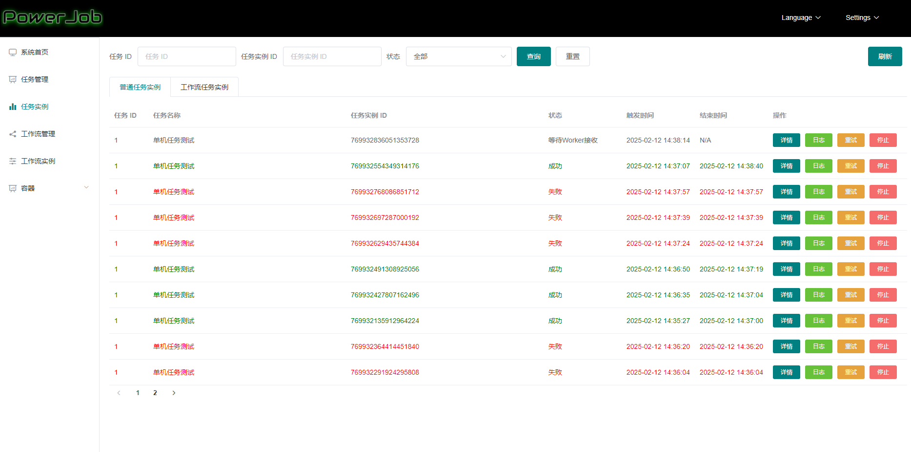

# PowerJob

全新一代分布式任务调度与计算框架

参考链接：

- [官方文档](https://www.yuque.com/powerjob/guidence/processor)
- [安装文档](https://kongyu666.github.io/ops/#/work/kubernetes/service/powerjob/v5.1.1)


## 基础配置

### 添加依赖

```xml
<powerjob.version>5.1.1</powerjob.version>
<!-- PowerJob 依赖 -->
<dependency>
    <groupId>tech.powerjob</groupId>
    <artifactId>powerjob-worker-spring-boot-starter</artifactId>
    <version>${powerjob.version}</version>
</dependency>
```

完整 `pom.xml` 文件如下

```java
<?xml version="1.0" encoding="UTF-8"?>
<project xmlns:xsi="http://www.w3.org/2001/XMLSchema-instance" xmlns="http://maven.apache.org/POM/4.0.0"
         xsi:schemaLocation="http://maven.apache.org/POM/4.0.0 https://maven.apache.org/xsd/maven-4.0.0.xsd">
    <!-- 项目模型版本 -->
    <modelVersion>4.0.0</modelVersion>

    <!-- 项目坐标 -->
    <groupId>local.ateng.java</groupId>
    <artifactId>power-job</artifactId>
    <version>v1.0</version>
    <name>power-job</name>
    <description>PowerJob 全新一代分布式任务调度与计算框架</description>
    <url>http://www.powerjob.tech//</url>

    <!-- 项目属性 -->
    <properties>
        <java.version>21</java.version>
        <project.build.sourceEncoding>UTF-8</project.build.sourceEncoding>
        <project.reporting.outputEncoding>UTF-8</project.reporting.outputEncoding>
        <spring-boot.version>3.4.1</spring-boot.version>
        <maven-compiler.version>3.12.1</maven-compiler.version>
        <lombok.version>1.18.36</lombok.version>
        <hutool.version>5.8.35</hutool.version>
        <powerjob.version>5.1.1</powerjob.version>
    </properties>

    <!-- 项目依赖 -->
    <dependencies>
        <!-- Spring Boot Web Starter: 包含用于构建Web应用程序的Spring Boot依赖项 -->
        <dependency>
            <groupId>org.springframework.boot</groupId>
            <artifactId>spring-boot-starter-web</artifactId>
            <exclusions>
                <exclusion>
                    <artifactId>spring-boot-starter-tomcat</artifactId>
                    <groupId>org.springframework.boot</groupId>
                </exclusion>
            </exclusions>
        </dependency>
        <!-- Web 容器使用 undertow 性能更强 -->
        <dependency>
            <groupId>org.springframework.boot</groupId>
            <artifactId>spring-boot-starter-undertow</artifactId>
        </dependency>

        <!-- Spring Boot Starter Test: 包含用于测试Spring Boot应用程序的依赖项 -->
        <dependency>
            <groupId>org.springframework.boot</groupId>
            <artifactId>spring-boot-starter-test</artifactId>
            <scope>test</scope>
        </dependency>

        <!-- Lombok: 简化Java代码编写的依赖项 -->
        <!-- https://mvnrepository.com/artifact/org.projectlombok/lombok -->
        <dependency>
            <groupId>org.projectlombok</groupId>
            <artifactId>lombok</artifactId>
            <version>${lombok.version}</version>
            <scope>provided</scope>
        </dependency>

        <!-- Hutool: Java工具库，提供了许多实用的工具方法 -->
        <dependency>
            <groupId>cn.hutool</groupId>
            <artifactId>hutool-all</artifactId>
            <version>${hutool.version}</version>
        </dependency>

        <!-- PowerJob 依赖 -->
        <dependency>
            <groupId>tech.powerjob</groupId>
            <artifactId>powerjob-worker-spring-boot-starter</artifactId>
            <version>${powerjob.version}</version>
        </dependency>

    </dependencies>

    <!-- Spring Boot 依赖管理 -->
    <dependencyManagement>
        <dependencies>
            <dependency>
                <groupId>org.springframework.boot</groupId>
                <artifactId>spring-boot-dependencies</artifactId>
                <version>${spring-boot.version}</version>
                <type>pom</type>
                <scope>import</scope>
            </dependency>
        </dependencies>
    </dependencyManagement>

    <!-- 插件仓库配置 -->
    <repositories>
        <!-- Central Repository -->
        <repository>
            <id>central</id>
            <name>阿里云中央仓库</name>
            <url>https://maven.aliyun.com/repository/central</url>
            <!--<name>Maven官方中央仓库</name>
            <url>https://repo.maven.apache.org/maven2/</url>-->
        </repository>
    </repositories>

    <!-- 构建配置 -->
    <build>
        <finalName>${project.name}-${project.version}</finalName>
        <plugins>
            <!-- Maven 编译插件 -->
            <plugin>
                <groupId>org.apache.maven.plugins</groupId>
                <artifactId>maven-compiler-plugin</artifactId>
                <version>${maven-compiler.version}</version>
                <configuration>
                    <source>${java.version}</source>
                    <target>${java.version}</target>
                    <encoding>${project.build.sourceEncoding}</encoding>
                    <!-- 编译参数 -->
                    <compilerArgs>
                        <!-- 启用Java 8参数名称保留功能 -->
                        <arg>-parameters</arg>
                    </compilerArgs>
                </configuration>
            </plugin>

            <!-- Spring Boot Maven 插件 -->
            <plugin>
                <groupId>org.springframework.boot</groupId>
                <artifactId>spring-boot-maven-plugin</artifactId>
                <version>${spring-boot.version}</version>
                <executions>
                    <execution>
                        <id>repackage</id>
                        <goals>
                            <goal>repackage</goal>
                        </goals>
                    </execution>
                </executions>
            </plugin>
        </plugins>
        <resources>
            <!-- 第一个资源配置块 -->
            <resource>
                <directory>src/main/resources</directory>
                <filtering>false</filtering>
            </resource>
            <!-- 第二个资源配置块 -->
            <resource>
                <directory>src/main/resources</directory>
                <includes>
                    <include>application*</include>
                    <include>bootstrap*.yml</include>
                    <include>common*</include>
                    <include>banner*</include>
                </includes>
                <filtering>true</filtering>
            </resource>
        </resources>
    </build>

</project>
```

### 添加配置文件

```yaml
server:
  port: 19003
  servlet:
    context-path: /
spring:
  main:
    web-application-type: servlet
  application:
    name: ${project.artifactId}
---
logging:
  level:
    root: info
    tech.powerjob: warn
---
# 执行器（powerjob-worker）配置
powerjob:
  worker:
    # akka 工作端口，可选，默认 27777
    port: 32122
    # 接入应用名称，用于分组隔离，推荐填写 本 Java 项目名称
    app-name: power-job
    # 调度服务器地址，IP:Port 或 域名，多值逗号分隔
    server-address: 192.168.1.10:32121
    # 通讯协议，4.3.0 开始支持 HTTP 和 AKKA 两种协议，官方推荐使用 HTTP 协议（注意 server 和 worker 都要开放相应端口）
    protocol: http
    # 持久化方式，可选，默认 disk
    store-strategy: disk
    # 任务返回结果信息的最大长度，超过这个长度的信息会被截断，默认值 8192
    max-result-length: 4096
    # 单个任务追加的工作流上下文最大长度，超过这个长度的会被直接丢弃，默认值 8192
    max-appended-wf-context-length: 4096
    # 同时运行的轻量级任务数量上限
    max-lightweight-task-num: 1024
    # 同时运行的重量级任务数量上限
    max-heavy-task-num: 64
```

### 添加应用

登录到PowerJob Web服务端


#### 创建命名空间


#### 创建应用

和配置文件中的 `powerjob.worker.app-name` 保持一致


## 使用任务

### 单机任务

#### 创建任务代码

```java
package local.ateng.java.powerjob.task;

import cn.hutool.core.date.DateUtil;
import lombok.extern.slf4j.Slf4j;
import org.springframework.stereotype.Component;
import tech.powerjob.worker.core.processor.ProcessResult;
import tech.powerjob.worker.core.processor.TaskContext;
import tech.powerjob.worker.core.processor.sdk.BasicProcessor;
import tech.powerjob.worker.log.OmsLogger;

/**
 * 单机处理器：BasicProcessor
 * 支持 SpringBean 的形式
 *
 * @author 孔余
 * @since 2024-02-20 17:56
 */
@Component
@Slf4j
public class BasicProcessorDemo implements BasicProcessor {

    @Override
    public ProcessResult process(TaskContext context) throws Exception {

        // 在线日志功能，可以直接在控制台查看任务日志，非常便捷
        OmsLogger omsLogger = context.getOmsLogger();
        omsLogger.info("BasicProcessorDemo start to process, current JobParams is {}.", context.getJobParams());

        // TaskContext为任务的上下文信息，包含了在控制台录入的任务元数据，常用字段为
        // jobParams（任务参数，在控制台录入），instanceParams（任务实例参数，通过 OpenAPI 触发的任务实例才可能存在该参数）

        // 进行实际处理...
        log.info("现在的时间是：{}", DateUtil.date());

        // 返回结果，该结果会被持久化到数据库，在前端页面直接查看，极为方便
        return new ProcessResult(true, "result is xxx");
    }
}
```

#### 创建任务


任务创建后会按照规则运行





### 广播任务

#### 创建任务代码

```java
package local.ateng.java.powerjob.task;

import lombok.extern.slf4j.Slf4j;
import org.springframework.stereotype.Component;
import tech.powerjob.worker.core.processor.ProcessResult;
import tech.powerjob.worker.core.processor.TaskContext;
import tech.powerjob.worker.core.processor.TaskResult;
import tech.powerjob.worker.core.processor.sdk.BroadcastProcessor;

import java.util.List;

/**
 * 广播处理器：BroadcastProcessor
 * 支持 SpringBean 的形式
 *
 * @author 孔余
 * @since 2024-02-20 17:56
 */
@Slf4j
@Component
public class BroadcastProcessorDemo implements BroadcastProcessor {

    @Override
    public ProcessResult preProcess(TaskContext taskContext) throws Exception {
        // 预执行，会在所有 worker 执行 process 方法前调用
        log.info("init success");
        return new ProcessResult(true, "init success");
    }

    @Override
    public ProcessResult process(TaskContext context) throws Exception {
        // 撰写整个worker集群都会执行的代码逻辑
        log.info("release resource success");
        return new ProcessResult(true, "release resource success");
    }

    @Override
    public ProcessResult postProcess(TaskContext taskContext, List<TaskResult> taskResults) throws Exception {

        // taskResults 存储了所有worker执行的结果（包括preProcess）
        log.info("process success");
        // 收尾，会在所有 worker 执行完毕 process 方法后调用，该结果将作为最终的执行结果
        return new ProcessResult(true, "process success");
    }
}
```

#### 创建任务


任务创建后会按照规则运行


### 并行任务

#### 创建任务代码

```java
package local.ateng.java.powerjob.task;

import com.google.common.collect.Lists;
import lombok.AllArgsConstructor;
import lombok.Getter;
import lombok.NoArgsConstructor;
import lombok.Setter;
import lombok.extern.slf4j.Slf4j;
import org.springframework.stereotype.Component;
import tech.powerjob.worker.core.processor.ProcessResult;
import tech.powerjob.worker.core.processor.TaskContext;
import tech.powerjob.worker.core.processor.TaskResult;
import tech.powerjob.worker.core.processor.sdk.MapReduceProcessor;

import java.util.List;
import java.util.concurrent.atomic.AtomicLong;

/**
 * 并行处理器：MapReduceProcessor
 *
 * @author 孔余
 * @since 2024-02-21 10:38
 */
@Slf4j
@Component
public class MapReduceProcessorDemo implements MapReduceProcessor {

    @Override
    public ProcessResult process(TaskContext context) throws Exception {
        // 判断是否为根任务
        if (isRootTask()) {

            // 构造子任务
            List<SubTask> subTaskList = Lists.newLinkedList();

            /*
             * 子任务的构造由开发者自己定义
             * eg. 现在需要从文件中读取100W个ID，并处理数据库中这些ID对应的数据，那么步骤如下：
             * 1. 根任务（RootTask）读取文件，流式拉取100W个ID，并按1000个一批的大小组装成子任务进行派发
             * 2. 非根任务获取子任务，完成业务逻辑的处理
             */

            // 调用 map 方法，派发子任务（map 可能会失败并抛出异常，做好业务操作）
            map(subTaskList, "DATA_PROCESS_TASK");
            return new ProcessResult(true, "ROOT_PROCESS_SUCCESS");
        }

        // 非子任务，可根据 subTask 的类型 或 TaskName 来判断分支
        if (context.getSubTask() instanceof SubTask) {
            // 执行子任务，注：子任务人可以 map 产生新的子任务，可以构建任意级的 MapReduce 处理器
            return new ProcessResult(true, "PROCESS_SUB_TASK_SUCCESS");
        }

        return new ProcessResult(false, "UNKNOWN_BUG");
    }

    @Override
    public ProcessResult reduce(TaskContext taskContext, List<TaskResult> taskResults) {

        // 所有 Task 执行结束后，reduce 将会被执行
        // taskResults 保存了所有子任务的执行结果

        // 用法举例，统计执行结果
        AtomicLong successCnt = new AtomicLong(0);
        taskResults.forEach(tr -> {
            if (tr.isSuccess()) {
                successCnt.incrementAndGet();
            }
        });
        // 该结果将作为任务最终的执行结果
        return new ProcessResult(true, "success task num:" + successCnt.get());
    }

    // 自定义的子任务
    @Getter
    @Setter
    @NoArgsConstructor
    @AllArgsConstructor
    private static class SubTask {
        private Long siteId;
        private List<Long> idList;
    }
}
```

#### 创建任务


任务创建后会按照规则运行


