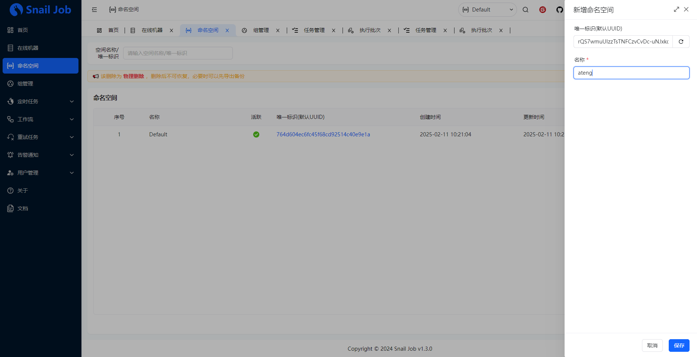
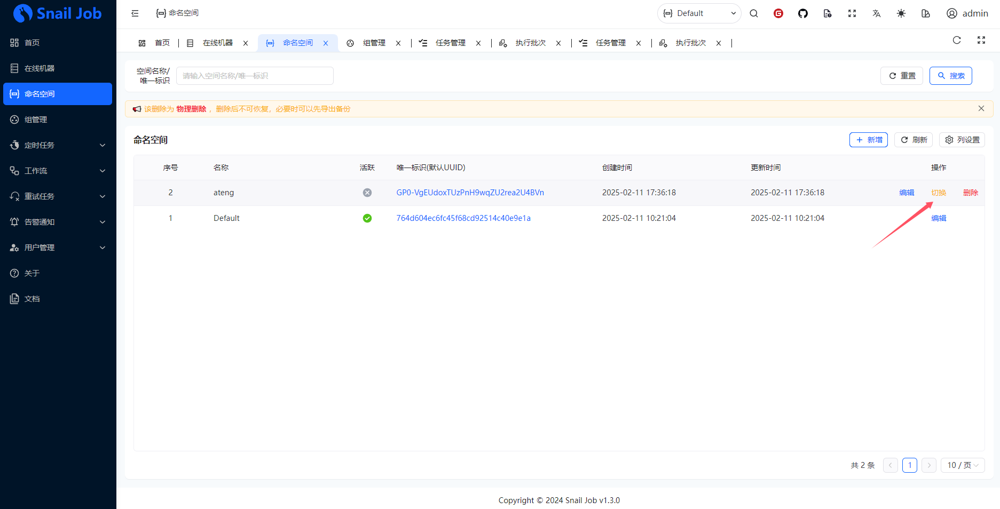
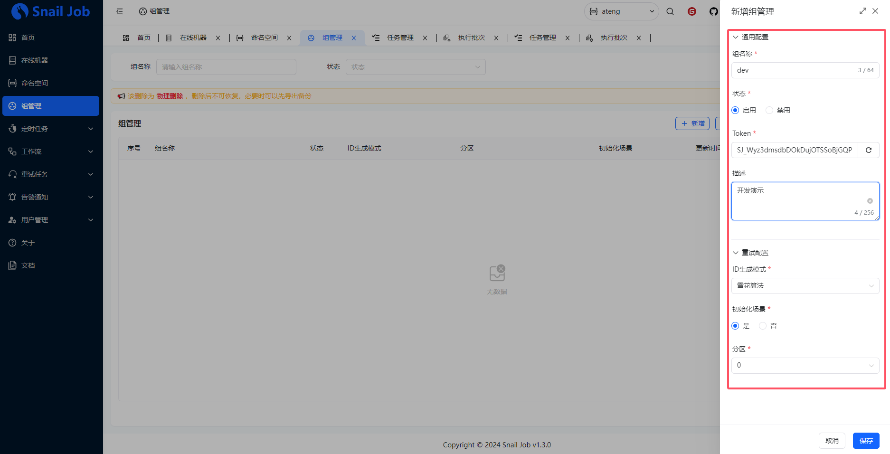
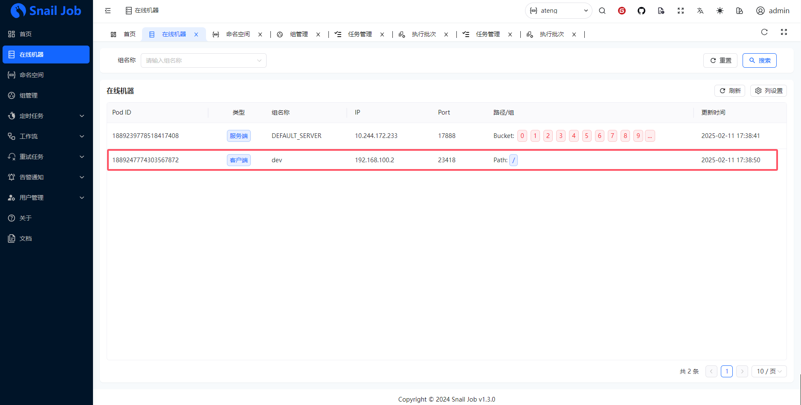
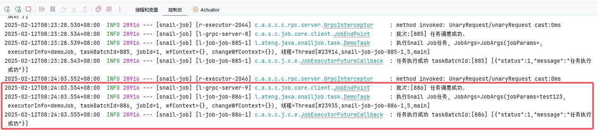
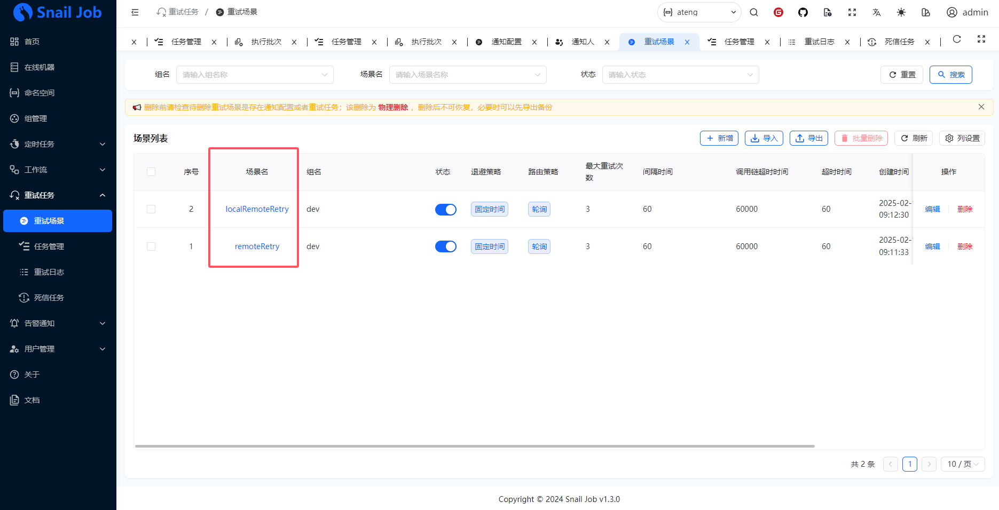
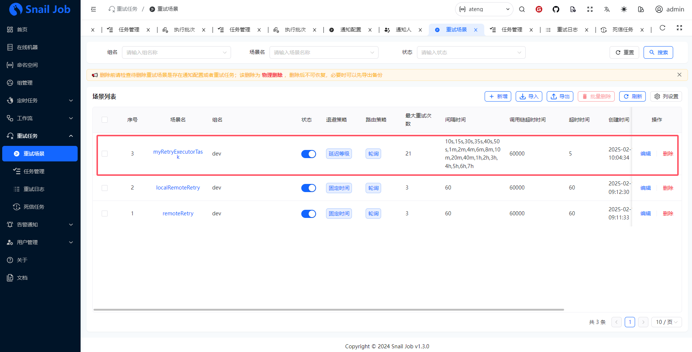

# Snail Job

🚀 灵活，可靠和快速的分布式任务重试和分布式任务调度平台

参考文档：

- [官方文档](https://snailjob.opensnail.com/)
- [安装文档](https://atengk.github.io/ops/#/work/kubernetes/service/snail-job/v1.3.0/)


## 基础配置

### 添加依赖

```xml
<properties>
    <snail-job.version>1.3.0</snail-job.version>
</properties>
<dependencies>
    <!--Snail Job：灵活，可靠和快速的分布式任务重试和分布式任务调度平台-->
    <dependency>
        <groupId>com.aizuda</groupId>
        <artifactId>snail-job-client-starter</artifactId>
        <version>${snail-job.version}</version>
    </dependency>
    <!--重试模块-->
    <dependency>
        <groupId>com.aizuda</groupId>
        <artifactId>snail-job-client-retry-core</artifactId>
        <version>${snail-job.version}</version>
    </dependency>
    <!--定时任务-->
    <dependency>
        <groupId>com.aizuda</groupId>
        <artifactId>snail-job-client-job-core</artifactId>
        <version>${snail-job.version}</version>
    </dependency>
</dependencies>
```

完整的 `pom.xml` 文件如下

```xml
<?xml version="1.0" encoding="UTF-8"?>
<project xmlns:xsi="http://www.w3.org/2001/XMLSchema-instance" xmlns="http://maven.apache.org/POM/4.0.0"
         xsi:schemaLocation="http://maven.apache.org/POM/4.0.0 https://maven.apache.org/xsd/maven-4.0.0.xsd">
    <!-- 项目模型版本 -->
    <modelVersion>4.0.0</modelVersion>

    <!-- 项目坐标 -->
    <groupId>local.ateng.java</groupId>
    <artifactId>snail-job</artifactId>
    <version>v1.0</version>
    <name>snail-job</name>
    <description>SnailJob 🚀 灵活，可靠和快速的分布式任务重试和分布式任务调度平台</description>
    <url>https://snailjob.opensnail.com/</url>

    <!-- 项目属性 -->
    <properties>
        <java.version>21</java.version>
        <project.build.sourceEncoding>UTF-8</project.build.sourceEncoding>
        <project.reporting.outputEncoding>UTF-8</project.reporting.outputEncoding>
        <spring-boot.version>3.4.1</spring-boot.version>
        <maven-compiler.version>3.12.1</maven-compiler.version>
        <lombok.version>1.18.36</lombok.version>
        <snail-job.version>1.3.0</snail-job.version>
        <hutool.version>5.8.35</hutool.version>
    </properties>

    <!-- 项目依赖 -->
    <dependencies>
        <!-- Spring Boot Web Starter: 包含用于构建Web应用程序的Spring Boot依赖项 -->
        <dependency>
            <groupId>org.springframework.boot</groupId>
            <artifactId>spring-boot-starter-web</artifactId>
            <exclusions>
                <exclusion>
                    <artifactId>spring-boot-starter-tomcat</artifactId>
                    <groupId>org.springframework.boot</groupId>
                </exclusion>
            </exclusions>
        </dependency>
        <!-- Web 容器使用 undertow 性能更强 -->
        <dependency>
            <groupId>org.springframework.boot</groupId>
            <artifactId>spring-boot-starter-undertow</artifactId>
        </dependency>

        <!-- Spring Boot Starter Test: 包含用于测试Spring Boot应用程序的依赖项 -->
        <dependency>
            <groupId>org.springframework.boot</groupId>
            <artifactId>spring-boot-starter-test</artifactId>
            <scope>test</scope>
        </dependency>

        <!-- Lombok: 简化Java代码编写的依赖项 -->
        <!-- https://mvnrepository.com/artifact/org.projectlombok/lombok -->
        <dependency>
            <groupId>org.projectlombok</groupId>
            <artifactId>lombok</artifactId>
            <version>${lombok.version}</version>
            <scope>provided</scope>
        </dependency>

        <!-- Hutool: Java工具库，提供了许多实用的工具方法 -->
        <dependency>
            <groupId>cn.hutool</groupId>
            <artifactId>hutool-all</artifactId>
            <version>${hutool.version}</version>
        </dependency>

        <!--Snail Job：灵活，可靠和快速的分布式任务重试和分布式任务调度平台-->
        <dependency>
            <groupId>com.aizuda</groupId>
            <artifactId>snail-job-client-starter</artifactId>
            <version>${snail-job.version}</version>
        </dependency>
        <!--重试模块-->
        <dependency>
            <groupId>com.aizuda</groupId>
            <artifactId>snail-job-client-retry-core</artifactId>
            <version>${snail-job.version}</version>
        </dependency>
        <!--定时任务-->
        <dependency>
            <groupId>com.aizuda</groupId>
            <artifactId>snail-job-client-job-core</artifactId>
            <version>${snail-job.version}</version>
        </dependency>

    </dependencies>

    <!-- Spring Boot 依赖管理 -->
    <dependencyManagement>
        <dependencies>
            <dependency>
                <groupId>org.springframework.boot</groupId>
                <artifactId>spring-boot-dependencies</artifactId>
                <version>${spring-boot.version}</version>
                <type>pom</type>
                <scope>import</scope>
            </dependency>
        </dependencies>
    </dependencyManagement>

    <!-- 插件仓库配置 -->
    <repositories>
        <!-- Central Repository -->
        <repository>
            <id>central</id>
            <name>阿里云中央仓库</name>
            <url>https://maven.aliyun.com/repository/central</url>
            <!--<name>Maven官方中央仓库</name>
            <url>https://repo.maven.apache.org/maven2/</url>-->
        </repository>
    </repositories>

    <!-- 构建配置 -->
    <build>
        <finalName>${project.name}-${project.version}</finalName>
        <plugins>
            <!-- Maven 编译插件 -->
            <plugin>
                <groupId>org.apache.maven.plugins</groupId>
                <artifactId>maven-compiler-plugin</artifactId>
                <version>${maven-compiler.version}</version>
                <configuration>
                    <source>${java.version}</source>
                    <target>${java.version}</target>
                    <encoding>${project.build.sourceEncoding}</encoding>
                    <!-- 编译参数 -->
                    <compilerArgs>
                        <!-- 启用Java 8参数名称保留功能 -->
                        <arg>-parameters</arg>
                    </compilerArgs>
                </configuration>
            </plugin>

            <!-- Spring Boot Maven 插件 -->
            <plugin>
                <groupId>org.springframework.boot</groupId>
                <artifactId>spring-boot-maven-plugin</artifactId>
                <version>${spring-boot.version}</version>
                <executions>
                    <execution>
                        <id>repackage</id>
                        <goals>
                            <goal>repackage</goal>
                        </goals>
                    </execution>
                </executions>
            </plugin>
        </plugins>
        <resources>
            <!-- 第一个资源配置块 -->
            <resource>
                <directory>src/main/resources</directory>
                <filtering>false</filtering>
            </resource>
            <!-- 第二个资源配置块 -->
            <resource>
                <directory>src/main/resources</directory>
                <includes>
                    <include>application*</include>
                    <include>bootstrap*.yml</include>
                    <include>common*</include>
                    <include>banner*</include>
                </includes>
                <filtering>true</filtering>
            </resource>
        </resources>
    </build>

</project>
```

### 服务端创建命名空间和组

#### 新增命名空间





#### 新增组



### 编辑配置

```yaml
server:
  port: 19001
  servlet:
    context-path: /
spring:
  main:
    web-application-type: servlet
  application:
    name: ${project.artifactId}
---
# Snail Job
snail-job:
  # 任务调度服务器信息
  server:
    # 服务器IP地址（或域名）；集群时建议通过 nginx 做负载均衡
    host: 192.168.1.10
    # 服务器通讯端口（不是后台管理页面服务端口）
    port: 32682
  # 通知类型
  rpc-type: grpc
  # 命名空间 【上面配置的空间的唯一标识】
  namespace: GP0-VgEUdoxTUzPnH9wqZU2rea2U4BVn
  # 接入组名【上面配置的组名称】注意: 若通过注解配置了这里的配置不生效
  group: dev
  # 接入组 token 【上面配置的token信息】
  token: SJ_Wyz3dmsdbDOkDujOTSSoBjGQP1BMsVnj
  # 客户端绑定IP，必须服务器可以访问到；默认自动推断，在服务器无法调度客户端时需要手动配置
  #host: 127.0.0.1
  # 客户端通讯端口，默认 1789，设置客户端client为-1时，支持随机端口号
  port: -1
```

### 启动Snail Job

```java
package local.ateng.java.snailjob;

import com.aizuda.snailjob.client.starter.EnableSnailJob;
import org.springframework.boot.SpringApplication;
import org.springframework.boot.autoconfigure.SpringBootApplication;

@SpringBootApplication
@EnableSnailJob
public class TaskSnailJobApplication {

    public static void main(String[] args) {
        SpringApplication.run(TaskSnailJobApplication.class, args);
    }

}
```




## 定时任务

参考：[官方文档](https://snailjob.opensnail.com/docs/guide/job/job_executor.html)

### 创建执行器

```java
package local.ateng.java.snailjob.task;

import com.aizuda.snailjob.client.job.core.annotation.JobExecutor;
import com.aizuda.snailjob.client.job.core.dto.JobArgs;
import com.aizuda.snailjob.client.model.ExecuteResult;
import lombok.extern.slf4j.Slf4j;
import org.springframework.stereotype.Component;

/**
 * Snail Job 执行器
 *
 * @author 孔余
 * @email 2385569970@qq.com
 * @since 2025-02-11
 */
@Component
@Slf4j
public class DemoTask {

    @JobExecutor(name = "demoJob")
    public ExecuteResult jobExecute(JobArgs jobArgs) {
        log.info("执行Snail Job任务, JobArgs={}, 线程={}", jobArgs, Thread.currentThread());
        return ExecuteResult.success();
    }

}
```

### 创建定时任务

在Snail Job上创建一个 `任务测试` 的定时任务


任务执行后如下图所示



## 重试任务

参考：[官方文档](https://snailjob.opensnail.com/docs/guide/retry/retryable_annotation.html)

### 创建重试服务

```java
package local.ateng.java.snailjob.service;

import cn.hutool.core.util.RandomUtil;
import com.aizuda.snailjob.client.core.annotation.Retryable;
import com.aizuda.snailjob.client.core.retryer.RetryType;
import lombok.extern.slf4j.Slf4j;
import org.springframework.stereotype.Component;

@Component
@Slf4j
public class RetryService {

    // 本地重试
    @Retryable(scene = "localRetry", localTimes = 5, localInterval = 3, retryStrategy = RetryType.ONLY_LOCAL)
    public void localRetry() {
        myTask("localRetry");
    }

    // 远程重试
    @Retryable(scene = "remoteRetry", retryStrategy = RetryType.ONLY_REMOTE)
    public void remoteRetry() {
        myTask("remoteRetry");
    }

    // 先本地重试，再远程重试
    @Retryable(scene = "localRemoteRetry", localTimes = 5, localInterval = 3, retryStrategy = RetryType.LOCAL_REMOTE)
    public void localRemoteRetry() {
        myTask("localRemoteRetry");
    }

    private void myTask(String type) {
        log.info("[重试任务][{}] 运行任务...", type);
        int num = RandomUtil.randomInt(0, 3);
        log.info("[重试任务][{}] 计算结果：{}", type, 100 / num);
    }

}
```

### 创建重试接口

```java
package local.ateng.java.snailjob.controller;

import local.ateng.java.snailjob.service.RetryService;
import lombok.RequiredArgsConstructor;
import org.springframework.beans.factory.annotation.Autowired;
import org.springframework.web.bind.annotation.GetMapping;
import org.springframework.web.bind.annotation.RequestMapping;
import org.springframework.web.bind.annotation.RestController;

@RestController
@RequestMapping("/retry")
@RequiredArgsConstructor(onConstructor = @__(@Autowired))
public class RetryController {
    private final RetryService retryService;

    @GetMapping("/localRetry")
    public String localRetryApi() {
        retryService.localRetry();
        return "ok";
    }

    @GetMapping("/remoteRetry")
    public String remoteRetryApi() {
        retryService.remoteRetry();
        return "ok";
    }

    @GetMapping("/localRemoteRetry")
    public String localRemoteRetryApi() {
        retryService.localRemoteRetry();
        return "ok";
    }

}
```

### 添加重试场景

添加对应服务注解中的scene场景名称，后续调用接口触发任务的重试



## 手动创建重试任务

参考：[官方文档](https://snailjob.opensnail.com/docs/guide/retry/ExecutorMethodRegister.html)

### 创建VO

```java
package local.ateng.java.snailjob.vo;

import lombok.AllArgsConstructor;
import lombok.Data;
import lombok.NoArgsConstructor;

import java.time.LocalDateTime;

@Data
@AllArgsConstructor
@NoArgsConstructor
public class MyUserVo {
    private Long id;
    private String name;
    private Integer age;
    private LocalDateTime startTime;
    private LocalDateTime endTime;
}
```

### 创建ExecutorMethodRegister

```java
package local.ateng.java.snailjob.task;

import cn.hutool.core.convert.Convert;
import com.aizuda.snailjob.client.core.annotation.ExecutorMethodRegister;
import com.aizuda.snailjob.client.core.strategy.ExecutorMethod;
import local.ateng.java.snailjob.vo.MyUserVo;
import lombok.extern.slf4j.Slf4j;

@ExecutorMethodRegister(scene = RetryExecutorTask.SCENE)
@Slf4j
public class RetryExecutorTask implements ExecutorMethod {
    /**
     * 自定义场景值
     */
    public final static String SCENE = "myRetryExecutorTask";

    @Override
    public Object doExecute(Object params) {
        // 将特定类型的 Object 对象指定为 Object[]
        Object[] args = (Object[]) params;
        MyUserVo myUserVo = Convert.convert(MyUserVo.class, args[0]);
        log.info("进入手动重试方法,参数信息是{}", myUserVo);
        return true;
    }
}
```

### 执行任务服务

```java
package local.ateng.java.snailjob.service;

import com.aizuda.snailjob.client.core.retryer.RetryTaskTemplateBuilder;
import com.aizuda.snailjob.client.core.retryer.SnailJobTemplate;
import local.ateng.java.snailjob.task.RetryExecutorTask;
import local.ateng.java.snailjob.vo.MyUserVo;
import org.springframework.stereotype.Component;

import java.time.LocalDateTime;

@Component
public class RetryExecutorService {

    public void myExecutorMethod(){
        MyUserVo userVo = new MyUserVo(10010L, "阿腾", 25, LocalDateTime.now(), LocalDateTime.now().plusDays(1));
        SnailJobTemplate snailJobTemplate = RetryTaskTemplateBuilder.newBuilder()
                // 手动指定场景名称
                .withScene(RetryExecutorTask.SCENE)
                // 指定要执行的任务
                .withExecutorMethod(RetryExecutorTask.class)
                // 指定参数
                .withParam(userVo)
                .build();
        // 执行模板
        snailJobTemplate.executeRetry();
    }

}
```

### 添加接口

```java
@RestController
@RequestMapping("/retry")
@RequiredArgsConstructor(onConstructor = @__(@Autowired))
public class RetryController {
    private final RetryExecutorService retryExecutorService;

    @GetMapping("/retryExecutor")
    public String retryExecutor() {
        retryExecutorService.myExecutorMethod();
        return "ok";
    }

}
```

### 调用接口

调用接口执行任务，然后就会自动创建一个 `重试场景`，最后将该任务调度节点执行。

```
curl http://127.0.0.1:19002/retry/retryExecutor
```




## OpenAPI

参考：[官方文档](https://snailjob.opensnail.com/docs/guide/openapi/openapi_overview.html)

### 创建任务

编辑代码

```java
    /**
     * 新增集群模式的任务
     *
     * @param jobName 任务名称
     * @return 任务id
     */
    @GetMapping("/addClusterJob")
    public Long addClusterJob(String jobName) {
        return SnailJobOpenApi.addClusterJob()
                .setRouteKey(AllocationAlgorithmEnum.RANDOM)
                .setJobName(jobName)
                .setExecutorInfo("testJobExecutor")
                .setExecutorTimeout(30)
                .setDescription("add")
                .setBlockStrategy(BlockStrategyEnum.DISCARD)
                .setMaxRetryTimes(1)
                .setTriggerType(TriggerTypeEnum.SCHEDULED_TIME)
                .setTriggerInterval(String.valueOf(60))
                .addArgsStr("测试数据", 123)
                .addArgsStr("addArg", "args")
                .setRetryInterval(3)
                .execute();
    }
```

调用接口

```
C:\Users\admin>curl http://127.0.0.1:19002/openapi/addClusterJob?jobName=openapiJob
2
```


### 查询任务

编辑代码

```java
    /**
     * 查看任务详情
     *
     * @param jobId
     * @return 任务详情
     */
    @GetMapping("/queryJob")
    public JobResponseVO queryJob(Long jobId){
        return SnailJobOpenApi.getJobDetail(jobId).execute();
    }
```

调用接口

```
C:\Users\admin>curl http://127.0.0.1:19002/openapi/queryJob?jobId=2
{"id":2,"groupName":"dev","jobName":"openapiJob","argsStr":"{\"测试数据\":123,\"addArg\":\"args\"}","extAttrs":"","nextTriggerAt":"2025-02-12T15:11:57","jobStatus":1,"routeKey":2,"executorType":1,"executorInfo":"testJobExecutor","triggerType":2,"triggerInterval":"60","blockStrategy":1,"executorTimeout":30,"maxRetryTimes":1,"retryInterval":3,"taskType":1,"parallelNum":1,"description":"add","createDt":"2025-02-12T15:08:57","updateDt":"2025-02-12T15:10:51"}
```

